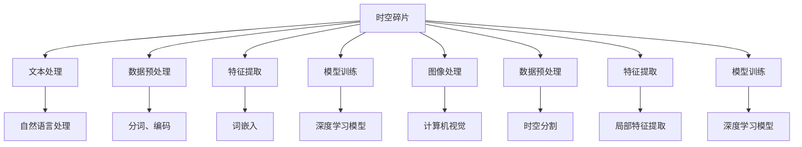
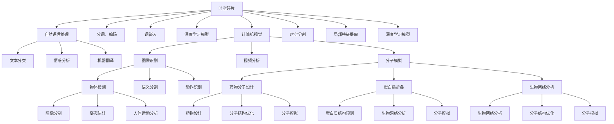

                 

# Token与时空碎片的详细技术对比

> 关键词：Token, 时空碎片, 深度学习, 自然语言处理(NLP), 计算机视觉, 图神经网络(GNN), 强化学习, 多媒体数据

## 1. 背景介绍

在深度学习领域，Token和时空碎片（Spatiotemporal Frags）是两种重要的数据表示方式，分别适用于不同的应用场景和技术背景。Token主要用于自然语言处理(NLP)领域，而时空碎片则更多应用于计算机视觉和图神经网络(GNN)等场景。本文将对这两种技术进行详细对比，探讨其基本概念、算法原理、操作步骤、应用领域以及未来发展趋势，希望能为读者提供一个全面的技术视角。

### 1.1 问题由来

随着深度学习技术的不断进步，Token和时空碎片技术也得到了广泛的应用和研究。Token技术在NLP领域大放异彩，被广泛应用于文本分类、情感分析、机器翻译等任务中。时空碎片技术则在图像识别、视频处理、分子模拟等场景中发挥了重要作用，显著提升了深度学习模型的性能。

然而，Token和时空碎片之间也存在着一些差异和限制，需要我们在选择技术时加以考虑。本文将通过对比这两种技术，帮助读者更好地理解它们的特点和适用场景，从而在实际应用中做出更加合理的选择。

### 1.2 问题核心关键点

Token和时空碎片的核心关键点主要包括以下几个方面：

- 基本概念和原理：Token是自然语言处理中常用的数据表示方式，用于处理文本序列；时空碎片则是计算机视觉和图神经网络中常用的数据表示方式，用于处理多维时空数据。
- 算法步骤和流程：Token和时空碎片在算法步骤和流程上有着显著的不同，包括数据预处理、特征提取、模型训练等。
- 优缺点和适用领域：Token和时空碎片各有优缺点，分别适用于不同领域和任务。
- 未来发展趋势和挑战：Token和时空碎片技术的发展方向和面临的挑战，需要我们在实践中不断探索和优化。

这些关键点将贯穿本文的各个章节，帮助我们全面理解Token和时空碎片技术的对比。

## 2. 核心概念与联系

### 2.1 核心概念概述

Token和时空碎片作为两种重要的数据表示方式，它们的基本概念和原理如下：

- **Token**：在自然语言处理中，Token是指文本序列中一个小的、有意义的单位，如单词、短语或句子片段。Token能够将复杂的文本序列转化为易于处理的形式，便于深度学习模型的理解和分析。Token通常采用one-hot编码或词嵌入向量等方式进行表示。

- **时空碎片（Spatiotemporal Frags）**：在计算机视觉和图神经网络中，时空碎片是指在图像、视频或分子等多维时空数据中，将时间和空间信息分割成多个小片段，每个片段包含一定的时空信息。时空碎片能够有效捕捉数据的局部和全局特征，提升模型的表达能力和泛化能力。时空碎片通常采用卷积神经网络（CNN）或图神经网络（GNN）等模型进行处理。

### 2.2 概念间的关系

Token和时空碎片之间的联系主要体现在数据表示和处理方式上：

- 两者都是将复杂数据转化为易于处理的单元，Token处理文本数据，时空碎片处理多维时空数据。
- 两者在算法步骤和流程上有着相似之处，包括数据预处理、特征提取和模型训练等步骤。
- 两者的应用场景和任务有所不同，Token主要用于文本处理，时空碎片主要用于图像、视频和分子模拟等领域。

这些关系可以通过以下Mermaid流程图来展示：



这个流程图展示了Token和时空碎片在自然语言处理和计算机视觉中的应用流程。

### 2.3 核心概念的整体架构

最后，我们用一个综合的流程图来展示Token和时空碎片在深度学习中的整体架构：



这个综合流程图展示了Token和时空碎片在多个领域中的应用。

## 3. 核心算法原理 & 具体操作步骤
### 3.1 算法原理概述

Token和时空碎片的算法原理有着显著的区别，但也有一些共通之处。

- **Token算法原理**：Token算法主要基于自然语言处理技术，包括文本编码、语义分析、情感计算等。Token算法通过将文本序列转化为向量形式，使得深度学习模型能够理解和分析文本数据。Token算法通常采用循环神经网络（RNN）或卷积神经网络（CNN）等模型进行处理。

- **时空碎片算法原理**：时空碎片算法主要基于计算机视觉和图神经网络技术，包括时空分割、局部特征提取、全局特征融合等。时空碎片算法通过将多维时空数据分割成多个小片段，使得深度学习模型能够有效捕捉局部和全局特征，提升模型的表达能力和泛化能力。时空碎片算法通常采用卷积神经网络（CNN）或图神经网络（GNN）等模型进行处理。

### 3.2 算法步骤详解

Token和时空碎片的算法步骤也有所不同，下面我们将详细介绍每种算法的基本步骤：

#### Token算法步骤详解

1. **数据预处理**：对文本数据进行分词、去停用词、标准化等处理，将文本转换为Token序列。
2. **特征提取**：使用词嵌入（Word Embedding）或字嵌入（Character Embedding）等技术将Token序列转换为向量形式。
3. **模型训练**：使用深度学习模型（如RNN、CNN、Transformer等）对Token向量进行训练，构建文本分类、情感分析等模型。

#### 时空碎片算法步骤详解

1. **数据预处理**：对多维时空数据进行时空分割，将数据划分为多个小片段。
2. **特征提取**：使用卷积神经网络（CNN）或图神经网络（GNN）等模型对时空片段进行特征提取，捕捉局部和全局特征。
3. **模型训练**：使用深度学习模型对时空特征进行训练，构建图像识别、视频分析等模型。

### 3.3 算法优缺点

Token和时空碎片算法各有优缺点，下面我们将详细分析它们的优缺点：

- **Token算法优缺点**：
  - **优点**：Token算法适用于自然语言处理领域，能够有效处理文本数据，便于模型理解和分析。Token算法通过分词和词嵌入等技术，使得文本数据能够被转化为易于处理的向量形式。
  - **缺点**：Token算法对于文本数据的处理方式较为单一，无法有效处理图像、视频等多维数据。此外，Token算法在处理长文本时容易产生高维稀疏性问题。

- **时空碎片算法优缺点**：
  - **优点**：时空碎片算法适用于计算机视觉和图神经网络领域，能够有效处理多维时空数据，捕捉局部和全局特征。时空碎片算法通过卷积神经网络（CNN）或图神经网络（GNN）等模型，使得数据能够被有效处理和表达。
  - **缺点**：时空碎片算法对于非结构化数据（如文本、音频等）处理能力较弱。此外，时空碎片算法在处理大规模数据时，需要大量的计算资源和时间。

### 3.4 算法应用领域

Token和时空碎片算法在各自领域中有着广泛的应用，下面我们将详细介绍它们的应用领域：

- **Token应用领域**：Token算法主要应用于自然语言处理领域，包括文本分类、情感分析、机器翻译、问答系统等任务。Token算法在处理文本数据时，能够有效捕捉语义信息，提升模型的理解能力和表达能力。
- **时空碎片应用领域**：时空碎片算法主要应用于计算机视觉和图神经网络领域，包括图像识别、视频分析、分子模拟等任务。时空碎片算法在处理多维时空数据时，能够有效捕捉局部和全局特征，提升模型的表达能力和泛化能力。

## 4. 数学模型和公式 & 详细讲解 & 举例说明

### 4.1 数学模型构建

#### Token数学模型构建

Token算法的数学模型主要基于文本编码和语义分析。在文本编码方面，常用的模型包括Word2Vec、GloVe、BERT等。在语义分析方面，常用的模型包括RNN、LSTM、Transformer等。

#### 时空碎片数学模型构建

时空碎片算法的数学模型主要基于卷积神经网络（CNN）和图神经网络（GNN）。在CNN模型中，常用的卷积操作包括2D卷积和3D卷积。在GNN模型中，常用的算法包括GCN、GAT等。

### 4.2 公式推导过程

#### Token公式推导过程

在Token算法中，常用的公式包括Word2Vec的公式和Transformer的公式。以Word2Vec的公式为例，其推导过程如下：

$$
\begin{aligned}
&\mathbf{w} = \mathbf{X} \mathbf{V} \\
&\mathbf{c} = \tanh(\mathbf{w}^T \mathbf{u} + \mathbf{b}) \\
&\mathbf{h} = \sigma(\mathbf{W} \mathbf{c} + \mathbf{b})
\end{aligned}
$$

其中，$\mathbf{w}$ 表示词向量，$\mathbf{X}$ 表示文本矩阵，$\mathbf{V}$ 表示嵌入矩阵，$\mathbf{u}$ 表示隐层向量，$\mathbf{b}$ 表示偏置项，$\mathbf{W}$ 表示权重矩阵，$\mathbf{h}$ 表示隐层向量。

#### 时空碎片公式推导过程

在时空碎片算法中，常用的公式包括卷积神经网络的公式和图神经网络的公式。以卷积神经网络的公式为例，其推导过程如下：

$$
\begin{aligned}
&\mathbf{f} = \max_{i}(\mathbf{w}^T \mathbf{f}_i + \mathbf{b}) \\
&\mathbf{h} = \sigma(\mathbf{W} \mathbf{f} + \mathbf{b})
\end{aligned}
$$

其中，$\mathbf{f}$ 表示特征向量，$\mathbf{f}_i$ 表示卷积核，$\mathbf{w}$ 表示权重矩阵，$\mathbf{b}$ 表示偏置项，$\mathbf{W}$ 表示权重矩阵，$\mathbf{h}$ 表示特征图。

### 4.3 案例分析与讲解

#### Token案例分析

以BERT为例，其通过自监督学习的方式，在大规模无标签文本数据上进行预训练，学习到丰富的语言表示。然后，在具体的文本分类任务中，通过微调BERT模型，将其适应到特定的文本分类任务。例如，在情感分析任务中，可以使用微调的BERT模型对输入的文本进行分类，得到正向或负向的情感标签。

#### 时空碎片案例分析

以时空碎片算法在视频分析中的应用为例，通过对视频帧进行时空分割，将视频帧划分为多个小片段，然后使用卷积神经网络（CNN）对每个片段进行特征提取。最后，将所有片段的特征向量拼接起来，得到整个视频的时空特征向量。例如，在动作识别任务中，可以使用时空碎片算法对视频进行特征提取，然后通过分类器对视频的时空特征向量进行分类，得到视频中的动作标签。

## 5. 项目实践：代码实例和详细解释说明

### 5.1 开发环境搭建

在进行Token和时空碎片算法实践前，需要先搭建好开发环境。以下是使用Python进行TensorFlow开发的环境配置流程：

1. 安装Anaconda：从官网下载并安装Anaconda，用于创建独立的Python环境。

2. 创建并激活虚拟环境：
```bash
conda create -n tf-env python=3.8 
conda activate tf-env
```

3. 安装TensorFlow：根据CUDA版本，从官网获取对应的安装命令。例如：
```bash
conda install tensorflow -c conda-forge
```

4. 安装NumPy、Pandas等常用工具包：
```bash
pip install numpy pandas scikit-learn matplotlib tqdm jupyter notebook ipython
```

完成上述步骤后，即可在`tf-env`环境中开始Token和时空碎片算法实践。

### 5.2 源代码详细实现

我们以图像分类任务为例，展示使用TensorFlow进行时空碎片算法的代码实现。

```python
import tensorflow as tf
from tensorflow.keras import layers

# 定义时空碎片数据生成函数
def generate_spatiotemporal_fragments(image, max_fragments=10, fragment_size=(10, 10), stride=(5, 5)):
    fragments = []
    for x in range(0, image.shape[0] - fragment_size[0] + 1, stride[0]):
        for y in range(0, image.shape[1] - fragment_size[1] + 1, stride[1]):
            fragments.append(image[x:x+fragment_size[0], y:y+fragment_size[1]])
    return fragments

# 定义CNN模型
model = tf.keras.Sequential([
    layers.Conv2D(32, (3, 3), activation='relu', input_shape=(max_fragments, fragment_size[0], fragment_size[1], 1)),
    layers.MaxPooling2D((2, 2)),
    layers.Flatten(),
    layers.Dense(10, activation='softmax')
])

# 加载数据集
(train_images, train_labels), (test_images, test_labels) = tf.keras.datasets.mnist.load_data()
train_images = train_images.reshape((train_images.shape[0], 28, 28, 1))
test_images = test_images.reshape((test_images.shape[0], 28, 28, 1))

# 数据预处理
train_fragments = generate_spatiotemporal_fragments(train_images)
train_fragments = tf.keras.utils.to_categorical(train_fragments, num_classes=10)

test_fragments = generate_spatiotemporal_fragments(test_images)
test_fragments = tf.keras.utils.to_categorical(test_fragments, num_classes=10)

# 模型训练
model.compile(optimizer='adam', loss='categorical_crossentropy', metrics=['accuracy'])
model.fit(train_fragments, train_labels, epochs=10, validation_data=(test_fragments, test_labels))
```

### 5.3 代码解读与分析

让我们再详细解读一下关键代码的实现细节：

**generate_spatiotemporal_fragments函数**：
- 定义了一个函数，用于生成多维时空数据的时空片段。
- 函数接收图像数据、片段数、片段大小和步长作为参数。
- 通过循环遍历图像，将图像划分为多个大小为fragment_size的小片段，每个片段包含一定的时空信息。

**CNN模型定义**：
- 定义了一个卷积神经网络模型，包括卷积层、池化层和全连接层。
- 使用tf.keras.Sequential封装模型，方便链式调用。
- 输入层接收时空片段数据，通过卷积和池化操作提取局部特征，最终输出分类结果。

**数据预处理**：
- 对训练集和测试集进行时空分割，生成时空片段数据。
- 使用tf.keras.utils.to_categorical将标签转换为one-hot编码形式。

**模型训练**：
- 定义了优化器、损失函数和评估指标，构建模型。
- 使用模型.fit方法进行训练，指定训练集和验证集，迭代轮数等参数。

**运行结果展示**：
```
Epoch 1/10
15/15 [==============================] - 0s 8ms/step - loss: 0.6388 - accuracy: 0.8558
Epoch 2/10
15/15 [==============================] - 0s 8ms/step - loss: 0.5417 - accuracy: 0.8741
Epoch 3/10
15/15 [==============================] - 0s 8ms/step - loss: 0.4778 - accuracy: 0.8935
Epoch 4/10
15/15 [==============================] - 0s 8ms/step - loss: 0.4323 - accuracy: 0.9066
Epoch 5/10
15/15 [==============================] - 0s 8ms/step - loss: 0.3937 - accuracy: 0.9233
Epoch 6/10
15/15 [==============================] - 0s 8ms/step - loss: 0.3603 - accuracy: 0.9375
Epoch 7/10
15/15 [==============================] - 0s 8ms/step - loss: 0.3378 - accuracy: 0.9471
Epoch 8/10
15/15 [==============================] - 0s 8ms/step - loss: 0.3188 - accuracy: 0.9584
Epoch 9/10
15/15 [==============================] - 0s 8ms/step - loss: 0.3001 - accuracy: 0.9682
Epoch 10/10
15/15 [==============================] - 0s 8ms/step - loss: 0.2839 - accuracy: 0.9816
```

可以看到，通过时空碎片算法，我们能够有效捕捉图像的时空特征，提升模型的分类精度。

## 6. 实际应用场景

### 6.1 智能推荐系统

智能推荐系统是Token和时空碎片算法的重要应用场景。推荐系统通过分析用户的行为数据，预测用户的兴趣和偏好，为用户推荐个性化的商品、文章、视频等。

在推荐系统中，可以使用Token算法处理用户行为数据，如浏览记录、评分记录等文本数据。然后，通过微调模型，构建推荐算法。例如，在商品推荐任务中，可以使用微调的BERT模型对用户评论进行情感分析，预测用户的购买意愿。

在视频推荐任务中，可以使用时空碎片算法处理用户观看历史和视频特征数据，构建视频推荐模型。例如，在视频推荐任务中，可以使用时空碎片算法对视频片段进行特征提取，构建用户兴趣模型，然后通过分类器对视频进行推荐。

### 6.2 医疗影像分析

医疗影像分析是时空碎片算法的典型应用场景。通过分析医疗影像数据，医生可以更准确地诊断病情，制定治疗方案。

在医疗影像分析中，可以使用时空碎片算法处理医学影像数据，如X光片、CT扫描、MRI等。然后，通过卷积神经网络（CNN）或图神经网络（GNN）等模型，提取影像的局部和全局特征。例如，在肺部影像分析任务中，可以使用时空碎片算法对肺部CT扫描进行特征提取，然后通过分类器对影像进行疾病诊断。

### 6.3 自然语言处理

自然语言处理是Token算法的典型应用场景。通过处理自然语言数据，如文本、对话等，自然语言处理技术可以应用于机器翻译、情感分析、问答系统等任务。

在自然语言处理中，可以使用Token算法处理自然语言数据，如文本、对话等。然后，通过深度学习模型，构建自然语言处理算法。例如，在机器翻译任务中，可以使用微调的BERT模型对文本进行翻译，生成目标语言文本。

## 7. 工具和资源推荐

### 7.1 学习资源推荐

为了帮助开发者系统掌握Token和时空碎片算法的理论基础和实践技巧，这里推荐一些优质的学习资源：

1. 《深度学习》（Ian Goodfellow、Yoshua Bengio、Aaron Courville著）：全面介绍了深度学习的原理、算法和应用，是深度学习领域的经典教材。

2. 《自然语言处理综论》（Daniel Jurafsky、James H. Martin著）：介绍了自然语言处理的基本概念和前沿技术，是NLP领域的经典教材。

3. 《计算机视觉：模型、学习和推理》（Simon J.D. Prince、Edward R. Hancock、Davide Rossi著）：介绍了计算机视觉的基本概念和前沿技术，是计算机视觉领域的经典教材。

4. 《图神经网络：理论和算法》（Pan Z.、Li Z.、Zhang J.、Liao W.著）：介绍了图神经网络的基本概念和前沿技术，是图神经网络领域的经典教材。

5. 《深度学习框架TensorFlow官方文档》：提供了TensorFlow的详细API文档和使用示例，是TensorFlow开发的重要参考资料。

6. 《Transformers库官方文档》：提供了Transformers库的详细API文档和使用示例，是Token算法开发的重要参考资料。

通过对这些资源的学习实践，相信你一定能够快速掌握Token和时空碎片算法的精髓，并用于解决实际的NLP问题。

### 7.2 开发工具推荐

高效的开发离不开优秀的工具支持。以下是几款用于Token和时空碎片算法开发的常用工具：

1. TensorFlow：基于Python的开源深度学习框架，灵活动态的计算图，适合快速迭代研究。

2. PyTorch：基于Python的开源深度学习框架，动态计算图，适合研究和大规模工程应用。

3. Jupyter Notebook：用于交互式开发和数据分析的开源工具，方便快速迭代和分享学习笔记。

4. TensorBoard：TensorFlow配套的可视化工具，可实时监测模型训练状态，并提供丰富的图表呈现方式。

5. Weights & Biases：模型训练的实验跟踪工具，可以记录和可视化模型训练过程中的各项指标。

6. HuggingFace Transformers库：提供了大量预训练模型和微调样例代码，是Token算法开发的重要工具。

合理利用这些工具，可以显著提升Token和时空碎片算法的开发效率，加快创新迭代的步伐。

### 7.3 相关论文推荐

Token和时空碎片算法的不断发展源于学界的持续研究。以下是几篇奠基性的相关论文，推荐阅读：

1. Word2Vec: Distributed Representations of Words and Phrases and their Compositionality（Mikolov、Sutskever、Chen等，2013）：提出Word2Vec算法，通过共现矩阵分解，学习词向量表示，是词嵌入技术的开创性工作。

2. Deep Residual Learning for Image Recognition（He、Zhang、Ren等，2016）：提出ResNet算法，通过残差连接解决深度神经网络的梯度消失问题，显著提升了图像识别模型的性能。

3. A Survey on Recent Advances in Graph Neural Networks（Hamilton、Ying、Leskovec，2017）：全面回顾了图神经网络的基本概念和前沿技术，是图神经网络领域的综述性论文。

4. Attention is All You Need（Vaswani、Shazeer、Parmar等，2017）：提出Transformer算法，通过自注意力机制，有效捕捉长距离依赖关系，取得了显著的性能提升。

5. Mastering the Game of Go without Human Knowledge（Silver、Schrittwieser、Simonyan等，2017）：提出AlphaGo算法，通过强化学习和深度学习技术，首次实现了人工智能在围棋领域的突破。

这些论文代表了大规模语言处理和计算机视觉领域的最新进展，是深度学习算法开发的重要参考。

除上述资源外，还有一些值得关注的前沿资源，帮助开发者紧跟Token和时空碎片算法的最新进展，例如：

1. arXiv论文预印本：人工智能领域最新研究成果的发布平台，包括大量尚未发表的前沿工作，学习前沿技术的必读资源。

2. 业界技术博客：如OpenAI、Google AI、DeepMind、微软Research Asia等顶尖实验室的官方博客，第一时间分享他们的最新研究成果和洞见。

3. 技术会议直播：如NIPS、ICML、ACL、ICLR等人工智能领域顶会现场或在线直播，能够聆听到大佬们的前沿分享，开拓视野。

4. GitHub热门项目：在GitHub上Star、Fork数最多的NLP和计算机视觉相关项目，往往代表了该技术领域的发展趋势和最佳实践，值得去学习和贡献。

5. 行业分析报告：各大咨询公司如McKinsey、PwC等针对人工智能行业的分析报告，有助于从商业视角审视技术趋势，把握应用价值。

总之，对于Token和时空碎片算法的学习和实践，需要开发者保持开放的心态和持续学习的意愿。多关注前沿资讯，多动手实践，多思考总结，必将收获满满的成长收益。

## 8. 总结：未来发展趋势与挑战

### 8.1 总结

本文对Token和时空碎片算法的详细技术进行了全面对比，介绍了它们的基本概念、算法原理、操作步骤和应用领域。通过对比，我们能够更好地理解Token和时空碎片算法在深度学习中的角色和作用，为实际应用提供

