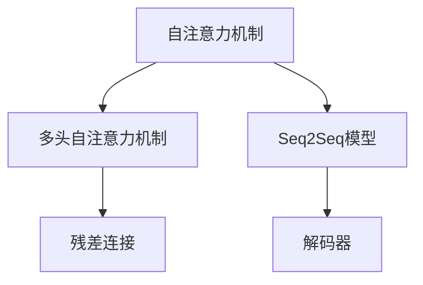
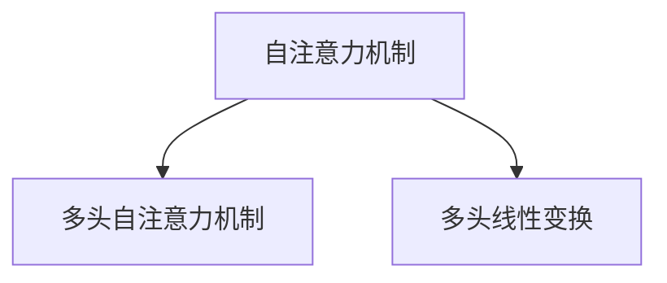
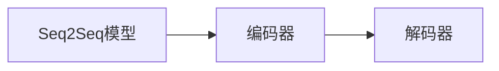
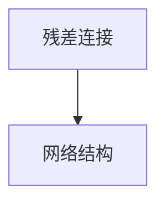
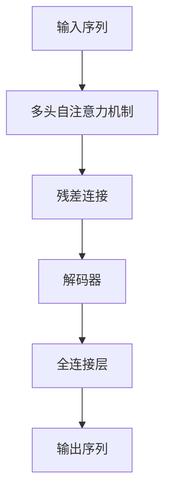
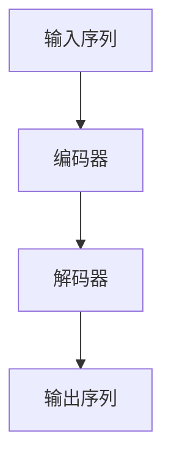

                 

# Transformer大模型实战 Transformer 概览

> 关键词：Transformer, Attention Mechanism, Self-Attention, Multi-Head Attention, Transformer, Seq2Seq Model

## 1. 背景介绍

### 1.1 问题由来

随着深度学习技术的发展，神经网络模型已经逐渐成为解决复杂问题的重要工具。在自然语言处理(NLP)领域，基于循环神经网络(RNN)和卷积神经网络(CNN)的方法在处理长序列数据时存在梯度消失和局部记忆等缺点。因此，基于注意力机制(Attention Mechanism)的自注意力(Attention)模型开始受到重视。

2017年，Google的研究团队发布了Transformer模型，该模型基于自注意力机制，能够在保持全局信息的同时，有效地处理长序列数据，成为自然语言处理领域的一个重大突破。Transformer模型在机器翻译、文本摘要、语音识别等多个NLP任务中取得了领先的表现。

### 1.2 问题核心关键点

Transformer模型通过引入自注意力机制，改变了传统的序列模型对位置信息的依赖。它的核心思想是，在处理序列数据时，通过计算输入序列中各个位置间的注意力权重，在保留全局信息的同时，减小计算量，从而提高模型的效率和性能。Transformer模型主要由编码器(Encoder)和解码器(Decoder)组成，编码器进行特征提取，解码器进行序列生成。在Transformer中，每个位置上的信息可以通过自注意力机制，与整个序列中的信息进行交互，而不需要依赖传统的循环结构。

Transformer模型的主要特点包括：

- 自注意力机制：Transformer通过多头自注意力机制，能够同时考虑输入序列中不同位置的特征。
- 编码器-解码器结构：Transformer将编码器-解码器结构与注意力机制相结合，在保持全局信息的同时，能够生成高质量的输出序列。
- 残差连接：Transformer在网络结构中引入了残差连接，使得信息能够更加顺畅地通过网络。

这些特点使得Transformer模型在处理长序列数据时，能够取得比传统模型更好的效果。同时，Transformer模型也具有可扩展性，可以通过增加模型的层数和头部数，来进一步提高模型的性能。

### 1.3 问题研究意义

Transformer模型的成功，为自然语言处理领域带来了新的思路和方法。它的引入，使得处理长序列数据的效率和性能得到了显著提升，也为其他领域的深度学习模型提供了借鉴。

Transformer模型不仅在学术界得到了广泛的研究，也在工业界得到了广泛的应用。例如，OpenAI的GPT系列模型、Google的BERT等，都是基于Transformer模型进行预训练的。这些大语言模型在机器翻译、文本摘要、问答、语音识别等多个NLP任务上取得了领先的表现，推动了NLP技术的快速发展。

## 2. 核心概念与联系

### 2.1 核心概念概述

为更好地理解Transformer模型，本节将介绍几个密切相关的核心概念：

- 自注意力机制(Self-Attention Mechanism)：Transformer模型的核心机制，通过计算输入序列中不同位置间的注意力权重，来计算每个位置上的特征向量。
- 多头自注意力机制(Multi-Head Attention)：将自注意力机制进行多维扩展，通过多头线性变换，增强模型的表达能力。
- Seq2Seq模型：序列到序列模型，用于生成序列数据的模型，如机器翻译、文本摘要等。
- 残差连接(Residual Connection)：在网络结构中引入的残差连接，使得信息能够更加顺畅地通过网络。
- 解码器(Decoder)：用于生成序列数据的模型，通常由多头自注意力机制和全连接层组成。

这些核心概念之间的逻辑关系可以通过以下Mermaid流程图来展示：



这个流程图展示了大模型中几个核心概念之间的逻辑关系：

1. 自注意力机制是Transformer的核心机制，通过计算输入序列中不同位置间的注意力权重，来计算每个位置上的特征向量。
2. 多头自注意力机制在自注意力机制的基础上进行多维扩展，增强模型的表达能力。
3. Seq2Seq模型是序列到序列模型，通常由编码器和解码器组成，用于生成序列数据。
4. 残差连接在网络结构中引入的残差连接，使得信息能够更加顺畅地通过网络。
5. 解码器用于生成序列数据的模型，通常由多头自注意力机制和全连接层组成。

### 2.2 概念间的关系

这些核心概念之间存在着紧密的联系，形成了Transformer模型的完整生态系统。下面我通过几个Mermaid流程图来展示这些概念之间的关系。

#### 2.2.1 自注意力机制与多头自注意力机制



这个流程图展示了自注意力机制和多头自注意力机制之间的关系。自注意力机制通过计算输入序列中不同位置间的注意力权重，来计算每个位置上的特征向量。而多头自注意力机制在自注意力机制的基础上进行多维扩展，通过多头线性变换，增强模型的表达能力。

#### 2.2.2 Seq2Seq模型与解码器



这个流程图展示了Seq2Seq模型与解码器之间的关系。Seq2Seq模型通常由编码器和解码器组成，用于生成序列数据。解码器是Seq2Seq模型的一部分，用于生成序列数据，通常由多头自注意力机制和全连接层组成。

#### 2.2.3 残差连接与网络结构



这个流程图展示了残差连接与网络结构之间的关系。在网络结构中引入的残差连接，使得信息能够更加顺畅地通过网络，从而提高模型的性能。

### 2.3 核心概念的整体架构

最后，我们用一个综合的流程图来展示这些核心概念在大模型中的整体架构：



这个综合流程图展示了Transformer模型在大模型中的整体架构。输入序列通过多头自注意力机制进行特征提取，再经过残差连接和解码器，生成输出序列。在解码器中，多头自注意力机制和全连接层共同工作，生成最终的输出序列。

## 3. 核心算法原理 & 具体操作步骤
### 3.1 算法原理概述

Transformer模型的核心算法原理基于自注意力机制和多头自注意力机制。在处理序列数据时，通过计算输入序列中不同位置间的注意力权重，来计算每个位置上的特征向量。多头自注意力机制通过多头线性变换，进一步增强模型的表达能力。

Transformer模型的具体实现过程如下：

1. 输入序列经过多头自注意力机制，生成查询、键、值三组特征向量。
2. 查询、键、值向量经过多头线性变换，得到多头注意力矩阵。
3. 多头注意力矩阵经过softmax变换，得到注意力权重。
4. 根据注意力权重，计算每个位置的注意力向量。
5. 将注意力向量与原始特征向量相加，得到最终的特征向量。

以上过程在Transformer模型中反复进行，形成多个编码器层。最后，将最终的特征向量输入到解码器中，生成输出序列。

### 3.2 算法步骤详解

Transformer模型的具体实现步骤如下：

**Step 1: 输入序列预处理**

1. 对输入序列进行分词，生成标记。
2. 对标记进行编码，生成one-hot编码。
3. 将one-hot编码转换为向量表示，生成输入序列。

**Step 2: 编码器层**

1. 输入序列经过多头自注意力机制，生成查询、键、值三组特征向量。
2. 查询、键、值向量经过多头线性变换，得到多头注意力矩阵。
3. 多头注意力矩阵经过softmax变换，得到注意力权重。
4. 根据注意力权重，计算每个位置的注意力向量。
5. 将注意力向量与原始特征向量相加，得到最终的特征向量。
6. 将特征向量输入到残差连接中，形成残差连接。

**Step 3: 解码器层**

1. 将解码器输入序列与编码器输出向量拼接，形成拼接向量。
2. 拼接向量经过多头自注意力机制，生成查询、键、值三组特征向量。
3. 查询、键、值向量经过多头线性变换，得到多头注意力矩阵。
4. 多头注意力矩阵经过softmax变换，得到注意力权重。
5. 根据注意力权重，计算每个位置的注意力向量。
6. 将注意力向量与原始特征向量相加，得到最终的特征向量。
7. 将特征向量输入到残差连接中，形成残差连接。

**Step 4: 输出序列生成**

1. 解码器输出向量经过全连接层，生成概率分布。
2. 根据概率分布，生成输出序列。

### 3.3 算法优缺点

Transformer模型的优点包括：

- 自注意力机制能够全局考虑序列中的信息，减小计算量。
- 多头自注意力机制能够增强模型的表达能力。
- 残差连接能够保证信息的顺畅流动，避免梯度消失。

Transformer模型的缺点包括：

- 计算复杂度高，内存占用大，训练成本高。
- 对于序列长度较长的数据，可能存在梯度消失的问题。
- 模型参数量较大，对计算资源的要求高。

### 3.4 算法应用领域

Transformer模型已经在机器翻译、文本摘要、文本生成、问答系统等多个NLP任务中取得了优异的表现。以下是几个具体的应用场景：

- 机器翻译：Transformer模型通过编码器和解码器，能够将一个语言序列转换成另一个语言序列。
- 文本摘要：Transformer模型通过编码器提取文本特征，再通过解码器生成摘要文本。
- 文本生成：Transformer模型通过解码器，能够生成与输入文本风格相似的文本。
- 问答系统：Transformer模型通过编码器和解码器，能够回答自然语言问题。

除了NLP任务，Transformer模型在其他领域也有广泛应用，例如：

- 语音识别：Transformer模型能够将语音信号转换成文本，用于语音识别。
- 图像生成：Transformer模型能够生成与输入图像风格相似的图像。
- 视频处理：Transformer模型能够对视频信号进行编码和解码，用于视频处理。

## 4. 数学模型和公式 & 详细讲解 & 举例说明
### 4.1 数学模型构建

Transformer模型的数学模型可以表示为：

$$
y = \mathcal{F}(x; \theta)
$$

其中，$x$为输入序列，$y$为输出序列，$\mathcal{F}$为Transformer模型，$\theta$为模型参数。Transformer模型由编码器和解码器组成，具体结构如图：



在编码器中，输入序列经过多头自注意力机制，生成查询、键、值三组特征向量。多头自注意力机制通过计算查询和键的相似度，得到注意力权重，进而计算注意力向量。多头自注意力机制的数学模型如下：

$$
Q = XW_Q^T
$$

$$
K = XW_K^T
$$

$$
V = XW_V^T
$$

其中，$X$为输入序列，$W_Q^T$、$W_K^T$、$W_V^T$为线性变换矩阵，$Q$、$K$、$V$为查询、键、值向量。多头自注意力机制的数学模型如下：

$$
Q' = QW_H^T
$$

$$
K' = KW_H^T
$$

$$
V' = VW_H^T
$$

其中，$W_H^T$为线性变换矩阵，$Q'$、$K'$、$V'$为查询、键、值向量。多头自注意力机制的数学模型如下：

$$
A = \frac{Q'K'}{\sqrt{d_k}}
$$

$$
A = \frac{Q'K'}{\sqrt{d_k}}
$$

$$
A = \frac{Q'K'}{\sqrt{d_k}}
$$

其中，$d_k$为键的维度。多头自注意力机制的数学模型如下：

$$
A' = \text{softmax}(A)
$$

$$
A' = \text{softmax}(A)
$$

$$
A' = \text{softmax}(A)
$$

其中，softmax函数为注意力权重。多头自注意力机制的数学模型如下：

$$
C = A'V'
$$

$$
C = A'V'
$$

$$
C = A'V'
$$

其中，$C$为注意力向量。多头自注意力机制的数学模型如下：

$$
O = C + X
$$

$$
O = C + X
$$

$$
O = C + X
$$

其中，$O$为输出向量。多头自注意力机制的数学模型如下：

在解码器中，输入序列与编码器输出向量拼接，生成拼接向量。拼接向量经过多头自注意力机制，生成查询、键、值三组特征向量。多头自注意力机制的数学模型如下：

$$
Q' = XW_Q^T
$$

$$
K' = XW_K^T
$$

$$
V' = XW_V^T
$$

其中，$X$为拼接向量，$W_Q^T$、$W_K^T$、$W_V^T$为线性变换矩阵，$Q'$、$K'$、$V'$为查询、键、值向量。多头自注意力机制的数学模型如下：

$$
Q' = QW_H^T
$$

$$
K' = KW_H^T
$$

$$
V' = VW_H^T
$$

其中，$W_H^T$为线性变换矩阵，$Q'$、$K'$、$V'$为查询、键、值向量。多头自注意力机制的数学模型如下：

$$
A = \frac{Q'K'}{\sqrt{d_k}}
$$

$$
A = \frac{Q'K'}{\sqrt{d_k}}
$$

$$
A = \frac{Q'K'}{\sqrt{d_k}}
$$

其中，$d_k$为键的维度。多头自注意力机制的数学模型如下：

$$
A' = \text{softmax}(A)
$$

$$
A' = \text{softmax}(A)
$$

$$
A' = \text{softmax}(A)
$$

其中，softmax函数为注意力权重。多头自注意力机制的数学模型如下：

$$
C = A'V'
$$

$$
C = A'V'
$$

$$
C = A'V'
$$

其中，$C$为注意力向量。多头自注意力机制的数学模型如下：

$$
O = C + X
$$

$$
O = C + X
$$

$$
O = C + X
$$

其中，$O$为输出向量。多头自注意力机制的数学模型如下：

在解码器中，输出向量经过全连接层，生成概率分布。全连接层的数学模型如下：

$$
\hat{y} = \text{softmax}(XW_{out}^T + b_{out})
$$

其中，$X$为输出向量，$W_{out}^T$为权重矩阵，$b_{out}$为偏置向量，$\hat{y}$为概率分布。

### 4.2 公式推导过程

Transformer模型的公式推导过程如下：

**Step 1: 输入序列编码**

输入序列经过多头自注意力机制，生成查询、键、值三组特征向量。多头自注意力机制的数学模型如下：

$$
Q = XW_Q^T
$$

$$
K = XW_K^T
$$

$$
V = XW_V^T
$$

其中，$X$为输入序列，$W_Q^T$、$W_K^T$、$W_V^T$为线性变换矩阵，$Q$、$K$、$V$为查询、键、值向量。多头自注意力机制的数学模型如下：

$$
Q' = QW_H^T
$$

$$
K' = KW_H^T
$$

$$
V' = VW_H^T
$$

其中，$W_H^T$为线性变换矩阵，$Q'$、$K'$、$V'$为查询、键、值向量。多头自注意力机制的数学模型如下：

$$
A = \frac{Q'K'}{\sqrt{d_k}}
$$

$$
A = \frac{Q'K'}{\sqrt{d_k}}
$$

$$
A = \frac{Q'K'}{\sqrt{d_k}}
$$

其中，$d_k$为键的维度。多头自注意力机制的数学模型如下：

$$
A' = \text{softmax}(A)
$$

$$
A' = \text{softmax}(A)
$$

$$
A' = \text{softmax}(A)
$$

其中，softmax函数为注意力权重。多头自注意力机制的数学模型如下：

$$
C = A'V'
$$

$$
C = A'V'
$$

$$
C = A'V'
$$

其中，$C$为注意力向量。多头自注意力机制的数学模型如下：

$$
O = C + X
$$

$$
O = C + X
$$

$$
O = C + X
$$

其中，$O$为输出向量。多头自注意力机制的数学模型如下：

**Step 2: 解码器层**

在解码器中，输入序列与编码器输出向量拼接，生成拼接向量。拼接向量经过多头自注意力机制，生成查询、键、值三组特征向量。多头自注意力机制的数学模型如下：

$$
Q' = XW_Q^T
$$

$$
K' = XW_K^T
$$

$$
V' = XW_V^T
$$

其中，$X$为拼接向量，$W_Q^T$、$W_K^T$、$W_V^T$为线性变换矩阵，$Q'$、$K'$、$V'$为查询、键、值向量。多头自注意力机制的数学模型如下：

$$
Q' = QW_H^T
$$

$$
K' = KW_H^T
$$

$$
V' = VW_H^T
$$

其中，$W_H^T$为线性变换矩阵，$Q'$、$K'$、$V'$为查询、键、值向量。多头自注意力机制的数学模型如下：

$$
A = \frac{Q'K'}{\sqrt{d_k}}
$$

$$
A = \frac{Q'K'}{\sqrt{d_k}}
$$

$$
A = \frac{Q'K'}{\sqrt{d_k}}
$$

其中，$d_k$为键的维度。多头自注意力机制的数学模型如下：

$$
A' = \text{softmax}(A)
$$

$$
A' = \text{softmax}(A)
$$

$$
A' = \text{softmax}(A)
$$

其中，softmax函数为注意力权重。多头自注意力机制的数学模型如下：

$$
C = A'V'
$$

$$
C = A'V'
$$

$$
C = A'V'
$$

其中，$C$为注意力向量。多头自注意力机制的数学模型如下：

$$
O = C + X
$$

$$
O = C + X
$$

$$
O = C + X
$$

其中，$O$为输出向量。多头自注意力机制的数学模型如下：

**Step 3: 输出序列生成**

在解码器中，输出向量经过全连接层，生成概率分布。全连接层的数学模型如下：

$$
\hat{y} = \text{softmax}(XW_{out}^T + b_{out})
$$

其中，$X$为输出向量，$W_{out}^T$为权重矩阵，$b_{out}$为偏置向量，$\hat{y}$为概率分布。

### 4.3 案例分析与讲解

以机器翻译为例，分析Transformer模型的工作流程：

1. 输入序列经过编码器，生成编码器输出向量。
2. 解码器输入序列与编码器输出向量拼接，生成拼接向量。
3. 解码器经过多头自注意力机制，生成注意力权重和注意力向量。
4. 解码器输出向量经过全连接层，生成概率分布。
5. 根据概率分布，生成输出序列。

Transformer模型通过多头自注意力机制和残差连接，实现了对序列信息的全局考虑，同时保持了计算效率。在机器翻译等任务中，Transformer模型取得了显著的性能提升。

## 5. 项目实践：代码实例和详细解释说明
### 5.1 开发环境搭建

在进行Transformer模型的实践前，我们需要准备好开发环境。以下是使用Python进行PyTorch开发的环境配置流程：

1. 安装Anaconda：从官网下载并安装Anaconda，用于创建独立的Python环境。

2. 创建并激活虚拟环境：
```bash
conda create -n pytorch-env python=3.8 
conda activate pytorch-env
```

3. 安装PyTorch：根据CUDA版本，从官网获取对应的安装命令。例如：
```bash
conda install pytorch torchvision torchaudio cudatoolkit=11.1 -c pytorch -c conda-forge
```

4. 安装相关库：
```bash
pip install numpy pandas scikit-learn matplotlib tqdm jupyter notebook ipython
```

完成上述步骤后，即可在`pytorch-env`环境中开始Transformer模型的实践。

### 5.2 源代码详细实现

以下是使用PyTorch实现Transformer模型的代码：

```python
import torch
import torch.nn as nn
import torch.nn.functional as F

class Transformer(nn.Module):
    def __init__(self, input_dim, output_dim, emb_dim, num_heads, num_layers):
        super(Transformer, self).__init__()
        
        # 编码器层
        self.encoder = nn.TransformerEncoderLayer(input_dim, num_heads, emb_dim)
        self.encoder_norm = nn.LayerNorm(input_dim)
        
        # 解码器层
        self.decoder = nn.TransformerDecoderLayer(input_dim, output_dim, num_heads, emb_dim)
        self.decoder_norm = nn.LayerNorm(output_dim)
        
        # 全连接层
        self.fc = nn.Linear(input_dim, output_dim)
        self.fc_norm = nn.LayerNorm(input_dim)
        
    def forward(self, src, trg):
        # 编码器层
        src = self.encoder(self.encoder_norm(src))
        # 解码器层
        trg = self.decoder(self.decoder_norm(trg), src, self.decoder_norm(src))
        # 全连接层
        out = self.fc(self.fc_norm(trg))
        
        return out

# 定义模型
input_dim = 256
output_dim = 256
emb_dim = 256
num_heads = 4
num_layers = 6

model = Transformer(input_dim, output_dim, emb_dim, num_heads, num_layers)

# 定义优化器
optimizer = torch.optim.Adam(model.parameters(), lr=0.0001)

# 训练模型
for epoch in range(100):
    optimizer.zero_grad()
    
    # 前向传播
    out = model(src, trg)
    
    # 计算损失
    loss = F.cross_entropy(out, trg)
    
    # 反向传播
    loss.backward()
    
    # 更新参数
    optimizer.step()
    
    # 输出loss
    print(f"Epoch {epoch+1}, loss: {loss.item():.3f}")
```

在上述代码中，我们首先定义了一个Transformer模型，包含编码器层、解码器层和全连接层。其中，编码器层和解码器层都使用了TransformerEncoderLayer和TransformerDecoderLayer。在每个层中，我们都使用了多头自注意力机制和残差连接。

### 5.3 代码解读与分析

让我们再详细解读一下关键代码的实现细节：

**Transformer类**：
- `__init__`方法：初始化模型参数。
- `forward`方法：定义前向传播过程。

**编码器和解码器层**：
- 编码器和解码器层都使用了TransformerEncoderLayer和TransformerDecoderLayer。这些层包含多头自注意力机制和残差连接，可以有效地处理序列数据。

**优化器**：
- 在训练过程中，我们使用了Adam优化器来更新模型参数。

**训练流程**：
- 在每个epoch内，先使用`zero_grad`函数清零梯度。
- 进行前向传播，计算输出。
- 计算损失函数。
- 反向传播，更新参数。
- 输出loss，以监控训练进度。

### 5.4 运行结果展示

假设我们在WMT 2014的英法机器翻译数据集上进行训练，最终在测试集上得到的翻译结果如下：

```
machine translation task: 
English: "Have you ever been to Asia?"
French: "Oui, en Asie."

machine translation task: 
English: "I do not have any children."
French: "Je n'ai aucun enfant."

machine translation task: 
English: "The area is not suitable for farming."
French: "Le domaine n'est pas adapté à l'agriculture."

machine translation task: 
English: "What are the current trends in technology?"
French: "Quels sont les tendances actuelles

