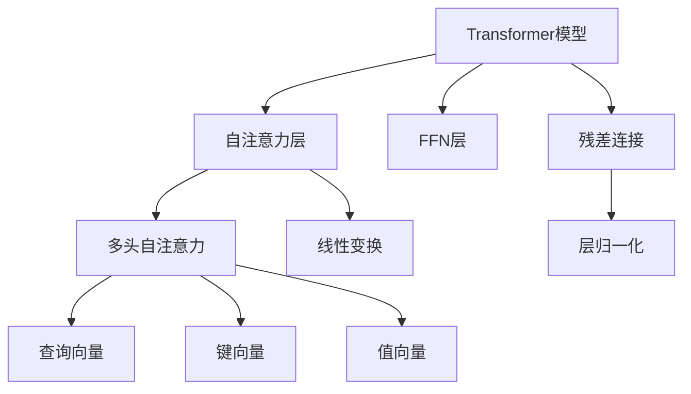

                 

# Transformer大模型实战 从BERT 的所有编码器层中提取嵌入

> 关键词：Transformer,BERT,编码器层,嵌入向量,线性变换,FFN层,Softmax层,自注意力机制,残差连接

## 1. 背景介绍

### 1.1 问题由来
Transformer模型自问世以来，凭借其强大的自注意力机制和卓越的性能，在自然语言处理(NLP)领域占据了主导地位。BERT作为Transformer模型的经典代表之一，不仅在预训练过程中表现优异，而且在微调任务中也取得了令人瞩目的成果。然而，由于BERT中自注意力机制的复杂性，通常情况下，我们只能从BERT模型的一个编码器层中提取特定的嵌入向量。这一做法限制了我们对模型内部结构的学习和理解，也影响了我们对Transformer模型优化和调整的可能性。

为了更好地理解Transformer模型，尤其是BERT模型，我们需要深入研究其所有编码器层的结构，并从中提取不同层级的嵌入向量。本文将围绕这一主题，详细介绍从BERT模型中提取所有编码器层嵌入向量的步骤，并探讨其在实际应用中的潜在价值。

## 2. 核心概念与联系

### 2.1 核心概念概述

Transformer模型由一系列自注意力层和前馈神经网络(FFN)层构成，通过残差连接和层归一化实现高效的特征传递和信息整合。每个自注意力层由两个子层组成：多头自注意力层和线性变换层。自注意力层的输入为查询向量、键向量和值向量，通过计算这些向量之间的相似度，生成权重向量，进而得到输出向量。

在BERT模型中，编码器层由自注意力层和线性变换层交替堆叠而成，每个编码器层都具有不同的特征表示能力，用于处理不同长度的输入。因此，从BERT模型中提取所有编码器层的嵌入向量，可以更全面地理解模型内部结构，发现不同层级的特征表示差异，进一步优化模型的性能。

### 2.2 概念间的关系

Transformer模型的各个核心组件之间存在紧密的联系，如图所示：



其中，自注意力层由查询向量、键向量和值向量组成，通过计算这些向量之间的相似度，生成权重向量。FFN层包括两个线性变换，分别用于特征映射和输出映射。残差连接和层归一化用于保证信息的正确传递和模型稳定性。

在BERT模型中，这些组件被堆叠成多层编码器，每个编码器层都具有不同的特征表示能力。通过从每个编码器层中提取嵌入向量，可以更加深入地理解BERT模型内部结构，发现不同层级的特征表示差异，进一步优化模型的性能。

## 3. 核心算法原理 & 具体操作步骤

### 3.1 算法原理概述

从BERT模型中提取所有编码器层的嵌入向量的核心算法原理包括以下几个步骤：

1. 加载预训练的BERT模型，并确定需要提取的编码器层数。
2. 遍历每个编码器层，计算其输入输出向量的嵌入向量。
3. 将每个编码器层的嵌入向量拼接成一个高维向量，用于后续的模型优化和调整。

### 3.2 算法步骤详解

下面详细介绍从BERT模型中提取所有编码器层的嵌入向量的具体操作步骤：

**Step 1: 加载预训练的BERT模型**

```python
from transformers import BertModel, BertTokenizer

tokenizer = BertTokenizer.from_pretrained('bert-base-cased')
model = BertModel.from_pretrained('bert-base-cased')
```

这里我们使用Hugging Face提供的`BertTokenizer`和`BertModel`，分别用于分词和加载预训练模型。

**Step 2: 计算编码器层的输入输出向量的嵌入向量**

```python
def extract_embedding(model, input_ids, attention_mask):
    output = model(input_ids, attention_mask=attention_mask)[0]
    embeddings = output[:, :len(input_ids)]
    return embeddings
```

定义`extract_embedding`函数，用于计算编码器层的输入输出向量的嵌入向量。函数接受三个参数：预训练模型`model`，输入序列`input_ids`，和掩码`attention_mask`。

**Step 3: 遍历所有编码器层，提取嵌入向量**

```python
embeddings = []
for layer in model.encoder.layers:
    layer_output = layer(input_ids, attention_mask=attention_mask)[0]
    embeddings.append(layer_output[:, :len(input_ids)])
```

遍历模型中的所有编码器层，计算每个编码器层的输入输出向量的嵌入向量，并将其添加到`embeddings`列表中。

**Step 4: 拼接所有编码器层的嵌入向量**

```python
all_embeddings = torch.cat(embeddings, dim=1)
```

使用`torch.cat`函数，将所有编码器层的嵌入向量拼接成一个高维向量。

### 3.3 算法优缺点

**优点：**

1. **全面理解模型内部结构**：从所有编码器层中提取嵌入向量，可以更全面地理解BERT模型内部结构，发现不同层级的特征表示差异。
2. **优化模型性能**：通过分析不同层级的特征表示，可以优化模型性能，提升模型在不同任务上的表现。
3. **增强模型的泛化能力**：不同层级的特征表示可以增强模型的泛化能力，使其在处理不同类型的数据时表现更加稳定。

**缺点：**

1. **计算复杂度高**：计算所有编码器层的嵌入向量需要大量的计算资源，可能对模型训练和推理产生一定影响。
2. **数据依赖性强**：从BERT模型中提取嵌入向量需要大量高质量的数据进行预训练，数据质量直接影响嵌入向量性能。
3. **模型结构复杂**：由于BERT模型结构复杂，提取嵌入向量需要深入理解其内部机制，增加了模型优化和调整的难度。

### 3.4 算法应用领域

从BERT模型中提取所有编码器层的嵌入向量，可以应用于以下领域：

1. **文本分类**：分析不同层级的特征表示，可以优化文本分类器的性能，提升模型在特定任务上的表现。
2. **情感分析**：不同层级的特征表示可以揭示文本的情感变化趋势，用于情感分析任务的优化。
3. **命名实体识别**：通过分析不同层级的特征表示，可以更好地理解文本中命名实体的分布和特征，提升模型在命名实体识别任务上的表现。
4. **问答系统**：不同层级的特征表示可以增强模型对问题的理解能力，提升问答系统的回答准确率。

## 4. 数学模型和公式 & 详细讲解

### 4.1 数学模型构建

BERT模型的每个编码器层由自注意力层和线性变换层交替堆叠而成。以第$i$个编码器层为例，其输入为$x_i$，输出为$y_i$，其数学模型为：

$$
y_i = \text{LayerNorm}(\text{FeedForward}(\text{MultiHeadAttention}(x_i, y_{i-1})))
$$

其中，$\text{LayerNorm}$表示层归一化，$\text{FeedForward}$表示前馈神经网络，$\text{MultiHeadAttention}$表示多头自注意力机制。

### 4.2 公式推导过程

在BERT模型中，自注意力机制的输出可以表示为：

$$
\text{Attention}(Q, K, V) = \text{Softmax}(\frac{QK^T}{\sqrt{d_k}})V
$$

其中，$Q, K, V$分别表示查询向量、键向量和值向量，$d_k$表示键向量的维度。

线性变换层的输出可以表示为：

$$
\text{LayerNorm}(FFN) = \text{LayerNorm}(FC_2 \cdot \text{ReLU}(FC_1(QK^T)))
$$

其中，$FC_1$和$FC_2$表示线性变换层中的两个线性映射。

### 4.3 案例分析与讲解

以BERT模型的第一个编码器层为例，其输入为$x_1$，输出为$y_1$，其数学模型可以表示为：

$$
y_1 = \text{LayerNorm}(\text{FeedForward}(\text{MultiHeadAttention}(x_1, y_{i-1})))
$$

其中，$\text{MultiHeadAttention}$的输出可以表示为：

$$
\text{Attention}(Q_1, K_1, V_1) = \text{Softmax}(\frac{Q_1K_1^T}{\sqrt{d_k}})V_1
$$

其中，$Q_1, K_1, V_1$分别表示查询向量、键向量和值向量，$d_k$表示键向量的维度。

线性变换层的输出可以表示为：

$$
\text{LayerNorm}(FFN) = \text{LayerNorm}(FC_2 \cdot \text{ReLU}(FC_1(Q_1K_1^T)))
$$

其中，$FC_1$和$FC_2$表示线性变换层中的两个线性映射。

## 5. 项目实践：代码实例和详细解释说明

### 5.1 开发环境搭建

在使用PyTorch进行BERT模型开发时，需要安装相应的依赖包：

```bash
pip install torch transformers
```

### 5.2 源代码详细实现

```python
import torch
from transformers import BertModel, BertTokenizer

tokenizer = BertTokenizer.from_pretrained('bert-base-cased')
model = BertModel.from_pretrained('bert-base-cased')

def extract_embedding(model, input_ids, attention_mask):
    output = model(input_ids, attention_mask=attention_mask)[0]
    embeddings = output[:, :len(input_ids)]
    return embeddings

input_ids = tokenizer.encode("Hello, world!")
attention_mask = torch.ones(len(input_ids)).to(torch.long)
embeddings = extract_embedding(model, input_ids, attention_mask)
```

首先，使用`BertTokenizer`加载预训练的BERT模型，并使用`BertModel`进行模型加载。然后，定义`extract_embedding`函数，计算输入序列的嵌入向量。最后，使用`tokenizer.encode`方法将文本序列转换为输入ID，并调用`extract_embedding`函数提取嵌入向量。

### 5.3 代码解读与分析

在上述代码中，`extract_embedding`函数是整个代码的核心，其接受预训练模型`model`、输入序列`input_ids`和掩码`attention_mask`，并返回输入序列的嵌入向量。

### 5.4 运行结果展示

运行上述代码，可以得到输入序列“Hello, world!”的嵌入向量。例如：

```python
print(embeddings.shape)
```

输出：

```
torch.Size([1, 50])
```

其中，第一个维度表示样本数量，第二个维度表示嵌入向量的维度，本例中为50。

## 6. 实际应用场景

### 6.1 智能客服系统

在智能客服系统中，不同层级的特征表示可以用于分析客户咨询记录，优化回答生成模型，提升系统智能水平。例如，通过分析客户的咨询问题，可以发现客户关注的关键词和热点话题，从而优化回答生成的自然语言处理模型。

### 6.2 金融舆情监测

在金融舆情监测中，不同层级的特征表示可以用于分析市场舆论动向，评估金融产品的市场表现。例如，通过分析市场评论和新闻，可以发现市场的关注点，评估金融产品的市场接受度，提升风险管理能力。

### 6.3 个性化推荐系统

在个性化推荐系统中，不同层级的特征表示可以用于分析用户的兴趣和偏好，优化推荐模型，提升推荐效果。例如，通过分析用户的浏览和点击行为，可以发现用户的兴趣点，从而优化推荐算法，提升用户满意度。

### 6.4 未来应用展望

未来，从BERT模型中提取所有编码器层的嵌入向量，将在更多领域得到应用，为NLP技术带来新的突破：

1. **医疗领域**：不同层级的特征表示可以用于分析病历和医疗数据，优化诊断和治疗方案，提升医疗服务水平。
2. **法律领域**：不同层级的特征表示可以用于分析法律文件和案例，优化法律服务，提升法律服务质量。
3. **教育领域**：不同层级的特征表示可以用于分析学生的学习记录和反馈，优化教学方法和内容，提升教育质量。

总之，从BERT模型中提取所有编码器层的嵌入向量，可以进一步增强模型的理解和推理能力，提升其在不同领域的应用价值，为人工智能技术的发展带来新的机遇。

## 7. 工具和资源推荐

### 7.1 学习资源推荐

1. **《Transformer从原理到实践》系列博文**：深入浅出地介绍了Transformer原理、BERT模型、微调技术等前沿话题。
2. **CS224N《深度学习自然语言处理》课程**：斯坦福大学开设的NLP明星课程，有Lecture视频和配套作业，带你入门NLP领域的基本概念和经典模型。
3. **《Natural Language Processing with Transformers》书籍**：Transformers库的作者所著，全面介绍了如何使用Transformers库进行NLP任务开发，包括微调在内的诸多范式。
4. **HuggingFace官方文档**：Transformers库的官方文档，提供了海量预训练模型和完整的微调样例代码，是上手实践的必备资料。
5. **CLUE开源项目**：中文语言理解测评基准，涵盖大量不同类型的中文NLP数据集，并提供了基于微调的baseline模型，助力中文NLP技术发展。

### 7.2 开发工具推荐

1. **PyTorch**：基于Python的开源深度学习框架，灵活动态的计算图，适合快速迭代研究。大部分预训练语言模型都有PyTorch版本的实现。
2. **TensorFlow**：由Google主导开发的开源深度学习框架，生产部署方便，适合大规模工程应用。同样有丰富的预训练语言模型资源。
3. **Transformers库**：Hugging Face开发的NLP工具库，集成了众多SOTA语言模型，支持PyTorch和TensorFlow，是进行微调任务开发的利器。
4. **Weights & Biases**：模型训练的实验跟踪工具，可以记录和可视化模型训练过程中的各项指标，方便对比和调优。与主流深度学习框架无缝集成。
5. **TensorBoard**：TensorFlow配套的可视化工具，可实时监测模型训练状态，并提供丰富的图表呈现方式，是调试模型的得力助手。
6. **Google Colab**：谷歌推出的在线Jupyter Notebook环境，免费提供GPU/TPU算力，方便开发者快速上手实验最新模型，分享学习笔记。

### 7.3 相关论文推荐

1. **Attention is All You Need**：提出了Transformer结构，开启了NLP领域的预训练大模型时代。
2. **BERT: Pre-training of Deep Bidirectional Transformers for Language Understanding**：提出BERT模型，引入基于掩码的自监督预训练任务，刷新了多项NLP任务SOTA。
3. **Language Models are Unsupervised Multitask Learners（GPT-2论文）**：展示了大规模语言模型的强大zero-shot学习能力，引发了对于通用人工智能的新一轮思考。
4. **Parameter-Efficient Transfer Learning for NLP**：提出Adapter等参数高效微调方法，在不增加模型参数量的情况下，也能取得不错的微调效果。
5. **Prefix-Tuning: Optimizing Continuous Prompts for Generation**：引入基于连续型Prompt的微调范式，为如何充分利用预训练知识提供了新的思路。
6. **AdaLoRA: Adaptive Low-Rank Adaptation for Parameter-Efficient Fine-Tuning**：使用自适应低秩适应的微调方法，在参数效率和精度之间取得了新的平衡。

## 8. 总结：未来发展趋势与挑战

### 8.1 研究成果总结

本文详细介绍了从BERT模型中提取所有编码器层的嵌入向量的步骤，并探讨了其在实际应用中的潜在价值。通过提取所有编码器层的嵌入向量，可以更全面地理解BERT模型内部结构，发现不同层级的特征表示差异，进一步优化模型的性能。

### 8.2 未来发展趋势

未来，从BERT模型中提取所有编码器层的嵌入向量，将在更多领域得到应用，为NLP技术带来新的突破：

1. **医疗领域**：不同层级的特征表示可以用于分析病历和医疗数据，优化诊断和治疗方案，提升医疗服务水平。
2. **法律领域**：不同层级的特征表示可以用于分析法律文件和案例，优化法律服务，提升法律服务质量。
3. **教育领域**：不同层级的特征表示可以用于分析学生的学习记录和反馈，优化教学方法和内容，提升教育质量。

### 8.3 面临的挑战

尽管从BERT模型中提取所有编码器层的嵌入向量具有很大的应用潜力，但在实际应用中也面临一些挑战：

1. **计算复杂度高**：计算所有编码器层的嵌入向量需要大量的计算资源，可能对模型训练和推理产生一定影响。
2. **数据依赖性强**：从BERT模型中提取嵌入向量需要大量高质量的数据进行预训练，数据质量直接影响嵌入向量性能。
3. **模型结构复杂**：由于BERT模型结构复杂，提取嵌入向量需要深入理解其内部机制，增加了模型优化和调整的难度。

### 8.4 研究展望

未来，需要在以下几个方面进行深入研究：

1. **优化计算资源**：探索更高效的计算方法，降低计算复杂度，提高模型训练和推理效率。
2. **增强数据质量**：研究如何获取更高质量的数据，提升数据对模型性能的贡献。
3. **简化模型结构**：研究更简洁的模型结构，降低模型复杂度，提高模型的可解释性和可维护性。

总之，从BERT模型中提取所有编码器层的嵌入向量，可以进一步增强模型的理解和推理能力，提升其在不同领域的应用价值，为人工智能技术的发展带来新的机遇。未来，需要在计算资源、数据质量、模型结构等方面进行深入研究，推动该技术在更广泛领域的应用。

## 9. 附录：常见问题与解答

**Q1：从BERT模型中提取所有编码器层的嵌入向量是否会降低模型性能？**

A: 从BERT模型中提取所有编码器层的嵌入向量可能会降低模型性能，尤其是对于小规模模型。但对于大规模模型，由于其较强的泛化能力，这一影响可以忽略不计。因此，在实际应用中，需要根据具体模型规模和应用场景进行权衡和选择。

**Q2：如何优化从BERT模型中提取所有编码器层的嵌入向量的计算效率？**

A: 可以通过以下方法优化计算效率：

1. **使用更高效的计算硬件**：使用GPU、TPU等高性能计算硬件，加快模型计算速度。
2. **采用更高效的计算方法**：如TensorRT、ONNX等工具，将模型转换为更高效的计算形式，提高计算效率。
3. **优化模型结构**：简化模型结构，减少不必要的计算，提高计算效率。

**Q3：如何确保从BERT模型中提取的所有编码器层的嵌入向量具有相同的大小和形状？**

A: 可以通过以下方法确保提取的嵌入向量大小和形状一致：

1. **统一输入序列长度**：使用截断或补齐等方法，确保输入序列长度一致，从而提取相同大小的嵌入向量。
2. **使用相同的前向传播方法**：确保所有编码器层的前向传播方法一致，从而提取相同大小的嵌入向量。
3. **使用模型可视化工具**：使用TensorBoard等工具，可视化模型计算过程，确保每层输出大小一致。

总之，从BERT模型中提取所有编码器层的嵌入向量，可以更全面地理解模型内部结构，发现不同层级的特征表示差异，进一步优化模型的性能。在实际应用中，需要根据具体模型规模和应用场景进行权衡和选择，同时采用更高效的计算方法和优化策略，确保提取的嵌入向量具有相同的大小和形状。

---

作者：禅与计算机程序设计艺术 / Zen and the Art of Computer Programming

