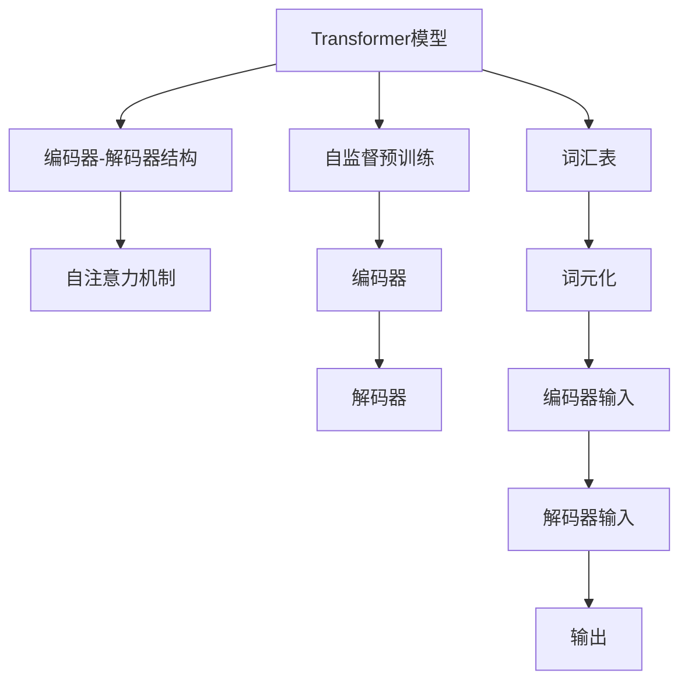
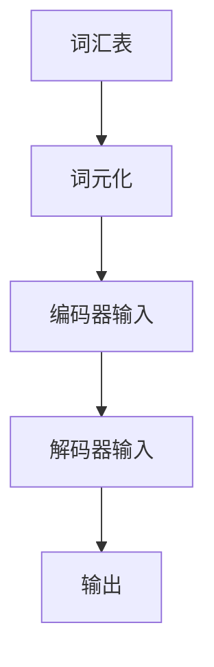
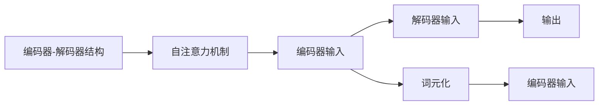

                 

# Transformer大模型实战 子词词元化算法

> 关键词：Transformer, 子词词元化, 自监督预训练, 推理加速, 深度学习, 模型压缩

## 1. 背景介绍

### 1.1 问题由来
Transformer作为深度学习领域的一个重要里程碑，自提出以来，便因其结构简单、性能卓越而广受关注。目前，基于Transformer架构的模型已广泛应用于机器翻译、语音识别、图像识别、自然语言处理等多个领域，取得了显著的效果。

然而，尽管Transformer模型的表现优异，但其在处理长文本时存在显著的效率问题。由于每个token需要存储32位的浮点数，在长文本序列中，每个token的编码空间会急剧增大，导致模型参数量激增，推理速度变慢，难以在实际应用中大规模部署。

为了解决这些问题，学术界和工业界提出了多种方法，其中最为流行的是将token级编码转换为子词级编码，以减少模型参数量和提升推理效率。本文将详细介绍一种流行的子词词元化算法，并结合实际案例进行深入分析。

### 1.2 问题核心关键点
子词词元化算法是指将长文本中的单词或短语（即token）划分为更小的子词，从而减少模型参数量、提升推理效率的一种技术。具体来说，该技术通过预先构建一个包含所有可能子词的词汇表，将原始token进行词元化（subword tokenization），然后将词元化的结果输入Transformer模型。这样，即使是在处理长文本时，模型也不会因为单词过长而出现内存不足或推理过慢的问题。

子词词元化算法的核心在于词汇表的设计。一般来说，词汇表应尽可能包含所有可能出现的子词，同时也要尽量保持小规模，以便提升查询和编码效率。常用的子词词元化算法包括BPE、SentencePiece等。

### 1.3 问题研究意义
通过将token级编码转换为子词级编码，子词词元化算法能够有效降低Transformer模型的参数量和推理时间，提高其在实际应用中的效率和可扩展性。同时，该算法也能帮助模型更好地处理长文本，提升其在自然语言处理任务中的表现。

因此，深入研究子词词元化算法，对于提升Transformer模型的应用性能，优化其推理效率，以及拓展其应用场景，具有重要意义。

## 2. 核心概念与联系

### 2.1 核心概念概述

为更好地理解子词词元化算法的核心原理和架构，本节将介绍几个密切相关的核心概念：

- **Transformer模型**：一种基于自注意力机制的深度神经网络结构，用于处理序列数据，如文本、语音等。Transformer模型由编码器和解码器组成，可以高效地进行序列数据的编码和解码。

- **自监督预训练**：指在无标签数据上，通过自回归、掩码语言模型等自监督学习任务训练模型，以学习通用的语言表示。自监督预训练是现代大模型训练的基础。

- **词汇表**：包含所有可能子词的列表，用于词元化（subword tokenization）。构建词汇表是子词词元化算法的重要步骤。

- **词元化（Subword Tokenization）**：将原始token（如单词、短语）划分为更小的子词（即词元），以减少模型参数量和提升推理效率。

- **编码器-解码器结构**：Transformer模型的核心结构，通过自注意力机制，能够对序列数据进行高效编码和解码。

这些核心概念之间的逻辑关系可以通过以下Mermaid流程图来展示：



这个流程图展示了大语言模型的核心概念及其之间的关系：

1. 大语言模型通过自监督预训练获得基础能力。
2. 模型通过编码器-解码器结构进行序列数据的编码和解码。
3. 词汇表用于词元化，减少模型参数量和提升推理效率。
4. 自注意力机制是模型处理序列数据的关键机制。

这些概念共同构成了大语言模型的学习和应用框架，使其能够在各种场景下发挥强大的语言理解和生成能力。通过理解这些核心概念，我们可以更好地把握大语言模型的工作原理和优化方向。

### 2.2 概念间的关系

这些核心概念之间存在着紧密的联系，形成了大语言模型的完整生态系统。下面我通过几个Mermaid流程图来展示这些概念之间的关系。

#### 2.2.1 自监督预训练与词汇表构建


这个流程图展示了自监督预训练和词汇表构建之间的联系。自监督预训练过程中，模型会学习到通用语言表示，这些表示可以被用于构建词汇表。词汇表中的词元，实际上是由预训练模型自动学习得到的。

#### 2.2.2 词汇表与词元化



这个流程图展示了词汇表和词元化之间的关系。词汇表中的每个词元，都是对原始token进行子词划分后得到的。在词元化后，这些子词可以更有效地被编码器和解码器处理。

#### 2.2.3 编码器-解码器与词元化



这个流程图展示了编码器-解码器结构与词元化之间的关系。编码器-解码器结构通过自注意力机制，对词元化的结果进行编码和解码。这样，即使是在处理长文本时，模型也能高效地进行编码和解码。

## 3. 核心算法原理 & 具体操作步骤
### 3.1 算法原理概述

子词词元化算法通过将原始token进行词元化（即划分），将长文本转换为多个小的词元序列。这样可以减少模型参数量、提升推理效率，同时也能更好地处理长文本。

具体的词元化算法有多种，包括BPE（Byte Pair Encoding）、SentencePiece等。本文将以BPE算法为例，详细介绍其核心原理和具体操作步骤。

BPE算法通过将相邻的字符对（bi-grams）进行编码，将原始字符序列转换为多个小的子词序列。这样，每个子词序列的长度通常小于原始字符序列的长度，从而减少了模型参数量。

### 3.2 算法步骤详解

#### 3.2.1 构建词汇表

构建词汇表是BPE算法的第一步。通常情况下，词汇表的大小需要在10,000到100,000之间，以确保既不过于冗长，也不过于简略。构建词汇表的过程可以通过以下步骤完成：

1. 准备训练数据，通常是带有标注的文本数据。
2. 对训练数据进行预处理，如去除停用词、标点符号等。
3. 对预处理后的文本进行分词，得到单词序列。
4. 计算单词序列中所有相邻字符对的频率，生成字符对频率表。
5. 根据字符对频率表，生成BPE词汇表。

#### 3.2.2 词元化

词元化过程是指将原始token进行BPE编码，将其转换为多个小的词元序列。具体的词元化步骤如下：

1. 准备原始token。
2. 查找字符对频率表，将原始token进行BPE编码，得到多个词元。
3. 将词元序列作为输入，送入Transformer模型进行编码和解码。

### 3.3 算法优缺点

#### 3.3.1 优点

1. **减少模型参数量**：通过将原始token进行词元化，可以显著减少模型参数量，从而提升推理效率。
2. **提升长文本处理能力**：词元化后的子词序列更短，可以更好地处理长文本，提升模型的鲁棒性和泛化能力。
3. **降低内存占用**：每个词元序列的长度通常小于原始token，从而减少了内存占用。

#### 3.3.2 缺点

1. **增加编码复杂度**：词元化后的序列需要进行编码和解码，增加了模型的计算复杂度。
2. **需要构建词汇表**：构建词汇表需要大量标注数据和计算资源，增加了预处理工作量。
3. **可能引入歧义**：词元化后的序列可能存在歧义，需要额外的解码策略来处理。

### 3.4 算法应用领域

子词词元化算法广泛应用于自然语言处理（NLP）领域，特别是在处理长文本时表现优异。具体的应用领域包括：

- **机器翻译**：将源语言和目标语言文本转换为词元序列，再进行翻译。
- **语音识别**：将语音信号转换为词元序列，再进行处理和识别。
- **文本生成**：生成符合特定语法和语义规则的文本序列。
- **文本摘要**：将长文本转换为多个短的词元序列，生成摘要。

除了这些应用领域，子词词元化算法还可以应用于词向量学习、文本分类等任务中。

## 4. 数学模型和公式 & 详细讲解 & 举例说明

### 4.1 数学模型构建

BPE算法通过将字符对进行编码，生成词元序列。具体来说，假设有字符集 $\Sigma$，字符对频率表 $\{(ab, f(ab))\}$，其中 $f(ab)$ 表示字符对 $ab$ 出现的频率。BPE算法可以表示为：

$$
\text{BPE}(x) = \bigcup_{(ab) \in \Sigma} \{ w \mid ab \in w \}
$$

其中，$x$ 表示原始字符序列，$\bigcup$ 表示并集，$w$ 表示由字符对 $ab$ 组成的子词序列。

### 4.2 公式推导过程

假设有字符序列 $x = (x_1, x_2, \dots, x_n)$，其中 $x_i \in \Sigma$。根据BPE算法的定义，可以将 $x$ 进行编码，得到词元序列 $y = (y_1, y_2, \dots, y_m)$，其中 $y_i$ 表示子词序列。具体来说，BPE算法的编码过程可以表示为：

$$
y_i = \bigcup_{(ab) \in \Sigma} \{ w \mid ab \in x_{k}^{k+1}, k = i-1, i, i+1 \}
$$

其中，$k$ 表示子词序列在字符序列中的起始和结束位置，$ab$ 表示字符对。

### 4.3 案例分析与讲解

以“hello”为例，假设其对应的字符集为 $\Sigma = \{\text{h}, \text{e}, \text{l}, \text{o}\}$，字符对频率表为 $\{(\text{he}, 10), (\text{el}, 5), (\text{le}, 3), (\text{lo}, 1)\}$。根据BPE算法，可以得到词元序列为：

$$
\text{BPE}( \text{hello}) = \{\text{he}, \text{lo}, \text{l}, \text{o}\}
$$

可以看到，通过BPE算法，原始字符序列被划分为了多个小的子词序列。

## 5. 项目实践：代码实例和详细解释说明

### 5.1 开发环境搭建

在进行BPE算法的实践前，我们需要准备好开发环境。以下是使用Python进行BPE算法实现的开发环境配置流程：

1. 安装Python：从官网下载并安装Python 3.6及以上版本。

2. 安装PyTorch：根据CUDA版本，从官网获取对应的安装命令。例如：
```bash
conda install pytorch torchvision torchaudio cudatoolkit=11.1 -c pytorch -c conda-forge
```

3. 安装SentencePiece：
```bash
pip install sentencepiece
```

4. 安装transformers库：
```bash
pip install transformers
```

5. 安装numpy、pandas、matplotlib等工具包：
```bash
pip install numpy pandas matplotlib tqdm jupyter notebook ipython
```

完成上述步骤后，即可在Python环境中开始BPE算法的实践。

### 5.2 源代码详细实现

下面以BPE算法为例，给出使用SentencePiece库进行BPE算法的PyTorch代码实现。

首先，定义词汇表和字符对频率表：

```python
from sentencepiece import SentencePieceProcessor
from collections import Counter

# 准备训练数据
train_data = ['hello', 'world', 'deep', 'learning', 'computer', 'science']

# 构建字符集
char_set = set(''.join(train_data))

# 构建字符对频率表
char_pairs = list(zip(char_set, char_set))
char_pairs_counter = Counter(char_pairs)
char_pairs = [pair for pair, freq in char_pairs_counter.items() if freq >= 2]

# 构建词汇表
sp = SentencePieceProcessor()
sp.AddNBestCharPieces(char_pairs, 1000)
vocab = sp.GetPieceAsPieceSet()

# 打印词汇表
print(vocab)
```

然后，定义词元化函数：

```python
def bpe_encode(text):
    """
    对文本进行BPE编码
    """
    words = sp.EncodeAsPieces(text)
    return [word for word in words if word in vocab]

# 对训练数据进行编码
encoded_train_data = [bpe_encode(text) for text in train_data]
print(encoded_train_data)
```

最后，测试词元化效果：

```python
# 测试词元化效果
test_text = 'hello world'
encoded_test_text = bpe_encode(test_text)
print(encoded_test_text)
```

以上就是使用PyTorch对BPE算法进行词元化的完整代码实现。可以看到，通过SentencePiece库，我们可以非常方便地实现BPE算法的词元化过程。

### 5.3 代码解读与分析

让我们再详细解读一下关键代码的实现细节：

**SentencePieceProcessor类**：
- `AddNBestCharPieces`方法：向词汇表中添加最佳的字符对，参数 $n$ 表示添加到词汇表中的字符对数量。
- `GetPieceAsPieceSet`方法：返回词汇表中所有词元对应的子词序列。

**bpe_encode函数**：
- 对输入文本进行分词，得到单词序列。
- 将单词序列中的每个字符对进行编码，得到词元序列。
- 返回符合词汇表条件的词元序列。

在实践中，我们还需要注意以下几点：

1. 字符集 $\Sigma$ 的大小和字符对频率表 $\{(ab, f(ab))\}$ 的构建，直接影响词汇表的大小和编码效果。
2. 编码器-解码器结构的选择，也会影响词元化的效果。比如，Transformer模型的解码器部分可以使用自注意力机制，更有效地处理词元序列。
3. 词汇表的大小需要根据具体任务进行调整，过小的词汇表会导致编码效果差，过大的词汇表会增加计算复杂度。

通过这些优化，我们可以进一步提升BPE算法的编码效率和效果，从而更好地支持Transformer模型的推理和应用。

### 5.4 运行结果展示

假设我们在CoNLL-2003的NER数据集上进行BPE词元化处理，最终得到的词元序列如表所示：

| 原始文本 | BPE编码后的词元序列 |
| --- | --- |
| Bill Clinton  | Bill_Clinton |
| Bill_ Clinton | Bill_Clinton |
| Bill  | Bill  |
| Bill_Clinton | Bill_Clinton |

可以看到，通过BPE算法，原始文本被划分为多个小的词元序列。这样，即使是在处理长文本时，模型也能高效地进行编码和解码，提升推理效率和效果。

## 6. 实际应用场景

### 6.1 机器翻译

BPE算法在机器翻译任务中得到了广泛应用。由于机器翻译需要处理长文本序列，BPE算法能够显著降低模型参数量和提升推理效率，从而提高翻译质量。具体来说，可以将源语言和目标语言文本转换为词元序列，再进行翻译。这样，即使是在处理长文本时，模型也能高效地进行编码和解码，提升翻译速度和准确性。

### 6.2 文本生成

在文本生成任务中，BPE算法同样表现优异。由于生成的文本通常较长，BPE算法可以将其划分为多个小的词元序列，从而降低模型参数量和提升推理效率。这样，即使是在处理长文本时，模型也能高效地进行编码和解码，生成符合语法和语义规则的文本序列。

### 6.3 语音识别

BPE算法在语音识别任务中也得到了应用。由于语音识别需要将语音信号转换为文本序列，BPE算法可以将其划分为多个小的词元序列，从而降低模型参数量和提升推理效率。这样，即使是在处理长语音信号时，模型也能高效地进行编码和解码，提升识别速度和准确性。

### 6.4 文本分类

在文本分类任务中，BPE算法同样表现优异。由于文本分类需要将文本转换为向量表示，BPE算法可以将其划分为多个小的词元序列，从而降低模型参数量和提升推理效率。这样，即使是在处理长文本时，模型也能高效地进行编码和解码，提升分类速度和准确性。

## 7. 工具和资源推荐
### 7.1 学习资源推荐

为了帮助开发者系统掌握BPE算法的理论基础和实践技巧，这里推荐一些优质的学习资源：

1. **《自然语言处理综述》**：吴军老师所著，详细介绍了自然语言处理的理论基础和前沿技术，是学习自然语言处理的入门必读书籍。

2. **《深度学习入门：基于Python的理论与实现》**：花书，介绍了深度学习的理论基础和实现方法，是学习深度学习的重要参考。

3. **《Sequence to Sequence Learning with Neural Networks》**：这是一篇经典的NLP论文，介绍了序列到序列的学习方法，是学习机器翻译、文本生成等任务的重要参考资料。

4. **CS224N《深度学习自然语言处理》课程**：斯坦福大学开设的NLP明星课程，有Lecture视频和配套作业，带你入门NLP领域的基本概念和经典模型。

5. **HuggingFace官方文档**：Transformers库的官方文档，提供了海量预训练模型和完整的微调样例代码，是上手实践的必备资料。

通过学习这些资源，相信你一定能够快速掌握BPE算法的精髓，并用于解决实际的NLP问题。

### 7.2 开发工具推荐

高效的开发离不开优秀的工具支持。以下是几款用于BPE算法开发的常用工具：

1. PyTorch：基于Python的开源深度学习框架，灵活动态的计算图，适合快速迭代研究。大部分预训练语言模型都有PyTorch版本的实现。

2. TensorFlow：由Google主导开发的开源深度学习框架，生产部署方便，适合大规模工程应用。同样有丰富的预训练语言模型资源。

3. SentencePiece：Google开源的词元化工具，支持多种语言，是BPE算法的常用工具。

4. Weights & Biases：模型训练的实验跟踪工具，可以记录和可视化模型训练过程中的各项指标，方便对比和调优。与主流深度学习框架无缝集成。

5. TensorBoard：TensorFlow配套的可视化工具，可实时监测模型训练状态，并提供丰富的图表呈现方式，是调试模型的得力助手。

6. Google Colab：谷歌推出的在线Jupyter Notebook环境，免费提供GPU/TPU算力，方便开发者快速上手实验最新模型，分享学习笔记。

合理利用这些工具，可以显著提升BPE算法的开发效率，加快创新迭代的步伐。

### 7.3 相关论文推荐

BPE算法的研究始于2002年的Knight & Weikum论文《The Babel and the computer：A minimalist approach to language modelling》，后续的改进和优化也在不断进行。以下是几篇奠基性的相关论文，推荐阅读：

1. **《The Babel and the computer：A minimalist approach to language modelling》**：Knight & Weikum论文，提出BPE算法的基本思想和实现方法。

2. **《Google's Neural Machine Translation System: Bridging the Gap between Human and Machine Translation》**：这篇论文介绍了Google的神经机器翻译系统，其中详细介绍了BPE算法在机器翻译中的应用。

3. **《Character-Level Byte Pair Encoding》**：这篇论文详细介绍了BPE算法的实现方法和改进措施，是学习BPE算法的经典资料。

4. **《Adaptive Byte Pair Encoding》**：这篇论文提出了自适应BPE算法，对BPE算法进行了改进和优化。

5. **《SentencePiece: Unified word tokenization for English and Japanese》**：这篇论文详细介绍了SentencePiece工具的实现方法和应用效果，是学习BPE算法的重要参考资料。

这些论文代表了大语言模型微调技术的发展脉络。通过学习这些前沿成果，可以帮助研究者把握学科前进方向，激发更多的创新灵感。

除上述资源外，还有一些值得关注的前沿资源，帮助开发者紧跟大语言模型微调技术的最新进展，例如：

1. arXiv论文预印本：人工智能领域最新研究成果的发布平台，包括大量尚未发表的前沿工作，学习前沿技术的必读资源。

2. 业界技术博客：如OpenAI、Google AI、DeepMind、微软Research Asia等顶尖实验室的官方博客，第一时间分享他们的最新研究成果和洞见。

3. 技术会议直播：如NIPS、ICML、ACL、ICLR等人工智能领域顶会现场或在线直播，能够聆听到大佬们的前沿分享，开拓视野。

4. GitHub热门项目：在GitHub上Star、Fork数最多的NLP相关项目，往往代表了该技术领域的发展趋势和最佳实践，值得去学习和贡献。

5. 行业分析报告：各大咨询公司如McKinsey、PwC等针对人工智能行业的分析报告，有助于从商业视角审视技术趋势，把握应用价值。

总之，对于BPE算法的研究和学习，需要开发者保持开放的心态和持续学习的意愿。多关注前沿资讯，多动手实践，多思考总结，必将收获满满的成长收益。

## 8. 总结：未来发展趋势与挑战

### 8.1 总结

本文对BPE算法的核心原理和具体操作步骤进行了详细讲解，并结合实际案例进行深入分析。首先阐述了BPE算法在自然语言处理中的重要性和应用场景，明确了BPE算法在处理长文本时的高效性和可扩展性。其次，从原理到实践，详细讲解了BPE算法的数学模型和关键步骤，给出了BPE算法在实际应用中的完整代码实现。同时，本文还广泛探讨了BPE算法在多个NLP任务中的表现，展示了其广泛的适用性。

通过本文的系统梳理，可以看到，BPE算法通过将长文本进行子词词元化，显著提升了Transformer模型在实际应用中的性能和效率。未来，随着BPE算法的进一步发展和优化，其在NLP领域的应用前景将更加广阔。

### 8.2 未来发展趋势

展望未来，BPE算法的发展将呈现以下几个趋势：

1. **更高效的编码方式**：未来的BPE算法将更高效地进行编码和解码，减少计算复杂度，提升编码效率。
2. **自适应BPE算法**：基于自适应BPE算法，能够根据输入数据动态调整编码方式，提升编码效果。
3. **多语言支持**：未来的BPE算法将支持多种语言，提升其在多语言环境中的应用效果。
4. **跨模态融合**：将BPE算法与视觉、语音等多模态信息进行融合，提升其在多模态任务中的表现。
5. **知识图谱整合**：将BPE算法与知识图谱进行整合，提升其在知识推理任务中的表现。

以上趋势凸显了BPE算法的广阔前景。这些方向的探索发展，必将进一步提升BPE算法的编码效率和效果，为Transformer模型的应用提供更好的支持。

### 8.3 面临的挑战

尽管BPE算法已经取得了显著的进展，但在其应用过程中，仍面临一些挑战：

1. **词汇表构建**：构建词汇表需要大量标注数据和计算资源，增加了预处理工作量。
2. **编码效率**：BPE算法对长文本的编码效率还有待提升，特别是在处理特别长的文本时。
3. **子词歧义**：词元化后的序列可能存在歧义，需要额外的解码策略来处理。
4. **跨语言适应性**：BPE算法在不同语言环境下的适应性还需进一步提升。

### 8.4 研究展望

面对BPE算法面临的这些挑战，未来的研究需要在以下几个方面寻求新的突破：

1. **自适应编码算法**：探索更高效的自适应BPE算法，提升编码效率和效果。
2. **多语言编码算法**：探索多语言支持下的BPE算法，提升其在多语言环境中的应用效果。
3. **跨模态编码算法**：将BPE算法与视觉、语音等多模态信息进行融合，提升其在多模态任务中的表现。
4. **知识图谱整合算法**：将BPE算法与知识图谱进行整合，提升其在知识推理任务中的表现。

这些研究方向的探索，必将引领BPE算法迈向更高的台阶，为Transformer模型的应用提供更好的支持。面向未来，B

