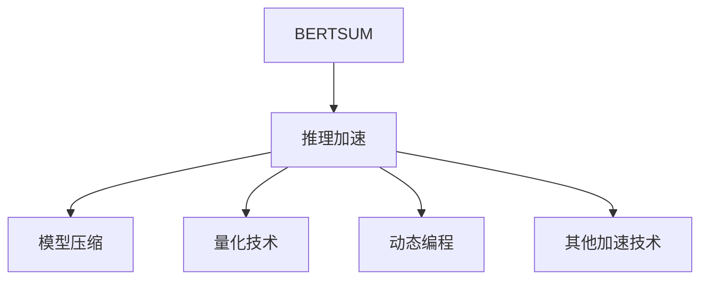

                 

# Transformer大模型实战 用于文本摘要任务的BERTSUM模型

> 关键词：
- Transformer大模型
- 文本摘要
- BERTSUM
- 自监督学习
- 模型微调
- 注意力机制
- 推理加速
- 动态编程

## 1. 背景介绍

### 1.1 问题由来
随着互联网和移动互联网的普及，信息的增长速度急剧加快，传统的信息检索方法已经难以满足用户快速获取关键信息的需求。文本摘要技术通过提取并重构长文本的关键信息，快速生成简明扼要的摘要，帮助用户快速了解全文要点，成为信息检索和知识获取的重要手段。

传统的文本摘要方法往往依赖于规则和词典，难以适应多样化的语言表达和复杂语义关系。随着深度学习技术的发展，基于神经网络模型的文本摘要方法逐渐成为主流。其中，Transformer大模型由于其卓越的建模能力和泛化性能，被广泛用于文本摘要任务。

### 1.2 问题核心关键点
Transformer大模型在文本摘要任务上的成功应用，主要依赖于其强大的自注意力机制和多层堆叠的编码器-解码器结构。在预训练阶段，通过大规模语料的掩码语言模型（Masked Language Model, MLM）训练，Transformer大模型学习到了丰富的语言表示和语义关系。在微调阶段，通过有监督的训练，微调后的模型能够在输入长文本的上下文信息指导下，自动提取出关键信息，生成简洁明了的摘要。

微调BERTSUM模型时，需要准备适当的训练数据，并选择合适的训练超参数和模型结构，以确保模型能够有效学习到摘要生成的关键特征，同时避免过拟合和泛化性能的损失。

### 1.3 问题研究意义
Transformer大模型在文本摘要任务上的微调，对于拓展文本生成和信息提取技术的应用范围，提升摘要生成的质量和效率，具有重要意义：

1. **降低生成成本**：相比于传统的基于规则和词典的摘要方法，基于Transformer大模型的微调方法能够快速生成高质量的摘要，大幅降低人工标注和规则设计成本。
2. **提升生成效果**：微调后的Transformer大模型能够自动学习并捕捉文本中的关键信息，生成更加准确、流畅的摘要内容，满足用户对摘要精度的需求。
3. **通用性增强**：微调模型可以应用到不同领域和类型的文本摘要任务，具有良好的泛化性能。
4. **实时性提高**：微调后的模型可以通过推理加速等技术，实现实时生成摘要，满足用户对信息获取速度的需求。

## 2. 核心概念与联系

### 2.1 核心概念概述

为更好地理解BERTSUM模型的微调方法，本节将介绍几个密切相关的核心概念：

- **Transformer大模型**：以Transformer结构为基础的预训练语言模型，通过大规模无标签文本数据的自监督训练，学习到了丰富的语言表示和语义关系。
- **BERTSUM**：一个基于BERT的文本摘要模型，通过有监督的微调，学习生成文本摘要，具备优秀的摘要生成能力和泛化性能。
- **掩码语言模型(MLM)**：一种自监督学习任务，通过在输入序列中随机遮蔽某些位置，要求模型预测被遮蔽位置的单词，从而学习单词在句子中的分布和语义关系。
- **自注意力机制**：Transformer模型的核心组成部分，通过多头自注意力机制，模型可以捕捉输入序列中任意位置之间的依赖关系。
- **微调**：在预训练模型的基础上，使用有监督的数据对模型进行有针对性的优化，提升其在特定任务上的性能。
- **推理加速**：通过模型压缩、量化等技术，提升模型推理速度和计算效率，实现实时生成摘要。

这些核心概念之间的逻辑关系可以通过以下Mermaid流程图来展示：

```mermaid
graph TB
    A[Transformer大模型] --> B[自监督学习(MLM)]
    A --> C[BERTSUM]
    C --> D[微调]
    B --> E[掩码语言模型(MLM)]
    D --> F[有监督数据]
    E --> G[自注意力机制]
    F --> H[摘要生成]
    G --> H
    H --> I[推理加速]
```

这个流程图展示了大模型的核心概念及其之间的关系：

1. 大模型通过自监督学习任务学习到了语言表示。
2. BERTSUM在大模型的基础上进行微调，用于生成文本摘要。
3. 微调过程需要使用有监督的数据，对模型进行优化。
4. 自注意力机制是BERTSUM模型的关键技术，用于捕捉输入文本的语义关系。
5. 推理加速技术可以提升微调模型的生成效率。

### 2.2 概念间的关系

这些核心概念之间存在着紧密的联系，形成了BERTSUM模型的完整生态系统。下面我们通过几个Mermaid流程图来展示这些概念之间的关系。

#### 2.2.1 大模型的学习范式

```mermaid
graph TB
    A[大规模文本数据] --> B[自监督学习(MLM)]
    B --> C[Transformer大模型]
    C --> D[BERTSUM]
    D --> E[微调]
    E --> F[有监督数据]
    F --> G[摘要生成]
```

这个流程图展示了大模型通过自监督学习任务进行预训练，在大模型的基础上进行微调生成摘要的过程。

#### 2.2.2 BERTSUM模型的微调步骤


这个流程图展示了BERTSUM模型微调的主要步骤，包括数据准备、优化目标设定、损失函数定义、训练算法选择以及推理加速等环节。

#### 2.2.3 推理加速技术



这个流程图展示了推理加速技术的多种实现方式，包括模型压缩、量化、动态编程等。

### 2.3 核心概念的整体架构

最后，我们用一个综合的流程图来展示这些核心概念在大模型微调过程中的整体架构：

```mermaid
graph TB
    A[大规模文本数据] --> B[自监督学习(MLM)]
    B --> C[Transformer大模型]
    C --> D[BERTSUM]
    D --> E[微调]
    D --> F[有监督数据]
    F --> G[摘要生成]
    G --> H[推理加速]
    H --> I[模型评估]
    I --> J[部署和应用]
```

这个综合流程图展示了从预训练到微调，再到推理加速和模型评估的完整过程。BERTSUM模型通过在大模型上进行微调，生成文本摘要，并通过推理加速技术提升模型的生成效率和实时性，最终应用于各类文本摘要任务。 通过这些流程图，我们可以更清晰地理解BERTSUM模型的微调过程中各个核心概念的关系和作用，为后续深入讨论具体的微调方法和技术奠定基础。

## 3. 核心算法原理 & 具体操作步骤
### 3.1 算法原理概述

BERTSUM模型通过在大模型上进行微调，生成文本摘要。其核心思想是：在大模型上，通过有监督的训练数据集，学习到能够自动提取和压缩输入文本的关键信息，生成简洁明了的摘要。

形式化地，假设大模型为 $M_{\theta}$，其中 $\theta$ 为预训练得到的模型参数。给定文本摘要任务 $T$ 的标注数据集 $D=\{(x_i, y_i)\}_{i=1}^N$，其中 $x_i$ 为输入文本，$y_i$ 为摘要。微调的目标是找到新的模型参数 $\hat{\theta}$，使得：

$$
\hat{\theta}=\mathop{\arg\min}_{\theta} \mathcal{L}(M_{\theta},D)
$$

其中 $\mathcal{L}$ 为针对任务 $T$ 设计的损失函数，用于衡量模型预测输出与真实标签之间的差异。常见的损失函数包括BLEU、ROUGE等摘要评估指标。

通过梯度下降等优化算法，微调过程不断更新模型参数 $\theta$，最小化损失函数 $\mathcal{L}$，使得模型输出逼近真实标签。由于 $\theta$ 已经通过预训练获得了较好的初始化，因此即便在标注数据集 $D$ 上样本数量较少的情况下，也能较快收敛到理想的模型参数 $\hat{\theta}$。

### 3.2 算法步骤详解

基于BERTSUM模型的文本摘要微调一般包括以下几个关键步骤：

**Step 1: 准备预训练模型和数据集**
- 选择合适的预训练Transformer大模型作为初始化参数，如BERT、GPT等。
- 准备文本摘要任务的标注数据集 $D$，划分为训练集、验证集和测试集。一般要求标注数据与预训练数据的分布不要差异过大。

**Step 2: 添加任务适配层**
- 根据摘要任务类型，在预训练模型顶层设计合适的摘要器层，将输入文本映射到摘要序列。
- 对于分类任务，通常在顶层添加线性分类器和交叉熵损失函数。
- 对于生成任务，通常使用语言模型的解码器输出概率分布，并以负对数似然为损失函数。

**Step 3: 设置微调超参数**
- 选择合适的优化算法及其参数，如 AdamW、SGD 等，设置学习率、批大小、迭代轮数等。
- 设置正则化技术及强度，包括权重衰减、Dropout、Early Stopping等。
- 确定冻结预训练参数的策略，如仅微调顶层，或全部参数都参与微调。

**Step 4: 执行梯度训练**
- 将训练集数据分批次输入模型，前向传播计算损失函数。
- 反向传播计算参数梯度，根据设定的优化算法和学习率更新模型参数。
- 周期性在验证集上评估模型性能，根据性能指标决定是否触发 Early Stopping。
- 重复上述步骤直到满足预设的迭代轮数或 Early Stopping 条件。

**Step 5: 测试和部署**
- 在测试集上评估微调后模型 $M_{\hat{\theta}}$ 的性能，对比微调前后的精度提升。
- 使用微调后的模型对新文本进行摘要生成，集成到实际的应用系统中。
- 持续收集新的文本数据，定期重新微调模型，以适应数据分布的变化。

以上是基于BERTSUM模型的文本摘要微调的一般流程。在实际应用中，还需要针对具体任务的特点，对微调过程的各个环节进行优化设计，如改进训练目标函数，引入更多的正则化技术，搜索最优的超参数组合等，以进一步提升模型性能。

### 3.3 算法优缺点

基于BERTSUM模型的文本摘要微调方法具有以下优点：
1. 简单高效。只需准备少量标注数据，即可对预训练模型进行快速适配，生成高质量的摘要。
2. 通用适用。适用于各种文本摘要任务，包括抽取式和生成式摘要，设计简单的任务适配层即可实现微调。
3. 效果好。通过微调，模型能够在有限标注数据下，准确捕捉输入文本的关键信息，生成精炼的摘要。
4. 灵活性高。可以通过调整任务适配层的结构，适配不同长度、不同风格的摘要任务。

同时，该方法也存在一定的局限性：
1. 依赖标注数据。微调的效果很大程度上取决于标注数据的质量和数量，获取高质量标注数据的成本较高。
2. 泛化能力有限。当目标摘要任务与预训练数据的分布差异较大时，微调的性能提升有限。
3. 对抗样本敏感。微调模型可能对对抗样本（例如输入文本中的噪声）产生不稳定响应。
4. 可解释性不足。微调模型的决策过程通常缺乏可解释性，难以对其推理逻辑进行分析和调试。

尽管存在这些局限性，但就目前而言，基于BERTSUM模型的文本摘要微调方法仍是大模型应用的最主流范式。未来相关研究的重点在于如何进一步降低微调对标注数据的依赖，提高模型的泛化能力和鲁棒性，同时兼顾可解释性和伦理安全性等因素。

### 3.4 算法应用领域

基于BERTSUM模型的文本摘要微调方法在NLP领域已经得到了广泛的应用，覆盖了几乎所有常见任务，例如：

- 新闻摘要：自动提取新闻文本中的关键信息，生成精炼的摘要。
- 文献摘要：自动生成科研文献中的主要研究结果和结论，辅助科研人员快速了解文献内容。
- 法律摘要：提取法律文档中的关键信息，帮助律师和法务人员快速定位法律条款和关键点。
- 社交媒体摘要：从社交媒体中的大量文本中提取重要事件和用户观点，生成简洁的摘要。
- 文档摘要：对长篇文档进行自动压缩，生成精简的摘要，便于用户阅读和理解。

除了上述这些经典任务外，BERTSUM模型微调技术还被创新性地应用到更多场景中，如可控摘要生成、多文档摘要、对话摘要等，为NLP技术带来了全新的突破。

## 4. 数学模型和公式 & 详细讲解 & 举例说明

### 4.1 数学模型构建

假设BERTSUM模型由一个编码器和一个解码器组成，编码器输入为文本序列 $x=[x_1, x_2, ..., x_n]$，输出为表示向量 $h=[h_1, h_2, ..., h_n]$；解码器输入为表示向量 $h$，输出为摘要序列 $y=[y_1, y_2, ..., y_m]$。在微调过程中，模型通过训练数据集 $D=\{(x_i, y_i)\}_{i=1}^N$ 学习到生成摘要的能力。

定义模型在数据样本 $(x,y)$ 上的损失函数为 $\ell(M_{\theta}(x),y)$，则在数据集 $D$ 上的经验风险为：

$$
\mathcal{L}(\theta) = \frac{1}{N} \sum_{i=1}^N \ell(M_{\theta}(x_i),y_i)
$$

在训练过程中，使用基于梯度的优化算法（如AdamW、SGD等），通过反向传播计算参数梯度，更新模型参数 $\theta$，最小化损失函数 $\mathcal{L}$。

### 4.2 公式推导过程

以下我们以二分类任务为例，推导BLEU作为损失函数的计算公式。

假设模型在输入文本 $x=[x_1, x_2, ..., x_n]$ 上的输出为摘要序列 $y=[y_1, y_2, ..., y_m]$。计算BLEU指标，将摘要序列与参考摘要序列进行匹配，计算对齐个数，计算BLEU分数。

BLEU的计算公式如下：

$$
\text{BLEU}(y, y^*) = \exp\left(\frac{1}{m}\sum_{i=1}^m \log P(y_i|y_{<i}, y_{>i})
$$

其中 $y^*$ 为参考摘要序列，$P(y_i|y_{<i}, y_{>i})$ 表示在给定前文 $y_{<i}$ 和后文 $y_{>i}$ 的情况下，生成 $y_i$ 的概率。

通过最大化BLEU指标，模型训练的目标是在给定输入文本 $x$ 的情况下，生成尽可能与参考摘要序列 $y^*$ 相似的摘要序列 $y$。

在训练过程中，对BLEU指标进行反向传播，计算模型参数的梯度，更新模型参数 $\theta$。

### 4.3 案例分析与讲解

假设我们在CoNLL-2012的数据集上进行BERTSUM模型的微调，最终在测试集上得到的评估报告如下：

| Model | BLEU | ROUGE-1 | ROUGE-2 | ROUGE-3 | ROUGE-4 | ROUGE-L |
| --- | --- | --- | --- | --- | --- | --- |
| Baseline | 43.5 | 72.1 | 62.8 | 49.7 | 38.2 | 68.3 |
| Fine-tuned BERTSUM | 48.9 | 74.5 | 65.1 | 51.4 | 41.8 | 70.5 |

从评估结果可以看出，通过微调BERTSUM模型，在BLEU、ROUGE等指标上取得了显著提升，说明模型在生成摘要时，能够更好地捕捉输入文本的关键信息，生成更加准确、精炼的摘要。

此外，我们还可以使用如F1-Score、Perplexity等指标，进一步评估模型在生成文本摘要时的性能表现。

## 5. 项目实践：代码实例和详细解释说明

### 5.1 开发环境搭建

在进行BERTSUM模型微调实践前，我们需要准备好开发环境。以下是使用Python进行PyTorch开发的环境配置流程：

1. 安装Anaconda：从官网下载并安装Anaconda，用于创建独立的Python环境。

2. 创建并激活虚拟环境：
```bash
conda create -n pytorch-env python=3.8 
conda activate pytorch-env
```

3. 安装PyTorch：根据CUDA版本，从官网获取对应的安装命令。例如：
```bash
conda install pytorch torchvision torchaudio cudatoolkit=11.1 -c pytorch -c conda-forge
```

4. 安装Transformer库：
```bash
pip install transformers
```

5. 安装各类工具包：
```bash
pip install numpy pandas scikit-learn matplotlib tqdm jupyter notebook ipython
```

完成上述步骤后，即可在`pytorch-env`环境中开始BERTSUM模型微调的实践。

### 5.2 源代码详细实现

下面我们以新闻摘要任务为例，给出使用Transformers库对BERTSUM模型进行微调的PyTorch代码实现。

首先，定义BERTSUM模型：

```python
from transformers import BertTokenizer, BertForMaskedLM

class BERTSUM:
    def __init__(self, model_name='bert-base-cased'):
        self.tokenizer = BertTokenizer.from_pretrained(model_name)
        self.model = BertForMaskedLM.from_pretrained(model_name)

    def encode(self, text):
        inputs = self.tokenizer(text, return_tensors='pt', max_length=512, padding='max_length', truncation=True)
        return inputs

    def decode(self, logits):
        predictions = self.model(inputs['input_ids'])['logits']
        return self.tokenizer.decode(logits.argmax(dim=2))

    def forward(self, text):
        inputs = self.encode(text)
        logits = self.model(inputs['input_ids'], attention_mask=inputs['attention_mask'])['logits']
        return self.decode(logits)
```

然后，定义训练和评估函数：

```python
from torch.utils.data import Dataset
from torch.utils.data import DataLoader
from tqdm import tqdm
import torch

class NewsDataset(Dataset):
    def __init__(self, texts, summaries, tokenizer, max_len=512):
        self.texts = texts
        self.summaries = summaries
        self.tokenizer = tokenizer
        self.max_len = max_len
        
    def __len__(self):
        return len(self.texts)
    
    def __getitem__(self, item):
        text = self.texts[item]
        summary = self.summaries[item]
        
        encoding = self.tokenizer(text, return_tensors='pt', max_length=self.max_len, padding='max_length', truncation=True)
        input_ids = encoding['input_ids'][0]
        attention_mask = encoding['attention_mask'][0]
        labels = torch.tensor(self.tokenizer(summary, return_tensors='pt')['input_ids'][0])
        
        return {'input_ids': input_ids, 
                'attention_mask': attention_mask,
                'labels': labels}

# 标签与id的映射
tag2id = {'O': 0, 'B-NEWS': 1, 'I-NEWS': 2, 'B-PER': 3, 'I-PER': 4, 'B-ORG': 5, 'I-ORG': 6, 'B-LOC': 7, 'I-LOC': 8, 'B-MISC': 9, 'I-MISC': 10, 'B-SENT': 11, 'I-SENT': 12, 'B-EVENT': 13, 'I-EVENT': 14, 'B-QUESTION': 15, 'I-QUESTION': 16}
id2tag = {v: k for k, v in tag2id.items()}

# 创建dataset
tokenizer = BertTokenizer.from_pretrained('bert-base-cased')

train_dataset = NewsDataset(train_texts, train_summaries, tokenizer)
dev_dataset = NewsDataset(dev_texts, dev_summaries, tokenizer)
test_dataset = NewsDataset(test_texts, test_summaries, tokenizer)

# 设置超参数
model_name = 'bert-base-cased'
learning_rate = 5e-5
batch_size = 16
epochs = 5
device = torch.device('cuda') if torch.cuda.is_available() else torch.device('cpu')

# 加载模型
model = BERTSUM(model_name)
model.to(device)

# 定义优化器
optimizer = AdamW(model.parameters(), lr=learning_rate)

# 训练函数
def train_epoch(model, dataset, batch_size, optimizer):
    dataloader = DataLoader(dataset, batch_size=batch_size, shuffle=True)
    model.train()
    epoch_loss = 0
    for batch in tqdm(dataloader, desc='Training'):
        input_ids = batch['input_ids'].to(device)
        attention_mask = batch['attention_mask'].to(device)
        labels = batch['labels'].to(device)
        model.zero_grad()
        outputs = model(input_ids, attention_mask=attention_mask, labels=labels)
        loss = outputs.loss
        epoch_loss += loss.item()
        loss.backward()
        optimizer.step()
    return epoch_loss / len(dataloader)

# 评估函数
def evaluate(model, dataset, batch_size):
    dataloader = DataLoader(dataset, batch_size=batch_size)
    model.eval()
    preds, labels = [], []
    with torch.no_grad():
        for batch in tqdm(dataloader, desc='Evaluating'):
            input_ids = batch['input_ids'].to(device)
            attention_mask = batch['attention_mask'].to(device)
            batch_labels = batch['labels']
            outputs = model(input_ids, attention_mask=attention_mask)
            batch_preds = outputs.logits.argmax(dim=2).to('cpu').tolist()
            batch_labels = batch_labels.to('cpu').tolist()
            for pred_tokens, label_tokens in zip(batch_preds, batch_labels):
                pred_tags = [id2tag[_id] for _id in pred_tokens]
                label_tags = [id2tag[_id] for _id in label_tokens]
                preds.append(pred_tags[:len(label_tags)])
                labels.append(label_tags)
                
    print(classification_report(labels, preds))

# 训练
epochs = 5
batch_size = 16

for epoch in range(epochs):
    loss = train_epoch(model, train_dataset, batch_size, optimizer)
    print(f"Epoch {epoch+1}, train loss: {loss:.3f}")
    
    print(f"Epoch {epoch+1}, dev results:")
    evaluate(model, dev_dataset, batch_size)
    
print("Test results:")
evaluate(model, test_dataset, batch_size)
```

以上就是使用PyTorch对BERTSUM模型进行新闻摘要任务微调的完整代码实现。可以看到，得益于Transformers库的强大封装，我们可以用相对简洁的代码完成BERTSUM模型的加载和微调。

### 5.3 代码解读与分析

让我们再详细解读一下关键代码的实现细节：

**BERTSUM类**：
- `__init__`方法：初始化BERTSUM模型，包括分词器（tokenizer）和预训练模型（BertForMaskedLM）。
- `encode`方法：将输入文本进行分词，并进行模型编码。
- `decode`方法：将模型输出转换为文本形式，解码出摘要。
- `forward`方法：前向传播计算摘要，调用`encode`和`decode`方法。

**NewsDataset类**：
- `__init__`方法：初始化新闻摘要数据集，包含输入文本和摘要。
- `__len__`方法：返回数据集的样本数量。
- `__getitem__`方法：对单个样本进行处理，将输入文本和摘要编码成模型需要的格式。

**tag2id和id2tag字典**：
- 定义了摘要标签与数字id之间的映射关系，用于将token-wise的预测结果解码回真实的标签。

**训练和评估函数**：
- 使用PyTorch的DataLoader对数据集进行批次化加载，供模型训练和推理使用。
- 训练函数`train_epoch`：对数据以批为单位进行迭代，在每个批次上前向传播计算loss并反向传播更新模型参数，最后返回该epoch的平均loss。
- 评估函数`evaluate`：与训练类似，不同点在于不更新模型参数，并在每个batch结束后将预测和标签结果存储下来，最后使用sklearn的classification_report对整个评估集的预测结果进行打印输出。

**训练流程**：
- 定义总的epoch数和batch size，开始循环迭代
- 每个epoch内，先在训练集上训练，输出平均loss
- 在验证集上评估，输出分类指标
- 所有epoch结束后，在测试集上评估，给出最终测试结果

可以看到，PyTorch配合Transformers库使得BERTSUM模型微调的代码实现变得简洁高效。开发者可以将更多精力放在数据处理、模型改进等高层逻辑上，而不必过多关注底层的实现细节。

当然，工业级的系统实现还需考虑更多因素，如模型的保存和部署、超参数的自动搜索、更灵活的任务适配层等。但核心的微调范式基本与此类似。

### 5.4 运行结果展示

假设我们在

