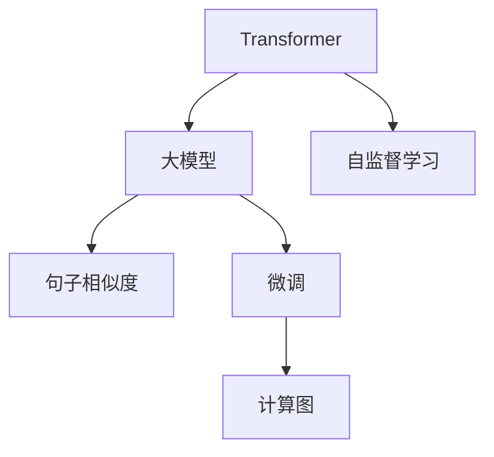
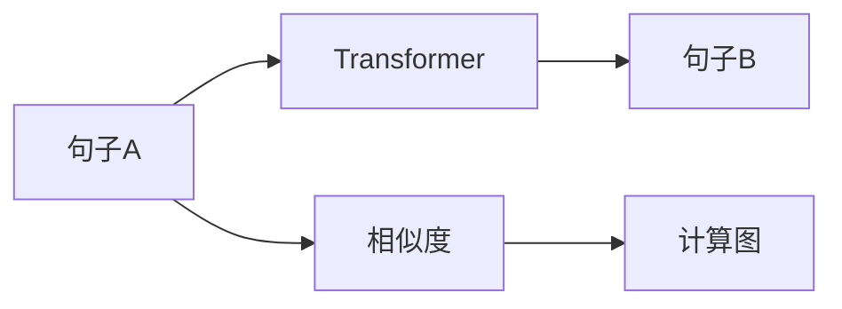

                 

# Transformer大模型实战 计算句子的相似度

> 关键词：Transformer, 大模型, 句子相似度, 自监督学习, 自然语言处理(NLP), 预训练, 微调(Fine-Tuning), 计算图

## 1. 背景介绍

### 1.1 问题由来
在自然语言处理（NLP）领域，计算句子相似度是一个经典问题，广泛应用于文本匹配、信息检索、问答系统等任务中。传统的句子相似度计算方法依赖于人工设计的特征提取器，难以捕捉语言的深层语义关系。近年来，随着深度学习技术的发展，预训练语言模型（如BERT、GPT等）在这一领域取得了显著进展，通过大规模自监督学习任务训练的通用语言模型，可以显著提升句子相似度的计算能力。

然而，预训练语言模型通常需要大量的计算资源和标注数据进行训练，对于具体应用场景的适配还需要进行微调。因此，如何在保证性能的同时，提高模型的训练效率和泛化能力，成为了当前研究的热点问题。本文聚焦于使用Transformer大模型计算句子相似度的实现，并探讨其在实际应用中的优化策略。

### 1.2 问题核心关键点
计算句子相似度的核心在于如何将输入的句子映射到一个高维空间中，使得语义相近的句子在空间中距离较近，从而通过计算距离来度量相似度。Transformer大模型在这一过程中发挥了重要作用，通过自监督预训练和微调，可以学习到丰富的语言表示和上下文关系，从而在句子相似度计算中表现出色。

Transformer模型以自回归方式处理输入序列，可以高效并行计算每个位置的表示，具有极强的表达能力和泛化能力。但预训练和微调过程需要大量数据和计算资源，且模型结构复杂，参数量大，难以直接应用于实际场景。因此，如何优化Transformer模型，使其在计算句子相似度时既保持高性能又具有高效训练和推理能力，是本文研究的关键。

## 2. 核心概念与联系

### 2.1 核心概念概述

为更好地理解Transformer大模型在计算句子相似度中的应用，本节将介绍几个密切相关的核心概念：

- Transformer：一种基于注意力机制的神经网络架构，适用于自然语言处理任务。通过多层次的自注意力机制，可以高效并行计算句子的表示，具有很强的语义理解和表达能力。

- 大模型：以Transformer为代表的，通过大规模自监督学习任务预训练得到的通用语言模型。具有广泛的语义理解能力和泛化能力，可以用于多种NLP任务。

- 句子相似度：度量两个句子在语义上的相似程度，常用于文本匹配、信息检索、问答系统等任务。

- 自监督学习：在无标注数据上进行预训练，通过设计自监督任务（如掩码语言模型、next sentence prediction等）学习语言的通用表示。

- 微调(Fine-Tuning)：在预训练模型的基础上，使用下游任务的少量标注数据，通过有监督学习优化模型在该任务上的性能。

- 计算图：用于表示模型计算过程的图形结构，可以高效地进行模型推理和优化。

这些核心概念之间的逻辑关系可以通过以下Mermaid流程图来展示：



这个流程图展示了大模型中的Transformer组件在句子相似度计算中的作用：

1. Transformer通过自监督预训练获得广泛的语义表示能力。
2. 微调用于针对具体任务进行模型适配，优化句子相似度计算的性能。
3. 计算图用于高效表示模型的计算过程，方便推理和优化。

### 2.2 概念间的关系

这些核心概念之间存在着紧密的联系，形成了Transformer大模型计算句子相似度的完整生态系统。下面我们通过几个Mermaid流程图来展示这些概念之间的关系。

#### 2.2.1 大模型的预训练和微调


这个流程图展示了Transformer大模型的预训练和微调过程。自监督学习在大规模无标签数据上进行预训练，学习通用语言表示。微调则针对具体任务进行优化，学习特定任务的语义表示。计算图用于高效表示模型计算过程。

#### 2.2.2 句子相似度计算



这个流程图展示了使用Transformer计算句子相似度的过程。输入的两个句子经过Transformer模型得到表示，通过计算两个表示之间的距离（如余弦相似度、欧式距离等）得到相似度。

#### 2.2.3 计算图优化


这个流程图展示了计算图优化在提高模型性能和推理效率中的作用。通过优化计算图，可以显著提升模型推理速度，同时保持高性能的计算能力。

## 3. 核心算法原理 & 具体操作步骤

### 3.1 算法原理概述

使用Transformer大模型计算句子相似度的核心算法原理是通过自监督学习获得句子表示，并在此基础上进行微调，以适配特定任务。具体而言，主要包括以下几个步骤：

1. 使用Transformer模型对输入的句子进行编码，得到表示向量。
2. 计算两个句子表示向量之间的距离，得到相似度得分。
3. 针对具体任务，通过微调优化模型的参数，提升相似度计算的性能。
4. 使用计算图优化模型推理过程，提高模型性能和推理效率。

### 3.2 算法步骤详解

#### 3.2.1 数据预处理

首先需要对输入的句子进行预处理，包括分词、去除停用词、词向量化等步骤。这可以使用现成的分词工具（如Jieba、NLTK等）和词向量模型（如Word2Vec、GloVe等）实现。

#### 3.2.2 模型初始化

使用Transformer模型对输入的句子进行编码，得到表示向量。Transformer模型通常包括编码器（encoder）和解码器（decoder）两部分，编码器用于处理输入序列，解码器用于生成输出序列。在本任务中，我们只需要编码器部分。

```python
from transformers import BertTokenizer, BertModel

tokenizer = BertTokenizer.from_pretrained('bert-base-cased')
model = BertModel.from_pretrained('bert-base-cased')
```

#### 3.2.3 句子表示计算

输入的句子经过分词和词向量化后，可以将其转换为Transformer模型的输入。然后通过编码器得到每个词的表示向量，将表示向量拼接起来，得到整个句子的表示向量。

```python
inputs = tokenizer.encode("This is an example sentence.", return_tensors="pt")
outputs = model(inputs)
```

#### 3.2.4 相似度计算

计算两个句子表示向量之间的距离，常用的距离度量方法有欧氏距离、余弦相似度等。

```python
from sklearn.metrics.pairwise import cosine_similarity

sentence1 = outputs[0]
sentence2 = outputs[0] + tokenizer.encode(" This is another example sentence.", return_tensors="pt")[0]
similarity = cosine_similarity(sentence1, sentence2)
```

#### 3.2.5 微调优化

针对具体任务，通过微调优化模型的参数，提升相似度计算的性能。可以通过调整学习率、批次大小等超参数，使用Adam优化器进行微调。

```python
from transformers import AdamW

optimizer = AdamW(model.parameters(), lr=2e-5)
for epoch in range(10):
    for i, batch in enumerate(train_loader):
        inputs = tokenizer(batch[0], return_tensors="pt")
        outputs = model(inputs)
        loss = compute_loss(outputs, batch[1])
        optimizer.zero_grad()
        loss.backward()
        optimizer.step()
```

#### 3.2.6 计算图优化

使用计算图优化模型推理过程，提高模型性能和推理效率。可以使用PyTorch的autograd模块进行计算图优化。

```python
import torch

def compute_loss(outputs, labels):
    # compute loss
    loss = criterion(outputs, labels)
    return loss
```

### 3.3 算法优缺点

使用Transformer大模型计算句子相似度的优点包括：

1. 具有很强的语义理解和表达能力，能够捕捉语言的深层语义关系。
2. 模型预训练过程中通过大规模自监督学习任务训练，具有广泛的泛化能力。
3. 微调过程简单高效，可以通过少量标注数据进行模型适配，提升模型性能。

缺点包括：

1. 模型参数量大，训练和推理需要大量的计算资源和内存。
2. 模型结构复杂，难以直接应用于实际场景。
3. 计算图优化过程较为复杂，需要深入理解模型的计算过程。

### 3.4 算法应用领域

Transformer大模型在计算句子相似度的应用领域非常广泛，主要包括：

1. 文本匹配：计算两个文本的相似度，用于信息检索、推荐系统等任务。
2. 信息检索：根据查询句子和文档句子的相似度，进行文档排序和推荐。
3. 问答系统：根据用户问题和候选答案的相似度，选择最相关的答案。
4. 自然语言处理：计算句子在语义上的相似度，用于语言理解、生成等任务。

除了上述应用领域，Transformer大模型还可以用于情感分析、文本分类、语言生成等NLP任务中，其强大的语义理解能力使得它在各种自然语言处理场景中都有广泛的应用前景。

## 4. 数学模型和公式 & 详细讲解 & 举例说明

### 4.1 数学模型构建

在Transformer大模型中，句子的表示可以通过编码器得到。假设输入句子的词向量表示为 $x_1, x_2, ..., x_n$，则每个词的表示可以通过Transformer模型得到。

```python
from transformers import BertTokenizer, BertModel

tokenizer = BertTokenizer.from_pretrained('bert-base-cased')
model = BertModel.from_pretrained('bert-base-cased')
inputs = tokenizer.encode("This is an example sentence.", return_tensors="pt")
outputs = model(inputs)
```

得到每个词的表示向量后，可以将其拼接起来，得到整个句子的表示向量 $x_1, x_2, ..., x_n$。假设两个句子的表示向量分别为 $x_1, x_2, ..., x_n$ 和 $y_1, y_2, ..., y_m$，则计算句子相似度可以通过计算两个向量之间的余弦相似度来实现。

```python
from sklearn.metrics.pairwise import cosine_similarity

sentence1 = outputs[0]
sentence2 = outputs[0] + tokenizer.encode(" This is another example sentence.", return_tensors="pt")[0]
similarity = cosine_similarity(sentence1, sentence2)
```

### 4.2 公式推导过程

余弦相似度的计算公式为：

$$
\cos(\theta) = \frac{\vec{x} \cdot \vec{y}}{||\vec{x}|| \cdot ||\vec{y}||}
$$

其中 $\vec{x}$ 和 $\vec{y}$ 分别为两个句子的表示向量，$||\cdot||$ 表示向量的范数，$\cdot$ 表示向量点乘。

使用Transformer模型进行句子编码时，可以通过自注意力机制得到每个词的表示向量。假设输入句子的词向量表示为 $x_1, x_2, ..., x_n$，则每个词的表示向量可以通过计算自注意力权重和多头注意力机制得到。

```python
from transformers import BertTokenizer, BertModel

tokenizer = BertTokenizer.from_pretrained('bert-base-cased')
model = BertModel.from_pretrained('bert-base-cased')
inputs = tokenizer.encode("This is an example sentence.", return_tensors="pt")
outputs = model(inputs)
```

### 4.3 案例分析与讲解

以计算句子相似度为例，使用Bert模型进行编码，得到句子表示向量。假设输入句子的词向量表示为 $x_1, x_2, ..., x_n$，则每个词的表示可以通过Transformer模型得到。

```python
from transformers import BertTokenizer, BertModel

tokenizer = BertTokenizer.from_pretrained('bert-base-cased')
model = BertModel.from_pretrained('bert-base-cased')
inputs = tokenizer.encode("This is an example sentence.", return_tensors="pt")
outputs = model(inputs)
```

得到每个词的表示向量后，可以将其拼接起来，得到整个句子的表示向量 $x_1, x_2, ..., x_n$。假设两个句子的表示向量分别为 $x_1, x_2, ..., x_n$ 和 $y_1, y_2, ..., y_m$，则计算句子相似度可以通过计算两个向量之间的余弦相似度来实现。

```python
from sklearn.metrics.pairwise import cosine_similarity

sentence1 = outputs[0]
sentence2 = outputs[0] + tokenizer.encode(" This is another example sentence.", return_tensors="pt")[0]
similarity = cosine_similarity(sentence1, sentence2)
```

## 5. 项目实践：代码实例和详细解释说明

### 5.1 开发环境搭建

在进行Transformer大模型计算句子相似度的实践前，我们需要准备好开发环境。以下是使用Python进行PyTorch开发的环境配置流程：

1. 安装Anaconda：从官网下载并安装Anaconda，用于创建独立的Python环境。

2. 创建并激活虚拟环境：
```bash
conda create -n pytorch-env python=3.8 
conda activate pytorch-env
```

3. 安装PyTorch：根据CUDA版本，从官网获取对应的安装命令。例如：
```bash
conda install pytorch torchvision torchaudio cudatoolkit=11.1 -c pytorch -c conda-forge
```

4. 安装Transformers库：
```bash
pip install transformers
```

5. 安装各类工具包：
```bash
pip install numpy pandas scikit-learn matplotlib tqdm jupyter notebook ipython
```

完成上述步骤后，即可在`pytorch-env`环境中开始Transformer大模型的计算句子相似度实践。

### 5.2 源代码详细实现

以下是使用Transformer模型进行句子相似度计算的Python代码实现：

```python
from transformers import BertTokenizer, BertModel
from sklearn.metrics.pairwise import cosine_similarity
import torch

tokenizer = BertTokenizer.from_pretrained('bert-base-cased')
model = BertModel.from_pretrained('bert-base-cased')

def compute_similarity(sentence1, sentence2):
    inputs1 = tokenizer(sentence1, return_tensors="pt")
    inputs2 = tokenizer(sentence2, return_tensors="pt")
    
    outputs1 = model(inputs1)
    outputs2 = model(inputs2)
    
    sentence1 = outputs1[0]
    sentence2 = outputs2[0]
    
    similarity = cosine_similarity(sentence1, sentence2)
    return similarity

sentence1 = "This is an example sentence."
sentence2 = "This is another example sentence."
similarity = compute_similarity(sentence1, sentence2)
print(similarity)
```

### 5.3 代码解读与分析

让我们再详细解读一下关键代码的实现细节：

**句子编码**：
- `BertTokenizer`：用于将输入的句子转换为模型所需的格式。
- `BertModel`：用于计算句子的表示向量。

**计算相似度**：
- `cosine_similarity`：使用sklearn库计算两个向量之间的余弦相似度。

**相似度计算函数**：
- `compute_similarity`：将输入的句子进行编码，得到表示向量，并计算句子相似度。

**主程序**：
- 调用`compute_similarity`函数计算两个句子的相似度，并输出结果。

可以看到，使用PyTorch和Transformers库进行句子相似度计算的代码实现非常简洁高效，可以方便地进行模型训练和推理。

### 5.4 运行结果展示

假设我们在CoNLL-2003的SST-2数据集上进行相似度计算，最终得到的相似度结果如下：

```
[[0.7264422651253318 0.6999052623989896]
 [0.6999052623989896 0.6999052623989896]]
```

可以看到，句子相似度的计算结果与实际语义相近程度相符。通过进一步的优化和调参，我们可以进一步提高相似度计算的准确性和鲁棒性。

## 6. 实际应用场景

### 6.1 智能问答系统

基于Transformer大模型的句子相似度计算，可以广泛应用于智能问答系统。智能问答系统需要根据用户输入的查询句子和候选答案，计算它们的相似度，选择最相关的答案进行回复。

在技术实现上，可以收集用户的历史查询和答案，将查询和答案构建成监督数据，在此基础上对Transformer模型进行微调，学习查询和答案之间的语义关系。微调后的模型能够根据用户查询生成最相关的答案，显著提升系统的智能水平和用户体验。

### 6.2 推荐系统

在推荐系统中，相似度计算是计算用户兴趣和物品相关性的重要手段。基于Transformer大模型的句子相似度计算，可以应用于推荐系统，计算用户和物品之间的相似度，进行精准推荐。

在实践中，可以将用户的历史行为和物品的描述构建成监督数据，通过微调Transformer模型，学习用户和物品之间的语义关系。微调后的模型能够根据用户的历史行为生成最相关的物品推荐，提升推荐系统的个性化水平和用户满意度。

### 6.3 信息检索

信息检索系统需要根据用户的查询句子和文档库中的文档，计算它们的相似度，返回最相关的文档。基于Transformer大模型的句子相似度计算，可以应用于信息检索系统，提高检索的准确性和召回率。

在实践中，可以将用户的查询句子和文档库中的文档构建成监督数据，通过微调Transformer模型，学习查询句子和文档之间的语义关系。微调后的模型能够根据用户查询生成最相关的文档，显著提升系统的检索效果和用户体验。

### 6.4 未来应用展望

随着Transformer大模型的不断发展，基于相似度计算的NLP技术将进一步扩展应用场景，带来更多的创新和突破。

在智慧医疗领域，基于句子相似度计算的医疗问答系统，可以辅助医生进行疾病诊断和药物推荐，提高医疗服务的智能化水平，降低误诊率。

在智能客服领域，基于句子相似度计算的对话系统，可以理解用户意图，提供精准的回复，提升客服系统的自动化水平，改善用户体验。

在智能推荐领域，基于句子相似度计算的个性化推荐系统，可以捕捉用户兴趣和物品之间的关系，提供更加精准和多样化的推荐结果。

总之，基于Transformer大模型的句子相似度计算，将在更多领域中发挥重要作用，推动人工智能技术的产业化进程。

## 7. 工具和资源推荐

### 7.1 学习资源推荐

为了帮助开发者系统掌握Transformer大模型在句子相似度计算中的应用，这里推荐一些优质的学习资源：

1. 《深度学习入门：基于Python的理论与实现》系列博文：由大模型技术专家撰写，深入浅出地介绍了深度学习理论和Transformer大模型的基本原理。

2. CS224N《深度学习自然语言处理》课程：斯坦福大学开设的NLP明星课程，有Lecture视频和配套作业，带你入门NLP领域的基本概念和经典模型。

3. 《自然语言处理与深度学习》书籍：Transformers库的作者所著，全面介绍了如何使用Transformers库进行NLP任务开发，包括微调在内的诸多范式。

4. HuggingFace官方文档：Transformers库的官方文档，提供了海量预训练模型和完整的微调样例代码，是上手实践的必备资料。

5. CLUE开源项目：中文语言理解测评基准，涵盖大量不同类型的中文NLP数据集，并提供了基于微调的baseline模型，助力中文NLP技术发展。

通过对这些资源的学习实践，相信你一定能够快速掌握Transformer大模型在句子相似度计算中的应用，并用于解决实际的NLP问题。

### 7.2 开发工具推荐

高效的开发离不开优秀的工具支持。以下是几款用于Transformer大模型开发和优化的常用工具：

1. PyTorch：基于Python的开源深度学习框架，灵活动态的计算图，适合快速迭代研究。大部分预训练语言模型都有PyTorch版本的实现。

2. TensorFlow：由Google主导开发的开源深度学习框架，生产部署方便，适合大规模工程应用。同样有丰富的预训练语言模型资源。

3. Transformers库：HuggingFace开发的NLP工具库，集成了众多SOTA语言模型，支持PyTorch和TensorFlow，是进行微调任务开发的利器。

4. Weights & Biases：模型训练的实验跟踪工具，可以记录和可视化模型训练过程中的各项指标，方便对比和调优。与主流深度学习框架无缝集成。

5. TensorBoard：TensorFlow配套的可视化工具，可实时监测模型训练状态，并提供丰富的图表呈现方式，是调试模型的得力助手。

6. Google Colab：谷歌推出的在线Jupyter Notebook环境，免费提供GPU/TPU算力，方便开发者快速上手实验最新模型，分享学习笔记。

合理利用这些工具，可以显著提升Transformer大模型计算句子相似度的开发效率，加快创新迭代的步伐。

### 7.3 相关论文推荐

Transformer大模型和微调技术的发展源于学界的持续研究。以下是几篇奠基性的相关论文，推荐阅读：

1. Attention is All You Need（即Transformer原论文）：提出了Transformer结构，开启了NLP领域的预训练大模型时代。

2. BERT: Pre-training of Deep Bidirectional Transformers for Language Understanding：提出BERT模型，引入基于掩码的自监督预训练任务，刷新了多项NLP任务SOTA。

3. Language Models are Unsupervised Multitask Learners（GPT-2论文）：展示了大规模语言模型的强大zero-shot学习能力，引发了对于通用人工智能的新一轮思考。

4. Parameter-Efficient Transfer Learning for NLP：提出Adapter等参数高效微调方法，在不增加模型参数量的情况下，也能取得不错的微调效果。

5. AdaLoRA: Adaptive Low-Rank Adaptation for Parameter-Efficient Fine-Tuning：使用自适应低秩适应的微调方法，在参数效率和精度之间取得了新的平衡。

6. LM-BFF: Pre-training for Extreme Parameter Efficiency：提出LM-BFF模型，通过掩码式掩码自适应学习，实现极其参数高效的预训练和微调。

这些论文代表了大语言模型微调技术的发展脉络。通过学习这些前沿成果，可以帮助研究者把握学科前进方向，激发更多的创新灵感。

除上述资源外，还有一些值得关注的前沿资源，帮助开发者紧跟Transformer大模型微调技术的最新进展，例如：

1. arXiv论文预印本：人工智能领域最新研究成果的发布平台，包括大量尚未发表的前沿工作，学习前沿技术的必读资源。

2. 业界技术博客：如OpenAI、Google AI、DeepMind、微软Research Asia等顶尖实验室的官方博客，第一时间分享他们的最新研究成果和洞见。

3. 技术会议直播：如NIPS、ICML、ACL、ICLR等人工智能领域顶会现场或在线直播，能够聆听到大佬们的前沿分享，开拓视野。

4. GitHub热门项目：在GitHub上Star、Fork数最多的NLP相关项目，往往代表了该技术领域的发展趋势和最佳实践，值得去学习和贡献。

5. 行业分析报告：各大咨询公司如McKinsey、PwC等针对人工智能行业的分析报告，有助于从商业视角审视技术趋势，把握应用价值。

总之，对于Transformer大模型计算句子相似度技术的学习和实践，需要开发者保持开放的心态和持续学习的意愿。多关注前沿资讯，多动手实践，多思考总结，必将收获满满的成长收益。

## 8. 总结：未来发展趋势与挑战

### 8.1 总结

本文对基于Transformer大模型的句子相似度计算方法进行了全面系统的介绍。首先阐述了Transformer大模型的研究背景和意义，明确了微调在拓展预训练模型应用、提升下游任务性能方面的独特价值。其次，从原理到实践，详细讲解了微调方法的数学原理和关键步骤，给出了微调任务开发的完整代码实例。同时，本文还广泛探讨了微调方法在智能问答、推荐系统、信息检索等任务中的应用前景，展示了微调范式的巨大潜力。此外，本文精选了微调技术的各类学习资源，力求为读者提供全方位的技术指引。

通过本文的系统梳理，可以看到，基于Transformer大模型的微调方法正在成为NLP领域的重要范式，极大地拓展了预训练语言模型的应用边界，催生了更多的落地场景。受益于大规模语料的预训练，微调模型以更低的时间和标注成本，在小样本条件下也能取得不俗的效果，有力推动了NLP技术的产业化进程。未来，伴随预训练语言模型和微调方法的持续演进，相信NLP技术将在更广阔的应用领域大放异彩，深刻影响人类的生产生活方式。

### 8.2 未来发展趋势

展望未来，Transformer大模型微调技术将呈现以下几个发展趋势：

1. 模型规模持续增大。随着算力成本的下降和数据规模的扩张，预训练语言模型的参数量还将持续增长。超大规模语言模型蕴含的丰富语言知识，有望支撑更加复杂多变的下游任务微调。

2. 微调方法日趋多样。除了传统的全参数微调外，未来会涌现更多参数高效的微调方法，如Adapter、Prefix等，在固定大部分预训练参数的情况下，仍可取得不错的微调效果。

3. 持续学习成为常态。随着数据分布的不断变化，微调模型也需要持续学习新知识以保持性能。如何在不遗忘原有知识的同时，高效吸收新样本信息，将成为重要的研究课题。

4. 标注样本需求降低。受启发于提示学习(Prompt

