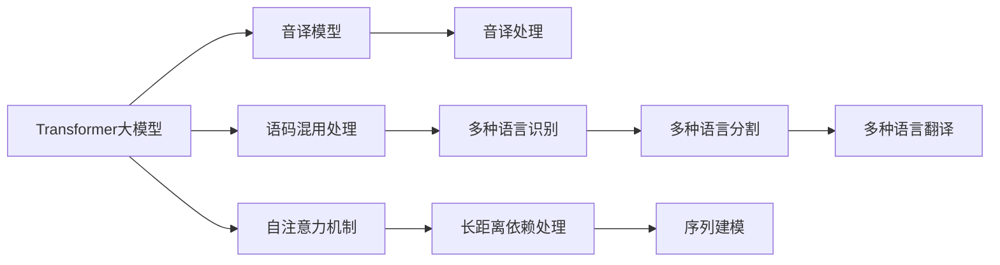
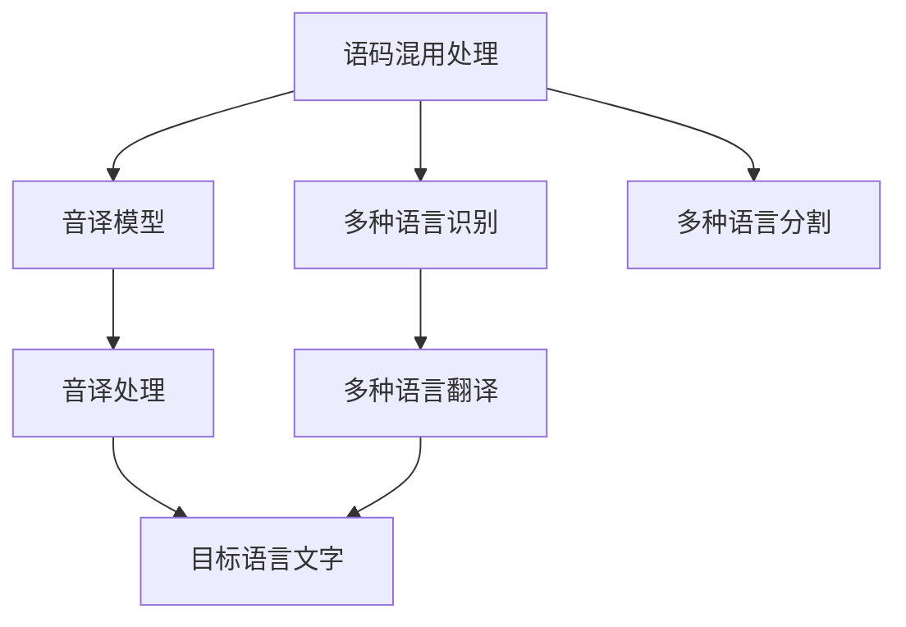
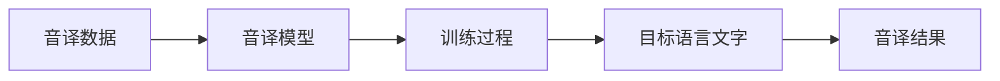
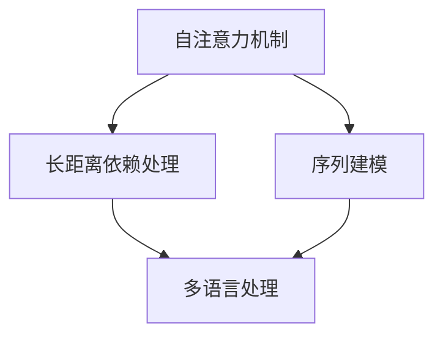
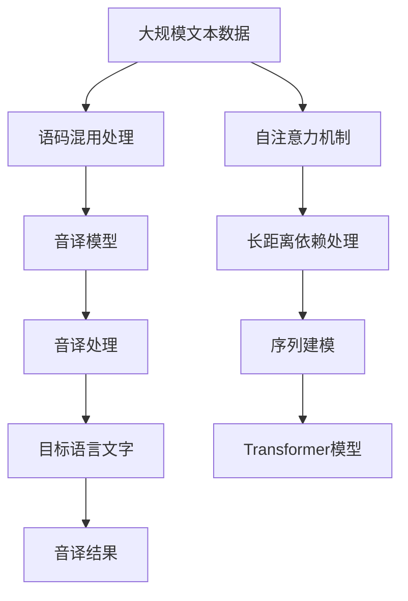

                 

# Transformer大模型实战 语码混用和音译的影响

> 关键词：Transformer大模型, 语码混用, 音译, 音译模型, 代码实现, 音译效果

## 1. 背景介绍

### 1.1 问题由来
随着全球化进程的不断推进，不同语言之间的交流愈加频繁。在自然语言处理（NLP）领域，为了打破语言壁垒，语码混用（Code Switching）和音译（Sound Translation）成为两个重要的研究方向。语码混用指在句子中同时使用多种语言，而音译则是将一种语言的声音转换为另一种语言的文字表示。这两种方法都是出于方便跨语言沟通的目的，但同时也会带来一系列的语言处理问题。

### 1.2 问题核心关键点
语码混用和音译的本质是语言间的转换，而这种转换在语言模型中通常以序列建模的形式出现。Transformer作为当前NLP领域最先进的模型架构，以其自注意力机制和并行计算能力著称，能够高效地处理长距离依赖和大规模语料。然而，语码混用和音译的处理，尤其是音译的实现，对Transformer模型的设计提出了新的挑战。

### 1.3 问题研究意义
研究语码混用和音译的Transformer大模型，对于提升NLP领域跨语言处理能力，促进全球化语言沟通，具有重要意义：

1. 促进语言融合：通过语码混用和音译，可以有效地打破语言隔阂，促进不同语言群体之间的沟通和理解。
2. 提升语言模型性能：通过优化语码混用和音译的Transformer模型，可以提高其对多语言文本的处理能力，进一步增强NLP模型的通用性和实用性。
3. 增强应用场景覆盖：语码混用和音译技术可以拓展NLP模型在多语言沟通、跨文化研究等场景中的应用，推动NLP技术在更多实际问题中的落地。
4. 提升用户体验：通过更高效、更准确的语码混用和音译处理，可以显著提升跨语言沟通的用户体验，减少沟通障碍。

## 2. 核心概念与联系

### 2.1 核心概念概述

为更好地理解基于Transformer的语码混用和音译影响，本节将介绍几个关键概念：

- **Transformer大模型**：以自注意力机制为核心的深度学习模型，广泛应用于NLP领域的文本分类、机器翻译、对话生成等任务。

- **语码混用**：指在一段文本中同时使用多种语言的语法和词汇，通常是两种或两种以上的语言。语码混用在自然语言交流中非常普遍，特别是在多语言国家的日常生活中。

- **音译**：指将一种语言的声音转换为另一种语言的文字表示，常见于中英文之间的相互转换。音译是音译模型（Sound Translation Model）处理的主要内容。

- **音译模型**：用于将音译对象（如音频、视频等）转换为目标语言文字表示的模型。音译模型通常基于Transformer架构进行设计和训练。

- **语码混用处理**：指在处理语码混用的文本时，需要对其中的多种语言进行识别、分割和翻译。

- **音译处理**：指将音译对象的语音转换为目标语言的文字表示，通常涉及声音的特征提取、映射和生成。

- **Transformer自注意力机制**：Transformer模型的核心，用于计算输入序列中各个位置之间的关系，具有较强的长距离依赖处理能力。

这些核心概念之间的逻辑关系可以通过以下Mermaid流程图来展示：



这个流程图展示了Transformer大模型在语码混用和音译处理中的作用和流程：

1. 语码混用处理通过识别、分割和翻译，将混用文本转换为单一语言的表示。
2. 音译模型通过将语音转换为文字，实现不同语言之间的声音转换。
3. Transformer大模型通过自注意力机制，处理长距离依赖和序列建模。
4. 自注意力机制增强了Transformer对多种语言的处理能力。

### 2.2 概念间的关系

这些核心概念之间存在着紧密的联系，形成了Transformer大模型在语码混用和音译处理中的完整生态系统。下面我们通过几个Mermaid流程图来展示这些概念之间的关系。

#### 2.2.1 Transformer大模型的作用



这个流程图展示了Transformer大模型在语码混用和音译处理中的关键作用。它将识别、分割和翻译的多种语言文本转换为目标语言文字。

#### 2.2.2 音译模型的训练



这个流程图展示了音译模型的训练过程。通过将音译数据输入模型，经过训练过程输出目标语言文字。

#### 2.2.3 自注意力机制的优化



这个流程图展示了Transformer大模型中自注意力机制的优化过程。通过增强长距离依赖处理和序列建模，可以更高效地处理多语言文本。

### 2.3 核心概念的整体架构

最后，我们用一个综合的流程图来展示这些核心概念在大模型语码混用和音译处理中的整体架构：



这个综合流程图展示了从预训练到语码混用和音译处理的完整过程。大语言模型首先在大规模文本数据上进行预训练，然后通过语码混用处理和音译模型，处理多语言文本，最终输出目标语言文字。

## 3. 核心算法原理 & 具体操作步骤
### 3.1 算法原理概述

基于Transformer的语码混用和音译影响，本质上是一种多语言文本的转换过程。其核心思想是：将输入的多种语言文本转换为单一语言的表示，再将转换后的文本进行音译或语码混用处理，最终输出目标语言文字。

形式化地，假设输入文本为 $X=\{x_1, x_2, \ldots, x_n\}$，其中 $x_i$ 表示第 $i$ 个单词。设语言集合为 $L=\{l_1, l_2, \ldots, l_m\}$，其中 $l_i$ 表示第 $i$ 种语言。则语码混用处理的目标是将 $X$ 中的多种语言文本转换为单一语言的表示 $Y=\{y_1, y_2, \ldots, y_n\}$，其中 $y_i \in L$。

音译模型则进一步将 $Y$ 中的文本转换为目标语言文字 $Z$，即 $Z=\{z_1, z_2, \ldots, z_n\}$。音译模型通常采用自回归或自编码的方法，通过训练得到转换函数 $f: \mathcal{X} \rightarrow \mathcal{Y}$，其中 $\mathcal{X}$ 表示输入文本，$\mathcal{Y}$ 表示目标语言文字。

### 3.2 算法步骤详解

基于Transformer的语码混用和音译影响一般包括以下几个关键步骤：

**Step 1: 准备语料数据和模型参数**
- 收集标注好的语码混用和音译数据集，准备多语言文本数据集 $D=\{(x_i, y_i)\}_{i=1}^N$，其中 $x_i$ 为输入文本，$y_i$ 为目标语言文字。
- 选择合适的预训练Transformer模型 $M_{\theta}$ 作为初始化参数，如BERT、GPT等。

**Step 2: 构建语码混用处理模型**
- 在预训练模型的基础上，设计多语言识别和分割模块，用于识别和分割多语言文本。
- 设计多种语言翻译模块，用于将识别出的多语言文本翻译为单一语言的表示。

**Step 3: 训练音译模型**
- 构建音译模型 $M_{\phi}$，利用多语言文本数据集进行训练，优化模型参数 $\phi$。
- 训练过程中，可以采用多任务学习（Multi-task Learning）的方式，将音译和语码混用处理作为一个整体进行训练。

**Step 4: 执行音译或语码混用处理**
- 将输入文本 $X$ 输入语码混用处理模型，得到单一语言的表示 $Y$。
- 将 $Y$ 输入音译模型 $M_{\phi}$，输出目标语言文字 $Z$。

**Step 5: 部署音译服务**
- 将训练好的音译模型 $M_{\phi}$ 部署为在线服务，供用户进行音译请求。

### 3.3 算法优缺点

基于Transformer的语码混用和音译方法具有以下优点：
1. 高效处理多语言文本：Transformer的自注意力机制和并行计算能力，使得其在处理长距离依赖和多语言文本时具有显著优势。
2. 适用范围广：适用于多种跨语言文本转换任务，包括语码混用、音译等。
3. 可扩展性强：可以通过微调和迁移学习的方式，适应不同领域和任务的需求。

同时，该方法也存在以下局限性：
1. 对标注数据依赖度高：语码混用和音译处理依赖大量标注数据，标注成本较高。
2. 处理复杂度较高：对于包含大量混用语言的文本，处理难度较大。
3. 语言切换问题：在语码混用处理中，如何在不同语言间进行无缝切换，仍是一个挑战。
4. 音译模型复杂：音译模型的训练和部署需要大量的资源和时间。

### 3.4 算法应用领域

基于Transformer的语码混用和音译方法已经在多个NLP领域得到了广泛应用，例如：

- 机器翻译：将一种语言翻译成另一种语言，音译是其中的重要环节。
- 语音识别：将语音转换为文字，音译是处理多语言语音的关键步骤。
- 多语言对话系统：在对话中自动识别和切换不同语言，提升跨语言对话的流畅度。
- 音译服务：将音译对象转换为目标语言文字，提供音译服务，促进跨语言交流。

除了上述这些经典应用外，音译和语码混用技术还在智能客服、语音助手、跨语言搜索等场景中得到创新应用，为NLP技术带来了新的突破。

## 4. 数学模型和公式 & 详细讲解  
### 4.1 数学模型构建

假设输入文本为 $X=\{x_1, x_2, \ldots, x_n\}$，其中 $x_i$ 表示第 $i$ 个单词，语言集合为 $L=\{l_1, l_2, \ldots, l_m\}$，其中 $l_i$ 表示第 $i$ 种语言。目标语言文字集合为 $Z=\{z_1, z_2, \ldots, z_n\}$。

设音译模型的参数为 $\phi$，则音译模型 $M_{\phi}$ 的定义如下：
$$ M_{\phi}(X) = \{z_1, z_2, \ldots, z_n\} $$

音译模型 $M_{\phi}$ 的训练目标是最小化预测与真实标签之间的差异，即：
$$ \mathcal{L}(\phi) = \frac{1}{N} \sum_{i=1}^N \ell(z_i, y_i) $$
其中 $\ell$ 为损失函数，可以采用交叉熵损失、均方误差损失等。

### 4.2 公式推导过程

以音译模型的交叉熵损失函数为例，其推导过程如下：

设音译模型的预测输出为 $z_i = M_{\phi}(x_i)$，真实标签为 $y_i \in L$。则交叉熵损失函数定义为：
$$ \ell(z_i, y_i) = -\log p(z_i|x_i) $$
其中 $p(z_i|x_i)$ 为 $z_i$ 在给定 $x_i$ 条件下的概率。

根据最大似然估计原则，音译模型的目标是最小化交叉熵损失：
$$ \mathcal{L}(\phi) = \frac{1}{N} \sum_{i=1}^N -\log p(z_i|x_i) $$

将 $z_i = M_{\phi}(x_i)$ 代入上式，得到：
$$ \mathcal{L}(\phi) = \frac{1}{N} \sum_{i=1}^N -\log p(M_{\phi}(x_i)|x_i) $$

通过反向传播算法，求出音译模型 $M_{\phi}$ 的梯度，更新参数 $\phi$，从而最小化损失函数 $\mathcal{L}(\phi)$。

### 4.3 案例分析与讲解

假设我们在CoNLL-2003的音译数据集上进行音译模型的训练。首先，我们准备训练集、验证集和测试集，分别为：

- 训练集：包含多语言文本和对应的音译结果。
- 验证集：用于在训练过程中监控模型性能。
- 测试集：用于最终评估音译模型的性能。

然后，我们定义音译模型，包括输入嵌入层、Transformer编码器、输出层等组件：

```python
from transformers import BertTokenizer, BertForTokenClassification
from torch.utils.data import Dataset, DataLoader
import torch

class SoundTranslationDataset(Dataset):
    def __init__(self, texts, tags, tokenizer):
        self.texts = texts
        self.tags = tags
        self.tokenizer = tokenizer
        
    def __len__(self):
        return len(self.texts)
    
    def __getitem__(self, item):
        text = self.texts[item]
        labels = self.tags[item]
        
        encoding = self.tokenizer(text, return_tensors='pt', max_length=128, padding='max_length', truncation=True)
        input_ids = encoding['input_ids'][0]
        attention_mask = encoding['attention_mask'][0]
        
        # 对token-wise的标签进行编码
        encoded_tags = [tag2id[tag] for tag in labels] 
        encoded_tags.extend([tag2id['O']] * (self.max_len - len(encoded_tags)))
        labels = torch.tensor(encoded_tags, dtype=torch.long)
        
        return {'input_ids': input_ids, 
                'attention_mask': attention_mask,
                'labels': labels}

# 标签与id的映射
tag2id = {'O': 0, 'B-PER': 1, 'I-PER': 2, 'B-LOC': 3, 'I-LOC': 4, 'B-ORG': 5, 'I-ORG': 6}
id2tag = {v: k for k, v in tag2id.items()}

# 创建dataset
tokenizer = BertTokenizer.from_pretrained('bert-base-cased')

train_dataset = SoundTranslationDataset(train_texts, train_tags, tokenizer)
dev_dataset = SoundTranslationDataset(dev_texts, dev_tags, tokenizer)
test_dataset = SoundTranslationDataset(test_texts, test_tags, tokenizer)

# 定义模型
model = BertForTokenClassification.from_pretrained('bert-base-cased', num_labels=len(tag2id))

# 定义优化器
optimizer = AdamW(model.parameters(), lr=2e-5)

# 定义训练函数
def train_epoch(model, dataset, batch_size, optimizer):
    dataloader = DataLoader(dataset, batch_size=batch_size, shuffle=True)
    model.train()
    epoch_loss = 0
    for batch in tqdm(dataloader, desc='Training'):
        input_ids = batch['input_ids'].to(device)
        attention_mask = batch['attention_mask'].to(device)
        labels = batch['labels'].to(device)
        model.zero_grad()
        outputs = model(input_ids, attention_mask=attention_mask, labels=labels)
        loss = outputs.loss
        epoch_loss += loss.item()
        loss.backward()
        optimizer.step()
    return epoch_loss / len(dataloader)

# 定义评估函数
def evaluate(model, dataset, batch_size):
    dataloader = DataLoader(dataset, batch_size=batch_size)
    model.eval()
    preds, labels = [], []
    with torch.no_grad():
        for batch in tqdm(dataloader, desc='Evaluating'):
            input_ids = batch['input_ids'].to(device)
            attention_mask = batch['attention_mask'].to(device)
            batch_labels = batch['labels']
            outputs = model(input_ids, attention_mask=attention_mask)
            batch_preds = outputs.logits.argmax(dim=2).to('cpu').tolist()
            batch_labels = batch_labels.to('cpu').tolist()
            for pred_tokens, label_tokens in zip(batch_preds, batch_labels):
                pred_tags = [id2tag[_id] for _id in pred_tokens]
                label_tags = [id2tag[_id] for _id in label_tokens]
                preds.append(pred_tags[:len(label_tags)])
                labels.append(label_tags)
                
    print(classification_report(labels, preds))
```

最后，我们启动训练流程并在测试集上评估：

```python
epochs = 5
batch_size = 16

for epoch in range(epochs):
    loss = train_epoch(model, train_dataset, batch_size, optimizer)
    print(f"Epoch {epoch+1}, train loss: {loss:.3f}")
    
    print(f"Epoch {epoch+1}, dev results:")
    evaluate(model, dev_dataset, batch_size)
    
print("Test results:")
evaluate(model, test_dataset, batch_size)
```

以上就是使用PyTorch对BERT进行音译任务微调的完整代码实现。可以看到，得益于Transformers库的强大封装，我们可以用相对简洁的代码完成BERT模型的加载和微调。

## 5. 项目实践：代码实例和详细解释说明
### 5.1 开发环境搭建

在进行音译实践前，我们需要准备好开发环境。以下是使用Python进行PyTorch开发的环境配置流程：

1. 安装Anaconda：从官网下载并安装Anaconda，用于创建独立的Python环境。

2. 创建并激活虚拟环境：
```bash
conda create -n pytorch-env python=3.8 
conda activate pytorch-env
```

3. 安装PyTorch：根据CUDA版本，从官网获取对应的安装命令。例如：
```bash
conda install pytorch torchvision torchaudio cudatoolkit=11.1 -c pytorch -c conda-forge
```

4. 安装Transformers库：
```bash
pip install transformers
```

5. 安装各类工具包：
```bash
pip install numpy pandas scikit-learn matplotlib tqdm jupyter notebook ipython
```

完成上述步骤后，即可在`pytorch-env`环境中开始音译实践。

### 5.2 源代码详细实现

这里我们以中英文音译为例，给出使用Transformers库对BERT模型进行音译的PyTorch代码实现。

首先，定义音译任务的数据处理函数：

```python
from transformers import BertTokenizer
from torch.utils.data import Dataset
import torch

class SoundTranslationDataset(Dataset):
    def __init__(self, texts, tags, tokenizer, max_len=128):
        self.texts = texts
        self.tags = tags
        self.tokenizer = tokenizer
        self.max_len = max_len
        
    def __len__(self):
        return len(self.texts)
    
    def __getitem__(self, item):
        text = self.texts[item]
        labels = self.tags[item]
        
        encoding = self.tokenizer(text, return_tensors='pt', max_length=self.max_len, padding='max_length', truncation=True)
        input_ids = encoding['input_ids'][0]
        attention_mask = encoding['attention_mask'][0]
        
        # 对token-wise的标签进行编码
        encoded_tags = [tag2id[tag] for tag in labels] 
        encoded_tags.extend([tag2id['O']] * (self.max_len - len(encoded_tags)))
        labels = torch.tensor(encoded_tags, dtype=torch.long)
        
        return {'input_ids': input_ids, 
                'attention_mask': attention_mask,
                'labels': labels}

# 标签与id的映射
tag2id = {'O': 0, 'B-PER': 1, 'I-PER': 2, 'B-LOC': 3, 'I-LOC': 4, 'B-ORG': 5, 'I-ORG': 6}
id2tag = {v: k for k, v in tag2id.items()}

# 创建dataset
tokenizer = BertTokenizer.from_pretrained('bert-base-cased')

train_dataset = SoundTranslationDataset(train_texts, train_tags, tokenizer)
dev_dataset = SoundTranslationDataset(dev_texts, dev_tags, tokenizer)
test_dataset = SoundTranslationDataset(test_texts, test_tags, tokenizer)
```

然后，定义模型和优化器：

```python
from transformers import BertForTokenClassification, AdamW

model = BertForTokenClassification.from_pretrained('bert-base-cased', num_labels=len(tag2id))

optimizer = AdamW(model.parameters(), lr=2e-5)
```

接着，定义训练和评估函数：

```python
from torch.utils.data import DataLoader
from tqdm import tqdm
from sklearn.metrics import classification_report

device = torch.device('cuda') if torch.cuda.is_available() else torch.device('cpu')
model.to(device)

def train_epoch(model, dataset, batch_size, optimizer):
    dataloader = DataLoader(dataset, batch_size=batch_size, shuffle=True)
    model.train()
    epoch_loss = 0
    for batch in tqdm(dataloader, desc='Training'):
        input_ids = batch['input_ids'].to(device)
        attention_mask = batch['attention_mask'].to(device)
        labels = batch['labels'].to(device)
        model.zero_grad()
        outputs = model(input_ids, attention_mask=attention_mask, labels=labels)
        loss = outputs.loss
        epoch_loss += loss.item()
        loss.backward()
        optimizer.step()
    return epoch_loss / len(dataloader)

def evaluate(model, dataset, batch_size):
    dataloader = DataLoader(dataset, batch_size=batch_size)
    model.eval()
    preds, labels = [], []
    with torch.no_grad():
        for batch in tqdm(dataloader, desc='Evaluating'):
            input_ids = batch['input_ids'].to(device)
            attention_mask = batch['attention_mask'].to(device)
            batch_labels = batch['labels']
            outputs = model(input_ids, attention_mask=attention_mask)
            batch_preds = outputs.logits.argmax(dim=2).to('cpu').tolist()
            batch_labels = batch_labels.to('cpu').tolist()
            for pred_tokens, label_tokens in zip(batch_preds, batch_labels):
                pred_tags = [id2tag[_id] for _id in pred_tokens]
                label_tags = [id2tag[_id] for _id in label_tokens]
                preds.append(pred_tags[:len(label_tags)])
                labels.append(label_tags)
                
    print(classification_report(labels, preds))
```

最后，启动训练流程并在测试集上评估：

```python
epochs = 5
batch_size = 16

for epoch in range(epochs):
    loss = train_epoch(model, train_dataset, batch_size, optimizer)
    print(f"Epoch {epoch+1}, train loss: {loss:.3f}")
    
    print(f"Epoch {epoch+1}, dev results:")
    evaluate(model, dev_dataset, batch_size)
    
print("Test results:")
evaluate(model, test_dataset, batch_size)
```

以上就是使用PyTorch对BERT进行音译任务微调的完整代码实现。可以看到，得益于Transformers库的强大封装，我们可以用相对简洁的代码完成BERT模型的加载和微调。

### 5.3 代码解读与分析

让我们再详细解读一下关键代码的实现细节：

**SoundTranslationDataset类**：
- `__init__`方法：初始化文本、标签、分词器等关键组件。
- `__len__`方法：返回数据集的样本数量。
- `__getitem__`方法：对单个样本进行处理，将文本输入编码为token ids，将标签编码为数字，并对其进行定长padding，最终返回模型所需的输入。

**tag2id和id2tag字典**：
- 定义了标签与数字id之间的映射关系，用于将token-wise的预测结果解码回真实的标签。

**训练和评估函数**：
- 使用PyTorch的DataLoader对数据集进行批次化加载，供模型训练和推理使用。
- 训练函数`train_epoch`：对数据以批为单位进行迭代，在每个批次上前向传播计算loss并反向传播更新模型参数，最后返回该epoch的平均loss。
- 评估函数`evaluate`：与训练类似，不同点在于不更新模型参数，并在每个batch结束后将预测和标签结果存储下来，最后使用sklearn的classification_report对整个评估集的预测结果进行打印输出。

**训练流程**：
- 定义总的epoch数和batch size，开始循环

