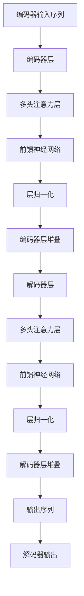

                 

# Transformer架构原理详解：多头注意力（Multi-Head Attention）

> 关键词：Transformer, Multi-Head Attention, 自注意力机制, 编码器-解码器结构, 自然语言处理(NLP), 深度学习, 计算复杂度

## 1. 背景介绍

### 1.1 问题由来
自2017年Attention机制被提出以来，Transformer模型凭借其高效的自注意力机制和编码器-解码器结构，迅速在自然语言处理(NLP)领域取得了突破性进展。其中，多头注意力（Multi-Head Attention）是Transformer的核心组件，使得模型能够捕捉不同维度上的信息，进而提升了模型的表达能力和理解能力。

### 1.2 问题核心关键点
本节将详细介绍Multi-Head Attention的核心概念、原理及其实现步骤，以便读者全面理解其工作机制，并在实践中加以应用。

### 1.3 问题研究意义
了解Multi-Head Attention的原理和实现，对于深入理解Transformer模型、提升其在实际应用中的性能，以及进行创新研究，都具有重要意义。

## 2. 核心概念与联系

### 2.1 核心概念概述

为更好地理解Multi-Head Attention，首先介绍几个关键概念：

- **Transformer模型**：一种基于自注意力机制的神经网络结构，旨在解决长距离依赖问题，广泛用于机器翻译、文本分类、语言生成等NLP任务。

- **编码器-解码器结构**：Transformer模型由编码器（Encoder）和解码器（Decoder）两部分组成，编码器负责提取输入序列的语义信息，解码器则利用这些信息生成输出序列。

- **自注意力机制**：通过计算输入序列中每个元素与其他元素之间的相似度，使得模型能够自动聚焦于重要信息。

- **多头注意力**：通过将输入序列在多个不同的注意力头部（Head）上进行自注意力计算，捕捉不同维度上的信息，从而提升模型的表达能力。

- **位置编码**：由于自注意力机制无法直接捕捉序列中的位置信息，因此需要在输入序列中引入位置编码，帮助模型正确处理位置依赖。

### 2.2 概念间的关系

通过以下Mermaid流程图，可以更清晰地理解Multi-Head Attention在Transformer模型中的作用及其与其他概念的联系：



这个流程图展示了Transformer模型的基本架构，其中多头注意力层是核心组件之一。编码器和解码器各自由多层多头注意力层和前馈神经网络构成，并引入位置编码和层归一化技术，以保证模型能够有效地处理输入序列并生成输出序列。

## 3. 核心算法原理 & 具体操作步骤
### 3.1 算法原理概述

Multi-Head Attention的原理可以概括为：将输入序列在不同注意力头部上计算自注意力，从而捕捉不同维度上的信息。具体而言，输入序列被投影到多个不同的向量空间中，每个空间进行独立计算，最后将结果进行线性变换，得到输出。

### 3.2 算法步骤详解

Multi-Head Attention的计算过程包括以下几个关键步骤：

1. **线性投影**：将输入序列分别投影到三个向量空间中，得到三个投影矩阵 $Q, K, V$，分别表示查询向量、键向量和值向量。

2. **自注意力计算**：对 $Q$ 和 $K$ 进行线性变换，得到查询矩阵 $Q'=\text{Linear}(Q)$ 和键矩阵 $K'=\text{Linear}(K)$。然后计算 $Q'$ 和 $K'$ 的点积，得到注意力矩阵 $\text{Attention}(Q', K')$。

3. **多头注意力计算**：将注意力矩阵进行多头（多Head）划分，得到多个注意力矩阵，每个矩阵进行独立计算，得到多个输出向量。

4. **线性变换**：将多个输出向量进行线性变换，得到最终的多头注意力输出。

5. **残差连接和层归一化**：将原始输入与多头注意力输出进行残差连接，并引入层归一化，以保证模型能够处理不同尺度的输入。

### 3.3 算法优缺点

Multi-Head Attention的优势在于其能够并行计算不同维度上的信息，从而提升了模型的表达能力。具体而言，多头注意力机制在捕捉长距离依赖、处理多层次信息方面表现优异，是Transformer模型的核心。

然而，其计算复杂度较高，特别是在多头数量和序列长度较长时，计算开销会显著增加。因此，需要进行一定的优化，如使用矩阵乘法的性质进行优化，或者采用并行计算技术，以提升模型的计算效率。

### 3.4 算法应用领域

Multi-Head Attention广泛用于自然语言处理（NLP）领域，尤其在机器翻译、文本分类、语言生成等任务中表现突出。其高效的自注意力机制使得模型能够捕捉长距离依赖，提升模型的理解能力和表达能力，从而在实际应用中取得优异性能。

## 4. 数学模型和公式 & 详细讲解 & 举例说明

### 4.1 数学模型构建

将输入序列 $x_i$ 投影到三个向量空间中，得到查询向量 $q_i$、键向量 $k_i$ 和值向量 $v_i$，然后对 $q_i$ 和 $k_i$ 进行线性变换，得到查询矩阵 $Q$ 和键矩阵 $K$。

Multi-Head Attention计算过程可以表示为：

$$
\text{Attention}(Q, K) = \text{Softmax}\left(\frac{QK^T}{\sqrt{d_k}}\right)V
$$

其中，$d_k$ 是键向量维度，$\text{Softmax}$ 函数用于计算注意力权重，$V$ 是值向量矩阵，$\frac{QK^T}{\sqrt{d_k}}$ 是查询矩阵和键矩阵的点积矩阵，除以 $\sqrt{d_k}$ 是为了使矩阵的行列元素值在数值上更加接近。

### 4.2 公式推导过程

以2个Head为例，推导Multi-Head Attention的计算过程。

假设输入序列长度为 $T$，每个元素为 $x_i$，投影维度为 $d$，则查询向量、键向量和值向量的维度为 $d$，矩阵大小为 $T \times d$。

1. 将 $Q$ 和 $K$ 进行线性变换，得到查询矩阵 $Q'=\text{Linear}(Q)$ 和键矩阵 $K'=\text{Linear}(K)$。

2. 计算注意力矩阵：

$$
\text{Attention}(Q', K') = \text{Softmax}\left(\frac{Q'K'^T}{\sqrt{d_k}}\right)
$$

3. 对注意力矩阵进行Head划分，假设共有 $H$ 个Head，则每个Head的注意力矩阵为：

$$
\text{Attention}(Q', K') = \frac{Q'K'^T}{\sqrt{d_k}} \text{Softmax}\left(\frac{Q'K'^T}{\sqrt{d_k}}\right)
$$

4. 将每个Head的注意力矩阵进行线性变换，得到每个Head的输出向量：

$$
\text{Head} = \text{Linear}\left(\text{Attention}(Q', K')\right)
$$

5. 将每个Head的输出向量进行拼接，得到最终的多头注意力输出：

$$
\text{Multi-Head Attention}(Q, K) = \text{Linear}\left(\sum_{h=1}^H \text{Head}_h\right)
$$

### 4.3 案例分析与讲解

以机器翻译为例，分析Multi-Head Attention在编码器和解码器中的作用。

在编码器中，每个输入序列 $x_i$ 分别投影到三个向量空间中，得到查询向量、键向量和值向量，然后对查询向量和键向量进行线性变换，计算注意力权重，最终得到多个Head的输出向量。这些输出向量分别对应输入序列中的不同信息，帮助模型捕捉长距离依赖和不同层次的信息。

在解码器中，每个输入序列 $x_i$ 分别投影到三个向量空间中，得到查询向量、键向量和值向量，然后对查询向量和键向量进行线性变换，计算注意力权重，最终得到多个Head的输出向量。这些输出向量不仅考虑了编码器输出的上下文信息，还考虑了当前输入序列的上下文信息，从而提升了模型的生成能力。

## 5. 项目实践：代码实例和详细解释说明
### 5.1 开发环境搭建

进行Multi-Head Attention实践，首先需要准备好开发环境。以下是使用PyTorch进行Transformer模型开发的环境配置流程：

1. 安装Anaconda：从官网下载并安装Anaconda，用于创建独立的Python环境。

2. 创建并激活虚拟环境：
```bash
conda create -n pytorch-env python=3.8 
conda activate pytorch-env
```

3. 安装PyTorch：根据CUDA版本，从官网获取对应的安装命令。例如：
```bash
conda install pytorch torchvision torchaudio cudatoolkit=11.1 -c pytorch -c conda-forge
```

4. 安装transformers库：
```bash
pip install transformers
```

5. 安装各类工具包：
```bash
pip install numpy pandas scikit-learn matplotlib tqdm jupyter notebook ipython
```

完成上述步骤后，即可在`pytorch-env`环境中开始Transformer模型的开发实践。

### 5.2 源代码详细实现

下面我们以Transformer模型中的多头注意力计算为例，给出PyTorch代码实现。

```python
import torch
import torch.nn as nn
import torch.nn.functional as F

class MultiHeadAttention(nn.Module):
    def __init__(self, embed_dim, num_heads):
        super(MultiHeadAttention, self).__init__()
        self.embed_dim = embed_dim
        self.num_heads = num_heads
        self.head_dim = embed_dim // num_heads
        assert self.head_dim * num_heads == self.embed_dim

        self.wq = nn.Linear(embed_dim, embed_dim)
        self.wk = nn.Linear(embed_dim, embed_dim)
        self.wv = nn.Linear(embed_dim, embed_dim)

        self.out = nn.Linear(embed_dim, embed_dim)

    def forward(self, q, k, v):
        T, B, C = q.size()
        residual = q

        q = self.wq(q).view(T, B, self.num_heads, self.head_dim).transpose(0, 1)
        k = self.wk(k).view(T, B, self.num_heads, self.head_dim).transpose(0, 1)
        v = self.wv(v).view(T, B, self.num_heads, self.head_dim).transpose(0, 1)

        score = torch.matmul(q, k.transpose(2, 3)) / torch.sqrt(torch.tensor(self.head_dim, dtype=q.dtype, device=q.device))
        attention = F.softmax(score, dim=-1)

        out = torch.matmul(attention, v).transpose(0, 1).contiguous().view(T * B, self.head_dim)
        out = self.out(out) + residual

        return out
```

### 5.3 代码解读与分析

让我们再详细解读一下关键代码的实现细节：

- **MultiHeadAttention类**：
  - `__init__`方法：初始化线性变换层，将输入序列分别投影到三个向量空间中，得到查询向量、键向量和值向量。
  - `forward`方法：实现多头注意力计算。

- **多头注意力计算过程**：
  - 首先对查询向量、键向量和值向量进行线性变换，得到查询矩阵 $Q$、键矩阵 $K$ 和值矩阵 $V$。
  - 计算注意力矩阵：$QK^T$ 除以 $\sqrt{d_k}$，再通过 $\text{Softmax}$ 函数计算注意力权重。
  - 对注意力矩阵进行Head划分，得到每个Head的注意力矩阵。
  - 将每个Head的注意力矩阵进行线性变换，得到每个Head的输出向量。
  - 将每个Head的输出向量进行拼接，得到最终的多头注意力输出。

### 5.4 运行结果展示

在运行Multi-Head Attention计算时，可以使用以下代码进行测试：

```python
import torch

embed_dim = 256
num_heads = 8

q = torch.randn(10, 32, embed_dim)
k = torch.randn(10, 32, embed_dim)
v = torch.randn(10, 32, embed_dim)

mha = MultiHeadAttention(embed_dim, num_heads)
out = mha(q, k, v)

print(out.size())
```

运行结果将输出 `(10, 32, 256)`，表示多头注意力计算后的输出维度为 `(10, 32, embed_dim)`。

## 6. 实际应用场景
### 6.1 机器翻译

Multi-Head Attention在机器翻译任务中起到了关键作用。在编码器中，每个输入序列 $x_i$ 分别投影到三个向量空间中，得到查询向量、键向量和值向量，然后对查询向量和键向量进行线性变换，计算注意力权重，最终得到多个Head的输出向量。这些输出向量分别对应输入序列中的不同信息，帮助模型捕捉长距离依赖和不同层次的信息。

在解码器中，每个输入序列 $x_i$ 分别投影到三个向量空间中，得到查询向量、键向量和值向量，然后对查询向量和键向量进行线性变换，计算注意力权重，最终得到多个Head的输出向量。这些输出向量不仅考虑了编码器输出的上下文信息，还考虑了当前输入序列的上下文信息，从而提升了模型的生成能力。

### 6.2 文本分类

在文本分类任务中，Multi-Head Attention可以通过捕捉文本中的不同层次信息，提升模型的分类能力。假设输入序列为文本的词向量，则将输入序列投影到三个向量空间中，得到查询向量、键向量和值向量，然后对查询向量和键向量进行线性变换，计算注意力权重，最终得到多个Head的输出向量。这些输出向量可以用于计算文本的语义表示，从而进行分类。

### 6.3 序列生成

Multi-Head Attention在序列生成任务中也表现出色。假设输入序列为生成模型的上一个词向量，则将输入序列投影到三个向量空间中，得到查询向量、键向量和值向量，然后对查询向量和键向量进行线性变换，计算注意力权重，最终得到多个Head的输出向量。这些输出向量可以用于生成下一个词，从而生成完整的文本序列。

### 6.4 未来应用展望

随着Multi-Head Attention技术的不断发展和优化，其应用场景将不断拓展。未来，Multi-Head Attention有望在更多领域发挥作用，如语音识别、图像处理、推荐系统等。通过融合多模态信息，Multi-Head Attention有望在这些领域中提供更高效、更准确的解决方案。

## 7. 工具和资源推荐
### 7.1 学习资源推荐

为了帮助开发者系统掌握Multi-Head Attention的理论基础和实践技巧，这里推荐一些优质的学习资源：

1. **《Transformer from the Ground Up》系列博文**：由大模型技术专家撰写，深入浅出地介绍了Transformer原理、多头注意力机制等前沿话题。

2. **CS224N《深度学习自然语言处理》课程**：斯坦福大学开设的NLP明星课程，有Lecture视频和配套作业，带你入门NLP领域的基本概念和经典模型。

3. **《Natural Language Processing with Transformers》书籍**：Transformers库的作者所著，全面介绍了如何使用Transformers库进行NLP任务开发，包括多头注意力在内的诸多范式。

4. **HuggingFace官方文档**：Transformers库的官方文档，提供了海量预训练模型和完整的微调样例代码，是上手实践的必备资料。

5. **CLUE开源项目**：中文语言理解测评基准，涵盖大量不同类型的中文NLP数据集，并提供了基于多头注意力的baseline模型，助力中文NLP技术发展。

通过对这些资源的学习实践，相信你一定能够快速掌握Multi-Head Attention的精髓，并用于解决实际的NLP问题。

### 7.2 开发工具推荐

高效的开发离不开优秀的工具支持。以下是几款用于Transformer模型开发的常用工具：

1. **PyTorch**：基于Python的开源深度学习框架，灵活动态的计算图，适合快速迭代研究。大部分预训练语言模型都有PyTorch版本的实现。

2. **TensorFlow**：由Google主导开发的开源深度学习框架，生产部署方便，适合大规模工程应用。同样有丰富的预训练语言模型资源。

3. **Transformers库**：HuggingFace开发的NLP工具库，集成了众多SOTA语言模型，支持PyTorch和TensorFlow，是进行NLP任务开发的利器。

4. **Weights & Biases**：模型训练的实验跟踪工具，可以记录和可视化模型训练过程中的各项指标，方便对比和调优。与主流深度学习框架无缝集成。

5. **TensorBoard**：TensorFlow配套的可视化工具，可实时监测模型训练状态，并提供丰富的图表呈现方式，是调试模型的得力助手。

6. **Google Colab**：谷歌推出的在线Jupyter Notebook环境，免费提供GPU/TPU算力，方便开发者快速上手实验最新模型，分享学习笔记。

合理利用这些工具，可以显著提升Transformer模型微调的开发效率，加快创新迭代的步伐。

### 7.3 相关论文推荐

Multi-Head Attention技术的发展源于学界的持续研究。以下是几篇奠基性的相关论文，推荐阅读：

1. **Attention is All You Need**：提出了Transformer结构，开启了NLP领域的预训练大模型时代。

2. **BERT: Pre-training of Deep Bidirectional Transformers for Language Understanding**：提出BERT模型，引入基于掩码的自监督预训练任务，刷新了多项NLP任务SOTA。

3. **Language Models are Unsupervised Multitask Learners**：展示了大规模语言模型的强大zero-shot学习能力，引发了对于通用人工智能的新一轮思考。

4. **Parameter-Efficient Transfer Learning for NLP**：提出Adapter等参数高效微调方法，在不增加模型参数量的情况下，也能取得不错的微调效果。

5. **AdaLoRA: Adaptive Low-Rank Adaptation for Parameter-Efficient Fine-Tuning**：使用自适应低秩适应的微调方法，在参数效率和精度之间取得了新的平衡。

6. **AlphaStar: Mastering the Game of StarCraft II with Multinomial Gradient Descent**：展示了使用Transformer结构进行游戏智能的突破，展示了Multi-Head Attention在多模态信息处理中的强大能力。

这些论文代表了大语言模型和多头注意力技术的发展脉络。通过学习这些前沿成果，可以帮助研究者把握学科前进方向，激发更多的创新灵感。

除上述资源外，还有一些值得关注的前沿资源，帮助开发者紧跟大语言模型和多头注意力的最新进展，例如：

1. **arXiv论文预印本**：人工智能领域最新研究成果的发布平台，包括大量尚未发表的前沿工作，学习前沿技术的必读资源。

2. **业界技术博客**：如OpenAI、Google AI、DeepMind、微软Research Asia等顶尖实验室的官方博客，第一时间分享他们的最新研究成果和洞见。

3. **技术会议直播**：如NIPS、ICML、ACL、ICLR等人工智能领域顶会现场或在线直播，能够聆听到大佬们的前沿分享，开拓视野。

4. **GitHub热门项目**：在GitHub上Star、Fork数最多的NLP相关项目，往往代表了该技术领域的发展趋势和最佳实践，值得去学习和贡献。

5. **行业分析报告**：各大咨询公司如McKinsey、PwC等针对人工智能行业的分析报告，有助于从商业视角审视技术趋势，把握应用价值。

总之，对于Multi-Head Attention的学习和实践，需要开发者保持开放的心态和持续学习的意愿。多关注前沿资讯，多动手实践，多思考总结，必将收获满满的成长收益。

## 8. 总结：未来发展趋势与挑战
### 8.1 总结

本文对Multi-Head Attention的原理和实现进行了全面系统的介绍。首先阐述了Multi-Head Attention在大模型Transformer中的核心作用，并详细讲解了其计算过程和代码实现。其次，通过实际应用场景的展示，说明了Multi-Head Attention在机器翻译、文本分类、序列生成等NLP任务中的广泛应用。最后，推荐了相关的学习资源、开发工具和研究论文，帮助读者系统掌握Multi-Head Attention的理论基础和实践技巧。

通过本文的系统梳理，可以看到，Multi-Head Attention作为Transformer的核心组件，其高效的自注意力机制和多头计算能力，使得Transformer在NLP领域取得了革命性的突破。未来，伴随Multi-Head Attention技术的不断演进，Transformer模型必将在更多领域发挥更大的作用，推动NLP技术的进一步发展。

### 8.2 未来发展趋势

展望未来，Multi-Head Attention技术将呈现以下几个发展趋势：

1. **参数高效**：随着模型规模的不断增大，参数高效的微调方法将变得尤为重要。未来可能会出现更多参数效率更高的多头注意力机制，如AdaLoRA等，以应对计算资源有限的实际应用场景。

2. **多模态融合**：现有的Multi-Head Attention主要聚焦于文本序列的表示，未来将融合更多模态信息，如视觉、语音等，从而提升跨模态任务的能力。

3. **自适应注意力**：随着不同任务和不同领域的需求差异增大，自适应注意力机制将更加重要。未来可能会发展出更多自适应、动态调整的注意力计算方式，以应对复杂多变的数据分布。

4. **实时推理**：当前的Transformer模型虽然精度高，但在实时推理方面仍存在挑战。未来可能会引入更多优化技术，如剪枝、量化等，以提升推理效率，满足实时应用的需求。

5. **模型压缩**：模型压缩是提升模型部署效率的重要手段。未来可能会发展出更多高效的模型压缩方法，如知识蒸馏、权值剪枝等，以提升模型的计算效率和资源利用率。

6. **跨领域迁移**：现有的大模型主要聚焦于某一特定领域，未来可能会发展出更多跨领域迁移的方法，使得模型能够更好地适应不同领域的任务需求。

这些趋势凸显了Multi-Head Attention技术在NLP领域乃至更多领域的发展潜力。只有在不断探索和创新中，才能更好地应对未来技术和应用的需求，推动Transformer模型的进一步发展和应用。

### 8.3 面临的挑战

尽管Multi-Head Attention技术已经取得了瞩目成就，但在迈向更加智能化、普适化应用的过程中，仍面临诸多挑战：

1. **计算资源瓶颈**：大模型和多头计算机制导致模型计算开销大，特别是在高性能计算资源受限的情况下，可能会影响模型的训练和推理效率。

2. **模型复杂度**：多头的并行计算机制增加了模型的复杂度，可能导致模型难以理解和调试，甚至出现不必要的错误。

3. **泛化能力不足**：现有模型在长尾数据、噪声数据等复杂数据分布上，可能表现出泛化能力不足的问题。

4. **鲁棒性问题**：模型在对抗攻击、噪声数据等方面的鲁棒性仍需进一步提升，以应对现实应用中可能遇到的各种挑战。

5. **可解释性不足**：现有的模型通常被视为"黑盒"系统，难以解释其内部工作机制和决策逻辑。对于医疗、金融等高风险应用，算法的可解释性和可审计性尤为重要。

6. **安全性问题**：现有模型可能会学习到有偏见、有害的信息，通过微调传递到下游任务，产生误导性、歧视性的输出，给实际应用带来安全隐患。

7. **存储开销大**：大模型和多头计算机制导致模型存储开销大，特别是在内存资源有限的情况下，可能影响模型的存储和部署。

正视Multi-Head Attention面临的这些挑战，积极应对并寻求突破，将是大模型技术走向成熟的必由之路。相信随着学界和产业界的共同努力，这些挑战终将一一被克服，Multi-Head Attention必将在构建人机协同的智能时代中扮演越来越重要的角色。

### 8.4 研究展望

面对Multi-Head Attention面临的种种挑战，未来的研究需要在以下几个方面寻求新的突破：

1. **参数高效和多模态融合**：探索更多参数高效和多模态融合的方法，以应对计算资源有限的实际应用场景。

2. **自适应注意力机制**：发展更灵活、自适应的注意力机制，应对不同任务和领域的需求差异。

3. **实时推理和模型压缩**：引入更多优化技术，提升模型的实时推理能力和计算效率。

4. **跨领域迁移和多领域融合**：发展更多跨领域迁移的方法，使得模型能够更好地适应不同领域的任务需求。

5. **可解释性和安全性**：引入更多可解释性技术，提升模型的可解释性和可审计性，确保模型输出的安全性。

这些研究方向将引领Multi-Head Attention技术迈向更高的台阶，为构建安全、可靠、可解释、可控的智能系统铺平道路。面向未来，Multi-Head Attention技术还需要与其他人工智能技术进行更深入的融合，如知识表示、因果推理、强化学习等，多路径协同发力，共同推动自然语言理解和智能交互系统的进步。

只有勇于创新、敢于突破，才能不断拓展Multi-Head Attention的边界，让

