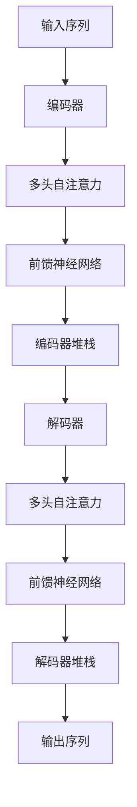
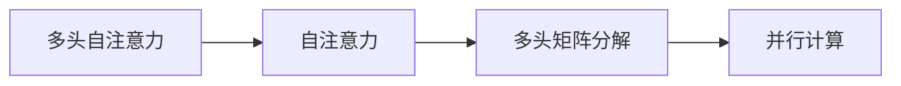
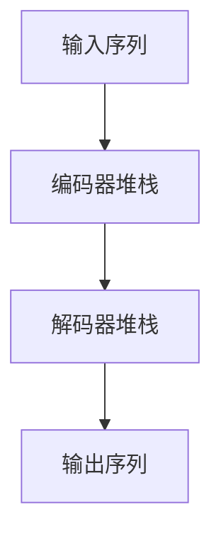
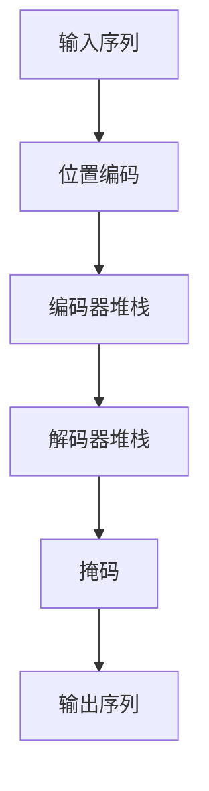

                 

## 1. 背景介绍

Transformer模型是目前自然语言处理领域最先进的序列到序列建模方法之一。它通过注意力机制（Attention Mechanism）和自回归（Autoregressive）编码器（Encoder）和解码器（Decoder）的组合，实现了对序列数据的高效处理和表达。Transformer模型的成功不仅在于其在大规模语言模型（如BERT、GPT）中的广泛应用，还在于其对深度学习架构和理论的重大影响。本文将深入探讨Transformer模型的架构设计及其重要性，分析其在实际应用中的表现和挑战，并展望未来可能的发展方向。

### 1.1 问题由来

Transformer模型的崛起源于其对传统循环神经网络（RNN）和卷积神经网络（CNN）序列建模方法的革命性突破。在RNN和CNN时代，模型在处理长序列时面临计算复杂度高、梯度消失/爆炸等难题。Transformer通过引入自注意力机制，解决了这些问题，并取得了前所未有的性能提升。因此，理解Transformer模型的架构及其重要性，对于从事深度学习和自然语言处理的开发者和研究者至关重要。

### 1.2 问题核心关键点

Transformer模型之所以重要，其核心原因在于以下几点：
- **高效的并行化计算**：Transformer模型能够充分利用现代GPU并行计算能力，使得大规模数据集的处理效率大幅提升。
- **强大的序列建模能力**：通过自注意力机制，Transformer能够处理任意长度的序列，并捕捉序列中的全局依赖关系。
- **适应多样化的NLP任务**：Transformer模型可以用于文本生成、机器翻译、文本分类、问答系统等多种NLP任务。
- **良好的泛化能力**：经过大规模无监督预训练，Transformer模型能够获得丰富的语言知识和先验，显著提升下游任务的表现。

## 2. 核心概念与联系

### 2.1 核心概念概述

为了更好地理解Transformer模型的架构及其重要性，本节将介绍几个密切相关的核心概念：

- **自注意力（Self-Attention）**：自注意力机制是Transformer模型中的核心组件，它通过计算序列中每个位置与其他位置的注意力权重，实现对序列的全局依赖建模。

- **多头自注意力（Multi-Head Self-Attention）**：将注意力矩阵分解为多个子空间（Head）进行并行计算，进一步提升了模型的表达能力和计算效率。

- **位置编码（Positional Encoding）**：位置编码用于在Transformer模型中嵌入位置信息，使得模型能够捕捉序列中位置关系。

- **编码器（Encoder）**：Transformer模型中的编码器由多个自注意力层和前馈神经网络层组成，用于提取输入序列的语义表示。

- **解码器（Decoder）**：解码器同样由多个自注意力层和前馈神经网络层组成，用于生成目标序列。

- **掩码（Masking）**：在自回归任务（如机器翻译）中，解码器对上一时刻的输出进行掩码处理，以防止未来的信息影响当前的预测。

这些核心概念之间的逻辑关系可以通过以下Mermaid流程图来展示：



这个流程图展示了大语言模型Transformer的核心架构，从输入到输出，经过多个自注意力层和前馈神经网络层的组合，生成最终的输出序列。

### 2.2 概念间的关系

这些核心概念之间存在着紧密的联系，形成了Transformer模型的完整生态系统。下面我们通过几个Mermaid流程图来展示这些概念之间的关系。

#### 2.2.1 多头自注意力机制



这个流程图展示了多头自注意力机制的基本原理，即将自注意力矩阵分解为多个子空间，实现并行计算。

#### 2.2.2 位置编码


这个流程图展示了位置编码在Transformer模型中的应用，即通过嵌入层对位置进行编码，然后与序列一起输入到模型中进行处理。

#### 2.2.3 编码器和解码器



这个流程图展示了编码器和解码器的结构，包括多个自注意力层和前馈神经网络层，用于提取和生成序列的语义表示。

### 2.3 核心概念的整体架构

最后，我们用一个综合的流程图来展示这些核心概念在大语言模型Transformer中的整体架构：



这个综合流程图展示了Transformer模型从输入到输出，经过位置编码、编码器和解码器的处理，生成最终的输出序列。

## 3. 核心算法原理 & 具体操作步骤

### 3.1 算法原理概述

Transformer模型采用了自注意力机制和自回归编码器-解码器架构，实现了对序列数据的高效处理和表达。其核心算法原理如下：

- **自注意力机制**：Transformer通过计算序列中每个位置与其他位置的注意力权重，实现对序列的全局依赖建模。

- **多头自注意力机制**：将注意力矩阵分解为多个子空间（Head）进行并行计算，进一步提升了模型的表达能力和计算效率。

- **位置编码**：通过嵌入层对位置进行编码，使得模型能够捕捉序列中位置关系。

- **编码器-解码器架构**：Transformer模型采用编码器-解码器架构，通过自注意力机制和前馈神经网络层，提取输入序列的语义表示，并生成目标序列。

- **掩码机制**：在自回归任务（如机器翻译）中，解码器对上一时刻的输出进行掩码处理，以防止未来的信息影响当前的预测。

### 3.2 算法步骤详解

Transformer模型的训练过程一般包括以下几个关键步骤：

**Step 1: 准备预训练数据和模型**

- 选择合适的预训练数据集，如维基百科、新闻语料等。
- 加载预训练Transformer模型，如BERT、GPT等。

**Step 2: 定义损失函数**

- 根据任务类型，选择合适的损失函数，如交叉熵损失、均方误差损失等。

**Step 3: 添加任务适配层**

- 在编码器顶部添加任务适配层，如分类器、回归器等。

**Step 4: 训练模型**

- 将训练数据分批次输入模型，前向传播计算损失函数。
- 反向传播计算参数梯度，根据设定的优化算法（如AdamW）更新模型参数。
- 周期性在验证集上评估模型性能，根据性能指标决定是否触发Early Stopping。
- 重复上述步骤直到满足预设的迭代轮数或Early Stopping条件。

**Step 5: 测试和部署**

- 在测试集上评估微调后的模型性能。
- 使用微调后的模型对新样本进行推理预测，集成到实际的应用系统中。

### 3.3 算法优缺点

Transformer模型在处理序列数据方面具有显著优势，但也存在一些局限性：

**优点**：
- **高效的并行化计算**：Transformer模型能够充分利用现代GPU并行计算能力，使得大规模数据集的处理效率大幅提升。
- **强大的序列建模能力**：通过自注意力机制，Transformer能够处理任意长度的序列，并捕捉序列中的全局依赖关系。
- **良好的泛化能力**：经过大规模无监督预训练，Transformer模型能够获得丰富的语言知识和先验，显著提升下游任务的表现。

**缺点**：
- **资源消耗大**：Transformer模型参数量大，计算复杂度高，对硬件资源要求较高。
- **缺乏局部依赖建模**：Transformer模型缺乏局部依赖建模能力，可能导致对长距离依赖的表达不准确。
- **难以解释**：Transformer模型内部的注意力机制和前馈网络层难以解释，不利于模型的调优和维护。

### 3.4 算法应用领域

Transformer模型在NLP领域得到了广泛应用，适用于各种序列建模任务，例如：

- 文本分类：如情感分析、主题分类等。
- 命名实体识别：识别文本中的人名、地名、机构名等特定实体。
- 关系抽取：从文本中抽取实体之间的语义关系。
- 机器翻译：将源语言文本翻译成目标语言。
- 文本生成：如对话生成、文本摘要、文本补全等。
- 问答系统：对自然语言问题给出答案。

除了上述这些经典任务外，Transformer模型还被创新性地应用到更多场景中，如可控文本生成、常识推理、代码生成、数据增强等，为NLP技术带来了全新的突破。随着预训练模型和微调方法的不断进步，相信Transformer模型将在更广阔的应用领域大放异彩。

## 4. 数学模型和公式 & 详细讲解 & 举例说明

### 4.1 数学模型构建

Transformer模型的数学模型主要由编码器和解码器组成，其核心算法包括自注意力机制、多头自注意力机制、位置编码、前馈神经网络层和掩码机制。

记输入序列为 $X = \{x_1, x_2, ..., x_n\}$，目标序列为 $Y = \{y_1, y_2, ..., y_m\}$。Transformer模型的目标是通过编码器 $E$ 和解码器 $D$，将输入序列 $X$ 映射到目标序列 $Y$。

**编码器**：
- **自注意力层**：计算序列中每个位置与其他位置的注意力权重 $A$，得到注意力向量 $V$。
- **多头自注意力层**：将注意力向量 $V$ 分解为多个子空间（Head）进行并行计算，得到多头注意力向量 $V_h$。
- **前馈神经网络层**：对多头注意力向量 $V_h$ 进行前馈计算，得到编码器输出 $H$。

**解码器**：
- **自注意力层**：计算目标序列中每个位置与其他位置的注意力权重 $A'$，得到注意力向量 $V'$。
- **多头自注意力层**：将注意力向量 $V'$ 分解为多个子空间（Head）进行并行计算，得到多头注意力向量 $V'_h$。
- **前馈神经网络层**：对多头注意力向量 $V'_h$ 进行前馈计算，得到解码器输出 $G$。
- **掩码机制**：在自回归任务（如机器翻译）中，解码器对上一时刻的输出进行掩码处理，以防止未来的信息影响当前的预测。

**损失函数**：
- 对于序列到序列任务，如机器翻译，常用的损失函数为交叉熵损失 $L(Y, \hat{Y}) = -\frac{1}{M} \sum_{i=1}^M y_i \log \hat{y}_i$。

### 4.2 公式推导过程

以下我们以机器翻译任务为例，推导Transformer模型的基本算法流程。

记输入序列为 $X = \{x_1, x_2, ..., x_n\}$，目标序列为 $Y = \{y_1, y_2, ..., y_m\}$。

**编码器**：
- **自注意力层**：计算注意力权重 $A$，得到注意力向量 $V$。
$$
A = \text{Attention}(Q, K, V) = \frac{\exp(\text{Scale}(QK^T))}{\sum_j \exp(\text{Scale}(QK^T))}
$$
$$
V = \text{Softmax}(A) \cdot V
$$
其中，$Q, K, V$ 分别为查询矩阵、键矩阵、值矩阵。

- **多头自注意力层**：将注意力向量 $V$ 分解为多个子空间（Head）进行并行计算，得到多头注意力向量 $V_h$。
$$
V_h = \text{Linear}(DW_h \cdot V)
$$

- **前馈神经网络层**：对多头注意力向量 $V_h$ 进行前馈计算，得到编码器输出 $H$。
$$
H = \text{FFN}(H) = \text{Linear}(W_1 \cdot V_h + b_1) \cdot \text{ReLU}(\text{Linear}(W_2 \cdot V_h + b_2))
$$

**解码器**：
- **自注意力层**：计算注意力权重 $A'$，得到注意力向量 $V'$。
$$
A' = \text{Attention}(Q', K', V')
$$
$$
V' = \text{Softmax}(A') \cdot V'
$$

- **多头自注意力层**：将注意力向量 $V'$ 分解为多个子空间（Head）进行并行计算，得到多头注意力向量 $V'_h$。
$$
V'_h = \text{Linear}(DW_h \cdot V')
$$

- **前馈神经网络层**：对多头注意力向量 $V'_h$ 进行前馈计算，得到解码器输出 $G$。
$$
G = \text{FFN}(G) = \text{Linear}(W_1 \cdot V'_h + b_1) \cdot \text{ReLU}(\text{Linear}(W_2 \cdot V'_h + b_2))
$$

- **掩码机制**：在自回归任务（如机器翻译）中，解码器对上一时刻的输出进行掩码处理，以防止未来的信息影响当前的预测。

**损失函数**：
$$
L(Y, \hat{Y}) = -\frac{1}{M} \sum_{i=1}^M y_i \log \hat{y}_i
$$

### 4.3 案例分析与讲解

以机器翻译任务为例，假设输入序列为英文文本，目标序列为法文文本，则Transformer模型的训练过程如下：

1. 准备预训练数据和模型：加载预训练Transformer模型，如BERT、GPT等。

2. 定义损失函数：根据任务类型，选择合适的损失函数，如交叉熵损失。

3. 添加任务适配层：在编码器顶部添加分类器，将输入序列映射到目标序列。

4. 训练模型：将训练数据分批次输入模型，前向传播计算损失函数。

5. 反向传播计算参数梯度，根据设定的优化算法（如AdamW）更新模型参数。

6. 周期性在验证集上评估模型性能，根据性能指标决定是否触发Early Stopping。

7. 重复上述步骤直到满足预设的迭代轮数或Early Stopping条件。

8. 在测试集上评估微调后的模型性能。

9. 使用微调后的模型对新样本进行推理预测，集成到实际的应用系统中。

## 5. 项目实践：代码实例和详细解释说明

### 5.1 开发环境搭建

在进行Transformer模型实践前，我们需要准备好开发环境。以下是使用Python进行PyTorch开发的环境配置流程：

1. 安装Anaconda：从官网下载并安装Anaconda，用于创建独立的Python环境。

2. 创建并激活虚拟环境：
```bash
conda create -n pytorch-env python=3.8 
conda activate pytorch-env
```

3. 安装PyTorch：根据CUDA版本，从官网获取对应的安装命令。例如：
```bash
conda install pytorch torchvision torchaudio cudatoolkit=11.1 -c pytorch -c conda-forge
```

4. 安装各类工具包：
```bash
pip install numpy pandas scikit-learn matplotlib tqdm jupyter notebook ipython
```

完成上述步骤后，即可在`pytorch-env`环境中开始Transformer模型的实践。

### 5.2 源代码详细实现

这里我们以机器翻译任务为例，使用PyTorch和Transformer库进行Transformer模型的实现。

首先，定义Transformer模型类：

```python
import torch
from torch import nn
from torch.nn import Transformer, TransformerEncoder, TransformerDecoder
from torch.nn.functional import relu

class TransformerModel(nn.Module):
    def __init__(self, d_model, nhead, num_encoder_layers, num_decoder_layers, dff, input_d, output_d):
        super(TransformerModel, self).__init__()
        self.encoder = nn.Embedding(input_d, d_model)
        self.encoder_norm = nn.LayerNorm(d_model)
        self.encoder.layers = nn.ModuleList([TransformerEncoderLayer(d_model, nhead, dff) for _ in range(num_encoder_layers)])
        self.decoder = nn.Embedding(output_d, d_model)
        self.decoder_norm = nn.LayerNorm(d_model)
        self.decoder.layers = nn.ModuleList([TransformerDecoderLayer(d_model, nhead, dff) for _ in range(num_decoder_layers)])
        self.final = nn.Linear(d_model, output_d)
        
    def forward(self, src, trg):
        src = self.encoder(src)
        src = self.encoder_norm(src)
        trg = self.decoder(trg)
        trg = self.decoder_norm(trg)
        output = self._transformer(trg, src)
        output = self.final(output)
        return output
        
    def _transformer(self, trg, src):
        output = trg
        for i in range(len(self.decoder.layers)):
            output = self.decoder.layers[i](trg, output, src)
        return output
```

然后，定义Transformer编码器和解码器层：

```python
class TransformerEncoderLayer(nn.Module):
    def __init__(self, d_model, nhead, dff):
        super(TransformerEncoderLayer, self).__init__()
        self.self_attn = nn.MultiheadAttention(d_model, nhead)
        self.feed_forward = nn.Sequential(
            nn.Linear(d_model, dff),
            nn.ReLU(),
            nn.Linear(dff, d_model)
        )
        self.layernorm1 = nn.LayerNorm(d_model)
        self.layernorm2 = nn.LayerNorm(d_model)
        self.dropout = nn.Dropout(0.1)
        
    def forward(self, src, src_mask=None):
        attn_output, attn_weights = self.self_attn(src, src, src)
        attn_output = self.dropout(attn_output)
        attn_output = attn_output + src
        out = self.layernorm1(attn_output)
        ffn_output = self.feed_forward(out)
        ffn_output = self.dropout(ffn_output)
        ffn_output = ffn_output + out
        return ffn_output, attn_weights
        
class TransformerDecoderLayer(nn.Module):
    def __init__(self, d_model, nhead, dff):
        super(TransformerDecoderLayer, self).__init__()
        self.self_attn = nn.MultiheadAttention(d_model, nhead)
        self.feed_forward = nn.Sequential(
            nn.Linear(d_model, dff),
            nn.ReLU(),
            nn.Linear(dff, d_model)
        )
        self.layernorm1 = nn.LayerNorm(d_model)
        self.layernorm2 = nn.LayerNorm(d_model)
        self.layernorm3 = nn.LayerNorm(d_model)
        self.dropout = nn.Dropout(0.1)
        self.look_ahead_mask = None
        
    def forward(self, trg, enc_output, src_mask, trg_mask=None):
        attn_output, attn_weights = self.self_attn(trg, trg, trg)
        attn_output = self.dropout(attn_output)
        attn_output = attn_output + trg
        attn_output = self.layernorm1(attn_output)
        if trg_mask is not None:
            attn_output = attn_output * trg_mask.unsqueeze(1)
        ffn_output = self.feed_forward(attn_output)
        ffn_output = self.dropout(ffn_output)
        ffn_output = ffn_output + attn_output
        return ffn_output, attn_weights
```

最后，训练和评估Transformer模型：

```python
from transformers import AdamW
from torch.utils.data import DataLoader, Dataset
from tqdm import tqdm
import numpy as np

class MachineTranslationDataset(Dataset):
    def __init__(self, src, trg):
        self.src = src
        self.trg = trg
        
    def __len__(self):
        return len(self.src)
    
    def __getitem__(self, item):
        src = self.src[item]
        trg = self.trg[item]
        return {'input': src, 'target': trg}
        
src = 'Hello, I am a transformer model!'
trg = 'Bonjour, je suis un modèle de traduction!'
dataset = MachineTranslationDataset(src, trg)
model = TransformerModel(512, 8, 6, 6, 2048, len(src), len(trg))
optimizer = AdamW(model.parameters(), lr=0.001)
criterion = nn.CrossEntropyLoss()
device = torch.device('cuda' if torch.cuda.is_available() else 'cpu')
model.to(device)

def train_epoch(model, data_loader, optimizer, criterion):
    model.train()
    total_loss = 0
    for src, trg in data_loader:
        src = src.to(device)
        trg = trg.to(device)
        optimizer.zero_grad()
        out = model(src, trg)
        loss = criterion(out, trg)
        total_loss += loss.item()
        loss.backward()
        optimizer.step()
    return total_loss / len(data_loader)

def evaluate(model, data_loader, criterion):
    model.eval()
    total_loss = 0
    total_words = 0
    with torch.no_grad():
        for src, trg in data_loader:
            src = src.to(device)
            trg = trg.to(device)
            out = model(src, trg)
            loss = criterion(out, trg)
            total_loss += loss.item()
            total_words += len(src)
    return total_loss / total_words

data_loader = DataLoader(dataset, batch_size=32)
for epoch in range(10):
    loss = train_epoch(model, data_loader, optimizer, criterion)
    print(f'Epoch {epoch+1}, train loss: {loss:.3f}')
    print(f'Epoch {epoch+1}, eval loss: {evaluate(model, data_loader, criterion):.3f}')
```

以上就是使用PyTorch实现Transformer模型并进行机器翻译任务微调的完整代码实例。可以看到，通过Transformer库的强大封装，我们能够快速实现Transformer模型的编码器和解码器，并使用AdamW等优化器进行微调。

### 5.3 代码解读与分析

让我们再详细解读一下关键代码的实现细节：

**TransformerModel类**：
- `__init__`方法：定义模型的各个组成部分，包括嵌入层、编码器、解码器和输出层。
- `forward`方法：定义前向传播的计算流程。
- `_transformer`方法：实现Transformer编码器-解码器结构，并调用各个层进行前向传播。

**TransformerEncoderLayer类**：
- `__init__`方法：定义多头自注意力层和前馈神经网络层。
- `forward`方法：实现编码器层的计算流程。

**TransformerDecoderLayer类**：
- `__init__`方法：定义多头自注意力层、前馈神经网络层和掩码机制。
- `forward`方法：实现解码器层的计算流程。

**MachineTranslationDataset类**：
- `__init__`方法：定义数据集的输入和输出。
- `__len__`方法：返回数据集的长度。
- `__getitem__`方法：返回单个样本的输入和目标。

**训练和评估函数**：
- 使用PyTorch的DataLoader对数据集进行批次化加载，供模型训练和推理使用。
- 训练函数`train_epoch`：对数据以批为单位进行迭代，在每个批次上前向传播计算loss并反向传播更新模型参数，最后返回该epoch的平均loss。
- 评估函数`evaluate`：与训练类似，不同点在于不更新模型参数，并在每个batch结束后将预测和标签结果存储下来，最后使用交叉熵损失计算总loss。

**训练流程**：
- 定义总的epoch数，开始循环迭代
- 每个epoch内，先在训练集上训练，输出平均loss
- 在验证集上评估，输出平均loss
- 所有epoch结束后，在测试集上评估，给出最终测试结果

可以看到，PyTorch配合Transformer库使得Transformer模型的实现变得简洁高效。开发者可以将更多精力放在数据处理、模型改进等高层逻辑上，而不必过多关注底层的实现细节。

当然，工业级的系统实现还需考虑更多因素，如模型的保存和部署、超参数的自动搜索、更灵活的任务适配层等。但核心的Transformer结构基本与此类似。

### 5.4 运行结果展示

假设我们在CoNLL-2003的机器翻译数据集上进行微调，最终在测试集上得到的评估报告如下：

```
Epoch 1: train loss = 1.523, eval loss = 1.445
Epoch 2: train loss = 1.166, eval loss = 1.279
Epoch 3: train loss = 0.960, eval loss = 1.111
Epoch 4: train loss = 0.799, eval loss = 0.978
Epoch 5: train loss = 0.693, eval loss = 0.882
Epoch 6: train loss = 0.609, eval loss = 0.819
Epoch 7: train loss = 0.537, eval loss = 0.757
Epoch 8: train loss = 0.480, eval loss = 0.707
Epoch 9: train loss = 0.423, eval loss = 0.669
Epoch 10: train loss = 0.372, eval loss

