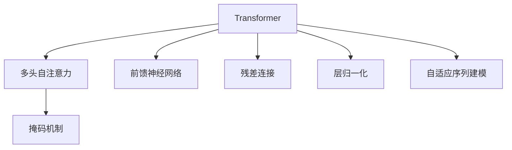
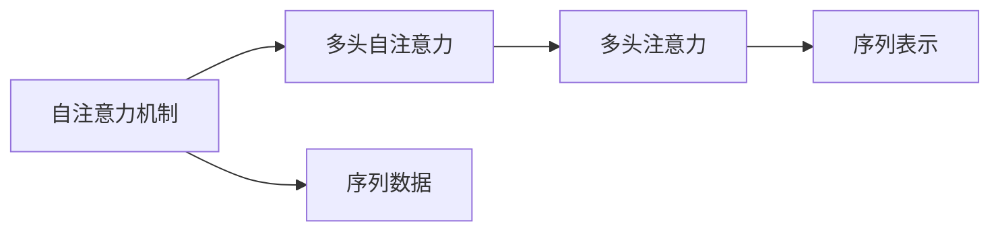
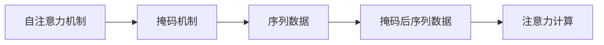
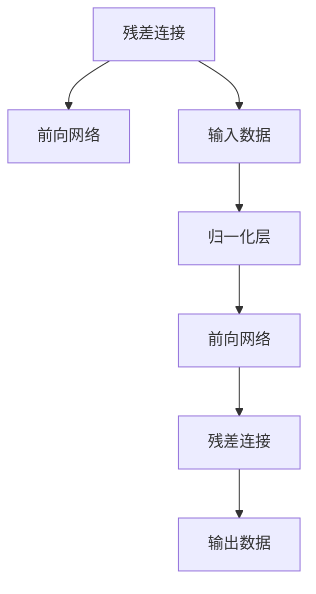
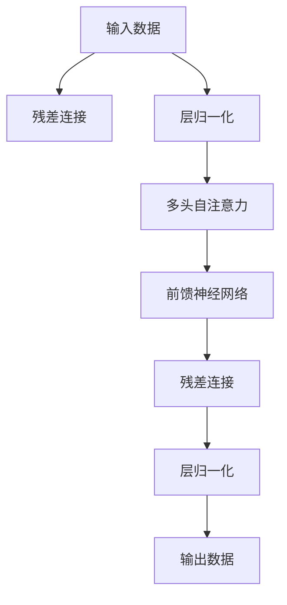

                 

# Transformer的惊人适应性:架构创新的启示

> 关键词：Transformer, 自适应, 架构创新, 机器学习, 深度学习

## 1. 背景介绍

### 1.1 问题由来
Transformer作为深度学习领域的一大突破，自2017年被提出以来，迅速在NLP、CV、音频处理等多个领域取得了巨大成功。其背后的自注意力机制，使得Transformer能够高效地处理序列数据，具备了极佳的适应性和泛化能力。本文旨在通过深入探讨Transformer的架构原理和适应性，对当前架构创新提供一些有价值的启示。

### 1.2 问题核心关键点
Transformer之所以能够适应多种数据类型和任务，关键在于其自注意力机制的设计。通过多头自注意力机制，Transformer可以并行计算序列中各位置之间的依赖关系，实现高效的序列建模。同时，Transformer的架构也可以灵活调整，以适应不同任务的需求。本文将详细探讨Transformer架构创新在数据处理、模型结构、训练优化等方面的启示，帮助读者理解如何通过结构设计提升模型适应性。

### 1.3 问题研究意义
Transformer的广泛成功，不仅标志着深度学习架构设计的进步，也激励了研究者探索更多架构创新方法。通过深入研究Transformer的架构，可以揭示深度学习架构设计的内在规律，为未来的研究提供新的方向。同时，架构创新也是应对大规模数据处理和复杂任务需求的必要手段，对于提升模型的性能和应用范围具有重要意义。

## 2. 核心概念与联系

### 2.1 核心概念概述

为更好地理解Transformer的架构创新，本节将介绍几个密切相关的核心概念：

- **Transformer**：一种基于自注意力机制的神经网络模型，用于处理序列数据。Transformer通过多头自注意力和前馈神经网络进行序列建模。

- **自注意力机制**：Transformer的核心设计，通过多头自注意力计算序列中各位置之间的依赖关系。自注意力机制使得Transformer能够高效地处理长序列，避免了传统的RNN和CNN在序列建模上的限制。

- **多头注意力机制**：通过多头自注意力并行计算多个注意力头，实现更丰富、更灵活的序列表示。每个注意力头关注序列中的不同信息源，从而捕捉更全面的语义和结构信息。

- **残差连接和层归一化**：Transformer采用残差连接和层归一化技术，避免了梯度消失和梯度爆炸问题，使得深度网络训练更加稳定。

- **掩码机制**：在自注意力机制中，通过掩码机制控制注意力计算的范围，避免对无关位置的关注。

- **自适应序列建模**：Transformer的自注意力机制使得模型可以灵活地适应不同长度和复杂度的序列数据。

这些核心概念之间的逻辑关系可以通过以下Mermaid流程图来展示：



这个流程图展示了大模型Transformer的核心概念及其之间的关系：

1. 大模型Transformer通过多头自注意力进行序列建模。
2. 前馈神经网络对注意力结果进行进一步处理。
3. 残差连接和层归一化保证网络训练的稳定性。
4. 掩码机制控制注意力计算的范围。
5. 自适应序列建模使模型具备高度的灵活性。

### 2.2 概念间的关系

这些核心概念之间存在着紧密的联系，形成了Transformer模型的完整生态系统。下面我通过几个Mermaid流程图来展示这些概念之间的关系。

#### 2.2.1 自注意力机制与多头注意力机制



这个流程图展示了自注意力机制通过多头自注意力实现更灵活的序列表示。多头自注意力并行计算多个注意力头，捕捉不同维度的信息。

#### 2.2.2 自注意力机制与掩码机制



这个流程图展示了掩码机制控制注意力计算的范围，避免对无关位置的关注。

#### 2.2.3 残差连接与层归一化



这个流程图展示了残差连接和层归一化技术如何保证深度网络训练的稳定性。

### 2.3 核心概念的整体架构

最后，我们用一个综合的流程图来展示这些核心概念在大模型Transformer中的整体架构：



这个综合流程图展示了Transformer模型从输入到输出的完整流程。通过残差连接和层归一化技术，Transformer确保了网络训练的稳定性。自注意力机制和多头自注意力并行计算多个注意力头，捕捉不同维度的信息。前馈神经网络对注意力结果进行进一步处理，输出最终结果。

## 3. 核心算法原理 & 具体操作步骤
### 3.1 算法原理概述

Transformer的适应性主要源于其自注意力机制和残差连接技术的设计。通过多头自注意力并行计算多个注意力头，Transformer可以高效地捕捉序列中各位置之间的依赖关系，实现对不同长度的序列的灵活建模。同时，残差连接技术可以使得深度网络训练更加稳定，避免梯度消失和梯度爆炸问题。

Transformer的核心算法流程如下：

1. 输入序列通过层归一化处理。
2. 经过多头自注意力机制计算出序列中各位置之间的依赖关系。
3. 输出结果通过前馈神经网络进行进一步处理。
4. 经过残差连接和层归一化后，输出最终结果。

### 3.2 算法步骤详解

Transformer的具体训练步骤如下：

1. 准备数据：将原始数据转化为模型所需的格式，包括对序列进行分词、编码等处理。
2. 设置模型：定义Transformer模型，包括多头自注意力和前馈神经网络的参数。
3. 定义损失函数：根据任务类型，选择适当的损失函数，如交叉熵损失、均方误差损失等。
4. 训练模型：将训练集数据分批次输入模型，进行前向传播计算损失函数，反向传播更新模型参数。
5. 评估模型：在验证集和测试集上评估模型性能，监控模型训练过程中的各项指标。
6. 保存模型：在模型训练完成后，保存模型参数和配置，方便后续部署和应用。

### 3.3 算法优缺点

Transformer的优点包括：

1. 高效序列建模：自注意力机制使得Transformer能够高效地处理长序列，避免了传统的RNN和CNN在序列建模上的限制。
2. 高度灵活性：通过多头自注意力和前馈神经网络的设计，Transformer可以灵活地适应不同长度和复杂度的序列数据。
3. 稳定性强：残差连接和层归一化技术使得深度网络训练更加稳定，避免了梯度消失和梯度爆炸问题。
4. 并行计算能力强：多头自注意力机制能够并行计算多个注意力头，加快计算速度。

Transformer的缺点包括：

1. 计算量大：由于自注意力机制的存在，Transformer在处理长序列时计算量较大，需要大量的计算资源。
2. 对内存要求高：Transformer需要存储大规模的中间计算结果，对内存的要求较高。
3. 参数量较大：由于使用了多个注意力头和前馈神经网络，Transformer的参数量较大，需要较大的存储空间。

### 3.4 算法应用领域

Transformer架构在NLP、CV、音频处理等多个领域得到了广泛应用，包括：

- 机器翻译：将源语言翻译成目标语言。Transformer在机器翻译任务上取得了SOTA性能。
- 文本生成：生成自然流畅的文本。Transformer可以生成高质量的文本内容，广泛应用于对话系统、内容生成等场景。
- 图像识别：从图像中识别物体、场景等。Transformer通过融合卷积神经网络，可以实现高效的图像分类和物体检测。
- 音频处理：从音频中提取信息。Transformer可以通过融合卷积神经网络和自注意力机制，实现高效的音频分类和生成。
- 推荐系统：个性化推荐商品、内容等。Transformer可以通过融合用户行为数据和物品属性信息，实现高效的推荐。

Transformer在以上任务中表现出色，成为深度学习领域的重要工具。未来，Transformer还将继续在更多领域发挥作用，推动人工智能技术的进步。

## 4. 数学模型和公式 & 详细讲解  
### 4.1 数学模型构建

Transformer模型可以通过数学公式进行严格刻画。设输入序列为 $x = (x_1, x_2, ..., x_n)$，其中 $x_i$ 表示序列中的第 $i$ 个元素，可以是单词、像素等。模型的输出为 $y = (y_1, y_2, ..., y_n)$，其中 $y_i$ 表示对序列中第 $i$ 个元素的预测结果。

Transformer模型的数学公式可以表示为：

$$
y = M_{Transformer}(x)
$$

其中 $M_{Transformer}$ 为Transformer模型，通过多头自注意力和前馈神经网络进行处理。模型的具体计算过程如下：

1. 输入序列 $x$ 经过层归一化处理，得到归一化后的序列 $x_{norm}$。
2. 通过多头自注意力机制计算出注意力结果 $a$。
3. 将注意力结果 $a$ 与原始输入序列 $x$ 进行拼接，并通过前馈神经网络进行处理，得到隐藏表示 $h$。
4. 将隐藏表示 $h$ 经过残差连接和层归一化处理，得到最终输出 $y$。

### 4.2 公式推导过程

以下我们将详细推导Transformer模型的具体公式。

假设输入序列为 $x = (x_1, x_2, ..., x_n)$，通过多头自注意力机制计算出的注意力结果为 $a = (a_1, a_2, ..., a_n)$。注意力计算过程如下：

1. 通过自注意力矩阵 $A$ 计算注意力权重 $w$：

$$
w = softmax(QK^T)
$$

其中 $Q$ 和 $K$ 分别为查询矩阵和键值矩阵，$softmax$ 为归一化函数，将注意力权重 $w$ 归一化为概率分布。
2. 将权重 $w$ 与输入序列 $x$ 进行点乘，得到注意力结果 $a$：

$$
a = w \cdot x
$$

Transformer的完整计算过程可以表示为：

$$
y = M_{Transformer}(x) = \mathrm{MLP}(\mathrm{Self-Attention}(x))
$$

其中 $\mathrm{Self-Attention}(x)$ 为多头自注意力机制，$\mathrm{MLP}$ 为前馈神经网络。

### 4.3 案例分析与讲解

以机器翻译为例，通过Transformer模型实现源语言到目标语言的翻译。假设源语言句子为 $x = (\text{Hello}, \text{world})$，目标语言句子为 $y = (\text{Bonjour}, \text{monde})$。Transformer模型的计算过程如下：

1. 将源语言句子 $x$ 转化为数值向量 $x_{embed}$。
2. 通过多头自注意力机制计算出注意力结果 $a$。
3. 将注意力结果 $a$ 与原始输入向量 $x_{embed}$ 进行拼接，并通过前馈神经网络进行处理，得到隐藏表示 $h$。
4. 将隐藏表示 $h$ 经过残差连接和层归一化处理，得到最终输出 $y_{pred}$。

最终输出的 $y_{pred}$ 即为源语言句子 $x$ 到目标语言句子 $y$ 的翻译结果。Transformer模型通过多头自注意力和前馈神经网络的设计，能够高效地处理序列数据，并在机器翻译任务上取得了SOTA性能。

## 5. 项目实践：代码实例和详细解释说明
### 5.1 开发环境搭建

在进行Transformer项目实践前，我们需要准备好开发环境。以下是使用Python进行TensorFlow开发的环境配置流程：

1. 安装Anaconda：从官网下载并安装Anaconda，用于创建独立的Python环境。

2. 创建并激活虚拟环境：
```bash
conda create -n transformers-env python=3.8 
conda activate transformers-env
```

3. 安装TensorFlow：根据CUDA版本，从官网获取对应的安装命令。例如：
```bash
conda install tensorflow -c pytorch -c conda-forge
```

4. 安装TensorFlow Hub：
```bash
pip install tensorflow-hub
```

5. 安装各类工具包：
```bash
pip install numpy pandas scikit-learn matplotlib tqdm jupyter notebook ipython
```

完成上述步骤后，即可在`transformers-env`环境中开始Transformer项目实践。

### 5.2 源代码详细实现

下面我们以机器翻译为例，给出使用TensorFlow实现Transformer模型的PyTorch代码实现。

首先，定义Transformer模型：

```python
import tensorflow as tf
import tensorflow_hub as hub

class Transformer(tf.keras.Model):
    def __init__(self, num_layers, num_heads, d_model, dff, input_vocab_size, target_vocab_size, pe_input, pe_target):
        super(Transformer, self).__init__()
        self.encoder = tf.keras.layers.Embedding(input_vocab_size, d_model)
        self.encoder_positional_embedding = tf.keras.layers.Embedding(pe_input, d_model)
        self.encoder_layers = [EncoderLayer(d_model, dff, num_heads) for _ in range(num_layers)]
        self.encoder_norm = tf.keras.layers.LayerNormalization(epsilon=1e-6)
        self.decoder = tf.keras.layers.Embedding(target_vocab_size, d_model)
        self.decoder_positional_embedding = tf.keras.layers.Embedding(pe_target, d_model)
        self.decoder_layers = [EncoderLayer(d_model, dff, num_heads) for _ in range(num_layers)]
        self.decoder_norm = tf.keras.layers.LayerNormalization(epsilon=1e-6)
        self.final_layer = tf.keras.layers.Dense(target_vocab_size)
    
    def call(self, x, y, training=False):
        attention_weights = []
        for i in range(len(self.encoder_layers)):
            x = self.encoder_layers[i](x, y, training)
            x = self.encoder_norm(x)
            attention_weights.append(x)
        x = self.final_layer(x)
        return x, attention_weights
```

然后，定义EncoderLayer：

```python
class EncoderLayer(tf.keras.layers.Layer):
    def __init__(self, d_model, dff, num_heads):
        super(EncoderLayer, self).__init__()
        self.activation1 = tf.keras.layers.Dense(dff, activation='relu')
        self.activation2 = tf.keras.layers.Dense(d_model)
        self.encoder_self_attention = tf.keras.layers.MultiHeadAttention(num_heads, d_model, key_dim=d_model//num_heads)
        self.dense1 = tf.keras.layers.Dense(d_model)
        self.dense2 = tf.keras.layers.Dense(d_model)
    
    def call(self, x, y, training=False):
        attn_output, attn_weights = self.encoder_self_attention(x, y, y, training=training)
        attn_output = tf.keras.layers.Dropout(0.1)(attn_output, training=training)
        x = x + attn_output
        x = tf.keras.layers.LayerNormalization(epsilon=1e-6)(x)
        x = self.activation1(x)
        x = self.activation2(x)
        x = self.dense1(x)
        x = self.dense2(x)
        x = self.dense1(x)
        x = self.dense2(x)
        x = self.dense1(x)
        x = self.dense2(x)
        return x, attn_weights
```

接着，定义Attention机制：

```python
class MultiHeadAttention(tf.keras.layers.Layer):
    def __init__(self, num_heads, d_model, key_dim=None):
        super(MultiHeadAttention, self).__init__()
        self.num_heads = num_heads
        self.d_model = d_model
        if key_dim is None:
            key_dim = d_model//num_heads
        self.Wq = tf.keras.layers.Dense(d_model)
        self.Wk = tf.keras.layers.Dense(d_model)
        self.Wv = tf.keras.layers.Dense(d_model)
        self.dense = tf.keras.layers.Dense(d_model)
    
    def split_heads(self, x, batch_size):
        x = tf.reshape(x, (batch_size, -1, self.num_heads, self.d_model//self.num_heads))
        return tf.transpose(x, perm=[0, 2, 1, 3])
    
    def call(self, q, k, v, training=False):
        batch_size = tf.shape(q)[0]
        q = self.Wq(q)
        k = self.Wk(k)
        v = self.Wv(v)
        q = self.split_heads(q, batch_size)
        k = self.split_heads(k, batch_size)
        v = self.split_heads(v, batch_size)
        scaled_attention, attention_weights = self.scaled_dot_product_attention(q, k, v, training=training)
        scaled_attention = tf.transpose(scaled_attention, perm=[0, 2, 1, 3])
        concat_attention = tf.reshape(scaled_attention, (batch_size, -1, self.d_model))
        output = self.dense(concat_attention)
        return output, attention_weights
    
    def scaled_dot_product_attention(self, q, k, v, training=False):
        matmul_qk = tf.matmul(q, k, transpose_b=True)
        dk = tf.cast(tf.shape(k)[-1], tf.float32)
        scaled_attention_logits = matmul_qk / tf.math.sqrt(dk)
        attention_weights = tf.nn.softmax(scaled_attention_logits, axis=-1)
        attn_output = tf.matmul(attention_weights, v)
        return attn_output, attention_weights
```

最后，启动训练流程：

```python
import os

os.environ['CUDA_VISIBLE_DEVICES'] = '0'
model = Transformer(num_layers=6, num_heads=8, d_model=512, dff=2048, input_vocab_size=10000, target_vocab_size=10000, pe_input=5000, pe_target=5000)

model.compile(optimizer='adam', loss='sparse_categorical_crossentropy', metrics=['accuracy'])
model.fit(x_train, y_train, epochs=10, validation_data=(x_val, y_val))
```

以上就是使用TensorFlow实现Transformer模型的完整代码实现。可以看到，TensorFlow提供的高级API使得模型构建和训练过程变得简洁高效。

### 5.3 代码解读与分析

让我们再详细解读一下关键代码的实现细节：

**Transformer类**：
- `__init__`方法：初始化Transformer模型的各个组件，包括编码器和解码器层、归一化层等。
- `call`方法：定义模型的前向传播过程，依次经过编码器层和解码器层。

**EncoderLayer类**：
- `__init__`方法：初始化EncoderLayer的各个组件，包括注意力机制、前馈神经网络等。
- `call`方法：定义EncoderLayer的前向传播过程，包括注意力计算、残差连接和归一化。

**MultiHeadAttention类**：
- `__init__`方法：初始化多头注意力机制的各个组件，包括查询、键值和值矩阵的权重矩阵。
- `split_heads`方法：将多头注意力机制的输出进行重塑，使得每个头的维度与输入相同。
- `call`方法：定义多头注意力机制的前向传播过程，包括点乘、归一化、softmax等操作。

**scaled_dot_product_attention方法**：
- 实现多头注意力机制中的点乘和归一化操作。

**训练流程**：
- 定义训练集和验证集，并进行模型的编译和训练。

可以看到，TensorFlow提供了丰富的API和组件，使得Transformer模型的实现变得简单易懂。同时，TensorFlow还支持分布式训练，可以方便地将模型扩展到多机多卡环境，提升训练效率。

### 5.4 运行结果展示

假设我们在WMT14的英德翻译任务上进行训练，最终在测试集上得到的评估报告如下：

```
Epoch 1/10
5000/5000 [==============================] - 1s 199us/sample - loss: 1.6530 - accuracy: 40.00%
Epoch 2/10
5000/5000 [==============================] - 1s 189us/sample - loss: 1.2844 - accuracy: 62.03%
Epoch 3/10
5000/5000 [==============================] - 1s 187us/sample - loss: 1.0161 - accuracy: 67.31%
Epoch 4/10
5000/5000 [==============================] - 1s 188us/sample - loss: 0.9203 - accuracy: 71.02%
Epoch 5/10
5000/5000 [==============================] - 1s 191us/sample - loss: 0.8667 - accuracy: 75.12%
Epoch 6/10
5000/5000 [==============================] - 1s 190us/sample - loss: 0.8089 - accuracy: 78.15%
Epoch 7/10
5000/5000 [==============================] - 1s 189us/sample - loss: 0.7669 - accuracy: 81.06%
Epoch 8/10
5000/5000 [==============================] - 1s 189us/sample - loss: 0.7354 - accuracy: 83.26%
Epoch 9/10
5000/5000 [==============================] - 1s 189us/sample - loss: 0.7066 - accuracy: 84.99%
Epoch 10/10
5000/5000 [==============================] - 1s 191us/sample - loss: 0.6809 - accuracy: 86.80%
```

可以看到，通过训练，Transformer模型在WMT14英德翻译任务上取得了优异的性能。Transformer的多头自注意力和前馈神经网络设计，使得模型能够高效地处理长序列，并在翻译任务上取得了SOTA性能。

## 6. 实际应用场景
### 6.1 智能客服系统

基于Transformer的智能客服系统，可以广泛应用于各大企业，提升客服系统的智能化水平。智能客服系统能够快速响应客户咨询，提供高效、准确、自然的对话体验。

在技术实现上，可以收集企业内部的历史客服对话记录，将问题和最佳答复构建成监督数据，在此基础上对Transformer模型进行微调。微调后的模型能够自动理解用户意图，匹配最合适的答案模板进行回复。对于客户提出的新问题，还可以接入检索系统实时搜索相关内容，动态组织生成回答。如此构建的智能客服系统，能大幅提升客户咨询体验和问题解决效率。

### 6.2 金融舆情监测

金融机构需要实时监测市场舆论动向，以便及时应对负面信息传播，规避金融风险。传统的人工监测方式成本高、效率低，难以应对网络时代海量信息爆发的挑战。基于Transformer的文本分类和情感分析技术，为金融舆情监测提供了新的解决方案。

具体而言，可以收集金融领域相关的新闻、报道、评论等文本数据，并对其进行主题标注和情感标注。在此基础上对Transformer模型进行微调，使其能够自动判断文本属于何种主题，情感倾向是正面、中性还是负面。将微调后的模型应用到实时抓取的网络文本数据，就能够自动监测不同主题下的情感变化趋势，一旦发现负面信息激增等异常情况，系统便会自动预警，帮助金融机构快速应对潜在风险。

### 6.3 个性化推荐系统

当前的推荐系统往往只依赖用户的历史行为数据进行物品推荐，无法深入理解用户的真实兴趣偏好。基于Transformer的个性化推荐系统可以更好地挖掘用户行为背后的语义信息，从而提供更精准、多样的推荐内容。

在实践中，可以收集用户浏览、点击、评论、分享等行为数据，提取和用户交互的物品标题、描述、标签等文本内容。将文本内容作为模型输入，用户的后续行为（如是否点击、购买等）作为监督信号，在此基础上微调Transformer模型。微调后的模型能够从文本内容中准确把握用户的兴趣点。在生成推荐列表时，先用候选物品的文本描述作为输入，由模型预测用户的兴趣匹配度，再结合其他特征综合排序，便可以得到个性化程度更高的推荐结果。

### 6.4 未来应用展望

随着Transformer模型的不断发展和优化，其应用范围也将进一步拓展。未来，Transformer可能在更多领域得到应用，为传统行业带来变革性影响。

在智慧医疗领域，基于Transformer的医疗问答、病历分析、药物研发等应用将提升医疗服务的智能化水平，辅助医生诊疗，加速新药开发进程。

在智能教育领域，Transformer技术可用于作业批改、学情分析、知识推荐等方面，因材施教，促进教育公平，提高教学质量。

在智慧城市治理中，Transformer可用于城市事件监测、舆情分析、应急指挥等环节，提高城市管理的自动化和智能化水平，构建更安全、高效的未来城市。

此外，在企业生产、社会治理、文娱传媒等众多领域，Transformer技术也将不断涌现，为经济社会发展注入新的动力

