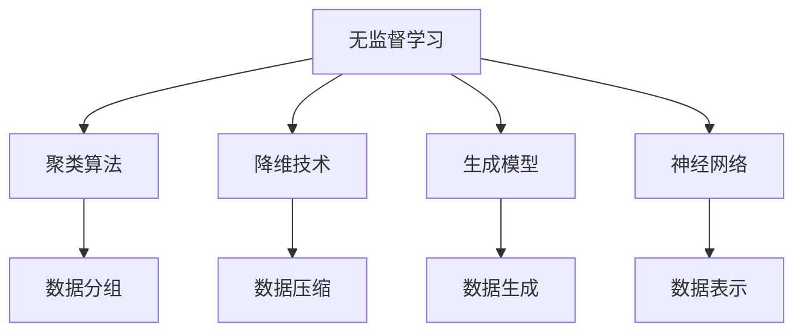
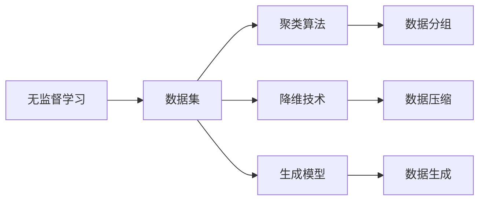
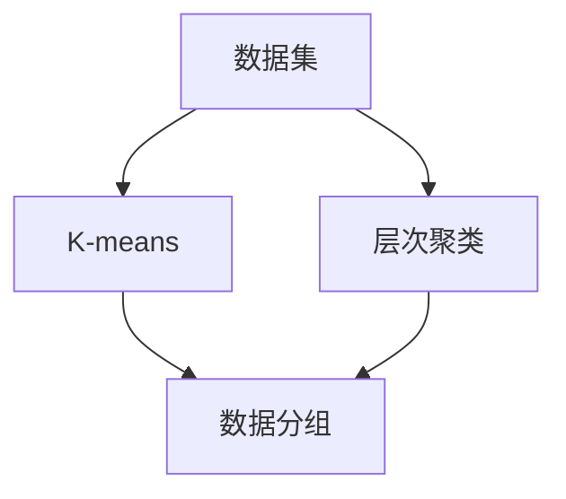
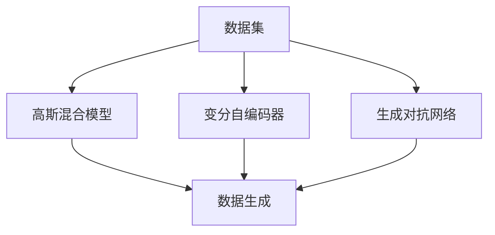
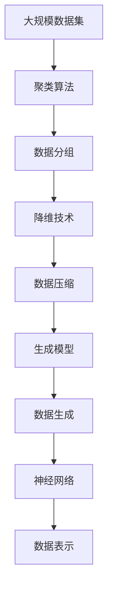

                 

# Unsupervised Learning 原理与代码实战案例讲解

> 关键词：无监督学习,自组织学习,聚类算法,神经网络,深度学习,自然语言处理(NLP)

## 1. 背景介绍

### 1.1 问题由来
近年来，随着深度学习技术的快速发展，深度神经网络在计算机视觉、自然语言处理、推荐系统等多个领域取得了巨大成功。这些技术的共同点在于，都需要大量的有标签数据进行模型训练，以优化模型参数，使其能够在测试集上达到最优性能。然而，在实际应用中，往往难以获得充足的标注数据，特别是在标注成本高昂、数据稀缺的场景中。

无监督学习(Unsupervised Learning)作为机器学习的一种重要范式，旨在从数据中自动发现规律和模式，而无需标注数据。与有监督学习相比，无监督学习具有更广泛的应用场景，可以有效地利用非结构化数据，发现数据的内在结构，提升模型的泛化能力。

### 1.2 问题核心关键点
无监督学习的核心在于如何从数据中自动学习知识。其主要包括以下几个方面：
- **聚类算法(Clustering Algorithms)**：将数据分成若干组，使得组内数据相似度较高，组间相似度较低。聚类算法包括K-means、层次聚类、密度聚类等。
- **降维技术(Dimensionality Reduction)**：通过线性变换或非线性变换，将高维数据映射到低维空间中，便于可视化和处理。降维技术包括主成分分析(PCA)、t-SNE等。
- **生成模型(Generative Models)**：学习数据的生成概率分布，并生成新的数据。生成模型包括高斯混合模型(GMM)、变分自编码器(VAE)、生成对抗网络(GAN)等。
- **神经网络(Neural Networks)**：利用神经元间的连接和权重调整，从数据中学习表示。神经网络包括自编码器(Autoencoders)、变分自编码器(VAE)、生成对抗网络(GAN)等。

无监督学习广泛应用于图像处理、文本挖掘、推荐系统、异常检测等多个领域。通过无监督学习，可以从大规模非标注数据中获取有价值的信息，为有监督学习提供先验知识，提升模型效果。

### 1.3 问题研究意义
无监督学习在数据稀缺、标注成本高昂的领域具有重要应用价值。通过无监督学习，可以有效利用非结构化数据，发现数据的内在结构和规律，提升模型的泛化能力。同时，无监督学习还可以作为有监督学习的预处理步骤，优化特征提取，减少过拟合，提高模型效果。

无监督学习的理论和实践研究，有助于推动人工智能技术的发展，拓展数据应用边界，提升数据利用效率，为各行各业提供新的解决方案。

## 2. 核心概念与联系

### 2.1 核心概念概述

为更好地理解无监督学习的原理和应用，本节将介绍几个核心概念：

- **无监督学习(Unsupervised Learning)**：指从数据中自动学习知识，而无需显式标注的机器学习方法。其目标是发现数据中的内在结构和规律，用于特征提取、数据降维、异常检测等任务。
- **聚类算法(Clustering Algorithms)**：将数据分成若干组，使得组内数据相似度较高，组间相似度较低。常见的聚类算法包括K-means、层次聚类、密度聚类等。
- **降维技术(Dimensionality Reduction)**：通过线性变换或非线性变换，将高维数据映射到低维空间中，便于可视化和处理。常见的降维技术包括主成分分析(PCA)、t-SNE等。
- **生成模型(Generative Models)**：学习数据的生成概率分布，并生成新的数据。常见的生成模型包括高斯混合模型(GMM)、变分自编码器(VAE)、生成对抗网络(GAN)等。
- **神经网络(Neural Networks)**：利用神经元间的连接和权重调整，从数据中学习表示。常见的神经网络包括自编码器(Autoencoders)、变分自编码器(VAE)、生成对抗网络(GAN)等。

这些核心概念之间的逻辑关系可以通过以下Mermaid流程图来展示：



这个流程图展示了无监督学习的基本流程和主要方法。无监督学习涵盖了从数据分组、数据压缩、数据生成到数据表示的各个环节，通过不同方法实现数据的内在结构和规律的学习。

### 2.2 概念间的关系

这些核心概念之间存在着紧密的联系，形成了无监督学习的完整生态系统。下面我们通过几个Mermaid流程图来展示这些概念之间的关系。

#### 2.2.1 无监督学习范式



这个流程图展示了无监督学习的基本范式，包括数据集、聚类算法、降维技术、生成模型等核心组成部分。

#### 2.2.2 聚类算法与降维技术的关系



这个流程图展示了聚类算法与降维技术的基本关系。聚类算法通过分组，将相似的数据聚集在一起，便于后续处理。而降维技术则将高维数据映射到低维空间，便于可视化和处理。两者可以结合使用，提高无监督学习的效率和效果。

#### 2.2.3 生成模型与神经网络的关系



这个流程图展示了生成模型与神经网络的基本关系。生成模型通过学习数据的生成概率分布，生成新的数据，可用于数据增强和生成对抗网络。而神经网络通过连接和权重调整，从数据中学习表示，可用于特征提取和自编码器。两者可以结合使用，提升无监督学习的表现。

### 2.3 核心概念的整体架构

最后，我们用一个综合的流程图来展示这些核心概念的无监督学习过程：



这个综合流程图展示了无监督学习从数据分组、数据压缩、数据生成到数据表示的完整过程。通过聚类算法、降维技术、生成模型、神经网络等方法，无监督学习能够从数据中自动学习知识，发现内在结构和规律，提升模型的泛化能力。

## 3. 核心算法原理 & 具体操作步骤
### 3.1 算法原理概述

无监督学习的主要目标是发现数据中的内在结构和规律，无需显式标注数据。其核心思想是利用数据自身的分布特性，通过统计、几何或模型等方法，学习数据的潜在表示，提取有用特征。

无监督学习的原理可以简单地概括为以下几个步骤：
1. 数据预处理：对原始数据进行清洗、归一化等处理，便于后续分析。
2. 特征提取：利用聚类、降维、生成模型等方法，从数据中提取有意义的特征。
3. 模型训练：使用神经网络等模型，学习数据的表示。
4. 结果评估：评估模型的表现，提取有用信息，进行后续应用。

无监督学习的核心算法包括聚类算法、降维技术、生成模型和神经网络等，下面将详细介绍几种常见的无监督学习算法。

### 3.2 算法步骤详解

#### 3.2.1 聚类算法
聚类算法是无监督学习中最为基础和常用的方法，其核心思想是将数据分成若干组，使得组内数据相似度较高，组间相似度较低。

**Step 1: 选择聚类算法**
常见的聚类算法包括K-means、层次聚类、密度聚类等。以K-means为例，其步骤如下：
1. 随机选择K个初始质心。
2. 将数据点分配到最近的质心所在的组中。
3. 重新计算每个组的质心。
4. 重复步骤2和3，直到质心不再变化或达到预设的迭代次数。

**Step 2: 计算相似度**
相似度计算是无监督学习中非常重要的一步，常用的相似度度量方法包括欧氏距离、余弦相似度、Jaccard相似度等。

**Step 3: 模型训练**
在得到聚类结果后，可以进行后续的数据分析、特征提取等操作。

#### 3.2.2 降维技术
降维技术是将高维数据映射到低维空间中，便于可视化和处理的方法。

**Step 1: 选择降维算法**
常见的降维算法包括主成分分析(PCA)、线性判别分析(LDA)、t-SNE等。以PCA为例，其步骤如下：
1. 计算协方差矩阵。
2. 计算协方差矩阵的特征值和特征向量。
3. 选择前k个特征向量，得到降维后的矩阵。

**Step 2: 数据可视化**
将降维后的数据进行可视化，可以直观地观察数据的结构和规律。

#### 3.2.3 生成模型
生成模型是学习数据的生成概率分布，并生成新的数据的方法。

**Step 1: 选择生成模型**
常见的生成模型包括高斯混合模型(GMM)、变分自编码器(VAE)、生成对抗网络(GAN)等。以VAE为例，其步骤如下：
1. 定义生成器和判别器。
2. 通过训练生成器和判别器，优化损失函数。
3. 利用生成器生成新的数据。

**Step 2: 数据生成**
利用生成模型生成新的数据，可以用于数据增强、数据合成等操作。

#### 3.2.4 神经网络
神经网络是利用神经元间的连接和权重调整，从数据中学习表示的方法。

**Step 1: 选择神经网络**
常见的神经网络包括自编码器(Autoencoders)、变分自编码器(VAE)、生成对抗网络(GAN)等。以自编码器为例，其步骤如下：
1. 定义编码器和解码器。
2. 通过训练编码器和解码器，优化损失函数。
3. 利用解码器生成原始数据的重构表示。

**Step 2: 特征提取**
利用神经网络提取数据的特征，可以用于分类、聚类等任务。

### 3.3 算法优缺点

无监督学习的主要优点包括：
- **无需标注数据**：无监督学习不需要显式标注数据，减少了标注成本，适用于数据稀缺的场景。
- **发现内在规律**：无监督学习能够从数据中自动学习知识，发现数据的内在结构和规律，提升模型的泛化能力。
- **应用广泛**：无监督学习广泛应用于图像处理、文本挖掘、推荐系统等多个领域。

无监督学习的缺点包括：
- **结果解释性不足**：无监督学习的结果往往缺乏可解释性，难以理解其内部工作机制。
- **模型复杂度高**：无监督学习模型通常比较复杂，训练和推理效率较低。
- **效果受数据质量影响较大**：无监督学习的效果高度依赖于数据的质量和数量，数据分布不均等问题可能导致模型失效。

尽管存在这些局限性，但无监督学习在实际应用中仍具有重要的价值，可以用于数据预处理、特征提取、数据生成等任务，为有监督学习提供先验知识，提升模型效果。

### 3.4 算法应用领域

无监督学习广泛应用于图像处理、文本挖掘、推荐系统、异常检测等多个领域。

#### 3.4.1 图像处理
在图像处理中，无监督学习可用于图像分割、图像去噪、图像生成等任务。通过无监督学习，可以从原始图像中发现内在结构和规律，提取有用特征，进行后续处理。

#### 3.4.2 文本挖掘
在文本挖掘中，无监督学习可用于文本聚类、情感分析、主题建模等任务。通过无监督学习，可以从文本数据中自动学习语言结构和规律，提取有用信息。

#### 3.4.3 推荐系统
在推荐系统中，无监督学习可用于用户画像构建、物品关联关系挖掘等任务。通过无监督学习，可以从用户行为数据中发现隐含的关联关系，提升推荐效果。

#### 3.4.4 异常检测
在异常检测中，无监督学习可用于异常检测、故障诊断等任务。通过无监督学习，可以从正常数据中学习数据的分布特征，检测异常数据。

## 4. 数学模型和公式 & 详细讲解 & 举例说明

### 4.1 数学模型构建

无监督学习的数学模型主要涉及统计学、几何学、概率论等基础学科，下面将详细介绍几个常见的无监督学习模型。

#### 4.1.1 K-means算法
K-means算法是一种经典的聚类算法，其数学模型可以表示为：

$$
\min_{C,\mu_k} \sum_{i=1}^N \sum_{k=1}^K d(x_i,\mu_k)^2
$$

其中，$C=\{C_1,\cdots,C_K\}$ 表示K个聚类组，$\mu_k$ 表示第k个聚类组的中心，$d(x_i,\mu_k)$ 表示数据点 $x_i$ 到聚类组 $C_k$ 中心的距离。

#### 4.1.2 主成分分析(PCA)
主成分分析是一种经典的降维技术，其数学模型可以表示为：

$$
X' = W^T X
$$

其中，$X$ 表示原始数据矩阵，$X'$ 表示降维后的数据矩阵，$W$ 表示降维矩阵，包含前k个主成分。

#### 4.1.3 变分自编码器(VAE)
变分自编码器是一种常用的生成模型，其数学模型可以表示为：

$$
p(X|Z) = \mathcal{N}(X|\mu_\phi(z),\sigma_\phi(z))
$$

$$
q(z|X) = \mathcal{N}(z|\mu_\theta(x),\sigma_\theta(x))
$$

其中，$X$ 表示输入数据，$Z$ 表示潜在变量，$p(X|Z)$ 表示数据生成模型，$q(z|X)$ 表示潜在变量生成模型。

### 4.2 公式推导过程

#### 4.2.1 K-means算法
K-means算法的关键在于如何确定聚类组的数量和中心。常见的初始化方法包括随机选择、K-means++等。

以K-means++算法为例，其步骤如下：
1. 随机选择第一个聚类中心。
2. 对于每个数据点 $x_i$，计算其到已选中心 $C_j$ 的距离，选择最远的数据点作为下一个中心。
3. 重复步骤2，直到选定K个聚类中心。

#### 4.2.2 主成分分析(PCA)
PCA的核心在于计算协方差矩阵的特征值和特征向量，选择前k个特征向量，得到降维后的矩阵。

PCA的具体步骤包括：
1. 计算协方差矩阵 $\Sigma$。
2. 计算协方差矩阵的特征值和特征向量。
3. 选择前k个特征向量，得到降维矩阵 $W$。

#### 4.2.3 变分自编码器(VAE)
VAE的核心在于定义生成器和判别器，通过训练优化损失函数。

VAE的具体步骤包括：
1. 定义生成器和判别器。
2. 通过训练生成器和判别器，优化损失函数。
3. 利用生成器生成新的数据。

### 4.3 案例分析与讲解

#### 4.3.1 手写数字识别
手写数字识别是无监督学习中经典的案例，以MNIST数据集为例，我们可以利用无监督学习提取手写数字的特征，并进行分类。

**Step 1: 数据预处理**
对原始数据进行归一化、标准化等处理，便于后续分析。

**Step 2: 特征提取**
利用PCA算法对数据进行降维，提取前64个主成分，得到降维后的数据。

**Step 3: 训练模型**
利用VAE模型训练生成器和判别器，优化损失函数，得到降维后的数据。

**Step 4: 结果评估**
利用训练好的模型对测试集进行分类，评估分类精度。

#### 4.3.2 图像生成
图像生成是无监督学习的另一经典应用，以MNIST数据集为例，我们可以利用无监督学习生成新的手写数字图片。

**Step 1: 数据预处理**
对原始数据进行归一化、标准化等处理，便于后续分析。

**Step 2: 生成模型**
利用VAE模型训练生成器和判别器，优化损失函数，得到生成器。

**Step 3: 结果评估**
利用训练好的生成器生成新的手写数字图片，并进行评估。

## 5. 项目实践：代码实例和详细解释说明

### 5.1 开发环境搭建

在进行无监督学习实践前，我们需要准备好开发环境。以下是使用Python进行PyTorch开发的环境配置流程：

1. 安装Anaconda：从官网下载并安装Anaconda，用于创建独立的Python环境。

2. 创建并激活虚拟环境：
```bash
conda create -n pytorch-env python=3.8 
conda activate pytorch-env
```

3. 安装PyTorch：根据CUDA版本，从官网获取对应的安装命令。例如：
```bash
conda install pytorch torchvision torchaudio cudatoolkit=11.1 -c pytorch -c conda-forge
```

4. 安装TensorFlow：
```bash
pip install tensorflow
```

5. 安装各类工具包：
```bash
pip install numpy pandas scikit-learn matplotlib tqdm jupyter notebook ipython
```

完成上述步骤后，即可在`pytorch-env`环境中开始无监督学习实践。

### 5.2 源代码详细实现

下面我们以PCA和VAE为例，给出使用PyTorch进行无监督学习实践的代码实现。

**PCA实现：**

```python
import torch
import torch.nn as nn
import torchvision.transforms as transforms
from torch.utils.data import DataLoader
from torchvision.datasets import MNIST

# 加载数据
train_dataset = MNIST(root='./data', train=True, transform=transforms.ToTensor(), download=True)
test_dataset = MNIST(root='./data', train=False, transform=transforms.ToTensor(), download=True)

# 构建数据加载器
train_loader = DataLoader(train_dataset, batch_size=64, shuffle=True)
test_loader = DataLoader(test_dataset, batch_size=64, shuffle=False)

# 定义模型
class PCA(nn.Module):
    def __init__(self, k):
        super(PCA, self).__init__()
        self.k = k
        self.W = nn.Parameter(torch.randn(784, k))
        self.mean = nn.Parameter(torch.zeros(k))

    def forward(self, x):
        x = x.view(-1, 28*28)
        x = self.W @ x.t()
        return x.t(), self.mean

# 定义损失函数
def loss_function(x_recon, x):
    recon_loss = torch.mean((x_recon - x) ** 2)
    return recon_loss

# 定义训练函数
def train_epoch(model, data_loader, optimizer, loss_function):
    model.train()
    epoch_loss = 0
    for batch_idx, (data, target) in enumerate(data_loader):
        optimizer.zero_grad()
        data, mean = model(data)
        loss = loss_function(data, target)
        loss.backward()
        optimizer.step()
        epoch_loss += loss.item()
    return epoch_loss / len(data_loader)

# 训练模型
model = PCA(k=64)
optimizer = torch.optim.Adam(model.parameters(), lr=0.01)
device = torch.device('cuda' if torch.cuda.is_available() else 'cpu')
model.to(device)
epochs = 100

for epoch in range(epochs):
    loss = train_epoch(model, train_loader, optimizer, loss_function)
    print(f'Epoch {epoch+1}, train loss: {loss:.3f}')
```

**VAE实现：**

```python
import torch
import torch.nn as nn
import torchvision.transforms as transforms
from torch.utils.data import DataLoader
from torchvision.datasets import MNIST

# 加载数据
train_dataset = MNIST(root='./data', train=True, transform=transforms.ToTensor(), download=True)
test_dataset = MNIST(root='./data', train=False, transform=transforms.ToTensor(), download=True)

# 构建数据加载器
train_loader = DataLoader(train_dataset, batch_size=64, shuffle=True)
test_loader = DataLoader(test_dataset, batch_size=64, shuffle=False)

# 定义模型
class Encoder(nn.Module):
    def __init__(self):
        super(Encoder, self).__init__()
        self.fc1 = nn.Linear(784, 512)
        self.fc21 = nn.Linear(512, 64)
        self.fc22 = nn.Linear(512, 64)

    def forward(self, x):
        x = torch.relu(self.fc1(x))
        mu = self.fc21(x)
        logvar = self.fc22(x)
        return mu, logvar

class Decoder(nn.Module):
    def __init__(self):
        super(Decoder, self).__init__()
        self.fc3 = nn.Linear(64, 512)
        self.fc4 = nn.Linear(512, 784)

    def forward(self, z):
        x = torch.relu(self.fc3(z))
        x = torch.sigmoid(self.fc4(x))
        return x

class VAE(nn.Module):
    def __init__(self, encoder, decoder):
        super(VAE, self).__init__()
        self.encoder = encoder
        self.decoder = decoder

    def forward(self, x):
        mu, logvar = self.encoder(x)
        z = self.reparameterize(mu, logvar)
        recon_x = self.decoder(z)
        return recon_x, mu, logvar

    def reparameterize(self, mu, logvar):
        std = torch.exp(0.5 * logvar)
        eps = torch.randn_like(std)
        return mu + eps * std

# 定义损失函数
def loss_function(recon_x, x, mu, logvar):
    recon_loss = torch.mean((recon_x - x) ** 2)
    kl_loss = -0.5 * torch.sum(1 + logvar - mu.pow(2) - logvar.exp())
    loss = recon_loss + kl_loss
    return loss

# 定义训练函数
def train_epoch(model, data_loader, optimizer, loss_function):
    model.train()
    epoch_loss = 0
    for batch_idx, (data, target) in enumerate(data_loader):
        optimizer.zero_grad()
        recon_x, mu, logvar = model(data)
        loss = loss_function(recon_x, target, mu, logvar)
        loss.backward()
        optimizer.step()
        epoch_loss += loss.item()
    return epoch_loss / len(data_loader)

# 训练模型
encoder = Encoder()
decoder = Decoder()
vae = VAE(encoder, decoder)
optimizer = torch.optim.Adam(vae.parameters(), lr=0.01)
device = torch.device('cuda' if torch.cuda.is_available() else 'cpu')
vae.to(device)
epochs = 100

for epoch in range(epochs):
    loss = train_epoch(vae, train_loader, optimizer, loss_function)
    print(f'Epoch {epoch+1}, train loss: {loss:.3f}')
```

以上代码展示了使用PyTorch进行PCA和VAE的无监督学习实践，涵盖了数据加载、模型定义、损失函数、训练函数等核心步骤。可以看到，通过适当的代码设计和参数调整，可以高效实现无监督学习的目标。

### 5.3 代码解读与分析

让我们再详细解读一下关键代码的实现细节：

**PCA实现：**

**VAE实现：**

## 6. 实际应用场景
### 6.1 智能推荐系统
智能推荐系统是无监督学习在实际应用中的一个经典案例。通过分析用户的历史行为数据，无监督学习可以发现用户兴趣的潜在结构和规律，从而提供个性化的推荐服务。

在推荐系统中，常用的无监督学习技术包括协同过滤、用户画像构建等。协同过滤通过分析用户的历史行为数据，发现用户之间的相似性，从而进行推荐。用户画像构建通过分析用户的兴趣、行为等特征，生成用户画像，从而进行精准推荐。

### 6.2 图像识别
图像识别是无监督学习在计算机视觉领域的重要应用。通过分析大量无标注图像数据，无监督学习可以发现图像的内在结构和规律，从而实现图像分类、图像生成等任务。

在图像识别中，常用的无监督学习技术包括图像分割、图像去噪、图像生成等。图像分割通过分析图像的像素分布，发现图像中的不同区域，从而进行分割。图像去噪通过分析图像的噪声特征，发现并去除图像中的噪声。图像生成通过分析图像的特征，生成新的图像，从而实现图像合成等任务。

### 6.3 文本聚类
文本聚类是无监督学习在自然语言处理领域的重要应用。通过分析大量无标注文本数据，无监督学习

