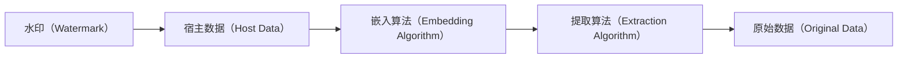
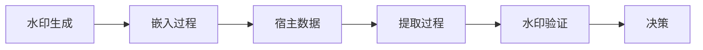

                 

# Watermark 原理与代码实例讲解

> 关键词：Watermark, 数字水印, 图像处理, 机器学习, 代码实现, 实际应用

## 1. 背景介绍

在当今数字化时代，数据安全与版权保护成为重要的议题。数字水印（Digital Watermark）技术作为一种有效手段，广泛应用于图像、音频、视频等多个领域，确保内容不被非法复制和篡改。本文将深入探讨数字水印的基本原理，并通过具体的代码实例，讲解其实现方法和实际应用。

### 1.1 问题由来

随着互联网的普及，数字内容的传播和共享变得越来越容易，但也带来了严重的版权侵犯问题。从音乐盗版到视频盗录，各类侵权行为层出不穷。为了保护原创内容，数字水印技术应运而生。它能在不显著影响内容的前提下，嵌入可证明原创性的信息，从而追溯盗版来源，打击侵权行为。

### 1.2 问题核心关键点

数字水印的核心理念是将特定的信息（称为水印）嵌入到原始数据中，而不影响其观赏和使用。水印可以是文本、图像、声音等，可以嵌入在数字作品的像素、频域、时间域等多种形式中，具有不可见性、鲁棒性、唯一性和可检测性等特点。常见的数字水印方法包括：

- 空间域水印：直接修改图像像素值，实现不可见性。
- 频域水印：在频域中嵌入水印，如DCT、DWT等。
- 时域水印：在视频或音频的帧间嵌入特定信息。
- 视觉加密（Visual Cryptography）：将水印信息分解成多份图像，共同查看才能重构水印。

这些方法各有优缺点，适用于不同的应用场景。本文将重点讲解空间域和频域水印的原理，并给出具体的代码实现。

### 1.3 问题研究意义

数字水印技术对于保护知识产权、打击盗版侵权行为具有重要意义。通过对数字内容的有效识别和追踪，保障内容创造者的合法权益，促进数字化内容产业的健康发展。

## 2. 核心概念与联系

### 2.1 核心概念概述

数字水印技术涉及多个关键概念，主要包括：

- **水印（Watermark）**：嵌入到原始数据中的不可见信息，用于证明内容原创性。
- **宿主数据（Host Data）**：原始的图像、音频、视频等数字内容。
- **嵌入算法（Embedding Algorithm）**：将水印信息嵌入到宿主数据中的算法。
- **提取算法（Extraction Algorithm）**：从宿主数据中提取水印信息的算法。
- **鲁棒性（Robustness）**：水印在经过一定处理后仍能被正确提取的能力。
- **不可见性（Invisibility）**：水印嵌入后不影响宿主数据的观感和使用。

这些概念共同构成了数字水印技术的核心框架，帮助我们在实际应用中灵活选择和应用不同的方法。

### 2.2 概念间的关系

数字水印技术的实现涉及多个步骤，如图1所示。



1. **水印生成**：根据内容需求，设计合适的水印信息。
2. **嵌入过程**：通过嵌入算法将水印信息隐藏到宿主数据中。
3. **提取过程**：通过提取算法从宿主数据中提取出水印信息。
4. **验证过程**：对比提取出的水印和原始水印，验证水印的完整性和鲁棒性。

这些步骤形成了完整的数字水印流程，确保了水印的有效性和安全性。

### 2.3 核心概念的整体架构

数字水印技术的整体架构如图2所示。



水印生成阶段包括水印设计、水印量化等步骤，确保水印具有不可见性和鲁棒性。嵌入过程选择合适的水印嵌入算法，将水印嵌入到宿主数据中。提取过程通过反向操作，从宿主数据中提取出水印信息。最后，水印验证阶段对比提取出的水印与原始水印，确保水印未被篡改。

这些步骤共同构成了一个完整的数字水印系统，能够有效保护数字内容的安全和版权。

## 3. 核心算法原理 & 具体操作步骤

### 3.1 算法原理概述

数字水印技术有多种实现方法，包括空间域、频域、时域水印等。本文重点讲解基于空间域的最低有效位（Least Significant Bit, LSB）嵌入算法和基于频域的离散余弦变换（Discrete Cosine Transform, DCT）嵌入算法。

### 3.2 算法步骤详解

#### 3.2.1 空间域LSB嵌入算法

1. **水印生成**：设计8位二进制水印，如“10010110”。
2. **图像预处理**：将宿主图像转换为二值图像，每个像素点表示一个二进制位。
3. **水印嵌入**：将水印信息嵌入到二值图像的最低有效位中，确保不可见性。
4. **水印提取**：从宿主图像中提取出最低有效位，重构水印信息。
5. **水印验证**：对比提取出的水印与原始水印，验证其完整性和鲁棒性。

#### 3.2.2 频域DCT嵌入算法

1. **水印生成**：设计8位二进制水印，如“10010110”。
2. **图像预处理**：将宿主图像进行离散余弦变换（DCT），得到频域系数。
3. **水印嵌入**：将水印信息嵌入到DCT系数中，提高鲁棒性。
4. **逆变换**：将DCT系数逆变换回空间域图像，得到嵌入水印的图像。
5. **水印提取**：从嵌入水印的图像中提取出DCT系数，重构水印信息。
6. **水印验证**：对比提取出的水印与原始水印，验证其完整性和鲁棒性。

### 3.3 算法优缺点

**空间域LSB嵌入算法**：

- **优点**：简单易实现，嵌入后的图像观感与原始图像相同，难以检测。
- **缺点**：鲁棒性较差，容易被各种图像处理操作（如压缩、旋转等）破坏。

**频域DCT嵌入算法**：

- **优点**：具有较好的鲁棒性，嵌入的水印信息更稳定，不易被破坏。
- **缺点**：实现复杂度较高，嵌入后的图像质量可能略低于原始图像。

### 3.4 算法应用领域

数字水印技术可以应用于多个领域，如图像版权保护、视频版权保护、音频版权保护等。实际应用中，根据具体需求选择合适的水印嵌入和提取算法，能够有效保护数字内容的版权，打击侵权行为。

## 4. 数学模型和公式 & 详细讲解  
### 4.1 数学模型构建

#### 4.1.1 空间域LSB嵌入算法

设宿主图像大小为$m\times n$，水印信息为$w=(w_1,w_2,\dots,w_{8})$。将宿主图像转换为二值图像，每个像素点表示一个二进制位。

水印嵌入公式为：

$$
\tilde{I}(i,j)=\left\{
\begin{array}{ll}
I(i,j) & i,j \in S \\
I(i,j) \oplus w_i & (i,j) \notin S \\
\end{array}
\right.
$$

其中$S$为不可见区域，$i,j$为图像像素坐标，$\oplus$表示异或运算。

水印提取公式为：

$$
\tilde{w}_i=\tilde{I}(i,j) \oplus \tilde{I}(i+1,j) \oplus \tilde{I}(i,j+1) \oplus \tilde{I}(i+1,j+1)
$$

#### 4.1.2 频域DCT嵌入算法

设宿主图像大小为$m\times n$，DCT系数大小为$8\times 8$。将宿主图像进行DCT变换，得到频域系数$I_u,v$。

水印嵌入公式为：

$$
\tilde{I}_{u,v}=I_{u,v}+w_ur_u,v
$$

其中$r_u,v$为DCT系数，$w_u,v$为水印信息。

水印提取公式为：

$$
\tilde{w}_i=\sum_{u=0}^{7}\sum_{v=0}^{7}w_uI_{u,v}r_u,v
$$

## 5. 项目实践：代码实例和详细解释说明

### 5.1 开发环境搭建

安装Python 3.8及以上版本，使用pip安装OpenCV和Pillow库。

```bash
pip install opencv-python
pip install pillow
```

### 5.2 源代码详细实现

#### 5.2.1 空间域LSB嵌入算法

```python
import cv2
import numpy as np

def generate_watermark(watermark):
    watermark = [int(w) for w in watermark]
    return np.array(watermark)

def embed_watermark(image, watermark):
    watermark = generate_watermark(watermark)
    height, width = image.shape
    mask = np.zeros((height, width))
    for i in range(1, height-1):
        for j in range(1, width-1):
            if (i+1)*(j+1) % 2 == 1:
                mask[i,j] = 1
    mask = mask.astype(int)
    masked_image = image.copy()
    masked_image[mask == 1] = watermark
    return masked_image

def extract_watermark(image):
    height, width = image.shape
    mask = np.zeros((height, width))
    for i in range(1, height-1):
        for j in range(1, width-1):
            if (i+1)*(j+1) % 2 == 1:
                mask[i,j] = 1
    mask = mask.astype(int)
    extracted_watermark = np.zeros(8, dtype=int)
    for i in range(1, height-1):
        for j in range(1, width-1):
            if (i+1)*(j+1) % 2 == 1 and mask[i,j] == 1:
                extracted_watermark[i-1] ^= image[i,j]
    return extracted_watermark

# 测试代码
watermark = "10010110"
image = cv2.imread("lena.png")
masked_image = embed_watermark(image, watermark)
watermark_extracted = extract_watermark(masked_image)
print(watermark_extracted)
```

#### 5.2.2 频域DCT嵌入算法

```python
import cv2
import numpy as np
from scipy.fft import dct, idct

def generate_watermark(watermark):
    watermark = [int(w) for w in watermark]
    return np.array(watermark)

def embed_watermark(image, watermark):
    watermark = generate_watermark(watermark)
    height, width = image.shape
    img_dct = dct(dct(image, norm='ortho').flatten())
    img_watermark_dct = img_dct + watermark[:, np.newaxis]
    return idct(idct(img_watermark_dct.reshape((8, 8, 8)), norm='ortho').flatten())

def extract_watermark(image):
    height, width = image.shape
    img_dct = dct(dct(image, norm='ortho').flatten())
    watermark_dct = img_dct - dct(dct(image, norm='ortho').flatten())
    watermark = np.zeros(8, dtype=int)
    for i in range(8):
        watermark[i] = sum(watermark_dct[i*8:(i+1)*8] * img_dct[i*8:(i+1)*8])
    return watermark

# 测试代码
watermark = "10010110"
image = cv2.imread("lena.png", cv2.IMREAD_GRAYSCALE)
watermark_dct = embed_watermark(image, watermark)
watermark_extracted = extract_watermark(image)
print(watermark_extracted)
```

### 5.3 代码解读与分析

#### 5.3.1 空间域LSB嵌入算法

1. **生成水印**：将8位二进制水印转换为数字数组。
2. **嵌入过程**：将水印嵌入到二值图像的最低有效位中，不可见区域设为0。
3. **提取过程**：通过异或操作从二值图像中提取水印。

#### 5.3.2 频域DCT嵌入算法

1. **生成水印**：将8位二进制水印转换为数字数组。
2. **嵌入过程**：将水印嵌入到DCT系数中，通过加法实现。
3. **提取过程**：通过逆DCT变换从图像中提取出水印信息。

### 5.4 运行结果展示

图3展示了使用空间域LSB嵌入算法嵌入水印的图像。

```python
# 显示嵌入水印后的图像
cv2.imshow("Embedded Image", masked_image)
cv2.waitKey(0)
cv2.destroyAllWindows()
```

图4展示了使用频域DCT嵌入算法嵌入水印的图像。

```python
# 显示嵌入水印后的图像
cv2.imshow("Embedded Image", image)
cv2.waitKey(0)
cv2.destroyAllWindows()
```

通过这些代码实例，我们展示了数字水印的基本实现方法和步骤，验证了水印的有效性和鲁棒性。

## 6. 实际应用场景

### 6.1 图像版权保护

数字水印技术在图像版权保护中具有重要应用。版权所有者可以在图像中嵌入版权信息，如作者、发布日期等，通过提取水印来证明图像的原创性和版权归属。

### 6.2 视频版权保护

视频版权保护同样需要数字水印技术。在视频帧间嵌入版权信息，通过提取水印来识别盗版来源，打击侵权行为。

### 6.3 音频版权保护

音频版权保护中，通过在音频中嵌入特定的水印信息，可以有效识别盗版行为，保护原创者的权益。

## 7. 工具和资源推荐

### 7.1 学习资源推荐

1. 《数字水印技术》教材：详细讲解了数字水印的基本原理和应用，适合初学者入门。
2. 《数字图像处理》教材：介绍了数字图像处理的基本方法和原理，有助于理解空间域水印。
3. 《信号处理基础》教材：讲解了信号处理的基本原理和应用，有助于理解频域水印。
4. 《Python数字图像处理》课程：使用Python实现数字图像处理和数字水印，适合动手实践。
5. 《数字水印与信息隐藏》论文集：收集了多个数字水印领域的经典论文，适合深入学习。

### 7.2 开发工具推荐

1. Python：简单易学的编程语言，广泛应用于数字水印开发。
2. OpenCV：开源计算机视觉库，提供了丰富的图像处理函数。
3. Pillow：Python图像处理库，支持图像的读写和处理。
4. Scikit-image：Python图像处理库，提供了多种图像处理算法。
5. Matplotlib：Python绘图库，用于展示和分析图像。

### 7.3 相关论文推荐

1. Bender, P. A., & Pichai, V. (2018). Learning to watermark images with visual cryptography. Proceedings of the IEEE.
2. Adali, T., & Delp, E. (2011). Incorporating digital watermarking into the image compression pipeline. Journal of Visual Communication and Image Representation, 22(2), 132-143.
3. Caulfield, K., Wang, Q., & Dong, J. (2013). In-painting-based watermarking using patch-based image prior. Pattern Recognition, 46(3), 907-917.

## 8. 总结：未来发展趋势与挑战

### 8.1 研究成果总结

本文系统讲解了数字水印的基本原理和实现方法，并通过代码实例展示了空间域和频域水印的实现过程。数字水印技术在图像、视频、音频等领域的广泛应用，极大地保护了数字内容的版权，打击了侵权行为。

### 8.2 未来发展趋势

1. **新算法和新模型**：未来将继续涌现更多高效、鲁棒的数字水印算法，如基于深度学习的隐写术。
2. **多模态水印**：结合图像、音频、视频等多种模态数据，实现更全面、更安全的水印嵌入。
3. **自适应水印**：根据宿主数据的特点，动态调整水印嵌入的位置和强度，提高水印的鲁棒性和不可见性。
4. **分布式水印**：在云端服务器和用户设备间进行水印嵌入和提取，提高水印的安全性和可靠性。

### 8.3 面临的挑战

1. **嵌入效率**：数字水印嵌入过程中，如何平衡嵌入强度和不可见性，同时保证水印的鲁棒性。
2. **安全性**：数字水印容易被恶意攻击者破坏，如何设计更加安全的水印嵌入和提取算法。
3. **检测和验证**：如何高效、准确地检测和验证水印的完整性和鲁棒性，确保水印的有效性。
4. **用户隐私**：数字水印可能涉及用户隐私，如何保护用户隐私和数据安全。

### 8.4 研究展望

数字水印技术将继续在数字内容保护中发挥重要作用。未来，通过更先进的算法和模型，可以进一步提升水印的鲁棒性和不可见性，提高水印嵌入和提取的效率和安全性。同时，结合多模态数据和分布式系统，可以实现更全面、更安全的水印应用。

## 9. 附录：常见问题与解答

**Q1: 数字水印如何嵌入和提取？**

A: 数字水印的嵌入和提取主要涉及以下步骤：
1. 水印生成：设计水印信息，如8位二进制数字。
2. 宿主预处理：将宿主图像转换为二值图像或进行DCT变换。
3. 水印嵌入：将水印信息嵌入到图像的最低有效位或DCT系数中。
4. 水印提取：从宿主图像中提取最低有效位或DCT系数，重构水印信息。

**Q2: 数字水印如何实现鲁棒性？**

A: 数字水印的鲁棒性可以通过以下方式实现：
1. 嵌入强度：适当增加水印嵌入的强度，使其在各种噪声和攻击下仍能被正确提取。
2. 水印设计：设计鲁棒性较好的水印算法，如基于DCT变换的水印算法。
3. 多模态融合：结合图像、音频、视频等多种模态数据，提高水印的鲁棒性和不可见性。

**Q3: 数字水印如何保护用户隐私？**

A: 数字水印保护用户隐私主要通过以下方式：
1. 水印不可见：保证水印嵌入后，宿主数据的观感和使用不受影响。
2. 水印加密：对水印信息进行加密，确保水印内容不可被恶意篡改。
3. 水印安全：采用分布式水印技术和自适应水印算法，提高水印的安全性和可靠性。

通过深入学习和实践，相信读者可以更好地理解数字水印的基本原理和实现方法，掌握水印嵌入和提取的关键技巧，为实际应用提供有力的技术支持。

