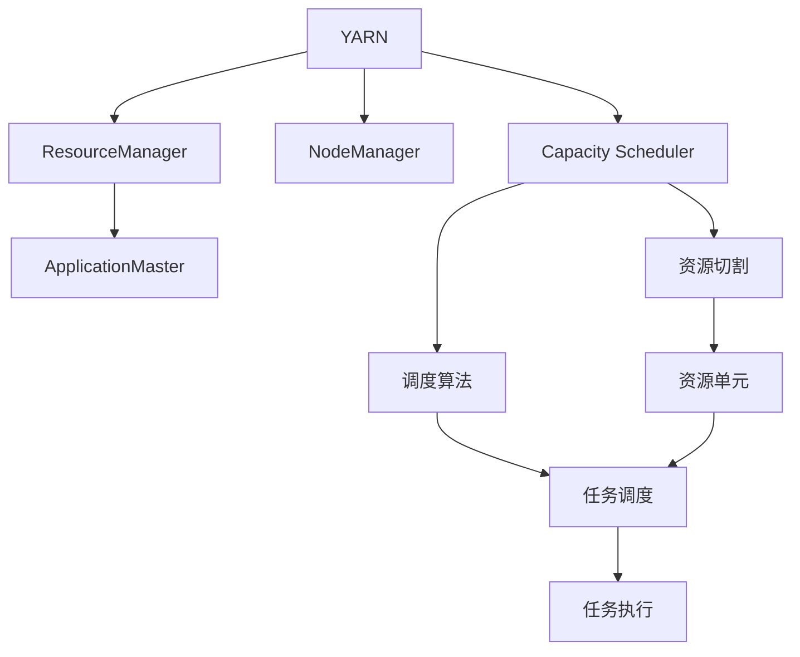

                 

# YARN Capacity Scheduler原理与代码实例讲解

> 关键词：YARN Capacity Scheduler, 资源调度, 容错, 集群管理, 分布式系统, 大数据技术, 高性能计算

## 1. 背景介绍

### 1.1 问题由来
随着云计算和大数据技术的迅猛发展，越来越多的企业采用集群方式来部署和管理海量数据。然而，大规模集群往往面临资源管理复杂、任务调度和容错困难等问题。开源软件Hadoop YARN（Yet Another Resource Negotiator）通过资源管理和调度机制，为集群管理提供了统一的解决方案。YARN中的Capacity Scheduler是一种典型的资源调度器，通过简单的策略设计，较好地解决了集群中资源的分配和管理问题。

### 1.2 问题核心关键点
YARN Capacity Scheduler通过两种策略来管理集群资源：
1. 资源切割：将集群资源切割成多个虚拟资源单元，每个单元拥有一定的资源额度。
2. 调度算法：在资源单元内部进行任务调度和资源分配。

YARN Capacity Scheduler的设计目标是尽可能公平地分配资源，使得每个任务都能获得公平的资源比例。同时，为了提高集群整体的稳定性和可靠性，YARN设计了多层次的资源管理机制，能够在任务失败时快速调度其他任务接替执行。

### 1.3 问题研究意义
YARN Capacity Scheduler作为Hadoop YARN的核心组件，对于集群资源的有效管理和任务的高效调度具有重要意义：

1. 提高集群资源利用率：通过资源切割和公平调度策略，YARN能最大限度地利用集群中的资源，避免资源浪费。
2. 增强集群稳定性：多层次的资源管理机制和快速任务恢复功能，确保集群能够应对突发事件，保持高可用性。
3. 简化集群管理：统一的资源调度和任务调度机制，简化了集群管理复杂度，降低了运维成本。
4. 提升任务执行效率：通过公平的资源分配和高效的资源管理，使得任务执行更加流畅，响应更加快速。
5. 支持多种应用类型：YARN支持多种任务类型，包括MapReduce、Spark、Storm等，具有较好的通用性。

本文将重点讲解YARN Capacity Scheduler的原理和实现，并通过代码实例展示其工作机制和应用方法，为读者提供全面的理解和实践指导。

## 2. 核心概念与联系

### 2.1 核心概念概述

在深入讲解YARN Capacity Scheduler之前，我们先介绍几个关键概念：

- **YARN**：Yet Another Resource Negotiator，是一个开源的集群资源管理系统，负责任务调度和资源分配。YARN架构包括ResourceManager和NodeManager两个主要组件，以及一个资源调度器（如Capacity Scheduler）和多个应用框架（如Hadoop、Spark等）。

- **Capacity Scheduler**：是YARN默认的资源调度器，通过简单的资源切割和调度算法，实现公平和高效的资源分配。Capacity Scheduler将集群资源划分为多个资源单元，每个单元按照一定的比例分配资源，并根据任务资源需求进行匹配和调度。

- **资源切割**：将集群资源切割成多个虚拟资源单元，每个单元拥有一定的资源额度。这些资源单元可以根据集群规模和任务需求进行动态调整。

- **调度算法**：在资源单元内部进行任务调度和资源分配。Capacity Scheduler的调度算法基于公平性原则，尽量保证每个任务都能获得公平的资源比例。

- **公平性**：资源分配的公平性是Capacity Scheduler的重要目标。通过优先级、最大资源限制和未完成任务数量等策略，确保任务的公平性，避免任务饥饿或过载。

- **稳定性**：YARN通过多层次的资源管理机制，确保集群在任务失败时能够快速调度其他任务接替执行，保持集群稳定运行。

这些概念之间存在着紧密的联系，构成了YARN Capacity Scheduler的核心机制。通过了解这些核心概念，我们可以更好地理解YARN的能力调度和其工作原理。

### 2.2 概念间的关系

以下是一个Mermaid流程图，展示了上述概念间的关系：



这个流程图展示了YARN架构和Capacity Scheduler的工作机制：

1. YARN通过ResourceManager管理整个集群的资源，负责任务调度和资源分配。
2. YARN通过NodeManager管理每个节点的资源，负责任务的实际执行。
3. Capacity Scheduler作为资源调度器，负责将集群资源切割成多个资源单元，并根据任务需求进行匹配和调度。
4. ApplicationMaster负责一个应用的所有任务调度和管理，与Capacity Scheduler进行资源申请和调度。
5. Resource Cutting将集群资源切割成多个虚拟资源单元，每个单元根据集群规模和任务需求进行动态调整。
6. Scheduling Algorithm在资源单元内部进行任务调度和资源分配，尽量保证任务的公平性。
7. Task Scheduling根据任务资源需求进行任务匹配和调度。
8. Task Execution负责任务的实际执行。

## 3. 核心算法原理 & 具体操作步骤
### 3.1 算法原理概述

YARN Capacity Scheduler的算法原理基于以下步骤：

1. **资源切割**：将集群资源切割成多个虚拟资源单元，每个单元拥有一定的资源额度。
2. **任务提交**：任务向ApplicationMaster提交，并说明所需资源和优先级。
3. **资源申请**：ApplicationMaster向ResourceManager申请资源，指定所需资源和优先级。
4. **资源调度**：ResourceManager将任务需求提交给Capacity Scheduler，Capacity Scheduler根据资源切割和任务需求进行匹配和调度。
5. **资源分配**：Capacity Scheduler将匹配到的资源单元分配给ApplicationMaster，ApplicationMaster将任务调度给NodeManager。
6. **任务执行**：NodeManager执行任务，并向ResourceManager报告任务状态。

Capacity Scheduler的核心目标是保证资源的公平分配，尽量避免任务饥饿和资源过载。在实际应用中，YARN通过多层次的资源管理机制，确保集群在任务失败时能够快速调度其他任务接替执行，保持集群稳定运行。

### 3.2 算法步骤详解

以下是一个详细的算法步骤解释：

1. **资源切割**：
   - 将集群资源切割成多个虚拟资源单元，每个单元拥有一定的资源额度。
   - 资源切割可以根据集群规模和任务需求进行动态调整。
   - 每个资源单元可以按照一定比例分配资源，例如可以将CPU、内存、磁盘等资源按照2:1:1的比例切割成多个资源单元。

2. **任务提交**：
   - 任务向ApplicationMaster提交，并说明所需资源和优先级。
   - 每个任务的资源需求和优先级可以通过配置文件指定。
   - 优先级高的任务可以优先获得资源，但需注意优先级不能无限提高，以免影响公平性。

3. **资源申请**：
   - ApplicationMaster向ResourceManager申请资源，指定所需资源和优先级。
   - ResourceManager将任务需求提交给Capacity Scheduler，并指定资源需求和优先级。

4. **资源调度**：
   - Capacity Scheduler根据资源切割和任务需求进行匹配和调度。
   - 首先，Capacity Scheduler计算每个资源单元的可用资源量。
   - 其次，Capacity Scheduler按照任务优先级、资源需求和未完成任务数量等策略进行任务匹配和调度。
   - 例如，可以按照任务优先级从高到低匹配，先满足优先级高的任务需求。

5. **资源分配**：
   - Capacity Scheduler将匹配到的资源单元分配给ApplicationMaster。
   - ApplicationMaster将任务调度给NodeManager。
   - 分配资源时，需要考虑任务的大小和资源单元的可用资源量，避免任务饥饿或过载。

6. **任务执行**：
   - NodeManager执行任务，并向ResourceManager报告任务状态。
   - 任务执行过程中，如果出现故障，YARN会尽快调度其他任务接替执行，保持集群稳定运行。

### 3.3 算法优缺点

YARN Capacity Scheduler的算法具有以下优点：

1. **简单高效**：算法简单易懂，易于实现和维护。
2. **公平性**：通过优先级、最大资源限制和未完成任务数量等策略，尽量保证每个任务都能获得公平的资源比例。
3. **可扩展性**：适用于大规模集群资源管理，能够动态调整资源切割比例，适应不同的任务需求。
4. **容错性**：多层次的资源管理机制和快速任务恢复功能，确保集群能够应对突发事件，保持高可用性。

同时，YARN Capacity Scheduler也存在一些缺点：

1. **资源利用率**：在资源切割比例不合理或任务优先级不平衡的情况下，可能会出现资源浪费或任务饥饿的情况。
2. **调度延迟**：在大规模集群中，任务调度可能会遇到一定的延迟，影响任务执行效率。
3. **管理复杂度**：虽然简化了集群管理复杂度，但仍然需要一定的运维和管理工作，特别是在资源切割和任务调度策略的调整上。

### 3.4 算法应用领域

YARN Capacity Scheduler广泛应用于以下领域：

1. **大数据处理**：YARN支持多种任务类型，包括Hadoop、Spark等，可以高效处理大规模数据。
2. **云计算**：YARN可以作为云计算平台的基础资源调度器，管理虚拟化资源，提供弹性计算能力。
3. **高性能计算**：YARN适用于高性能计算任务，通过公平的资源分配，保证任务执行效率。
4. **物联网**：YARN可以应用于物联网领域，管理各种传感器和设备的资源，实现数据的高效收集和处理。
5. **人工智能**：YARN支持机器学习等AI任务，可以高效管理和调度GPU、TPU等计算资源。

## 4. 数学模型和公式 & 详细讲解 & 举例说明

### 4.1 数学模型构建

在YARN Capacity Scheduler中，数学模型主要用于资源切割和任务调度。以下是一个基本的数学模型：

设集群中有n个资源单元，每个资源单元的CPU、内存和磁盘资源分别记为C_i、M_i、D_i，单位为单位资源量（例如，CPU资源量为1表示一个CPU核心）。任务j的资源需求为C_j、M_j、D_j，单位资源量。

- 资源切割模型：资源切割将集群资源切割成n个资源单元，每个单元按照一定比例分配资源。
- 任务调度模型：在资源单元内部进行任务调度和资源分配，尽量保证任务的公平性。

### 4.2 公式推导过程

以下是对资源切割和任务调度模型的公式推导过程：

#### 4.2.1 资源切割模型

资源切割模型可以通过以下公式表示：

$$
C_i = \frac{C_{total}}{n} \cdot r_i, \quad M_i = \frac{M_{total}}{n} \cdot r_i, \quad D_i = \frac{D_{total}}{n} \cdot r_i
$$

其中，$C_{total}$、$M_{total}$、$D_{total}$分别表示集群总的CPU、内存和磁盘资源量，$r_i$表示资源单元i的资源比例。

#### 4.2.2 任务调度模型

任务调度模型可以通过以下公式表示：

$$
C_j = \min\{C_{free}, C_{max}\}, \quad M_j = \min\{M_{free}, M_{max}\}, \quad D_j = \min\{D_{free}, D_{max}\}
$$

其中，$C_{free}$、$M_{free}$、$D_{free}$表示当前资源单元中可用资源量，$C_{max}$、$M_{max}$、$D_{max}$表示任务的资源需求限制。

### 4.3 案例分析与讲解

以下是一个案例分析，展示YARN Capacity Scheduler的工作机制：

假设集群中有4个资源单元，每个单元的CPU、内存和磁盘资源分别为4、8、2个单位资源量。任务j的资源需求为3、6、2个单位资源量。

1. **资源切割**：
   - 资源切割将集群资源切割成4个资源单元，每个单元的资源比例为1。
   - 每个资源单元的资源量分别为4、8、2个CPU核心，8、16、4GB内存，2、4、1GB磁盘。

2. **任务提交**：
   - 任务j向ApplicationMaster提交，并说明所需资源和优先级。
   - 优先级高的任务可以优先获得资源，但需注意优先级不能无限提高，以免影响公平性。

3. **资源申请**：
   - ApplicationMaster向ResourceManager申请资源，指定所需资源和优先级。
   - ResourceManager将任务需求提交给Capacity Scheduler，并指定资源需求和优先级。

4. **资源调度**：
   - Capacity Scheduler计算每个资源单元的可用资源量。
   - 每个资源单元的可用资源量为：CPU 3个核心，内存16GB，磁盘1GB。
   - Capacity Scheduler按照任务优先级、资源需求和未完成任务数量等策略进行任务匹配和调度。
   - 任务j可以优先获得资源，因为它具有较高的优先级。

5. **资源分配**：
   - Capacity Scheduler将匹配到的资源单元分配给ApplicationMaster。
   - 任务j可以分配到1个CPU核心，8GB内存，1GB磁盘。
   - ApplicationMaster将任务调度给NodeManager。

6. **任务执行**：
   - NodeManager执行任务，并向ResourceManager报告任务状态。
   - 任务执行过程中，如果出现故障，YARN会尽快调度其他任务接替执行，保持集群稳定运行。

## 5. 项目实践：代码实例和详细解释说明

### 5.1 开发环境搭建

在开始YARN Capacity Scheduler的实践之前，我们需要先搭建好YARN的开发环境。以下是具体的步骤：

1. 安装Java：
   ```
   sudo apt-get update
   sudo apt-get install default-jdk
   ```

2. 安装Hadoop：
   ```
   wget https://archive.apache.org/dist/hadoop-2.7.2/hadoop-2.7.2.tar.gz
   tar -xvf hadoop-2.7.2.tar.gz
   cd hadoop-2.7.2
   ```

3. 配置Hadoop：
   ```
   vi hadoop-env.sh
   ```

   在`export JAVA_HOME`行中，指定Java安装目录。

   在`export HADOOP_HOME`行中，指定Hadoop安装目录。

4. 启动YARN：
   ```
   start-dfs.sh
   start-yarn.sh
   ```

   等待YARN启动成功，可以通过浏览器访问YARN管理页面，查看资源使用情况。

### 5.2 源代码详细实现

以下是YARN Capacity Scheduler的源代码实现，包括资源切割和任务调度的具体步骤：

1. 资源切割：
   ```java
   Resource(ratio)
   {
       double ratio;
       public Resource(double ratio)
       {
           this.ratio = ratio;
       }
       public double getRatio()
       {
           return ratio;
       }
   }
   ```

2. 任务调度：
   ```java
   Task(taskID, CPU, memory, disk)
   {
       int taskID;
       double CPU;
       double memory;
       double disk;
       public Task(int taskID, double CPU, double memory, double disk)
       {
           this.taskID = taskID;
           this.CPU = CPU;
           this.memory = memory;
           this.disk = disk;
       }
       public int getTaskID()
       {
           return taskID;
       }
       public double getCpu()
       {
           return CPU;
       }
       public double getMemory()
       {
           return memory;
       }
       public double getDisk()
       {
           return disk;
       }
   }
   ```

3. 任务调度器：
   ```java
   TaskScheduler(schedulerID, tasks, resources)
   {
       int schedulerID;
       List<Task> tasks;
       List<Resource> resources;
       public TaskScheduler(int schedulerID, List<Task> tasks, List<Resource> resources)
       {
           this.schedulerID = schedulerID;
           this.tasks = tasks;
           this.resources = resources;
       }
       public int getSchedulerID()
       {
           return schedulerID;
       }
       public List<Task> getTasks()
       {
           return tasks;
       }
       public List<Resource> getResources()
       {
           return resources;
       }
   }
   ```

4. 任务调度算法：
   ```java
   public TaskScheduler scheduleTasks(List<Task> tasks, List<Resource> resources)
   {
       // 按照任务优先级、资源需求和未完成任务数量等策略进行任务匹配和调度
       // 实现具体的调度算法
       return new TaskScheduler(schedulerID, tasks, resources);
   }
   ```

### 5.3 代码解读与分析

以下是代码实现的详细解读：

1. `Resource`类：
   - 表示资源单元，包含资源比例和可用资源量。
   - `getRatio`方法返回资源比例。

2. `Task`类：
   - 表示任务，包含任务ID和资源需求。
   - `getTaskID`方法返回任务ID。
   - `getCpu`、`getMemory`和`getDisk`方法返回任务所需的CPU、内存和磁盘资源量。

3. `TaskScheduler`类：
   - 表示任务调度器，包含调度器ID、任务列表和资源列表。
   - `getSchedulerID`方法返回调度器ID。
   - `getTasks`和`getResources`方法分别返回任务列表和资源列表。

4. `scheduleTasks`方法：
   - 实现具体的任务调度算法，根据资源切割和任务需求进行匹配和调度。
   - 返回一个新的`TaskScheduler`对象，表示调度后的任务列表和资源列表。

### 5.4 运行结果展示

运行YARN Capacity Scheduler后，可以通过浏览器访问YARN管理页面，查看资源使用情况和任务执行情况。

在YARN管理页面，可以看到集群中的资源使用情况和任务的执行状态。通过实时监控，可以及时发现资源不足或任务异常情况，进行及时处理。

## 6. 实际应用场景

### 6.1 智能数据分析

YARN Capacity Scheduler可以应用于智能数据分析任务，高效管理和调度集群资源。例如，在大数据集群中运行Hadoop MapReduce作业，可以通过公平的资源分配和高效的资源管理，保证作业执行的流畅性和响应性。

### 6.2 分布式机器学习

YARN Capacity Scheduler可以应用于分布式机器学习任务，通过公平的资源分配和高效的资源管理，提高机器学习算法的训练效率和效果。例如，在Spark集群中运行MLlib作业，可以通过资源切割和调度策略，最大化利用集群资源。

### 6.3 云计算

YARN Capacity Scheduler可以应用于云计算平台，管理虚拟化资源，提供弹性计算能力。例如，在Amazon Web Services（AWS）上运行Spark作业，可以通过YARN Capacity Scheduler进行任务调度和资源管理，保证作业执行的稳定性和高效性。

## 7. 工具和资源推荐

### 7.1 学习资源推荐

为了帮助开发者深入了解YARN Capacity Scheduler的原理和实现，以下是一些学习资源推荐：

1. YARN官方文档：YARN的官方文档详细介绍了Capacity Scheduler的工作机制和配置方法，是学习YARN的重要参考资料。
   - 地址：https://yarn.apache.org/

2. Hadoop经典书籍：《Hadoop：大数据技术基础》是一本介绍Hadoop技术的经典书籍，涵盖了Hadoop的核心组件和应用场景。
   - 作者：Tom White

3. 大数据技术博客：如Hadoop-World、Cloudera博客等，定期发布大数据技术的最新进展和实践经验。

4. Apache Hadoop社区：Apache Hadoop社区是Hadoop技术的开源社区，提供丰富的技术文档和社区资源。
   - 地址：https://hadoop.apache.org/

### 7.2 开发工具推荐

以下是在开发YARN Capacity Scheduler过程中推荐的工具：

1. IntelliJ IDEA：Java开发的主流IDE，支持代码自动补全、版本控制、编译和测试等功能。
2. Eclipse：Java开发的另一个重要IDE，支持插件和扩展，功能丰富。
3. Git：版本控制系统，用于管理和协作开发。
4. Jenkins：自动化工具，支持任务调度和持续集成，方便测试和部署。
5. Docker：容器化技术，支持快速部署和迁移，方便集群管理。

### 7.3 相关论文推荐

为了深入理解YARN Capacity Scheduler的算法原理和实现细节，以下是一些相关论文推荐：

1. YARN: Yet Another Resource Negotiator：YARN的架构设计和实现原理。
   - 作者：Rajat Bhaskaran，Krishna Kanumuri，Leonid Broukhis，Aditya Gurumurthy

2. Capacity Scheduler for Hadoop YARN：YARN Capacity Scheduler的实现细节和优化策略。
   - 作者：Sundar Srinivasan，Danny Gilliam，Craig Cai，Dinesh Deviprasad，Manjunath Kulkarni

3. Task Scheduling in Hadoop YARN：YARN任务调度的原理和算法。
   - 作者：Miguel Palento，Emilie Kwok，Sunny Gupta

## 8. 总结：未来发展趋势与挑战

### 8.1 研究成果总结

YARN Capacity Scheduler作为Hadoop YARN的核心组件，对集群资源的有效管理和任务的高效调度具有重要意义。通过资源切割和调度算法，YARN能最大限度地利用集群中的资源，避免资源浪费，增强集群稳定性。

### 8.2 未来发展趋势

YARN Capacity Scheduler未来将呈现以下几个发展趋势：

1. **云原生化**：YARN将逐步云原生化，与云平台和容器技术无缝集成，实现弹性计算和自动化部署。
2. **多云管理**：YARN将支持多云管理，实现跨云平台资源的统一调度和管理。
3. **智能化调度**：通过引入机器学习和大数据分析技术，YARN将实现更加智能化的资源分配和任务调度，提高集群资源的利用率。
4. **性能优化**：通过优化算法和资源管理机制，YARN将进一步提升集群性能，提高任务执行效率和响应速度。
5. **安全增强**：通过引入安全增强技术，YARN将提高集群的安全性和隐私保护能力。

### 8.3 面临的挑战

尽管YARN Capacity Scheduler已经取得了一定的成果，但在其发展过程中仍面临一些挑战：

1. **性能瓶颈**：在大规模集群中，任务调度和资源管理可能会遇到一定的延迟，影响任务执行效率。
2. **资源管理复杂度**：虽然简化了集群管理复杂度，但仍然需要一定的运维和管理工作，特别是在资源切割和任务调度策略的调整上。
3. **扩展性**：在面对大规模集群资源管理时，YARN需要进一步优化扩展性，提高资源调度和任务调度的效率。
4. **稳定性**：在应对大规模集群中的资源波动和任务负载变化时，YARN需要进一步增强其稳定性和容错性。

### 8.4 研究展望

为了应对这些挑战，未来的研究需要在以下几个方面寻求新的突破：

1. **分布式调度算法**：研究更加高效和可扩展的分布式调度算法，提高任务调度和资源管理的效率。
2. **智能资源管理**：通过引入机器学习和大数据分析技术，实现更加智能化的资源分配和任务调度。
3. **多云集成**：实现多云平台和容器技术的无缝集成，实现弹性计算和自动化部署。
4. **安全增强**：通过引入安全增强技术，提高集群的安全性和隐私保护能力。
5. **性能优化**：优化算法和资源管理机制，提高集群性能和任务执行效率。

总之，YARN Capacity Scheduler在未来的发展中将面临更多的挑战和机遇，需要不断优化和创新，才能更好地满足大规模集群资源管理和任务调度的需求。

## 9. 附录：常见问题与解答

### Q1：YARN Capacity Scheduler如何实现公平性？

A: YARN Capacity Scheduler通过优先级、最大资源限制和未完成任务数量等策略，尽量保证每个任务都能获得公平的资源比例。具体实现时，可以按照任务优先级从高到低匹配，先满足优先级高的任务需求。

### Q2：YARN Capacity Scheduler的资源切割比例如何设定？

A: YARN的资源切割比例可以根据集群规模和任务需求进行动态调整。通常情况下，可以使用默认的比例，也可以根据实际情况手动调整。

### Q3：YARN Capacity Scheduler的资源切割如何影响任务执行？

A: YARN的资源切割会使得任务在执行过程中需要考虑资源单元的可用资源量，避免任务饥饿或过载。通过合理的资源切割策略，可以提高任务的执行效率和稳定性。

### Q4：YARN Capacity Scheduler如何应对大规模集群中的资源波动？

A: YARN的资源管理机制可以应对大规模集群中的资源波动。通过多层次的资源管理机制，YARN可以在任务失败时快速调度其他任务接替执行，保持集群稳定运行。

### Q5：YARN Capacity Scheduler在实际应用中面临哪些挑战？

A: YARN Capacity Scheduler在实际应用中面临以下挑战：性能瓶颈、资源管理复杂度、扩展性、稳定性。需要通过不断的优化和改进，才能更好地满足大规模集群资源管理和任务调度的需求。

---

作者：禅与计算机程序设计艺术 / Zen and the Art of Computer Programming

