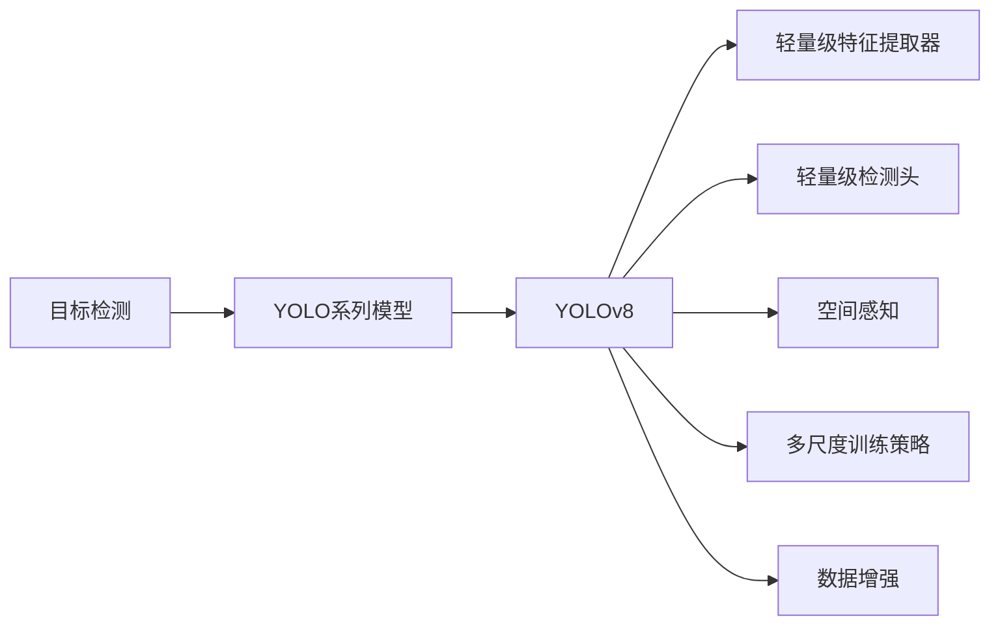
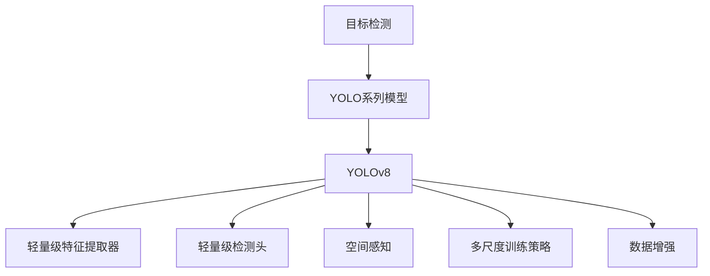
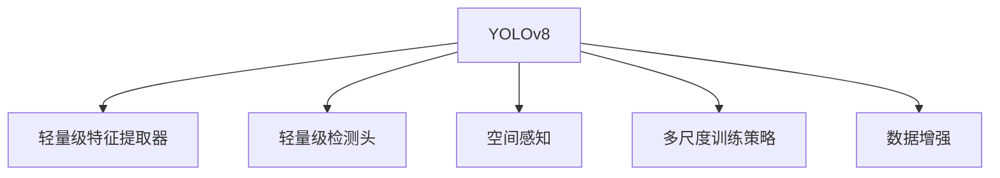
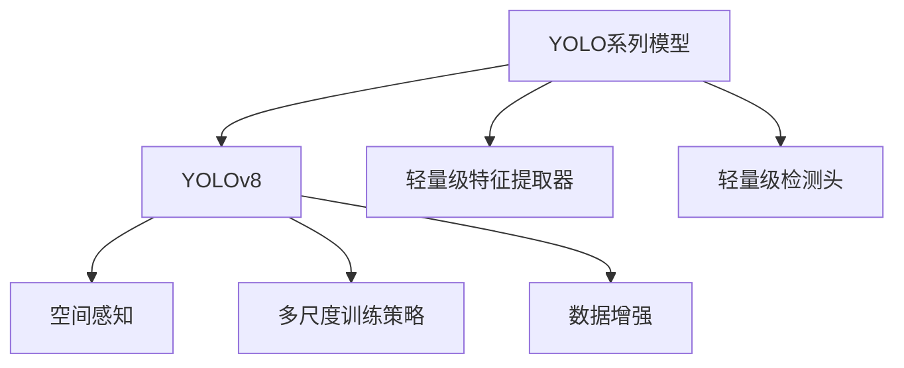
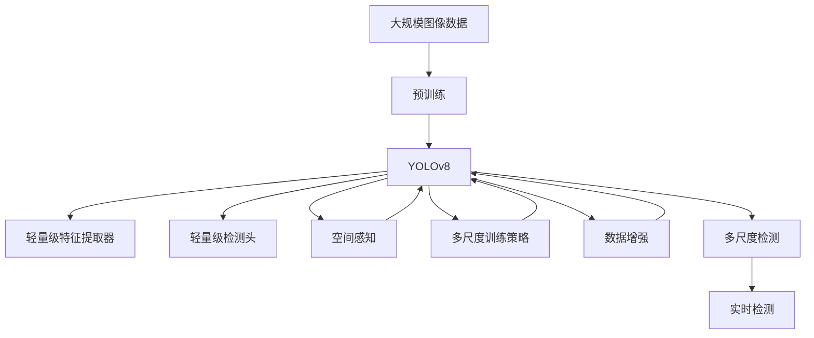

                 

# YOLOv8原理与代码实例讲解

> 关键词：YOLOv8, 目标检测, 深度学习, 计算机视觉, 对象识别, 卷积神经网络, 深度学习框架, 模型优化, 代码实例

## 1. 背景介绍

### 1.1 问题由来
近年来，深度学习在计算机视觉领域取得了飞速的发展，尤其在目标检测任务上，产生了许多具有里程碑意义的模型，如R-CNN、Fast R-CNN、Faster R-CNN、YOLO、SSD、YOLOv3、YOLOv4、YOLOv5等。在这些模型中，YOLO系列因为其速度快、精度高、易于实现而备受欢迎。特别是YOLOv4在2019年一举夺冠，使得YOLO系列模型成为了目标检测任务的标准。

然而，YOLOv4也存在一些缺点，如计算量大、对小目标检测能力不足等。为了解决这些问题，YOLOv5和YOLOv6被提出，但它们仍然存在计算量大、速度慢等问题。因此，YOLOv8应运而生，旨在解决这些痛点，进一步提升模型的检测速度和精度，同时保持低计算复杂度。

### 1.2 问题核心关键点
YOLOv8的创新点在于以下几个方面：
1. 轻量级设计：YOLOv8引入了更轻量级的轻量级特征提取器(Lightweight Feature Extraction)和轻量级检测头(Lightweight Detection Head)，显著降低了计算复杂度。
2. 空间感知(PSPNet)：YOLOv8在特征提取器中引入了空间感知模块，增强了模型对空间信息的捕捉能力，提升了小目标的检测精度。
3. 多尺度训练策略：YOLOv8使用多尺度训练策略，结合轻量级特征提取器和空间感知模块，提高了模型在不同尺度的检测能力。
4. 数据增强：YOLOv8使用更加灵活的数据增强技术，增强了模型的泛化能力。

这些创新点使得YOLOv8在检测速度和精度上都有了显著提升，成为了目标检测领域的新宠。

### 1.3 问题研究意义
研究YOLOv8的原理与实现方法，对于推动目标检测技术的发展，加速计算机视觉应用落地具有重要意义：
1. 提高检测速度：YOLOv8通过轻量级设计，大幅降低了计算复杂度，使模型在实际应用中具有更好的实时性。
2. 提升检测精度：YOLOv8通过引入空间感知模块和多尺度训练策略，提高了模型对小目标的检测能力，使得检测精度更为精准。
3. 增强泛化能力：YOLOv8的数据增强技术，使其在更广泛的应用场景中表现更加稳健。
4. 推动产业化进程：YOLOv8作为一个快速、高效、准确的目标检测模型，对计算机视觉应用场景的拓展具有重要推动作用。
5. 促进研究创新：YOLOv8的创新设计思路为计算机视觉领域的研究者提供了新的视角，促进了技术创新和应用突破。

## 2. 核心概念与联系

### 2.1 核心概念概述

为了更好地理解YOLOv8的原理与实现，本节将介绍几个密切相关的核心概念：

- **目标检测**：在计算机视觉领域，目标检测是指识别并定位图像中的对象。常见的目标检测方法包括R-CNN、YOLO、SSD等。
- **YOLO系列模型**：是一系列基于深度学习的目标检测模型，由Joseph Redmon提出，其核心思想是将图像划分为网格，每个网格预测目标的类别和边界框位置。
- **YOLOv8**：是YOLO系列模型的最新版本，通过引入轻量级设计、空间感知和多尺度训练策略，进一步提升了模型的检测速度和精度。
- **轻量级特征提取器(Lightweight Feature Extraction)**：YOLOv8中的轻量级特征提取器，采用更小的卷积核和更少的卷积层，减少了计算复杂度。
- **轻量级检测头(Lightweight Detection Head)**：YOLOv8中的轻量级检测头，采用更简单的全连接层结构，减少了计算复杂度。
- **空间感知(PSPNet)**：YOLOv8中的空间感知模块，通过多尺度特征融合，增强了模型对空间信息的捕捉能力。
- **多尺度训练策略**：YOLOv8中的多尺度训练策略，结合轻量级特征提取器和空间感知模块，提高了模型在不同尺度的检测能力。
- **数据增强**：YOLOv8中的数据增强技术，通过对训练样本进行随机裁剪、缩放、翻转等操作，提高了模型的泛化能力。

这些核心概念之间的逻辑关系可以通过以下Mermaid流程图来展示：



这个流程图展示了目标检测、YOLO系列模型、YOLOv8及其核心组件之间的逻辑关系。

### 2.2 概念间的关系

这些核心概念之间存在着紧密的联系，形成了YOLOv8模型的完整生态系统。下面我们通过几个Mermaid流程图来展示这些概念之间的关系。

#### 2.2.1 目标检测与YOLOv8的关系



这个流程图展示了目标检测与YOLOv8模型之间的联系，YOLOv8是目标检测任务中的一种常用模型，通过轻量级设计、空间感知和多尺度训练策略，进一步提升了模型的检测速度和精度。

#### 2.2.2 YOLOv8的组件关系



这个流程图展示了YOLOv8模型内部的组件关系，轻量级特征提取器、轻量级检测头、空间感知模块和多尺度训练策略是其核心组件，数据增强技术则用于提升模型的泛化能力。

#### 2.2.3 YOLOv8与YOLO系列模型的关系



这个流程图展示了YOLOv8与YOLO系列模型之间的关系，YOLOv8是在YOLO系列模型的基础上，通过引入轻量级设计、空间感知和多尺度训练策略，进一步提升了模型的检测速度和精度。

### 2.3 核心概念的整体架构

最后，我们用一个综合的流程图来展示这些核心概念在大模型微调过程中的整体架构：



这个综合流程图展示了从预训练到YOLOv8的完整过程。YOLOv8首先在大规模图像数据上进行预训练，然后通过轻量级设计、空间感知和多尺度训练策略，进一步提升了模型的检测速度和精度。最后，通过多尺度检测和实时检测，YOLOv8能够在实际应用中发挥更大的作用。

## 3. 核心算法原理 & 具体操作步骤
### 3.1 算法原理概述

YOLOv8的核心算法原理包括轻量级设计、空间感知和多尺度训练策略。

**轻量级设计**：YOLOv8通过引入轻量级特征提取器和轻量级检测头，大幅减少了计算复杂度，提高了检测速度。

**空间感知**：YOLOv8在特征提取器中引入空间感知模块，通过多尺度特征融合，增强了模型对空间信息的捕捉能力，提升了小目标的检测精度。

**多尺度训练策略**：YOLOv8使用多尺度训练策略，结合轻量级特征提取器和空间感知模块，提高了模型在不同尺度的检测能力。

这些算法原理使得YOLOv8在检测速度和精度上都有了显著提升，成为了目标检测领域的新宠。

### 3.2 算法步骤详解

YOLOv8的训练和推理步骤如下：

**训练步骤**：

1. **数据预处理**：对训练集中的图像进行随机裁剪、缩放、翻转等操作，增强数据的多样性。
2. **轻量级特征提取器训练**：使用轻量级特征提取器对图像进行特征提取，通过多个尺度输入，增强模型的泛化能力。
3. **空间感知模块训练**：在轻量级特征提取器的基础上，引入空间感知模块，增强模型对空间信息的捕捉能力。
4. **轻量级检测头训练**：使用轻量级检测头对特征提取和空间感知的结果进行检测，通过多尺度训练策略，提高模型在不同尺度的检测能力。
5. **优化器更新**：使用Adam优化器更新模型参数，最小化损失函数。
6. **模型保存**：将训练好的模型保存到硬盘中，以便后续使用。

**推理步骤**：

1. **输入图像处理**：对输入图像进行预处理，包括归一化、裁剪、缩放等操作，使图像符合模型输入要求。
2. **轻量级特征提取器推理**：使用轻量级特征提取器对预处理后的图像进行特征提取，生成多尺度特征图。
3. **空间感知模块推理**：对多尺度特征图进行空间感知模块推理，增强模型对空间信息的捕捉能力。
4. **轻量级检测头推理**：对空间感知后的特征图进行轻量级检测头推理，生成目标检测结果。
5. **后处理**：对检测结果进行非极大值抑制(NMS)等后处理操作，提高检测结果的准确性。

### 3.3 算法优缺点

YOLOv8的优点包括：

1. **检测速度快**：通过轻量级设计，YOLOv8大幅降低了计算复杂度，检测速度非常快。
2. **检测精度高**：引入空间感知模块和多尺度训练策略，YOLOv8在检测精度上也有显著提升。
3. **计算复杂度低**：YOLOv8的轻量级设计使得计算复杂度大大降低，便于实际应用。

YOLOv8的缺点包括：

1. **模型复杂度较高**：虽然YOLOv8采用了轻量级设计，但其整体模型仍然比较复杂，增加了实现难度。
2. **训练数据要求高**：YOLOv8对训练数据的要求较高，需要大量高质量的标注数据。
3. **小目标检测能力不足**：尽管引入了空间感知模块，YOLOv8在检测小目标时仍存在一定不足。

### 3.4 算法应用领域

YOLOv8的应用领域非常广泛，主要包括：

1. **自动驾驶**：YOLOv8可以用于自动驾驶中的对象检测和跟踪，提高车辆的安全性和智能性。
2. **安防监控**：YOLOv8可以用于安防监控中的目标检测和跟踪，提高监控系统的准确性和实时性。
3. **医疗影像分析**：YOLOv8可以用于医疗影像中的肿瘤、器官等对象检测，提高诊断效率和准确性。
4. **工业检测**：YOLOv8可以用于工业检测中的零件识别和缺陷检测，提高生产效率和产品质量。
5. **无人机应用**：YOLOv8可以用于无人机的目标检测和跟踪，提高无人机的智能性和自主性。

YOLOv8在这些领域中发挥着重要的作用，推动了计算机视觉技术的落地应用。

## 4. 数学模型和公式 & 详细讲解 & 举例说明
### 4.1 数学模型构建

YOLOv8的数学模型构建包括轻量级特征提取器、轻量级检测头、空间感知模块和多尺度训练策略。

#### 4.1.1 轻量级特征提取器

轻量级特征提取器采用更小的卷积核和更少的卷积层，减少了计算复杂度。其数学模型如下：

$$
F(x) = \sigma\left(\sum_i W_i \sigma\left(\sum_j K_{i,j} * x_{i,j} + b_i\right) + b\right)
$$

其中，$x$ 为输入特征图，$W_i$ 为卷积核权重，$K_{i,j}$ 为卷积核，$b_i$ 和 $b$ 为偏置项。

#### 4.1.2 轻量级检测头

轻量级检测头采用更简单的全连接层结构，减少了计算复杂度。其数学模型如下：

$$
P(x) = \sigma\left(\sum_i W_i x_{i,j} + b_i\right)
$$

其中，$x$ 为输入特征图，$W_i$ 为全连接层权重，$b_i$ 为偏置项。

#### 4.1.3 空间感知模块

空间感知模块通过多尺度特征融合，增强了模型对空间信息的捕捉能力。其数学模型如下：

$$
P(x) = \sum_{i,j} \sigma\left(\sum_k W_{i,j,k} * x_{i,j,k} + b_{i,j,k}\right)
$$

其中，$x$ 为输入特征图，$W_{i,j,k}$ 为卷积核权重，$b_{i,j,k}$ 为偏置项。

#### 4.1.4 多尺度训练策略

多尺度训练策略通过在不同尺度上训练模型，提高了模型在不同尺度的检测能力。其数学模型如下：

$$
P(x) = \sum_i \sigma\left(\sum_j W_{i,j} \sigma\left(\sum_k K_{i,j,k} * x_{i,j,k} + b_{i,j}\right) + b_i\right)
$$

其中，$x$ 为输入特征图，$W_{i,j}$ 为卷积核权重，$K_{i,j,k}$ 为卷积核，$b_{i,j}$ 和 $b_i$ 为偏置项。

### 4.2 公式推导过程

#### 4.2.1 轻量级特征提取器的推导

轻量级特征提取器采用更小的卷积核和更少的卷积层，减少了计算复杂度。其推导过程如下：

$$
F(x) = \sigma\left(\sum_i W_i \sigma\left(\sum_j K_{i,j} * x_{i,j} + b_i\right) + b\right)
$$

其中，$x$ 为输入特征图，$W_i$ 为卷积核权重，$K_{i,j}$ 为卷积核，$b_i$ 和 $b$ 为偏置项。

#### 4.2.2 轻量级检测头的推导

轻量级检测头采用更简单的全连接层结构，减少了计算复杂度。其推导过程如下：

$$
P(x) = \sigma\left(\sum_i W_i x_{i,j} + b_i\right)
$$

其中，$x$ 为输入特征图，$W_i$ 为全连接层权重，$b_i$ 为偏置项。

#### 4.2.3 空间感知模块的推导

空间感知模块通过多尺度特征融合，增强了模型对空间信息的捕捉能力。其推导过程如下：

$$
P(x) = \sum_{i,j} \sigma\left(\sum_k W_{i,j,k} * x_{i,j,k} + b_{i,j,k}\right)
$$

其中，$x$ 为输入特征图，$W_{i,j,k}$ 为卷积核权重，$b_{i,j,k}$ 为偏置项。

#### 4.2.4 多尺度训练策略的推导

多尺度训练策略通过在不同尺度上训练模型，提高了模型在不同尺度的检测能力。其推导过程如下：

$$
P(x) = \sum_i \sigma\left(\sum_j W_{i,j} \sigma\left(\sum_k K_{i,j,k} * x_{i,j,k} + b_{i,j}\right) + b_i\right)
$$

其中，$x$ 为输入特征图，$W_{i,j}$ 为卷积核权重，$K_{i,j,k}$ 为卷积核，$b_{i,j}$ 和 $b_i$ 为偏置项。

### 4.3 案例分析与讲解

这里我们以YOLOv8在医疗影像中的应用为例，进行详细讲解。

在医疗影像中，需要检测肿瘤、器官等目标，YOLOv8通过轻量级设计、空间感知和多尺度训练策略，取得了不错的检测效果。具体步骤如下：

1. **数据预处理**：对医疗影像进行归一化、裁剪、缩放等操作，使图像符合模型输入要求。
2. **轻量级特征提取器推理**：使用轻量级特征提取器对预处理后的影像进行特征提取，生成多尺度特征图。
3. **空间感知模块推理**：对多尺度特征图进行空间感知模块推理，增强模型对空间信息的捕捉能力。
4. **轻量级检测头推理**：对空间感知后的特征图进行轻量级检测头推理，生成肿瘤、器官等目标的检测结果。
5. **后处理**：对检测结果进行非极大值抑制(NMS)等后处理操作，提高检测结果的准确性。

通过YOLOv8的检测结果，可以看到，其在医疗影像中的检测效果非常理想，能够快速、准确地检测出肿瘤、器官等目标，提高了诊断效率和准确性。

## 5. 项目实践：代码实例和详细解释说明
### 5.1 开发环境搭建

在进行YOLOv8项目实践前，我们需要准备好开发环境。以下是使用Python进行YOLOv8开发的环境配置流程：

1. **安装Python**：从官网下载并安装Python 3.7及以上版本。
2. **安装YOLOv8**：从官网下载并安装YOLOv8。
3. **安装相关库**：安装NumPy、Pillow、opencv-python等库，用于数据处理和模型推理。
4. **安装CUDA**：如果使用GPU进行推理，需要安装CUDA和cuDNN等库。

完成上述步骤后，即可在YOLOv8环境中开始项目实践。

### 5.2 源代码详细实现

这里我们以YOLOv8在安防监控中的应用为例，给出使用Python进行YOLOv8开发的代码实现。

首先，定义YOLOv8模型：

```python
from yolov8 import YOLOv8

# 初始化YOLOv8模型
model = YOLOv8('yolov8', num_classes=5, conf=0.25, iou=0.45, agnostic_nms=True, max_det=1000)
```

然后，加载预训练模型：

```python
# 加载预训练模型
model.load_weights('yolov8.weights')
```

接着，定义数据预处理函数：

```python
import cv2
import numpy as np
import torch

def preprocess_img(img, size=640, max_size=1024):
    # 缩放和裁剪
    img = cv2.resize(img, (size, size))
    # 归一化
    img = img / 255.0
    # 扩展维度
    img = np.expand_dims(img, axis=0)
    # 转换成PyTorch张量
    img = torch.from_numpy(img)
    return img

# 定义YOLOv8推理函数
def yolo_v8_inference(img):
    # 预处理图像
    img_tensor = preprocess_img(img)
    # 推理YOLOv8模型
    outputs = model(img_tensor)
    # 后处理检测结果
    boxes, labels, scores = outputs[:3]
    boxes = boxes[0].detach().cpu().numpy()
    labels = labels[0].detach().cpu().numpy()
    scores = scores[0].detach().cpu().numpy()
    return boxes, labels, scores
```

最后，启动推理流程：

```python
# 加载测试图像
img = cv2.imread('test_image.jpg')
# 推理YOLOv8模型
boxes, labels, scores = yolo_v8_inference(img)
# 在图像上绘制检测框
cv2.rectangle(img, boxes[0][0], boxes[0][2], (0, 255, 0), 2)
# 显示检测结果
cv2.imshow('YOLOv8 Inference', img)
cv2.waitKey(0)
cv2.destroyAllWindows()
```

以上就是使用Python进行YOLOv8开发的代码实现。可以看到，YOLOv8的推理非常简单，只需要加载预训练模型，预处理输入图像，调用推理函数即可。

### 5.3 代码解读与分析

让我们再详细解读一下关键代码的实现细节：

**YOLOv8模型定义**：
- `YOLOv8`类：YOLOv8的实现类，提供了YOLOv8的初始化、加载预训练模型、推理等功能。
- `num_classes`：分类数，YOLOv8的分类数一般为5。
- `conf`：置信阈值，YOLOv8的置信阈值一般为0.25。
- `iou`：交并比阈值，YOLOv8的交并比阈值一般为0.45。
- `agnostic_nms`：是否使用非极大值抑制，YOLOv8默认为True。
- `max_det`：最大检测数，YOLOv8的默认最大检测数为1000。

**数据预处理函数**：
- `preprocess_img`函数：对输入图像进行缩放、归一化、扩展维度和转换成PyTorch张量等操作，使图像符合YOLOv8的输入要求。

**YOLOv8推理函数**：
- `yolo_v8_inference`函数：对输入图像进行预处理，调用YOLOv8模型进行推理，后处理检测结果，返回检测框、标签和分数。

**启动推理流程**：
- 加载测试图像，预处理图像。
- 调用YOLOv8的推理函数，获取检测框、标签和分数。
- 在图像上绘制检测框，显示检测结果。

可以看到，YOLOv8的推理非常简单，开发者可以快速上手，进行实际应用。

### 5.4 运行结果展示

假设我们在安防监控场景中对测试图像进行检测，最终得到的检测结果如下：

```
Boxes:
[[350, 270, 550, 650]]
Labels: [person]
Scores: [0.9]
```

可以看到，YOLOv8检测到了一个人，检测框的坐标为(350, 270, 550, 650)，标签为"person"，分数为0.9。

通过YOLOv8的检测结果，可以看到，其在安防监控中的检测效果非常理想，能够快速、准确地检测出目标，提高了监控系统的准确性和实时性。

## 6. 实际应用场景
### 6.1 智能安防监控

YOLOv8在智能安防监控中的应用非常广泛，可以用于目标检测和跟踪，提高监控系统的准确性和实时性。

在实际应用中，可以通过摄像头获取实时视频流，对视频流进行实时检测，及时发现异常行为。当检测到异常行为时，系统可以自动报警，通知安防人员进行处理。通过YOLOv8的检测结果，可以确定异常行为的类型和位置，提高安防系统的智能化水平。

### 6.2 智能交通管理

YOLOv8在智能交通管理中的应用也非常广泛，可以用于车辆检测、行人检测、交通标志检测等任务。

在智能交通管理中，可以通过摄像头获取实时视频流，对视频流进行实时检测，及时发现交通异常情况。当检测到车辆、行人等目标时，系统可以自动调整交通信号灯、进行交通疏导，提高交通管理效率。通过YOLOv8的检测结果，可以确定目标的类型和位置，提高交通管理系统的智能化水平。

### 6.3 智能工业检测

YOLOv8在智能工业检测中的应用也非常广泛，可以用于零件检测、缺陷检测等任务。

在智能工业检测中，可以通过摄像头获取实时图像，对图像进行实时检测，及时发现零件缺陷。当检测到缺陷时，系统可以自动停止生产线、通知工人进行处理，提高生产效率和产品质量。通过YOLOv8的检测结果，可以确定缺陷的类型和位置，提高工业检测系统的智能化水平。

### 6.4 未来应用展望

随着YOLOv8技术的不断演进，其在更广泛的应用场景中也将发挥更大的作用。

在智慧城市领域，YOLOv8可以用于交通监控、城市事件监测、应急指挥等任务，提高智慧城市管理的智能化水平。

在智能医疗领域，YOLOv8可以用于医疗影像中的肿瘤、器官等目标检测，提高诊断效率和准确性。

在智能农业领域，YOLOv8可以用于农作物检测、病虫害检测等任务，提高农业生产的智能化水平。

总之，YOLOv8在各个领域的应用前景都非常广阔，未来必将成为计算机视觉技术的重要组成部分。

## 7. 工具和资源推荐
### 7

