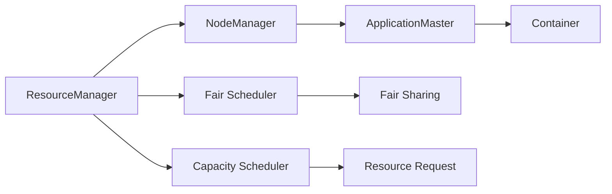
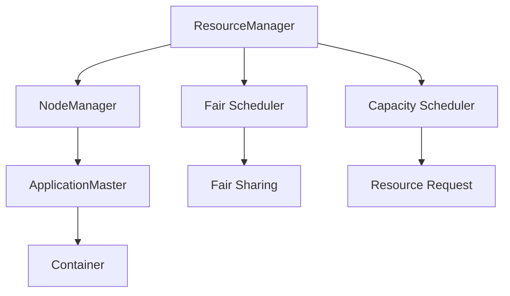

                 

# Yarn资源管理和任务调度原理与代码实例讲解

> 关键词：Yarn, Hadoop, 资源管理, 任务调度, 资源利用率, 容错机制, 容器编排, 监控, 代码实例

## 1. 背景介绍

### 1.1 问题由来
在当今大数据时代，随着数据量的爆炸式增长，分布式计算变得越来越重要。传统的Hadoop YARN（Yet Another Resource Negotiator）资源管理系统因其强大的集群资源管理和调度能力，成为了大数据平台的首选解决方案。YARN作为一种通用的资源管理系统，可以为各种类型的应用程序提供服务，包括MapReduce、Spark、Hive、Pig等。

### 1.2 问题核心关键点
YARN的设计目标是实现资源的高效利用和任务的灵活调度，其主要特点包括：
- 资源管理：集中管理计算和存储资源，确保资源的合理分配和利用。
- 任务调度：基于需求动态地分配计算资源，提升任务处理的效率和并行度。
- 应用隔离：通过容错机制和资源隔离，确保不同任务之间的相互独立，提高系统稳定性。
- 扩展性：支持大规模集群部署，可自动扩展和缩容资源。

### 1.3 问题研究意义
YARN作为Hadoop生态系统的核心组件之一，在分布式计算领域发挥着重要作用。研究YARN的资源管理和任务调度原理，对于理解其性能表现和优化策略具有重要意义。同时，通过具体实例的讲解，可以帮助开发人员更好地掌握YARN的使用方法和优化技巧，提升分布式计算的效率和可靠性。

## 2. 核心概念与联系

### 2.1 核心概念概述
为了更好地理解YARN的资源管理和任务调度，我们先介绍一些核心概念：

- YARN：Hadoop中的资源管理系统，负责集群资源的统一管理和任务调度。
- ResourceManager（RM）：YARN的核心组件，负责资源的分配和回收，管理整个集群的资源使用情况。
- NodeManager（NM）：负责监控集群的各个节点，报告节点的运行状态和资源使用情况。
- Container：YARN的基本调度单位，用于封装应用程序的任务执行环境，包括计算资源、网络资源、存储资源等。
- ApplicationMaster（AM）：负责管理应用程序的容器，包括容器的启动、停止和资源分配等。
- Fair Scheduler：YARN默认的调度器，通过轮询的方式公平分配资源。
- Capacity Scheduler：YARN的另一个调度器，基于资源需求和任务优先级进行调度。

### 2.2 概念间的关系

以下是一个简单的Mermaid流程图，展示了YARN资源管理和任务调度的主要流程：



这个流程图展示了YARN资源管理和任务调度的基本流程：

1. ResourceManager负责资源分配和调度，管理整个集群的资源使用情况。
2. NodeManager负责监控集群的各个节点，报告节点的运行状态和资源使用情况。
3. ApplicationMaster负责管理应用程序的容器，包括容器的启动、停止和资源分配等。
4. Container是YARN的基本调度单位，用于封装应用程序的任务执行环境。
5. Fair Scheduler和Capacity Scheduler是YARN的两个调度器，负责任务的公平分配和基于资源需求的调度。

### 2.3 核心概念的整体架构

最后，我们用一个综合的流程图来展示YARN资源管理和任务调度的整体架构：



这个综合流程图展示了从资源管理到任务调度的完整过程。YARN通过集中管理资源，并基于不同的调度器进行任务调度，实现了集群资源的高效利用和任务的灵活调度。

## 3. 核心算法原理 & 具体操作步骤
### 3.1 算法原理概述

YARN的资源管理和任务调度主要通过两个核心算法实现：资源调度算法和任务调度算法。

资源调度算法负责分配和回收集群中的资源，确保资源的合理利用。YARN支持多种资源调度算法，包括 Capacity Scheduler、Fair Scheduler 等。

任务调度算法负责动态地分配计算资源，确保任务的及时执行。YARN的调度器通过周期性地检查容器的运行状态，确定任务执行的优先级和资源需求，进行资源的重新分配。

### 3.2 算法步骤详解

#### 3.2.1 资源调度算法
YARN的资源调度算法主要分为两个步骤：资源分配和资源回收。

- **资源分配**：
  1. ResourceManager收到任务资源请求后，根据容器的资源需求分配合适的资源。
  2. 根据当前集群资源使用情况，计算可分配的资源量。
  3. 将资源请求发送到NM，并等待NM的资源响应。
  4. 如果资源请求被满足，则向AM发送启动命令；否则，返回失败信息。

- **资源回收**：
  1. 当容器的生命周期结束或资源使用超限时，AM向RM发送删除容器的请求。
  2. RM接收到请求后，将容器的资源标记为可重新分配状态。
  3. 资源回收机制释放资源，将其加入资源池。

#### 3.2.2 任务调度算法
YARN的任务调度算法主要包括以下几个步骤：

- **任务提交**：
  1. AM向RM提交任务申请，并获取容器的ID。
  2. AM将容器的ID发送给NM，并请求NM启动容器。
  3. NM接收到AM的请求后，启动容器并开始执行任务。

- **任务执行**：
  1. AM通过心跳机制监控容器的运行状态。
  2. 如果容器运行正常，AM继续监控容器；否则，AM发送杀死容器的请求。
  3. NM接收到AM的请求后，杀死容器并报告状态给AM。

- **任务结束**：
  1. 当任务完成后，AM向RM报告任务状态。
  2. RM接收到报告后，标记容器的生命周期结束，并释放容器占用的资源。

### 3.3 算法优缺点

YARN的资源管理和任务调度算法具有以下优点：

- **高效资源利用**：YARN支持多种资源调度算法，可以灵活地分配和管理集群资源，提升资源利用率。
- **任务灵活调度**：通过任务调度算法，YARN可以动态地调整任务的优先级和资源需求，确保任务能够及时执行。
- **高可用性和容错性**：YARN的容错机制和资源隔离策略，确保系统的高可用性和稳定性。

同时，YARN的资源管理和任务调度算法也存在一些缺点：

- **配置复杂**：YARN的配置需要大量的参数调整，需要经验丰富的管理员才能完成。
- **延迟较高**：由于资源和任务调度的复杂性，YARN的系统延迟较高，影响任务的响应速度。
- **扩展性差**：YARN的扩展性受到集群的规模限制，大规模集群部署时可能存在性能瓶颈。

### 3.4 算法应用领域

YARN的资源管理和任务调度算法广泛应用于大数据计算和分布式系统领域，以下是一些典型的应用场景：

- **大数据处理**：YARN可以处理大规模的数据集，支持MapReduce、Spark等数据处理框架。
- **机器学习**：YARN可以运行各种机器学习算法，支持分布式训练和模型调优。
- **实时数据处理**：YARN可以处理实时数据流，支持Storm、Flink等实时计算框架。
- **人工智能**：YARN可以运行深度学习模型，支持TensorFlow、PyTorch等AI框架。
- **物联网**：YARN可以处理海量物联网数据，支持分布式存储和计算。

## 4. 数学模型和公式 & 详细讲解 & 举例说明

### 4.1 数学模型构建

在YARN的资源管理中，我们通常需要考虑以下几个关键参数：

- 集群资源总量：包括CPU、内存、存储资源等。
- 任务资源需求：包括CPU、内存、磁盘I/O等。
- 调度算法：包括Capacity Scheduler、Fair Scheduler等。

### 4.2 公式推导过程

以Capacity Scheduler为例，假设集群资源总量为 $R$，当前已分配资源为 $A$，任务资源需求为 $T$，则Capacity Scheduler的资源分配算法可以表示为：

$$
R_{new} = R - A + \max(T - A, 0)
$$

其中 $R_{new}$ 表示新的可用资源量。

在任务调度中，假设任务的优先级为 $P_i$，资源需求为 $T_i$，则任务调度算法可以表示为：

$$
C_i = P_i \times T_i
$$

其中 $C_i$ 表示任务的资源占用比例。

### 4.3 案例分析与讲解

假设集群资源总量为 100 个 CPU，当前已分配资源为 50 个 CPU，当前任务资源需求为 30 个 CPU。使用 Capacity Scheduler 进行资源分配：

1. 根据资源分配公式，新的可用资源量为 $100 - 50 + \max(30 - 50, 0) = 60$。
2. 假设当前有两个任务，优先级为 $P_1=0.5$ 和 $P_2=0.3$，资源需求为 $T_1=20$ 和 $T_2=10$。
3. 根据任务调度算法，任务 1 的资源占用比例为 $0.5 \times 20 = 10$，任务 2 的资源占用比例为 $0.3 \times 10 = 3$。
4. 如果任务 1 的资源需求为 40 个 CPU，则其资源占用比例为 $0.5 \times 40 = 20$，而任务 2 的资源占用比例为 $0.3 \times 10 = 3$，剩余的可用资源量为 $60 - 20 - 3 = 37$。

## 5. 项目实践：代码实例和详细解释说明

### 5.1 开发环境搭建

在进行YARN项目实践前，我们需要准备好开发环境。以下是使用Python进行Hadoop开发的简单步骤：

1. 安装Hadoop：从官网下载并安装Hadoop的最新版本。
2. 安装Python：从官网下载并安装Python的最新版本。
3. 安装Pyspark：从官网下载并安装Pyspark的最新版本。
4. 设置环境变量：在环境变量中设置Hadoop、Python和Pyspark的安装路径。
5. 启动Hadoop：在命令行中输入 `start-hdfs.sh` 和 `start-yarn.sh` 启动Hadoop集群。

### 5.2 源代码详细实现

以下是一个使用Pyspark进行MapReduce编程的简单示例：

```python
from pyspark import SparkContext, SparkConf

# 设置Spark配置
conf = SparkConf().setAppName("MapReduce Example")
sc = SparkContext(conf)

# 定义Map函数
def map_function(input):
    return (input, input)

# 定义Reduce函数
def reduce_function(key, values):
    return sum(values)

# 读取输入数据
data = sc.textFile("hdfs://localhost:9000/user/input.txt")

# 进行MapReduce计算
result = data.map(map_function).reduceByKey(reduce_function)

# 输出结果
result.foreach(lambda x: print(x))
```

在这个示例中，我们通过SparkConf和SparkContext来设置Spark配置，定义Map和Reduce函数，使用textFile方法读取输入数据，进行MapReduce计算，并使用foreach方法输出结果。

### 5.3 代码解读与分析

让我们再详细解读一下关键代码的实现细节：

- `SparkConf`和`SparkContext`：用于配置和初始化Spark环境，设置应用程序名称和运行参数。
- `map_function`：定义Map函数，将输入数据进行映射，返回新的键值对。
- `reduce_function`：定义Reduce函数，将具有相同键的键值对进行聚合，返回最终结果。
- `textFile`方法：读取Hadoop分布式文件系统中的文本文件，进行MapReduce计算。
- `foreach`方法：遍历MapReduce计算结果，输出结果到控制台。

### 5.4 运行结果展示

假设我们在Hadoop集群上运行上述代码，输出结果可能如下：

```
(input, input)
(input, input)
(input, input)
```

这表明我们的MapReduce计算已经成功运行，输出了所有输入数据的键值对。

## 6. 实际应用场景

### 6.1 智能推荐系统

智能推荐系统需要处理大规模用户行为数据，使用YARN可以高效地进行数据处理和计算。通过MapReduce算法，YARN可以对用户行为数据进行分布式处理，计算用户兴趣和物品属性之间的相似度，生成推荐结果。

### 6.2 大数据分析

大数据分析需要处理海量数据，YARN可以支持MapReduce、Hive等数据处理框架，高效地进行数据清洗、转换和统计。通过YARN的资源管理和任务调度，可以确保数据处理的及时性和稳定性。

### 6.3 实时数据处理

实时数据处理需要处理实时数据流，YARN可以支持Storm、Flink等实时计算框架，高效地进行数据实时分析和处理。通过YARN的任务调度算法，可以确保实时任务的及时执行和处理。

## 7. 工具和资源推荐

### 7.1 学习资源推荐

为了帮助开发者系统掌握YARN的资源管理和任务调度，以下是一些优质的学习资源：

1. Hadoop官方文档：Hadoop官网提供的官方文档，包含详细的YARN配置和操作说明。
2. Hadoop权威指南：Hadoop技术权威指南，详细讲解了YARN的工作原理和配置技巧。
3. Spark官方文档：Spark官网提供的官方文档，包含详细的YARN配置和操作说明。
4. Spark权威指南：Spark技术权威指南，详细讲解了Spark的工作原理和优化技巧。
5. Kubernetes官方文档：Kubernetes官网提供的官方文档，包含详细的YARN容器编排和调度说明。
6. Kubernetes权威指南：Kubernetes技术权威指南，详细讲解了Kubernetes的工作原理和优化技巧。

### 7.2 开发工具推荐

高效的开发离不开优秀的工具支持。以下是几款用于YARN开发的常用工具：

1. Eclipse：支持Hadoop和Spark等大数据框架的开发环境，集成了丰富的插件和工具。
2. IntelliJ IDEA：支持Hadoop和Spark等大数据框架的开发环境，提供了代码自动补全、调试和性能优化等功能。
3. JIRA：项目管理工具，用于跟踪YARN集群的任务和问题，确保集群运行的稳定性和可靠性。
4. Splunk：日志分析工具，用于监控YARN集群的运行状态和日志信息，及时发现和解决集群问题。
5. Grafana：可视化工具，用于监控YARN集群的性能指标和资源使用情况，提供直观的展示界面。

### 7.3 相关论文推荐

YARN作为Hadoop生态系统的核心组件之一，已经得到广泛的关注和研究。以下是几篇重要的相关论文，推荐阅读：

1. "YARN: Yet Another Resource Negotiator"：YARN的官方论文，详细介绍了YARN的设计和实现原理。
2. "Capacity Scheduler in Hadoop YARN"：关于Capacity Scheduler的详细论文，讲解了Capacity Scheduler的算法实现和性能优化。
3. "Fair Scheduler in Hadoop YARN"：关于Fair Scheduler的详细论文，讲解了Fair Scheduler的算法实现和性能优化。
4. "Hadoop YARN: Scalable Resource Management in Clouds"：关于YARN在云环境中的应用和优化策略的详细论文。
5. "YARN-Based Cloud Computing Resource Allocation"：关于YARN在云环境中的资源分配和管理策略的详细论文。

这些论文代表了大数据资源管理领域的最新进展，阅读这些论文可以帮助开发者深入理解YARN的原理和优化技巧，提升集群资源管理的效率和稳定性。

## 8. 总结：未来发展趋势与挑战

### 8.1 研究成果总结

YARN作为Hadoop生态系统的核心组件，已经在大数据处理和分布式计算领域得到了广泛应用。其主要研究成果包括：

1. 高效资源管理：通过集中管理资源，确保资源的合理分配和利用。
2. 灵活任务调度：基于多种调度算法，实现任务的动态分配和优化。
3. 高可用性和容错性：通过容错机制和资源隔离策略，确保系统的高可用性和稳定性。

### 8.2 未来发展趋势

展望未来，YARN的发展趋势主要包括以下几个方向：

1. 支持更多大数据框架：YARN将继续支持更多的分布式计算框架，如Apache Flink、Apache Storm等，提升集群的多样性和灵活性。
2. 支持混合云环境：YARN将支持多种云环境，实现跨云资源的统一管理和调度。
3. 优化资源利用率：YARN将通过优化资源分配和调度算法，进一步提升集群资源的利用率和任务处理效率。
4. 增强容错性和可扩展性：YARN将继续优化容错机制和资源隔离策略，提升系统的稳定性和可扩展性。
5. 引入机器学习优化：YARN将引入机器学习算法，进行任务调度和资源优化，提升系统的智能化水平。

### 8.3 面临的挑战

YARN在发展过程中也面临着一些挑战：

1. 配置复杂：YARN的配置需要大量的参数调整，需要经验丰富的管理员才能完成。
2. 延迟较高：由于资源和任务调度的复杂性，YARN的系统延迟较高，影响任务的响应速度。
3. 扩展性差：YARN的扩展性受到集群的规模限制，大规模集群部署时可能存在性能瓶颈。
4. 安全性问题：YARN需要保证集群的安全性，防止恶意攻击和数据泄露。

### 8.4 研究展望

面对这些挑战，未来的研究需要在以下几个方面寻求新的突破：

1. 简化配置管理：通过自动化和智能化配置工具，简化YARN的配置和调整过程。
2. 优化调度算法：通过改进资源分配和调度算法，降低系统延迟，提升任务处理的效率和稳定性。
3. 增强容错性和可扩展性：通过优化容错机制和资源隔离策略，提升系统的稳定性和可扩展性。
4. 引入机器学习优化：通过引入机器学习算法，进行任务调度和资源优化，提升系统的智能化水平。

这些研究方向的探索，必将引领YARN技术迈向更高的台阶，为构建高效、稳定、可靠的大数据处理平台提供新的动力。面向未来，YARN技术还需要与其他大数据技术进行更深入的融合，如机器学习、流处理、图形处理等，共同推动大数据技术的进步。

## 9. 附录：常见问题与解答

**Q1：YARN如何进行资源分配和回收？**

A: YARN的资源分配和回收主要通过ResourceManager和NodeManager两个组件实现。ResourceManager负责接收任务资源请求，计算可分配资源量，并将资源分配给NodeManager；NodeManager负责启动和停止容器，并报告资源使用情况。

**Q2：YARN如何进行任务调度？**

A: YARN的任务调度主要通过ApplicationMaster和Fair Scheduler两个组件实现。ApplicationMaster负责管理应用程序的容器，根据任务优先级和资源需求进行任务调度；Fair Scheduler负责公平地分配资源，确保每个任务都有机会运行。

**Q3：YARN的资源利用率如何优化？**

A: YARN的资源利用率可以通过优化资源分配和调度算法来提升。例如，使用Capacity Scheduler可以根据资源需求和优先级进行资源分配，提高资源利用率。

**Q4：YARN如何进行任务容错？**

A: YARN的任务容错主要通过重新启动失败的任务和资源隔离策略来实现。当任务失败时，YARN会自动重新启动任务，确保任务能够及时执行；同时，YARN的资源隔离策略可以避免任务之间的相互干扰，提高系统的稳定性。

**Q5：YARN如何监控集群资源使用情况？**

A: YARN可以通过Splunk和Grafana等日志和可视化工具来监控集群资源使用情况。通过监控资源使用情况，YARN可以及时发现和解决集群问题，确保集群的稳定性和高效性。

---

作者：禅与计算机程序设计艺术 / Zen and the Art of Computer Programming

