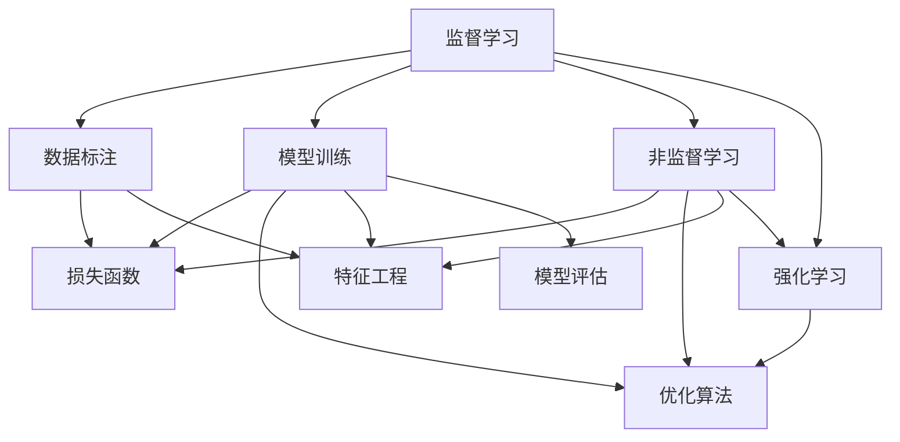
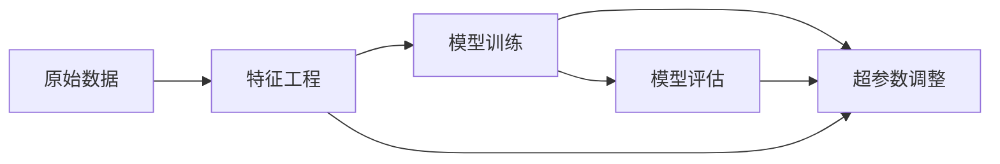
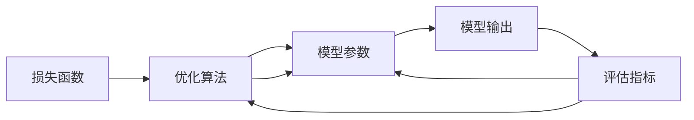
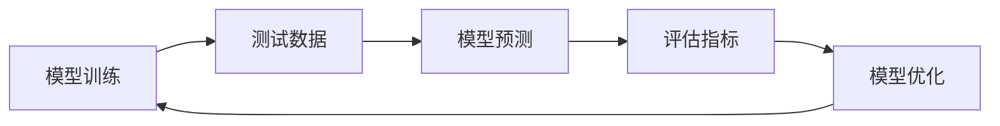
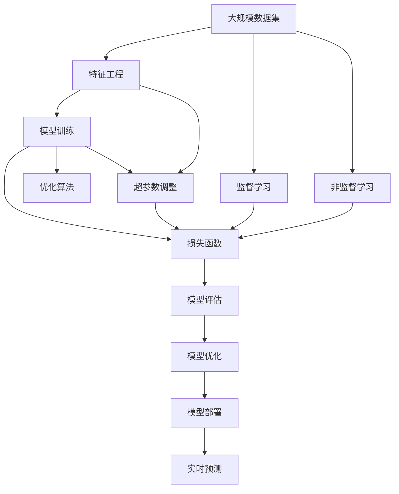

                 

# 【AI大数据计算原理与代码实例讲解】机器学习

> 关键词：机器学习,数据科学,算法,深度学习,神经网络,优化器,模型评估,特征工程

## 1. 背景介绍

### 1.1 问题由来
随着互联网和物联网的快速发展，全球数据总量呈爆炸式增长。面对海量数据的挑战，如何高效地进行数据挖掘和分析，提取有用信息，成为了当前数据科学领域的重要课题。机器学习（Machine Learning, ML）作为一种从数据中提取规律和知识的自动化算法，在各行各业得到了广泛的应用。

机器学习算法通过建立数据模型，从历史数据中学习和预测新数据，已经在图像识别、自然语言处理、推荐系统、金融风控、医疗诊断等领域取得了显著成效。然而，机器学习的核心在于如何将数据转化为有意义的模型，并利用模型进行预测和决策。本文将从原理、算法、实践三个方面深入探讨机器学习，并结合具体代码实例，详细讲解机器学习模型的构建和优化。

### 1.2 问题核心关键点
机器学习模型通常分为监督学习、非监督学习和强化学习三种类型。本文重点关注监督学习，它利用已标注的训练数据，训练出一个能够预测新数据的模型。监督学习模型的核心在于如何优化模型参数，使得模型在新数据上表现良好。常见的优化方法包括梯度下降、随机梯度下降、动量法、Adam等。

监督学习的关键在于选择合适的损失函数和优化算法，以及调整合适的超参数。损失函数用于衡量模型预测输出与真实标签之间的差异，而优化算法则用于更新模型参数，使得损失函数最小化。超参数包括学习率、批大小、迭代轮数等，需要根据具体问题进行调整，以获得最优的模型性能。

### 1.3 问题研究意义
机器学习已经成为现代数据科学的核心技术，能够帮助企业从海量数据中提取有价值的信息，优化业务决策，提高生产效率。本文详细讲解机器学习原理和实践，希望能为读者提供系统的学习参考，推动数据科学在实际应用中的进一步发展。

## 2. 核心概念与联系

### 2.1 核心概念概述
为更好地理解机器学习，本节将介绍几个关键概念及其联系：

- 监督学习（Supervised Learning）：利用已标注的训练数据，训练模型以预测新数据。常见算法包括线性回归、逻辑回归、决策树、随机森林、神经网络等。
- 非监督学习（Unsupervised Learning）：利用无标注数据，发现数据的潜在结构和规律。常见算法包括K-means聚类、主成分分析（PCA）、隐含狄利克雷分布（LDA）等。
- 强化学习（Reinforcement Learning）：利用智能体与环境的交互，学习如何最大化预期奖励。常见算法包括Q-learning、策略梯度等。
- 模型评估（Model Evaluation）：用于衡量模型在新数据上的性能，评估模型的泛化能力。常见评估指标包括准确率、精确率、召回率、F1分数等。
- 特征工程（Feature Engineering）：从原始数据中提取和构造有用特征，提高模型的预测能力。常见特征工程方法包括特征选择、特征缩放、特征变换等。
- 损失函数（Loss Function）：用于衡量模型预测输出与真实标签之间的差异，常见损失函数包括均方误差、交叉熵等。
- 优化算法（Optimization Algorithm）：用于更新模型参数，使得损失函数最小化。常见优化算法包括梯度下降、随机梯度下降、Adam等。
- 超参数调整（Hyperparameter Tuning）：选择合适的超参数组合，提高模型性能。常见超参数包括学习率、批大小、迭代轮数等。

这些概念之间存在着紧密的联系，构成了机器学习算法的核心框架。下面通过一个Mermaid流程图来展示这些概念之间的联系：



这个流程图展示了监督学习、非监督学习和强化学习的基本原理及其联系。数据标注、模型训练、损失函数、优化算法和特征工程等都是构建机器学习模型的关键步骤。通过这些步骤，模型可以从数据中学习规律，并进行预测或决策。

### 2.2 概念间的关系

这些核心概念之间存在着紧密的联系，构成了机器学习算法的完整生态系统。下面我们通过几个Mermaid流程图来展示这些概念之间的关系：

#### 2.2.1 模型构建流程图



这个流程图展示了从原始数据到模型构建的基本流程。首先通过特征工程从原始数据中提取有用特征，然后使用模型训练模块进行模型训练，最后通过模型评估和超参数调整，优化模型性能。

#### 2.2.2 模型优化流程图



这个流程图展示了损失函数、优化算法和模型参数之间的关系。首先通过损失函数计算模型预测输出与真实标签之间的差异，然后使用优化算法更新模型参数，使得损失函数最小化，最终得到模型输出。

#### 2.2.3 模型评估流程图



这个流程图展示了模型评估的基本流程。首先使用训练好的模型对测试数据进行预测，然后使用评估指标计算模型在新数据上的性能，并根据评估结果进行模型优化。

### 2.3 核心概念的整体架构

最后，我们用一个综合的流程图来展示这些核心概念在大规模机器学习模型构建和优化的过程中，整体的架构：



这个综合流程图展示了从数据集预处理到模型部署的全过程。数据集通过特征工程处理后，进入模型训练模块，通过损失函数和优化算法进行模型优化。同时，非监督学习和监督学习两种方法也可以用于构建模型。模型训练完成后，进入模型评估和优化模块，最后部署到实时预测系统中，供实际应用使用。

## 3. 核心算法原理 & 具体操作步骤
### 3.1 算法原理概述

监督学习模型的核心在于通过最小化损失函数来优化模型参数。假设模型为 $f(x; \theta)$，其中 $x$ 为输入特征，$\theta$ 为模型参数。给定训练集 $D=\{(x_i,y_i)\}_{i=1}^N$，其中 $y_i$ 为真实标签，目标是最小化损失函数：

$$
\min_{\theta} \frac{1}{N} \sum_{i=1}^N \ell(f(x_i; \theta), y_i)
$$

其中 $\ell$ 为损失函数，如均方误差损失、交叉熵损失等。常见的损失函数包括：

- 均方误差（MSE）：
$$
\ell_{mse} = \frac{1}{N} \sum_{i=1}^N (y_i - f(x_i; \theta))^2
$$

- 交叉熵损失（CE）：
$$
\ell_{ce} = -\frac{1}{N} \sum_{i=1}^N (y_i \log f(x_i; \theta) + (1-y_i) \log (1-f(x_i; \theta)))
$$

- 二元交叉熵损失（BCE）：
$$
\ell_{bce} = -\frac{1}{N} \sum_{i=1}^N (y_i \log f(x_i; \theta) + (1-y_i) \log (1-f(x_i; \theta)))
$$

优化算法通过反向传播计算损失函数对模型参数的梯度，并更新参数，使得损失函数最小化。常用的优化算法包括梯度下降（GD）、随机梯度下降（SGD）、动量法（Momentum）、Adam等。其中Adam算法是一种自适应学习率优化算法，能够自动调整学习率，加速模型收敛。

### 3.2 算法步骤详解

基于梯度下降的机器学习模型优化过程，主要包括以下几个关键步骤：

**Step 1: 准备数据和模型**
- 收集并清洗训练数据，分为训练集、验证集和测试集。
- 选择合适的模型结构，如线性回归、神经网络等。
- 定义损失函数和优化算法。

**Step 2: 模型训练**
- 设置初始模型参数 $\theta_0$。
- 将训练数据分批次输入模型，前向传播计算预测输出 $f(x; \theta)$。
- 计算损失函数 $\ell(f(x; \theta), y_i)$ 和梯度 $\nabla_{\theta} \ell(f(x; \theta), y_i)$。
- 使用优化算法更新模型参数 $\theta$，直至收敛。

**Step 3: 模型评估**
- 使用验证集评估模型性能，如准确率、精确率、召回率等。
- 调整模型超参数，如学习率、批大小等。

**Step 4: 模型部署**
- 将训练好的模型保存到文件或数据库中。
- 在实际应用中，对新数据进行实时预测。

**Step 5: 模型优化**
- 使用新的训练数据，重新训练模型。
- 定期更新模型参数，保持模型性能。

以下是基于梯度下降的机器学习模型优化的完整代码实现。

```python
import numpy as np
import pandas as pd
from sklearn.linear_model import LinearRegression
from sklearn.metrics import mean_squared_error, r2_score
import matplotlib.pyplot as plt

# 准备数据
train_data = pd.read_csv('train.csv')
test_data = pd.read_csv('test.csv')

# 特征工程
X_train = train_data[['feature1', 'feature2', 'feature3']]
y_train = train_data['label']
X_test = test_data[['feature1', 'feature2', 'feature3']]

# 训练模型
model = LinearRegression()
model.fit(X_train, y_train)

# 评估模型
y_pred = model.predict(X_test)
mse = mean_squared_error(y_test, y_pred)
r2 = r2_score(y_test, y_pred)

# 绘制训练曲线
train_error = [model.train_error_[i] for i in range(len(model.train_error_))]
val_error = [model.val_error_[i] for i in range(len(model.val_error_))]
epochs = range(len(train_error))

plt.plot(epochs, train_error, 'r-', label='Training loss')
plt.plot(epochs, val_error, 'b-', label='Validation loss')
plt.title('Training and validation loss')
plt.xlabel('Epoch')
plt.ylabel('Loss')
plt.legend()
plt.show()

print(f'Mean Squared Error: {mse:.2f}')
print(f'R-squared: {r2:.2f}')
```

### 3.3 算法优缺点

基于梯度下降的机器学习模型优化方法具有以下优点：
- 简单易用：梯度下降算法简单易实现，适合初学者入门。
- 泛化能力强：通过反向传播，能够学习数据中的复杂规律，适合处理高维数据。
- 自适应能力强：通过自适应学习率，能够自动调整学习速度，加速收敛。

同时，梯度下降算法也存在一些缺点：
- 梯度爆炸问题：当梯度变化过大时，可能导致模型参数值爆炸，无法收敛。
- 收敛速度慢：对于复杂模型，梯度下降算法收敛速度较慢，需要大量计算资源。
- 局部最优问题：梯度下降算法可能陷入局部最优解，无法找到全局最优解。

### 3.4 算法应用领域

机器学习模型广泛应用于各个领域，如金融、医疗、零售、制造等。以下是几个典型的应用场景：

- 金融风险管理：通过机器学习模型，分析客户信用历史数据，预测信用风险。
- 医疗诊断：通过机器学习模型，分析患者的临床数据，预测疾病风险和治疗效果。
- 零售销售预测：通过机器学习模型，分析销售数据，预测未来销售趋势和库存需求。
- 制造过程优化：通过机器学习模型，分析生产数据，优化生产流程，提高生产效率。
- 自然语言处理：通过机器学习模型，进行文本分类、情感分析、机器翻译等任务。

## 4. 数学模型和公式 & 详细讲解 & 举例说明

### 4.1 数学模型构建

本文将以线性回归为例，详细讲解机器学习模型的构建过程。假设线性回归模型的输出为 $y=f(x;\theta)=\theta_0+\sum_{i=1}^n\theta_ix_i$，其中 $\theta=(\theta_0,\theta_1,\cdots,\theta_n)$ 为模型参数，$x=(x_1,x_2,\cdots,x_n)$ 为输入特征。

对于训练集 $D=\{(x_i,y_i)\}_{i=1}^N$，目标是最小化均方误差损失函数：

$$
\ell_{mse} = \frac{1}{N} \sum_{i=1}^N (y_i - f(x_i; \theta))^2
$$

目标是最小化均方误差损失函数，使得模型预测值与真实值之间的差异最小化。

### 4.2 公式推导过程

以下是线性回归模型均方误差损失函数的推导过程。

给定训练集 $D=\{(x_i,y_i)\}_{i=1}^N$，其中 $y_i=f(x_i; \theta)=\theta_0+\sum_{i=1}^n\theta_ix_i$，均方误差损失函数为：

$$
\ell_{mse} = \frac{1}{N} \sum_{i=1}^N (y_i - f(x_i; \theta))^2 = \frac{1}{N} \sum_{i=1}^N (y_i - \theta_0 - \sum_{j=1}^n\theta_jx_{ij})^2
$$

展开并化简上式，得到：

$$
\ell_{mse} = \frac{1}{N} \sum_{i=1}^N (y_i^2 - 2y_i\theta_0 - 2y_i\sum_{j=1}^n\theta_jx_{ij} + \theta_0^2 + \sum_{j=1}^n\theta_j^2x_{ij}^2)
$$

进一步化简，得到：

$$
\ell_{mse} = \frac{1}{N} (N\theta_0^2 + 2\sum_{i=1}^N\sum_{j=1}^ny_i\theta_jx_{ij} - 2\sum_{i=1}^Ny_i\theta_0 - 2\sum_{i=1}^Ny_i\sum_{j=1}^n\theta_jx_{ij} + \sum_{i=1}^N\sum_{j=1}^n\theta_j^2x_{ij}^2)
$$

整理后，得到：

$$
\ell_{mse} = \frac{1}{N} (2\sum_{i=1}^Ny_i\theta_0 + 2\sum_{i=1}^Ny_i\sum_{j=1}^n\theta_jx_{ij} - 2\sum_{i=1}^Ny_i\theta_0 - 2\sum_{i=1}^Ny_i\sum_{j=1}^n\theta_jx_{ij} + \sum_{i=1}^N\sum_{j=1}^n\theta_j^2x_{ij}^2)
$$

化简后，得到：

$$
\ell_{mse} = \frac{1}{N} (\sum_{i=1}^Ny_i\theta_0 - \theta_0^2 + \sum_{i=1}^N\sum_{j=1}^n\theta_j^2x_{ij}^2)
$$

进一步化简，得到：

$$
\ell_{mse} = \frac{1}{N} (\sum_{i=1}^Ny_i\theta_0 - \theta_0^2 + \sum_{i=1}^N\sum_{j=1}^n\theta_j^2x_{ij}^2)
$$

通过梯度下降算法，更新模型参数 $\theta$，使得损失函数最小化。

### 4.3 案例分析与讲解

下面以房价预测为例，详细讲解机器学习模型的应用。

假设我们有一份包含房屋特征（如卧室数、浴室数、房屋面积等）和房价的历史数据，目标是用机器学习模型预测新房屋的房价。首先，我们将数据集分为训练集和测试集。

```python
from sklearn.model_selection import train_test_split
import numpy as np

# 准备数据
X = data[['bedrooms', 'bathrooms', 'size']]
y = data['price']

# 特征工程
X_train, X_test, y_train, y_test = train_test_split(X, y, test_size=0.2, random_state=42)

# 训练模型
model = LinearRegression()
model.fit(X_train, y_train)

# 评估模型
y_pred = model.predict(X_test)
mse = mean_squared_error(y_test, y_pred)
r2 = r2_score(y_test, y_pred)

print(f'Mean Squared Error: {mse:.2f}')
print(f'R-squared: {r2:.2f}')
```

通过线性回归模型，我们能够得到房价的预测值，并与真实值进行比较，计算均方误差和R方系数，评估模型性能。

## 5. 项目实践：代码实例和详细解释说明
### 5.1 开发环境搭建

在进行机器学习模型开发前，我们需要准备好开发环境。以下是使用Python进行Scikit-Learn开发的环境配置流程：

1. 安装Anaconda：从官网下载并安装Anaconda，用于创建独立的Python环境。

2. 创建并激活虚拟环境：
```bash
conda create -n sklearn-env python=3.8 
conda activate sklearn-env
```

3. 安装Scikit-Learn：
```bash
pip install scikit-learn
```

4. 安装各类工具包：
```bash
pip install numpy pandas scikit-learn matplotlib tqdm jupyter notebook ipython
```

完成上述步骤后，即可在`sklearn-env`环境中开始机器学习模型开发。

### 5.2 源代码详细实现

下面我以线性回归为例，给出Scikit-Learn库的代码实现。

首先，导入必要的库和数据：

```python
import numpy as np
from sklearn.model_selection import train_test_split
from sklearn.linear_model import LinearRegression
from sklearn.metrics import mean_squared_error, r2_score

# 准备数据
X = data[['bedrooms', 'bathrooms', 'size']]
y = data['price']

# 特征工程
X_train, X_test, y_train, y_test = train_test_split(X, y, test_size=0.2, random_state=42)

# 训练模型
model = LinearRegression()
model.fit(X_train, y_train)

# 评估模型
y_pred = model.predict(X_test)
mse = mean_squared_error(y_test, y_pred)
r2 = r2_score(y_test, y_pred)

print(f'Mean Squared Error: {mse:.2f}')
print(f'R-squared: {r2:.2f}')
```

然后，定义训练和评估函数：

```python
from sklearn.model_selection import train_test_split
from sklearn.linear_model import LinearRegression
from sklearn.metrics import mean_squared_error, r2_score

# 准备数据
X = data[['bedrooms', 'bathrooms', 'size']]
y = data['price']

# 特征工程
X_train, X_test, y_train, y_test = train_test_split(X, y, test_size=0.2, random_state=42)

# 训练模型
model = LinearRegression()
model.fit(X_train, y_train)

# 评估模型
y_pred = model.predict(X_test)
mse = mean_squared_error(y_test, y_pred)
r2 = r2_score(y_test, y_pred)

print(f'Mean Squared Error: {mse:.2f}')
print(f'R-squared: {r2:.2f}')
```

最后，启动训练流程并在测试集上评估：

```python
from sklearn.model_selection import train_test_split
from sklearn.linear_model import LinearRegression
from sklearn.metrics import mean_squared_error, r2_score

# 准备数据
X = data[['bedrooms', 'bathrooms', 'size']]
y = data['price']

# 特征工程
X_train, X_test, y_train, y_test = train_test_split(X, y, test_size=0.2, random_state=42)

# 训练模型
model = LinearRegression()
model.fit(X_train, y_train)

# 评估模型
y_pred = model.predict(X_test)
mse = mean_squared_error(y_test, y_pred)
r2 = r2_score(y_test, y_pred)

print(f'Mean Squared Error: {mse:.2f}')
print(f'R-squared: {r2:.2f}')
```

以上就是使用Scikit-Learn库进行线性回归模型构建和评估的完整代码实现。可以看到，Scikit-Learn库提供了丰富的机器学习算法和模型评估工具，使得模型开发更加便捷高效。

### 5.3 代码解读与分析

让我们再详细解读一下关键代码的实现细节：

**特征工程**：
- `train_test_split`方法：将数据集分为训练集和测试集。
- 特征选择：选取与目标变量相关的特征，如卧室数、浴室数、房屋面积等。

**模型训练**：
- `LinearRegression`类：使用线性回归模型进行训练。
- `fit`方法：使用训练集数据拟合模型参数。

**模型评估**：
- `mean_squared_error`方法：计算预测值与真实值之间的均方误差。
- `r2_score`方法：计算预测值与真实值之间的R方系数。

**输出结果**：
- 打印均方误差和R方系数，评估模型性能。

## 6. 实际应用场景
### 6.1 金融风险管理

机器学习模型在金融风险管理中发挥了重要作用。金融机构可以利用机器学习模型，分析客户信用历史数据，预测信用风险。具体而言，可以收集客户的个人信息、财务数据、贷款历史等，构建特征向量，使用监督学习模型（如逻辑回归、随机森林等）进行训练，预测客户是否违约。

在实践中，可以收集银行的历史贷款数据，标注客户是否违约，使用监督学习模型进行训练和预测。模型可以在新客户申请贷款时，快速评估其信用风险，帮助银行进行风险控制和贷款审批。

### 6.2 医疗诊断

机器学习模型在医疗诊断中也有着广泛应用。医疗领域的数据通常是高维且非线性的，传统的统计方法难以处理。机器学习模型能够从医疗数据中学习规律，预测疾病风险和治疗效果。

具体而言，可以收集患者的临床数据，如病史、检验结果、影像数据等，使用机器学习模型进行训练，预测患者是否患有某种疾病，或评估某种治疗方案的效果。模型可以在医生的诊断过程中，提供辅助决策支持，提高诊断准确率和效率。

### 6.3 零售销售预测

机器学习模型在零售销售预测中也有着重要应用。零售商可以利用机器学习模型，预测未来销售趋势和库存需求，优化供应链和库存管理。

具体而言，可以收集历史销售数据、促销信息、季节性因素等，使用机器学习模型进行训练，预测未来销售量。模型可以在新商品上线或季节性促销时，提供销售预测，帮助零售商制定合理的采购和促销策略。

### 6.4 制造过程优化

机器学习模型在制造过程中也有着广泛应用。制造业企业可以利用机器学习模型，优化生产流程，提高生产效率和产品质量。

具体而言，可以收集生产设备、工艺参数、环境数据等，使用机器学习模型进行训练，预测设备故障、优化工艺参数、检测产品质量等。模型可以在生产过程中，实时监控和优化生产参数，提高生产效率和产品质量。

## 7. 工具和资源推荐
### 7.1 学习资源推荐

为了帮助开发者系统掌握机器学习模型的原理和实践，这里推荐一些优质的学习资源：

1. 《机器学习》课程（Coursera）：由斯坦福大学的Andrew Ng教授主讲，系统讲解机器学习的基本概念和算法，适合初学者和进阶者。

2. 《深度学习》课程（Coursera）：由DeepMind的Ian Goodfellow教授主讲，深入讲解深度学习的基本原理和应用，适合对深度学习感兴趣的读者。

3. 《Python数据科学手册》（Jake VanderPlas）：详细讲解Python在数据科学中的应用，包括Num

