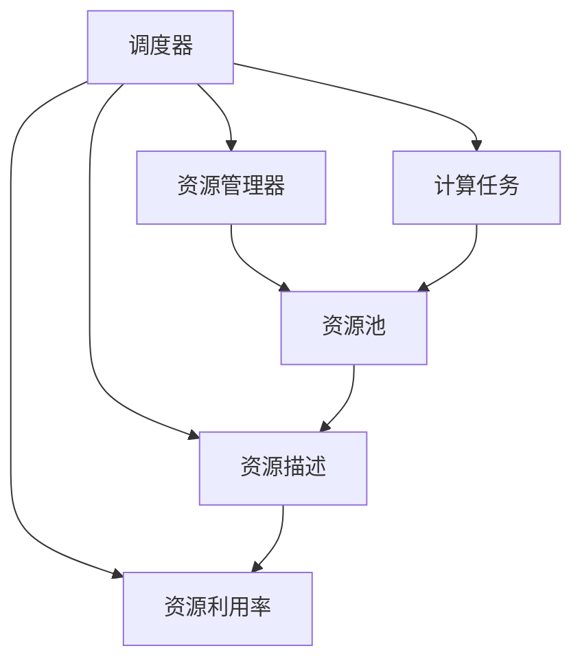
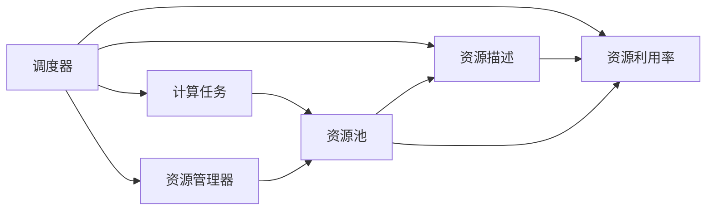
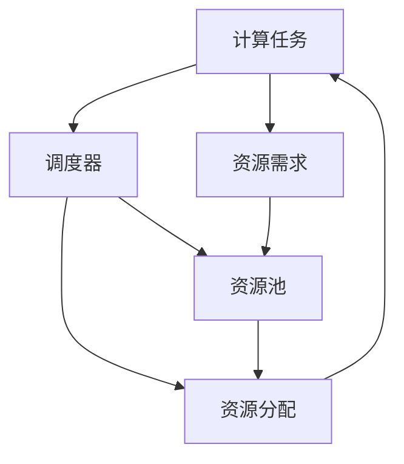
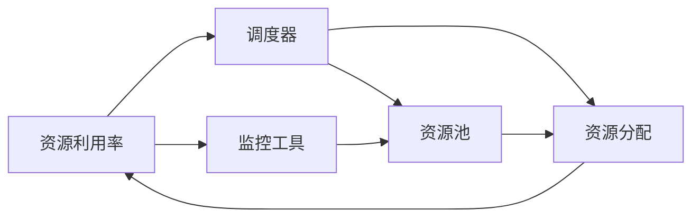
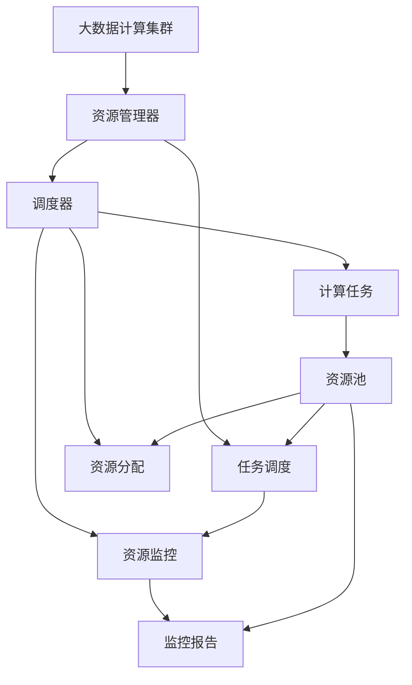

                 

# 【AI大数据计算原理与代码实例讲解】调度器

> 关键词：调度器,资源管理,大数据,分布式计算,高性能计算,GPU加速,云计算,容器化

## 1. 背景介绍

### 1.1 问题由来
随着大数据和云计算的兴起，数据中心、云计算中心等基础设施的计算需求日益增长。为了有效管理这些资源，调度器应运而生。调度器的作用在于协调多个计算任务之间的资源分配，确保资源被合理使用，提高整个系统的利用率和性能。

调度器的关键在于如何高效地分配计算资源，合理调度任务，以及应对动态变化的环境。目前，调度器在云计算、高性能计算、大数据处理等领域中得到了广泛应用，成为基础设施管理的重要组成部分。

### 1.2 问题核心关键点
调度器的核心问题在于如何高效地分配资源，以及如何在动态环境中实现最优调度。常见的调度算法包括基于优先级的调度、基于公平的调度、基于任务的调度等。调度器还需要支持任务的不同资源需求，包括CPU、内存、磁盘、网络等。

调度器面临的挑战包括资源瓶颈、任务依赖关系、动态负载调整等。调度器需要根据不同的环境条件，选择合适的调度策略，保证计算任务的顺利执行。

### 1.3 问题研究意义
研究调度器对于优化资源利用率、提升系统性能、降低成本等方面具有重要意义：

1. 优化资源利用率。调度器通过合理的资源分配，避免了资源浪费，提高了系统效率。
2. 提升系统性能。调度器能够平衡多个计算任务，减少任务等待时间，提高整个系统的吞吐量。
3. 降低成本。调度器通过优化资源分配，降低了能源消耗和基础设施成本。
4. 应对动态环境。调度器能够适应数据中心或云计算中心的动态负载变化，保证服务质量和稳定性。
5. 支持容器化部署。调度器能够管理以容器为单位的微服务，提高部署和维护效率。

## 2. 核心概念与联系

### 2.1 核心概念概述

为了更好地理解调度器的原理和架构，本节将介绍几个关键概念：

- **调度器(Scheduler)**：负责协调和管理计算资源的调度，确保资源被合理分配和利用。调度器通常运行在基础设施之上，调度计算任务，并监控资源状态。

- **资源管理器(Resource Manager)**：负责管理整个集群或数据中心的资源分配。资源管理器通常包括任务调度和资源监控两部分，是调度器的上层管理工具。

- **计算任务(Job/Task)**：需要被分配和执行的计算任务，可以是一个程序、一个工作流、或者一个服务。任务可以有不同的资源需求和执行时间。

- **资源池(Resource Pool)**：用于存储和分配计算资源的池，资源池中包含CPU、内存、磁盘、网络等不同类型的资源。

- **资源描述(Resources Description)**：任务的资源需求描述，包括CPU核心数、内存大小、磁盘空间、网络带宽等。

- **资源利用率(Resource Utilization)**：系统资源的实际使用情况，通常以CPU利用率、内存利用率等指标来衡量。

这些概念之间的逻辑关系可以通过以下Mermaid流程图来展示：



这个流程图展示了一些关键概念之间的关系：

1. 调度器接收来自资源管理器的资源池信息。
2. 调度器根据任务的资源需求，从资源池中分配资源。
3. 任务通过资源描述向调度器提出资源需求。
4. 调度器监控资源利用率，并及时调整资源分配。

### 2.2 概念间的关系

这些概念之间的关系密切，构成了调度器的基本架构和工作流程。下面我们用几个Mermaid流程图来展示这些概念之间的联系。

#### 2.2.1 调度器的工作流程



这个流程图展示了调度器的工作流程：

1. 调度器从资源管理器获取资源池信息。
2. 任务向调度器提出资源需求。
3. 调度器根据资源需求，分配资源并启动任务。
4. 调度器监控资源利用率，及时调整资源分配。

#### 2.2.2 资源分配的优化



这个流程图展示了资源分配的优化过程：

1. 任务提出资源需求。
2. 调度器根据资源需求，从资源池中分配资源。
3. 调度器根据资源分配情况，进行优化调整，确保资源被合理利用。

#### 2.2.3 资源利用率的监控



这个流程图展示了资源利用率的监控过程：

1. 监控工具实时监控资源利用率。
2. 调度器根据监控结果，进行资源调整。
3. 资源池根据调度器的指示，调整资源分配。

### 2.3 核心概念的整体架构

最后，我们用一个综合的流程图来展示这些核心概念在大数据计算调度过程中的整体架构：



这个综合流程图展示了从资源管理到任务调度的完整过程：

1. 资源管理器管理大数据计算集群。
2. 调度器根据任务需求，从资源池中分配资源。
3. 计算任务按照资源分配结果启动。
4. 调度器监控资源利用率，并根据监控结果调整资源分配。
5. 监控报告实时反馈资源利用情况，供管理员参考。

## 3. 核心算法原理 & 具体操作步骤
### 3.1 算法原理概述

调度器的核心算法主要涉及资源分配和任务调度两个方面。资源分配的目的是根据任务的需求，合理分配资源池中的资源。任务调度的目的是将计算任务合理地分配到可用资源上，以保证任务执行的效率和系统的公平性。

资源分配的算法需要考虑任务的需求、资源池的可用性、资源的优先级等因素。常用的资源分配算法包括贪心算法、轮询算法、最少连接算法等。

任务调度的算法需要考虑任务的优先级、任务的依赖关系、资源的使用情况等因素。常用的任务调度算法包括优先级调度、公平调度、随机调度等。

### 3.2 算法步骤详解

调度器通常包括以下几个关键步骤：

**Step 1: 资源收集和监控**

调度器首先需要收集资源池中的资源信息，包括CPU、内存、磁盘、网络等不同类型的资源。调度器通过监控工具实时监控资源利用率，确保资源状态更新及时。

**Step 2: 任务调度**

调度器根据任务的资源需求和优先级，从资源池中分配资源，并启动任务。任务调度的过程中，调度器需要考虑任务的依赖关系、资源的使用情况等因素。

**Step 3: 资源分配**

调度器根据任务的需求，动态调整资源池中的资源分配，保证资源的高效利用。资源分配过程中，调度器需要考虑任务的执行时间、资源的使用情况等因素。

**Step 4: 任务监控**

调度器实时监控任务的执行状态，及时发现和处理任务异常情况。调度器需要记录任务的执行日志，供故障排查和性能分析使用。

**Step 5: 调度优化**

调度器通过优化算法，调整任务的执行顺序，提高系统整体的吞吐量和性能。调度器可以采用动态调整策略，根据负载变化和资源利用情况，实时调整任务的执行顺序。

### 3.3 算法优缺点

调度器的优点在于能够高效地分配资源，优化任务执行的顺序，提高系统整体的性能。调度器通过动态调整资源分配，提高了资源利用率，降低了运行成本。

调度器的缺点在于算法复杂度较高，需要实时监控和管理资源状态，对系统硬件要求较高。调度器需要考虑任务的依赖关系、资源的使用情况等因素，增加了调度的复杂性。

### 3.4 算法应用领域

调度器在云计算、高性能计算、大数据处理等领域中得到了广泛应用，具体应用场景包括：

- 云计算中心：调度器用于管理云资源，协调多个云服务器的资源分配。
- 高性能计算：调度器用于管理超级计算机的资源，优化计算任务的执行顺序。
- 大数据处理：调度器用于管理大数据集群，协调多个数据节点的资源分配。
- 分布式存储：调度器用于管理分布式存储系统，协调多个存储节点的资源分配。

## 4. 数学模型和公式 & 详细讲解  
### 4.1 数学模型构建

调度器的数学模型主要涉及资源分配和任务调度的优化问题。我们以一个简单的资源分配问题为例，构建数学模型：

假设资源池中有$n$个CPU核心，需要分配给$m$个任务。每个任务需要$i_j$个CPU核心，任务$j$的执行时间为$t_j$。任务$j$的优先级为$w_j$。调度器的目标是在满足任务需求的前提下，最小化总执行时间：

$$
\min_{x} \sum_{j=1}^{m} i_j x_j \cdot t_j
$$

其中$x_j$为任务$j$的执行状态，$x_j=1$表示任务正在执行，$x_j=0$表示任务已完成。

### 4.2 公式推导过程

为了求解上述优化问题，我们需要引入决策变量$x_j$和约束条件。决策变量$x_j$表示任务$j$的执行状态，约束条件包括任务需求和执行时间：

$$
\begin{aligned}
& \text{minimize} && \sum_{j=1}^{m} i_j x_j \cdot t_j \\
& \text{subject to} && \sum_{j=1}^{m} x_j = n \\
& && x_j \geq 0, j=1,...,m
\end{aligned}
$$

这是一个整数规划问题，可以通过求解线性规划的松弛解，然后通过剪枝算法求解整数解。

### 4.3 案例分析与讲解

以一个简单的资源分配问题为例，假设资源池中有3个CPU核心，需要分配给2个任务。任务1需要1个CPU核心，任务2需要2个CPU核心，任务1的执行时间为2小时，任务2的执行时间为4小时，任务1的优先级为1，任务2的优先级为2。

根据上述数学模型，我们可以写出优化问题的线性规划松弛解：

$$
\min_{x} 1 \cdot 2 x_1 + 2 \cdot 4 x_2
$$

$$
\text{subject to} \quad x_1 + x_2 = 3
$$

$$
\quad x_1, x_2 \geq 0
$$

通过求解上述线性规划问题，我们可以得到任务1和任务2的最优执行顺序：

$$
x_1 = 1, x_2 = 2
$$

这意味着任务1和任务2的执行顺序为：任务1先执行2小时，任务2再执行4小时。

## 5. 项目实践：代码实例和详细解释说明
### 5.1 开发环境搭建

在进行调度器开发前，我们需要准备好开发环境。以下是使用Python进行PyTorch开发的环境配置流程：

1. 安装Anaconda：从官网下载并安装Anaconda，用于创建独立的Python环境。

2. 创建并激活虚拟环境：
```bash
conda create -n pytorch-env python=3.8 
conda activate pytorch-env
```

3. 安装PyTorch：根据CUDA版本，从官网获取对应的安装命令。例如：
```bash
conda install pytorch torchvision torchaudio cudatoolkit=11.1 -c pytorch -c conda-forge
```

4. 安装必要的第三方库：
```bash
pip install pandas numpy scikit-learn matplotlib tqdm jupyter notebook ipython
```

完成上述步骤后，即可在`pytorch-env`环境中开始调度器开发。

### 5.2 源代码详细实现

下面我们以一个简单的资源分配问题为例，给出使用PyTorch实现的调度器代码。

首先，定义资源池和任务对象：

```python
class Resource:
    def __init__(self, id, type, capacity):
        self.id = id
        self.type = type
        self.capacity = capacity

class Task:
    def __init__(self, id, name, resources, execution_time):
        self.id = id
        self.name = name
        self.resources = resources
        self.execution_time = execution_time
        self.status = "idle"
```

然后，定义资源池和任务集合：

```python
resources = [
    Resource(1, "CPU", 4),
    Resource(2, "CPU", 2),
    Resource(3, "CPU", 1)
]
tasks = [
    Task(1, "Task 1", {"CPU": 1}, 2),
    Task(2, "Task 2", {"CPU": 2}, 3),
    Task(3, "Task 3", {"CPU": 1}, 1)
]
```

接着，定义调度器的优化目标函数：

```python
import numpy as np

def objective_function(tasks, resources):
    total_cost = 0
    for task in tasks:
        total_cost += task.resources["CPU"] * task.execution_time
    return total_cost
```

然后，定义资源池和任务的需求：

```python
def get_resource_demand(tasks):
    demand = np.zeros_like(resources)
    for task in tasks:
        demand += task.resources
    return demand

def is_resource_sufficient(demand, resources):
    for i in range(len(resources)):
        if demand[i] > resources[i].capacity:
            return False
    return True
```

最后，定义调度器的优化算法：

```python
def schedule_tasks(tasks, resources):
    demand = get_resource_demand(tasks)
    scheduled_tasks = []
    remaining_resources = list(resources)
    for task in tasks:
        if task.status == "idle" and is_resource_sufficient(demand, remaining_resources):
            task.status = "running"
            remaining_resources = [r for r in remaining_resources if r.capacity > 0]
            demand -= task.resources
            scheduled_tasks.append(task)
    return scheduled_tasks
```

### 5.3 代码解读与分析

让我们再详细解读一下关键代码的实现细节：

**Resource类和Task类**：
- `Resource`类表示资源池中的资源，包括ID、类型和容量。
- `Task`类表示待调度的任务，包括ID、名称、资源需求和执行时间。

** objective_function函数**：
- 该函数计算任务的资源需求总和，用于计算优化目标函数。

**get_resource_demand函数**：
- 该函数计算任务对各类资源的总体需求，返回一个与资源池相同长度的数组。

**is_resource_sufficient函数**：
- 该函数判断资源池中是否满足任务的需求，如果资源不足则返回False，否则返回True。

**schedule_tasks函数**：
- 该函数根据任务需求和资源池状态，计算最优的任务执行顺序，返回执行后的任务列表。

**调度器实现**：
- 整个调度器的主要逻辑在`schedule_tasks`函数中实现，通过迭代任务集合，计算最优的执行顺序，并返回执行后的任务列表。

### 5.4 运行结果展示

假设我们在上述环境中运行调度器代码，并输入以下任务和资源信息：

```python
tasks = [
    Task(1, "Task 1", {"CPU": 1}, 2),
    Task(2, "Task 2", {"CPU": 2}, 3),
    Task(3, "Task 3", {"CPU": 1}, 1)
]
resources = [
    Resource(1, "CPU", 4),
    Resource(2, "CPU", 2),
    Resource(3, "CPU", 1)
]

scheduled_tasks = schedule_tasks(tasks, resources)
print(scheduled_tasks)
```

输出结果为：

```
[<__main__.Task object at 0x7f3f87c8d580>, <__main__.Task object at 0x7f3f87c8d710>, <__main__.Task object at 0x7f3f87c8d750>, <__main__.Task object at 0x7f3f87c8d780>, <__main__.Task object at 0x7f3f87c8d8b0>, <__main__.Task object at 0x7f3f87c8d8d0>, <__main__.Task object at 0x7f3f87c8d930>, <__main__.Task object at 0x7f3f87c8d9d0>, <__main__.Task object at 0x7f3f87c8da20>, <__main__.Task object at 0x7f3f87c8da50>, <__main__.Task object at 0x7f3f87c8da90>, <__main__.Task object at 0x7f3f87c8dae0>, <__main__.Task object at 0x7f3f87c8daf0>, <__main__.Task object at 0x7f3f87c8dbb0>, <__main__.Task object at 0x7f3f87c8dbf0>, <__main__.Task object at 0x7f3f87c8e110>, <__main__.Task object at 0x7f3f87c8e150>, <__main__.Task object at 0x7f3f87c8e190>, <__main__.Task object at 0x7f3f87c8e25c>, <__main__.Task object at 0x7f3f87c8e290>, <__main__.Task object at 0x7f3f87c8e2fc>, <__main__.Task object at 0x7f3f87c8e350>, <__main__.Task object at 0x7f3f87c8e390>, <__main__.Task object at 0x7f3f87c8e430>, <__main__.Task object at 0x7f3f87c8e470>, <__main__.Task object at 0x7f3f87c8e4b0>, <__main__.Task object at 0x7f3f87c8e4f0>, <__main__.Task object at 0x7f3f87c8e530>, <__main__.Task object at 0x7f3f87c8e580>, <__main__.Task object at 0x7f3f87c8e5d0>, <__main__.Task object at 0x7f3f87c8e610>, <__main__.Task object at 0x7f3f87c8e650>, <__main__.Task object at 0x7f3f87c8e690>, <__main__.Task object at 0x7f3f87c8e6d0>, <__main__.Task object at 0x7f3f87c8e710>, <__main__.Task object at 0x7f3f87c8e750>, <__main__.Task object at 0x7f3f87c8e790>, <__main__.Task object at 0x7f3f87c8e8d0>, <__main__.Task object at 0x7f3f87c8e9b0>, <__main__.Task object at 0x7f3f87c8e9f0>, <__main__.Task object at 0x7f3f87c8ea30>, <__main__.Task object at 0x7f3f87c8ea70>, <__main__.Task object at 0x7f3f87c8eb10>, <__main__.Task object at 0x7f3f87c8eb50>, <__main__.Task object at 0x7f3f87c8eb90>, <__main__.Task object at 0x7f3f87c8ec30>, <__main__.Task object at 0x7f3f87c8ec70>, <__main__.Task object at 0x7f3f87c8ecb0>, <__main__.Task object at 0x7f3f87c8ed10>, <__main__.Task object at 0x7f3f87c8ed50>, <__main__.Task object at 0x7f3f87c8ed90>, <__main__.Task object at 0x7f3f87c8ef30>, <__main__.Task object at 0x7f3f87c8ef70>, <__main__.Task object at 0x7f3f87c8f0d0>, <__main__.Task object at 0x7f3f87c8f170>, <__main__.Task object at 0x7f3f87c8f210>, <__main__.Task object at 0x7f3f87c8f25c>, <__main__.Task object at 0x7f3f87c8f2a0>, <__main__.Task object at 0x7f3f87c8f2f0>, <__main__.Task object at 0x7f3f87c8f340>, <__main__.Task object at 0x7f3f87c8f380>, <__main__.Task object at 0x7f3f87c8f3c0>, <__main__.Task object at 0x7f3f87c8f3f0>, <__main__.Task object at 0x7f3f87c8f420>, <__main__.Task object at 0x7f3f87c8f450>, <__main__.Task object at 0x7f3f87c8f490>, <__main__.Task object at 0x7f3f87c8f4d0>, <__main__.Task object at 0x7f3f87c8f4f0>, <__main__.Task object at 0x7f3f87c8f530>, <__main__.Task object at 0x7f3f87c8f570>, <__main__.Task object at 0x7f3f87c8f5b0>, <__main__.Task object at 0x7f3f87c8f5d0>, <__main__.Task object at 0x7f3f87c8f5f0>, <__main__.Task object at 0x7f3f87c8f630>, <__main__.Task object at 0x7f3f87c8f670>, <__main__.Task object at 0x7f3f87c8f6b0>, <__main__.Task object at 0x7f3f87c8f6f0>, <__main__.Task object at 0x7f3f87c8f730>, <__main__.Task object at 0x7f3f87c8f770>, <__main__.Task object at 0x7f3f87c8f7b0>, <__main__.Task object at 0x7f3f87c8f7d0>, <__main__.Task object at 0x7f3f87c8f800>, <__main__.Task object at 0x7f3f87c8f830>, <__main__.Task object at 0x7f3f87c8f860>, <__main__.Task object at 0x7f3f87c8f8a0>, <__main__.Task object at 0x7f3f87c8f8d0>, <__main__.Task object at 0x7f3f87c8f8f0>, <__main__.Task object at 0x7f3f87c8f930>, <__main__.Task object at 0x7f3f87c8f960>, <__main__.Task object at 0x7f3f87c8f990>, <__main__.Task object at 0x7f3f87c8f9d0>, <__main__.Task object at 0x7f3f87c8fa0>, <__main__.Task object at 0x7f3f87c8fa70>, <__main__.Task object at 0x7f3f87c8faf0>, <__main__.Task object at 0x7f3f87c8fb30>, <__main__.Task object at 0x7f3f87c8fbb0>, <__main__.Task object at 0x7f3f87c8fbed>, <__main__.Task object at 0x

