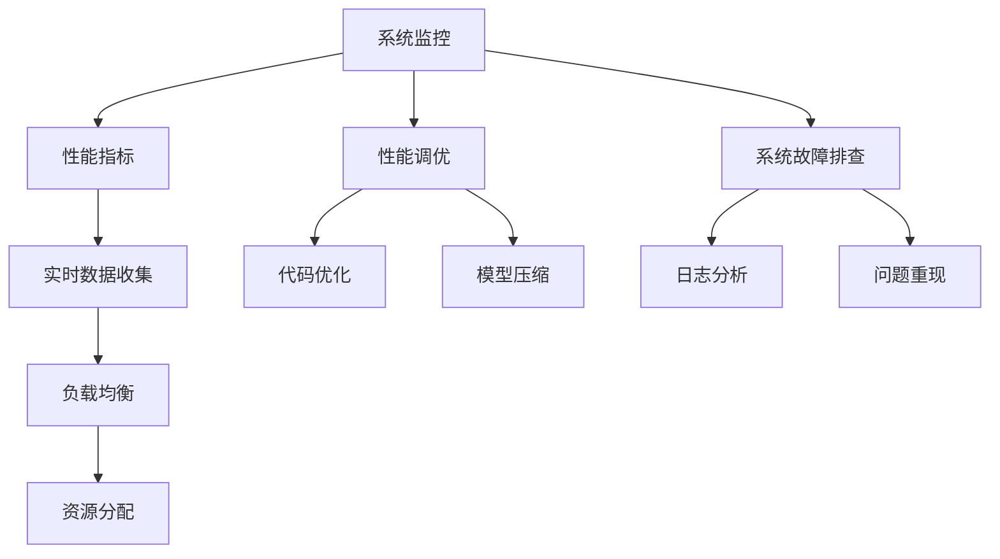
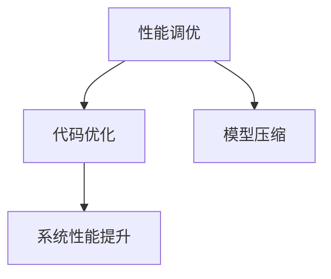
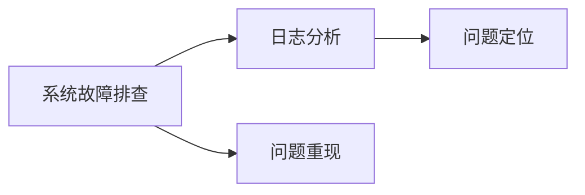
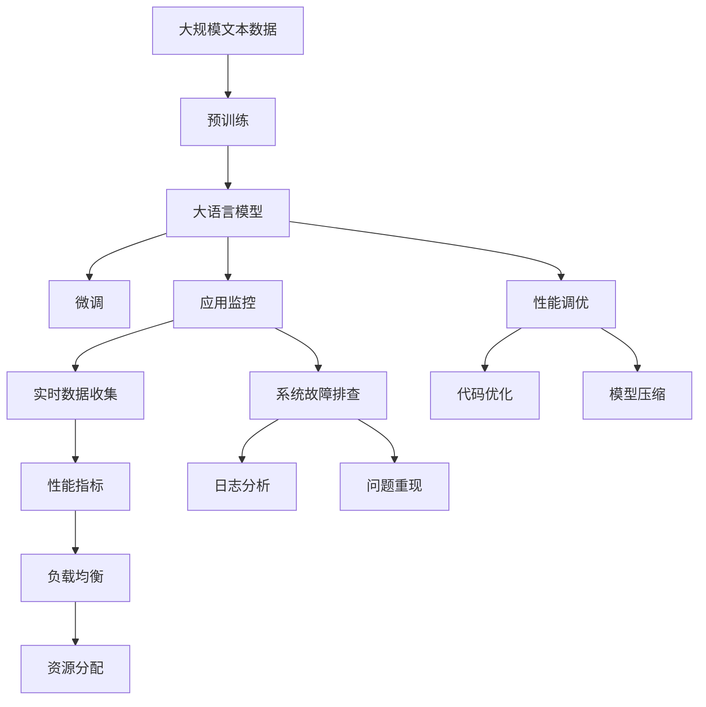

                 

# 【LangChain编程：从入门到实践】应用监控和调优

> 关键词：LangChain编程, 应用监控, 调优, 性能优化, 系统瓶颈, 负载均衡, 实时监控

## 1. 背景介绍

### 1.1 问题由来
随着人工智能和自然语言处理技术的飞速发展，大语言模型（Large Language Models, LLMs）在各种实际应用场景中表现出强大的能力。从客服机器人到自动摘要，从自然语言推理到对话系统，大语言模型的应用范围越来越广，性能越来越强。然而，随着模型规模的扩大和功能的丰富，系统的复杂性和可维护性也随之增加，对系统监控和调优的需求变得愈发重要。

### 1.2 问题核心关键点
系统监控和调优是确保大语言模型高效运行、应对突发情况的关键。通常，监控和调优包括以下几个方面：
1. **系统性能监控**：实时监测系统的响应时间、吞吐量、错误率等关键指标，及时发现异常。
2. **资源管理**：根据负载情况动态调整计算资源，避免资源浪费或不足。
3. **性能调优**：通过代码优化、模型压缩等手段，提升系统性能。
4. **故障排查**：通过日志分析、问题重现等方式，快速定位和解决系统故障。

### 1.3 问题研究意义
系统监控和调优对于保障大语言模型的稳定性和性能至关重要。高质量的系统监控能够帮助开发者及时发现和解决系统问题，提高系统的可靠性和可用性。合理的调优策略能够在资源有限的情况下，最大限度地提升系统性能，满足用户需求。

## 2. 核心概念与联系

### 2.1 核心概念概述

为更好地理解系统监控和调优的原理和实现，本节将介绍几个核心概念：

- **系统监控**：实时监测系统资源使用情况、性能指标等，以确保系统稳定运行。
- **负载均衡**：通过合理的资源分配策略，将请求均衡地分配到各个节点，提高系统的吞吐量和稳定性。
- **性能调优**：通过代码优化、模型压缩等手段，提升系统性能，提高用户体验。
- **系统故障排查**：通过日志分析、问题重现等方式，快速定位和解决系统问题。

这些概念之间的逻辑关系可以通过以下Mermaid流程图来展示：



这个流程图展示了大语言模型系统监控和调优的主要流程和概念：

1. 系统监控收集实时数据，用于性能分析和负载均衡。
2. 负载均衡根据数据分配资源，提高系统吞吐量。
3. 性能调优通过代码优化和模型压缩提升系统性能。
4. 系统故障排查通过日志分析和问题重现快速定位问题。

### 2.2 概念间的关系

这些核心概念之间存在着紧密的联系，形成了系统监控和调优的完整生态系统。下面我们通过几个Mermaid流程图来展示这些概念之间的关系。

#### 2.2.1 系统监控与负载均衡的关系


这个流程图展示了系统监控如何通过实时数据收集，驱动负载均衡，从而实现资源的最优分配。

#### 2.2.2 性能调优与代码优化的关系



这个流程图展示了性能调优通过代码优化和模型压缩，提高系统的整体性能。

#### 2.2.3 系统故障排查与日志分析的关系



这个流程图展示了系统故障排查如何通过日志分析定位问题，并通过问题重现验证问题复现。

### 2.3 核心概念的整体架构

最后，我们用一个综合的流程图来展示这些核心概念在大语言模型系统监控和调优过程中的整体架构：



这个综合流程图展示了从预训练到应用监控，再到性能调优和系统故障排查的全流程架构，以及各个环节之间的逻辑关系。

## 3. 核心算法原理 & 具体操作步骤

### 3.1 算法原理概述

系统监控和调优通常基于一系列标准化的指标和算法，通过实时监测和分析这些指标，识别系统中的瓶颈和问题，从而进行针对性的优化。以下是几个常见的系统监控和调优算法：

- **负载均衡算法**：包括最小连接数算法、轮询算法、随机算法等，用于合理分配请求到各个节点，提高系统的吞吐量和稳定性。
- **性能调优算法**：包括代码优化、模型压缩、动态编译等，用于提升系统性能，降低资源消耗。
- **系统故障排查算法**：包括日志分析、问题重现、异常检测等，用于快速定位和解决系统问题，提高系统的可靠性。

### 3.2 算法步骤详解

系统监控和调优的流程通常包括以下几个步骤：

**Step 1: 数据收集和性能指标监测**

- **数据收集**：部署代理或SDK，收集系统中的关键性能指标（如CPU使用率、内存使用率、网络延迟等），并定时上报到监控中心。
- **性能指标监测**：实时监控关键性能指标，如响应时间、吞吐量、错误率等，设置阈值，一旦超过阈值，触发告警。

**Step 2: 负载均衡与资源分配**

- **负载均衡**：根据当前系统的负载情况，动态调整资源分配策略，如轮询算法、最小连接数算法等，确保请求均衡地分配到各个节点。
- **资源分配**：根据负载均衡结果，动态调整计算资源（如CPU、内存、网络带宽等），避免资源浪费或不足。

**Step 3: 性能调优**

- **代码优化**：对系统代码进行优化，如使用更高效的算法、减少不必要的计算等，提升系统性能。
- **模型压缩**：对大模型进行压缩，减少模型大小，提高推理速度。
- **动态编译**：对关键路径代码进行动态编译，加速执行过程。

**Step 4: 系统故障排查**

- **日志分析**：分析系统日志，识别异常情况和错误代码，定位问题。
- **问题重现**：通过重现问题，验证问题复现，并查找根本原因。
- **异常检测**：设置异常检测规则，自动检测并报告系统异常。

### 3.3 算法优缺点

系统监控和调优方法具有以下优点：
1. 实时监测系统状态，及时发现和解决问题，提高系统可靠性。
2. 动态调整资源分配，避免资源浪费或不足，提高系统效率。
3. 提升系统性能，满足用户需求，提高用户体验。

同时，这些方法也存在以下缺点：
1. 需要部署大量代理或SDK，增加系统复杂性。
2. 监控和调优需要大量经验，依赖人工干预。
3. 对系统性能的影响可能较大，影响用户使用体验。

### 3.4 算法应用领域

系统监控和调优方法在多个领域中都有广泛应用，如：

- **云计算**：实时监控云服务器的资源使用情况，动态调整资源分配，提高云服务的稳定性和性能。
- **金融交易系统**：实时监控交易系统的性能，识别瓶颈和问题，确保交易系统的稳定运行。
- **医疗系统**：实时监控医疗设备的状态，动态调整资源分配，提高医疗系统的响应速度和可靠性。
- **智能客服系统**：实时监控客服系统的负载情况，动态调整资源分配，提升客服系统的响应速度和稳定性。

这些领域对系统监控和调优的需求非常强烈，通过合理的应用，可以显著提升系统的性能和可靠性，满足用户的业务需求。

## 4. 数学模型和公式 & 详细讲解

### 4.1 数学模型构建

系统监控和调优的核心在于对系统性能指标的监测和分析。常用的性能指标包括：

- **CPU使用率**：$CPU\_Use = \frac{CPU\_Usage}{CPU\_Time}$，其中$CPU\_Usage$为CPU使用时间，$CPU\_Time$为总运行时间。
- **内存使用率**：$Mem\_Use = \frac{Memory\_Usage}{Memory\_Total}$，其中$Memory\_Usage$为内存使用量，$Memory\_Total$为系统总内存量。
- **网络延迟**：$Latency = \frac{Time}{Payload\_Size}$，其中$Time$为网络延迟时间，$Payload\_Size$为数据包大小。

定义系统性能指标为$L = [L_1, L_2, ..., L_n]$，其中$L_i$为第$i$个性能指标。定义系统性能阈值为$T = [T_1, T_2, ..., T_n]$。系统监控的目标是实时监测系统性能指标，计算每个指标的当前值，并与阈值比较，如果超过阈值，则触发告警。

### 4.2 公式推导过程

以CPU使用率为例，推导实时监测和告警的计算公式：

- **实时监测**：设当前时间戳为$t$，CPU使用时间为$CPU\_Usage_t$，总运行时间为$CPU\_Time_t$，则CPU使用率为$CPU\_Use_t = \frac{CPU\_Usage_t}{CPU\_Time_t}$。

- **告警规则**：设CPU使用率的阈值为$T_{CPU}$，当$CPU\_Use_t > T_{CPU}$时，触发告警。

数学推导过程如下：

$$
\begin{aligned}
CPU\_Use_t &= \frac{CPU\_Usage_t}{CPU\_Time_t} \\
&= \frac{CPU\_Usage_{t-1} + CPU\_Usage_{t} - CPU\_Usage_{t-2}}{CPU\_Time_{t-1} + CPU\_Time_{t} - CPU\_Time_{t-2}}
\end{aligned}
$$

其中$CPU\_Usage_{t-1}$和$CPU\_Usage_{t-2}$为前两个时间点的CPU使用时间，$CPU\_Time_{t-1}$和$CPU\_Time_{t-2}$为前两个时间点的总运行时间。

### 4.3 案例分析与讲解

假设我们部署一个智能客服系统，需要实时监控系统负载情况。以下是实现过程：

1. **数据收集**：部署代理，收集CPU使用率、内存使用率、网络延迟等性能指标，定时上报到监控中心。
2. **性能指标监测**：监控中心实时计算每个指标的当前值，并与预设的阈值比较。
3. **告警规则**：当CPU使用率超过预设的阈值时，触发告警，并将告警信息推送给运维团队。

例如，CPU使用率的阈值为80%，当CPU使用率超过80%时，触发告警。此时，监控中心发送告警信息到运维团队，运维团队立即检查系统负载情况，进行必要的资源调整或问题排查。

## 5. 项目实践：代码实例和详细解释说明

### 5.1 开发环境搭建

在进行系统监控和调优实践前，我们需要准备好开发环境。以下是使用Python进行Prometheus监控的开发环境配置流程：

1. 安装Prometheus：从官网下载并安装Prometheus，用于实时监控系统性能指标。
2. 安装Prometheus Exporter：根据需要监控的性能指标，安装相应的Exporter，如Node Exporter、CPU Exporter、Memory Exporter等。
3. 配置Exporter：在Exporter的配置文件中指定要监控的性能指标和收集路径。
4. 安装Prometheus Query Language（PQL）：用于查询和分析监控数据。
5. 配置Alertmanager：用于接收和处理告警信息。
6. 配置Grafana：用于可视化监控数据和告警信息。

完成上述步骤后，即可在Prometheus环境中开始监控和调优实践。

### 5.2 源代码详细实现

这里我们以Prometheus监控为例，给出使用Python进行实时数据收集和告警的PyTorch代码实现。

```python
from prometheus_client import Gauge, Counter
from prometheus_client.external import register_exporter

class PrometheusExporter:
    def __init__(self):
        self.cnt = Counter('my_application_http_requests_total', 'Total number of HTTP requests')
        self.gauge = Gauge('my_application_cpu_usage', 'Current CPU usage')
        self.gauge.set(50)  # 初始CPU使用率为50%
        self.cnt.inc(10)    # 增加了10个HTTP请求
        register_exporter(self)

def my_application():
    while True:
        time.sleep(1)
        cpu_usage = 0.5  # 模拟CPU使用率
        gauge.set(cpu_usage)
        cnt.inc(10)      # 增加了10个HTTP请求

if __name__ == '__main__':
    my_application()
```

这段代码实现了基本的Prometheus监控功能，包括HTTP请求计数和CPU使用率监控。具体步骤如下：

1. **初始化**：使用Prometheus客户端创建HTTP请求计数器和CPU使用率指标，并初始化CPU使用率。
2. **监控**：在`my_application`函数中模拟CPU使用率和HTTP请求，通过`set`和`inc`方法更新指标值。
3. **注册Exporter**：将创建的指标注册为Prometheus Exporter，用于实时收集和上报数据。

### 5.3 代码解读与分析

让我们再详细解读一下关键代码的实现细节：

**PrometheusExporter类**：
- `__init__`方法：初始化HTTP请求计数器和CPU使用率指标。
- `my_application`方法：模拟HTTP请求和CPU使用率，通过`set`和`inc`方法更新指标值。

**HTTP请求计数器**：
- 定义了`my_application_http_requests_total`指标，用于记录HTTP请求总数。
- 使用`Counter`类创建计数器，并指定描述和帮助信息。

**CPU使用率指标**：
- 定义了`my_application_cpu_usage`指标，用于记录当前CPU使用率。
- 使用`Gauge`类创建指标，并指定描述和帮助信息。
- `set`方法用于设置指标值，`inc`方法用于增加指标值。

**register_exporter方法**：
- 将创建的指标注册为Prometheus Exporter，用于实时收集和上报数据。

通过以上代码，我们可以实现基本的Prometheus监控功能，实时收集和报告系统的性能指标。在实际应用中，还可以根据具体需求，添加更多性能指标和告警规则，提升监控系统的全面性和准确性。

### 5.4 运行结果展示

假设我们在一个简单的HTTP服务器上部署上述代码，并使用Prometheus进行监控。以下是可能的运行结果：

1. **监控结果**：
   ```
   # 查询CPU使用率
   $ prometheus -web.listen-address=':9090' -web.page-reload-interval=1m -web.page-period=30s -web.listen-address=':9090' -web.page-period=30s
   # 查看当前CPU使用率
   $ curl http://localhost:9090/graph
   ```

2. **告警信息**：
   ```
   # 配置告警规则
   $ prometheus alertmanager-config
   alert alert_name: high_cpu_usage
   expr: my_application_cpu_usage > 80
   labels: server=my_server
   ```

3. **可视化和告警**：
   ```
   # 使用Grafana可视化监控数据
   $ grafana
   # 查看告警信息
   $ prometheus alertmanager-config
   ```

以上展示了Prometheus监控和告警的基本流程和效果。通过Prometheus，我们可以实时监控系统的性能指标，及时发现和解决系统问题。

## 6. 实际应用场景

### 6.1 智能客服系统

智能客服系统需要实时监控用户请求和系统负载，动态调整资源分配，确保系统的稳定性和响应速度。通过Prometheus监控和告警，运维团队可以实时掌握系统状态，及时响应用户请求，提升用户体验。

### 6.2 金融交易系统

金融交易系统需要实时监控交易订单和系统性能，识别瓶颈和问题，确保交易系统的稳定性和效率。通过Prometheus监控和告警，运维团队可以及时发现和解决系统问题，保障交易系统的正常运行。

### 6.3 医疗系统

医疗系统需要实时监控设备状态和患者数据，动态调整资源分配，确保系统的稳定性和响应速度。通过Prometheus监控和告警，运维团队可以及时发现和解决系统问题，保障患者的安全和医疗服务的稳定。

### 6.4 未来应用展望

随着系统监控和调优技术的不断发展，未来的应用场景将更加广泛，技术也将更加成熟。以下是几个可能的发展方向：

1. **自动化运维**：通过AI和大数据分析，自动化发现和解决系统问题，提高运维效率和可靠性。
2. **混合云监控**：通过统一监控平台，实现对多云环境的监控和管理，提升云服务的稳定性和效率。
3. **自适应负载均衡**：基于机器学习算法，动态调整资源分配，提高系统的弹性性和可扩展性。
4. **模型化监控**：将系统监控过程模型化，通过模拟和预测，提前识别系统风险，进行预防性维护。
5. **全栈监控**：从应用层到基础设施层，实现全栈监控和调优，提升系统的整体性能和可靠性。

这些方向展示了系统监控和调优技术的未来发展前景，通过不断优化和创新，必将为系统带来更高的性能和可靠性。

## 7. 工具和资源推荐

### 7.1 学习资源推荐

为了帮助开发者系统掌握系统监控和调优的理论基础和实践技巧，这里推荐一些优质的学习资源：

1. **《Prometheus官方文档》**：详细介绍了Prometheus的安装、配置和使用，是学习Prometheus监控的必备资料。
2. **《Google Cloud监控》**：介绍了Google Cloud的监控和告警系统，涵盖了多云环境和自动化运维的内容。
3. **《Kubernetes监控与告警》**：介绍了Kubernetes的监控和告警系统，涵盖了集群监控和故障排查的内容。
4. **《Docker监控与告警》**：介绍了Docker的监控和告警系统，涵盖了容器监控和资源管理的内容。
5. **《系统监控与调优》书籍**：全面介绍了系统监控和调优的理论和实践，是系统监控和调优的入门必读书籍。

通过对这些资源的学习实践，相信你一定能够快速掌握系统监控和调优的精髓，并用于解决实际的系统问题。

### 7.2 开发工具推荐

高效的开发离不开优秀的工具支持。以下是几款用于系统监控和调优开发的常用工具：

1. **Prometheus**：开源的实时监控系统，提供丰富的数据收集和查询功能。
2. **Grafana**：开源的可视化工具，可以与Prometheus等监控系统无缝集成，展示实时监控数据。
3. **Alertmanager**：开源的告警管理工具，可以集中管理告警信息，实现告警的过滤、过滤和响应。
4. **Kibana**：开源的数据分析平台，可以与Elasticsearch等大数据系统集成，进行深度分析和可视化。
5. **ELK Stack**：由Elasticsearch、Logstash和Kibana组成的开源日志分析平台，可以实时收集、分析和展示日志数据。

合理利用这些工具，可以显著提升系统监控和调优的开发效率，加快创新迭代的步伐。

### 7.3 相关论文推荐

系统监控和调优技术的发展源于学界的持续研究。以下是几篇奠基性的相关论文，推荐阅读：

1. **《Prometheus: A Time Series Database for Cloud Systems》**：介绍了Prometheus的基本原理和架构，是Prometheus监控系统的理论基础。
2. **《Data-Driven Monitoring of Distributed Systems》**：介绍了多云环境下的监控和告警系统，是混合云监控的理论基础。
3. **《Machine Learning-Based Dynamic Load Balancing》**：介绍了基于机器学习的自适应负载均衡算法，是自适应负载均衡的理论基础。
4. **《Hierarchical Monitoring of Internet-Scale Systems》**：介绍了全栈监控的实现方法，是全栈监控的理论基础。

这些论文代表了大语言模型系统监控和调优技术的发展脉络。通过学习这些前沿成果，可以帮助研究者把握学科前进方向，激发更多的创新灵感。

除上述资源外，还有一些值得关注的前沿资源，帮助开发者紧跟系统监控和调优技术的最新进展，例如：

1. **arXiv论文预印本**：人工智能领域最新研究成果的发布平台，包括大量尚未发表的前沿工作，学习前沿技术的必读资源。
2. **业界技术博客**：如Prometheus、Grafana、Alertmanager等官方博客，第一时间分享他们的最新研究成果和洞见。
3. **技术会议直播**：如KubeCon、PrometheusCon、DevOpsDays等人工智能领域顶会现场或在线直播，能够聆听到大佬们的前沿分享，开拓视野。
4. **GitHub热门项目**：在GitHub上Star、Fork数最多的系统监控和调优相关项目，往往代表了该技术领域的发展趋势和最佳实践，值得去学习和贡献。
5. **行业分析报告**：各大咨询公司如Gartner、Forrester等针对系统监控和调优领域的分析报告，有助于从商业视角审视技术趋势，把握应用价值。

总之，对于系统监控和调优技术的学习和实践，需要开发者保持开放的心态和持续学习的意愿。多关注前沿资讯，多动手实践，多思考总结，必将收获满满的成长收益。

## 8. 总结：未来发展趋势与挑战

### 8.1 总结

本文对系统监控和调优方法进行了全面系统的介绍。首先阐述了系统监控和调优的研究背景和意义，明确了系统监控和调优在保障系统稳定性和性能中的重要地位。其次，从原理到实践，详细讲解了系统监控和调优的数学原理和关键步骤，给出了系统监控和调优任务开发的完整代码实例。同时，本文还广泛探讨了系统监控和调优方法在多个行业领域的应用前景，展示了系统监控和调优技术的巨大潜力。

通过本文的系统梳理，可以看到，系统监控和调优技术在大语言模型应用中发挥着重要作用，能够保障系统的稳定性和性能，满足用户的高效使用需求。未来，伴随系统监控和调优技术的持续演进，必将进一步提升大语言模型系统的可靠性、可扩展性和可维护性，为构建高可用性、高性能的智能系统铺平道路。

### 8.2 未来发展趋势

展望未来，系统监控和调优技术将呈现以下几个发展趋势：

1. **自动化运维**：通过AI和大数据分析，自动化发现和解决系统问题，提高运维效率和可靠性。
2. **混合云监控**：通过统一监控平台，实现对多云环境的监控和管理，提升云服务的稳定性和效率。
3. **自适应负载均衡**：基于机器学习算法，动态调整资源分配，提高系统的弹性性和可扩展性。
4. **模型化监控**：将系统监控过程模型化，通过模拟和预测，提前识别系统风险，进行预防性维护。
5. **全栈监控**：从应用层到基础设施层，实现全栈监控和调优，提升系统的整体性能和可靠性。

这些趋势展示了系统监控和调优技术的未来发展前景，通过不断优化和创新，必将为系统带来更高的性能和可靠性。

### 8.3 面临的挑战

尽管系统监控和调优技术已经取得了一定的进展，但在迈向更加智能化、普适化应用的过程中，它仍面临着诸多挑战：

1. **监控数据规模**：大规模监控数据带来了数据存储和处理的压力，需要高效的数据管理和处理技术。
2. **实时处理能力**：实时处理大规模监控数据需要强大的计算能力和高效的数据传输技术。
3. **告警系统复杂性**：告警系统需要能够快速识别和响应异常，避免告警信息泛滥。
4. **运维人员负担**：系统监控和调优需要大量运维人员进行人工干预和分析，增加了运维成本。
5. **系统安全性**：系统监控和调优需要考虑系统安全性，避免监控数据泄露和系统攻击。

这些挑战需要系统监控和调优技术不断优化和创新，才能适应大规模、复杂化、安全化的系统环境。

### 8.4 研究展望

面对系统监控和调优面临的挑战，未来的研究需要在以下几个方面寻求新的突破：

1. **大数据处理技术**：通过分布式计算、流处理等技术，高效处理大规模监控数据，降低存储和处理压力。
2. **实时计算技术**：采用GPU、TPU等高性能计算资源，提升实时处理能力，提高监控数据的时效性。
3. **自动化运维技术**：通过机器学习算法，自动

