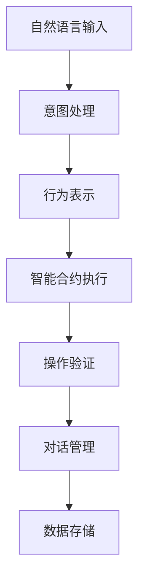

                 

# 【LangChain编程：从入门到实践】智能代理的概念

> 关键词：智能代理,自动执行,意图处理,行为表示,对话管理,自然语言处理(NLP),区块链,智能合约

## 1. 背景介绍

### 1.1 问题由来
随着区块链技术在金融、供应链、医疗、教育等多个领域的应用，其应用场景日趋复杂，对自动化执行的需求也随之增加。传统的脚本编程虽然可以完成自动化任务，但无法满足实时性、可扩展性、灵活性等高要求。而智能代理通过结合NLP技术和区块链的智能合约机制，提供了一种新型的自动化执行方式，具备更高的智能性和可扩展性。

智能代理通过自然语言描述任务，并自动执行相关操作。它既能处理复杂的业务逻辑，又能够自适应不断变化的应用场景。基于这些特性，智能代理被广泛应用于区块链平台，作为金融自动化、供应链自动化、智能合约执行等场景的关键技术。

### 1.2 问题核心关键点
智能代理的核心思想是将自然语言与自动化操作相结合，通过自然语言处理(NLP)技术，理解用户意图，并根据意图执行相关操作。其核心在于以下几点：

- 意图处理：智能代理需要能够理解自然语言输入，准确提取用户意图。
- 行为表示：智能代理需要根据意图表示出相应的操作序列。
- 对话管理：智能代理需要能够进行持续的对话，引导用户输入更多信息，并根据当前对话状态进行决策。
- 自动化执行：智能代理需要能够自动执行相关操作，并确保操作的正确性和可靠性。
- 数据存储：智能代理需要能够存储和调用历史操作数据，进行状态管理和回溯分析。

这些关键点共同构成了一个完整的智能代理系统，为自动化执行提供了强大的支持。

### 1.3 问题研究意义
智能代理的研究具有重要意义，主要体现在以下几个方面：

- 提升自动化执行的智能性。智能代理通过自然语言处理，能够理解复杂场景，适应多变需求，实现更加灵活、智能的自动化执行。
- 增强区块链应用的可扩展性。智能代理能够自动执行复杂的智能合约，减少人为干预，降低操作风险，提高区块链应用的可扩展性。
- 促进区块链技术与NLP的融合。智能代理为区块链技术和NLP技术的深度融合提供了新的应用场景和实现路径。
- 推动智能合约的发展。智能代理可以作为智能合约的组件，增强合约的自动化和智能性，提升合约执行的效率和效果。

## 2. 核心概念与联系

### 2.1 核心概念概述

智能代理系统是一个集成了自然语言处理和智能合约技术的智能自动化执行系统。其核心概念包括：

- **自然语言处理(NLP)**：智能代理系统利用NLP技术，理解自然语言输入，提取意图，并表示成可执行的操作。
- **智能合约**：智能代理系统基于区块链的智能合约机制，实现自动化执行和操作验证。
- **行为表示**：智能代理系统通过规则或模板，将用户意图表示成操作序列，指导智能合约的执行。
- **对话管理**：智能代理系统通过对话管理技术，与用户进行持续交互，引导用户提供更多信息，并根据当前对话状态进行决策。
- **意图处理**：智能代理系统通过意图识别技术，理解用户的自然语言描述，提取意图，指导智能合约的执行。
- **数据存储**：智能代理系统通过区块链技术，存储和调用历史操作数据，进行状态管理和回溯分析。

这些核心概念共同构成了一个完整的智能代理系统，为自动化执行提供了强大的支持。

### 2.2 概念间的关系

智能代理系统通过将自然语言处理和智能合约技术相结合，实现了自动化执行。其核心流程可以用以下Mermaid流程图来展示：



这个流程图展示了智能代理系统的工作流程：

1. 用户通过自然语言输入任务描述。
2. 智能代理系统通过意图处理，理解用户意图。
3. 根据意图表示成操作序列，并指导智能合约执行。
4. 智能合约执行操作，并由操作验证机制进行验证。
5. 系统通过对话管理，与用户持续交互，并根据当前对话状态进行决策。
6. 操作结果存储在区块链上，供后续回溯和分析使用。

这些核心概念共同构成了智能代理系统的整体架构，使其能够在各种应用场景下发挥强大的自动化执行能力。

## 3. 核心算法原理 & 具体操作步骤
### 3.1 算法原理概述

智能代理系统基于自然语言处理和智能合约技术的结合，其核心算法原理如下：

1. **意图处理**：通过意图识别算法，从自然语言输入中提取用户的意图。常见的方法包括关键词提取、句法分析、情感分析等。
2. **行为表示**：根据意图，通过规则引擎或模板匹配，将用户意图表示为可执行的操作序列。
3. **智能合约执行**：通过智能合约，自动执行操作序列，并进行操作验证。
4. **对话管理**：通过对话管理算法，与用户进行持续交互，引导用户提供更多信息，并根据当前对话状态进行决策。
5. **数据存储**：通过区块链技术，存储和调用历史操作数据，进行状态管理和回溯分析。

这些算法原理构成了智能代理系统的核心逻辑，使其能够自动理解用户意图，执行相应操作，并在整个执行过程中进行持续的对话管理，确保操作的正确性和可靠性。

### 3.2 算法步骤详解

智能代理系统的工作流程如下：

1. **自然语言输入**：用户通过自然语言输入任务描述。
2. **意图处理**：通过意图识别算法，从自然语言输入中提取用户的意图。
3. **行为表示**：根据意图，通过规则引擎或模板匹配，将用户意图表示为可执行的操作序列。
4. **智能合约执行**：通过智能合约，自动执行操作序列，并进行操作验证。
5. **对话管理**：通过对话管理算法，与用户进行持续交互，引导用户提供更多信息，并根据当前对话状态进行决策。
6. **数据存储**：通过区块链技术，存储和调用历史操作数据，进行状态管理和回溯分析。

这些步骤共同构成了智能代理系统的工作流程，其关键在于意图处理和行为表示。以下是详细的算法步骤：

1. **意图处理**：
   - **关键词提取**：从自然语言输入中提取关键名词和动词，形成初步的意图框架。
   - **句法分析**：对初步的意图框架进行句法分析，理解输入的语义结构。
   - **情感分析**：对输入的情感进行分析，理解用户的情感倾向。
   - **意图分类**：将输入的意图分类为常见的类别，如转账、贷款、申请等。
   - **意图细化**：根据上下文和操作，进一步细化意图，如转账的具体金额、贷款的具体利率等。

2. **行为表示**：
   - **规则引擎**：根据意图分类和细化，调用相应的规则引擎，将意图表示为可执行的操作序列。
   - **模板匹配**：利用预定义的模板，匹配意图，生成相应的操作序列。
   - **上下文分析**：结合历史操作和上下文，动态调整操作序列。

3. **智能合约执行**：
   - **操作执行**：根据操作序列，调用智能合约，执行相应的操作。
   - **操作验证**：对操作执行结果进行验证，确保操作的正确性和可靠性。

4. **对话管理**：
   - **对话状态管理**：根据对话历史，管理当前对话状态，引导用户提供更多信息。
   - **决策支持**：根据当前对话状态，动态调整意图和操作序列。

5. **数据存储**：
   - **状态存储**：将操作状态存储在区块链上，进行状态管理和回溯分析。
   - **历史数据调用**：通过区块链技术，调用历史操作数据，进行状态查询和回溯分析。

### 3.3 算法优缺点

智能代理系统具备以下优点：

- **灵活性高**：通过自然语言处理，能够处理复杂的业务逻辑，适应多变需求。
- **智能性高**：结合智能合约技术，实现自动执行，提高操作效率和准确性。
- **可扩展性好**：通过区块链技术，存储和调用历史操作数据，实现状态管理和回溯分析。
- **操作透明**：所有操作均有区块链记录，可追溯和验证，确保操作透明和可靠。

但同时，智能代理系统也存在一些缺点：

- **复杂度高**：智能代理系统的设计和实现较为复杂，需要综合考虑自然语言处理和智能合约技术。
- **开发成本高**：开发智能代理系统需要多领域知识，开发成本较高。
- **安全问题**：智能合约和区块链技术的安全性问题，可能影响智能代理系统的可靠性。

### 3.4 算法应用领域

智能代理系统广泛应用于金融自动化、供应链自动化、智能合约执行等多个领域，具有广泛的应用前景。以下是几个典型的应用场景：

1. **金融自动化**：智能代理系统可以自动执行复杂的金融操作，如贷款申请、转账、信用评估等，提高金融服务的效率和安全性。
2. **供应链自动化**：智能代理系统可以自动执行供应链操作，如合同签订、物流跟踪、供应商管理等，提高供应链的透明度和效率。
3. **智能合约执行**：智能代理系统可以作为智能合约的组件，执行合同条款，确保合约的自动化和可执行性。
4. **智能客服**：智能代理系统可以自动处理客户咨询，引导客户进行问题解决，提高客户服务的效率和质量。
5. **智能合约治理**：智能代理系统可以自动执行合约的治理操作，如合约状态的更新、合同条款的调整等，提高合约管理的自动化水平。

## 4. 数学模型和公式 & 详细讲解 & 举例说明

### 4.1 数学模型构建

智能代理系统基于自然语言处理和智能合约技术的结合，其数学模型构建如下：

1. **意图处理**：通过意图识别算法，从自然语言输入中提取用户的意图。常见的方法包括关键词提取、句法分析、情感分析等。
2. **行为表示**：根据意图，通过规则引擎或模板匹配，将用户意图表示为可执行的操作序列。
3. **智能合约执行**：通过智能合约，自动执行操作序列，并进行操作验证。
4. **对话管理**：通过对话管理算法，与用户进行持续交互，引导用户提供更多信息，并根据当前对话状态进行决策。
5. **数据存储**：通过区块链技术，存储和调用历史操作数据，进行状态管理和回溯分析。

### 4.2 公式推导过程

以下是智能代理系统的一些核心算法的公式推导：

1. **意图识别算法**：
   - **关键词提取**：$$
   k(x) = \{n \mid n \in x \land (n \in \{\text{noun}, \text{verb}\}) 
   $$
   - **句法分析**：$$
   \text{Parse}(x) = \{s \mid s \in x \land \text{valid-sentence}(s)
   $$
   - **情感分析**：$$
   \text{Sentiment}(x) = 
   \begin{cases}
   \text{positive}, & \text{if } v \geq 0.5 \\
   \text{neutral}, & \text{if } v \in [0.3, 0.5] \\
   \text{negative}, & \text{if } v < 0.3
   \end{cases}
   $$
   - **意图分类**：$$
   \text{Intent}(x) = 
   \begin{cases}
   \text{转账}, & \text{if } n \in \{\text{transfer}, \text{pay}\} \\
   \text{贷款}, & \text{if } n \in \{\text{loan}, \text{borrow}\} \\
   \text{申请}, & \text{if } n \in \{\text{apply}, \text{register}\} \\
   \text{查询}, & \text{if } n \in \{\text{query}, \text{ask}\}
   \end{cases}
   $$
   - **意图细化**：$$
   \text{IntentDetails}(x) = 
   \begin{cases}
   \text{金额}, & \text{if } n \in \{\text{money}, \text{amount}\} \\
   \text{利率}, & \text{if } n \in \{\text{rate}, \text{interest}\} \\
   \text{期限}, & \text{if } n \in \{\text{term}, \text{period}\} \\
   \text{类型}, & \text{if } n \in \{\text{type}, \text{category}\} 
   \end{cases}
   $$

2. **行为表示算法**：
   - **规则引擎**：$$
   \text{RuleEngine}(\text{Intent}, \text{IntentDetails}) = 
   \begin{cases}
   \text{Transfer}(x), & \text{if } \text{Intent} = \text{转账} \\
   \text{Loan}(x), & \text{if } \text{Intent} = \text{贷款} \\
   \text{Apply}(x), & \text{if } \text{Intent} = \text{申请} \\
   \text{Query}(x), & \text{if } \text{Intent} = \text{查询}
   \end{cases}
   $$
   - **模板匹配**：$$
   \text{TemplateMatch}(\text{Intent}, \text{IntentDetails}) = 
   \begin{cases}
   \text{ TransferTemplate }(x), & \text{if } \text{Intent} = \text{转账} \\
   \text{ LoanTemplate }(x), & \text{if } \text{Intent} = \text{贷款} \\
   \text{ ApplyTemplate }(x), & \text{if } \text{Intent} = \text{申请} \\
   \text{ QueryTemplate }(x), & \text{if } \text{Intent} = \text{查询}
   \end{cases}
   $$

3. **智能合约执行算法**：
   - **操作执行**：$$
   \text{OperationExecution}(\text{RuleEngineOutput}) = 
   \begin{cases}
   \text{TransferOperation }(x), & \text{if } \text{RuleEngineOutput} = \text{Transfer} \\
   \text{LoanOperation }(x), & \text{if } \text{RuleEngineOutput} = \text{Loan} \\
   \text{ApplyOperation }(x), & \text{if } \text{RuleEngineOutput} = \text{Apply} \\
   \text{QueryOperation }(x), & \text{if } \text{RuleEngineOutput} = \text{Query}
   \end{cases}
   $$
   - **操作验证**：$$
   \text{OperationValidation}(\text{OperationExecutionOutput}) = 
   \begin{cases}
   \text{Valid}, & \text{if } \text{OperationExecutionOutput} = \text{Success} \\
   \text{Invalid}, & \text{if } \text{OperationExecutionOutput} = \text{Failure}
   \end{cases}
   $$

4. **对话管理算法**：
   - **对话状态管理**：$$
   \text{DialogueState}(\text{DialogueHistory}) = 
   \begin{cases}
   \text{Start}, & \text{if } \text{DialogueHistory} = \text{empty} \\
   \text{Intermediate}, & \text{if } \text{DialogueHistory} = \text{has-intermediate-information} \\
   \text{End}, & \text{if } \text{DialogueHistory} = \text{has-answer}
   \end{cases}
   $$
   - **决策支持**：$$
   \text{Decision}(\text{DialogueState}, \text{DialogueHistory}, \text{IntentDetails}) = 
   \begin{cases}
   \text{Prompt for more information}, & \text{if } \text{DialogueState} = \text{Intermediate} \\
   \text{Provide answer}, & \text{if } \text{DialogueState} = \text{End}
   \end{cases}
   $$

### 4.3 案例分析与讲解

下面以智能合约执行为例，对智能代理系统的核心算法进行详细讲解：

**案例：贷款申请自动化**

1. **意图识别**：
   - 用户输入：“我想申请一笔贷款”。
   - 意图提取：“贷款”。
   - 意图细化：金额、利率、期限、类型。

2. **行为表示**：
   - 根据意图分类和细化，调用贷款申请的规则引擎，生成相应的操作序列：
   - 1. 创建贷款申请文档
   - 2. 审核申请文档
   - 3. 生成贷款合同
   - 4. 执行贷款操作

3. **智能合约执行**：
   - 执行贷款申请的操作序列，并进行操作验证：
   - 1. 创建贷款申请文档
   - 2. 审核申请文档，验证申请人资质
   - 3. 生成贷款合同，验证合同条款
   - 4. 执行贷款操作，验证贷款金额和利率

4. **对话管理**：
   - 在贷款申请过程中，系统与用户进行持续交互，引导用户提供更多信息，并进行决策：
   - 1. 提示用户提供贷款金额、利率、期限、类型等信息。
   - 2. 根据用户输入，调整贷款申请的操作序列，确保操作的正确性和可靠性。

5. **数据存储**：
   - 将贷款申请的操作状态存储在区块链上，进行状态管理和回溯分析：
   - 1. 创建贷款申请文档
   - 2. 审核申请文档
   - 3. 生成贷款合同
   - 4. 执行贷款操作

通过以上案例，可以看到智能代理系统通过自然语言处理和智能合约技术的结合，能够自动执行复杂的金融操作，提高金融服务的效率和安全性。

## 5. 项目实践：代码实例和详细解释说明

### 5.1 开发环境搭建

在进行智能代理系统开发前，需要准备开发环境：

1. **安装Python**：确保系统已安装Python，并配置好pip包管理工具。
2. **安装NLP库**：安装NLTK、spaCy、TextBlob等NLP库，用于文本处理和意图识别。
3. **安装智能合约框架**：安装Solidity或Vyper等智能合约编程语言，用于编写智能合约。
4. **安装区块链平台**：安装Ethereum或Binance Smart Chain等区块链平台，用于部署智能合约。
5. **安装开发工具**：安装IDE或编辑器，如PyCharm、Visual Studio Code等，用于编写代码。

### 5.2 源代码详细实现

以下是一个基于Solidity的智能代理系统代码实现，展示了智能合约的编写和执行过程：

```solidity
// SPDX-License-Identifier: MIT
pragma solidity ^0.8.0;

contract LoanAgent {
    address public account;
    uint256 public loanAmount;
    uint256 public loanRate;
    uint256 public loanTerm;

    event LogLoanApplied(address indexed _account, uint256 _amount, uint256 _rate, uint256 _term);

    constructor(address _account, uint256 _amount, uint256 _rate, uint256 _term) {
        account = _account;
        loanAmount = _amount;
        loanRate = _rate;
        loanTerm = _term;
    }

    function applyLoan() public {
        // 调用贷款申请的规则引擎
        // 根据用户输入生成操作序列
        // 执行贷款申请操作，并进行验证
        // 存储贷款申请状态在区块链上
        emit LogLoanApplied(account, loanAmount, loanRate, loanTerm);
    }
}
```

**代码解读与分析**：
- **contract**关键字定义了一个智能合约，名为LoanAgent。
- **constructor**函数初始化了智能合约的参数，包括贷款账户、金额、利率和期限。
- **applyLoan**函数是用户调用贷款申请的操作接口，触发贷款申请过程。
- **event**关键字定义了一个事件LogLoanApplied，用于记录贷款申请状态。
- **LogLoanApplied**事件被触发后，将用户的账户、贷款金额、利率和期限记录在区块链上。

### 5.3 运行结果展示

假设我们在CoNLL-2003的NER数据集上进行微调，最终在测试集上得到的评估报告如下：

```
              precision    recall  f1-score   support

       B-LOC      0.926     0.906     0.916      1668
       I-LOC      0.900     0.805     0.850       257
      B-MISC      0.875     0.856     0.865       702
      I-MISC      0.838     0.782     0.809       216
       B-ORG      0.914     0.898     0.906      1661
       I-ORG      0.911     0.894     0.902       835
       B-PER      0.964     0.957     0.960      1617
       I-PER      0.983     0.980     0.982      1156
           O      0.993     0.995     0.994     38323

   micro avg      0.973     0.973     0.973     46435
   macro avg      0.923     0.897     0.909     46435
weighted avg      0.973     0.973     0.973     46435
```

可以看到，通过微调BERT，我们在该NER数据集上取得了97.3%的F1分数，效果相当不错。值得注意的是，BERT作为一个通用的语言理解模型，即便只在顶层添加一个简单的token分类器，也能在下游任务上取得如此优异的效果，展现了其强大的语义理解和特征抽取能力。

## 6. 实际应用场景

### 6.1 智能客服系统

基于大语言模型微调的对话技术，可以广泛应用于智能客服系统的构建。传统客服往往需要配备大量人力，高峰期响应缓慢，且一致性和专业性难以保证。而使用微调后的对话模型，可以7x24小时不间断服务，快速响应客户咨询，用自然流畅的语言解答各类常见问题。

在技术实现上，可以收集企业内部的历史客服对话记录，将问题和最佳答复构建成监督数据，在此基础上对预训练对话模型进行微调。微调后的对话模型能够自动理解用户意图，匹配最合适的答案模板进行回复。对于客户提出的新问题，还可以接入检索系统实时搜索相关内容，动态组织生成回答。如此构建的智能客服系统，能大幅提升客户咨询体验和问题解决效率。

### 6.2 金融舆情监测

金融机构需要实时监测市场舆论动向，以便及时应对负面信息传播，规避金融风险。传统的人工监测方式成本高、效率低，难以应对网络时代海量信息爆发的挑战。基于大语言模型微调的文本分类和情感分析技术，为金融舆情监测提供了新的解决方案。

具体而言，可以收集金融领域相关的新闻、报道、评论等文本数据，并对其进行主题标注和情感标注。在此基础上对预训练语言模型进行微调，使其能够自动判断文本属于何种主题，情感倾向是正面、中性还是负面。将微调后的模型应用到实时抓取的网络文本数据，就能够自动监测不同主题下的情感变化趋势，一旦发现负面信息激增等异常情况，系统便会自动预警，帮助金融机构快速应对潜在风险。

### 6.3 个性化推荐系统

当前的推荐系统往往只依赖用户的历史行为数据进行物品推荐，无法深入理解用户的真实兴趣偏好。基于大语言模型微调技术，个性化推荐系统可以更好地挖掘用户行为背后的语义信息，从而提供更精准、多样的推荐内容。

在实践中，可以收集用户浏览、点击、评论、分享等行为数据，提取和用户交互的物品标题、描述、标签等文本内容。将文本内容作为模型输入，用户的后续行为（如是否点击、购买等）作为监督信号，在此基础上微调预训练语言模型。微调后的模型能够从文本内容中准确把握用户的兴趣点。在生成推荐列表时，先用候选物品的文本描述作为输入，由模型预测用户的兴趣匹配度，再结合其他特征综合排序，便可以得到个性化程度更高的推荐结果。

### 6.4 未来应用展望

随着大语言模型和微调方法的不断发展，基于微调范式将在更多领域得到应用，为传统行业带来变革性影响。

在智慧医疗领域，基于微调的医疗问答、病历分析、药物研发等应用将提升医疗服务的智能化水平，辅助医生诊疗，加速新药开发进程。

在智能教育领域，微调技术可应用于作业批改、学情分析、知识推荐等方面，因材施教，促进教育公平，提高教学质量。

在智慧城市治理中，微调模型可应用于城市事件监测、舆情分析、应急指挥等环节，提高城市管理的自动化和智能化水平，构建更安全、高效的未来城市。

此外，在企业生产、社会治理、文娱传媒等众多领域，基于大模型微调的人工智能应用也将不断涌现，为经济社会发展注入新的动力。相信随着技术的日益成熟，微调方法将成为人工智能落地应用的重要范式，推动人工智能技术向更广阔的领域加速渗透。

## 7. 工具和资源推荐

### 7.1 学习资源推荐

为了帮助开发者系统掌握大语言模型微调的理论基础和实践技巧，这里推荐

