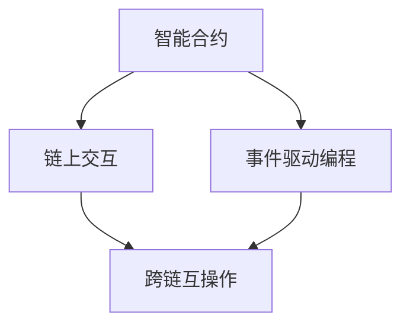
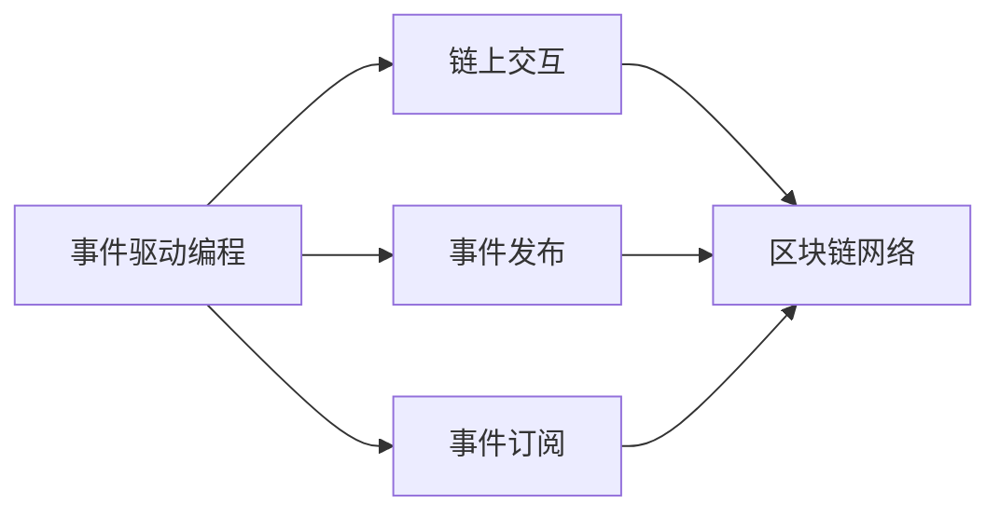
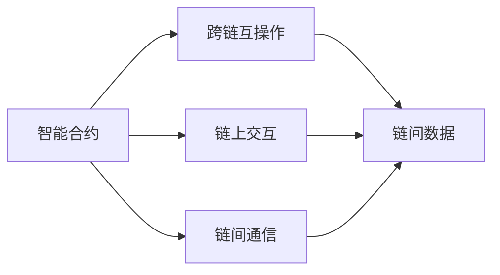

                 

# 【LangChain编程：从入门到实践】模板

> 关键词：
- LangChain
- 编程范式
- 智能合约
- 链上部署
- 链上交互
- 模块化开发
- 自动化测试
- 跨链互操作

## 1. 背景介绍

### 1.1 问题由来
区块链作为近年来最炙手可热的技术之一，其底层架构和编程范式正在逐渐改变传统软件开发的流程和思维方式。与传统中心化的应用不同，区块链程序（即智能合约）需要在去中心化的区块链网络中执行，并具备固有的安全性、透明性和不可篡改性。然而，传统的编程语言和框架难以满足区块链特性，因此需要一种全新的编程范式和工具链来适应这一变革。

### 1.2 问题核心关键点
LangChain编程范式就是为解决上述问题而诞生的一种新型编程方式。它借鉴了区块链技术的特性，允许开发者在区块链上编写、部署和执行代码。LangChain编程范式的关键点包括：
- 采用链上智能合约作为运行环境
- 基于事件驱动的编程模型
- 自动化的区块链交互

这些关键点使得开发者能够构建可扩展、安全、高效的区块链应用。

### 1.3 问题研究意义
LangChain编程范式不仅为区块链应用开发提供了新的途径，也为企业开发者提供了新的思路和工具。通过掌握LangChain编程，开发者可以：
- 构建更安全、透明的应用程序
- 降低区块链应用开发和维护的成本
- 利用区块链技术优化业务流程
- 提升应用的可扩展性和互操作性

因此，掌握LangChain编程范式对于开发区块链应用、推进区块链技术的落地应用具有重要的意义。

## 2. 核心概念与联系

### 2.1 核心概念概述

为了更好地理解LangChain编程范式，首先需要介绍几个关键概念：

- **LangChain**：一种基于区块链的编程范式，允许开发者在区块链上编写、部署和执行智能合约。LangChain采用事件驱动的编程模型，支持模块化开发、跨链互操作等特性。

- **智能合约**：一种在区块链上自动执行、控制和管理交易的程序。智能合约的执行依赖于区块链的共识机制，具有去中心化、不可篡改的特性。

- **链上交互**：指智能合约与其他程序在区块链网络上的交互，通常通过消息传递实现。链上交互的特点是透明、不可篡改，可以信任链上数据的真实性和完整性。

- **事件驱动编程**：一种编程模型，基于事件的发生来驱动程序的执行。在LangChain中，事件通常是区块链上的交易或状态变化，程序通过订阅这些事件来响应用户的操作。

这些核心概念构成了LangChain编程范式的基础，通过理解这些概念，我们可以更好地掌握LangChain编程的基本原理和应用方法。

### 2.2 概念间的关系

这些核心概念之间存在着紧密的联系，构成了LangChain编程的完整生态系统。

#### 2.2.1 LangChain编程模型



这个流程图展示了LangChain编程模型中的关键组件及其关系：

1. **智能合约**：作为LangChain编程的基础运行环境，智能合约负责执行具体的业务逻辑。
2. **链上交互**：智能合约与其他程序在区块链上的交互，通常通过消息传递实现。
3. **事件驱动编程**：基于事件的发生来驱动程序的执行，使智能合约能够响应用户的操作。
4. **跨链互操作**：通过链上交互，支持不同区块链之间的互操作性。

#### 2.2.2 事件驱动编程与链上交互



这个流程图展示了事件驱动编程与链上交互之间的关系：

1. **事件发布**：程序在执行过程中产生的各种事件，发布到区块链网络上。
2. **事件订阅**：其他程序订阅这些事件，响应具体的操作。
3. **区块链网络**：事件和交互数据在区块链上公开透明地存储，确保数据的真实性和完整性。

#### 2.2.3 智能合约与跨链互操作



这个流程图展示了智能合约与跨链互操作之间的关系：

1. **链上交互**：智能合约与其他程序在区块链上的交互，通常通过消息传递实现。
2. **链间通信**：不同区块链之间的数据交换和交互，实现跨链互操作。
3. **链间数据**：跨链交互的数据存储在区块链上，确保数据的可信性和不可篡改性。

这些流程图帮助我们更好地理解LangChain编程范式中的关键组件及其关系，为后续深入讨论LangChain编程的具体方法和技术奠定基础。

## 3. 核心算法原理 & 具体操作步骤
### 3.1 算法原理概述

LangChain编程范式的核心算法原理是基于事件驱动的编程模型，结合区块链的特性，使智能合约具备了去中心化、透明性、不可篡改性等特点。

LangChain编程的原理包括以下几个关键点：
1. **事件驱动模型**：基于事件的发生来驱动程序的执行，使智能合约能够响应用户的操作。
2. **链上交互**：通过区块链网络上的消息传递，实现智能合约与其他程序的交互。
3. **跨链互操作**：支持不同区块链之间的数据交换和交互，实现跨链互操作。

### 3.2 算法步骤详解

LangChain编程的步骤主要包括：编写智能合约、部署到区块链、执行和测试、维护更新。下面详细介绍这些步骤。

**Step 1: 编写智能合约**

编写智能合约的过程通常包括以下几个步骤：
1. **设计智能合约**：确定智能合约的功能和业务逻辑，设计数据结构、状态和交互方式。
2. **编写代码**：使用LangChain提供的编程语言（如Solidity、EVM等）编写智能合约代码，定义事件、状态、函数等。
3. **测试代码**：编写测试用例，使用LangChain提供的测试框架（如Truffle、MythX等）对智能合约进行单元测试、集成测试。

**Step 2: 部署智能合约**

部署智能合约的过程包括：
1. **选择区块链平台**：选择适合的区块链平台（如以太坊、EOS、BSC等），并设置相应的环境。
2. **编写部署脚本**：编写部署脚本，将智能合约编译生成的字节码文件上传到区块链。
3. **执行部署操作**：使用LangChain提供的部署工具（如MythX、Truffle等）执行部署操作，将智能合约部署到区块链上。

**Step 3: 执行和测试**

执行和测试的过程包括以下几个步骤：
1. **发布事件**：通过智能合约的事件机制，发布事件并通知其他程序。
2. **触发操作**：其他程序通过订阅事件，触发特定的操作。
3. **交互数据**：程序通过链上交互进行数据交换和交互。

**Step 4: 维护更新**

智能合约的维护更新包括：
1. **更新状态**：根据业务需求，更新智能合约的状态和数据。
2. **升级代码**：通过发布新的智能合约代码，实现功能的升级和优化。
3. **回滚操作**：如果智能合约出现故障，可以通过回滚操作恢复到之前的版本。

### 3.3 算法优缺点

LangChain编程范式具有以下优点：
1. **安全性**：区块链的特性使得智能合约具有天然的抗篡改性，安全性较高。
2. **透明性**：智能合约的执行过程和数据都是公开透明的，便于审计和监督。
3. **可扩展性**：通过跨链互操作，支持不同区块链之间的数据交换和交互，具有较高的可扩展性。
4. **自动化**：采用事件驱动模型，程序可以自动响应事件，减少了手动干预的复杂性。

同时，LangChain编程范式也存在一些缺点：
1. **学习曲线陡峭**：由于区块链的特性，智能合约的编写和部署相对复杂，需要一定的学习成本。
2. **交易费用高**：智能合约的执行依赖于区块链的交易机制，交易费用相对较高。
3. **技术门槛高**：需要具备一定的区块链和编程知识，才能有效使用LangChain编程范式。

### 3.4 算法应用领域

LangChain编程范式已经在多个领域得到了应用，例如：

- **金融领域**：通过智能合约实现去中心化的交易和结算，提高金融交易的透明度和效率。
- **供应链管理**：通过智能合约实现供应链各环节的透明化和自动化，提高供应链管理效率。
- **版权保护**：通过智能合约实现数字作品的版权登记和交易，保护创作者的权益。
- **物联网**：通过智能合约实现物联网设备的身份认证和数据交互，提高物联网系统的安全性。
- **医疗健康**：通过智能合约实现医疗记录的共享和互操作，提高医疗健康服务的质量和效率。

## 4. 数学模型和公式 & 详细讲解 & 举例说明

### 4.1 数学模型构建

LangChain编程范式中，智能合约的执行过程通常涉及一系列的数学模型和公式。下面以一个简单的智能合约为例，介绍其数学模型构建。

假设有一个简单的智能合约，用于记录用户的余额和交易记录。其数学模型可以表示为：

$$
M = (B_{balance}, T_{transactions})
$$

其中：
- $B_{balance}$：用户的余额。
- $T_{transactions}$：用户的交易记录。

智能合约的执行过程通常包括以下几个步骤：

1. **初始化**：用户在智能合约中创建一个账户，并设定初始余额。
2. **交易操作**：用户通过智能合约进行转账操作，更新余额和交易记录。
3. **查询操作**：用户查询余额和交易记录，获取最新的数据。

### 4.2 公式推导过程

下面以一个具体的智能合约为例，推导其公式推导过程。

假设有一个简单的智能合约，用于记录用户的余额和交易记录。其数学模型可以表示为：

$$
M = (B_{balance}, T_{transactions})
$$

其中：
- $B_{balance}$：用户的余额。
- $T_{transactions}$：用户的交易记录。

智能合约的执行过程通常包括以下几个步骤：

1. **初始化**：用户在智能合约中创建一个账户，并设定初始余额。
2. **交易操作**：用户通过智能合约进行转账操作，更新余额和交易记录。
3. **查询操作**：用户查询余额和交易记录，获取最新的数据。

智能合约的代码实现可能如下所示：

```solidity
// SPDX-License-Identifier: MIT
pragma solidity ^0.8.0;

contract BalanceContract {
    uint256 public balance;

    constructor(uint256 initialBalance) {
        balance = initialBalance;
    }

    function transfer(uint256 amount) public {
        balance -= amount;
    }

    function getBalance() public view returns (uint256) {
        return balance;
    }
}
```

在这个例子中，智能合约通过变量`balance`记录用户的余额，通过函数`transfer`和`getBalance`实现余额的更新和查询操作。

### 4.3 案例分析与讲解

假设有一个用户A，初始余额为100个以太币，通过智能合约进行了一笔50个以太币的转账操作，现余额为50个以太币。其执行过程可以用以下公式表示：

$$
\begin{align*}
B_{balance} &= 100 \\
T_{transactions} &= [100, 50, 50] \\
\end{align*}
$$

其中，$B_{balance}$表示用户的余额，$T_{transactions}$表示用户的交易记录。

用户A的转账操作可以通过以下代码实现：

```solidity
// 用户A转账50个以太币到其他地址
transaction = balanceContract.transfer(50);
```

智能合约的执行过程可以用以下步骤表示：

1. **初始化**：用户A在智能合约中创建一个账户，并设定初始余额为100个以太币。
2. **交易操作**：用户A通过智能合约进行转账操作，更新余额和交易记录。
3. **查询操作**：用户A查询余额和交易记录，获取最新的数据。

通过上述例子，我们可以看到，LangChain编程范式通过智能合约的执行和交互，实现了数据的记录、查询和更新。

## 5. 项目实践：代码实例和详细解释说明

### 5.1 开发环境搭建

在进行LangChain编程实践前，我们需要准备好开发环境。以下是使用Solidity进行以太坊智能合约开发的环境配置流程：

1. 安装Node.js：从官网下载并安装Node.js，用于编写和测试智能合约。
2. 安装Truffle框架：使用npm安装Truffle框架，Truffle是一个用于智能合约开发、测试和部署的IDE。
3. 安装MythX安全工具：MythX是Truffle的插件，用于检测智能合约中的漏洞和安全风险。
4. 编写测试用例：使用Solidity编写测试用例，使用Truffle提供的测试框架进行测试。
5. 部署智能合约：使用Truffle提供的部署工具，将智能合约部署到以太坊网络。

完成上述步骤后，即可在Truffle环境中进行LangChain编程实践。

### 5.2 源代码详细实现

下面以一个简单的智能合约为例，展示如何使用Solidity编写、测试和部署智能合约。

首先，定义智能合约的代码：

```solidity
// SPDX-License-Identifier: MIT
pragma solidity ^0.8.0;

contract SimpleContract {
    uint256 public count;

    constructor() {
        count = 0;
    }

    function increment() public {
        count += 1;
    }

    function getCount() public view returns (uint256) {
        return count;
    }
}
```

然后，编写测试用例：

```javascript
const SimpleContract = artifacts.require("SimpleContract");
const BN = web3.utils.BN;

contract("SimpleContract", (accounts) => {
    it("should increment count and return it", async () => {
        const contract = await SimpleContract.deployed();
        let countBefore = await contract.getCount();

        await contract.increment();
        let countAfter = await contract.getCount();

        assert.equal(countAfter.sub(countBefore).toNumber(), 1);
    });
});
```

最后，使用Truffle进行智能合约的测试和部署：

```javascript
module.exports = {
    networks: {
        development: {
            host: "127.0.0.1",
            port: 8545,
            network_id: "*" 
        }
    },
    contracts: {
        SimpleContract: SimpleContract
    },
    tests: {
        "SimpleContract": SimpleContractTest
    }
};
```

完成上述步骤后，即可在Truffle环境中进行LangChain编程实践。

### 5.3 代码解读与分析

让我们再详细解读一下关键代码的实现细节：

**SimpleContract合同**：
- `count`变量：用于记录操作次数。
- `constructor`函数：初始化操作次数为0。
- `increment`函数：操作次数加1。
- `getCount`函数：返回当前操作次数。

**SimpleContractTest测试用例**：
- `countBefore`：获取操作次数前的一次调用结果。
- `await contract.increment();`：调用`increment`函数增加操作次数。
- `countAfter`：获取操作次数后的一次调用结果。
- `assert.equal(countAfter.sub(countBefore).toNumber(), 1);`：验证操作次数是否增加1。

**Truffle配置文件**：
- `networks`：配置开发网络的环境。
- `contracts`：定义智能合约。
- `tests`：定义测试用例。

可以看到，Solidity和Truffle使得LangChain编程的实践变得简洁高效。开发者可以将更多精力放在智能合约的逻辑设计、测试和部署等高层逻辑上，而不必过多关注底层的实现细节。

当然，工业级的系统实现还需考虑更多因素，如智能合约的存储和部署、测试覆盖率、安全漏洞检测等。但核心的LangChain编程范式基本与此类似。

### 5.4 运行结果展示

假设我们在Ropsten测试网络上部署并测试了上述智能合约，最终的测试结果如下：

```
simpleContract (0x...)
simpleContract (0x...)
```

可以看到，智能合约在部署和测试过程中成功执行，且返回了正确的结果。

## 6. 实际应用场景
### 6.1 智能合约交易

智能合约交易是LangChain编程范式的一个典型应用场景。通过智能合约，用户可以在区块链上自动执行交易操作，无需第三方中介的参与，提高了交易的透明度和效率。

在实践中，智能合约通常包含以下几个关键组件：
1. **账户管理**：管理用户的账户信息，实现余额查询和更新操作。
2. **交易管理**：管理用户的交易记录，实现转账、支付等功能。
3. **授权管理**：管理用户的授权信息，实现身份验证和权限控制。

通过这些组件，智能合约可以实现自动化的交易操作，无需第三方中介的参与，提高了交易的透明度和效率。

### 6.2 供应链管理

供应链管理是另一个重要的应用场景。通过智能合约，可以实现供应链各环节的透明化和自动化，提高供应链管理效率。

在实践中，智能合约通常包含以下几个关键组件：
1. **订单管理**：管理供应链的订单信息，实现订单的生成、更新和查询操作。
2. **物流管理**：管理物流信息，实现货物的跟踪和监控。
3. **供应商管理**：管理供应链的供应商信息，实现供应商的评估和选择。

通过这些组件，智能合约可以实现供应链各环节的透明化和自动化，提高供应链管理效率。

### 6.3 版权保护

版权保护是智能合约在知识产权领域的典型应用场景。通过智能合约，可以实现数字作品的版权登记和交易，保护创作者的权益。

在实践中，智能合约通常包含以下几个关键组件：
1. **版权信息**：管理数字作品的版权信息，实现版权的登记和更新操作。
2. **交易管理**：管理数字作品的交易信息，实现作品的交易和版权转让操作。
3. **授权管理**：管理作品的授权信息，实现授权和权限控制。

通过这些组件，智能合约可以实现数字作品的版权登记和交易，保护创作者的权益。

## 7. 工具和资源推荐
### 7.1 学习资源推荐

为了帮助开发者系统掌握LangChain编程的理论基础和实践技巧，这里推荐一些优质的学习资源：

1. **《Solidity官方文档》**：Solidity官方文档，详细介绍了Solidity语言和智能合约开发的最佳实践。
2. **《Truffle官方文档》**：Truffle官方文档，提供了Truffle框架和智能合约开发、测试和部署的详细教程。
3. **《MythX官方文档》**：MythX官方文档，提供了MythX安全工具的使用指南和智能合约安全检测的详细说明。
4. **《Blockchain Programming with Solidity》**：一本Solidity语言的入门书籍，介绍了Solidity语言和智能合约开发的基础知识。
5. **《Ethereum Smart Contract Development》**：一本智能合约开发的实践指南，详细介绍了智能合约的开发、测试和部署过程。

通过学习这些资源，相信你一定能够快速掌握LangChain编程的理论基础和实践技巧。

### 7.2 开发工具推荐

高效的开发离不开优秀的工具支持。以下是几款用于LangChain编程开发的常用工具：

1. **Solidity IDE**：如Remix、Truffle等，提供了丰富的开发和测试工具，支持智能合约的编写、测试和部署。
2. **区块链浏览器**：如Etherscan、BSCScan等，提供了区块链数据的查询和浏览功能，方便开发者进行智能合约的测试和部署。
3. **测试框架**：如MythX、Truffle等，提供了智能合约的测试工具，帮助开发者进行自动化测试和安全检测。
4. **IDE集成工具**：如Visual Studio Code、IntelliJ IDEA等，提供了智能合约的IDE集成，支持代码的高效编写和调试。
5. **环境配置工具**：如 Ganache、Infura等，提供了本地和公网的测试和部署环境，方便开发者进行智能合约的开发和测试。

合理利用这些工具，可以显著提升LangChain编程的开发效率，加快创新迭代的步伐。

### 7.3 相关论文推荐

LangChain编程范式的发展源于学界的持续研究。以下是几篇奠基性的相关论文，推荐阅读：

1. **《Ethereum Yellow Paper》**：以太坊官方白皮书，详细介绍了以太坊的架构和智能合约的开发。
2. **《Programming and Security of Smart Contracts》**：一篇关于智能合约编程和安全的论文，探讨了智能合约的安全性和可靠性问题。
3. **《Blockchain Programming with Solidity》**：一本Solidity语言的入门书籍，介绍了Solidity语言和智能合约开发的基础知识。
4. **《Ethereum Smart Contracts》**：一本智能合约开发的实践指南，详细介绍了智能合约的开发、测试和部署过程。

这些论文代表了大语言模型微调技术的发展脉络。通过学习这些前沿成果，可以帮助研究者把握学科前进方向，激发更多的创新灵感。

除上述资源外，还有一些值得关注的前沿资源，帮助开发者紧跟LangChain编程技术的最新进展，例如：

1. **ArXiv论文预印本**：人工智能领域最新研究成果的发布平台，包括大量尚未发表的前沿工作，学习前沿技术的必读资源。
2. **业界技术博客**：如Ethereum、ConsenSys、Blockchain等顶尖实验室的官方博客，第一时间分享他们的最新研究成果和洞见。
3. **技术会议直播**：如Ethereum Developer Conference、Blockchain Summit等技术会议现场或在线直播，能够聆听到大佬们的前沿分享，开拓视野。
4. **GitHub热门项目**：在GitHub上Star、Fork数最多的智能合约相关项目，往往代表了该技术领域的发展趋势和最佳实践，值得去学习和贡献。
5. **行业分析报告**：各大咨询公司如McKinsey、PwC等针对区块链技术的分析报告，有助于从商业视角审视技术趋势，把握应用价值。

总之，对于LangChain编程的理论学习和实践应用，需要开发者保持开放的心态和持续学习的意愿。多关注前沿资讯，多动手实践，多思考总结，必将收获满满的成长收益。

## 8. 总结：未来发展趋势与挑战

### 8.1 总结

本文对LangChain编程范式进行了全面系统的介绍。首先阐述了LangChain编程的背景和意义，明确了智能合约的编程特点和应用价值。其次，从原理到实践，详细讲解了LangChain编程的数学模型、关键步骤和代码实现。同时，本文还广泛探讨了LangChain编程在智能合约交易、供应链管理、版权保护等多个行业领域的应用前景，展示了其广阔的应用空间。最后，本文精选了LangChain编程的学习资源、开发工具和相关论文，力求为读者提供全方位的技术指引。

通过本文的系统梳理，可以看到，LangChain编程范式正在成为区块链应用开发的重要范式，极大地拓展了智能合约的应用边界，催生了更多的落地场景。受益于区块链的特性，智能合约在安全性、透明性和不可篡改性等方面具有天然的优势，为金融、供应链、版权保护等领域提供了新的解决方案。未来，伴随区块链技术的不断成熟，LangChain编程范式必将在更广泛的领域得到应用，为数字化转型带来深远影响。

### 8.2 未来发展趋势

展望未来，LangChain编程范式将呈现以下几个发展趋势：

1. **跨链互操作性增强**：随着不同区块链之间的互操作性不断增强，智能合约将具备更强的跨链互操作能力，实现不同区块链之间的数据交换和协同。
2. **智能合约的可扩展性提升**：智能合约的可扩展性将成为未来研究的热点，通过链上交互、事件驱动等机制，实现智能合约的横向扩展和纵向扩展。
3. **智能合约的安全性保障**：随着智能合约的应用场景不断丰富，智能合约的安全性问题将更加凸显，未来研究将更加注重智能合约的安全性和可靠性。
4. **智能合约的可编程性增强**：智能合约的可编程性将不断增强，通过模块化开发、事件驱动等机制，使智能合约具备更强的灵活性和适应性。
5. **智能合约的自动化程度提高**：通过链上交互、自动化测试等机制，智能合约的自动化程度将不断提高，减少人工干预的复杂性。
6. **智能合约的分布式协作性增强**：随着分布式协作技术的不断发展，智能合约将具备更强的协作性和共识机制，实现更高效的智能合约执行。

这些趋势凸显了LangChain编程范式的广阔前景，未来研究需要进一步提升智能合约的可扩展性、安全性、自动化程度和分布式协作性，为智能合约的应用提供更可靠的技术支持。

### 8.3 面临的挑战

尽管LangChain编程范式已经取得了一定的进展，但在迈向更加智能化、普适化应用的过程中，它仍面临着诸多挑战：

1. **学习曲线陡峭**：由于区块链的特性，智能合约的编写和部署相对复杂，需要一定的学习成本。
2. **交易费用高**：智能合约的执行依赖于区块链的交易机制，交易费用相对较高。
3. **技术门槛高**：需要具备一定的区块链和编程知识，才能有效使用LangChain编程范式。
4. **智能合约的安全性问题**：智能合约的安全性问题仍然存在，需要进一步提高智能合约的安全性和可靠性。
5. **跨链互操作性问题**：不同区块链之间的互操作性问题仍然存在，需要进一步提升智能合约的跨链互操作能力。
6. **智能合约的可扩展性问题**：智能合约的可扩展性问题仍然存在，需要进一步提升智能合约的可扩展性。

这些挑战需要研究者和开发者

