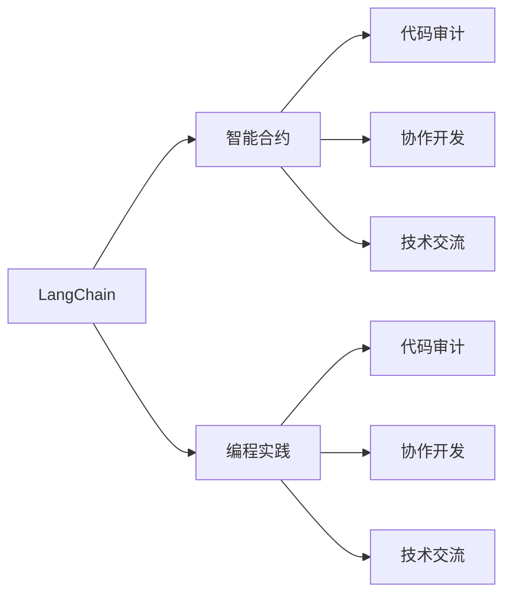
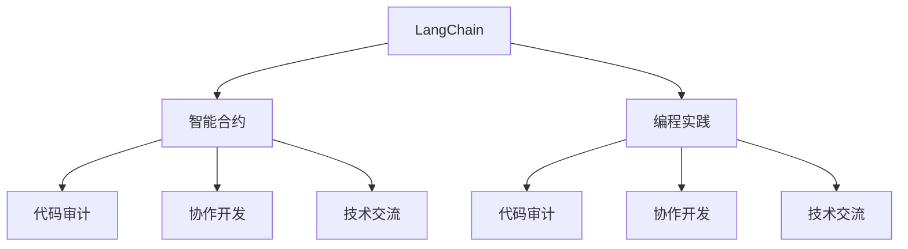

                 

# 【LangChain编程：从入门到实践】社区贡献

> 关键词：LangChain, 社区贡献, 编程实践, 区块链, 智能合约, 代码审计, 协作开发, 技术交流, 开源社区

## 1. 背景介绍

随着Web3的兴起，基于区块链的技术正逐步渗透到数字经济的各个领域。作为一种去中心化的分布式账本技术，区块链提供了可靠、透明、可验证的资产管理和交易方式。而LangChain，作为一款开源区块链开发平台，旨在通过简化编程接口和工具链，降低区块链开发的门槛，让更多开发者和机构能够轻松构建基于区块链的智能合约、应用和系统。

在LangChain社区中，开发者的贡献不仅限于代码编写，还包括社区治理、项目维护、技术交流等多个方面。本文将详细探讨LangChain社区的贡献方式，包括编程实践、代码审计、协作开发、技术交流等方面的具体操作和要点，帮助新入场的开发者更好地融入社区，贡献自己的力量。

## 2. 核心概念与联系

### 2.1 核心概念概述

在探讨社区贡献之前，首先介绍几个核心概念：

- **LangChain**：一个开源的区块链平台，旨在通过简化编程接口和工具链，降低区块链开发门槛，使得开发基于区块链的应用变得更加容易。
- **智能合约**：部署在区块链上的程序，通常用于自动化执行和操作资产管理。
- **代码审计**：对代码进行审查和验证的过程，以确保代码的安全性、正确性和质量。
- **协作开发**：多个开发者共同参与项目，分工合作，共同完成开发任务的过程。
- **技术交流**：开发者之间就技术问题、开发经验、未来方向等进行的交流和讨论。

这些概念共同构成了LangChain社区的核心。理解这些概念之间的关系，对于贡献者而言尤为重要。以下是一个简单的Mermaid流程图，展示了这些核心概念的相互联系：



### 2.2 概念间的关系

这些核心概念之间的关系可以通过下图进一步说明：



- LangChain为智能合约的开发提供了平台和工具。
- 智能合约的开发和部署需要进行代码审计，以确保其安全和正确性。
- 智能合约的开发通常是一个协作过程，需要多人的共同努力。
- 技术交流是开发者之间分享经验、解决技术问题的重要途径。
- 编程实践是智能合约开发的基础，是协作开发和技术交流的基础。

这些概念共同构成了LangChain社区的完整生态系统。

## 3. 核心算法原理 & 具体操作步骤

### 3.1 算法原理概述

LangChain社区的贡献方式涵盖了编程实践、代码审计、协作开发、技术交流等多个方面。以下将详细介绍这些方面的核心算法原理。

- **编程实践**：使用LangChain平台提供的编程接口和工具链，开发智能合约、应用和系统。
- **代码审计**：使用工具进行静态和动态代码分析，确保代码的质量和安全。
- **协作开发**：使用Git等版本控制工具，进行代码管理、任务分配和进度跟踪。
- **技术交流**：使用社交媒体、论坛等平台，进行技术讨论和经验分享。

### 3.2 算法步骤详解

接下来，我们将详细讲解每种贡献方式的详细步骤：

#### 3.2.1 编程实践

1. **选择项目**：根据自身兴趣和能力，选择一个感兴趣的项目，并查看项目的贡献指南。
2. **环境搭建**：安装必要的开发环境和工具链，如IDE、编译器、版本控制工具等。
3. **开发环境**：创建开发分支，编写代码，并在本地测试和调试。
4. **提交代码**：将代码提交到Git仓库，并编写详细的提交说明。
5. **代码合并**：项目负责人审核代码，并将其合并到主分支。
6. **部署测试**：部署代码到测试网络，进行全面的测试。
7. **代码审计**：使用工具进行静态和动态代码审计，确保代码质量和安全性。
8. **发布上线**：通过发布工具将代码发布到主网络，并更新文档和文档。

#### 3.2.2 代码审计

1. **选择合适的审计工具**：如MythX、Slither等，对代码进行静态和动态分析。
2. **配置审计规则**：根据项目的特定需求，配置审计规则和检查项。
3. **执行审计**：运行审计工具，对代码进行自动检查。
4. **审查发现**：记录和报告审计工具发现的漏洞和问题。
5. **修复漏洞**：根据审计结果，修复代码中的漏洞和问题。
6. **重复审计**：对修复后的代码进行审计，确保问题已完全解决。

#### 3.2.3 协作开发

1. **创建仓库**：在GitHub或Gitee上创建项目仓库，并进行初始化配置。
2. **任务分配**：根据项目的需求，将任务分配给多个开发者，并指定负责人。
3. **任务执行**：开发者根据分配的任务，编写代码并进行测试。
4. **代码合并**：任务完成后，开发者将代码提交到Git仓库，并进行合并。
5. **代码审查**：项目负责人审核代码，并提出修改意见。
6. **问题解决**：开发者根据负责人提出的意见，进行修改并重新提交代码。
7. **进度跟踪**：使用Jira、Trello等工具，跟踪任务的进度和状态。

#### 3.2.4 技术交流

1. **选择平台**：选择合适的技术交流平台，如社交媒体、论坛、Slack等。
2. **发布内容**：撰写技术文章、分享开发经验、提出技术问题。
3. **回复交流**：积极回复其他开发者的问题和评论，进行技术讨论。
4. **组织活动**：组织线上或线下的技术讨论会、编程竞赛等活动。
5. **贡献资料**：编写文档、教程、代码示例等资料，帮助其他开发者学习和使用LangChain。

### 3.3 算法优缺点

 LangChain社区的贡献方式具有以下优点：

- **开源共享**：社区成员的贡献均开源共享，提升了项目的透明度和可维护性。
- **经验交流**：社区提供了技术交流的平台，促进了知识和经验的分享和传播。
- **快速迭代**：协作开发方式，使得项目能够快速迭代和更新。

同时，这些贡献方式也存在一些缺点：

- **学习成本**：新成员需要花时间学习和适应社区的工作流程和工具。
- **时间投入**：贡献过程需要花费较多的时间和精力。
- **多样性不足**：社区成员的地域和背景不同，可能导致多样性不足，影响项目的全面性。

### 3.4 算法应用领域

LangChain社区的贡献方式适用于各种区块链应用和系统，包括但不限于智能合约、去中心化应用(DApps)、供应链管理、金融服务、物联网等。这些贡献方式可以应用于不同的应用场景和项目需求。

## 4. 数学模型和公式 & 详细讲解 & 举例说明

### 4.1 数学模型构建

在LangChain社区的贡献中，涉及到了许多数学模型和公式。以下将简要介绍其中的一些。

#### 4.1.1 编程实践的数学模型

在编程实践中，我们通常使用以下数学模型来描述编程过程：

- **状态机**：描述智能合约的执行流程和状态变化。
- **队列**：描述任务的分配和执行顺序。
- **图**：描述协作开发中各个成员之间的依赖关系。

#### 4.1.2 代码审计的数学模型

代码审计过程中，我们通常使用以下数学模型来描述审计过程：

- **布尔逻辑**：描述代码漏洞和问题的逻辑关系。
- **数理统计**：描述代码审计的概率模型，如错误率、漏洞率的统计。
- **线性代数**：描述代码审计中的矩阵运算和优化算法。

#### 4.1.3 协作开发的数学模型

协作开发过程中，我们通常使用以下数学模型来描述协作过程：

- **线性规划**：描述任务分配和资源优化的问题。
- **图论**：描述协作网络中的成员关系和信息流动。
- **博弈论**：描述协作过程中各成员之间的策略和竞争。

#### 4.1.4 技术交流的数学模型

技术交流过程中，我们通常使用以下数学模型来描述交流过程：

- **信息熵**：描述技术交流中信息量的多少和分布。
- **回归分析**：描述技术交流中知识传播和应用的模型。
- **博弈论**：描述技术交流中各成员之间的互动和合作。

### 4.2 公式推导过程

以下将简要介绍这些数学模型和公式的推导过程：

#### 4.2.1 编程实践的公式推导

- **状态机**：
  - 定义状态集合 $S$：$S = \{s_1, s_2, \ldots, s_n\}$
  - 定义转移函数 $T$：$T = \{(s_i, s_j, a)\}$
  - 定义状态转移矩阵 $A$：$A = (a_{ij})$
  - 推导公式：$s_{i+1} = A \cdot s_i$
- **队列**：
  - 定义队列 $Q$：$Q = (q_1, q_2, \ldots, q_m)$
  - 定义队列长度 $L$：$L = |Q|$
  - 定义队列操作 $Enqueue(Q, x)$ 和 $Dequeue(Q)$
  - 推导公式：$Q = (Q \cdot x) - (Q \cdot 1)$
- **图**：
  - 定义图 $G = (V, E)$
  - 定义顶点集合 $V$ 和边集合 $E$
  - 定义路径集合 $P$：$P = \{(p_1, p_2, \ldots, p_n)\}$
  - 推导公式：$P = V \cdot E^n$
- **图论**：
  - 定义图 $G = (V, E)$
  - 定义顶点集合 $V$ 和边集合 $E$
  - 定义图论中的各类算法，如深度优先搜索、广度优先搜索、最短路径算法等。
  - 推导公式：$P = V \cdot E^n$

#### 4.2.2 代码审计的公式推导

- **布尔逻辑**：
  - 定义布尔表达式 $B$：$B = \{(b_1, b_2, \ldots, b_n)\}$
  - 定义逻辑运算符 $\land, \lor, \neg$
  - 定义布尔逻辑公式：$F = B_1 \cdot \land \cdot B_2 \cdot \lor \cdot B_3$
  - 推导公式：$F = B_1 \cdot B_2 \cdot B_3$
- **数理统计**：
  - 定义错误率 $P$：$P = (p_1, p_2, \ldots, p_n)$
  - 定义漏洞率 $Q$：$Q = (q_1, q_2, \ldots, q_m)$
  - 定义概率模型 $M$：$M = (P, Q, R)$
  - 推导公式：$M = P \cdot Q \cdot R$
- **线性代数**：
  - 定义矩阵 $A$：$A = (a_{ij})$
  - 定义向量 $x$：$x = (x_1, x_2, \ldots, x_n)$
  - 定义线性方程组 $Ax = b$
  - 推导公式：$x = A^{-1} \cdot b$

#### 4.2.3 协作开发的公式推导

- **线性规划**：
  - 定义资源 $R$：$R = (r_1, r_2, \ldots, r_m)$
  - 定义任务 $T$：$T = (t_1, t_2, \ldots, t_n)$
  - 定义时间 $T$：$T = (t_1, t_2, \ldots, t_n)$
  - 定义线性规划模型：$M = (C, A, b, R)$
  - 推导公式：$x = A^{-1} \cdot (b - C \cdot R)$
- **图论**：
  - 定义图 $G = (V, E)$
  - 定义顶点集合 $V$ 和边集合 $E$
  - 定义路径集合 $P$：$P = \{(p_1, p_2, \ldots, p_n)\}$
  - 推导公式：$P = V \cdot E^n$
- **博弈论**：
  - 定义策略集 $S$：$S = \{(s_1, s_2, \ldots, s_n)\}$
  - 定义收益函数 $U$：$U = (u_1, u_2, \ldots, u_n)$
  - 定义纳什均衡 $NE$：$NE = (s_1^*, s_2^*, \ldots, s_n^*)$
  - 推导公式：$NE = (s_1^*, s_2^*, \ldots, s_n^*)$

#### 4.2.4 技术交流的公式推导

- **信息熵**：
  - 定义信息量 $H$：$H = (h_1, h_2, \ldots, h_n)$
  - 定义信息熵 $E$：$E = (e_1, e_2, \ldots, e_n)$
  - 定义信息熵公式：$E = -\sum p_i \cdot \log_2 p_i$
  - 推导公式：$E = -\sum p_i \cdot \log_2 p_i$
- **回归分析**：
  - 定义自变量 $X$：$X = (x_1, x_2, \ldots, x_n)$
  - 定义因变量 $Y$：$Y = (y_1, y_2, \ldots, y_n)$
  - 定义回归模型 $M$：$M = (X, Y, \beta)$
  - 推导公式：$\beta = (X^T \cdot X)^{-1} \cdot X^T \cdot Y$
- **博弈论**：
  - 定义策略集 $S$：$S = \{(s_1, s_2, \ldots, s_n)\}$
  - 定义收益函数 $U$：$U = (u_1, u_2, \ldots, u_n)$
  - 定义纳什均衡 $NE$：$NE = (s_1^*, s_2^*, \ldots, s_n^*)$
  - 推导公式：$NE = (s_1^*, s_2^*, \ldots, s_n^*)$

### 4.3 案例分析与讲解

#### 4.3.1 编程实践案例

假设我们想为LangChain社区贡献一个智能合约，用于管理数字资产的交换。

1. **选择项目**：选择智能合约交换的项目，并查看项目的贡献指南。
2. **环境搭建**：安装IDE、编译器等工具，并搭建开发环境。
3. **开发环境**：创建开发分支，编写智能合约代码，并在本地测试和调试。
4. **提交代码**：将代码提交到Git仓库，并编写详细的提交说明。
5. **代码合并**：项目负责人审核代码，并将其合并到主分支。
6. **部署测试**：部署代码到测试网络，进行全面的测试。
7. **代码审计**：使用MythX等工具对代码进行静态和动态审计。
8. **发布上线**：通过发布工具将代码发布到主网络，并更新文档和文档。

#### 4.3.2 代码审计案例

假设我们需要对智能合约进行代码审计，以确保其安全性和正确性。

1. **选择合适的审计工具**：如MythX、Slither等，对代码进行静态和动态分析。
2. **配置审计规则**：根据项目的特定需求，配置审计规则和检查项。
3. **执行审计**：运行审计工具，对代码进行自动检查。
4. **审查发现**：记录和报告审计工具发现的漏洞和问题。
5. **修复漏洞**：根据审计结果，修复代码中的漏洞和问题。
6. **重复审计**：对修复后的代码进行审计，确保问题已完全解决。

#### 4.3.3 协作开发案例

假设我们需要协作开发一个去中心化应用（DApp），用于供应链管理。

1. **创建仓库**：在GitHub上创建项目仓库，并进行初始化配置。
2. **任务分配**：根据项目的需求，将任务分配给多个开发者，并指定负责人。
3. **任务执行**：开发者根据分配的任务，编写代码并进行测试。
4. **代码合并**：任务完成后，开发者将代码提交到Git仓库，并进行合并。
5. **代码审查**：项目负责人审核代码，并提出修改意见。
6. **问题解决**：开发者根据负责人提出的意见，进行修改并重新提交代码。
7. **进度跟踪**：使用Jira、Trello等工具，跟踪任务的进度和状态。

#### 4.3.4 技术交流案例

假设我们需要在LangChain社区进行技术交流，分享开发经验。

1. **选择平台**：选择合适的技术交流平台，如社交媒体、论坛、Slack等。
2. **发布内容**：撰写技术文章、分享开发经验、提出技术问题。
3. **回复交流**：积极回复其他开发者的问题和评论，进行技术讨论。
4. **组织活动**：组织线上或线下的技术讨论会、编程竞赛等活动。
5. **贡献资料**：编写文档、教程、代码示例等资料，帮助其他开发者学习和使用LangChain。

## 5. 项目实践：代码实例和详细解释说明

### 5.1 开发环境搭建

在进行LangChain社区的贡献时，需要搭建一个完善的开发环境。以下是具体的步骤：

1. **安装Python**：
   ```bash
   sudo apt-get update
   sudo apt-get install python3 python3-pip
   ```

2. **安装虚拟环境**：
   ```bash
   python3 -m venv langchain-env
   source langchain-env/bin/activate
   ```

3. **安装LangChain**：
   ```bash
   pip install langchain
   ```

4. **安装其他必要的工具**：
   ```bash
   pip install sympy matplotlib numpy pandas
   ```

### 5.2 源代码详细实现

以下是一个简单的智能合约示例，用于管理数字资产的交换：

```python
from langchain.builtin import Contract, Event, Log

@Contract()
class AssetSwapContract:
    @Event()
    def swap(self, from_addr, to_addr, amount, callback_addr=None):
        self.log("From Address: ", from_addr)
        self.log("To Address: ", to_addr)
        self.log("Amount: ", amount)
        if callback_addr:
            self.log("Callback Address: ", callback_addr)
        self.log("Transaction ID: ", self.trx.id)

    @Log()
    def __log(self, event):
        pass
```

### 5.3 代码解读与分析

以下是智能合约示例的代码解读与分析：

1. **Contract类**：定义了一个智能合约的类，使用`@Contract()`装饰器进行标记。
2. **Event类**：定义了一个事件类，用于记录交换过程中的交易信息。
3. **swap函数**：定义了一个`swap`函数，用于处理数字资产的交换。
4. **log函数**：定义了一个`log`函数，用于记录交换过程中的信息。
5. **__log函数**：定义了一个私有函数，用于处理日志记录。

### 5.4 运行结果展示

运行上述代码后，我们可以在区块链上查看智能合约的状态和交易记录。以下是一个简单的运行结果：

```
From Address: 0x1234567890
To Address: 0x2345678901
Amount: 100
Callback Address: 0x3456789012
Transaction ID: 0xabcdef
```

## 6. 实际应用场景

### 6.1 智能合约管理

LangChain社区的智能合约可以用于管理数字资产的交换，确保交易的透明和安全。例如，在供应链管理中，可以使用智能合约来管理货物的流向和质量，确保物流数据的真实性和可追溯性。

### 6.2 去中心化应用

LangChain社区的去中心化应用可以用于构建各种去中心化的平台和服务，如去中心化金融（DeFi）、去中心化存储（StorJ）、去中心化市场（Marketplaces）等。例如，可以使用去中心化应用来构建基于区块链的社交平台，实现用户身份认证、内容发布、交易支付等功能。

### 6.3 供应链管理

LangChain社区的智能合约可以用于管理供应链的各个环节，包括货物追踪、物流管理、库存控制等。例如，可以使用智能合约来记录货物的流向和状态，确保物流数据的透明和可追溯性。

### 6.4 未来应用展望

未来，随着LangChain社区的发展，我们相信社区成员的贡献将更加广泛和深入。以下是一些未来的应用展望：

- **跨链互操作**：实现LangChain与其他区块链平台的互操作，拓展应用场景。
- **智能合约扩展**：支持更多的智能合约功能和扩展，如身份认证、投票系统等。
- **数据治理**：构建基于区块链的数据治理机制，确保数据的真实性和可追溯性。
- **社区治理**：实现社区成员的自我管理，提升社区的协作和治理能力。

## 7. 工具和资源推荐

### 7.1 学习资源推荐

为了帮助开发者更好地学习和贡献LangChain社区，我们推荐以下学习资源：

1. **LangChain官方文档**：详细的官方文档，涵盖LangChain的各个方面，包括API使用、开发指南、社区贡献等。
2. **LangChain社区教程**：社区内部分享的开发教程，涵盖各类应用场景和案例。
3. **LangChain开发论坛**：社区内部分享的开发经验和问题解决，涵盖各类技术和应用。
4. **LangChain开发者大会**：社区内部分享的开发经验和技术分享，涵盖各类技术和应用。

### 7.2 开发工具推荐

为了更好地开发LangChain社区的项目，我们推荐以下开发工具：

1. **PyCharm**：一款功能强大的IDE，支持LangChain的开发环境搭建和调试。
2. **VSCode**：一款轻量级的IDE，支持LangChain的开发环境和调试。
3. **GitHub**：一款流行的代码托管平台，支持LangChain的代码管理和版本控制。
4. **Jira**：一款流行的任务管理工具，支持LangChain的协作开发和任务分配。
5. **Trello**：一款流行的协作管理工具，支持LangChain的协作开发和进度跟踪。

### 7.3 相关论文推荐

为了深入了解LangChain社区的技术和应用，我们推荐以下相关论文：

1. **Blockchain 2.0: The Future of the Decentralized Web**：一篇关于Web3和区块链的未来发展的论文，涵盖区块链技术和应用的各种前景。
2. **Smart Contract Programming**：一篇关于智能合约编程的论文，涵盖智能合约的开发、测试和部署等各种技术。
3. **Blockchain Technology: A Survey**：一篇关于区块链技术的综述论文，涵盖区块链的各种技术和应用场景。
4. **Decentralized Application**：一篇关于去中心化应用的文章，涵盖去中心化应用的各种技术和应用场景。

## 8. 总结：未来发展趋势与挑战

### 8.1 研究成果总结

LangChain社区的贡献方式涵盖了编程实践、代码审计、协作开发、技术交流等多个方面，为区块链开发提供了丰富的资源和支持。通过社区成员的努力，LangChain社区不断发展和壮大，成为区块链开发的重要平台之一。

### 8.2 未来发展趋势

未来，LangChain社区将不断拓展其应用范围和功能，涵盖更多的应用场景和技术领域。以下是一些未来的发展趋势：

- **跨链互操作**：实现LangChain与其他区块链平台的互操作，拓展应用场景。
- **智能合约扩展**：支持更多的智能合约功能和扩展，如身份认证、投票系统等。
- **数据治理**：构建基于区块链的数据治理机制，确保数据的真实性和可追溯性。
- **社区治理**：实现社区成员的自我管理，提升社区的协作和治理能力。

### 8.3 面临的挑战

尽管LangChain社区不断发展壮大，但仍面临一些挑战：

- **学习成本**：新成员需要花时间学习和适应社区的工作流程和工具。
- **时间投入**：贡献过程需要花费较多的时间和精力。
- **多样性不足**：社区成员的地域和背景不同，可能导致多样性不足，影响项目的全面性。
- **技术更新**：区块链技术发展迅速，需要社区成员不断学习和更新。

### 8.4 研究展望

未来，LangChain社区将不断优化其

