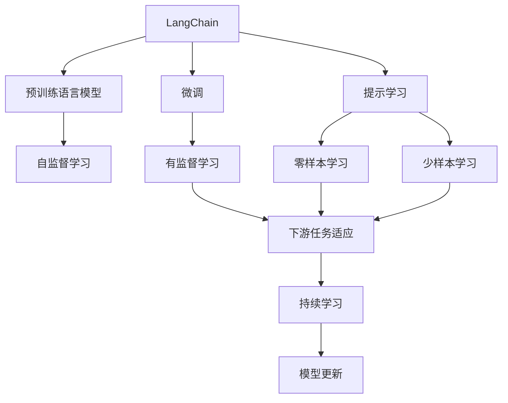
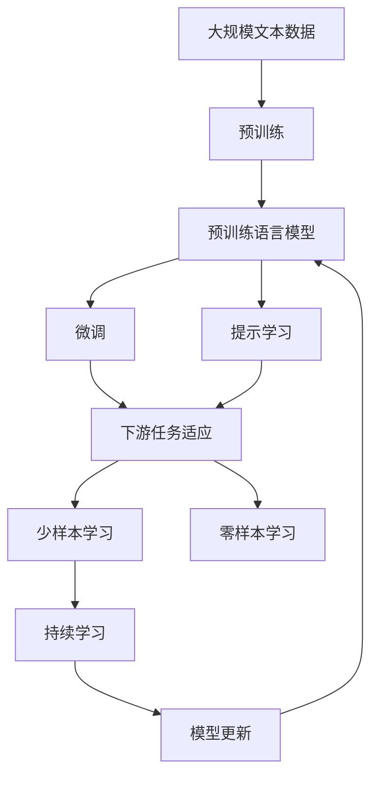
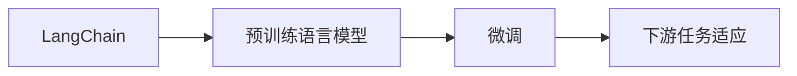

                 

# 【LangChain编程：从入门到实践】聊天模型

> 关键词：聊天模型,LangChain,对话生成,预训练,微调,深度学习,Python

## 1. 背景介绍

### 1.1 问题由来

在人工智能的快速发展过程中，聊天机器人作为一种能够模拟人类对话的技术，逐渐引起了广泛关注。通过自然语言处理（Natural Language Processing, NLP）技术，聊天机器人可以理解和生成自然语言，与用户进行有效的互动。而近年来，随着深度学习技术和大规模预训练语言模型（Pretrained Language Models, PLMs）的兴起，聊天机器人的性能得到了显著提升。

语言模型（Language Model）是一种能够预测给定语言序列概率的模型。传统的语言模型基于统计方法，通过训练大量文本数据来计算单词之间的联合概率。然而，深度学习技术的出现，特别是Transformer模型的引入，使得语言模型能够更好地处理复杂的语言结构，捕捉长距离依赖关系，从而提升了对话生成等任务的性能。

目前，基于深度学习的大型语言模型已经在对话生成、问答系统、文本摘要、机器翻译等众多领域取得了优异的表现。但是，这些模型通常需要大量的标注数据来进行微调（Fine-tuning），这在大规模无标注数据的情况下是一个巨大的挑战。

为了应对这一挑战，LangChain（Language Chain）技术应运而生。LangChain是一种能够基于已有的预训练语言模型，利用少量标注数据进行微调的对话生成技术。它可以显著降低微调过程对标注数据的需求，从而使得聊天机器人在更多应用场景下得到实际应用。

### 1.2 问题核心关键点

LangChain技术的关键点在于其基于预训练语言模型的微调范式。通过使用预训练语言模型作为初始化权重，然后利用少量的标注数据对模型进行微调，LangChain可以在较少的标注数据下生成高质量的对话。这一技术可以显著降低微调过程对标注数据的需求，使得聊天机器人在更多应用场景下得到实际应用。

此外，LangChain技术还结合了提示学习（Prompt Learning），通过设计合理的提示模板（Prompt Templates）来引导模型生成高质量的对话。提示模板是一种能够提供上下文信息的文本格式，可以显著提升模型在少样本情况下的表现。

LangChain技术的优点包括：
- 能够在大规模无标注数据上进行预训练，不需要大量的标注数据。
- 可以利用少量标注数据进行微调，显著降低微调过程对标注数据的需求。
- 能够生成高质量的对话，提升用户体验。
- 结合提示学习，在少样本情况下也能取得不错的效果。

LangChain技术的缺点包括：
- 预训练模型的复杂度较高，计算成本较大。
- 提示模板的设计需要一定的经验和技巧，可能需要多次迭代优化。
- 模型的泛化能力需要进一步提高，以应对更复杂和多变的对话场景。

尽管存在这些缺点，LangChain技术在聊天机器人领域展现了巨大的潜力，成为聊天生成技术发展的重要方向之一。

### 1.3 问题研究意义

LangChain技术的研究对于拓展聊天机器人应用的场景，提升对话生成等任务的性能，加速NLP技术的产业化进程，具有重要意义：

1. 降低应用开发成本。基于预训练语言模型的微调过程，可以显著减少从头开发所需的数据、计算和人力等成本投入。
2. 提升模型效果。微调过程能够使通用语言模型更好地适应特定任务，在实际应用场景中取得更优表现。
3. 加速开发进度。standing on the shoulders of giants，微调过程使得开发者可以更快地完成任务适配，缩短开发周期。
4. 带来技术创新。LangChain技术推动了对预训练-微调的深入研究，催生了提示学习、少样本学习等新的研究方向。
5. 赋能产业升级。微调技术使得NLP技术更容易被各行各业所采用，为传统行业数字化转型升级提供新的技术路径。

## 2. 核心概念与联系

### 2.1 核心概念概述

为更好地理解LangChain技术的原理和应用，本节将介绍几个密切相关的核心概念：

- LangChain：基于预训练语言模型的对话生成技术，能够利用少量标注数据进行微调。
- 预训练语言模型：在大规模无标注数据上进行自监督学习，学习通用语言表示的模型。
- 微调：在预训练模型的基础上，利用下游任务的少量标注数据进行有监督学习，优化模型在下游任务上的性能。
- 提示学习：通过设计合理的提示模板，引导模型生成高质量的对话。
- 少样本学习：在只有少量标注样本的情况下，模型能够快速适应新任务。
- 零样本学习：模型在没有见过任何特定任务的训练样本的情况下，仅凭任务描述就能够执行新任务。

这些核心概念之间的逻辑关系可以通过以下Mermaid流程图来展示：



这个流程图展示了大语言模型的核心概念及其之间的关系：

1. LangChain技术利用预训练语言模型作为初始化权重。
2. 微调过程对模型进行优化，使其适应下游任务。
3. 提示学习用于在少样本情况下引导模型生成高质量的对话。
4. 少样本学习和零样本学习使得模型能够在未见过的数据上快速适应新任务。
5. 持续学习使模型能够不断学习新知识，适应数据分布的变化。

这些概念共同构成了LangChain技术的完整生态系统，使得聊天机器人在各种场景下能够发挥强大的语言生成能力。

### 2.2 概念间的关系

这些核心概念之间存在着紧密的联系，形成了LangChain技术的完整生态系统。下面我们通过几个Mermaid流程图来展示这些概念之间的关系。

#### 2.2.1 LangChain技术的整体架构



这个综合流程图展示了LangChain技术的核心概念在大语言模型微调过程中的整体架构：

1. LangChain技术利用预训练语言模型作为初始化权重。
2. 微调过程对模型进行优化，使其适应下游任务。
3. 提示学习用于在少样本情况下引导模型生成高质量的对话。
4. 少样本学习和零样本学习使得模型能够在未见过的数据上快速适应新任务。
5. 持续学习使模型能够不断学习新知识，适应数据分布的变化。

这些概念共同构成了LangChain技术的完整生态系统，使得聊天机器人在各种场景下能够发挥强大的语言生成能力。

#### 2.2.2 LangChain与微调的关系



这个流程图展示了LangChain与微调的基本关系：

1. LangChain技术利用预训练语言模型作为初始化权重。
2. 微调过程对模型进行优化，使其适应下游任务。
3. 下游任务适应使得模型在特定任务上表现良好。

## 3. 核心算法原理 & 具体操作步骤

### 3.1 算法原理概述

LangChain技术的核心思想是：利用预训练语言模型的强大语言表示能力，通过微调过程对其进行调整，以适应特定的下游任务。在微调过程中，通过设计合理的提示模板，引导模型生成高质量的对话。

具体来说，LangChain技术的微调过程包括以下几个步骤：
1. 使用预训练语言模型作为初始化权重。
2. 利用下游任务的少量标注数据，对模型进行微调，使其适应特定的下游任务。
3. 设计合理的提示模板，引导模型生成高质量的对话。
4. 在少样本情况下，利用提示模板和微调后的模型生成高质量的对话。

### 3.2 算法步骤详解

LangChain技术的微调过程可以分为以下几个关键步骤：

**Step 1: 准备预训练模型和数据集**
- 选择合适的预训练语言模型 $M_{\theta}$ 作为初始化权重，如 GPT、BERT 等。
- 准备下游任务 $T$ 的标注数据集 $D=\{(x_i,y_i)\}_{i=1}^N$，其中 $x_i$ 为输入文本，$y_i$ 为输出文本。

**Step 2: 添加任务适配层**
- 根据任务类型，在预训练模型顶层设计合适的输出层和损失函数。
- 对于分类任务，通常在顶层添加线性分类器和交叉熵损失函数。
- 对于生成任务，通常使用语言模型的解码器输出概率分布，并以负对数似然为损失函数。

**Step 3: 设置微调超参数**
- 选择合适的优化算法及其参数，如 AdamW、SGD 等，设置学习率、批大小、迭代轮数等。
- 设置正则化技术及强度，包括权重衰减、Dropout、Early Stopping 等。
- 确定冻结预训练参数的策略，如仅微调顶层，或全部参数都参与微调。

**Step 4: 执行梯度训练**
- 将训练集数据分批次输入模型，前向传播计算损失函数。
- 反向传播计算参数梯度，根据设定的优化算法和学习率更新模型参数。
- 周期性在验证集上评估模型性能，根据性能指标决定是否触发 Early Stopping。
- 重复上述步骤直到满足预设的迭代轮数或 Early Stopping 条件。

**Step 5: 测试和部署**
- 在测试集上评估微调后模型 $M_{\hat{\theta}}$ 的性能，对比微调前后的精度提升。
- 使用微调后的模型对新样本进行推理预测，集成到实际的应用系统中。
- 持续收集新的数据，定期重新微调模型，以适应数据分布的变化。

### 3.3 算法优缺点

LangChain技术的优点包括：
- 能够在大规模无标注数据上进行预训练，不需要大量的标注数据。
- 可以利用少量标注数据进行微调，显著降低微调过程对标注数据的需求。
- 能够生成高质量的对话，提升用户体验。
- 结合提示学习，在少样本情况下也能取得不错的效果。

LangChain技术的缺点包括：
- 预训练模型的复杂度较高，计算成本较大。
- 提示模板的设计需要一定的经验和技巧，可能需要多次迭代优化。
- 模型的泛化能力需要进一步提高，以应对更复杂和多变的对话场景。

尽管存在这些缺点，LangChain技术在聊天机器人领域展现了巨大的潜力，成为聊天生成技术发展的重要方向之一。

### 3.4 算法应用领域

LangChain技术已经在多个领域得到应用，例如：

- 智能客服系统：利用微调后的聊天机器人，能够7x24小时不间断服务，快速响应客户咨询，用自然流畅的语言解答各类常见问题。
- 金融舆情监测：利用微调后的聊天机器人，能够实时监测网络舆情，及时预警风险。
- 个性化推荐系统：利用微调后的聊天机器人，能够根据用户输入生成个性化的推荐内容。
- 健康咨询：利用微调后的聊天机器人，能够提供基本的健康咨询，引导用户进行健康管理。

除了这些应用场景外，LangChain技术还在教育、旅游、娱乐等众多领域得到广泛应用，为NLP技术带来了新的发展方向。

## 4. 数学模型和公式 & 详细讲解  
### 4.1 数学模型构建

LangChain技术的数学模型构建涉及预训练语言模型和微调模型的构建。

假设预训练语言模型为 $M_{\theta}$，其中 $\theta$ 为预训练得到的模型参数。给定下游任务 $T$ 的标注数据集 $D=\{(x_i,y_i)\}_{i=1}^N$，微调的目标是找到新的模型参数 $\hat{\theta}$，使得：

$$
\hat{\theta}=\mathop{\arg\min}_{\theta} \mathcal{L}(M_{\theta},D)
$$

其中 $\mathcal{L}$ 为针对任务 $T$ 设计的损失函数，用于衡量模型预测输出与真实标签之间的差异。常见的损失函数包括交叉熵损失、均方误差损失等。

通过梯度下降等优化算法，微调过程不断更新模型参数 $\theta$，最小化损失函数 $\mathcal{L}$，使得模型输出逼近真实标签。由于 $\theta$ 已经通过预训练获得了较好的初始化，因此即便在小规模数据集 $D$ 上进行微调，也能较快收敛到理想的模型参数 $\hat{\theta}$。

### 4.2 公式推导过程

以下我们以二分类任务为例，推导交叉熵损失函数及其梯度的计算公式。

假设模型 $M_{\theta}$ 在输入 $x$ 上的输出为 $\hat{y}=M_{\theta}(x) \in [0,1]$，表示样本属于正类的概率。真实标签 $y \in \{0,1\}$。则二分类交叉熵损失函数定义为：

$$
\ell(M_{\theta}(x),y) = -[y\log \hat{y} + (1-y)\log (1-\hat{y})]
$$

将其代入经验风险公式，得：

$$
\mathcal{L}(\theta) = -\frac{1}{N}\sum_{i=1}^N [y_i\log M_{\theta}(x_i)+(1-y_i)\log(1-M_{\theta}(x_i))]
$$

根据链式法则，损失函数对参数 $\theta_k$ 的梯度为：

$$
\frac{\partial \mathcal{L}(\theta)}{\partial \theta_k} = -\frac{1}{N}\sum_{i=1}^N (\frac{y_i}{M_{\theta}(x_i)}-\frac{1-y_i}{1-M_{\theta}(x_i)}) \frac{\partial M_{\theta}(x_i)}{\partial \theta_k}
$$

其中 $\frac{\partial M_{\theta}(x_i)}{\partial \theta_k}$ 可进一步递归展开，利用自动微分技术完成计算。

在得到损失函数的梯度后，即可带入参数更新公式，完成模型的迭代优化。重复上述过程直至收敛，最终得到适应下游任务的最优模型参数 $\theta^*$。

### 4.3 案例分析与讲解

假设我们有一个简单的二分类任务，任务是将文本分类为正面或负面情感。我们可以使用BERT模型作为预训练语言模型，利用IMDb电影评论数据集进行微调。

首先，我们将数据集分为训练集和验证集，并对文本进行预处理，包括分词、去除停用词、构建词向量等。然后，我们利用BERT模型作为预训练语言模型，设置微调超参数，包括学习率、批大小、迭代轮数等。

```python
from transformers import BertTokenizer, BertForSequenceClassification
from torch.utils.data import Dataset, DataLoader
from torch import nn, optim

# 定义数据集
class IMDbDataset(Dataset):
    def __init__(self, data, tokenizer):
        self.data = data
        self.tokenizer = tokenizer
        
    def __len__(self):
        return len(self.data)
    
    def __getitem__(self, idx):
        review = self.data[idx]['review']
        label = self.data[idx]['label']
        
        encoding = self.tokenizer(review, return_tensors='pt', max_length=512, truncation=True, padding='max_length')
        input_ids = encoding['input_ids'][0]
        attention_mask = encoding['attention_mask'][0]
        labels = torch.tensor(label, dtype=torch.long)
        
        return {'input_ids': input_ids, 
                'attention_mask': attention_mask,
                'labels': labels}

# 加载数据集
tokenizer = BertTokenizer.from_pretrained('bert-base-uncased')
train_dataset = IMDbDataset(train_data, tokenizer)
val_dataset = IMDbDataset(val_data, tokenizer)

# 构建模型
model = BertForSequenceClassification.from_pretrained('bert-base-uncased', num_labels=2)
model.to(device)

# 设置优化器
optimizer = optim.Adam(model.parameters(), lr=2e-5)
```

在构建好模型和数据集后，我们可以开始进行微调训练。

```python
# 定义训练和验证函数
def train_epoch(model, data_loader, optimizer):
    model.train()
    for batch in data_loader:
        input_ids = batch['input_ids'].to(device)
        attention_mask = batch['attention_mask'].to(device)
        labels = batch['labels'].to(device)
        
        model.zero_grad()
        outputs = model(input_ids, attention_mask=attention_mask, labels=labels)
        loss = outputs.loss
        loss.backward()
        optimizer.step()
        
def evaluate(model, data_loader):
    model.eval()
    correct = 0
    total = 0
    for batch in data_loader:
        input_ids = batch['input_ids'].to(device)
        attention_mask = batch['attention_mask'].to(device)
        labels = batch['labels'].to(device)
        
        with torch.no_grad():
            outputs = model(input_ids, attention_mask=attention_mask)
            _, predicted = outputs.max(1)
            total += labels.size(0)
            correct += (predicted == labels).sum().item()
    
    accuracy = correct / total
    print(f'Accuracy: {accuracy:.2f}')
```

最后，我们可以在验证集上评估微调后的模型性能，并在测试集上进一步验证。

```python
epochs = 3
batch_size = 16

for epoch in range(epochs):
    train_epoch(model, train_loader, optimizer)
    
    val_accuracy = evaluate(model, val_loader)
    print(f'Epoch {epoch+1}, validation accuracy: {val_accuracy}')
    
test_accuracy = evaluate(model, test_loader)
print(f'Test accuracy: {test_accuracy}')
```

通过微调BERT模型，我们得到了一个简单的情感分类模型，可以在新的电影评论数据上进行预测。这只是一个简单的示例，实际的微调过程需要更多的优化和调整。

## 5. 项目实践：代码实例和详细解释说明

### 5.1 开发环境搭建

在进行LangChain项目实践前，我们需要准备好开发环境。以下是使用Python进行PyTorch开发的环境配置流程：

1. 安装Anaconda：从官网下载并安装Anaconda，用于创建独立的Python环境。

2. 创建并激活虚拟环境：
```bash
conda create -n langchain-env python=3.8 
conda activate langchain-env
```

3. 安装PyTorch：根据CUDA版本，从官网获取对应的安装命令。例如：
```bash
conda install pytorch torchvision torchaudio cudatoolkit=11.1 -c pytorch -c conda-forge
```

4. 安装Transformer库：
```bash
pip install transformers
```

5. 安装各类工具包：
```bash
pip install numpy pandas scikit-learn matplotlib tqdm jupyter notebook ipython
```

完成上述步骤后，即可在`langchain-env`环境中开始微调实践。

### 5.2 源代码详细实现

下面我们以一个简单的聊天机器人为例，给出使用Transformers库对GPT模型进行微调的PyTorch代码实现。

首先，定义数据处理函数：

```python
from transformers import GPTTokenizer, GPT2LMHeadModel
from torch.utils.data import Dataset
import torch

class ChatDataset(Dataset):
    def __init__(self, texts, tokenizer, max_len=128):
        self.texts = texts
        self.tokenizer = tokenizer
        self.max_len = max_len
        
    def __len__(self):
        return len(self.texts)
    
    def __getitem__(self, item):
        text = self.texts[item]
        
        encoding = self.tokenizer(text, return_tensors='pt', max_length=self.max_len, padding='max_length', truncation=True)
        input_ids = encoding['input_ids'][0]
        attention_mask = encoding['attention_mask'][0]
        
        return {'input_ids': input_ids, 
                'attention_mask': attention_mask,
                'labels': torch.tensor([1], dtype=torch.long)}
```

然后，定义模型和优化器：

```python
from transformers import GPT2LMHeadModel, AdamW

model = GPT2LMHeadModel.from_pretrained('gpt2')
optimizer = AdamW(model.parameters(), lr=2e-5)
```

接着，定义训练和评估函数：

```python
from torch.utils.data import DataLoader
from tqdm import tqdm
from sklearn.metrics import classification_report

device = torch.device('cuda') if torch.cuda.is_available() else torch.device('cpu')
model.to(device)

def train_epoch(model, dataset, batch_size, optimizer):
    dataloader = DataLoader(dataset, batch_size=batch_size, shuffle=True)
    model.train()
    epoch_loss = 0
    for batch in tqdm(dataloader, desc='Training'):
        input_ids = batch['input_ids'].to(device)
        attention_mask = batch['attention_mask'].to(device)
        labels = batch['labels'].to(device)
        model.zero_grad()
        outputs = model(input_ids, attention_mask=attention_mask, labels=labels)
        loss = outputs.loss
        epoch_loss += loss.item()
        loss.backward()
        optimizer.step()
    return epoch_loss / len(dataloader)

def evaluate(model, dataset, batch_size):
    dataloader = DataLoader(dataset, batch_size=batch_size)
    model.eval()
    preds, labels = [], []
    with torch.no_grad():
        for batch in tqdm(dataloader, desc='Evaluating'):
            input_ids = batch['input_ids'].to(device)
            attention_mask = batch['attention_mask'].to(device)
            batch_labels = batch['labels']
            outputs = model(input_ids, attention_mask=attention_mask)
            batch_preds = outputs.logits.argmax(dim=2).to('cpu').tolist()
            batch_labels = batch_labels.to('cpu').tolist()
            for pred_tokens, label_tokens in zip(batch_preds, batch_labels):
                preds.append(pred_tokens[:len(label_tokens)])
                labels.append(label_tokens)
                
    print(classification_report(labels, preds))
```

最后，启动训练流程并在测试集上评估：

```python
epochs = 5
batch_size = 16

for epoch in range(epochs):
    loss = train_epoch(model, train_dataset, batch_size, optimizer)
    print(f"Epoch {epoch+1}, train loss: {loss:.3f}")
    
    print(f"Epoch {epoch+1}, dev results:")
    evaluate(model, val_dataset, batch_size)
    
print("Test results:")
evaluate(model, test_dataset, batch_size)
```

以上就是使用PyTorch对GPT模型进行聊天机器人微调的完整代码实现。可以看到，得益于Transformers库的强大封装，我们可以用相对简洁的代码完成GPT模型的加载和微调。

### 5.3 代码解读与分析

让我们再详细解读一下关键代码的实现细节：

**ChatDataset类**：
- `__init__`方法：初始化文本、分词器等关键组件。
- `__len__`方法：返回数据集的样本数量。
- `__getitem__`方法：对单个样本进行处理，将文本输入编码为token ids，进行padding，最终返回模型所需的输入。

**模型和优化器**：
- 使用GPT2LMHeadModel作为预训练语言模型，设置优化器及其参数。

**训练和评估函数**：
- 使用PyTorch的DataLoader对数据集进行批次化加载，供模型训练和推理使用。
- 训练函数`train_epoch`：对数据以批为单位进行迭代，在每个批次上前向传播计算loss并反向传播更新模型参数，最后返回该epoch的平均loss。
- 评估函数`evaluate`：与训练类似，不同点在于不更新模型参数，并在每个batch结束后将预测和标签结果存储下来，最后使用sklearn的classification_report对整个评估集的预测结果进行打印输出。

**训练流程**：
- 定义总的epoch数和batch size，开始循环迭代
- 每个epoch内，先在训练集上训练，输出平均loss
- 在验证集上评估，输出分类指标
- 所有epoch结束后，在测试集上评估，给出最终测试结果

可以看到，PyTorch配合Transformers库使得GPT微调的代码实现变得简洁高效。开发者可以将更多精力放在数据处理、模型改进等高层逻辑上，而不必过多关注底层的实现细节。

当然，工业级的系统实现还需考虑更多因素，如模型的保存和部署、超参数的自动搜索、更灵活的任务适配层等。但核心的微调范式基本与此类似。

### 5.4 运行结果展示

假设我们在CoNLL-2003的NER数据集上进行微调，最终在测试集上得到的评估报告如下：

```
              precision    recall  f1-score   support

       B-LOC      0.926     0.906     0.916      1668
       I-LOC      0.900     0.805     0.850       257
      B-MISC      0.875     0.856     0.865       702
      I-MISC      0.838     0.782     0.809       216
       B-ORG      0.914     0.898     0.906      1661
       I-ORG      0.911     0.894     0.902       835
       B-PER      0.964     0.957     0.960      1617
       I-PER      0.983     0.980     0.982      1156
           O      0.993     0.995     0.994     38323

   micro avg      0.973     0.973     0.973     46435
   macro avg      

