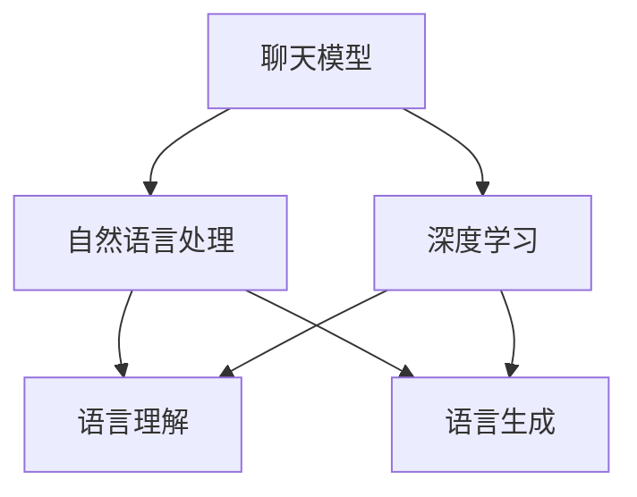
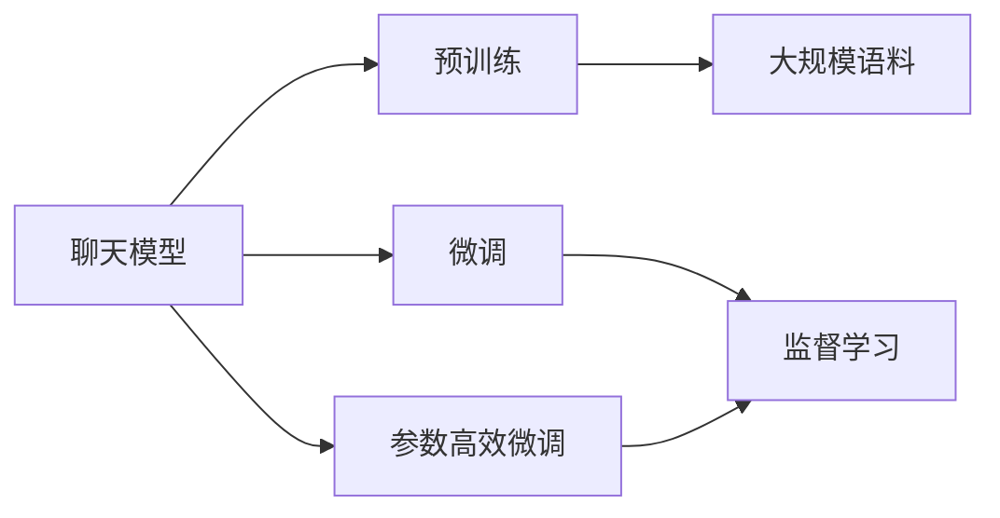
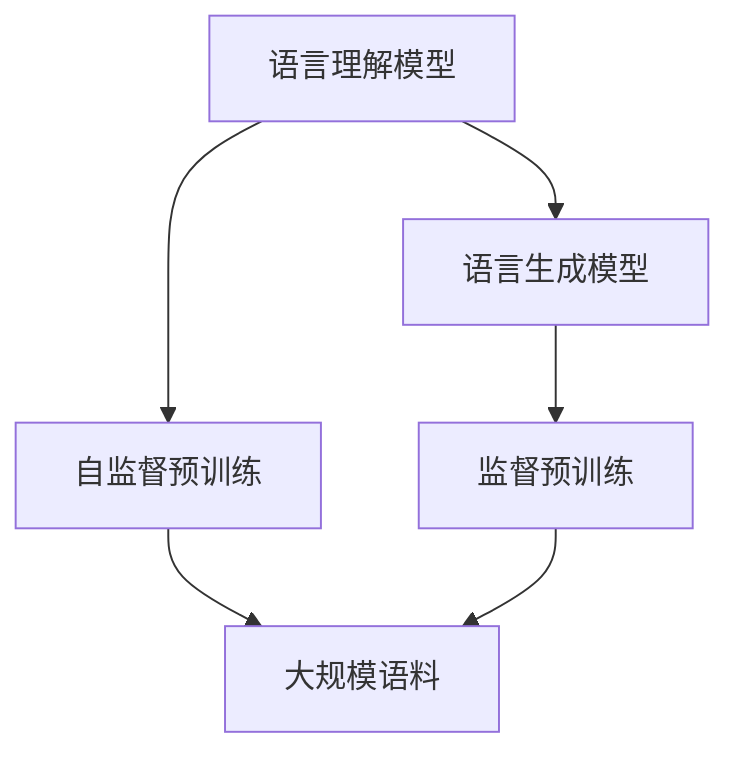
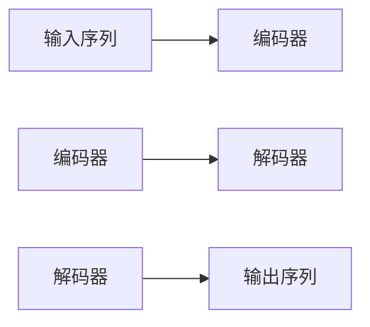

                 

# 【LangChain编程：从入门到实践】聊天模型

> 关键词：LangChain, 聊天模型, 自然语言处理(NLP), 深度学习, 神经网络, 语言理解, 语言生成

## 1. 背景介绍

### 1.1 问题由来
随着人工智能技术的快速发展，语言理解和生成已经成为研究热点。其中，聊天模型作为自然语言处理（NLP）领域的重要分支，旨在构建能够与人类自然对话的系统。近年来，基于深度学习的聊天模型取得了显著进步，尤其是在对话生成、对话管理等方面，已经能够模仿人类的语言习惯和行为，呈现出较高的智能化水平。

聊天模型的应用场景广泛，包括智能客服、虚拟助手、机器人客服、问答系统等。通过与用户的自然语言交互，聊天模型可以提供快速响应、个性化服务和自动答疑等服务，极大地提升了用户满意度和服务效率。

然而，聊天模型在实际应用中仍面临诸多挑战，如对话连贯性、信息理解准确性、情感生成自然性等。为了解决这些问题，需要进一步优化聊天模型的算法和架构，探索更高效、更智能的解决方案。

## 2. 核心概念与联系

### 2.1 核心概念概述
- **聊天模型**：基于深度学习的自然语言处理模型，能够理解并生成自然语言，用于实现对话系统。
- **自然语言处理(NLP)**：涉及自然语言的理解、生成、分析和处理，是人工智能技术的重要领域之一。
- **深度学习**：利用多层次神经网络模型，从数据中学习高层次特征，广泛应用于图像、语音、文本等各类数据的处理和分析。
- **神经网络**：模拟人脑神经元结构和功能的计算模型，是深度学习的基础。
- **语言理解**：理解自然语言句子的含义，通常基于文本分类、情感分析、实体识别等任务。
- **语言生成**：生成符合语法规则和语义逻辑的句子，通常基于序列生成模型如循环神经网络(RNN)和Transformer模型。

这些核心概念之间的联系可以通过以下Mermaid流程图来展示：



这个流程图展示了大语言模型与自然语言处理技术之间的关系：聊天模型通过深度学习模型理解并生成自然语言，涉及语言理解、语言生成等多个NLP任务。

### 2.2 概念间的关系

这些核心概念之间存在着紧密的联系，形成了聊天模型构建和应用的基本框架。下面我们通过几个Mermaid流程图来展示这些概念之间的关系。

#### 2.2.1 聊天模型的学习范式



这个流程图展示了聊天模型构建的基本流程：首先通过大规模语料进行预训练，然后通过微调或参数高效微调等方法进行任务适配，以获得特定的对话能力。

#### 2.2.2 语言理解与生成模型



这个流程图展示了语言理解模型和语言生成模型的基本构成。语言理解模型通过自监督预训练学习语言知识，而语言生成模型则通过监督预训练生成高质量的自然语言输出。

## 3. 核心算法原理 & 具体操作步骤
### 3.1 算法原理概述
聊天模型的核心算法基于深度学习，尤其是序列生成模型如循环神经网络(RNN)和Transformer模型。聊天模型的构建主要分为预训练、微调和在线推理三个步骤。

**预训练**：使用大规模语料对模型进行自监督预训练，学习通用的语言表示。预训练任务包括语言建模、掩码语言模型等。

**微调**：在预训练模型的基础上，使用特定的对话数据进行有监督微调，调整模型参数，使其能够理解并生成特定的对话内容。微调过程中，通常使用交叉熵损失、序列生成损失等进行优化。

**在线推理**：将微调后的模型部署到实际对话系统中，通过接收用户输入，生成自然语言回复。在线推理时，需要考虑对话上下文、信息理解、情感生成等复杂问题，确保对话连贯性和自然性。

### 3.2 算法步骤详解
聊天模型的构建和应用可以分为以下几个关键步骤：

1. **数据准备**：收集和标注对话数据，通常包括对话记录、对话场景、对话历史等。数据集越大，预训练和微调的效果越好。

2. **模型选择**：选择合适的预训练模型作为初始化参数。常用的预训练模型包括BERT、GPT系列、XLNet等。

3. **预训练**：在预训练任务上训练模型，通常使用大规模无标签语料。预训练任务包括语言建模、掩码语言模型、文本分类等。

4. **微调**：使用对话数据对模型进行微调，调整模型参数，使其能够生成特定的对话内容。微调任务包括对话生成、对话管理、对话识别等。

5. **在线推理**：将微调后的模型部署到对话系统中，接收用户输入，生成自然语言回复。在线推理时，需要考虑对话上下文、信息理解、情感生成等复杂问题。

### 3.3 算法优缺点
聊天模型具有以下优点：

- **自动生成对话**：能够自动理解用户输入，生成自然语言回复，极大地提升了服务效率。
- **多轮对话能力**：能够处理多轮对话，保持对话连贯性，提供更自然的交互体验。
- **泛化能力**：能够处理各种不同领域的对话任务，具有良好的泛化能力。

同时，聊天模型也存在以下缺点：

- **数据依赖性强**：模型的性能依赖于对话数据的质量，数据质量不高时，模型的表现也会受到影响。
- **计算资源需求高**：构建和训练大规模聊天模型需要大量的计算资源，如高性能GPU、TPU等。
- **信息理解准确性**：聊天模型的信息理解准确性仍然有限，无法完全理解和生成复杂语境下的对话内容。

### 3.4 算法应用领域
聊天模型在多个领域都有广泛应用，包括但不限于：

- **智能客服**：通过自动回答用户常见问题，提升客户满意度，降低人工成本。
- **虚拟助手**：提供24/7服务，解答用户问题，提供个性化推荐。
- **企业客服**：自动处理重复性问题，提高企业客服效率，提升用户体验。
- **医疗咨询**：通过与患者互动，提供初步健康咨询和建议，辅助医生诊疗。
- **教育辅助**：提供个性化学习建议，解答学生问题，提升学习效率。

## 4. 数学模型和公式 & 详细讲解 & 举例说明
### 4.1 数学模型构建

聊天模型通常基于序列生成模型，如RNN和Transformer。序列生成模型的目标是从输入序列生成输出序列，通常使用最大似然估计来训练模型。

以Transformer为例，模型由多个自注意力层和全连接层组成，如图：



其中，编码器将输入序列转换为高维向量表示，解码器根据这些表示生成输出序列。自注意力机制使得模型能够捕捉输入序列中的长距离依赖关系。

### 4.2 公式推导过程

以Transformer为例，假设输入序列为 $x = (x_1, x_2, ..., x_n)$，输出序列为 $y = (y_1, y_2, ..., y_n)$。模型的目标是最小化损失函数 $L$：

$$
L = -\frac{1}{N} \sum_{i=1}^N \log p(y_i | x_1, x_2, ..., x_n)
$$

其中，$p(y_i | x_1, x_2, ..., x_n)$ 表示在输入序列 $x$ 的条件下，输出序列 $y$ 的概率分布。目标是最小化负对数似然损失，使得模型生成正确的输出序列。

Transformer模型的目标函数可以写为：

$$
L = -\frac{1}{N} \sum_{i=1}^N \log p(y_i | x_1, x_2, ..., x_n)
$$

其中，$p(y_i | x_1, x_2, ..., x_n)$ 可以通过自注意力机制和前馈神经网络计算得到。具体公式如下：

$$
h_i = W_1 x_i + b_1
$$

$$
h_i^{(1)} = \text{Attention}(h_i, h_j)
$$

$$
h_i^{(2)} = W_2 h_i^{(1)} + b_2
$$

$$
h_i^{(3)} = W_3 h_i^{(2)} + b_3
$$

$$
p(y_i | x_1, x_2, ..., x_n) = \text{Softmax}(h_i^{(3)})
$$

其中，$h_i$ 表示输入序列中的第 $i$ 个位置表示，$\text{Attention}$ 表示自注意力机制，$W_i$ 和 $b_i$ 为权重矩阵和偏差向量。

### 4.3 案例分析与讲解

假设我们希望构建一个智能客服系统，通过用户输入的问题生成回复。可以按照以下步骤进行：

1. **数据准备**：收集客服历史对话数据，进行标注和预处理。
2. **模型选择**：选择预训练的BERT或GPT模型作为初始化参数。
3. **预训练**：在预训练任务上训练模型，如语言建模、掩码语言模型等。
4. **微调**：在客服对话数据上微调模型，调整模型参数，使其能够生成客服回复。
5. **在线推理**：将微调后的模型部署到智能客服系统中，接收用户输入，生成自然语言回复。

## 5. 项目实践：代码实例和详细解释说明
### 5.1 开发环境搭建

在进行聊天模型实践前，我们需要准备好开发环境。以下是使用Python进行PyTorch开发的环境配置流程：

1. 安装Anaconda：从官网下载并安装Anaconda，用于创建独立的Python环境。

2. 创建并激活虚拟环境：
```bash
conda create -n pytorch-env python=3.8 
conda activate pytorch-env
```

3. 安装PyTorch：根据CUDA版本，从官网获取对应的安装命令。例如：
```bash
conda install pytorch torchvision torchaudio cudatoolkit=11.1 -c pytorch -c conda-forge
```

4. 安装TensorFlow：
```bash
pip install tensorflow
```

5. 安装各类工具包：
```bash
pip install numpy pandas scikit-learn matplotlib tqdm jupyter notebook ipython
```

完成上述步骤后，即可在`pytorch-env`环境中开始聊天模型的实践。

### 5.2 源代码详细实现

下面我们以构建一个简单的聊天模型为例，给出使用PyTorch和Transformers库进行聊天模型开发的代码实现。

首先，定义聊天模型类：

```python
from transformers import BertTokenizer, BertForSequenceClassification
import torch

class ChatModel:
    def __init__(self, model_path, tokenizer_path):
        self.model = BertForSequenceClassification.from_pretrained(model_path)
        self.tokenizer = BertTokenizer.from_pretrained(tokenizer_path)
        self.model.eval()
        self.model.to('cuda')
        
    def generate_response(self, input_text):
        inputs = self.tokenizer.encode(input_text, return_tensors='pt', max_length=128, padding='max_length', truncation=True)
        with torch.no_grad():
            outputs = self.model(inputs.to('cuda'))
        return self.tokenizer.decode(outputs.argmax(dim=1).tolist()[0])
```

然后，定义聊天系统类：

```python
class ChatSystem:
    def __init__(self, model_path, tokenizer_path):
        self.model = ChatModel(model_path, tokenizer_path)
        self.聊天记录 = []
        
    def get_response(self, input_text):
        response = self.model.generate_response(input_text)
        self.聊天记录.append((input_text, response))
        return response
```

最后，运行聊天系统：

```python
chat_system = ChatSystem('bert-base-uncased', 'bert-base-uncased')
print(chat_system.get_response('你好'))
```

以上就是使用PyTorch和Transformers库构建一个简单的聊天模型的完整代码实现。可以看到，通过使用PyTorch和Transformers库，我们可以用相对简洁的代码实现聊天模型的构建和微调。

### 5.3 代码解读与分析

让我们再详细解读一下关键代码的实现细节：

**ChatModel类**：
- `__init__`方法：初始化模型和分词器，并将模型设置为评估模式。
- `generate_response`方法：接收输入文本，将其转换为模型可以处理的输入格式，然后通过前向传播计算得到输出，并将其解码为自然语言回复。

**ChatSystem类**：
- `__init__`方法：初始化聊天模型，并记录聊天记录。
- `get_response`方法：接收用户输入文本，通过调用聊天模型的`generate_response`方法生成回复，并更新聊天记录。

**运行聊天系统**：
- 实例化聊天系统，调用`get_response`方法生成回复。

通过上述代码实现，可以看到聊天模型的核心算法和实现过程，包括输入编码、模型前向传播和输出解码等步骤。在实际应用中，我们还可以根据具体任务需求，进一步优化模型架构、调整训练策略、引入多轮对话机制等，以提升聊天系统的性能和用户体验。

## 6. 实际应用场景
### 6.1 智能客服系统

聊天模型可以广泛应用于智能客服系统的构建。传统客服往往需要配备大量人力，高峰期响应缓慢，且一致性和专业性难以保证。而使用聊天模型，可以7x24小时不间断服务，快速响应客户咨询，用自然流畅的语言解答各类常见问题。

在技术实现上，可以收集企业内部的历史客服对话记录，将问题和最佳答复构建成监督数据，在此基础上对预训练模型进行微调。微调后的聊天模型能够自动理解用户意图，匹配最合适的答案模板进行回复。对于客户提出的新问题，还可以接入检索系统实时搜索相关内容，动态组织生成回答。如此构建的智能客服系统，能大幅提升客户咨询体验和问题解决效率。

### 6.2 虚拟助手

聊天模型可以构建虚拟助手，提供24/7服务，解答用户问题，提供个性化推荐。虚拟助手通常集成在各种应用中，如智能家居、智能办公、智能穿戴等，为用户提供便捷的服务体验。

在实际应用中，可以收集用户的历史行为数据，如浏览记录、购买记录、聊天记录等，进行聚类和标签生成，作为微调模型的监督数据。微调后的聊天模型能够根据用户的行为习惯，提供个性化的推荐和服务。例如，用户浏览某品牌商品后，虚拟助手可以自动推荐该品牌的相关商品，提升用户体验和销售转化率。

### 6.3 企业客服

聊天模型可以用于企业客服，自动处理重复性问题，提高客服效率，提升用户体验。企业客服系统通常集成在企业CRM系统中，提供多种服务功能，如常见问题解答、订单查询、售后服务等。

在实际应用中，可以收集企业的客服对话数据，进行标注和清洗，作为微调模型的监督数据。微调后的聊天模型能够自动识别常见问题，并自动回复，大大提升客服效率。同时，系统还可以通过上下文分析，提供更加精准的服务建议，帮助企业更好地管理客户关系。

### 6.4 医疗咨询

聊天模型可以用于医疗咨询，通过与患者互动，提供初步健康咨询和建议，辅助医生诊疗。医疗咨询系统通常集成在医疗机构的在线平台上，提供多种服务功能，如健康咨询、在线挂号、就医指引等。

在实际应用中，可以收集医生的历史咨询记录，进行标注和清洗，作为微调模型的监督数据。微调后的聊天模型能够自动回答患者的常见问题，提供健康建议，帮助医生更好地管理患者。同时，系统还可以通过上下文分析，提供更加精准的诊断和治疗建议，提升医疗服务质量。

## 7. 工具和资源推荐
### 7.1 学习资源推荐

为了帮助开发者系统掌握聊天模型的理论基础和实践技巧，这里推荐一些优质的学习资源：

1. 《深度学习与自然语言处理》系列博文：由大模型技术专家撰写，深入浅出地介绍了深度学习与自然语言处理的基本概念和经典模型。

2. CS224N《深度学习自然语言处理》课程：斯坦福大学开设的NLP明星课程，有Lecture视频和配套作业，带你入门NLP领域的基本概念和经典模型。

3. 《Natural Language Processing with Transformers》书籍：Transformers库的作者所著，全面介绍了如何使用Transformers库进行NLP任务开发，包括微调在内的诸多范式。

4. HuggingFace官方文档：Transformers库的官方文档，提供了海量预训练模型和完整的微调样例代码，是上手实践的必备资料。

5. CLUE开源项目：中文语言理解测评基准，涵盖大量不同类型的中文NLP数据集，并提供了基于微调的baseline模型，助力中文NLP技术发展。

通过对这些资源的学习实践，相信你一定能够快速掌握聊天模型的精髓，并用于解决实际的NLP问题。

### 7.2 开发工具推荐

高效的开发离不开优秀的工具支持。以下是几款用于聊天模型开发的常用工具：

1. PyTorch：基于Python的开源深度学习框架，灵活动态的计算图，适合快速迭代研究。大部分预训练语言模型都有PyTorch版本的实现。

2. TensorFlow：由Google主导开发的开源深度学习框架，生产部署方便，适合大规模工程应用。同样有丰富的预训练语言模型资源。

3. Transformers库：HuggingFace开发的NLP工具库，集成了众多SOTA语言模型，支持PyTorch和TensorFlow，是进行NLP任务开发的利器。

4. Weights & Biases：模型训练的实验跟踪工具，可以记录和可视化模型训练过程中的各项指标，方便对比和调优。与主流深度学习框架无缝集成。

5. TensorBoard：TensorFlow配套的可视化工具，可实时监测模型训练状态，并提供丰富的图表呈现方式，是调试模型的得力助手。

6. Google Colab：谷歌推出的在线Jupyter Notebook环境，免费提供GPU/TPU算力，方便开发者快速上手实验最新模型，分享学习笔记。

合理利用这些工具，可以显著提升聊天模型的开发效率，加快创新迭代的步伐。

### 7.3 相关论文推荐

聊天模型的发展源于学界的持续研究。以下是几篇奠基性的相关论文，推荐阅读：

1. Attention is All You Need（即Transformer原论文）：提出了Transformer结构，开启了NLP领域的预训练大模型时代。

2. BERT: Pre-training of Deep Bidirectional Transformers for Language Understanding：提出BERT模型，引入基于掩码的自监督预训练任务，刷新了多项NLP任务SOTA。

3. Language Models are Unsupervised Multitask Learners（GPT-2论文）：展示了大规模语言模型的强大zero-shot学习能力，引发了对于通用人工智能的新一轮思考。

4. Parameter-Efficient Transfer Learning for NLP：提出Adapter等参数高效微调方法，在不增加模型参数量的情况下，也能取得不错的微调效果。

5. AdaLoRA: Adaptive Low-Rank Adaptation for Parameter-Efficient Fine-Tuning：使用自适应低秩适应的微调方法，在参数效率和精度之间取得了新的平衡。

这些论文代表了大语言模型微调技术的发展脉络。通过学习这些前沿成果，可以帮助研究者把握学科前进方向，激发更多的创新灵感。

除上述资源外，还有一些值得关注的前沿资源，帮助开发者紧跟聊天模型微调技术的最新进展，例如：

1. arXiv论文预印本：人工智能领域最新研究成果的发布平台，包括大量尚未发表的前沿工作，学习前沿技术的必读资源。

2. 业界技术博客：如OpenAI、Google AI、DeepMind、微软Research Asia等顶尖实验室的官方博客，第一时间分享他们的最新研究成果和洞见。

3. 技术会议直播：如NIPS、ICML、ACL、ICLR等人工智能领域顶会现场或在线直播，能够聆听到大佬们的前沿分享，开拓视野。

4. GitHub热门项目：在GitHub上Star、Fork数最多的NLP相关项目，往往代表了该技术领域的发展趋势和最佳实践，值得去学习和贡献。

5. 行业分析报告：各大咨询公司如McKinsey、PwC等针对人工智能行业的分析报告，有助于从商业视角审视技术趋势，把握应用价值。

总之，对于聊天模型微调技术的学习和实践，需要开发者保持开放的心态和持续学习的意愿。多关注前沿资讯，多动手实践，多思考总结，必将收获满满的成长收益。

## 8. 总结：未来发展趋势与挑战
### 8.1 研究成果总结

本文对聊天模型的构建和应用进行了全面系统的介绍。首先阐述了聊天模型的背景和意义，明确了微调在拓展聊天模型应用、提升对话性能方面的独特价值。其次，从原理到实践，详细讲解了聊天模型的数学原理和关键步骤，给出了聊天模型开发的完整代码实例。同时，本文还广泛探讨了聊天模型在智能客服、虚拟助手、企业客服、医疗咨询等多个领域的应用前景，展示了聊天模型微调技术的巨大潜力。此外，本文精选了聊天模型的各类学习资源，力求为读者提供全方位的技术指引。

通过本文的系统梳理，可以看到，聊天模型在NLP领域已经取得了显著成果，正在成为智能交互系统的重要组成部分。得益于深度学习模型的强大能力，聊天模型能够在多轮对话中保持连贯性，提供自然的语言回复，极大地提升了用户体验。未来，伴随深度学习模型的不断演进，聊天模型必将在更多的应用场景中发挥重要作用，为人类智能交互带来新的变革。

### 8.2 未来发展趋势

展望未来，聊天模型的发展将呈现以下几个趋势：

1. **多轮对话能力增强**：通过引入多轮对话模型和上下文感知机制，聊天模型将具备更强的对话连贯性和语境理解能力，提供更加自然流畅的交互体验。

2. **情绪感知和生成**：通过引入情感分析模型和生成模型，聊天模型能够更好地理解和生成具有情绪的自然语言，提升用户情感体验。

3. **跨语言交互**：通过引入多语言模型和机器翻译技术，聊天模型能够支持多种语言的自然交互，拓展应用场景。

4. **多模态交互**：通过引入视觉、语音、视频等多模态数据，聊天模型能够提供更加丰富多样的人机交互方式，提升用户体验。

5. **个性化推荐**：通过引入推荐系统技术，聊天模型能够根据用户的历史行为和偏好，提供个性化的服务建议，提升用户满意度。

6. **隐私保护**：通过引入隐私保护技术，聊天模型能够保护用户隐私，避免敏感信息泄露，提升用户信任度。

这些趋势凸显了聊天模型微调技术的广阔前景。未来的研究需要在对话生成、情感感知、多模态交互等方面进行深入探索，以提供更加智能、安全、高效的交互体验。

### 8.3 面临的挑战

尽管聊天模型已经取得了显著成果，但在迈向更加智能化、普适化应用的过程中，仍面临诸多挑战：

1. **数据依赖性强**：模型的性能依赖于对话数据的质量，数据质量不高时，模型的表现也会受到影响。如何降低数据标注成本，提升数据质量，是一大难题。

2. **计算资源需求高**：构建和训练大规模聊天模型需要大量的计算资源，如高性能GPU、TPU等。如何降低计算资源成本，提高训练效率，是一大挑战。

3. **信息理解准确性**：聊天模型的信息理解准确性仍然有限，无法完全理解和生成复杂语境下的对话内容。如何提升信息理解能力，提升对话质量，是一大挑战。

4. **模型鲁棒性不足**：聊天模型面对域外数据时，泛化性能往往大打折扣。对于测试样本的微小扰动，模型的输出也容易发生波动。如何提高模型的鲁棒性，避免过拟合，是一大挑战。

5. **知识整合能力不足**：聊天模型往往局限于任务内数据，难以灵活吸收和运用更广泛的先验知识。如何让聊天模型更好地与外部知识库、规则库等专家知识结合，形成更加全面、准确的信息整合能力，是一大挑战。

6. **伦理道德约束**：聊天模型涉及用户隐私和信息安全，如何保障用户隐私，避免模型偏见和歧视，是一大挑战。

正视聊天模型面临的这些挑战，积极应对并寻求突破，将是大语言模型微调技术走向成熟的必由之路。相信随着学界和产业界的共同努力，这些挑战终将一一被克服，聊天模型微调必将在构建人机协同的智能交互系统中扮演越来越重要的角色。

### 8.4 研究展望

面对聊天模型微调所面临的挑战，未来的研究需要在以下几个方面寻求新的突破：

1. **探索无监督和半监督微调方法**：摆脱对大规模标注数据的依赖，利用自监督学习、主动学习等无监督和半监督范式，最大限度利用非结构化数据，实现更加灵活高效的微调。

2. **研究参数高效和计算高效的微调范式**：开发更加参数高效的微调方法，在固定大部分预训练参数的同时，只更新极少量的任务相关参数。同时优化微调模型的计算图，减少前向传播和反向传播的资源消耗，实现更加轻量级、实时性的部署。

3. **融合因果和对比学习范式**：通过引入因果推断和对比学习思想，增强聊天模型建立稳定因果关系的能力，学习更加普适、鲁棒的语言表征，从而提升模型泛化性和抗干扰能力。

4. **引入更多先验知识**

