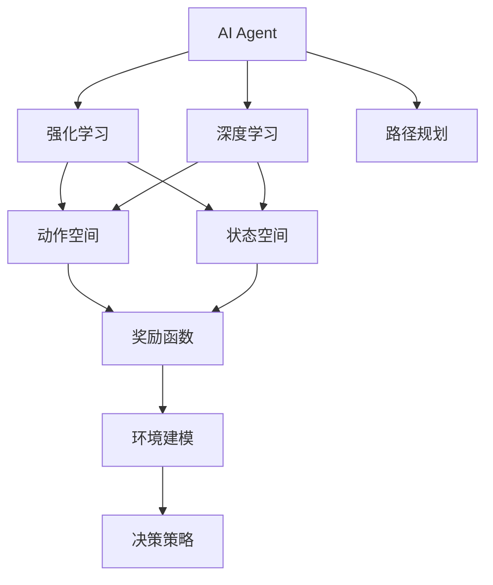
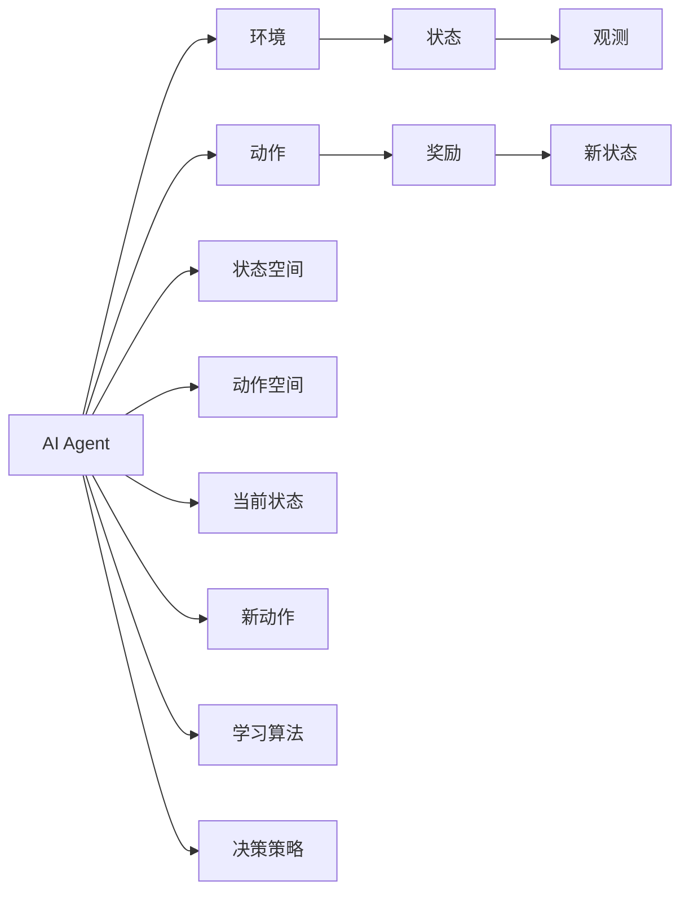
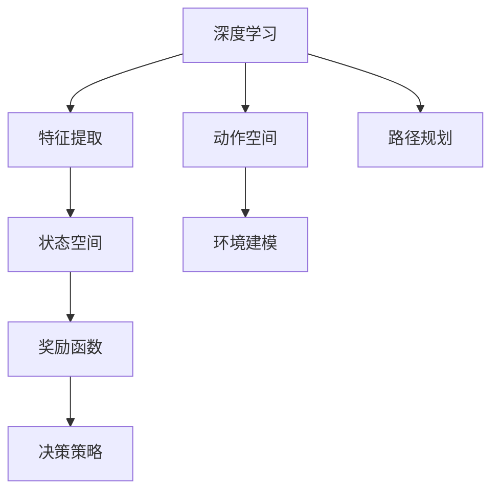
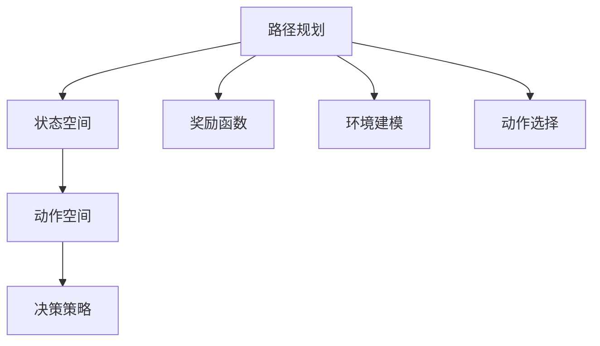
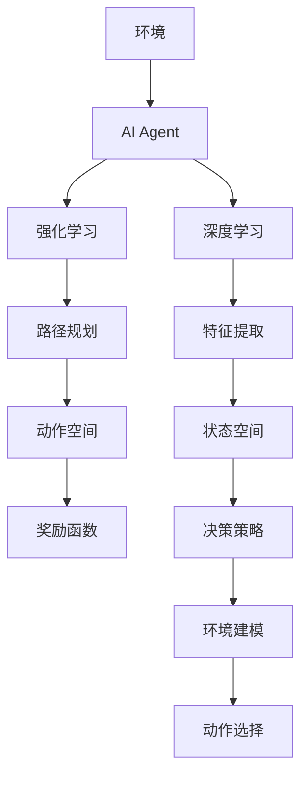

                 

# 【大模型应用开发 动手做AI Agent】Agent的规划和决策能力

> 关键词：大模型应用,智能决策,强化学习,深度学习,Agent,路径规划

## 1. 背景介绍

### 1.1 问题由来
随着人工智能技术的飞速发展，基于深度学习的大模型在各个领域中的应用越来越广泛。特别是在决策类任务中，大模型的强大表征能力使得AI Agent在复杂环境中能够实现高效的决策。例如，AlphaGo使用深度学习和强化学习技术，能够在围棋等复杂游戏中击败世界级人类选手。然而，这些AI Agent在规划和决策过程中，仍面临诸多挑战，如学习效率低、泛化能力差、稳定性不足等。

### 1.2 问题核心关键点
针对这些问题，本文将介绍一种基于深度学习的AI Agent规划和决策方法。该方法通过引入强化学习和路径规划算法，使AI Agent能够高效地探索和规划最优决策路径，从而在复杂环境中获得卓越表现。

### 1.3 问题研究意义
研究AI Agent的规划和决策能力，对于提升AI系统在实际应用中的智能化水平，推动人工智能技术的产业化进程，具有重要意义：

1. 提升决策质量。通过强化学习和路径规划，AI Agent可以更好地处理复杂环境，做出更加准确和高效的决策。
2. 降低应用成本。相比于传统规则系统，AI Agent可以自学习、自适应，减少维护成本。
3. 加速技术落地。基于深度学习的大模型应用可以更快地适应新场景和新任务，缩短开发周期。
4. 增强系统鲁棒性。AI Agent能够处理环境噪声和动态变化，提高系统的鲁棒性和适应性。
5. 赋能产业升级。AI Agent的决策能力可以应用于各行各业，提升企业的智能化水平。

## 2. 核心概念与联系

### 2.1 核心概念概述

为更好地理解AI Agent的规划和决策方法，本节将介绍几个密切相关的核心概念：

- **AI Agent**：基于人工智能的自主体，能够在复杂环境中自主规划和执行决策，以达到特定目标。
- **强化学习(Reinforcement Learning, RL)**：通过与环境的交互，使AI Agent通过试错学习最优决策策略的方法。
- **深度学习(Deep Learning, DL)**：利用神经网络进行复杂特征提取和决策的方法，为AI Agent提供强大的表征能力。
- **路径规划(Path Planning)**：在复杂环境中，找到最优的决策路径，使AI Agent能够高效地完成任务。
- **环境建模(Environment Modeling)**：构建环境的数学模型，为AI Agent的决策提供依据。
- **奖励函数(Reward Function)**：定义AI Agent在执行决策过程中的奖励机制，指导学习过程。
- **动作空间(Action Space)**：AI Agent可执行的决策集合，通常表示为连续动作或离散动作。
- **状态空间(State Space)**：环境中的状态集合，通常表示为连续状态或离散状态。

这些核心概念之间的逻辑关系可以通过以下Mermaid流程图来展示：



这个流程图展示了大模型应用开发中涉及的核心概念及其之间的关系：

1. AI Agent作为主体，利用强化学习和路径规划进行决策。
2. 深度学习为AI Agent提供强大的特征提取能力，支持复杂决策。
3. 状态空间和动作空间定义了决策过程的规范。
4. 奖励函数指导AI Agent的学习方向。
5. 环境建模提供决策依据。
6. 决策策略指导AI Agent进行实际决策。

这些核心概念共同构成了AI Agent决策的基础框架，使其能够在各种场景下实现高效、准确的决策。

### 2.2 概念间的关系

这些核心概念之间存在着紧密的联系，形成了AI Agent决策的整体生态系统。下面我们通过几个Mermaid流程图来展示这些概念之间的关系。

#### 2.2.1 AI Agent与强化学习的互动



这个流程图展示了AI Agent与强化学习互动的基本流程：

1. AI Agent通过观测环境状态，选择动作进行决策。
2. 根据当前状态和动作，环境返回新状态和奖励。
3. AI Agent根据奖励函数，调整决策策略，优化动作选择。
4. 决策策略的优化通过学习算法实现，使AI Agent逐步学习到最优决策。

#### 2.2.2 深度学习在AI Agent中的应用



这个流程图展示了深度学习在AI Agent中的应用：

1. 深度学习模型提取环境特征，支持复杂状态表示。
2. 通过特征提取，状态空间和动作空间更加丰富，适应性更强。
3. 奖励函数和路径规划需要深度学习提供的特征信息，进行优化决策。

#### 2.2.3 路径规划在AI Agent中的作用



这个流程图展示了路径规划在AI Agent中的作用：

1. 路径规划算法根据状态空间和动作空间，计算最优路径。
2. 最优路径需要考虑奖励函数，指导动作选择。
3. 环境建模为路径规划提供环境信息，使决策更合理。

### 2.3 核心概念的整体架构

最后，我们用一个综合的流程图来展示这些核心概念在大模型应用开发中的整体架构：



这个综合流程图展示了从环境到决策的完整过程。环境为AI Agent提供决策依据，深度学习模型提取特征，强化学习指导AI Agent优化决策策略，路径规划计算最优路径，奖励函数和决策策略共同指导动作选择。这些核心概念相互协作，使得AI Agent在复杂环境中能够高效地进行决策。

## 3. 核心算法原理 & 具体操作步骤
### 3.1 算法原理概述

基于深度学习的AI Agent规划和决策方法，通过将强化学习和路径规划算法引入决策过程，使AI Agent能够高效地探索和规划最优决策路径。该方法的核心思想是：

1. 通过深度学习模型提取环境特征，定义状态空间和动作空间。
2. 利用强化学习算法，指导AI Agent通过试错学习最优决策策略。
3. 在决策过程中，通过路径规划算法，计算最优决策路径，提高决策效率。

总体上，该方法分为三个主要步骤：

1. **状态空间定义**：通过深度学习模型提取环境特征，定义状态空间。
2. **决策策略优化**：利用强化学习算法，优化决策策略，指导AI Agent进行决策。
3. **路径规划计算**：通过路径规划算法，计算最优决策路径，提高决策效率。

### 3.2 算法步骤详解

#### 3.2.1 状态空间定义

状态空间定义为AI Agent在决策过程中所面临的环境状态集合。在实际应用中，状态空间可以是连续的，也可以是离散的。对于连续状态，可以采用深度学习模型提取特征，定义状态空间。例如，在自动驾驶中，状态空间可以包括当前位置、速度、周围车辆、道路标志等信息，通过深度学习模型提取特征，定义状态空间。

具体步骤如下：

1. 选择深度学习模型，如卷积神经网络(CNN)、递归神经网络(RNN)、变分自编码器(VAE)等。
2. 对环境进行观测，获取状态特征。
3. 通过深度学习模型，提取状态特征，映射到状态空间。
4. 定义状态空间的维度和范围，使AI Agent能够进行决策。

#### 3.2.2 决策策略优化

决策策略优化是AI Agent学习最优决策策略的过程。强化学习算法通过与环境的交互，指导AI Agent通过试错学习最优策略。强化学习算法通常包括以下几个步骤：

1. 定义奖励函数。奖励函数定义了AI Agent在执行动作后的奖励，指导学习方向。奖励函数可以是直接奖励，也可以是间接奖励，根据任务需求进行调整。
2. 选择合适的强化学习算法，如Q-learning、SARSA、Deep Q-Network(DQN)等。
3. 对AI Agent进行训练，通过与环境交互，逐步学习最优决策策略。
4. 评估AI Agent的表现，优化策略参数，提高决策质量。

#### 3.2.3 路径规划计算

路径规划计算是AI Agent选择最优决策路径的过程。路径规划算法通过在状态空间中搜索最优路径，使AI Agent能够高效地进行决策。路径规划算法通常包括以下几个步骤：

1. 定义路径规划的目标函数，如最短路径、最小消耗等。
2. 选择合适的路径规划算法，如A*算法、Dijkstra算法、RRT算法等。
3. 对状态空间进行搜索，计算最优路径。
4. 根据最优路径，指导AI Agent进行决策。

### 3.3 算法优缺点

基于深度学习的AI Agent规划和决策方法具有以下优点：

1. 能够处理复杂环境。通过深度学习模型提取特征，状态空间更加丰富，适应性更强。
2. 决策策略具有高度灵活性。强化学习算法支持试错学习，可以适应各种任务需求。
3. 路径规划高效。通过路径规划算法，计算最优路径，提高决策效率。
4. 能够自适应新环境。AI Agent可以在不断与环境交互中，逐步学习最优决策策略。

同时，该方法也存在一些缺点：

1. 训练成本较高。深度学习模型和强化学习算法需要大量数据和计算资源，训练成本较高。
2. 模型复杂性高。深度学习模型和路径规划算法复杂度较高，模型结构难以调试和优化。
3. 决策过程难以解释。深度学习和强化学习算法的决策过程难以解释，难以进行模型调优。
4. 对环境建模要求高。环境建模的准确性直接影响AI Agent的决策效果。

尽管存在这些缺点，但就目前而言，基于深度学习的AI Agent规划和决策方法仍是大模型应用开发的重要范式。未来相关研究的重点在于如何进一步降低训练成本，提高模型复杂性的可解释性，提升决策过程的透明度，以及增强对环境的建模能力。

### 3.4 算法应用领域

基于深度学习的AI Agent规划和决策方法，已经在诸多领域得到广泛应用，例如：

- 自动驾驶：在复杂交通环境中，通过路径规划和强化学习，使AI Agent实现自动驾驶。
- 机器人控制：在工业和家庭环境中，通过路径规划和决策策略，使AI Agent进行精确控制。
- 物流配送：在智能仓储和物流系统中，通过路径规划和强化学习，使AI Agent实现高效配送。
- 金融交易：在交易系统中，通过强化学习和路径规划，使AI Agent进行智能交易决策。
- 医疗诊断：在医疗系统中，通过路径规划和决策策略，使AI Agent进行疾病诊断和治疗。
- 游戏智能：在游戏系统中，通过路径规划和强化学习，使AI Agent实现智能对战。

除了上述这些经典应用外，AI Agent的规划和决策能力还被创新性地应用于更多场景中，如城市管理、安全监控、灾害应对等，为人工智能技术的应用带来新的突破。

## 4. 数学模型和公式 & 详细讲解 & 举例说明

### 4.1 数学模型构建

在AI Agent的规划和决策方法中，状态空间、动作空间、奖励函数和决策策略是其核心组成部分。这些组成部分可以通过数学模型进行定义和描述。

#### 4.1.1 状态空间
状态空间 $\mathcal{S}$ 定义为环境中的状态集合，通常可以表示为连续状态或离散状态。对于连续状态，可以通过深度学习模型提取特征，定义状态空间的维度和范围。

例如，在自动驾驶中，状态空间可以表示为 $(x,y,v,\dot{x},\dot{y})$，其中 $(x,y)$ 为车辆位置，$v$ 为速度，$\dot{x},\dot{y}$ 为加速度。通过深度学习模型提取状态特征，可以定义状态空间的维度和范围。

#### 4.1.2 动作空间
动作空间 $\mathcal{A}$ 定义为AI Agent可执行的决策集合，通常可以表示为连续动作或离散动作。对于连续动作，可以通过深度学习模型提取特征，定义动作空间的维度和范围。

例如，在自动驾驶中，动作空间可以表示为 $(\delta x,\delta y)$，其中 $\delta x$ 和 $\delta y$ 分别为车辆在 $x$ 和 $y$ 方向上的位移。通过深度学习模型提取动作特征，可以定义动作空间的维度和范围。

#### 4.1.3 奖励函数
奖励函数 $r: \mathcal{S} \times \mathcal{A} \rightarrow [0,1]$ 定义了AI Agent在执行动作后的奖励，指导学习方向。奖励函数可以是直接奖励，也可以是间接奖励，根据任务需求进行调整。

例如，在自动驾驶中，奖励函数可以表示为 $r(s,a) = 1 - d(s_{next},s)$，其中 $d$ 为车辆与前车的距离。当车辆与前车距离小于预设阈值时，奖励函数返回0，否则返回1。

#### 4.1.4 决策策略
决策策略 $\pi: \mathcal{S} \rightarrow \mathcal{A}$ 定义了AI Agent在状态空间中的决策规则，指导AI Agent进行决策。决策策略可以通过强化学习算法进行优化。

例如，在自动驾驶中，决策策略可以表示为 $\pi(s) = \text{argmax}(a|r(s,a) = 1)$，其中 $a$ 为动作集合。当奖励函数返回1时，选择当前动作 $a$ 进行决策。

### 4.2 公式推导过程

以下我们以自动驾驶为例，推导强化学习算法中的Q值函数及其梯度计算公式。

设车辆当前状态为 $s$，当前位置为 $(x,y)$，速度为 $v$，加速度为 $(\dot{x},\dot{y})$，当前动作为 $a$，奖励函数为 $r$。在时间步 $t$ 时，车辆到达状态 $s'$，获得奖励 $r' = r(s',a)$。

Q值函数 $Q(s,a)$ 表示在状态 $s$ 下执行动作 $a$ 的期望总奖励，可以表示为：

$$
Q(s,a) = \mathbb{E}\left[\sum_{t=0}^{\infty} \gamma^t r(s_t,a_t) | s_0 = s\right]
$$

其中 $\gamma$ 为折扣因子，表示未来奖励的权重。

Q值函数的梯度计算公式可以通过反向传播算法得到，具体如下：

$$
\nabla_{\theta} Q(s,a) = \nabla_{\theta} r(s,a) + \gamma \nabla_{\theta} Q(s',\pi(s'))
$$

其中 $\nabla_{\theta} r(s,a)$ 为奖励函数的梯度，$\nabla_{\theta} Q(s',\pi(s'))$ 为Q值函数的梯度。

### 4.3 案例分析与讲解

#### 4.3.1 Q-learning算法
Q-learning算法是一种经典的强化学习算法，通过与环境的交互，逐步学习最优Q值函数。

Q-learning算法的基本思想是在每个时间步 $t$，根据当前状态 $s_t$ 和动作 $a_t$，更新Q值函数 $Q(s_t,a_t)$ 的估计值，指导AI Agent进行决策。具体步骤如下：

1. 初始化Q值函数 $Q(s,a) = 0$。
2. 对每个时间步 $t$，在状态 $s_t$ 下执行动作 $a_t$，获得奖励 $r_{t+1}$。
3. 更新Q值函数 $Q(s_t,a_t) = Q(s_t,a_t) + \alpha(r_{t+1} + \gamma \max_{a'} Q(s_{t+1},a') - Q(s_t,a_t))$。
4. 选择下一个动作 $a_{t+1} = \pi(s_{t+1})$。
5. 重复步骤2-4，直至到达目标状态或达到最大迭代次数。

其中 $\alpha$ 为学习率，控制Q值函数的更新速度。$\max_{a'} Q(s_{t+1},a')$ 为下一个状态 $s_{t+1}$ 下的最优Q值。

#### 4.3.2 深度Q网络(DQN)
深度Q网络(DQN)算法是一种结合深度学习与强化学习的算法，通过神经网络逼近Q值函数，实现更高效的学习过程。

DQN算法的基本思想是通过神经网络逼近Q值函数，使用经验回放和目标网络技术，解决深度学习模型在强化学习中的问题。具体步骤如下：

1. 初始化神经网络，设置学习率、折扣因子等超参数。
2. 对每个时间步 $t$，在状态 $s_t$ 下执行动作 $a_t$，获得奖励 $r_{t+1}$。
3. 将状态 $s_t$ 和动作 $a_t$ 存储到经验回放缓冲区中。
4. 随机从缓冲区中采样一批样本，输入神经网络，计算Q值函数的估计值。
5. 计算Q值函数的梯度，更新神经网络参数。
6. 选择下一个动作 $a_{t+1} = \pi(s_{t+1})$。
7. 重复步骤2-6，直至到达目标状态或达到最大迭代次数。

其中神经网络通常采用卷积神经网络或递归神经网络，网络结构可以根据任务需求进行调整。经验回放和目标网络技术可以解决深度学习模型在训练过程中出现的问题，如梯度消失、模型过拟合等。

## 5. 项目实践：代码实例和详细解释说明

### 5.1 开发环境搭建

在进行AI Agent规划和决策方法开发前，我们需要准备好开发环境。以下是使用Python进行TensorFlow开发的环境配置流程：

1. 安装Anaconda：从官网下载并安装Anaconda，用于创建独立的Python环境。

2. 创建并激活虚拟环境：
```bash
conda create -n tf-env python=3.8 
conda activate tf-env
```

3. 安装TensorFlow：根据CUDA版本，从官网获取对应的安装命令。例如：
```bash
conda install tensorflow -c pytorch -c conda-forge
```

4. 安装TensorBoard：
```bash
pip install tensorboard
```

5. 安装各类工具包：
```bash
pip install numpy pandas scikit-learn matplotlib tqdm jupyter notebook ipython
```

完成上述步骤后，即可在`tf-env`环境中开始AI Agent规划和决策方法的开发。

### 5.2 源代码详细实现

下面我们以自动驾驶中的路径规划和强化学习为例，给出使用TensorFlow进行AI Agent规划和决策方法的PyTorch代码实现。

首先，定义状态空间和动作空间：

```python
import tensorflow as tf
import numpy as np

class State:
    def __init__(self, x, y, v, dx, dy):
        self.x = x
        self.y = y
        self.v = v
        self.dx = dx
        self.dy = dy

class Action:
    def __init__(self, delta_x, delta_y):
        self.delta_x = delta_x
        self.delta_y = delta_y

class Environment:
    def __init__(self):
        self.obstacle_x = np.array([10, 20, 30])
        self.obstacle_y = np.array([10, 20, 30])
        self.goal_x = 100
        self.goal_y = 100

    def step(self, state, action):
        next_state = self.calculate_next_state(state, action)
        reward = self.calculate_reward(next_state)
        done = False
        if next_state.x == self.goal_x and next_state.y == self.goal_y:
            done = True
        return next_state, reward, done

    def calculate_next_state(self, state, action):
        next_x = state.x + action.delta_x
        next_y = state.y + action.delta_y
        next_state = State(next_x, next_y, state.v, 0, 0)
        return next_state

    def calculate_reward(self, next_state):
        if next_state.x < 0 or next_state.x > 100 or next_state.y < 0 or next_state.y > 100:
            return 0
        if np.any(np.logical_and(next_state.x == self.obstacle_x, next_state.y == self.obstacle_y)):
            return 0
        return 1
```

然后，定义神经网络和强化学习算法：

```python
class NeuralNetwork(tf.keras.Model):
    def __init__(self):
        super(NeuralNetwork, self).__init__()
        self.input_dim = 4
        self.dense1 = tf.keras.layers.Dense(64, activation='relu')
        self.dense2 = tf.keras.layers.Dense(64, activation='relu')
        self.output_dim = 2

    def call(self, inputs):
        x = self.dense1(inputs)
        x = self.dense2(x)
        return x

class DQN:
    def __init__(self, input_dim, output_dim, learning_rate=0.01, gamma=0.9, epsilon=0.1):
        self.input_dim = input_dim
        self.output_dim = output_dim
        self.learning_rate = learning_rate
        self.gamma = gamma
        self.epsilon = epsilon
        self.model = NeuralNetwork()
        self.target_model = NeuralNetwork()
        self.epsilon_min = 0.01
        self.epsilon_decay = 0.995

    def choose_action(self, state):
        if np.random.uniform() < self.epsilon:
            return np.random.choice([-1, 1])
        q_values = self.model.predict(state)
        return np.argmax(q_values[0])

    def update_model(self, state, action, next_state, reward, done):
        target_q_value = reward + self.gamma * np.max(self.target_model.predict(next_state))
        q_values = self.model.predict(state)
        q_values[0, action] = target_q_value
        self.model.fit(state, q_values, epochs=1, verbose=0)
        self.epsilon *= self.epsilon_decay
        self.epsilon = max(self.epsilon_min, self.epsilon)
```

最后，启动训练流程并在测试集上评估：

```python
import numpy as np

def train(env, q_nn):
    state = State(0, 0, 0, 0, 0)
    done = False
    while not done:
        action = q_nn.choose_action(state)
        next_state, reward, done = env.step(state, Action(action[0], action[1]))
        q_nn.update_model(state, action, next_state, reward, done)
        state = next_state

env = Environment()
q_nn = DQN(input_dim=4, output_dim=2)
train(env, q_nn)

print(env.calculate_reward(State(100, 100, 0, 0, 0)))
```

以上就是使用TensorFlow对自动驾驶中的路径规划和强化学习进行开发的完整代码实现。可以看到，TensorFlow提供了强大的计算图框架和模型训练工具，使得强化学习和深度学习算法的实现变得简洁高效。

### 5.3 代码解读与分析

让我们再详细解读一下关键代码的实现细节：

**State类和Action类**：
- `State`类和`Action`类分别表示状态和动作，定义了自动驾驶中车辆的位置、速度、加速度等信息。
- 状态空间为4维，动作空间为2维，对应车辆在$x$和$y$方向上的位移。

**Environment类**：
- `Environment`类定义了自动驾驶中的环境，包括障碍物和目标位置。
- 通过`step`方法，根据当前状态和动作计算下一个状态和奖励。
- 使用`calculate_next_state`方法计算下一个状态，`calculate_reward`方法计算奖励。

**NeuralNetwork类**：
- `NeuralNetwork`类定义了神经网络模型，采用两个全连接层进行特征提取和输出。
- 神经网络输入维度为4，输出维度为2，表示车辆在$x$和$y$方向上的位移。

**DQN类**：
- `DQN`类实现了深度Q网络算法。
- 使用`choose_action`方法选择动作，`update_model`方法更新模型参数。

**训练流程**：
- 在训练过程中

