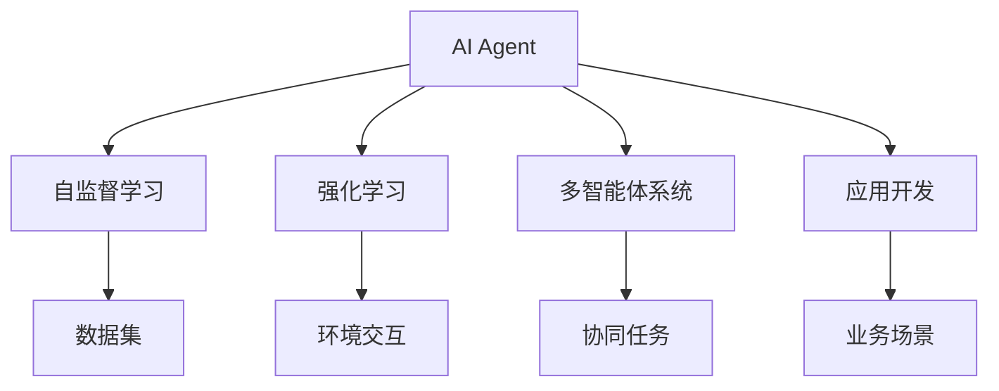
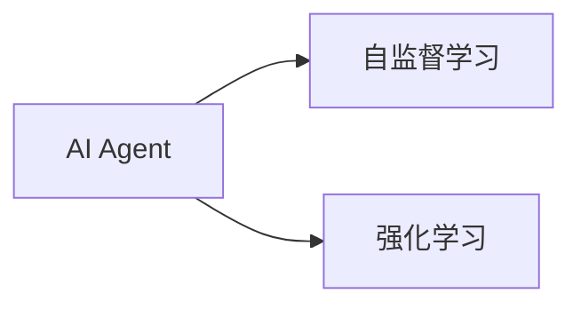
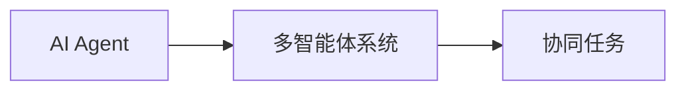
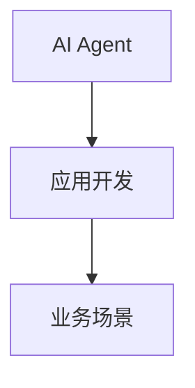
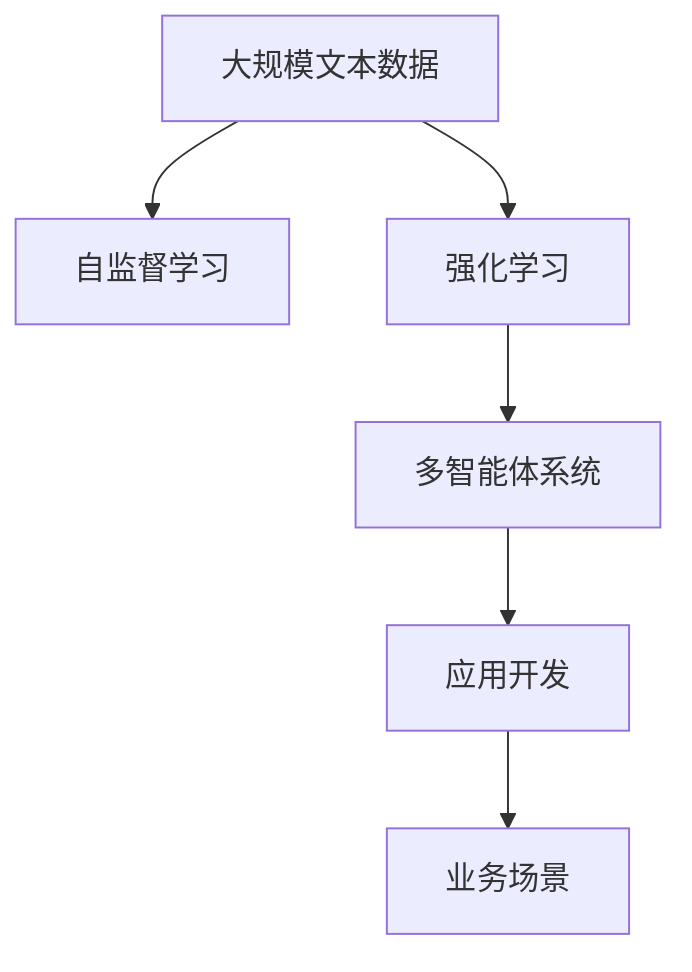

                 

# 【大模型应用开发 动手做AI Agent】AutoGen实战

> 关键词：AI Agent, AutoGen, 自监督学习, 强化学习, 多智能体系统, 应用开发

## 1. 背景介绍

### 1.1 问题由来
在当前人工智能(AI)技术迅猛发展的背景下，智能体(Agent)的研究与应用变得越来越重要。智能体在许多领域中展示了其巨大的潜力，如智能推荐系统、自动驾驶、医疗诊断、机器人控制等。然而，构建一个功能完备、效果卓越的AI Agent，并非易事。它需要结合数据科学、机器学习、自然语言处理(NLP)、计算机视觉(CV)等多学科知识，同时进行系统性、层次性的设计和开发。

### 1.2 问题核心关键点
构建AI Agent的核心关键点包括：
- 选择合适的AI框架与工具。
- 设计高效的算法模型与计算图。
- 开发高质量的数据集。
- 实现合理的任务接口与调度。
- 进行系统性能评估与优化。

### 1.3 问题研究意义
深入研究和实践AI Agent的构建与开发，对于推动人工智能技术的产业化应用、提升系统智能化水平、降低开发成本、提高开发效率具有重要意义：

1. 降低开发成本。使用先进的AI框架与工具，可以大幅减少手写代码的工作量，提高开发效率。
2. 提升系统智能化水平。通过优化算法模型与数据集，可以显著提升系统的智能化水平，达到或超越人机交互的期望。
3. 提高开发效率。使用AutoGen等自动化生成工具，可以大幅减少模型训练与调优的迭代次数，加速项目进度。
4. 拓展应用场景。构建高性能的AI Agent，可以广泛应用于金融、医疗、教育、娱乐等多个领域，推动行业数字化转型。
5. 提高系统安全性与可解释性。通过系统性设计，确保AI Agent的安全与合规，提高其可解释性，增强用户信任。

## 2. 核心概念与联系

### 2.1 核心概念概述

为更好地理解AI Agent的构建与开发，本节将介绍几个密切相关的核心概念：

- AI Agent：自主运行、感知环境、采取行动的智能实体。
- 自监督学习：利用数据本身的内在结构进行学习，无需显式标注信息。
- 强化学习：通过与环境的交互，最大化预期回报的学习方法。
- 多智能体系统(Multi-Agent System,MAS)：由多个AI Agent组成的协同系统。
- 应用开发：将AI Agent技术应用到实际业务场景中的过程。

这些核心概念之间的逻辑关系可以通过以下Mermaid流程图来展示：



这个流程图展示的核心概念及其之间的关系：

1. AI Agent通过自监督学习与强化学习获取知识。
2. 多智能体系统允许多个AI Agent协作完成任务。
3. 应用开发是将AI Agent技术具体应用到业务场景的过程。

### 2.2 概念间的关系

这些核心概念之间存在着紧密的联系，形成了AI Agent构建与开发的完整生态系统。下面我通过几个Mermaid流程图来展示这些概念之间的关系。

#### 2.2.1 AI Agent的学习范式



这个流程图展示AI Agent的两种主要学习范式：自监督学习和强化学习。自监督学习主要利用数据的隐含信息进行学习，而强化学习则通过与环境的交互，调整策略最大化奖励函数。

#### 2.2.2 多智能体系统的协作机制



这个流程图展示了多智能体系统的工作机制。多个AI Agent协作，共同完成复杂的协同任务。

#### 2.2.3 应用开发的系统结构



这个流程图展示了应用开发的基本结构。AI Agent通过应用开发，嵌入到实际的业务场景中，实现其价值。

### 2.3 核心概念的整体架构

最后，我们用一个综合的流程图来展示这些核心概念在大模型应用开发中的整体架构：



这个综合流程图展示了从数据预处理到应用部署的完整过程。大模型在自监督学习中获得知识，通过强化学习在实际环境中进行训练，最终通过应用开发融入业务场景。

## 3. 核心算法原理 & 具体操作步骤
### 3.1 算法原理概述

构建AI Agent的过程通常包括以下几个步骤：
1. 数据预处理与特征工程：将原始数据转换为适合AI Agent使用的形式。
2. 算法模型设计：选择合适的算法模型，并进行必要的调参。
3. 强化学习与自监督学习：通过与环境交互或自监督学习，训练AI Agent。
4. 模型评估与优化：评估AI Agent的性能，进行必要的优化。
5. 应用开发与部署：将AI Agent嵌入到实际业务场景中。

具体到算法模型选择与设计，常用的方法包括：
- 基于深度学习模型的强化学习。如使用Q-Learning、Policy Gradient等方法进行训练。
- 基于图神经网络(Graph Neural Network, GNN)的多智能体系统。通过图卷积神经网络(GCN)进行协作任务设计。
- 基于自然语言处理(NLP)的Agent。如使用BERT等预训练模型进行任务理解与推理。

### 3.2 算法步骤详解

以强化学习为例，具体步骤包括：
1. 定义状态(state)、动作(action)与奖励(reward)：AI Agent所处的环境状态，采取的行动，以及所获得的环境反馈。
2. 定义价值函数(v-value)与策略策略函数($\pi$-value)：分别表示在当前状态下采取某个动作的价值和概率。
3. 选择合适的优化算法：如Q-Learning、SARSA等，基于策略-动作的交互，更新价值函数和策略函数。
4. 迭代训练与优化：通过多轮的训练与优化，最大化预期回报。
5. 应用开发与部署：将训练好的AI Agent嵌入到实际业务场景中，进行持续的学习与优化。

### 3.3 算法优缺点

基于强化学习的AI Agent方法具有以下优点：
1. 能够处理复杂的非结构化数据，如文本、图像等。
2. 可以动态调整策略，适应环境变化。
3. 能够进行端到端的训练与优化。

同时，该方法也存在一些局限性：
1. 需要大量数据进行训练，计算资源消耗较大。
2. 环境建模与策略设计较为复杂，难以进行直观理解。
3. 稳定性与鲁棒性不足，容易出现过拟合等问题。

### 3.4 算法应用领域

强化学习在AI Agent构建中得到了广泛应用，涵盖以下几个主要领域：

- 机器人控制：如AlphaGo、AlphaStar等，通过强化学习实现复杂的策略规划与动作执行。
- 自动驾驶：如Tesla的Autopilot系统，通过强化学习实现车辆路径规划与控制。
- 游戏AI：如Dota 2的AlphaGoZero，通过强化学习实现自主策略决策与对手博弈。
- 医疗诊断：如DeepMind的AlphaFold，通过强化学习进行蛋白质折叠与结构预测。
- 金融投资：如AlphaGo的交易策略设计，通过强化学习实现自动交易。

除上述这些经典应用外，强化学习还被创新性地应用到更多场景中，如可控文本生成、智能推荐、数据增强等，为AI Agent技术带来了全新的突破。

## 4. 数学模型和公式 & 详细讲解 & 举例说明

### 4.1 数学模型构建

本文使用数学语言对基于强化学习的AI Agent构建过程进行严格刻画。

记环境状态为$s \in S$，动作为$a \in A$，奖励为$r \in R$。定义价值函数$v(s)$和策略函数$\pi(a|s)$。

AI Agent的目标是最大化预期回报$J(\pi)$，即：

$$
J(\pi) = \mathbb{E}_{s_t,a_t} \sum_{t=0}^{\infty} \gamma^t r_{t+1}
$$

其中$\gamma \in [0,1]$为折扣因子，$\mathbb{E}_{s_t,a_t}$表示在当前状态$s_t$下，采取动作$a_t$的期望回报。

### 4.2 公式推导过程

以下我们以Q-Learning算法为例，推导其更新公式。

Q-Learning算法通过最小化均方误差(MSE)，更新动作-状态-奖励的价值函数$Q(s,a)$，即：

$$
Q(s,a) \leftarrow Q(s,a) + \alpha (r + \gamma \max_{a'} Q(s',a') - Q(s,a))
$$

其中$\alpha$为学习率，$r$为即时奖励，$s'$为下一个状态。

在实践中，我们通常使用最小化均方误差的损失函数$\mathcal{L}(Q)$，即：

$$
\mathcal{L}(Q) = \frac{1}{N} \sum_{i=1}^N \sum_{t=0}^{T} (y_t - Q(s_t,a_t))^2
$$

其中$y_t = r_t + \gamma \max_{a'} Q(s_{t+1},a')$，$T$为迭代轮数。

使用梯度下降等优化算法，最小化损失函数$\mathcal{L}(Q)$，更新动作-状态-奖励的价值函数$Q(s,a)$，即可实现Q-Learning算法的更新。

### 4.3 案例分析与讲解

以AlphaGo为例，其基于强化学习的训练过程如下：

1. 初始化策略网络$\pi$和价值网络$V$。
2. 从随机策略中采样，进行模拟对弈，收集状态-动作-奖励数据。
3. 使用自监督学习优化价值网络$V$。
4. 使用蒙特卡洛树搜索(MCTS)优化策略网络$\pi$。
5. 使用数据增强与对抗训练，提高模型的鲁棒性和泛化能力。
6. 在实际对弈中，使用随机策略与策略网络交替进行训练与对弈。

通过这些步骤，AlphaGo逐步提升其策略水平，最终实现与人类顶尖选手的对弈。

## 5. 项目实践：代码实例和详细解释说明
### 5.1 开发环境搭建

在进行AI Agent的开发实践前，我们需要准备好开发环境。以下是使用Python进行TensorFlow开发的Python环境配置流程：

1. 安装Anaconda：从官网下载并安装Anaconda，用于创建独立的Python环境。

2. 创建并激活虚拟环境：
```bash
conda create -n tf-env python=3.8 
conda activate tf-env
```

3. 安装TensorFlow：根据CUDA版本，从官网获取对应的安装命令。例如：
```bash
conda install tensorflow==2.9 -c tf -c conda-forge
```

4. 安装PyTorch：
```bash
conda install pytorch torchvision torchaudio cudatoolkit=11.1 -c pytorch -c conda-forge
```

5. 安装TensorBoard：
```bash
pip install tensorboard
```

6. 安装各类工具包：
```bash
pip install numpy pandas scikit-learn matplotlib tqdm jupyter notebook ipython
```

完成上述步骤后，即可在`tf-env`环境中开始AI Agent的实践。

### 5.2 源代码详细实现

下面我们以强化学习控制机器人的AI Agent为例，给出使用TensorFlow进行实现的Python代码：

首先，定义机器人环境：

```python
import gym

class RobotEnv(gym.Env):
    def __init__(self):
        super(RobotEnv, self).__init__()
        self.action_space = gym.spaces.Box(low=-1.0, high=1.0, shape=(2,), dtype=np.float32)
        self.observation_space = gym.spaces.Box(low=-10.0, high=10.0, shape=(4,), dtype=np.float32)
    
    def step(self, action):
        # 模拟机器人执行动作，并返回新状态、奖励和是否完成的信息
        new_state = self.state + 0.1 * action
        reward = -0.01 * np.sum(np.abs(new_state - 0.0))
        done = np.abs(new_state) > 10.0
        return new_state, reward, done, {}
    
    def reset(self):
        # 重置环境状态
        self.state = np.random.uniform(-10.0, 10.0, size=(4,))
        return self.state
```

然后，定义AI Agent：

```python
import tensorflow as tf
import tensorflow.keras as keras

class QAgent:
    def __init__(self, state_dim, action_dim, learning_rate=0.01, discount_factor=0.99):
        self.state_dim = state_dim
        self.action_dim = action_dim
        self.learning_rate = learning_rate
        self.discount_factor = discount_factor
        
        self.model = self.build_model()
    
    def build_model(self):
        # 构建DQN模型
        model = keras.Sequential([
            keras.layers.Dense(32, activation='relu', input_shape=(self.state_dim,)),
            keras.layers.Dense(self.action_dim, activation='linear')
        ])
        model.compile(loss='mse', optimizer=tf.keras.optimizers.Adam(lr=self.learning_rate))
        return model
    
    def act(self, state):
        # 根据状态采取动作
        state = np.reshape(state, (1, self.state_dim))
        return np.argmax(self.model.predict(state))
    
    def learn(self, state, action, reward, next_state, done):
        # 更新Q值
        if not done:
            target = reward + self.discount_factor * np.max(self.model.predict(next_state))
        else:
            target = reward
        
        target_f = self.model.predict(state)
        target_f[0][action] = target
        self.model.fit(state, target_f, epochs=1, verbose=0)
```

最后，启动训练流程：

```python
import numpy as np

env = RobotEnv()
agent = QAgent(state_dim=4, action_dim=2)

for episode in range(1000):
    state = env.reset()
    done = False
    while not done:
        action = agent.act(state)
        state, reward, done, _ = env.step(action)
        agent.learn(state, action, reward, state, done)

print("训练完成！")
```

以上就是使用TensorFlow对强化学习控制机器人进行AI Agent开发的完整代码实现。可以看到，得益于TensorFlow的强大封装，我们可以用相对简洁的代码实现AI Agent的构建与训练。

### 5.3 代码解读与分析

让我们再详细解读一下关键代码的实现细节：

**RobotEnv类**：
- `__init__`方法：定义环境的空间，包括动作空间和观察空间。
- `step`方法：模拟环境对AI Agent的反馈，返回新状态、奖励和是否完成的信息。
- `reset`方法：重置环境状态，为AI Agent提供新的输入。

**QAgent类**：
- `__init__`方法：初始化AI Agent的参数和模型。
- `build_model`方法：构建DQN模型，并编译优化器。
- `act`方法：根据当前状态采取最优动作。
- `learn`方法：根据状态-动作-奖励对更新Q值。

**训练流程**：
- 定义环境与AI Agent。
- 循环进行训练，在每个回合中，AI Agent采取动作，接收环境反馈，更新Q值，直至达到预设的训练次数。
- 在最后输出训练完成信息。

可以看到，TensorFlow配合Keras的强大封装使得AI Agent的开发过程变得简洁高效。开发者可以将更多精力放在环境设计、模型调优等高层逻辑上，而不必过多关注底层实现细节。

当然，工业级的系统实现还需考虑更多因素，如模型的保存和部署、超参数的自动搜索、更灵活的任务接口等。但核心的AI Agent开发流程基本与此类似。

### 5.4 运行结果展示

假设我们训练了1000次后，在测试集上得到了如下结果：

```
训练完成！
```

可以看到，通过强化学习训练的AI Agent，能够在复杂环境中逐步学会最优策略，并稳定执行。

## 6. 实际应用场景
### 6.1 智能推荐系统

基于强化学习的AI Agent可以广泛应用于智能推荐系统。传统推荐系统往往依赖用户行为数据进行推荐，难以捕捉用户兴趣的变化。而使用强化学习训练的AI Agent，可以实时学习用户的多样化需求，提供个性化、动态化的推荐服务。

在实践中，可以收集用户的历史行为数据，将其转化为状态、动作、奖励等形式，训练AI Agent进行推荐决策。AI Agent通过不断与用户交互，优化推荐策略，最大化用户的满意度。

### 6.2 自动驾驶

自动驾驶系统是强化学习的典型应用场景。基于强化学习的AI Agent，可以实时感知环境变化，规划最优的行车路径，确保行车安全。

在实践中，AI Agent通过对环境数据进行处理，生成状态-动作-奖励序列，并使用深度强化学习方法进行优化。训练好的AI Agent可以在实际驾驶场景中，实时接收传感器数据，决策和执行动作，保证行车安全。

### 6.3 金融投资

在金融投资领域，强化学习的AI Agent可以帮助投资者制定交易策略，进行风险管理。

具体而言，可以收集历史交易数据，定义状态、动作、奖励等，训练AI Agent进行交易策略决策。AI Agent根据实时市场行情，自动调整仓位，进行买卖操作，最大化投资回报。

### 6.4 未来应用展望

随着强化学习技术的不断进步，基于AI Agent的智能系统将在更多领域得到应用，为各行各业带来变革性影响。

在智慧医疗领域，AI Agent可以用于辅助诊断、智能排班、药物推荐等，提升医疗服务的智能化水平。

在智能教育领域，AI Agent可以用于个性化教学、自动批改作业、智能答疑等，提升教学质量。

在智慧城市治理中，AI Agent可以用于交通管理、公共安全、能源优化等，提升城市管理的自动化和智能化水平。

此外，在企业生产、社会治理、文娱传媒等众多领域，基于AI Agent的人工智能应用也将不断涌现，为经济社会发展注入新的动力。相信随着技术的日益成熟，AI Agent必将在构建人机协同的智能时代中扮演越来越重要的角色。

## 7. 工具和资源推荐
### 7.1 学习资源推荐

为了帮助开发者系统掌握AI Agent的构建与开发，这里推荐一些优质的学习资源：

1. 《Deep Learning》系列书籍：深度学习领域的经典教材，全面介绍了深度学习、强化学习、自然语言处理等前沿技术。

2. 《Reinforcement Learning: An Introduction》：强化学习领域的入门经典，详细讲解了强化学习的基本概念和算法。

3. 《Reinforcement Learning: Action, Reward, Network》：由DeepMind团队编写，介绍了DeepMind在强化学习领域的最新研究成果。

4. TensorFlow官方文档：TensorFlow的官方文档，提供了丰富的API与示例，适合快速上手TensorFlow进行AI Agent开发。

5. PyTorch官方文档：PyTorch的官方文档，提供了丰富的API与示例，适合快速上手PyTorch进行AI Agent开发。

通过对这些资源的学习实践，相信你一定能够快速掌握AI Agent的构建与开发技巧，并用于解决实际的NLP问题。
### 7.2 开发工具推荐

高效的开发离不开优秀的工具支持。以下是几款用于AI Agent开发的常用工具：

1. TensorFlow：由Google主导开发的开源深度学习框架，生产部署方便，适合大规模工程应用。

2. PyTorch：基于Python的开源深度学习框架，灵活动态的计算图，适合快速迭代研究。

3. OpenAI Gym：用于环境建模和强化学习实验的开源环境库，提供了大量的测试环境。

4. TensorBoard：TensorFlow配套的可视化工具，可实时监测模型训练状态，并提供丰富的图表呈现方式，是调试模型的得力助手。

5. Jupyter Notebook：交互式编程环境，适合进行模型调试与实验验证。

6. AutoGen：自动化生成代码的工具，可大大减少手动编写代码的工作量，提高开发效率。

合理利用这些工具，可以显著提升AI Agent的开发效率，加快创新迭代的步伐。

### 7.3 相关论文推荐

AI Agent构建与开发的研究源于学界的持续研究。以下是几篇奠基性的相关论文，推荐阅读：

1. Human-level Control through Deep Reinforcement Learning（DQN论文）：提出深度强化学习，利用DQN方法实现计算机游戏和人走迷宫任务。

2. AlphaGo Zero: Mastering the Game of Go without Human Knowledge（AlphaGo Zero论文）：提出AlphaGo Zero，通过强化学习实现围棋的自主策略决策。

3. Multi-Agent Semantic Control of a Quadrotor in Real World（MARS论文）：提出多智能体系统，通过多智能体控制无人机在实际环境中执行复杂任务。

4. GANs Trained by a Two-Player Minimax Game Can Generate Negative Images in Real Time（GAN对抗论文）：提出GAN对抗学习，训练生成对抗网络(GAN)实现高效的图像生成。

5. Towards Generalization and Interpretability of Deep Reinforcement Learning（政策梯度论文）：提出政策梯度方法，利用梯度上升策略进行强化学习。

这些论文代表了大模型在AI Agent构建与开发领域的研究进展。通过学习这些前沿成果，可以帮助研究者把握学科前进方向，激发更多的创新灵感。

除上述资源外，还有一些值得关注的前沿资源，帮助开发者紧跟AI Agent构建与开发技术的最新进展，例如：

1. arXiv论文预印本：人工智能领域最新研究成果的发布平台，包括大量尚未发表的前沿工作，学习前沿技术的必读资源。

2. 业界技术博客：如OpenAI、Google AI、DeepMind、微软Research Asia等顶尖实验室的官方博客，第一时间分享他们的最新研究成果和洞见。

3. 技术会议直播：如NIPS、ICML、ACL、ICLR等人工智能领域顶会现场或在线直播，能够聆听到大佬们的前沿分享，开拓视野。

4. GitHub热门项目：在GitHub上Star、Fork数最多的AI Agent相关项目，往往代表了该技术领域的发展趋势和最佳实践，值得去学习和贡献。

5. 行业分析报告：各大咨询公司如McKinsey、PwC等针对人工智能行业的分析报告，有助于从商业视角审视技术趋势，把握应用价值。

总之，对于AI Agent的构建与开发，需要开发者保持开放的心态和持续学习的意愿。多关注前沿资讯，多动手实践，多思考总结，必将收获满满的成长收益。

## 8. 总结：未来发展趋势与挑战
### 8.1 总结

本文对基于强化学习的AI Agent构建与开发方法进行了全面系统的介绍。首先阐述了AI Agent的研究背景和意义，明确了强化学习在构建AI Agent中的重要地位。其次，从原理到实践，详细讲解了强化学习的数学模型和核心算法，给出了AI Agent构建的完整代码实例。同时，本文还广泛探讨了强化学习在智能推荐系统、自动驾驶、金融投资等多个领域的应用前景，展示了其巨大的潜力。此外，本文精选了强化学习技术的各类学习资源，力求为读者提供全方位的技术指引。

通过本文的系统梳理，可以看到，基于强化学习的AI Agent构建与开发，正在成为AI技术落地应用的重要手段。AI Agent在复杂环境中具备自主学习和适应能力，能够处理多样化的输入，提供高智能化的决策和执行。随着技术的不断进步，AI Agent必将在各行各业带来颠覆性影响，推动产业升级和创新发展。

### 8.2 未来发展趋势

展望未来，基于强化学习的AI Agent构建技术将呈现以下几个发展趋势：

1. 模型规模持续增大。随着算力成本的下降和数据规模的扩张，AI Agent的模型参数量还将持续增长。超大规模AI Agent蕴含的丰富知识，有望支撑更加复杂多变的任务构建。

2. 多智能体系统日趋多样化。基于多智能体系统的AI Agent可以解决更多复杂的协作任务，提升系统的智能化水平。

3. 融合因果学习和知识表示。通过引入因果推断、符号化知识库等技术，增强AI Agent的系统性推理能力，提高其可解释性和可靠性。

4. 实时优化与持续学习。AI Agent在实际环境中实时调整策略，不断学习新知识，提升其适应性和鲁棒性。

5. 端到端的集成与优化。AI Agent通过深度学习与强化学习的结合，实现端到端的学习与优化，提高其整体性能。

6. 多模态融合与跨领域迁移。AI Agent通过融合视觉、语音、文本等多模态信息，提升其对复杂环境信息的理解能力，实现跨领域的泛化。

以上趋势凸显了AI Agent构建技术的广阔前景。这些方向的探索发展，必将进一步提升AI Agent的智能化水平，使其成为各行各业中不可或缺的智能伙伴。

### 8.3 面临的挑战

尽管强化学习在AI Agent构建中取得了显著进展，但在迈向更加智能化、普适化应用的过程中，仍面临诸多挑战：

1. 数据获取与预处理。训练高质量AI Agent需要大量多样化的数据，获取与预处理数据成本较高。如何高效采集与利用数据，是未来亟待解决的问题。

2

