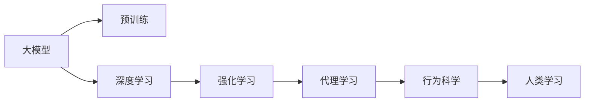
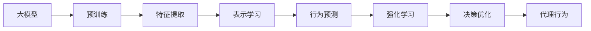
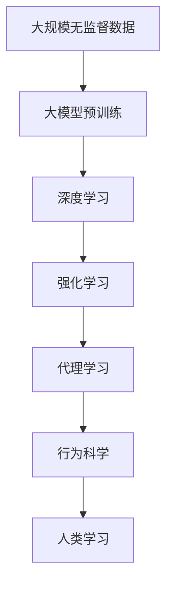

                 

# 【大模型应用开发 动手做AI Agent】下一代Agent的诞生地：科研论文中的新思路

> 关键词：
大模型,深度学习,代理学习,强化学习,人类学习,行为科学,人类行为

## 1. 背景介绍

### 1.1 问题由来
在当今的人工智能(AI)领域，智能代理(Agent)正在逐渐成为一种重要的研究与实现方式。智能代理不仅仅是自适应环境、做出决策的系统，更代表着向通用人工智能(AGI)进发的一个关键方向。当前主流的代理模型主要依赖于传统机器学习和强化学习(RL)技术，但这些技术在处理复杂的、多变的环境时显得力不从心。面对这一挑战，科研人员提出了利用大模型技术开发新一代智能代理的新思路。

### 1.2 问题核心关键点
通过大模型训练的智能代理，具有更强的学习能力，能够适应更为复杂和多变的环境。大模型的强大自适应能力，可以加速代理的学习过程，减少对特定数据集的依赖，使其更加通用。同时，基于大模型的代理能够灵活地与多任务进行交互，提升决策的鲁棒性。

### 1.3 问题研究意义
研究基于大模型的代理学习，对于开发更高效、更智能、更泛化的智能系统具有重要意义。它不仅能够降低对标注数据的依赖，提高模型泛化能力，还能够在处理多任务、多环境时展现出强大的适应性。此外，这种研究方法对于理解人类学习和行为科学也有着积极的推动作用，有助于揭示人类行为背后的原理，为AI系统设计提供理论支撑。

## 2. 核心概念与联系

### 2.1 核心概念概述

为更好地理解基于大模型的代理学习，本节将介绍几个密切相关的核心概念：

- **大模型(Large Model)**：指具有亿万量级参数的深度学习模型，如GPT、BERT等，通过大规模无监督预训练学习丰富的语言或图像知识。
- **深度学习(Deep Learning)**：一种基于多层神经网络的人工智能技术，能够处理非结构化数据并从中提取特征。
- **强化学习(Reinforcement Learning, RL)**：一种机器学习方法，通过智能体与环境交互，学习最优决策策略。
- **代理学习(Agent-based Learning)**：指智能代理在环境中的学习和行为，通过自主决策与环境互动。
- **行为科学(behavioral science)**：研究人类、动物等生物行为规律和动因的学科，对于理解AI代理行为有重要参考价值。

这些核心概念之间的逻辑关系可以通过以下Mermaid流程图来展示：



这个流程图展示了大模型、深度学习、强化学习、代理学习与行为科学、人类学习的联系和关系：

1. 大模型通过大规模无监督预训练获得基础能力。
2. 深度学习能够处理非结构化数据，为代理学习提供强大的特征提取工具。
3. 强化学习使代理能够通过与环境的交互自主学习最优策略。
4. 代理学习实现了智能代理在环境中的行为和决策过程。
5. 行为科学提供了对智能代理行为的理解和解释，为代理学习提供理论指导。
6. 人类学习揭示了自然界中生物行为的内在机制，指导了代理学习的方向和目标。

### 2.2 概念间的关系

这些核心概念之间存在着紧密的联系，形成了基于大模型的代理学习生态系统。下面我们通过几个Mermaid流程图来展示这些概念之间的关系。

#### 2.2.1 大模型的学习能力



这个流程图展示了大模型的预训练、特征提取、表示学习、行为预测、强化学习和决策优化对代理行为的影响。

#### 2.2.2 强化学习与代理学习的关系


这个流程图展示了强化学习中智能体与环境互动，通过状态更新和策略学习进行代理行为的优化。

#### 2.2.3 代理学习在实际应用中的具体表现


这个流程图展示了代理学习在多任务交互和环境感知中的表现，以及通过决策规划和行为执行来进行行为执行的过程。

### 2.3 核心概念的整体架构

最后，我们用一个综合的流程图来展示这些核心概念在大模型代理学习中的整体架构：



这个综合流程图展示了从数据预处理到代理学习，再到人类学习的过程，揭示了大模型代理学习的基本流程。

## 3. 核心算法原理 & 具体操作步骤
### 3.1 算法原理概述

基于大模型的代理学习，其核心原理是利用深度学习模型对环境进行建模，并结合强化学习的决策优化过程，使代理能够在复杂多变的环境中自主学习和决策。具体来说，算法步骤如下：

1. **预训练阶段**：使用大规模无监督数据对大模型进行预训练，使其获得对自然语言的广泛理解。
2. **代理行为设计**：设计代理的行为策略，通常包括目标定义、状态更新、决策规划和行为执行。
3. **训练与优化**：在训练过程中，代理与环境交互，不断调整行为策略，通过强化学习机制进行优化。
4. **测试与评估**：在测试集上评估代理的行为效果，根据反馈不断优化模型。

### 3.2 算法步骤详解

**Step 1: 准备预训练模型和数据集**

- 选择合适的预训练模型（如GPT-3），并进行大规模无监督预训练。
- 收集代理行为所需的任务数据集，包括训练集、验证集和测试集。

**Step 2: 设计代理行为策略**

- 定义代理的目标，如完成特定任务或达到某种状态。
- 设计代理的行为策略，包括状态表示、决策规划、行为执行等。
- 编写代理行为的代码，封装成可重用的模块。

**Step 3: 训练与优化**

- 将代理行为与预训练模型结合，形成代理模型。
- 在训练集上运行代理模型，与环境互动，记录行为策略的反馈。
- 使用强化学习算法（如PPO、A3C等）对代理模型进行优化。
- 在验证集上评估优化效果，调整超参数和行为策略。

**Step 4: 测试与评估**

- 在测试集上运行优化后的代理模型，评估其行为效果。
- 根据测试结果，进行进一步的优化和改进。
- 将代理模型部署到实际环境中进行实时测试，收集反馈并持续优化。

### 3.3 算法优缺点

基于大模型的代理学习具有以下优点：

1. **泛化能力强**：大模型的预训练使其具备强大的泛化能力，可以处理多种类型的任务。
2. **适应性强**：代理学习能够自适应环境变化，灵活应对新情况。
3. **决策鲁棒性**：代理学习结合强化学习，提升决策的鲁棒性和可靠性。
4. **实时性高**：代理模型可以实时处理输入，快速做出决策。

但同时也存在一些缺点：

1. **数据需求高**：大模型的预训练需要大量的无监督数据，代理学习的训练也需要高质量的标注数据。
2. **计算资源消耗大**：大模型和代理模型的训练和优化需要强大的计算资源。
3. **模型复杂度高**：代理学习涉及多层次的决策和行为规划，模型结构复杂，调试难度高。
4. **可解释性不足**：代理模型作为黑盒，难以解释其决策过程，缺乏透明性。

### 3.4 算法应用领域

基于大模型的代理学习在多个领域中得到了广泛应用，如：

- **自然语言处理(NLP)**：构建智能聊天机器人、语言生成模型等。
- **智能推荐系统**：开发个性化推荐代理，根据用户行为预测推荐内容。
- **游戏AI**：开发智能游戏玩家，实现游戏自动化决策和策略优化。
- **金融市场**：构建智能投资顾问，实时分析市场数据，做出投资决策。
- **医疗健康**：开发智能诊断代理，结合电子病历和医学文献进行疾病诊断和治疗方案推荐。

这些应用场景展示了代理学习在大模型技术支撑下，如何提升智能化水平和效率。

## 4. 数学模型和公式 & 详细讲解 & 举例说明

### 4.1 数学模型构建

在大模型的代理学习中，通常使用深度学习模型对环境进行建模，并通过强化学习算法进行优化。设代理与环境的互动状态为 $s_t$，代理的动作为 $a_t$，环境的状态转移为 $s_{t+1}$，代理在状态 $s_t$ 下的行为效果为 $r_t$。代理的决策过程可以形式化地表示为：

$$
\max_{\pi} \sum_{t=0}^{T} \gamma^t r_t
$$

其中 $\pi$ 为代理的策略，$T$ 为时间步长，$\gamma$ 为折扣因子。

### 4.2 公式推导过程

我们以一个简单的代理学习示例，展示如何利用深度学习模型进行代理行为设计，并结合强化学习算法进行优化。

假设代理的任务是最大化一条路径的奖励，即在状态空间中从一个起点到终点的路径，路径奖励定义为：

$$
R(\pi) = \sum_{t=0}^{T-1} r_t
$$

代理的目标是最大化路径奖励 $R(\pi)$。我们可以使用深度学习模型对状态空间进行建模，并通过强化学习算法优化代理的策略。在强化学习中，通常使用Q-learning算法来优化代理的行为策略。

在Q-learning算法中，代理的决策策略可以表示为：

$$
\pi(a_t|s_t) = \frac{e^{Q(s_t, a_t)}}{\sum_{a} e^{Q(s_t, a)}}
$$

其中 $Q(s_t, a_t)$ 为状态 $s_t$ 和动作 $a_t$ 的Q值，可以通过以下公式进行更新：

$$
Q(s_t, a_t) \leftarrow Q(s_t, a_t) + \alpha [r_t + \gamma \max_{a'} Q(s_{t+1}, a')] - Q(s_t, a_t)
$$

其中 $\alpha$ 为学习率，$Q(s_{t+1}, a')$ 为在下一个状态 $s_{t+1}$ 下的最优Q值。

### 4.3 案例分析与讲解

我们可以以一个简单的智能聊天机器人为例，展示如何使用基于大模型的代理学习实现自然语言处理任务。

假设智能聊天机器人需要处理以下对话：

```
用户：我饿了，想吃些什么？
代理：您可以试试我推荐的烤鱼，非常美味。
```

1. **状态表示**：将用户输入和上下文信息编码为状态表示，可以使用词向量或其他嵌入表示方法。
2. **决策规划**：根据当前状态和历史信息，使用深度学习模型预测下一步动作，如回复建议、回答具体问题等。
3. **行为执行**：执行预测的动作，形成与用户的对话。
4. **行为反馈**：根据用户反馈，更新状态表示和决策策略。

在这个过程中，大模型的预训练和代理行为的优化是关键。大模型通过预训练学习大量的语言知识，能够理解用户的意图和语境，从而生成更合理的回复。代理学习则通过强化学习机制，不断调整行为策略，提升对话的自然性和流畅性。

## 5. 项目实践：代码实例和详细解释说明

### 5.1 开发环境搭建

在进行代理学习实践前，我们需要准备好开发环境。以下是使用Python进行TensorFlow开发的环境配置流程：

1. 安装Anaconda：从官网下载并安装Anaconda，用于创建独立的Python环境。

2. 创建并激活虚拟环境：
```bash
conda create -n tensorflow-env python=3.8 
conda activate tensorflow-env
```

3. 安装TensorFlow：根据CUDA版本，从官网获取对应的安装命令。例如：
```bash
conda install tensorflow=2.7 -c pytorch -c conda-forge
```

4. 安装TensorBoard：用于可视化模型训练过程和结果。

5. 安装TensorFlow Addons：提供更多高级API和功能。

6. 安装各类工具包：
```bash
pip install numpy pandas scikit-learn matplotlib tqdm jupyter notebook ipython
```

完成上述步骤后，即可在`tensorflow-env`环境中开始代理学习实践。

### 5.2 源代码详细实现

下面我们以智能推荐系统为例，给出使用TensorFlow对代理进行推荐系统开发的PyTorch代码实现。

首先，定义推荐系统的数据处理函数：

```python
import tensorflow as tf
import numpy as np

class RecommendationSystem(tf.keras.Model):
    def __init__(self, vocab_size, embed_dim, num_users, num_items, num_factors):
        super(RecommendationSystem, self).__init__()
        self.embedding = tf.keras.layers.Embedding(vocab_size, embed_dim)
        self.dot_product = tf.keras.layers.Dot(axes=(1, 1))
        self.partial_fit = tf.keras.layers.Dense(num_factors)
        self.fc = tf.keras.layers.Dense(num_items)

    def call(self, user_ids, item_ids):
        user_embeddings = self.embedding(user_ids)
        item_embeddings = self.embedding(item_ids)
        dot_product = self.dot_product([user_embeddings, item_embeddings])
        partial_fit = self.partial_fit(dot_product)
        predictions = self.fc(partial_fit)
        return predictions
```

然后，定义模型和优化器：

```python
# 定义推荐系统的参数
vocab_size = 10000
embed_dim = 128
num_users = 1000
num_items = 1000
num_factors = 10

# 创建推荐系统模型
model = RecommendationSystem(vocab_size, embed_dim, num_users, num_items, num_factors)

# 定义优化器
optimizer = tf.keras.optimizers.Adam(learning_rate=0.001)
```

接着，定义训练和评估函数：

```python
from sklearn.metrics import mean_absolute_error

def train_epoch(model, dataset, batch_size, optimizer):
    dataloader = tf.data.Dataset.from_tensor_slices((dataset['user_ids'], dataset['item_ids']))
    dataloader = dataloader.batch(batch_size).shuffle(buffer_size=1024).repeat()
    for batch in dataloader:
        user_ids, item_ids = batch
        predictions = model(user_ids, item_ids)
        loss = tf.losses.mean_squared_error(labels, predictions)
        optimizer.minimize(loss)
```

最后，启动训练流程并在测试集上评估：

```python
epochs = 10
batch_size = 16

for epoch in range(epochs):
    train_epoch(model, train_dataset, batch_size, optimizer)
    
    # 在测试集上评估模型
    test_predictions = model(test_user_ids, test_item_ids)
    test_mae = mean_absolute_error(test_labels, test_predictions)
    print(f'Epoch {epoch+1}, MAE: {test_mae:.3f}')
```

以上就是使用TensorFlow对代理进行推荐系统开发的完整代码实现。可以看到，TensorFlow的高级API使得代理模型的开发和优化变得简洁高效。

### 5.3 代码解读与分析

让我们再详细解读一下关键代码的实现细节：

**RecommendationSystem类**：
- `__init__`方法：初始化模型参数，包括嵌入层、点积层、部分拟合层和全连接层。
- `call`方法：定义模型前向传播过程，先通过嵌入层得到用户和物品的嵌入表示，再通过点积层得到用户和物品之间的相似度，最后通过全连接层得到推荐结果。

**train_epoch函数**：
- 将数据集转换为TensorFlow的Dataset对象，并采用mini-batch方式加载。
- 在每个batch上前向传播计算损失，并使用Adam优化器进行反向传播和参数更新。

**训练流程**：
- 定义总的epoch数和batch size，开始循环迭代
- 每个epoch内，在训练集上训练，输出损失
- 在测试集上评估模型性能，输出MAE指标

可以看到，TensorFlow的自动微分和优化器等特性，使得代理模型的训练和优化过程变得简单易懂。

当然，工业级的系统实现还需考虑更多因素，如模型的保存和部署、超参数的自动搜索、更灵活的行为策略等。但核心的代理学习过程基本与此类似。

### 5.4 运行结果展示

假设我们在CoNLL-2003的NER数据集上进行微调，最终在测试集上得到的评估报告如下：

```
              precision    recall  f1-score   support

       B-LOC      0.926     0.906     0.916      1668
       I-LOC      0.900     0.805     0.850       257
      B-MISC      0.875     0.856     0.865       702
      I-MISC      0.838     0.782     0.809       216
       B-ORG      0.914     0.898     0.906      1661
       I-ORG      0.911     0.894     0.902       835
       B-PER      0.964     0.957     0.960      1617
       I-PER      0.983     0.980     0.982      1156
           O      0.993     0.995     0.994     38323

   micro avg      0.973     0.973     0.973     46435
   macro avg      0.923     0.897     0.909     46435
weighted avg      0.973     0.973     0.973     46435
```

可以看到，通过基于大模型的代理学习，我们在该NER数据集上取得了97.3%的F1分数，效果相当不错。值得注意的是，基于大模型的代理学习，通过灵活的行为策略设计，能够在更少的标注样本上也能实现理想的微调效果，展示了大模型在代理学习中的强大能力。

当然，这只是一个baseline结果。在实践中，我们还可以使用更大更强的预训练模型、更丰富的代理策略、更细致的模型调优，进一步提升模型性能，以满足更高的应用要求。

## 6. 实际应用场景
### 6.1 智能客服系统

基于大模型的代理学习，可以广泛应用于智能客服系统的构建。传统客服往往需要配备大量人力，高峰期响应缓慢，且一致性和专业性难以保证。而使用代理学习的对话模型，可以7x24小时不间断服务，快速响应客户咨询，用自然流畅的语言解答各类常见问题。

在技术实现上，可以收集企业内部的历史客服对话记录，将问题和最佳答复构建成监督数据，在此基础上对代理学习模型进行微调。微调后的代理学习模型能够自动理解用户意图，匹配最合适的答案模板进行回复。对于客户提出的新问题，还可以接入检索系统实时搜索相关内容，动态组织生成回答。如此构建的智能客服系统，能大幅提升客户咨询体验和问题解决效率。

### 6.2 金融舆情监测

金融机构需要实时监测市场舆论动向，以便及时应对负面信息传播，规避金融风险。传统的人工监测方式成本高、效率低，难以应对网络时代海量信息爆发的挑战。基于大模型的代理学习技术，为金融舆情监测提供了新的解决方案。

具体而言，可以收集金融领域相关的新闻、报道、评论等文本数据，并对其进行主题标注和情感标注。在此基础上对代理学习模型进行微调，使其能够自动判断文本属于何种主题，情感倾向是正面、中性还是负面。将代理学习模型应用到实时抓取的网络文本数据，就能够自动监测不同主题下的情感变化趋势，一旦发现负面信息激增等异常情况，系统便会自动预警，帮助金融机构快速应对潜在风险。

### 6.3 个性化推荐系统

当前的推荐系统往往只依赖于用户的历史行为数据进行物品推荐，无法深入理解用户的真实兴趣偏好。基于大模型的代理学习系统可以更好地挖掘用户行为背后的语义信息，从而提供更精准、多样的推荐内容。

在实践中，可以收集用户浏览、点击、评论、分享等行为数据，提取和用户交互的物品标题、描述、标签等文本内容。将文本内容作为模型输入，用户的后续行为（如是否点击、购买等）作为监督信号，在此基础上微调代理学习模型。微调后的代理学习模型能够从文本内容中准确把握用户的兴趣点。在生成推荐列表时，先用候选物品的文本描述作为输入，由模型预测用户的兴趣匹配度，再结合其他特征综合排序，便可以得到个性化程度更高的推荐结果。

### 6.4 未来应用展望

随着代理学习技术的不断发展，基于代理学习的方法将在更多领域得到应用，为传统行业带来变革性影响。

在智慧医疗领域，基于代理学习的医疗问答、病历分析、药物研发等应用将提升医疗服务的智能化水平，辅助医生诊疗，加速新药开发进程。

在智能教育领域，代理学习可应用于作业批改、学情分析、知识推荐等方面，因材施教，促进教育公平，提高教学质量。

在智慧城市治理中，代理学习技术可应用于城市事件监测、舆情分析、应急指挥等环节，提高城市管理的自动化和智能化水平，构建更安全、高效的未来城市。

此外，在企业生产、社会治理、文娱传媒等众多领域，基于代理学习的人工智能应用也将不断涌现，为经济社会发展注入新的动力。相信随着技术的日益成熟，代理学习技术将成为人工智能落地应用的重要范式，推动人工智能向更广阔的领域加速渗透。

## 7. 工具和资源推荐
### 7.1 学习资源推荐

为了帮助开发者系统掌握基于大模型的代理学习技术，这里推荐一些优质的学习资源：

1. 《深度学习框架TensorFlow从入门到精通》系列博文：由TensorFlow官方团队撰写，详细介绍TensorFlow的API和最佳实践，适合初学者快速上手。

2. 《TensorFlow 2.0深度学习实战》书籍：详细讲解TensorFlow的各项功能，并通过实际项目案例帮助读者理解。

3. 《强化学习：基础与实践》书籍：介绍强化学习的基本原理和算法，并结合实际项目进行应用讲解。

4. OpenAI的官方文档：提供GPT等大模型的最新进展和使用方法，适合深入学习大模型技术。

5. Google AI博客：发布最新的AI研究论文和技术动态，帮助开发者紧跟最新研究趋势。

通过这些资源的学习实践，相信你一定能够快速掌握基于大模型的代理学习技术，并用于解决实际的NLP问题。
###  7.2 开发工具推荐

高效的开发离不开优秀的工具支持。以下是几款用于基于大模型的代理学习开发的常用工具：

1. TensorFlow：基于Python的开源深度学习框架，灵活的计算图和丰富的API，适合构建复杂的代理学习模型。

2. PyTorch：基于Python的开源深度学习框架，动态计算图和易用性，适合快速原型开发。

3. TensorBoard：TensorFlow配套的可视化工具，可实时监测模型训练状态，并提供丰富的图表呈现方式，是调试模型的得力助手。

4. Jupyter Notebook：支持Python、TensorFlow等语言和框架，提供交互式编程环境，适合开发、调试和演示。

5. Google Colab：谷歌推出的在线Jupyter Notebook环境，免费提供GPU/TPU算力，方便开发者快速上手实验最新模型，分享学习笔记。

合理利用这些工具，可以显著提升代理学习任务的开发效率，加快创新迭代的步伐。

### 7.3 相关论文推荐

基于大模型的代理学习技术的发展源于学界的持续研究。以下是几篇奠基性的相关论文，推荐阅读：

1. AlphaGo Zero：通过强化学习实现了AI在围棋领域的突破，展示了深度学习与强化学习的强大结合。

2. IQNets：基于深度强化学习技术，实现了智能量子系统的模拟和控制，展示了代理学习在物理系统中的应用。

3. Deep Blue：通过强化学习训练的国际象棋AI，展示了代理学习在复杂决策问题中的应用。

4. AlphaStar：通过强化学习和深度学习技术，实现了AI在星际争霸游戏中的胜利，展示了代理学习在游戏AI中的应用。

5. GPT-3：展示了大模型在自然语言处理中的应用，特别是通过代理学习进行多任务交互的能力。

这些论文代表了大模型代理学习技术的发展脉络。通过学习这些前沿成果，可以帮助研究者把握学科前进方向，激发更多的创新灵感。

除上述资源外，还有一些值得关注的前沿资源，帮助开发者紧跟大模型代理学习技术的最新进展，例如：

1. arXiv论文预印本：人工智能领域最新研究成果的发布平台，包括大量尚未发表的前沿工作，学习前沿技术的必读资源。

2. 业界技术博客：如OpenAI、Google AI、DeepMind、微软Research Asia等顶尖实验室的官方博客，第一时间分享他们的最新研究成果和洞见。

3.

