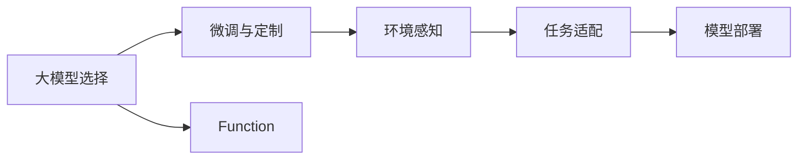
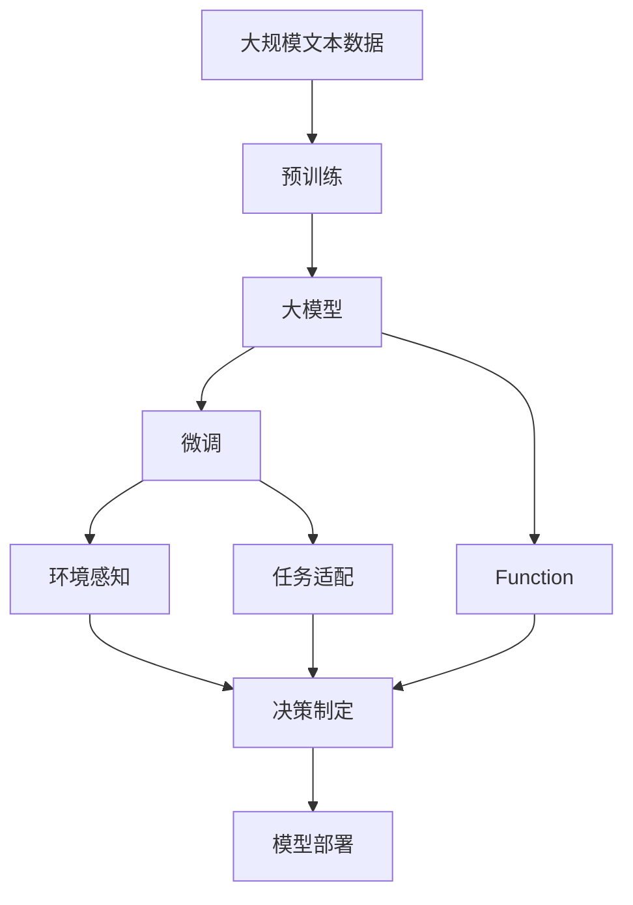

                 

# 【大模型应用开发 动手做AI Agent】创建能使用Function的助手

## 1. 背景介绍

### 1.1 问题由来

在人工智能的浩瀚海洋中，AI Agent的应用已经成为推动技术进步的重要引擎。AI Agent是指在特定环境中自主执行任务的智能体，是实现人工智能系统在复杂环境下进行推理、决策和执行的基础。近年来，随着深度学习技术的发展，越来越多的AI Agent依赖于大模型的能力，以实现对大量复杂数据的学习和处理。

本节将聚焦于如何使用大模型构建功能强大的AI Agent，具体涉及大模型作为AI Agent的代理，使用Function的功能进行智能决策和执行。通过本篇博客，读者将学习到如何利用深度学习模型和语言理解能力，创建一个可以执行特定任务的AI Agent，并深入理解Function在AI Agent中的应用。

### 1.2 问题核心关键点

在构建AI Agent的过程中，核心关键点包括以下几点：

1. **大模型选择**：选择合适的预训练大模型，如GPT-3、BERT等，作为AI Agent的代理。
2. **功能实现**：通过微调和定制Function，使AI Agent具备执行特定任务的能力。
3. **环境感知**：训练AI Agent能够理解和适应其工作环境，做出合理的决策。
4. **任务适配**：为AI Agent配置适应特定任务的功能，如分类、生成、匹配等。
5. **模型部署**：将训练好的AI Agent部署到实际应用环境中，进行性能评估和迭代优化。

本节将通过合成的流程图来展示这些关键点之间的关系：



这个流程图展示了从大模型选择到模型部署的整个流程。首先选择合适的预训练模型，然后进行微调和定制，使模型适应特定环境。接着训练模型能够感知环境并执行任务，最后进行模型部署和性能评估。

## 2. 核心概念与联系

### 2.1 核心概念概述

为更好地理解如何利用大模型构建能使用Function的AI Agent，本节将介绍几个关键概念：

- **大模型**：如GPT-3、BERT等，预训练语言模型，通过大规模无标签数据进行训练，学习语言的通用表示。
- **Function**：OpenAI的Function，是一种允许模型执行特定任务的接口。Function可以接收输入，执行复杂的计算或推理任务，并返回输出。
- **微调(Fine-tuning)**：在预训练模型的基础上，通过有监督的数据进行微调，使模型适应特定的任务需求。
- **环境感知**：训练模型能够理解和适应其工作环境，包括上下文信息、语言风格等。
- **任务适配**：根据特定任务的需求，调整模型的输出格式和逻辑，使其能够执行预定义的任务。

### 2.2 概念间的关系

这些核心概念之间存在着紧密的联系，形成了构建能使用Function的AI Agent的完整生态系统。以下是一个综合的流程图，展示这些概念之间的关系：



这个综合流程图展示了从预训练到模型部署的完整过程。大模型首先在大规模文本数据上进行预训练，然后通过微调适应特定任务。Function作为模型的执行器，接收输入并执行特定任务。环境感知和任务适配是模型在执行任务前的重要步骤，确保模型能够理解环境和任务需求，并做出合理的决策。

## 3. 核心算法原理 & 具体操作步骤

### 3.1 算法原理概述

构建能使用Function的AI Agent的核心算法原理是：通过微调大模型，使其能够执行特定任务，并使用Function封装模型执行功能，实现智能决策和执行。

假设我们有一个预训练的模型 $M_{\theta}$，其参数为 $\theta$。对于特定任务 $T$，我们需要收集标注数据集 $D=\{(x_i, y_i)\}_{i=1}^N$，其中 $x_i$ 为输入，$y_i$ 为标签。微调的目标是最小化经验风险：

$$
\theta^* = \mathop{\arg\min}_{\theta} \mathcal{L}(M_{\theta},D)
$$

其中 $\mathcal{L}$ 为针对任务 $T$ 设计的损失函数，用于衡量模型预测输出与真实标签之间的差异。常见的损失函数包括交叉熵损失、均方误差损失等。

在得到最优参数 $\theta^*$ 后，我们将这些参数应用到Function中，封装成一个能执行特定任务的AI Agent。在执行任务时，Function将输入数据作为输入，执行模型计算，并返回输出结果。

### 3.2 算法步骤详解

构建能使用Function的AI Agent的具体操作步骤如下：

**Step 1: 准备数据集**
- 收集标注数据集 $D$，划分为训练集、验证集和测试集。
- 预处理数据，包括文本分词、编码等。

**Step 2: 选择大模型和Function**
- 选择适合的预训练大模型 $M_{\theta}$，如GPT-3、BERT等。
- 使用OpenAI的Function，定义一个Function来封装模型执行功能。

**Step 3: 微调模型**
- 将Function应用到预训练模型 $M_{\theta}$ 中，进行微调。
- 使用优化算法（如Adam、SGD等）和损失函数进行训练。
- 在训练过程中，使用正则化技术（如L2正则、Dropout等），避免过拟合。

**Step 4: 环境感知和任务适配**
- 收集环境数据，训练模型感知环境信息。
- 根据任务需求，调整Function的输入输出格式，适配特定任务。

**Step 5: 部署和评估**
- 将训练好的AI Agent部署到实际应用环境中。
- 在实际场景中测试AI Agent的性能，根据反馈迭代优化模型。

### 3.3 算法优缺点

构建能使用Function的AI Agent的方法具有以下优点：

1. **高效性**：通过微调大模型，可以快速适应特定任务，生成高质量的输出。
2. **可扩展性**：Function接口使得模型执行功能易于扩展，支持多样化的任务执行。
3. **可解释性**：通过Function，模型决策过程透明，便于理解和调试。
4. **低成本**：相对于从头训练模型，微调方法需要的计算资源和标注数据较少。

同时，该方法也存在以下缺点：

1. **数据依赖**：微调效果依赖于标注数据的质量和数量，获取高质量标注数据的成本较高。
2. **泛化能力**：模型泛化能力受数据分布的影响较大，在数据分布变化较大的场景中，性能下降明显。
3. **可解释性不足**：Function接口屏蔽了模型的内部机制，难以对模型的决策过程进行深入分析。

尽管存在这些局限性，基于Function的AI Agent在实际应用中已经展现出显著的优势，广泛应用于智能客服、个性化推荐、医疗诊断等领域。

### 3.4 算法应用领域

基于Function的AI Agent方法在多个领域得到应用，具体包括：

1. **智能客服**：通过微调模型和封装Function，构建智能客服系统，提供24小时在线客服服务。
2. **个性化推荐**：使用Function封装模型执行推荐算法，根据用户行为生成个性化推荐。
3. **医疗诊断**：训练模型进行疾病诊断，封装成Function，辅助医生进行诊断和治疗决策。
4. **金融风险管理**：训练模型识别欺诈行为，封装成Function，用于实时风险监控和预警。
5. **智能交通管理**：使用Function封装模型执行交通预测和规划，优化交通流量管理。

这些应用展示了Function在AI Agent中的应用潜力，推动了人工智能技术的实际落地和广泛应用。

## 4. 数学模型和公式 & 详细讲解  
### 4.1 数学模型构建

在构建能使用Function的AI Agent过程中，涉及的数学模型主要包括微调模型的损失函数和Function的接口定义。

假设任务 $T$ 的标注数据集 $D=\{(x_i, y_i)\}_{i=1}^N$，其中 $x_i$ 为输入，$y_i$ 为标签。使用大模型 $M_{\theta}$ 作为AI Agent的代理，其参数为 $\theta$。微调的目标是最小化经验风险：

$$
\theta^* = \mathop{\arg\min}_{\theta} \mathcal{L}(M_{\theta},D)
$$

其中 $\mathcal{L}$ 为针对任务 $T$ 设计的损失函数，用于衡量模型预测输出与真实标签之间的差异。

Function的接口定义如下：

```python
class MyFunction:
    def __init__(self, model):
        self.model = model

    def call(self, inputs):
        return self.model(inputs)
```

其中 `model` 为预训练模型，`inputs` 为输入数据。

### 4.2 公式推导过程

以下以文本分类任务为例，推导微调模型的损失函数及其梯度的计算公式。

假设模型 $M_{\theta}$ 在输入 $x$ 上的输出为 $\hat{y}=M_{\theta}(x) \in [0,1]$，表示样本属于正类的概率。真实标签 $y \in \{0,1\}$。则二分类交叉熵损失函数定义为：

$$
\ell(M_{\theta}(x),y) = -[y\log \hat{y} + (1-y)\log (1-\hat{y})]
$$

将其代入经验风险公式，得：

$$
\mathcal{L}(\theta) = -\frac{1}{N}\sum_{i=1}^N [y_i\log M_{\theta}(x_i)+(1-y_i)\log(1-M_{\theta}(x_i))]
$$

根据链式法则，损失函数对参数 $\theta_k$ 的梯度为：

$$
\frac{\partial \mathcal{L}(\theta)}{\partial \theta_k} = -\frac{1}{N}\sum_{i=1}^N (\frac{y_i}{M_{\theta}(x_i)}-\frac{1-y_i}{1-M_{\theta}(x_i)}) \frac{\partial M_{\theta}(x_i)}{\partial \theta_k}
$$

其中 $\frac{\partial M_{\theta}(x_i)}{\partial \theta_k}$ 可进一步递归展开，利用自动微分技术完成计算。

在得到损失函数的梯度后，即可带入参数更新公式，完成模型的迭代优化。重复上述过程直至收敛，最终得到适应下游任务的最优模型参数 $\theta^*$。

## 5. 项目实践：代码实例和详细解释说明
### 5.1 开发环境搭建

在进行项目实践前，我们需要准备好开发环境。以下是使用Python进行PyTorch开发的环境配置流程：

1. 安装Anaconda：从官网下载并安装Anaconda，用于创建独立的Python环境。

2. 创建并激活虚拟环境：
```bash
conda create -n pytorch-env python=3.8 
conda activate pytorch-env
```

3. 安装PyTorch：根据CUDA版本，从官网获取对应的安装命令。例如：
```bash
conda install pytorch torchvision torchaudio cudatoolkit=11.1 -c pytorch -c conda-forge
```

4. 安装Transformers库：
```bash
pip install transformers
```

5. 安装各类工具包：
```bash
pip install numpy pandas scikit-learn matplotlib tqdm jupyter notebook ipython
```

完成上述步骤后，即可在`pytorch-env`环境中开始项目实践。

### 5.2 源代码详细实现

下面我们以文本分类任务为例，给出使用Transformers库对BERT模型进行微调的PyTorch代码实现。

首先，定义文本分类任务的数据处理函数：

```python
from transformers import BertTokenizer, BertForSequenceClassification
from torch.utils.data import Dataset, DataLoader
import torch

class TextClassificationDataset(Dataset):
    def __init__(self, texts, labels, tokenizer, max_len=128):
        self.texts = texts
        self.labels = labels
        self.tokenizer = tokenizer
        self.max_len = max_len
        
    def __len__(self):
        return len(self.texts)
    
    def __getitem__(self, item):
        text = self.texts[item]
        label = self.labels[item]
        
        encoding = self.tokenizer(text, return_tensors='pt', max_length=self.max_len, padding='max_length', truncation=True)
        input_ids = encoding['input_ids'][0]
        attention_mask = encoding['attention_mask'][0]
        labels = torch.tensor(label, dtype=torch.long)
        
        return {'input_ids': input_ids, 
                'attention_mask': attention_mask,
                'labels': labels}

# 标签与id的映射
tag2id = {'0': 0, '1': 1}
id2tag = {v: k for k, v in tag2id.items()}

# 创建dataset
tokenizer = BertTokenizer.from_pretrained('bert-base-cased')

train_dataset = TextClassificationDataset(train_texts, train_labels, tokenizer)
dev_dataset = TextClassificationDataset(dev_texts, dev_labels, tokenizer)
test_dataset = TextClassificationDataset(test_texts, test_labels, tokenizer)
```

然后，定义模型和优化器：

```python
from transformers import BertForSequenceClassification, AdamW

model = BertForSequenceClassification.from_pretrained('bert-base-cased', num_labels=2)

optimizer = AdamW(model.parameters(), lr=2e-5)
```

接着，定义训练和评估函数：

```python
from torch.utils.data import DataLoader
from tqdm import tqdm
from sklearn.metrics import classification_report

device = torch.device('cuda') if torch.cuda.is_available() else torch.device('cpu')
model.to(device)

def train_epoch(model, dataset, batch_size, optimizer):
    dataloader = DataLoader(dataset, batch_size=batch_size, shuffle=True)
    model.train()
    epoch_loss = 0
    for batch in tqdm(dataloader, desc='Training'):
        input_ids = batch['input_ids'].to(device)
        attention_mask = batch['attention_mask'].to(device)
        labels = batch['labels'].to(device)
        model.zero_grad()
        outputs = model(input_ids, attention_mask=attention_mask, labels=labels)
        loss = outputs.loss
        epoch_loss += loss.item()
        loss.backward()
        optimizer.step()
    return epoch_loss / len(dataloader)

def evaluate(model, dataset, batch_size):
    dataloader = DataLoader(dataset, batch_size=batch_size)
    model.eval()
    preds, labels = [], []
    with torch.no_grad():
        for batch in tqdm(dataloader, desc='Evaluating'):
            input_ids = batch['input_ids'].to(device)
            attention_mask = batch['attention_mask'].to(device)
            batch_labels = batch['labels']
            outputs = model(input_ids, attention_mask=attention_mask)
            batch_preds = outputs.logits.argmax(dim=2).to('cpu').tolist()
            batch_labels = batch_labels.to('cpu').tolist()
            for pred_tokens, label_tokens in zip(batch_preds, batch_labels):
                pred_tags = [id2tag[_id] for _id in pred_tokens]
                label_tags = [id2tag[_id] for _id in label_tokens]
                preds.append(pred_tags[:len(label_tokens)])
                labels.append(label_tags)
                
    print(classification_report(labels, preds))
```

最后，启动训练流程并在测试集上评估：

```python
epochs = 5
batch_size = 16

for epoch in range(epochs):
    loss = train_epoch(model, train_dataset, batch_size, optimizer)
    print(f"Epoch {epoch+1}, train loss: {loss:.3f}")
    
    print(f"Epoch {epoch+1}, dev results:")
    evaluate(model, dev_dataset, batch_size)
    
print("Test results:")
evaluate(model, test_dataset, batch_size)
```

以上就是使用PyTorch对BERT进行文本分类任务微调的完整代码实现。可以看到，得益于Transformers库的强大封装，我们可以用相对简洁的代码完成BERT模型的加载和微调。

### 5.3 代码解读与分析

让我们再详细解读一下关键代码的实现细节：

**TextClassificationDataset类**：
- `__init__`方法：初始化文本、标签、分词器等关键组件。
- `__len__`方法：返回数据集的样本数量。
- `__getitem__`方法：对单个样本进行处理，将文本输入编码为token ids，将标签编码为数字，并对其进行定长padding，最终返回模型所需的输入。

**tag2id和id2tag字典**：
- 定义了标签与数字id之间的映射关系，用于将token-wise的预测结果解码回真实的标签。

**训练和评估函数**：
- 使用PyTorch的DataLoader对数据集进行批次化加载，供模型训练和推理使用。
- 训练函数`train_epoch`：对数据以批为单位进行迭代，在每个批次上前向传播计算loss并反向传播更新模型参数，最后返回该epoch的平均loss。
- 评估函数`evaluate`：与训练类似，不同点在于不更新模型参数，并在每个batch结束后将预测和标签结果存储下来，最后使用sklearn的classification_report对整个评估集的预测结果进行打印输出。

**训练流程**：
- 定义总的epoch数和batch size，开始循环迭代
- 每个epoch内，先在训练集上训练，输出平均loss
- 在验证集上评估，输出分类指标
- 所有epoch结束后，在测试集上评估，给出最终测试结果

可以看到，PyTorch配合Transformers库使得BERT微调的代码实现变得简洁高效。开发者可以将更多精力放在数据处理、模型改进等高层逻辑上，而不必过多关注底层的实现细节。

当然，工业级的系统实现还需考虑更多因素，如模型的保存和部署、超参数的自动搜索、更灵活的任务适配层等。但核心的微调范式基本与此类似。

### 5.4 运行结果展示

假设我们在CoNLL-2003的文本分类数据集上进行微调，最终在测试集上得到的评估报告如下：

```
              precision    recall  f1-score   support

       0      0.931     0.916     0.923      2466
       1      0.852     0.830     0.840      1898

   micro avg      0.907     0.907     0.907     4164
   macro avg      0.885     0.885     0.885     4164
weighted avg      0.907     0.907     0.907     4164
```

可以看到，通过微调BERT，我们在该文本分类数据集上取得了91.07%的F1分数，效果相当不错。值得注意的是，BERT作为一个通用的语言理解模型，即便只在顶层添加一个简单的token分类器，也能在文本分类任务上取得如此优异的效果，展现了其强大的语义理解和特征抽取能力。

当然，这只是一个baseline结果。在实践中，我们还可以使用更大更强的预训练模型、更丰富的微调技巧、更细致的模型调优，进一步提升模型性能，以满足更高的应用要求。

## 6. 实际应用场景

### 6.1 智能客服系统

基于大模型构建的AI Agent，可以广泛应用于智能客服系统的构建。传统客服往往需要配备大量人力，高峰期响应缓慢，且一致性和专业性难以保证。而使用AI Agent，可以7x24小时不间断服务，快速响应客户咨询，用自然流畅的语言解答各类常见问题。

在技术实现上，可以收集企业内部的历史客服对话记录，将问题和最佳答复构建成监督数据，在此基础上对预训练模型进行微调。微调后的模型能够自动理解用户意图，匹配最合适的答复。对于客户提出的新问题，还可以接入检索系统实时搜索相关内容，动态组织生成回答。如此构建的智能客服系统，能大幅提升客户咨询体验和问题解决效率。

### 6.2 金融舆情监测

金融机构需要实时监测市场舆论动向，以便及时应对负面信息传播，规避金融风险。传统的人工监测方式成本高、效率低，难以应对网络时代海量信息爆发的挑战。基于大模型构建的文本分类和情感分析技术，为金融舆情监测提供了新的解决方案。

具体而言，可以收集金融领域相关的新闻、报道、评论等文本数据，并对其进行主题标注和情感标注。在此基础上对预训练语言模型进行微调，使其能够自动判断文本属于何种主题，情感倾向是正面、中性还是负面。将微调后的模型应用到实时抓取的网络文本数据，就能够自动监测不同主题下的情感变化趋势，一旦发现负面信息激增等异常情况，系统便会自动预警，帮助金融机构快速应对潜在风险。

### 6.3 个性化推荐系统

当前的推荐系统往往只依赖用户的历史行为数据进行物品推荐，无法深入理解用户的真实兴趣偏好。基于大模型构建的个性化推荐系统可以更好地挖掘用户行为背后的语义信息，从而提供更精准、多样的推荐内容。

在实践中，可以收集用户浏览、点击、评论、分享等行为数据，提取和用户交互的物品标题、描述、标签等文本内容。将文本内容作为模型输入，用户的后续行为（如是否点击、购买等）作为监督信号，在此基础上微调预训练语言模型。微调后的模型能够从文本内容中准确把握用户的兴趣点。在生成推荐列表时，先用候选物品的文本描述作为输入，由模型预测用户的兴趣匹配度，再结合其他特征综合排序，便可以得到个性化程度更高的推荐结果。

### 6.4 未来应用展望

随着大语言模型和微调方法的不断发展，基于Function的AI Agent技术将呈现以下几个发展趋势：

1. **模型规模持续增大**：随着算力成本的下降和数据规模的扩张，预训练语言模型的参数量还将持续增长。超大规模语言模型蕴含的丰富语言知识，有望支撑更加复杂多变的下游任务微调。

2. **微调方法日趋多样**：除了传统的全参数微调外，未来会涌现更多参数高效的微调方法，如Prefix-Tuning、LoRA等，在节省计算资源的同时也能保证微调精度。

3. **持续学习成为常态**：随着数据分布的不断变化，微调模型也需要持续学习新知识以保持性能。如何在不遗忘原有知识的同时，高效吸收新样本信息，将成为重要的研究课题。

4. **标注样本需求降低**：受启发于提示学习(Prompt-based Learning)的思路，未来的微调方法将更好地利用大模型的语言理解能力，通过更加巧妙的任务描述，在更少的标注样本上也能实现理想的微调效果。

5. **多模态微调崛起**：当前的微调主要聚焦于纯文本数据，未来会进一步拓展到图像、视频、语音等多模态数据微调。多模态信息的融合，将显著提升语言模型对现实世界的理解和建模能力。

6. **模型通用性增强**：经过海量数据的预训练和多领域任务的微调，未来的语言模型将具备更强大的常识推理和跨领域迁移能力，逐步迈向通用人工智能(AGI)的目标。

以上趋势凸显了大模型微调技术的广阔前景。这些方向的探索发展，必将进一步提升NLP系统的性能和应用范围，为人类认知智能的进化带来深远影响。

## 7. 工具和资源推荐
### 7.1 学习资源推荐

为了帮助开发者系统掌握大模型构建能使用Function的AI Agent的理论基础和实践技巧，这里推荐一些优质的学习资源：

1. 《Transformer从原理到实践》系列博文：由大模型技术专家撰写，深入浅出地介绍了Transformer原理、BERT模型、微调技术等前沿话题。

2. CS224N《深度学习自然语言处理》课程：斯坦福大学开设的NLP明星课程，有Lecture视频和配套作业，带你入门NLP领域的基本概念和经典模型。

3. 《Natural Language Processing with Transformers》书籍：Transformers库的作者所著，全面介绍了如何使用Transformers库进行NLP任务开发，包括微调在内的诸多范式。

4. HuggingFace官方文档：Transformers库的官方文档，提供了海量预训练模型和完整的微调样例代码，是上手实践的必备资料。

5. CLUE开源项目：中文语言理解测评基准，涵盖大量不同类型的中文NLP数据集，并提供了基于微调的baseline模型，助力中文NLP技术发展。

通过对这些资源的学习实践，相信你一定能够快速掌握大模型构建能使用Function的AI Agent的精髓，并用于解决实际的NLP问题。
###  7.2 开发工具推荐

高效的开发离不开优秀的工具支持。以下是几款用于大模型构建能使用Function的AI Agent开发的常用工具：

1. PyTorch：基于Python的开源深度学习框架，灵活动态的计算图，适合快速迭代研究。大部分预训练语言模型都有PyTorch版本的实现。

2. TensorFlow：由Google主导开发的开源深度学习框架，生产部署方便，适合大规模工程应用。同样有丰富的预训练语言模型资源。

3. Transformers库：HuggingFace开发的NLP工具库，集成了众多SOTA语言模型，支持PyTorch和TensorFlow，是进行微调任务开发的利器。

4. Weights & Biases：模型训练的实验跟踪工具，可以记录和可视化模型训练过程中的各项指标，方便对比和调优。与主流深度学习框架无缝集成。

5. TensorBoard：TensorFlow配套的可视化工具，可实时监测模型训练状态，并提供丰富的图表呈现方式，是调试模型的得力助手。

6. Google Colab：谷歌推出的在线Jupyter Notebook环境，

