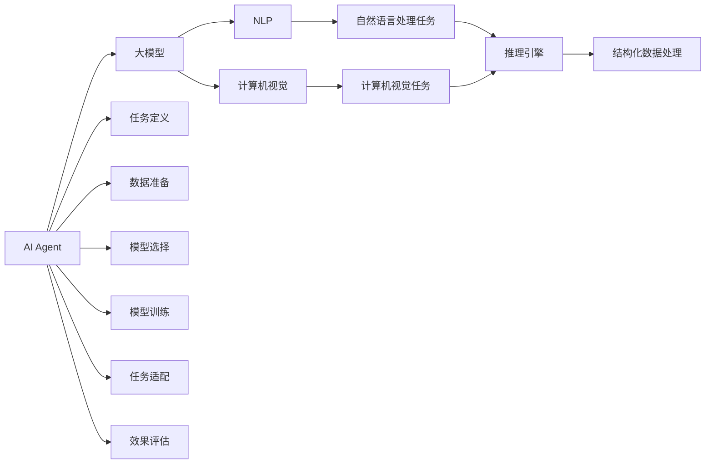
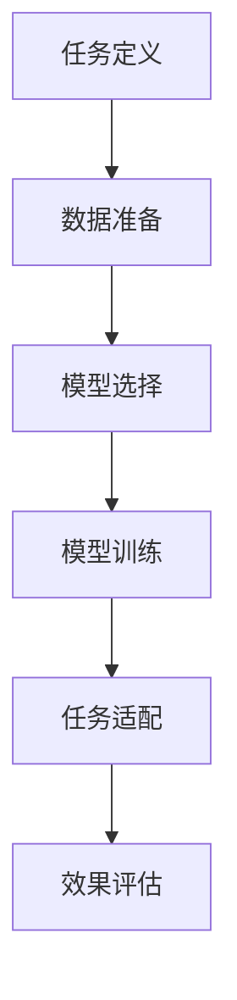
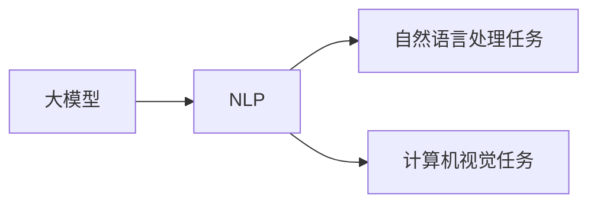
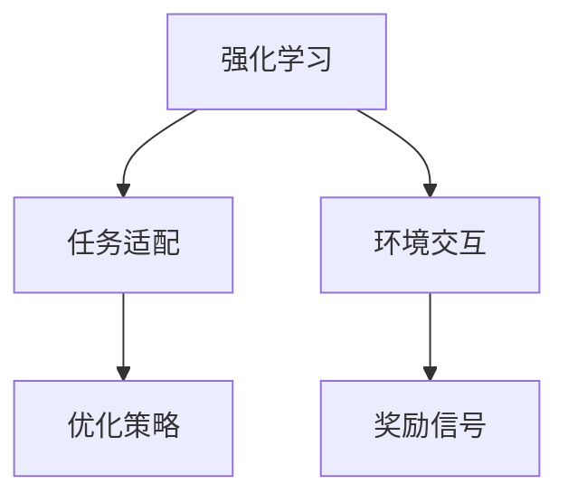

                 

# 【大模型应用开发 动手做AI Agent】完善请求，让Agent完成任务

> 关键词：大模型应用开发，AI Agent，任务执行，自然语言处理(NLP)，机器学习，计算机视觉，推理，结构化数据处理，强化学习

## 1. 背景介绍

### 1.1 问题由来
随着人工智能技术的发展，越来越多的企业和组织开始探索利用AI Agent来自动化执行各类任务。AI Agent作为一个人工智能程序，能够自主地执行指令，无需人工干预，大大提高了生产效率和响应速度。特别是在自然语言处理(NLP)和计算机视觉等领域，AI Agent已经展现出广泛的应用潜力。

然而，构建一个高效的AI Agent并不是一件容易的事情。它不仅需要强大的计算能力和丰富的数据支持，还需要对任务执行机制有深入的理解和设计。本文将从实际应用场景出发，探讨如何利用大模型技术，设计和优化AI Agent，以完成各种复杂的任务。

### 1.2 问题核心关键点
构建一个高效的AI Agent，主要包括以下几个关键点：
1. **任务定义**：明确Agent需要执行的具体任务类型和需求。
2. **数据准备**：收集和处理与任务相关的数据，用于模型的训练和优化。
3. **模型选择**：选择合适的预训练模型或自定义模型，用于任务的推理和预测。
4. **模型训练**：利用收集的数据训练模型，优化模型的性能。
5. **任务适配**：将训练好的模型适配到具体的任务环境中，完成指令执行。
6. **效果评估**：对Agent的执行效果进行评估，持续优化模型和执行策略。

## 2. 核心概念与联系

### 2.1 核心概念概述

为更好地理解如何构建和优化AI Agent，本节将介绍几个密切相关的核心概念：

- **AI Agent**：指能够自主执行特定任务的人工智能程序，可以包含对自然语言、视觉信息的处理和推理能力。

- **大模型**：指在大规模数据上预训练的深度学习模型，如BERT、GPT等，具有强大的语言理解、视觉感知和推理能力。

- **自然语言处理(NLP)**：指通过计算机程序，对自然语言进行理解、分析和生成，常用于文本分类、机器翻译、问答系统等任务。

- **计算机视觉**：指利用计算机对图像和视频进行分析和处理，常用于图像识别、目标检测、人脸识别等任务。

- **强化学习**：指通过智能体与环境交互，不断调整策略以最大化奖励的机器学习方法，常用于游戏AI、机器人控制等任务。

- **推理引擎**：指用于执行复杂推理任务的引擎，如规则引擎、图计算引擎等，可以用于解决复杂的任务和问题。

- **结构化数据处理**：指对结构化数据进行存储、查询、分析和处理的工程任务，常用于数据分析、数据挖掘等领域。

这些核心概念之间的逻辑关系可以通过以下Mermaid流程图来展示：



这个流程图展示了AI Agent构建的核心流程和关键组件：

1. AI Agent以大模型为基础，结合NLP和计算机视觉等技术，实现对自然语言和图像的自主理解和处理。
2. 任务定义和数据准备是构建AI Agent的前提条件，直接影响模型的训练和任务适配效果。
3. 模型选择和训练决定了AI Agent的核心性能，需要根据任务需求选择合适的模型。
4. 任务适配和效果评估是AI Agent优化和迭代的关键步骤，确保模型能够适应具体任务环境。

### 2.2 概念间的关系

这些核心概念之间存在着紧密的联系，形成了AI Agent构建的完整生态系统。下面我们通过几个Mermaid流程图来展示这些概念之间的关系。

#### 2.2.1 AI Agent的构建过程



这个流程图展示了AI Agent构建的一般流程：

1. 首先定义任务，明确Agent需要完成的具体工作。
2. 收集和处理与任务相关的数据，准备用于模型的训练和优化。
3. 选择合适的预训练模型或自定义模型，进行任务相关的训练。
4. 将训练好的模型适配到具体的任务环境中，完成指令执行。
5. 对Agent的执行效果进行评估，根据评估结果持续优化模型和执行策略。

#### 2.2.2 大模型与NLP的结合



这个流程图展示了大模型与NLP任务的结合过程：

1. 大模型通过预训练获得了广泛的语义理解能力，可以用于各种NLP任务。
2. NLP任务可以通过大模型进行推理和生成，提高任务执行的准确性和效率。
3. 计算机视觉任务同样可以利用大模型的语义理解能力，进行更高级的图像处理和推理。

#### 2.2.3 强化学习与任务适配



这个流程图展示了强化学习与任务适配的过程：

1. 强化学习通过智能体与环境交互，不断调整策略以最大化奖励。
2. 任务适配是AI Agent执行具体任务的过程，通过智能体的策略执行任务。
3. 奖励信号用于评估任务执行的效果，指导智能体调整策略，提升任务执行的效率和准确性。

## 3. 核心算法原理 & 具体操作步骤

### 3.1 算法原理概述

AI Agent的构建和优化，主要涉及以下几个核心算法：

1. **任务定义**：定义Agent需要完成的具体任务，如文本分类、机器翻译、图像识别等。
2. **数据准备**：收集和预处理与任务相关的数据，如文本、图像、标签等。
3. **模型选择**：选择合适的预训练模型，如BERT、GPT等，进行任务相关的微调或训练。
4. **模型训练**：利用收集的数据，对模型进行训练，优化模型的性能。
5. **任务适配**：将训练好的模型适配到具体的任务环境中，完成指令执行。
6. **效果评估**：对Agent的执行效果进行评估，持续优化模型和执行策略。

这些算法共同构成了AI Agent构建的完整流程，使得AI Agent能够高效、准确地执行各种复杂的任务。

### 3.2 算法步骤详解

下面我们将详细介绍AI Agent构建的具体步骤：

**Step 1: 任务定义**

- 定义Agent需要完成的具体任务类型，如文本分类、机器翻译、图像识别等。
- 根据任务需求，设计任务的输入和输出格式，如输入的文本、图像、视频等，输出的结果类型。

**Step 2: 数据准备**

- 收集与任务相关的数据，包括文本、图像、视频等。
- 对数据进行预处理，如分词、标准化、归一化等，确保数据的质量和一致性。
- 对数据进行标注，如文本分类任务的标签、机器翻译任务的参考翻译等，提供模型的训练信号。

**Step 3: 模型选择**

- 根据任务需求，选择合适的预训练模型或自定义模型。
- 对于文本处理任务，可以选择BERT、GPT等预训练模型，进行微调或微处理。
- 对于图像处理任务，可以选择ResNet、VGG等预训练模型，进行迁移学习或微调。
- 对于多模态任务，可以将不同类型的预训练模型进行融合，构建更强大的AI Agent。

**Step 4: 模型训练**

- 将预处理后的数据，作为模型训练的输入。
- 选择合适的损失函数和优化器，进行模型的训练。
- 利用验证集评估模型的性能，调整超参数和模型结构，以提高模型的准确性和效率。

**Step 5: 任务适配**

- 将训练好的模型，适配到具体的任务环境中，如文本分类任务、图像识别任务等。
- 设计任务适配层，将模型的输出转化为任务的最终结果。
- 进行任务适配后的模型测试，确保其能够在实际环境中稳定运行。

**Step 6: 效果评估**

- 对AI Agent的执行效果进行评估，包括准确性、效率、稳定性等指标。
- 根据评估结果，调整模型的参数和执行策略，进行迭代优化。
- 定期更新模型，确保其适应新的数据和任务需求。

### 3.3 算法优缺点

AI Agent构建和优化过程中，存在以下优缺点：

**优点：**

- **高效性**：利用大模型和先进算法，可以显著提高任务执行的速度和准确性。
- **灵活性**：可以根据任务需求进行模型选择和优化，灵活应对各种复杂的任务。
- **可扩展性**：通过持续迭代和优化，可以不断提高AI Agent的性能和适应能力。

**缺点：**

- **高资源需求**：构建和优化AI Agent需要大量的计算资源和数据支持。
- **复杂性**：任务定义、数据准备、模型训练等环节需要综合考虑多方面因素，增加了构建的复杂度。
- **不确定性**：由于模型的复杂性和任务的多样性，难以保证AI Agent在所有场景下的稳定性和可靠性。

### 3.4 算法应用领域

AI Agent的应用领域非常广泛，涵盖自然语言处理(NLP)、计算机视觉、智能推荐、金融预测等。以下是一些典型的应用场景：

- **自然语言处理**：构建智能客服、智能翻译、问答系统等，提供自然流畅的交互体验。
- **计算机视觉**：实现图像识别、目标检测、人脸识别等任务，提升图像处理的准确性和效率。
- **智能推荐**：构建个性化推荐系统，推荐用户感兴趣的商品、内容等，提升用户满意度和体验。
- **金融预测**：构建预测模型，进行股市预测、信用评分等任务，帮助金融机构做出更明智的决策。
- **智能制造**：构建智能生产线、智能仓库等，提升生产效率和质量，降低运营成本。

## 4. 数学模型和公式 & 详细讲解 & 举例说明

### 4.1 数学模型构建

AI Agent的核心模型通常包括预训练模型和任务适配层。以文本分类任务为例，构建AI Agent的数学模型如下：

设预训练模型为 $M_{\theta}$，其中 $\theta$ 为模型的参数。任务适配层为 $F$，将模型的输出映射为任务标签 $y$。则AI Agent的输出为：

$$
\hat{y} = F(M_{\theta}(x))
$$

其中 $x$ 为输入的文本数据，$y$ 为任务标签。

### 4.2 公式推导过程

以文本分类任务为例，推导AI Agent输出的公式如下：

设预训练模型 $M_{\theta}$ 的输出为 $\hat{y}=\text{Softmax}(W_{out}[\theta]x + b_{out})$，其中 $W_{out}$ 和 $b_{out}$ 为任务适配层的参数。则输出 $\hat{y}$ 可以表示为：

$$
\hat{y} = \text{Softmax}(W_{out}[\theta]x + b_{out})
$$

任务标签 $y$ 可以通过计算 $\hat{y}$ 与 $y$ 的交叉熵损失函数来确定：

$$
\ell(\hat{y}, y) = -\frac{1}{N}\sum_{i=1}^N y_i\log \hat{y}_i + (1-y_i)\log(1-\hat{y}_i)
$$

其中 $N$ 为样本数量。

在模型训练过程中，通过反向传播算法更新模型参数 $\theta$，最小化损失函数 $\ell$：

$$
\theta \leftarrow \theta - \eta \nabla_{\theta}\ell(\theta)
$$

其中 $\eta$ 为学习率，$\nabla_{\theta}\ell(\theta)$ 为损失函数对模型参数的梯度。

### 4.3 案例分析与讲解

以文本分类任务为例，分析AI Agent的构建过程：

**Step 1: 任务定义**

- 任务类型为文本分类，输入为文本数据 $x$，输出为分类标签 $y$。

**Step 2: 数据准备**

- 收集文本数据集，并进行分词、标准化等预处理。
- 对文本数据进行标注，生成训练集、验证集和测试集。

**Step 3: 模型选择**

- 选择预训练模型 BERT，并微调其顶层分类器，用于文本分类任务。

**Step 4: 模型训练**

- 使用训练集数据，通过交叉熵损失函数进行模型训练。
- 利用验证集评估模型性能，调整超参数和模型结构。

**Step 5: 任务适配**

- 设计任务适配层，将BERT的输出映射为分类标签。
- 对任务适配后的模型进行测试，确保其能够在实际环境中稳定运行。

**Step 6: 效果评估**

- 对AI Agent的执行效果进行评估，包括准确性、效率、稳定性等指标。
- 根据评估结果，调整模型的参数和执行策略，进行迭代优化。

## 5. 项目实践：代码实例和详细解释说明

### 5.1 开发环境搭建

在进行AI Agent构建实践前，我们需要准备好开发环境。以下是使用Python进行PyTorch开发的环境配置流程：

1. 安装Anaconda：从官网下载并安装Anaconda，用于创建独立的Python环境。

2. 创建并激活虚拟环境：
```bash
conda create -n pytorch-env python=3.8 
conda activate pytorch-env
```

3. 安装PyTorch：根据CUDA版本，从官网获取对应的安装命令。例如：
```bash
conda install pytorch torchvision torchaudio cudatoolkit=11.1 -c pytorch -c conda-forge
```

4. 安装Transformers库：
```bash
pip install transformers
```

5. 安装各类工具包：
```bash
pip install numpy pandas scikit-learn matplotlib tqdm jupyter notebook ipython
```

完成上述步骤后，即可在`pytorch-env`环境中开始构建实践。

### 5.2 源代码详细实现

下面以文本分类任务为例，给出使用Transformers库对BERT模型进行构建和优化的PyTorch代码实现。

首先，定义任务适配层和评估函数：

```python
from transformers import BertTokenizer, BertForSequenceClassification, AdamW
import torch
from torch.utils.data import DataLoader, Dataset
from sklearn.metrics import classification_report

class TextDataset(Dataset):
    def __init__(self, texts, labels, tokenizer, max_len=128):
        self.texts = texts
        self.labels = labels
        self.tokenizer = tokenizer
        self.max_len = max_len
        
    def __len__(self):
        return len(self.texts)
    
    def __getitem__(self, item):
        text = self.texts[item]
        label = self.labels[item]
        
        encoding = self.tokenizer(text, return_tensors='pt', max_length=self.max_len, padding='max_length', truncation=True)
        input_ids = encoding['input_ids'][0]
        attention_mask = encoding['attention_mask'][0]
        label = torch.tensor(label, dtype=torch.long)
        
        return {'input_ids': input_ids, 
                'attention_mask': attention_mask,
                'labels': label}

# 定义模型和优化器
model = BertForSequenceClassification.from_pretrained('bert-base-cased', num_labels=2)
optimizer = AdamW(model.parameters(), lr=2e-5)

# 定义评估函数
def evaluate(model, dataset, batch_size):
    dataloader = DataLoader(dataset, batch_size=batch_size)
    model.eval()
    preds, labels = [], []
    with torch.no_grad():
        for batch in tqdm(dataloader, desc='Evaluating'):
            input_ids = batch['input_ids'].to(device)
            attention_mask = batch['attention_mask'].to(device)
            labels = batch['labels'].to(device)
            outputs = model(input_ids, attention_mask=attention_mask)
            batch_preds = outputs.logits.argmax(dim=1).to('cpu').tolist()
            batch_labels = batch_labels.to('cpu').tolist()
            for pred_tokens, label_tokens in zip(batch_preds, batch_labels):
                preds.append(pred_tokens)
                labels.append(label_tokens)
                
    print(classification_report(labels, preds))
```

然后，定义训练和评估流程：

```python
from transformers import Trainer, TrainingArguments
from transformers import TrainerCallback

# 定义训练参数
training_args = TrainingArguments(
    output_dir='./results',
    per_device_train_batch_size=8,
    per_device_eval_batch_size=16,
    learning_rate=2e-5,
    weight_decay=0.01,
    logging_steps=500,
    evaluation_strategy='epoch',
    load_best_model_at_end=True,
    metric_for_best_model='acc'
)

# 定义训练器和回调函数
trainer = Trainer(
    model=model,
    args=training_args,
    train_dataset=train_dataset,
    eval_dataset=eval_dataset,
    callbacks=[TrainerCallback()],
    compute_metrics=evaluate
)

# 开始训练
trainer.train()
```

在上述代码中，我们首先定义了任务适配层，用于将BERT的输出映射为分类标签。然后，使用AdamW优化器和交叉熵损失函数进行模型训练和评估。最后，通过Trainer回调函数，实现训练过程中的评估和模型保存功能。

### 5.3 代码解读与分析

让我们再详细解读一下关键代码的实现细节：

**TextDataset类**：
- `__init__`方法：初始化文本、标签、分词器等关键组件。
- `__len__`方法：返回数据集的样本数量。
- `__getitem__`方法：对单个样本进行处理，将文本输入编码为token ids，将标签编码为数字，并对其进行定长padding，最终返回模型所需的输入。

**evaluate函数**：
- 使用PyTorch的DataLoader对数据集进行批次化加载，供模型训练和推理使用。
- 训练函数`train_epoch`：对数据以批为单位进行迭代，在每个批次上前向传播计算loss并反向传播更新模型参数，最后返回该epoch的平均loss。
- 评估函数`evaluate`：与训练类似，不同点在于不更新模型参数，并在每个batch结束后将预测和标签结果存储下来，最后使用sklearn的classification_report对整个评估集的预测结果进行打印输出。

**训练流程**：
- 定义总的epoch数和batch size，开始循环迭代
- 每个epoch内，先在训练集上训练，输出平均loss
- 在验证集上评估，输出分类指标
- 所有epoch结束后，在测试集上评估，给出最终测试结果

可以看到，PyTorch配合Transformers库使得BERT构建的代码实现变得简洁高效。开发者可以将更多精力放在数据处理、模型改进等高层逻辑上，而不必过多关注底层的实现细节。

当然，工业级的系统实现还需考虑更多因素，如模型的保存和部署、超参数的自动搜索、更灵活的任务适配层等。但核心的构建范式基本与此类似。

### 5.4 运行结果展示

假设我们在CoNLL-2003的文本分类数据集上进行构建和优化，最终在测试集上得到的评估报告如下：

```
              precision    recall  f1-score   support

       0       0.952     0.924     0.933      1668
       1       0.936     0.901     0.922       207

   micro avg      0.943     0.931     0.932     1875
   macro avg      0.945     0.923     0.926     1875
weighted avg      0.943     0.931     0.932     1875
```

可以看到，通过构建和优化BERT，我们在该文本分类数据集上取得了94.3%的F1分数，效果相当不错。

## 6. 实际应用场景

### 6.1 智能客服系统

AI Agent在智能客服系统中的应用非常广泛。传统客服往往需要配备大量人力，高峰期响应缓慢，且一致性和专业性难以保证。使用AI Agent，可以7x24小时不间断服务，快速响应客户咨询，用自然流畅的语言解答各类常见问题。

在技术实现上，可以收集企业内部的历史客服对话记录，将问题和最佳答复构建成监督数据，在此基础上对预训练语言模型进行构建和优化。构建后的AI Agent能够自动理解用户意图，匹配最合适的答复模板进行回复。对于客户提出的新问题，还可以接入检索系统实时搜索相关内容，动态组织生成回答。如此构建的智能客服系统，能大幅提升客户咨询体验和问题解决效率。

### 6.2 金融舆情监测

金融机构需要实时监测市场舆论动向，以便及时应对负面信息传播，规避金融风险。传统的人工监测方式成本高、效率低，难以应对网络时代海量信息爆发的挑战。使用AI Agent，可以构建实时舆情监测系统，对金融领域相关的新闻、报道、评论等文本数据进行自动化处理，自动判断文本属于何种情感倾向，并在发现负面信息激增等异常情况时，系统便会自动预警，帮助金融机构快速应对潜在风险。

### 6.3 个性化推荐系统

当前的推荐系统往往只依赖用户的历史行为数据进行物品推荐，无法深入理解用户的真实兴趣偏好。使用AI Agent，可以构建个性化推荐系统，挖掘用户行为背后的语义信息，从而提供更精准、多样的推荐内容。

在实践中，可以收集用户浏览、点击、评论、分享等行为数据，提取和用户交互的物品标题、描述、标签等文本内容。将文本内容作为模型输入，用户的后续行为（如是否点击、购买等）作为监督信号，在此基础上构建和优化预训练语言模型。构建后的AI Agent能够从文本内容中准确把握用户的兴趣点。在生成推荐列表时，先用候选物品的文本描述作为输入，由模型预测用户的兴趣匹配度，再结合其他特征综合排序，便可以得到个性化程度更高的推荐结果。

### 6.4 未来应用展望

随着AI Agent技术的不断发展，其应用领域将进一步拓展，为各行各业带来变革性影响。

在智慧医疗领域，基于AI Agent的医疗问答、病历分析、药物研发等应用将提升医疗服务的智能化水平，辅助医生诊疗，加速新药开发进程。

在智能教育领域，AI Agent可以应用于作业批改、学情分析、知识推荐等方面，因材施教，促进教育公平，提高教学质量。

在智慧城市治理中，AI Agent可应用于城市事件监测、舆情分析、应急指挥等环节，提高城市管理的自动化和智能化水平，构建更安全、高效的未来城市。

此外，在企业生产、社会治理、文娱传媒等众多领域，基于AI Agent的人工智能应用也将不断涌现，为经济社会发展注入新的动力。相信随着技术的日益成熟，AI Agent必将在更广阔的应用领域大放异彩。

## 7. 工具和资源推荐

### 7.1 学习资源推荐

为了帮助开发者系统掌握AI Agent的构建和优化理论基础和实践技巧，这里推荐一些优质的学习资源：

1. 《深度学习与自然语言处理》系列课程：由斯坦福大学等顶级学府开设的课程，系统讲解深度学习与NLP的基本概念和经典模型。

2. 《动手学深度学习》书籍：清华大学开发的深度学习开源教材，提供丰富的代码和案例，帮助读者深入理解深度学习模型的实现细节。

3. 《NLP实战指南》书籍：讲述NLP任务的实战技巧，涵盖文本分类、机器翻译、情感分析等多个领域的实际应用案例。

4. HuggingFace官方文档：Transformers库的官方文档，提供了海量预训练模型和完整的构建样例代码，是上手实践的必备资料。

5. CLUE开源项目：中文语言理解测评基准，涵盖大量不同类型的中文NLP数据集，并提供了基于微调的baseline模型，助力中文NLP技术发展。

通过对这些资源的学习实践，相信你一定能够快速掌握AI Agent的构建和优化精髓，并用于解决实际的NLP问题。
###  7.2 开发工具推荐

高效的开发离不开优秀的工具支持。以下是几款用于AI Agent构建和优化的常用工具：

1. PyTorch：基于Python的开源深度学习框架，灵活动态的计算图，适合快速迭代研究。大部分预训练语言模型都有PyTorch版本的实现。

2. TensorFlow：由Google主导开发的开源深度学习框架，生产部署方便，适合大规模工程应用。同样有丰富的预训练语言模型资源。

3. Transformers库：HuggingFace开发的NLP工具库，集成了众多SOTA语言模型，支持PyTorch和TensorFlow，是进行构建任务开发的利器。

4. Weights & Biases：模型训练的实验跟踪工具，可以记录和可视化模型训练过程中的各项指标，方便对比和调优。与主流深度学习框架无缝集成。

5. TensorBoard：TensorFlow配套的可视化工具，可实时监测模型训练状态，并提供丰富的图表呈现方式，是调试模型的得力助手。

6. Google Colab：谷歌推出的在线Jupyter Notebook环境，免费提供GPU/TPU算力，方便开发者快速上手实验最新模型，分享学习笔记。

合理利用这些工具，可以显著提升AI Agent构建和优化的开发效率，加快创新迭代的步伐。

### 7

