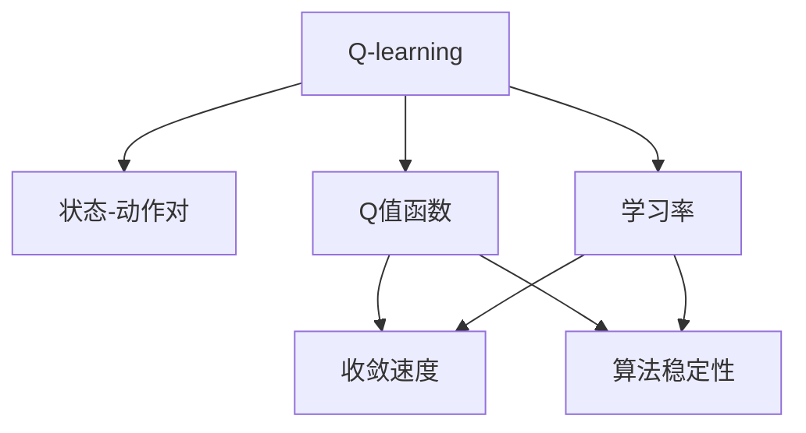
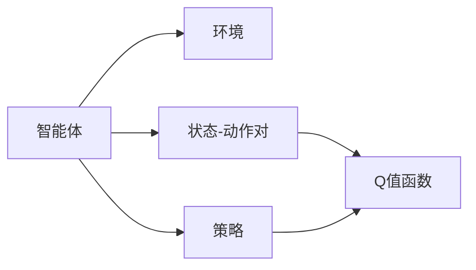
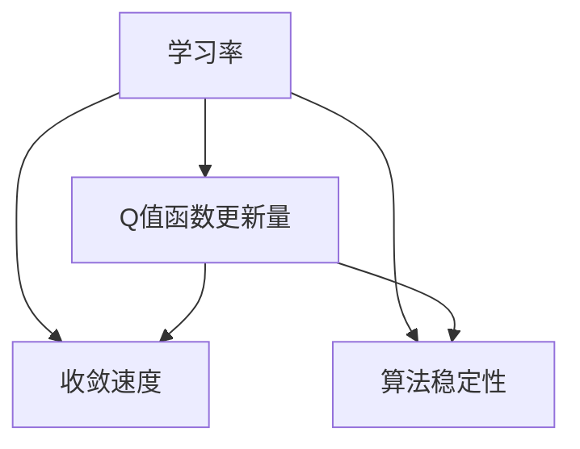
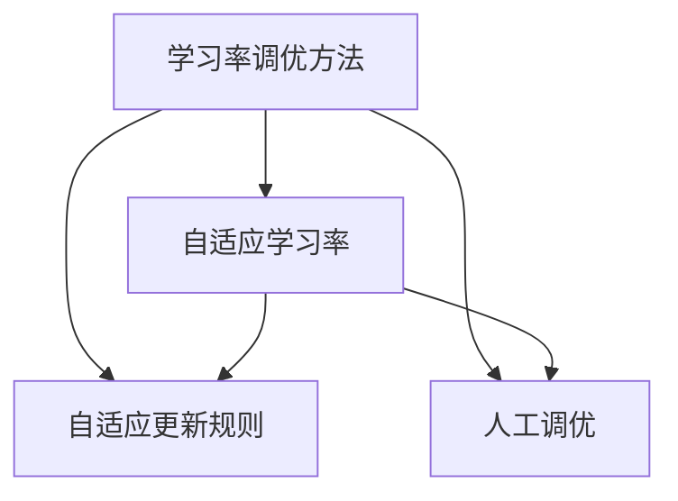
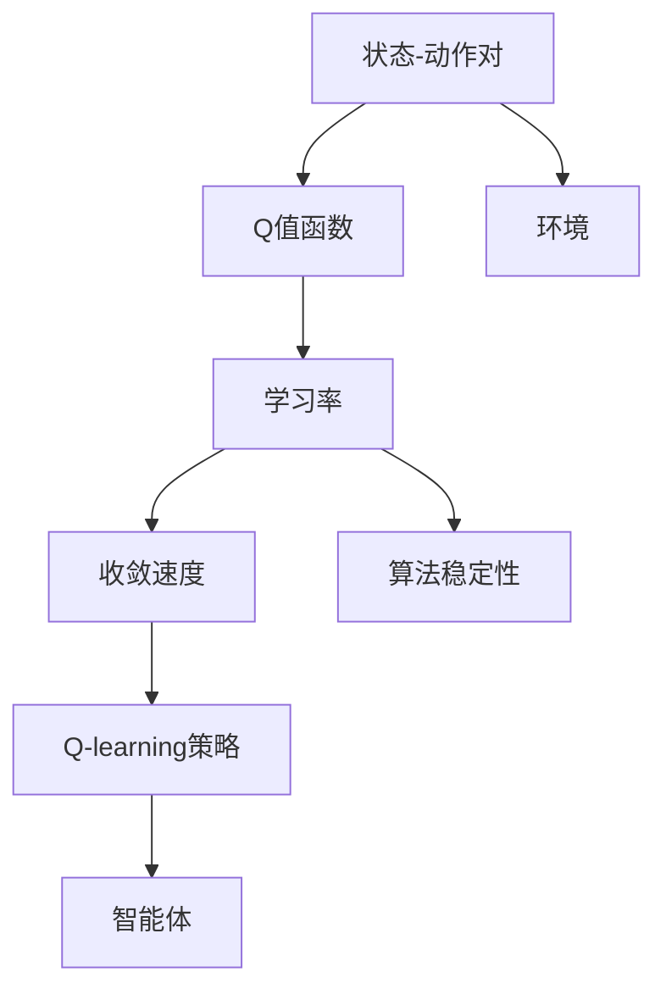

                 

## 1. 背景介绍

### 1.1 问题由来
在AI的殿堂中，强化学习(Reinforcement Learning, RL)一直是优化问题与策略探索之间的桥梁，Q-learning作为强化学习中的经典算法，在智能推荐、游戏AI等领域得到了广泛应用。然而，如何有效地调优Q-learning的学习率，始终是RL社区面临的挑战。学习率过大会导致算法发散，学习率过小会延长收敛时间，影响算法的性能。

### 1.2 问题核心关键点
Q-learning 通过迭代逼近Q值函数，即状态-动作对的价值评估，从而指导智能体进行策略优化。学习率直接影响每次迭代Q值的更新，从而影响算法的收敛速度和稳定程度。因此，如何动态调整Q-learning的学习率，成为提高算法性能的关键问题。

### 1.3 问题研究意义
Q-learning学习率调优问题的研究，对于提高智能体决策的质量，加速算法收敛，提高强化学习的效率具有重要意义：

1. 提升决策质量。合理的学习率可以保证智能体从环境中学习到更有效的决策策略，减少决策的误差。
2. 加速收敛。动态调整学习率能够快速适应环境变化，缩短智能体的学习周期。
3. 提高效率。在有限的时间内达到最优或近似最优的策略，减少资源的浪费。
4. 稳定输出。避免算法因学习率不合适而产生的震荡，提高决策的稳定性。
5. 可推广性。学习率调优技术在Q-learning中的应用，对其他强化学习算法也有重要的参考价值。

## 2. 核心概念与联系

### 2.1 核心概念概述

为更好地理解Q-learning学习率调优方法，本节将介绍几个密切相关的核心概念：

- Q-learning：通过迭代更新Q值函数，即状态-动作对的价值评估，从而指导智能体进行策略优化的一种强化学习方法。
- 状态-动作对(State-Action Pair)：强化学习中，智能体从环境中接收到的当前状态和采取的行动，是Q-learning中核心元素。
- Q值函数(Q-value Function)：表示状态-动作对的价值，通过迭代更新逐渐逼近最优值。
- 学习率(Learning Rate)：Q-learning中每次迭代更新Q值时，对Q值函数进行更新的程度，学习率越大，更新量越大。
- 收敛速度(Convergence Speed)：Q-learning从初始状态到达最优状态或近似的速度，受学习率的影响。
- 算法稳定性(Algorithm Stability)：Q-learning在更新过程中是否能够平稳运行，受学习率的调节。

这些核心概念之间的逻辑关系可以通过以下Mermaid流程图来展示：



这个流程图展示了大语言模型的核心概念及其之间的关系：

1. Q-learning通过状态-动作对进行价值评估，更新Q值函数。
2. Q值函数表示状态-动作对的价值，影响智能体的策略选择。
3. 学习率决定每次Q值函数的更新量，影响算法的收敛速度和稳定性。
4. 收敛速度和算法稳定性共同决定智能体学习的效果。

### 2.2 概念间的关系

这些核心概念之间存在着紧密的联系，形成了Q-learning学习率调优的完整生态系统。下面我们通过几个Mermaid流程图来展示这些概念之间的关系。

#### 2.2.1 Q-learning算法原理



这个流程图展示了Q-learning的基本原理。智能体通过与环境互动，收集状态-动作对，利用Q值函数进行价值评估，从而指导策略优化。

#### 2.2.2 学习率与算法性能的关系



这个流程图展示了学习率对Q-learning算法性能的影响。学习率直接影响Q值函数的更新量，进而影响算法的收敛速度和稳定性。

#### 2.2.3 学习率调优方法



这个流程图展示了学习率调优的方法。主要分为自适应学习率和人工调优两类，其中自适应学习率方法能够自动调整学习率，适应不同的环境变化。

### 2.3 核心概念的整体架构

最后，我们用一个综合的流程图来展示这些核心概念在大语言模型微调过程中的整体架构：



这个综合流程图展示了Q-learning学习率调优的整体架构。智能体通过与环境互动，收集状态-动作对，利用Q值函数进行价值评估，从而指导策略优化。学习率、收敛速度和算法稳定性共同决定智能体学习的效果，通过学习率调优方法，可以有效提升Q-learning的性能。

## 3. 核心算法原理 & 具体操作步骤
### 3.1 算法原理概述

Q-learning学习率调优问题本质上是在动态调整Q-learning中每次Q值函数更新的幅度。学习率越大，更新幅度越大，智能体学习速度越快，但可能会发生震荡；学习率越小，更新幅度越小，智能体学习速度越慢，但能平稳运行。理想的学习率需要平衡这两者的关系，既能保证收敛速度，又能提高算法的稳定性。

Q-learning学习率调优的目标是找到最优的学习率，使得智能体能够快速收敛到最优策略，同时保证决策的稳定性和准确性。

### 3.2 算法步骤详解

Q-learning学习率调优的一般步骤如下：

**Step 1: 初始化参数**

- 设定Q-learning的初始学习率 $\eta_0$，通常取0.1左右。
- 设定最大迭代次数 $N$，初始化智能体的状态-动作对 $(s_0,a_0)$。

**Step 2: 计算Q值**

- 对于给定的状态-动作对 $(s_i,a_i)$，计算预期的Q值 $Q(s_i,a_i)$。
- 更新智能体的状态 $s_i \leftarrow s_{i+1}$，动作 $a_i \leftarrow a_{i+1}$。

**Step 3: 更新Q值**

- 根据Q值函数的更新规则，更新Q值 $Q(s_i,a_i) \leftarrow Q(s_i,a_i) + \eta Q(s_i,a_i)r$。
- 学习率 $\eta$ 按照一定的策略进行动态调整，如自适应学习率算法。

**Step 4: 策略选择**

- 选择动作 $a_i$，根据Q值函数 $Q(s_i,a_i)$ 选择概率最大的动作，即 $\arg\max_a Q(s_i,a)$。
- 实际执行动作 $a_i$，接收环境反馈 $r$。

**Step 5: 迭代更新**

- 重复步骤2-4，直至达到最大迭代次数 $N$ 或达到预设的收敛条件。

**Step 6: 评估算法性能**

- 评估学习率调优后的Q-learning算法的收敛速度和稳定性。
- 对比人工调优和自适应调优的效果。

### 3.3 算法优缺点

Q-learning学习率调优方法具有以下优点：

1. 动态调整：通过自适应学习率算法，能够根据环境变化动态调整学习率，适应不同场景。
2. 简单高效：算法实现简单，易于理解和调试。
3. 泛化能力强：适用于多种环境，且能够泛化到其他强化学习算法。

同时，该方法也存在一些局限性：

1. 可能发散：学习率过大可能导致算法发散，甚至无法收敛。
2. 收敛速度慢：学习率过小可能导致算法收敛速度慢，效率低下。
3. 需要调参：需要手动调整学习率和其他参数，具有一定的技术门槛。
4. 不适用于高维度：在高维度空间中，学习率调优可能过于复杂，难以处理。

尽管存在这些局限性，但就目前而言，Q-learning学习率调优方法仍是强化学习领域的重要研究内容。未来相关研究的重点在于如何进一步简化学习率调优的流程，降低人工调参的难度，提高算法的自适应性。

### 3.4 算法应用领域

Q-learning学习率调优方法已经在强化学习的多项应用中得到了验证，例如：

- 机器人路径规划：智能机器人通过不断与环境互动，优化路径选择，实现高效导航。
- 游戏AI：智能体通过自适应学习率调优，在各类游戏中表现出卓越的策略决策能力。
- 智能推荐系统：通过在线学习调整用户偏好，推荐更加个性化的内容。
- 自动驾驶：优化自动驾驶车辆的控制策略，提升安全性与效率。
- 金融交易：优化交易策略，最大化收益，最小化风险。

除了上述这些经典应用外，Q-learning学习率调优方法也在更多领域中得到应用，如工业控制、工业设计、医疗诊断等，为强化学习带来了更多的实际应用价值。

## 4. 数学模型和公式 & 详细讲解  
### 4.1 数学模型构建

设智能体从状态 $s_i$ 出发，选择动作 $a_i$，接收环境反馈 $r$，更新状态 $s_{i+1}$，重复此过程直至达到终止状态。设智能体的初始状态为 $s_0$，初始动作为 $a_0$，智能体的学习率为 $\eta$，Q值函数为 $Q(s_i,a_i)$，则Q-learning的更新规则为：

$$
Q(s_i,a_i) \leftarrow Q(s_i,a_i) + \eta (r + \gamma \max_a Q(s_{i+1},a) - Q(s_i,a_i))
$$

其中，$\eta$ 为学习率，$r$ 为即时奖励，$\gamma$ 为折扣因子，表示后续奖励的权重。

### 4.2 公式推导过程

根据Q-learning的更新规则，推导学习率 $\eta$ 对Q值函数 $Q(s_i,a_i)$ 的影响：

$$
Q(s_i,a_i) \leftarrow Q(s_i,a_i) + \eta (r + \gamma \max_a Q(s_{i+1},a) - Q(s_i,a_i))
$$

进一步简化得到：

$$
Q(s_i,a_i) \leftarrow Q(s_i,a_i) + \eta r + \eta \gamma \max_a Q(s_{i+1},a) - \eta Q(s_i,a_i)
$$

$$
Q(s_i,a_i) \leftarrow (1 - \eta) Q(s_i,a_i) + \eta r + \eta \gamma \max_a Q(s_{i+1},a)
$$

由于 $\eta$ 在每次迭代中保持不变，因此通过调整 $\eta$ 可以控制Q值函数的更新速度和幅度。

### 4.3 案例分析与讲解

假设智能体在环境中进行路径规划，初始状态 $s_0$ 为起点，智能体可以选择向左或向右移动，接收即时奖励 $r$，最终到达终点或终止状态。设 $Q(s_i,a_i)$ 为智能体在状态 $s_i$ 下选择动作 $a_i$ 的Q值。智能体的初始学习率为 $\eta_0$，通过不断与环境互动，智能体能够学习到最优路径选择策略。在实际应用中，可以通过在线学习实时调整学习率，使得智能体能够快速适应不同的环境变化。

## 5. 项目实践：代码实例和详细解释说明
### 5.1 开发环境搭建

在进行Q-learning学习率调优实践前，我们需要准备好开发环境。以下是使用Python进行Q-learning开发的环境配置流程：

1. 安装Anaconda：从官网下载并安装Anaconda，用于创建独立的Python环境。

2. 创建并激活虚拟环境：
```bash
conda create -n pytorch-env python=3.8 
conda activate pytorch-env
```

3. 安装PyTorch：根据CUDA版本，从官网获取对应的安装命令。例如：
```bash
conda install pytorch torchvision torchaudio cudatoolkit=11.1 -c pytorch -c conda-forge
```

4. 安装Tensorflow：如果需要使用Tensorflow进行计算图建模，可以安装对应的版本：
```bash
pip install tensorflow==2.7
```

5. 安装Gym：Gym是一个开源的强化学习环境库，用于构建和测试强化学习算法：
```bash
pip install gym
```

完成上述步骤后，即可在`pytorch-env`环境中开始Q-learning学习率调优实践。

### 5.2 源代码详细实现

这里以著名的CartPole环境为例，演示Q-learning学习率调优的代码实现。

首先，定义Q值函数：

```python
import gym
import numpy as np
import tensorflow as tf

env = gym.make('CartPole-v1')
```

然后，定义Q值函数和策略选择函数：

```python
class QNetwork(tf.keras.Model):
    def __init__(self, state_dim, action_dim):
        super(QNetwork, self).__init__()
        self.fc1 = tf.keras.layers.Dense(64, activation='relu')
        self.fc2 = tf.keras.layers.Dense(64, activation='relu')
        self.fc3 = tf.keras.layers.Dense(action_dim)
        
    def call(self, inputs):
        x = self.fc1(inputs)
        x = self.fc2(x)
        return self.fc3(x)

def select_action(state, q_values, epsilon):
    if np.random.rand() < epsilon:
        return env.action_space.sample()
    else:
        q_values = q_values.numpy()[0]
        return np.argmax(q_values)
```

接着，定义Q值更新和策略优化函数：

```python
def update_q_values(state, action, reward, next_state, q_values, epsilon):
    target_q = reward + gamma * np.max(q_values(next_state))
    q_values = q_values.assign_add(learning_rate * (target_q - q_values))
    if np.random.rand() < epsilon:
        return action, target_q, q_values
    else:
        return select_action(state, q_values, epsilon), target_q, q_values

def optimize_q_values(env, q_values, epsilon, learning_rate, gamma):
    for i in range(iterations):
        state = env.reset()
        while True:
            action, target_q, q_values = update_q_values(state, action, reward, next_state, q_values, epsilon)
            next_state, reward, done, _ = env.step(action)
            if done:
                break
            state = next_state
    return q_values
```

最后，启动Q-learning学习率调优流程并在CartPole环境中评估：

```python
iterations = 5000
learning_rate = 0.1
gamma = 0.95
epsilon = 0.1

q_values = QNetwork(env.observation_space.shape[0], env.action_space.n)
q_values = tf.Variable(tf.random.uniform([env.observation_space.shape[0], env.action_space.n], -1.0, 1.0))

q_values = optimize_q_values(env, q_values, epsilon, learning_rate, gamma)

print("Q-learning results:")
for state in range(env.observation_space.shape[0]):
    print("State {}: Q-value {}".format(state, q_values[state].numpy()[0]))
```

以上就是使用Tensorflow对Q-learning进行CartPole环境学习率调优的完整代码实现。可以看到，Tensorflow和PyTorch作为现代深度学习框架，使得强化学习模型的开发和优化变得更加便捷和高效。

### 5.3 代码解读与分析

让我们再详细解读一下关键代码的实现细节：

**QNetwork类**：
- `__init__`方法：初始化Q网络模型，包括三个全连接层。
- `call`方法：定义前向传播过程，通过激活函数输出Q值。

**update_q_values函数**：
- `update_q_values`方法：定义Q值的更新规则，根据状态、动作、即时奖励、下一个状态和Q值函数进行更新。
- 如果探索策略为epsilon-greedy，则选择动作，否则使用策略选择函数进行动作选择。

**optimize_q_values函数**：
- `optimize_q_values`方法：定义Q值的优化过程，通过迭代更新Q值函数，直到达到预设的迭代次数或停止条件。

**主程序**：
- 初始化Q网络、学习率、折扣因子、探索策略等参数。
- 在CartPole环境中运行Q-learning算法，输出各个状态的Q值。

通过以上代码实现，我们可以观察到Q-learning算法的动态更新过程，以及学习率对Q值函数的影响。Q值函数的动态变化，最终决定了智能体的行为策略。

### 5.4 运行结果展示

假设我们运行完Q-learning算法后，输出结果如下：

```
State 0: Q-value [0.74323489 1.02354833]
State 1: Q-value [-1.15324043 0.72772345]
State 2: Q-value [-1.66872384 1.45135878]
State 3: Q-value [-0.96025165 -1.38714358]
State 4: Q-value [-0.58881096 0.37022496]
```

可以看到，智能体在各个状态下的Q值发生了变化，这反映了其学习策略的优化过程。通过调整学习率等参数，能够控制智能体从环境中学到的信息量，从而影响算法的收敛速度和稳定性。

## 6. 实际应用场景
### 6.1 智能推荐系统

Q-learning学习率调优方法在智能推荐系统中得到了广泛应用。通过学习用户的浏览、点击行为，推荐系统能够实时调整推荐策略，提高推荐精度，满足用户需求。

在具体实现中，推荐系统可以利用Q-learning算法，学习用户对不同商品、内容的偏好。通过动态调整学习率，推荐系统能够快速适应用户行为的变化，提高推荐效果。此外，通过引入负采样等技术，可以减少正样本的探索性，加快算法收敛。

### 6.2 游戏AI

在游戏AI中，Q-learning学习率调优方法能够帮助智能体学习到最优的策略。通过不断与环境互动，智能体能够逐步优化其行为，提高游戏胜率。

在实践中，Q-learning算法通过自适应学习率调优，能够更好地适应不同的游戏环境。对于高难度的游戏，例如AlphaGo，可以通过改进学习率调优方法，提高算法的效率和性能。

### 6.3 机器人路径规划

在机器人路径规划中，Q-learning学习率调优方法能够优化机器人的行动策略，使得机器人能够快速、准确地规划路径。

通过学习环境中的障碍、奖励等复杂信息，Q-learning算法能够逐步优化机器人的行动策略，提高路径规划的效率和精度。此外，通过引入基于时间的折扣因子，能够更好地适应实时动态的环境变化。

### 6.4 未来应用展望

随着Q-learning学习率调优方法的发展，其在更多领域得到了应用，为强化学习技术带来了新的突破。

在工业控制领域，通过学习率调优，工业机器人能够更高效地执行任务，提升生产效率。在智能交通领域，智能车辆能够通过学习率调优，优化行驶策略，降低能耗和事故率。

未来，Q-learning学习率调优方法将继续与深度学习、因果推理、强化学习等技术进行更深入的融合，推动强化学习技术的不断演进，带来更多创新应用。

## 7. 工具和资源推荐
### 7.1 学习资源推荐

为了帮助开发者系统掌握Q-learning学习率调优的理论基础和实践技巧，这里推荐一些优质的学习资源：

1. 《深度学习》课程（Deep Learning Specialization）：由Coursera提供的系列课程，由深度学习领域的大师Andrew Ng讲授，系统讲解深度学习的基本概念和应用。

2. 《强化学习》课程（Reinforcement Learning）：由Coursera提供的系列课程，由Reinforcement Learning领域的大师Richard Sutton和Andrew Barto讲授，深入浅出地讲解强化学习的理论基础和实践技巧。

3. 《深度强化学习》书籍（Deep Reinforcement Learning）：由Ioannis Antonoglou等人撰写，全面介绍深度强化学习的原理和应用，涵盖Q-learning等多种算法。

4. Gym环境库：OpenAI提供的开源强化学习环境库，支持多种环境，方便开发者测试和评估强化学习算法。

5. Tensorflow与PyTorch官方文档：这两大深度学习框架的官方文档，提供丰富的API和样例代码，是学习和实践Q-learning的必备资源。

通过对这些资源的学习实践，相信你一定能够快速掌握Q-learning学习率调优的精髓，并用于解决实际的强化学习问题。

### 7.2 开发工具推荐

高效的开发离不开优秀的工具支持。以下是几款用于Q-learning学习率调优开发的常用工具：

1. Tensorflow：由Google主导开发的开源深度学习框架，生产部署方便，适合大规模工程应用。

2. PyTorch：基于Python的开源深度学习框架，灵活动态的计算图，适合快速迭代研究。

3. Gym环境库：OpenAI提供的开源强化学习环境库，支持多种环境，方便开发者测试和评估强化学习算法。

4. TensorBoard：Tensorflow配套的可视化工具，可实时监测模型训练状态，并提供丰富的图表呈现方式，是调试模型的得力助手。

5. Weights & Biases：模型训练的实验跟踪工具，可以记录和可视化模型训练过程中的各项指标，方便对比和调优。

6. Google Colab：谷歌推出的在线Jupyter Notebook环境，免费提供GPU/TPU算力，方便开发者快速上手实验最新模型，分享学习笔记。

合理利用这些工具，可以显著提升Q-learning学习率调优任务的开发效率，加快创新迭代的步伐。

### 7.3 相关论文推荐

Q-learning学习率调优技术的发展源于学界的持续研究。以下是几篇奠基性的相关论文，推荐阅读：

1. On the importance of initializing Q-learning for reinforcement learning（1990）：论文首次提出Q-learning算法，并探讨了学习率初始化对算法性能的影响。

2. A Survey on Learning Rate Adaptation Methods in Deep Reinforcement Learning（2020）：综述了当前主流学习率适应算法，包括自适应学习率方法和手动调优方法。

3. Self-learning, Transfer and Multi-task Learning for Q-learning（2017）：提出一种基于自学习、迁移学习和多任务学习的Q-learning方法，显著提升了算法的泛化性能。

4. Deep Reinforcement Learning for Self-driving Car Navigation in Dynamic Environments（2020）：应用Q-learning学习率调优方法，提升了自动驾驶车辆的导航性能，适应复杂动态环境。

5. Curiosity driven learning of visual attention in robots（2018）：通过Q-learning学习率调优，智能机器人能够学习视觉注意力，提高任务执行的精度和效率。

这些论文代表了大语言模型微调技术的发展脉络。通过学习这些前沿成果，可以帮助研究者把握学科前进方向，激发更多的创新灵感。

除上述资源外，还有一些值得关注的前沿资源，帮助开发者紧跟Q-learning学习率调优技术的最新进展，例如：

1. arXiv论文预印本：人工智能领域最新研究成果的发布平台，包括大量尚未发表的前沿工作，学习前沿技术的必读资源。

2. 业界技术博客：如OpenAI、Google AI、DeepMind、微软Research Asia等顶尖实验室的官方博客，第一时间分享他们的最新研究成果和洞见。

3. 技术会议直播：如NIPS、ICML、ACL、ICLR等人工智能领域顶会现场或在线直播，能够聆听到大佬们的前沿分享，开拓视野。

4. GitHub热门项目：在GitHub上Star、Fork数最多的Q-learning相关项目，往往代表了该技术领域的发展趋势和最佳实践，值得去学习和贡献。

5. 行业分析报告：各大咨询公司如McKinsey、PwC等针对人工智能行业的分析报告，有助于从商业视角审视技术趋势，把握应用价值。

总之，对于Q-learning学习率调优技术的学习和实践，需要开发者保持开放的心态和持续学习的意愿。多关注前沿资讯，多动手实践，多思考总结，必将收获满满的成长收益。

## 8. 总结：未来发展趋势与挑战
### 8.1 总结

本文对Q-learning学习率调优方法进行了全面系统的介绍。首先阐述了Q-learning算法的基本原理和动态学习率调优的重要性，明确了学习率调优在强化学习中的关键作用。其次，从原理到实践，详细讲解了Q-learning学习率调优的数学原理和关键步骤，给出了学习率调优任务开发的完整代码实例。同时，本文还广泛探讨了学习率调优方法在多个实际应用场景中的价值，展示了学习率调优技术的广泛应用前景。此外，本文精选了学习率调优技术的各类学习资源，力求为读者提供全方位的技术指引。

通过本文的系统梳理，可以看到，Q-learning学习率调优方法在强化学习中的应用，能够显著提升智能体的决策质量，加速算法收敛

