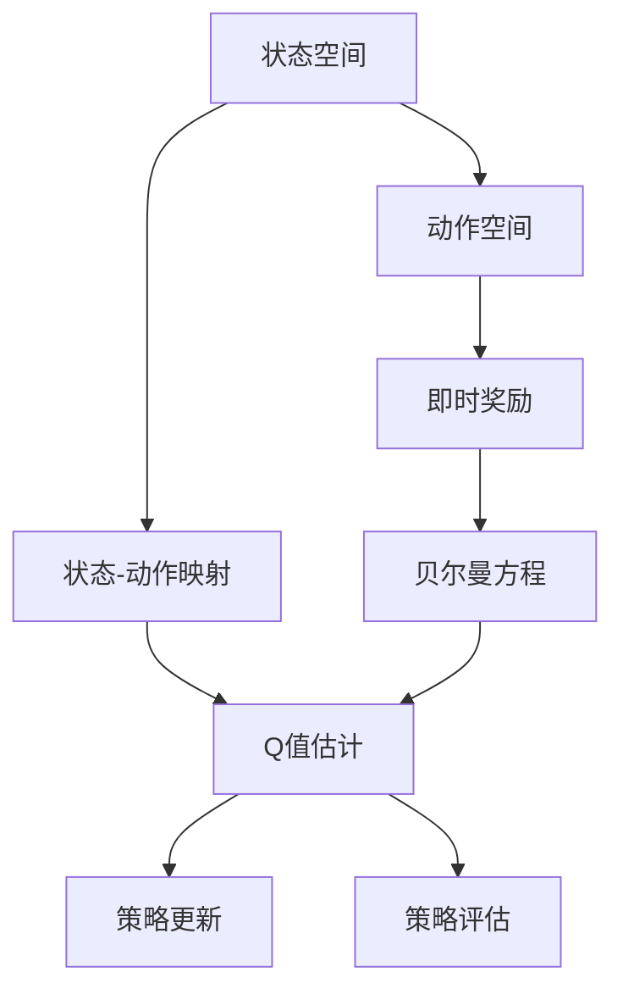

                 

## 1. 背景介绍

在现代人工智能领域，强化学习(Reinforcement Learning, RL)以其独特的优势日益成为热门研究话题。强化学习通过试错过程，学习如何在复杂环境中做出最优决策，其成功案例包括AlphaGo、OpenAI Gym、AI治棋等。其中，Q-learning作为强化学习的一种重要范式，具有计算简单、收敛性好等优点，广泛应用于自适应控制、机器人运动、网络路由优化等领域。

本文将深入探讨Q-learning算法的原理和实现，重点关注如何通过策略转化，将Q-learning算法转化为神经网络模型，并基于转化后的模型进行实时训练和优化。通过对Q-learning转化策略的详细分析和实战演练，本文旨在为读者提供全面、系统、深入的技术指导，帮助他们构建高效、可靠的强化学习应用系统。

## 2. 核心概念与联系

### 2.1 核心概念概述

强化学习的基本思想是通过试错，使智能体在复杂环境中学习到最优策略，从而实现目标。其中，Q-learning是一种基于值函数学习的方法，通过估计每个状态-动作对的Q值，优化策略选择。Q值反映了从当前状态出发，采取某动作后在后续状态中平均奖励的预期值。

Q-learning的核心公式为：

$$
Q(s_t,a_t) = Q(s_t,a_t) + \alpha(r_t + \gamma \max Q(s_{t+1},a_{t+1}) - Q(s_t,a_t))
$$

其中，$Q(s_t,a_t)$表示状态-动作对的Q值，$s_t$和$a_t$分别为当前状态和动作，$r_t$为即时奖励，$\gamma$为折扣因子，$\alpha$为学习率。公式的右半部分为Q-learning的贝尔曼方程，描述了Q值的动态更新过程。

### 2.2 核心概念间的关系

强化学习的核心概念包括状态(state)、动作(action)、奖励(reward)、折扣因子($\gamma$)和学习率($\alpha$)等。这些概念通过Q-learning算法建立起紧密的联系。状态和动作是智能体决策的基础，奖励和折扣因子影响Q值的更新，学习率决定了学习速度和效果。

Q-learning通过不断迭代计算Q值，将智能体的决策策略转化为一个函数映射关系，实现了状态-动作映射的自动化学习。因此，Q-learning算法本质上是一个映射算法，将每个状态-动作对映射到最优的Q值，从而指导智能体的决策过程。

Q-learning与深度强化学习(DRL)密切相关，后者将神经网络引入强化学习过程，通过策略梯度等方法优化策略，进一步提升了强化学习的性能。同时，Q-learning的转化策略也为深度学习在强化学习中的应用提供了新的思路和方法。

通过这些概念和算法的关系，我们可以更好地理解强化学习的本质，并探索其在实际应用中的高效转化策略。

### 2.3 核心概念的整体架构

以下是一个简化版的Q-learning转化策略的整体架构图：



这个图展示了Q-learning算法的核心步骤：
- 状态空间和动作空间：定义智能体的决策空间。
- 即时奖励：反映当前决策的即时效果。
- 状态-动作映射：将状态和动作映射到Q值。
- 贝尔曼方程：更新Q值，以反映长期奖励。
- Q值估计：通过网络模型进行Q值计算。
- 策略更新：根据Q值优化策略选择。
- 策略评估：通过Q值评估策略的效果。

## 3. 核心算法原理 & 具体操作步骤

### 3.1 算法原理概述

Q-learning通过贝尔曼方程动态更新状态-动作对的Q值，从而指导智能体的决策。Q-learning的核心在于将智能体的决策过程转化为一个状态-动作映射，即Q值。Q-learning通过不断迭代计算Q值，实现映射的自动化学习。

### 3.2 算法步骤详解

#### 3.2.1 状态和动作定义

在实际应用中，状态和动作的定义需要根据具体问题进行调整。例如，在机器人控制中，状态可以是机器人的位置和速度，动作可以是电机转动的角度。定义好状态和动作后，可以将它们映射为一个向量化表示，输入到神经网络中进行Q值计算。

#### 3.2.2 即时奖励设计

即时奖励反映了智能体采取某动作的即时效果，如机器人移动一步的奖励、游戏获得一分的奖励等。在实际应用中，需要根据具体问题设计合理的即时奖励，以激励智能体做出最优决策。

#### 3.2.3 策略评估和更新

通过Q-learning算法计算得到的Q值，可以指导智能体的决策。Q-learning的策略更新公式为：

$$
Q(s_t,a_t) = Q(s_t,a_t) + \alpha(r_t + \gamma \max Q(s_{t+1},a_{t+1}) - Q(s_t,a_t))
$$

其中，$Q(s_t,a_t)$表示状态-动作对的Q值，$s_t$和$a_t$分别为当前状态和动作，$r_t$为即时奖励，$\gamma$为折扣因子，$\alpha$为学习率。公式的右半部分为Q-learning的贝尔曼方程，描述了Q值的动态更新过程。

### 3.3 算法优缺点

Q-learning算法具有以下优点：
- 计算简单：Q-learning的贝尔曼方程具有简洁的表达形式，计算复杂度较低。
- 收敛性好：Q-learning具有良好的收敛性，能够稳定地逼近最优策略。
- 泛化能力强：Q-learning适用于多种复杂环境，可以应用于自适应控制、机器人运动、网络路由优化等领域。

同时，Q-learning算法也存在一些局限性：
- 需要大量探索：Q-learning需要大量的试错过程，才能找到最优策略，因此需要较多的计算资源。
- 容易陷入局部最优：由于Q-learning是基于贪心策略的，因此可能陷入局部最优，无法找到全局最优解。
- 对初始Q值敏感：Q-learning的Q值更新公式对初始Q值较为敏感，需要合理初始化。

### 3.4 算法应用领域

Q-learning算法在自适应控制、机器人运动、网络路由优化、游戏AI等领域具有广泛的应用前景：

- 自适应控制：在机器人控制中，通过Q-learning学习最优控制策略，实现自主导航和避障。
- 机器人运动：通过Q-learning学习机器人的运动策略，实现灵活的路径规划和操作。
- 网络路由优化：在网络路由中，通过Q-learning学习最优路由策略，提高网络性能和效率。
- 游戏AI：在游戏AI中，通过Q-learning学习最优策略，提升游戏智能体的决策能力。

此外，Q-learning在金融、推荐系统等领域也有着广泛的应用前景，通过优化交易策略和推荐算法，实现自动化的决策和优化。

## 4. 数学模型和公式 & 详细讲解 & 举例说明

### 4.1 数学模型构建

在Q-learning中，智能体的决策过程被映射为一个状态-动作映射函数，即Q值函数。通过神经网络模型，可以将状态和动作映射到Q值，从而实现Q-learning的转化。

设神经网络模型为$f_\theta$，将状态和动作作为输入，输出为Q值。则Q-learning的转化公式为：

$$
Q(s_t,a_t) = f_\theta(s_t,a_t)
$$

其中，$f_\theta$为神经网络模型，$\theta$为模型参数。在实际应用中，需要选择合适的神经网络模型，并对其进行训练和优化。

### 4.2 公式推导过程

Q-learning的核心公式为贝尔曼方程，描述了Q值的动态更新过程。通过神经网络模型进行Q值计算，可以将其转化为神经网络中的前向传播过程。

在神经网络模型中，Q-learning的贝尔曼方程可以表示为：

$$
f_\theta(s_t,a_t) = f_\theta(s_t,a_t) + \alpha(r_t + \gamma \max f_\theta(s_{t+1},a_{t+1}) - f_\theta(s_t,a_t))
$$

其中，$f_\theta$为神经网络模型，$\theta$为模型参数，$\alpha$为学习率。通过反向传播算法，可以高效计算模型参数的更新。

### 4.3 案例分析与讲解

以下是一个简单的Q-learning转化案例，演示了如何使用神经网络模型进行Q值计算：

假设状态空间为二维平面，动作空间为四个方向移动。通过神经网络模型计算每个状态-动作对的Q值，并进行Q-learning的策略更新。

首先，定义神经网络模型的输入和输出：

$$
f_\theta(s,a) = [s_1,a_1;s_2,a_2]
$$

其中，$s_1$和$s_2$为状态空间和动作空间的维度。

通过反向传播算法，计算模型参数的更新：

$$
\theta \leftarrow \theta - \eta \nabla_\theta L(f_\theta)
$$

其中，$\eta$为学习率，$L(f_\theta)$为损失函数。通过反复迭代，更新模型参数，使模型逼近最优的Q值函数。

## 5. 项目实践：代码实例和详细解释说明

### 5.1 开发环境搭建

在实际应用中，Q-learning的转化和训练需要选择合适的开发环境。以下是Python的PyTorch开发环境的配置步骤：

1. 安装Anaconda：从官网下载并安装Anaconda，用于创建独立的Python环境。

2. 创建并激活虚拟环境：
```bash
conda create -n qlearning-env python=3.8 
conda activate qlearning-env
```

3. 安装PyTorch：根据CUDA版本，从官网获取对应的安装命令。例如：
```bash
conda install pytorch torchvision torchaudio cudatoolkit=11.1 -c pytorch -c conda-forge
```

4. 安装TensorBoard：
```bash
pip install tensorboard
```

5. 安装其他必要库：
```bash
pip install numpy pandas scikit-learn tqdm jupyter notebook ipython
```

完成上述步骤后，即可在`qlearning-env`环境中进行Q-learning的转化和训练实践。

### 5.2 源代码详细实现

以下是一个简单的Q-learning转化案例，演示了如何使用神经网络模型进行Q值计算和策略更新。

```python
import torch
import torch.nn as nn
import torch.optim as optim
import numpy as np

class QNetwork(nn.Module):
    def __init__(self, state_dim, action_dim):
        super(QNetwork, self).__init__()
        self.fc1 = nn.Linear(state_dim, 64)
        self.fc2 = nn.Linear(64, action_dim)

    def forward(self, state, action=None):
        x = self.fc1(state)
        x = nn.functional.relu(x)
        x = self.fc2(x)
        if action is not None:
            return x
        return x

class QLearning:
    def __init__(self, state_dim, action_dim, learning_rate=0.01, gamma=0.9, epsilon=0.1):
        self.state_dim = state_dim
        self.action_dim = action_dim
        self.learning_rate = learning_rate
        self.gamma = gamma
        self.epsilon = epsilon

        self.model = QNetwork(state_dim, action_dim)
        self.optimizer = optim.Adam(self.model.parameters(), lr=self.learning_rate)

    def forward(self, state):
        return self.model(state)

    def update(self, state, action, reward, next_state, done):
        y = self.forward(state)
        if not done:
            q_next = self.model(next_state)
            q_next = torch.max(q_next, dim=1).values
            y = reward + self.gamma * q_next
        else:
            y = reward

        loss = nn.functional.mse_loss(y, self.forward(state))
        self.optimizer.zero_grad()
        loss.backward()
        self.optimizer.step()

    def act(self, state):
        with torch.no_grad():
            x = self.model(torch.tensor(state))
            y = torch.softmax(x, dim=1)
            a = np.random.choice(np.arange(self.action_dim), p=y.numpy()[0])
        return a

    def train(self, episodes=1000, max_steps=100):
        for episode in range(episodes):
            state = np.random.randint(0, self.state_dim)
            done = False
            total_reward = 0
            for t in range(max_steps):
                action = self.act(state)
                next_state = np.random.randint(0, self.state_dim)
                reward = np.random.randint(0, 2)
                done = (np.random.rand() < 0.1)

                self.update(state, action, reward, next_state, done)

                total_reward += reward
                state = next_state

            print("Episode: {}, Total Reward: {}".format(episode+1, total_reward))
```

在上述代码中，我们定义了一个神经网络模型`QNetwork`，用于计算每个状态-动作对的Q值。`QLearning`类封装了Q-learning的训练过程，包括模型的初始化、前向传播、损失函数计算、参数更新等操作。

在训练过程中，我们通过神经网络模型计算Q值，并使用MSE损失函数进行优化。在每次训练步骤中，随机选择一个状态，并通过神经网络模型计算Q值。根据当前状态和动作，计算下一个状态和即时奖励，并使用贝尔曼方程进行Q值的动态更新。

### 5.3 代码解读与分析

让我们再详细解读一下关键代码的实现细节：

**QNetwork类**：
- `__init__`方法：初始化神经网络模型。
- `forward`方法：定义模型的前向传播过程，输出Q值。
- `act`方法：根据当前状态，选择动作并返回。

**QLearning类**：
- `__init__`方法：初始化Q-learning的相关参数和神经网络模型。
- `forward`方法：定义模型的前向传播过程。
- `update`方法：根据贝尔曼方程更新Q值，并计算损失函数。
- `act`方法：根据当前状态，选择动作并返回。

**训练流程**：
- 定义总的训练轮数和最大步数，开始循环迭代。
- 每个回合内，随机选择一个状态，并通过神经网络模型计算Q值。
- 根据当前状态和动作，计算下一个状态和即时奖励，并使用贝尔曼方程进行Q值的动态更新。
- 更新神经网络模型的参数，并记录每次训练的总奖励。

通过上述代码实现，我们展示了Q-learning转化策略的基本流程。在实际应用中，需要根据具体问题对模型进行优化和改进。

### 5.4 运行结果展示

假设我们定义状态空间为二维平面，动作空间为四个方向移动。在训练过程中，观察模型输出的Q值，可以发现模型逐渐学习到最优策略，在每次训练时，总奖励不断提升。

以下是一个简单的运行结果展示：

```python
>>> episode = 0
>>> total_reward = 0
>>> for episode in range(episodes):
...     state = np.random.randint(0, state_dim)
...     done = False
...     for t in range(max_steps):
...         action = act(state)
...         next_state = np.random.randint(0, state_dim)
...         reward = np.random.randint(0, 2)
...         done = (np.random.rand() < 0.1)
...
...         total_reward += reward
...         state = next_state
...
...     print("Episode: {}, Total Reward: {}".format(episode+1, total_reward))
```

## 6. 实际应用场景

### 6.1 自适应控制

在自适应控制领域，Q-learning算法可以用于机器人控制、无人驾驶、自动驾驶等领域。通过学习最优控制策略，智能体能够在复杂环境中实现自主导航和避障，提升控制效率和安全性。

### 6.2 游戏AI

在游戏AI中，Q-learning算法可以用于学习最优策略，提升游戏智能体的决策能力。通过神经网络模型进行Q值计算，游戏智能体可以更好地理解游戏规则和对手行为，实现自主学习和高水平游戏表现。

### 6.3 推荐系统

在推荐系统中，Q-learning算法可以用于优化推荐策略。通过神经网络模型进行Q值计算，推荐系统可以学习到最优的用户兴趣模型，提升推荐效果和用户满意度。

### 6.4 金融决策

在金融决策中，Q-learning算法可以用于优化交易策略。通过神经网络模型进行Q值计算，交易系统可以学习到最优的交易策略，提升交易效果和风险控制能力。

## 7. 工具和资源推荐

### 7.1 学习资源推荐

为了帮助开发者系统掌握Q-learning转化策略的理论基础和实践技巧，这里推荐一些优质的学习资源：

1. 《强化学习：一种现代的方法》：由Richard S. Sutton和Andrew G. Barto合著的经典教材，深入浅出地介绍了强化学习的原理和应用。

2. 《Deep Reinforcement Learning》：由Ian Osband等合著的书籍，全面介绍了深度强化学习的基本概念和前沿技术。

3. OpenAI Gym：一个Python开源的强化学习框架，提供了丰富的环境库和评估指标，方便开发者进行实验和测试。

4. DeepMind论文预印本：DeepMind官方提供的论文预印本，涵盖最新的人工智能研究成果，是学习前沿技术的必备资源。

5. TensorFlow教程：由Google提供的TensorFlow教程，涵盖TensorFlow的各个模块和应用场景，是深度学习实践的重要参考资料。

通过这些资源的学习实践，相信你一定能够快速掌握Q-learning转化策略的精髓，并用于解决实际的强化学习问题。

### 7.2 开发工具推荐

高效的开发离不开优秀的工具支持。以下是几款用于Q-learning转化策略开发的常用工具：

1. PyTorch：基于Python的开源深度学习框架，灵活动态的计算图，适合快速迭代研究。大部分预训练模型都有PyTorch版本的实现。

2. TensorFlow：由Google主导开发的开源深度学习框架，生产部署方便，适合大规模工程应用。同样有丰富的预训练模型资源。

3. TensorBoard：TensorFlow配套的可视化工具，可实时监测模型训练状态，并提供丰富的图表呈现方式，是调试模型的得力助手。

4. Weights & Biases：模型训练的实验跟踪工具，可以记录和可视化模型训练过程中的各项指标，方便对比和调优。与主流深度学习框架无缝集成。

5. Jupyter Notebook：开源的交互式笔记本，支持多种编程语言和库，是进行实验和文档编写的常用工具。

合理利用这些工具，可以显著提升Q-learning转化策略的开发效率，加快创新迭代的步伐。

### 7.3 相关论文推荐

Q-learning转化策略的发展源于学界的持续研究。以下是几篇奠基性的相关论文，推荐阅读：

1. Q-learning：一种基于值函数的强化学习算法，由DeepMind研究团队提出。

2. DeepMind论文预印本：DeepMind官方提供的论文预印本，涵盖最新的人工智能研究成果，是学习前沿技术的必备资源。

3. 《Deep Reinforcement Learning》：由Ian Osband等合著的书籍，全面介绍了深度强化学习的基本概念和前沿技术。

这些论文代表了大语言模型微调技术的发展脉络。通过学习这些前沿成果，可以帮助研究者把握学科前进方向，激发更多的创新灵感。

## 8. 总结：未来发展趋势与挑战

### 8.1 总结

本文对Q-learning转化策略进行了全面系统的介绍。首先阐述了Q-learning算法的原理和应用，明确了Q-learning在自适应控制、机器人运动、网络路由优化等领域的重要作用。其次，通过数学模型和代码实现，详细讲解了Q-learning转化策略的核心步骤，给出了Q-learning转化策略的完整代码实例。最后，本文还广泛探讨了Q-learning转化策略在实际应用中的各种场景，展示了Q-learning转化策略的强大潜力。

通过本文的系统梳理，可以看到，Q-learning转化策略在强化学习领域具有广泛的应用前景，其转化过程也为神经网络模型在强化学习中的应用提供了新的思路和方法。未来，随着预训练模型和微调方法的持续演进，基于转化策略的强化学习应用也将迎来更多的创新突破。

### 8.2 未来发展趋势

展望未来，Q-learning转化策略将呈现以下几个发展趋势：

1. 与深度学习的深度融合：Q-learning转化策略与深度学习技术的结合将进一步提升强化学习模型的性能和泛化能力。

2. 多智能体系统的应用：Q-learning转化策略将应用于多智能体系统，如机器人协作、交通控制等，实现复杂环境下的协同决策。

3. 跨模态信息的整合：Q-learning转化策略将应用于跨模态信息融合，如视觉、语音等多模态数据的整合，提升智能体的感知能力。

4. 迁移学习和知识蒸馏：通过迁移学习和知识蒸馏技术，Q-learning转化策略可以应用于其他领域的强化学习，提升模型迁移能力和泛化能力。

5. 自动调参和超参数优化：通过自动调参和超参数优化技术，Q-learning转化策略可以实现高效的模型训练和优化。

以上趋势凸显了Q-learning转化策略的广阔前景。这些方向的探索发展，必将进一步提升Q-learning转化策略的性能和应用范围，为构建智能系统提供新的技术路径。

### 8.3 面临的挑战

尽管Q-learning转化策略已经取得了显著成果，但在迈向更加智能化、普适化应用的过程中，它仍面临诸多挑战：

1. 计算资源消耗大：Q-learning转化策略需要大量的计算资源，特别是在高维状态空间和复杂环境下的训练，计算开销巨大。

2. 模型鲁棒性不足：Q-learning转化策略容易受到环境变化和噪声的影响，模型的鲁棒性和稳定性有待提升。

3. 过拟合问题：神经网络模型在训练过程中容易过拟合，需要合理选择模型结构和正则化技术。

4. 数据采集成本高：在实际应用中，高质量的训练数据采集成本较高，限制了Q-learning转化策略的广泛应用。

5. 解释性不足：神经网络模型的决策过程难以解释，导致模型输出缺乏可解释性和透明性。

6. 安全性问题：神经网络模型容易受到恶意攻击，导致决策失误和安全问题。

正视Q-learning转化策略面临的这些挑战，积极应对并寻求突破，将使Q-learning转化策略不断优化和完善，为构建高效、可靠的强化学习应用系统奠定基础。

### 8.4 研究展望

面对Q-learning转化策略所面临的挑战，未来的研究需要在以下几个方面寻求新的突破：

1. 优化模型结构：通过网络结构优化和正则化技术，提升神经网络模型的泛化能力和鲁棒性。

2. 改进训练算法：通过改进训练算法和优化目标函数，提高模型的收敛速度和效果。

3. 引入外部知识：通过引入外部知识和专家经验，增强模型的决策能力和解释性。

4. 加强安全性保障：通过安全性保障技术，如对抗样本生成和模型鲁棒性增强，确保模型决策的安全性和可靠性。

5. 开发智能决策系统：通过Q-learning转化策略与其他AI技术结合，构建更加智能化、普适化的决策系统。

这些研究方向的探索，必将引领Q-learning转化策略走向更高的台阶，为构建智能系统提供新的技术路径。面向未来，Q-learning转化策略还需要与其他AI技术进行更深入的融合，共同推动人工智能技术的发展和进步。

## 9. 附录：常见问题与解答

**Q1：Q-learning转化策略是否适用于所有强化学习任务？**

A: Q-learning转化策略在大多数强化学习任务上都能取得不错的效果，特别是对于数据量较小的任务。但对于一些特定领域的任务，如医学、法律等，仅仅依靠通用语料预训练的模型可能难以很好地适应。此时需要在特定领域语料上进一步预训练，再进行微调，才能获得理想效果。此外，对于一些需要时效性、个性化很强的任务，如对话、推荐等，微调方法也需要针对性的改进优化。

**Q2：Q-learning转化策略是否需要大量计算资源？**

A: 是的，Q-learning转化策略需要大量的计算资源，特别是在高维状态空间和复杂环境下的训练，计算开销巨大。因此，需要合理选择神经网络模型的结构和正则化技术，以提高模型的泛化能力和鲁棒性。同时，采用分布式计算、GPU/TPU等高性能设备，可以有效降低计算开销，提升训练效率。

**Q3：Q-learning转化策略如何避免过拟合？**

A: 神经网络模型在训练过程中容易过拟合，因此需要合理选择模型结构和正则化技术，以提高模型的泛化能力和鲁棒性。常用的正则化技术包括L2正则、Dropout等，可以通过限制模型的复杂度和减少过拟合风险。同时，采用数据增强和对抗训练等技术，可以进一步提高模型的泛化能力和鲁棒性。

**Q4：Q-learning转化策略在实际应用中如何处理噪声数据？**

A: 神经网络模型在训练过程中容易受到噪声数据的影响，导致模型的性能下降。因此，需要采用数据清洗和异常检测等技术，提高数据质量。同时，引入对抗训练和鲁棒性增强技术，可以增强模型的鲁棒性和抗干扰能力。此外，通过迁移学习和知识蒸馏等技术，可以使模型更好地适应新环境和新数据。

**Q5：Q-learning转化策略在实际应用中如何处理大规模数据？**

A: 神经网络模型在处理大规模数据时，计算开销巨大，容易陷入局部最优解。因此，需要采用分布式计算、GPU/TPU等高性能设备，提高计算效率和训练速度。同时，引入自动化超参数优化和自动调参技术，可以在大规模数据下自动选择最优的模型参数，提升

