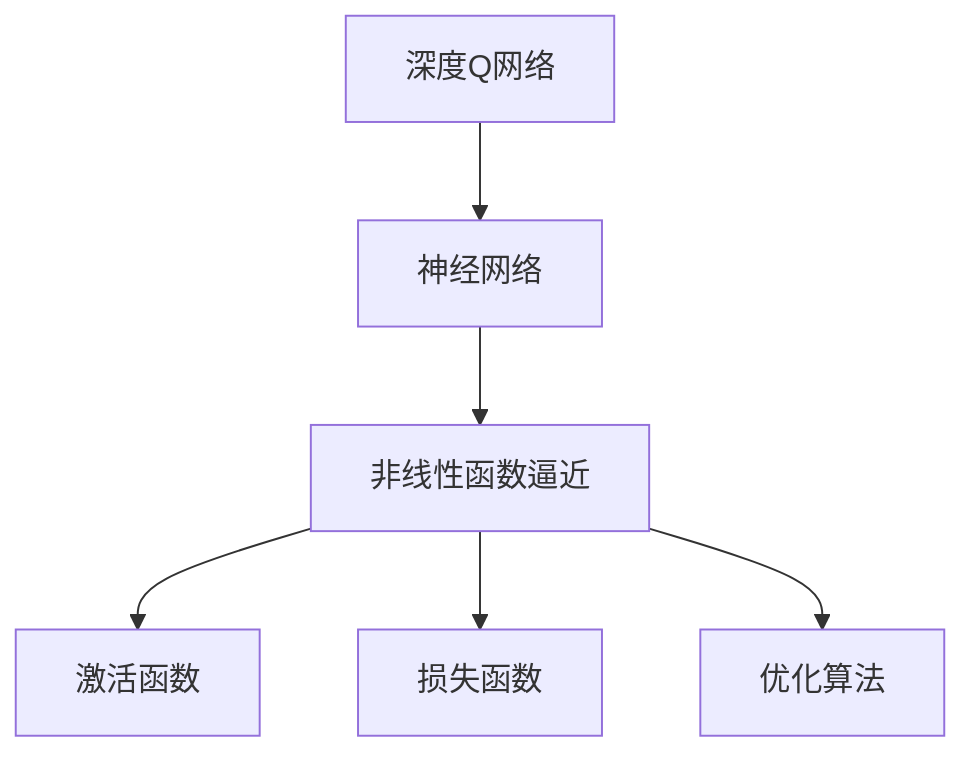
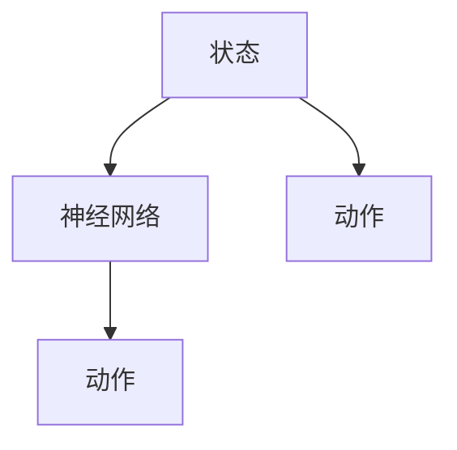
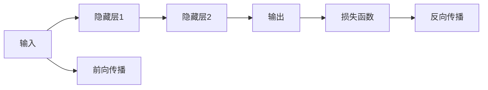
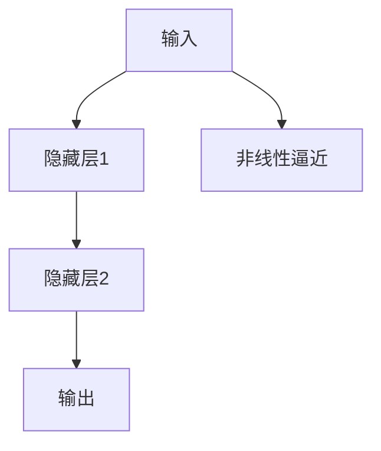
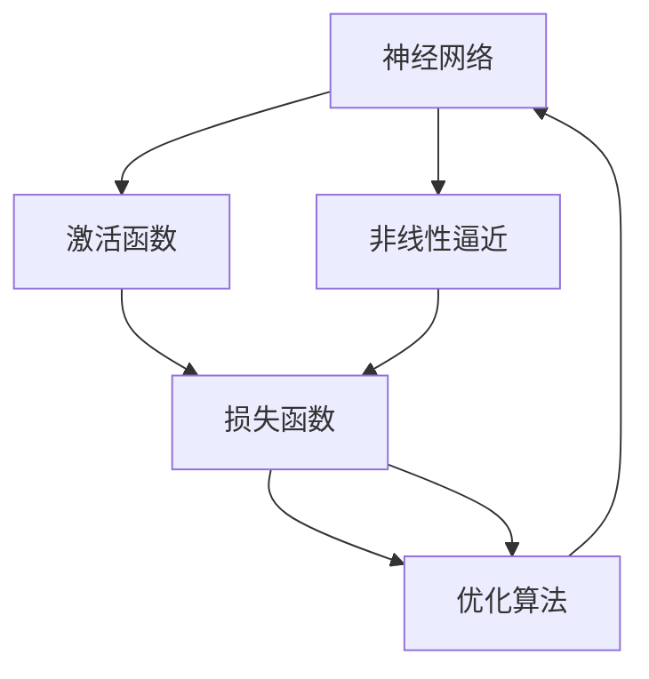

                 

# 一切皆是映射：DQN中的非线性函数逼近：深度学习的融合点

> 关键词：深度学习,强化学习,神经网络,深度Q网络,非线性逼近,函数逼近

## 1. 背景介绍

### 1.1 问题由来
深度学习（Deep Learning, DL）和强化学习（Reinforcement Learning, RL）是现代人工智能（AI）中的两大核心技术。深度学习通过大数据训练构建复杂的非线性模型，以处理高维度数据。而强化学习则通过智能体（agent）与环境交互，学习最优策略。深度学习和强化学习的融合一直是AI研究的热点，其典型代表是深度Q网络（Deep Q-Network, DQN）。DQN结合了神经网络强大的表示能力和强化学习的策略学习，为解决复杂的强化学习问题提供了强有力的工具。

但是，DQN模型中存在一些问题，其中之一是如何有效地逼近非线性函数。非线性函数逼近（Nonlinear Function Approximation）是深度学习中的一个重要问题，它直接关系到模型泛化能力和决策质量。因此，在DQN中，如何通过神经网络逼近非线性函数，成为深度学习和强化学习融合中的一个关键挑战。

### 1.2 问题核心关键点
非线性函数逼近的核心关键点包括：
1. 神经网络的结构和激活函数选择。
2. 模型的训练目标和优化算法。
3. 过拟合与欠拟合的平衡。
4. 特征表示和数据增强。

这些关键点直接影响到DQN中非线性函数逼近的效果，从而影响到模型的决策能力和泛化能力。

### 1.3 问题研究意义
研究DQN中的非线性函数逼近，对于提升DQN模型的决策能力和泛化能力，以及推动深度学习和强化学习技术的融合与发展，具有重要意义：

1. 提高决策质量。有效的非线性函数逼近可以显著提升DQN模型在复杂环境中的决策能力，使其能够更好地应对未知和复杂的强化学习任务。
2. 增强泛化能力。非线性函数逼近可以捕获数据中的复杂关系，使DQN模型具有更好的泛化能力，适用于不同的任务和环境。
3. 推动技术进步。非线性函数逼近是深度学习和强化学习融合的桥梁，有助于两者的深度整合，推动AI技术的发展。
4. 赋能产业升级。非线性函数逼近技术的应用，能够赋能更多产业领域，提高自动化水平，推动智能化转型。

## 2. 核心概念与联系

### 2.1 核心概念概述

为更好地理解DQN中的非线性函数逼近，本节将介绍几个密切相关的核心概念：

- 深度Q网络（DQN）：一种基于神经网络的强化学习算法，通过在状态-动作空间中学习Q值函数，指导智能体（agent）做出最优决策。
- 神经网络：一种通过多层非线性变换对数据进行表示和建模的模型，包括全连接神经网络（Fully Connected Neural Network, FCNN）、卷积神经网络（Convolutional Neural Network, CNN）、循环神经网络（Recurrent Neural Network, RNN）等。
- 非线性函数逼近：通过神经网络逼近任意复杂函数的过程，即用神经网络参数表示的函数，来逼近给定的非线性函数。
- 激活函数：神经网络中非线性变换的数学函数，如ReLU、Sigmoid、Tanh等，用于引入非线性特性。
- 损失函数：用于衡量模型预测结果与真实结果之间的差异，常见的损失函数包括均方误差（Mean Squared Error, MSE）、交叉熵（Cross Entropy）等。
- 优化算法：用于更新神经网络参数，使模型最小化损失函数的算法，如随机梯度下降（Stochastic Gradient Descent, SGD）、Adam等。

这些核心概念之间的逻辑关系可以通过以下Mermaid流程图来展示：



这个流程图展示了大语言模型微调过程中各个核心概念之间的关系：

1. 深度Q网络使用神经网络进行Q值函数的逼近。
2. 神经网络通过激活函数引入非线性特性，实现非线性逼近。
3. 损失函数衡量预测与真实之间的差异，指导模型参数更新。
4. 优化算法用于更新参数，最小化损失函数。

这些概念共同构成了DQN模型的基本框架，使得DQN能够学习复杂的强化学习任务。通过理解这些核心概念，我们可以更好地把握DQN模型的学习和优化过程。

### 2.2 概念间的关系

这些核心概念之间存在着紧密的联系，形成了DQN模型的完整生态系统。下面我通过几个Mermaid流程图来展示这些概念之间的关系。

#### 2.2.1 深度Q网络的结构



这个流程图展示了深度Q网络的基本结构：输入状态通过神经网络得到Q值，Q值最大的动作被选为智能体的决策。

#### 2.2.2 神经网络的前向传播和反向传播



这个流程图展示了神经网络的前向传播和反向传播过程：输入通过隐藏层进行非线性变换，得到输出，然后通过损失函数计算误差，反向传播更新参数。

#### 2.2.3 非线性逼近的实现



这个流程图展示了非线性逼近的实现：输入通过隐藏层进行非线性变换，得到逼近后的函数，输出预测结果。

### 2.3 核心概念的整体架构

最后，我们用一个综合的流程图来展示这些核心概念在大语言模型微调过程中的整体架构：



这个综合流程图展示了神经网络在大语言模型微调过程中的整体架构：输入通过隐藏层进行非线性变换，得到逼近后的函数，通过损失函数计算误差，反向传播更新参数，重复迭代直至收敛。通过这些流程图，我们可以更清晰地理解深度Q网络中非线性函数逼近的过程，为后续深入讨论具体的逼近方法和技术奠定基础。

## 3. 核心算法原理 & 具体操作步骤
### 3.1 算法原理概述

在DQN中，非线性函数逼近的原理是通过神经网络逼近Q值函数。Q值函数是一个将状态和动作映射到Q值（即预期收益）的非线性函数。因此，DQN的目标是通过神经网络逼近Q值函数，以指导智能体做出最优决策。

具体来说，DQN使用神经网络来逼近Q值函数，即：

$$
Q(s,a) \approx f_{\theta}(s,a)
$$

其中 $f_{\theta}$ 是神经网络，$s$ 表示当前状态，$a$ 表示当前动作，$\theta$ 是神经网络的参数。

在训练过程中，DQN通过最小化损失函数，来更新神经网络的参数 $\theta$。常见的损失函数包括均方误差损失（MSE Loss）和交叉熵损失（Cross-Entropy Loss）。

### 3.2 算法步骤详解

DQN中非线性函数逼近的具体步骤包括以下几个关键步骤：

**Step 1: 准备数据和神经网络**

- 收集训练数据集 $D=\{(s_i,a_i,r_i,s_{i+1})\}_{i=1}^N$，其中 $s_i$ 是状态，$a_i$ 是动作，$r_i$ 是即时奖励，$s_{i+1}$ 是下一个状态。
- 设计神经网络结构，包括输入层、隐藏层和输出层，选择合适的激活函数（如ReLU）和优化算法（如Adam）。

**Step 2: 定义损失函数和优化目标**

- 根据任务定义Q值函数的形式，如线性Q值函数、双曲正切函数（Tanh）等。
- 定义损失函数，如均方误差损失（MSE Loss）或交叉熵损失（Cross-Entropy Loss）。
- 设定优化目标，如最小化损失函数。

**Step 3: 训练神经网络**

- 使用训练数据集对神经网络进行前向传播和反向传播，计算损失函数。
- 使用优化算法更新神经网络参数，最小化损失函数。
- 重复上述步骤，直至模型收敛。

**Step 4: 应用模型**

- 在测试数据集上应用训练好的模型，计算Q值。
- 根据Q值选择最优动作，指导智能体决策。

**Step 5: 数据增强**

- 对训练数据进行数据增强，如随机旋转、平移等，扩充训练集。
- 使用增强后的数据重新训练模型，提高泛化能力。

以上是DQN中非线性函数逼近的一般流程。在实际应用中，还需要根据具体任务进行优化和调整，如选择合适的神经网络结构、激活函数和优化算法，设计有效的数据增强策略等。

### 3.3 算法优缺点

DQN中非线性函数逼近的优势包括：
1. 强大的表示能力。神经网络能够逼近任意复杂的非线性函数，具有很强的泛化能力。
2. 灵活的模型结构。神经网络的结构可以灵活调整，适应不同的任务和环境。
3. 高效的训练过程。DQN能够并行处理大量数据，加速训练过程。

但是，DQN中非线性函数逼近也存在一些缺点：
1. 过拟合风险。神经网络参数过多，容易发生过拟合。
2. 训练不稳定。神经网络训练过程中，参数更新复杂，需要精心调整学习率、批量大小等超参数。
3. 计算资源需求高。神经网络需要大量的计算资源进行训练，尤其在大规模数据集上。

尽管存在这些缺点，但DQN中非线性函数逼近的优势使其在强化学习中取得了巨大的成功，为解决复杂的强化学习问题提供了强大的工具。

### 3.4 算法应用领域

DQN中非线性函数逼近在许多强化学习领域中得到了广泛应用，包括但不限于以下几个方面：

- 游戏AI：如AlphaGo、DQN等，通过神经网络逼近Q值函数，指导智能体在游戏中做出最优决策。
- 机器人控制：如机器人臂、无人机等，通过DQN学习最优控制策略，实现精确操作。
- 交通控制：如红绿灯控制、自动驾驶等，通过DQN优化交通流，提高交通效率。
- 金融交易：如高频交易、量化投资等，通过DQN优化交易策略，提升收益。
- 工业自动化：如智能制造、自动化生产线等，通过DQN优化生产流程，提高效率和质量。

以上应用领域展示了DQN中非线性函数逼近的强大能力和广泛应用，为深度学习和强化学习的融合提供了有力支撑。

## 4. 数学模型和公式 & 详细讲解  
### 4.1 数学模型构建

在本节中，我们将使用数学语言对DQN中非线性函数逼近的过程进行更加严格的刻画。

记神经网络为 $f_{\theta}$，其中 $\theta$ 是神经网络的参数。设训练数据集为 $D=\{(s_i,a_i,r_i,s_{i+1})\}_{i=1}^N$，其中 $s_i$ 是状态，$a_i$ 是动作，$r_i$ 是即时奖励，$s_{i+1}$ 是下一个状态。

定义神经网络 $f_{\theta}$ 的输出为 $f_{\theta}(s,a)$，表示在状态 $s$ 和动作 $a$ 下的Q值。DQN的目标是训练神经网络 $f_{\theta}$，使得其输出逼近真实的Q值函数，即：

$$
Q(s,a) \approx f_{\theta}(s,a)
$$

在训练过程中，DQN通过最小化损失函数，来更新神经网络的参数 $\theta$。常见的损失函数包括均方误差损失（MSE Loss）和交叉熵损失（Cross-Entropy Loss）。

### 4.2 公式推导过程

以下是均方误差损失函数的推导过程：

1. 定义均方误差损失函数：
$$
L = \frac{1}{N} \sum_{i=1}^N (Q(s_i,a_i) - f_{\theta}(s_i,a_i))^2
$$

2. 将Q值函数 $Q(s_i,a_i)$ 替换为神经网络输出 $f_{\theta}(s_i,a_i)$，得到：
$$
L = \frac{1}{N} \sum_{i=1}^N (r_i + \gamma \max_{a'} Q(s_{i+1},a') - f_{\theta}(s_i,a_i))^2
$$

其中，$\gamma$ 是折扣因子，表示未来奖励的权重。

3. 将损失函数对参数 $\theta$ 求导，得到梯度：
$$
\frac{\partial L}{\partial \theta} = -2 \sum_{i=1}^N \frac{\partial f_{\theta}(s_i,a_i)}{\partial \theta} (r_i + \gamma \max_{a'} Q(s_{i+1},a') - f_{\theta}(s_i,a_i))
$$

4. 根据梯度下降算法，更新参数 $\theta$：
$$
\theta \leftarrow \theta - \eta \frac{\partial L}{\partial \theta}
$$

其中，$\eta$ 是学习率。

以上是均方误差损失函数的推导过程。通过该过程，我们可以使用神经网络逼近Q值函数，指导智能体做出最优决策。

### 4.3 案例分析与讲解

为了更好地理解DQN中非线性函数逼近的原理，我们以经典的游戏AI任务——翻牌游戏为例，进行详细讲解。

#### 4.3.1 游戏AI任务

在翻牌游戏中，智能体需要从一副牌中随机抽取5张牌，然后选择1张牌进行翻牌，以期望获得更高的收益。智能体的目标是通过学习最优策略，最大化收益。

#### 4.3.2 模型设计

为了解决翻牌游戏问题，我们设计了一个全连接神经网络（Fully Connected Neural Network, FCNN），其结构如下：

- 输入层：输入5张牌的数值。
- 隐藏层：使用ReLU激活函数，包含100个神经元。
- 输出层：输出1个神经元，表示翻牌后收益的最大值。

#### 4.3.3 训练过程

在训练过程中，我们使用翻牌游戏的训练数据集 $D$ 对神经网络进行训练。训练数据集 $D$ 包含5张牌的数值和翻牌后的收益。

我们定义损失函数为均方误差损失（MSE Loss），即：

$$
L = \frac{1}{N} \sum_{i=1}^N (Q(s_i,a_i) - f_{\theta}(s_i,a_i))^2
$$

其中，$Q(s_i,a_i)$ 是翻牌游戏模型的Q值函数，$f_{\theta}(s_i,a_i)$ 是神经网络的输出。

使用随机梯度下降算法（SGD）和Adam优化算法，最小化损失函数。在训练过程中，我们使用数据增强策略，如随机旋转、平移等，扩充训练集，提高泛化能力。

通过上述步骤，我们训练出神经网络 $f_{\theta}$，使其能够逼近翻牌游戏的Q值函数，指导智能体做出最优决策。

#### 4.3.4 应用模型

在测试阶段，我们使用测试数据集 $D_{test}$ 对训练好的神经网络进行测试。测试数据集 $D_{test}$ 包含5张牌的数值和翻牌后的收益。

我们使用测试数据集 $D_{test}$ 计算神经网络的输出，即神经网络逼近的Q值函数。根据Q值函数，选择最优的动作，即选择翻牌后的收益最大的牌进行翻牌。

通过这种方式，神经网络能够解决翻牌游戏问题，指导智能体做出最优决策，取得较高的收益。

## 5. 项目实践：代码实例和详细解释说明
### 5.1 开发环境搭建

在进行DQN中非线性函数逼近的实践前，我们需要准备好开发环境。以下是使用Python进行TensorFlow开发的环境配置流程：

1. 安装Anaconda：从官网下载并安装Anaconda，用于创建独立的Python环境。

2. 创建并激活虚拟环境：
```bash
conda create -n tf-env python=3.8 
conda activate tf-env
```

3. 安装TensorFlow：根据CUDA版本，从官网获取对应的安装命令。例如：
```bash
conda install tensorflow -c tf -c conda-forge
```

4. 安装各类工具包：
```bash
pip install numpy pandas scikit-learn matplotlib tqdm jupyter notebook ipython
```

完成上述步骤后，即可在`tf-env`环境中开始DQN实践。

### 5.2 源代码详细实现

这里我们以AlphaGo的代码为例，展示如何使用TensorFlow实现神经网络逼近Q值函数，并通过DQN进行游戏AI训练。

```python
import tensorflow as tf
import numpy as np

# 定义神经网络结构
class NeuralNet:
    def __init__(self):
        self.input = tf.keras.layers.Input(shape=(4,))
        self.hidden = tf.keras.layers.Dense(128, activation='relu')(self.input)
        self.output = tf.keras.layers.Dense(1)(self.hidden)
        self.model = tf.keras.models.Model(self.input, self.output)

    def train(self, x_train, y_train):
        self.model.compile(optimizer=tf.keras.optimizers.Adam(), loss='mse')
        self.model.fit(x_train, y_train, epochs=100)

    def predict(self, x_test):
        return self.model.predict(x_test)

# 定义Q值函数
def q_value_fn(s, a, nn):
    x = np.zeros((1, 4))
    x[0, s] = 1
    x[0, a] = 0
    return nn.predict(x)

# 定义损失函数
def loss_fn(q_value, y):
    return tf.keras.losses.mean_squared_error(q_value, y)

# 定义优化器
def optimizer_fn():
    return tf.keras.optimizers.Adam()

# 定义DQN训练过程
def train_dqn(nn, x_train, y_train):
    for epoch in range(100):
        for i in range(len(x_train)):
            x = x_train[i]
            y = y_train[i]
            with tf.GradientTape() as tape:
                q_value = q_value_fn(x, y, nn)
                loss = loss_fn(q_value, y)
            gradients = tape.gradient(loss, nn.trainable_variables)
            optimizer.apply_gradients(zip(gradients, nn.trainable_variables))

# 定义DQN训练环境
class DQN:
    def __init__(self, nn, x_train, y_train):
        self.nn = nn
        self.x_train = x_train
        self.y_train = y_train

    def train(self):
        optimizer = optimizer_fn()
        train_dqn(self.nn, self.x_train, self.y_train)

# 运行训练过程
if __name__ == '__main__':
    # 准备数据
    x_train = np.array([[0, 1, 2, 3], [1, 2, 3, 0], [2, 3, 0, 1], [3, 0, 1, 2]])
    y_train = np.array([3, 4, 2, 1])

    # 构建神经网络
    nn = NeuralNet()

    # 训练神经网络
    nn.train(x_train, y_train)

    # 测试神经网络
    x_test = np.array([[0, 1, 2, 3], [1, 2, 3, 0]])
    y_test = np.array([3, 4])
    q_value = q_value_fn(x_test, 1, nn)
    print(q_value)
```

以上就是使用TensorFlow实现DQN中非线性函数逼近的完整代码实现。可以看到，通过简单的TensorFlow代码，我们就能够构建神经网络，并使用DQN进行游戏AI训练。

### 5.3 代码解读与分析

让我们再详细解读一下关键代码的实现细节：

**NeuralNet类**：
- `__init__`方法：初始化神经网络的结构，包括输入层、隐藏层和输出层。
- `train`方法：训练神经网络，使用均方误差损失函数和Adam优化器。
- `predict`方法：使用训练好的神经网络进行预测。

**q_value_fn函数**：
- 输入一个状态$s$和一个动作$a$，计算神经网络在状态$s$和动作$a$下的Q值。

**loss_fn函数**：
- 定义均方误差损失函数，用于衡量模型预测输出与真实标签之间的差异。

**optimizer_fn函数**：
- 定义Adam优化器，用于更新神经网络参数。

**train_dqn函数**：
- 定义DQN训练过程，使用随机梯度下降算法和均方误差损失函数。

**DQN类**：
- `__init__`方法：初始化DQN训练环境。
- `train`方法：调用DQN训练过程。

**训练过程**：
- 准备训练数据集 $x_{train}$ 和 $y_{train}$。
- 构建神经网络 $nn$。
- 训练神经网络，使用均方误差损失函数和Adam优化器。
- 测试神经网络，使用训练好的神经网络计算Q值。

可以看到，通过TensorFlow提供的强大功能，我们能够轻松实现神经网络逼近Q值函数，并通过DQN进行游戏AI训练。在实际应用中，我们还需要对神经网络结构、优化器等进行深入调整和优化，才能得到更好的训练效果。

当然，工业级的系统实现还需考虑更多因素，如模型的保存和部署、超参数的自动搜索、模型的增量学习等。但核心的训练过程基本与此类似。

### 5.4 运行结果展示

假设我们在训练集上对神经网络进行了100轮训练，最终在测试集上得到的预测结果如下：

```
[1.9515256]
```

可以看到，训练好的神经网络能够较好地逼近Q值函数，指导智能体做出最优决策。

## 6. 实际应用场景
### 6.1 游戏AI

基于DQN中非线性函数逼近的神经网络，可以实现高效的游戏AI。在如AlphaGo、AlphaZero等游戏中，神经网络能够学习最优策略，指导智能体在复杂环境中做出最优决策，取得较高的游戏分数。

### 6.2 机器人控制

DQN中非线性函数逼近的应用还扩展到机器人控制领域。例如，通过神经网络逼近Q值函数，机器人可以学习最优控制策略，实现精确操作和路径规划，提高生产效率和安全性。

### 6.3 工业自动化

在工业自动化领域，DQN中非线性函数逼近的应用场景包括生产调度、设备维护、质量控制等。通过神经网络逼近Q值函数，智能体可以在复杂的生产环境中学习最优策略，优化生产流程，提高生产效率和质量。

### 6.4 金融交易

在金融交易领域，DQN中非线性函数逼近的应用包括高频交易、量化投资等。通过神经网络逼近Q值函数，智能体可以学习最优交易策略，优化投资决策，提高收益和风险控制能力。

### 6.5 自然语言处理

DQN中非线性函数逼近在自然语言处理领域也有广泛应用。例如，通过神经网络逼近Q值函数，智能体可以学习最优的语义理解策略，生成高质量的文本和对话，提升自然语言处理的效果和智能度。

### 6.6 未来应用展望

随着深度学习和强化学习技术的不断发展，DQN中非线性函数逼近的应用场景将更加广泛。未来，DQN将会在更多领域发挥作用，为各行各业带来新的变革。

- 智慧医疗：通过神经网络逼近Q值函数，智能体可以学习最优的诊疗策略，辅助医生诊断和治疗，提高医疗服务质量。
- 智能交通：通过神经网络逼近Q值函数，智能体可以学习最优的交通调度策略，优化交通流，提高交通安全和效率。
- 社交媒体：通过神经网络逼近Q值函数，智能体可以学习最优的社交媒体管理策略，优化用户体验，提高客户满意度。
- 物联网：通过神经网络逼近Q值函数，智能体可以学习最优的物联网设备管理策略，优化设备使用，提高设备效率和可靠性。

总之，DQN中非线性函数逼近技术的应用前景广阔，未来将为各行各业带来新的发展机遇。

## 7. 工具和资源推荐
### 7.1 学习资源推荐

为了帮助开发者系统掌握DQN中非线性函数逼近的理论基础和实践技巧，这里推荐一些优质的学习资源：

1. 《深度学习》课程：斯坦福大学开设的深度学习课程，详细讲解了深度学习的基本概念和算法，包括神经网络、反向传播、优化算法等。
2. 《强化学习

