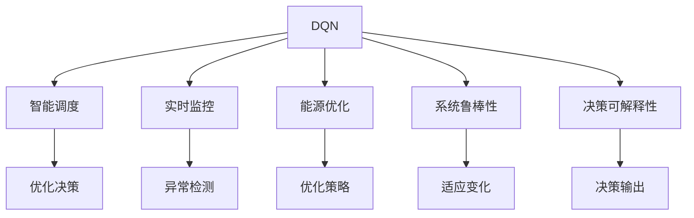
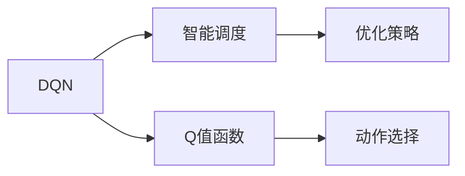
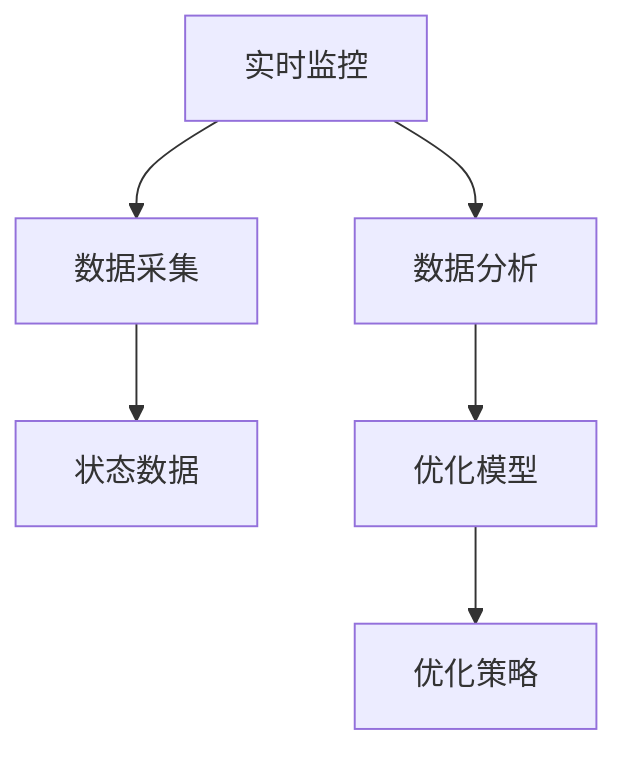
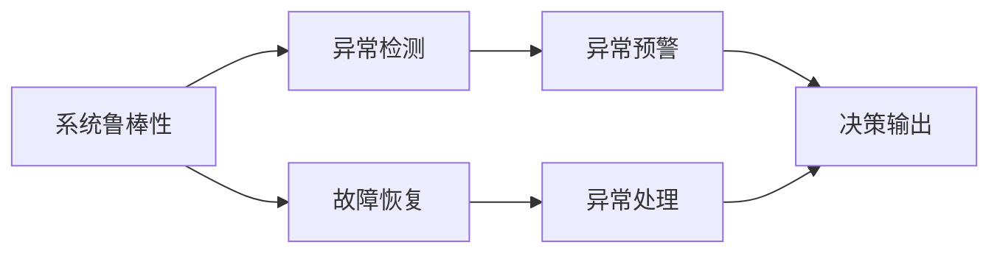
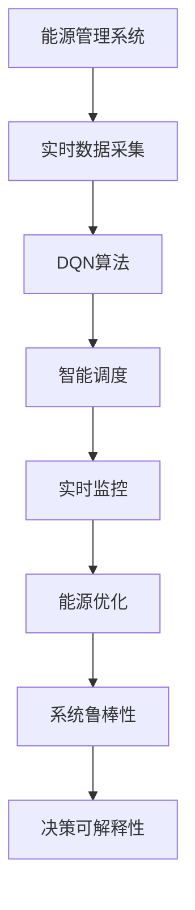

                 

# 一切皆是映射：DQN在能源管理系统中的应用与价值

> 关键词：深度强化学习, DQN, 能源管理, 智能调度, 能源优化, 实时监控, 动态优化

## 1. 背景介绍

### 1.1 问题由来
随着社会经济的快速发展，能源消耗日益增加，能源问题逐渐成为全球关注的焦点。能源管理作为一个重要的领域，涉及到电力、天然气、水资源等的分配、传输、使用等，关乎到整个社会的可持续发展。传统能源管理系统往往依赖人工决策，效率低下，资源利用率不高，且难以应对实时变化的需求和突发事件。

在这样的背景下，深度强化学习（DQN）作为一种强大的AI技术，逐渐被引入能源管理系统，以期通过智能调度、动态优化等手段，提高能源的利用效率和系统的稳定性。DQN在能源管理系统的应用，不仅能够提升系统的运行效率，降低能源消耗，还能够增强系统的自我调节能力，保障能源供应的安全性和可靠性。

### 1.2 问题核心关键点
DQN在能源管理系统中的应用，主要集中在以下几个方面：

- **智能调度**：利用深度强化学习，对能源的供应和需求进行智能调度，实现动态优化，提高资源利用率。
- **实时监控**：通过DQN算法实时监控能源系统状态，及时发现和解决异常问题，保障系统的稳定运行。
- **能源优化**：通过对历史数据的学习和分析，DQN能够优化能源分配和使用的策略，减少能源浪费。
- **系统鲁棒性**：DQN能够适应多变的能源需求和供应环境，提高系统的鲁棒性和可靠性。
- **决策可解释性**：DQN模型能够提供决策的依据和过程，提高决策的可解释性和透明度。

## 2. 核心概念与联系

### 2.1 核心概念概述

为更好地理解DQN在能源管理系统中的应用，本节将介绍几个密切相关的核心概念：

- **深度强化学习（DQN）**：一种基于深度神经网络（DNN）的强化学习算法，用于解决环境与智能体之间的交互问题。DQN通过Q值函数评估每个动作的长期回报，最大化期望累积奖励，从而实现智能决策。

- **智能调度**：在能源管理系统中的智能调度，指的是对能源的供应和需求进行优化，以最大化系统的整体效率和效益。

- **实时监控**：通过传感器、通信网络等技术手段，实时采集能源系统的状态数据，并对这些数据进行分析和处理，以便及时发现和解决系统异常。

- **能源优化**：通过对能源系统的运行数据进行分析和挖掘，优化能源的分配和使用策略，提高能源的利用效率。

- **系统鲁棒性**：在能源管理系统中，系统鲁棒性指的是系统能够适应环境变化、应对突发事件的能力。

- **决策可解释性**：决策可解释性指的是系统决策的依据和过程能够被理解和解释，提高系统的透明度和可信度。

这些核心概念之间的逻辑关系可以通过以下Mermaid流程图来展示：



这个流程图展示了大语言模型的核心概念及其之间的关系：

1. DQN作为算法基础，通过智能调度、实时监控等手段，对能源系统进行优化。
2. 智能调度和实时监控为DQN提供了数据基础，DQN通过这些数据进行学习和决策。
3. 能源优化和系统鲁棒性进一步提升了DQN模型的性能和应用效果。
4. 决策可解释性提高了系统的透明度和可信度，增强了系统的可接受度。

### 2.2 概念间的关系

这些核心概念之间存在着紧密的联系，形成了DQN在能源管理系统中的应用生态系统。下面我们通过几个Mermaid流程图来展示这些概念之间的关系。

#### 2.2.1 DQN与智能调度的关系



这个流程图展示了DQN与智能调度的关系：

1. DQN通过Q值函数评估每个动作的长期回报。
2. 智能调度基于DQN的决策，制定优化策略。
3. 动作选择是智能调度的具体执行步骤，通过Q值函数选择最优动作。

#### 2.2.2 实时监控与能源优化的关系



这个流程图展示了实时监控与能源优化的关系：

1. 实时监控通过数据采集获取能源系统的状态数据。
2. 数据分析对状态数据进行处理，提取关键信息。
3. 优化模型基于分析结果，进行能源优化。
4. 优化策略是能源优化的具体执行步骤，通过优化模型生成优化方案。

#### 2.2.3 系统鲁棒性与决策可解释性的关系



这个流程图展示了系统鲁棒性与决策可解释性的关系：

1. 异常检测和故障恢复是系统鲁棒性的具体手段，保障系统的稳定运行。
2. 异常预警和决策输出是决策可解释性的具体步骤，提高系统的透明度和可信度。

### 2.3 核心概念的整体架构

最后，我们用一个综合的流程图来展示这些核心概念在大语言模型微调过程中的整体架构：



这个综合流程图展示了从数据采集到决策输出的完整过程。DQN算法在大语言模型的微调过程中，通过智能调度、实时监控、能源优化、系统鲁棒性、决策可解释性等环节，实现了对能源系统的全面管理和优化。

## 3. 核心算法原理 & 具体操作步骤
### 3.1 算法原理概述

DQN在能源管理系统中的应用，主要基于深度强化学习的原理。其核心思想是通过Q值函数评估每个动作的长期回报，最大化期望累积奖励，从而实现智能决策。

具体来说，DQN通过以下几个步骤进行智能决策：

1. **状态观察**：智能体观察当前环境的状态。
2. **动作选择**：根据当前状态和已学习到的Q值函数，选择最优动作。
3. **环境反馈**：环境根据智能体的动作做出响应，反馈新状态和奖励。
4. **经验回放**：将状态、动作、奖励和新状态等数据回放至经验回放池中。
5. **模型更新**：通过回放池中的数据，更新Q值函数，提高模型性能。

在能源管理系统中，DQN通过对历史数据的学习和分析，不断优化能源的供应和需求，实现智能调度和能源优化。

### 3.2 算法步骤详解

DQN在能源管理系统中的具体实现，可以分为以下几个关键步骤：

**Step 1: 数据采集与预处理**

- 对能源系统进行实时数据采集，获取状态数据。
- 对采集到的数据进行预处理，包括数据清洗、归一化、特征工程等。

**Step 2: 模型训练与优化**

- 初始化DQN模型，包括神经网络结构和超参数设置。
- 利用预处理后的数据，训练DQN模型，通过经验回放和模型更新不断优化模型性能。
- 采用各种优化技术，如梯度下降、Adam等，加快模型训练速度。

**Step 3: 智能调度与决策**

- 利用训练好的DQN模型，对能源系统的状态数据进行评估，选择最优的调度策略。
- 根据选择的调度策略，执行相应的动作，如调整能源供应、需求等。
- 获取环境反馈，更新状态数据。

**Step 4: 实时监控与异常检测**

- 通过传感器、通信网络等手段，实时监控能源系统的状态。
- 对实时数据进行分析和处理，检测异常情况。
- 在发现异常情况时，及时采取应对措施，保障系统的稳定运行。

**Step 5: 能源优化与反馈调整**

- 通过历史数据和实时数据，优化能源的供应和需求。
- 根据优化结果，调整DQN模型的参数，提高模型性能。

**Step 6: 系统鲁棒性增强**

- 对能源系统进行故障模拟和异常测试，增强系统的鲁棒性。
- 在模拟和测试中，优化DQN模型的决策策略，提高系统的适应性和可靠性。

**Step 7: 决策可解释性提升**

- 对DQN模型的决策过程进行可视化，生成决策树、热力图等，提高决策的可解释性。
- 建立决策反馈机制，用户可以了解和评估决策的依据和效果。

通过以上步骤，DQN在能源管理系统中的应用，可以有效地提升系统的智能化水平，提高能源的利用效率和系统的稳定性。

### 3.3 算法优缺点

DQN在能源管理系统中的应用，具有以下几个优点：

1. **智能决策**：DQN能够通过智能调度，优化能源的供应和需求，提高资源利用率。
2. **实时监控**：通过实时监控，及时发现和解决异常问题，保障系统的稳定运行。
3. **能源优化**：通过对历史数据的学习和分析，优化能源的分配和使用策略，减少能源浪费。
4. **系统鲁棒性**：DQN能够适应多变的能源需求和供应环境，提高系统的鲁棒性和可靠性。
5. **决策可解释性**：DQN模型能够提供决策的依据和过程，提高决策的可解释性和透明度。

同时，DQN也存在一些缺点：

1. **数据依赖性**：DQN的效果很大程度上依赖于历史数据的质量和数量，获取高质量数据成本较高。
2. **模型复杂性**：DQN模型参数较多，计算复杂度高，对硬件资源要求较高。
3. **可解释性不足**：DQN模型通常是"黑盒"系统，难以解释其内部工作机制和决策逻辑。
4. **动态适应性差**：DQN模型对环境变化的适应性较弱，需要定期更新和优化。
5. **优化速度慢**：DQN模型训练周期较长，需要大量计算资源和时间。

尽管存在这些缺点，DQN在能源管理系统中的应用，仍然具有很大的潜力和优势，特别是在大规模数据和高性能硬件的支持下。

### 3.4 算法应用领域

DQN在能源管理系统中的应用，主要涉及以下几个领域：

- **智能电网调度**：通过DQN算法，优化电网的能源供应和需求，提高电力系统的稳定性和效率。
- **风电和光伏发电管理**：利用DQN算法，优化风电和光伏的能源分配，提升发电效率和可靠性。
- **水资源优化管理**：通过DQN算法，优化水资源的分配和使用，提高水资源的利用效率。
- **城市能源系统管理**：在城市能源系统中，利用DQN算法，优化能源的供应、传输和分配，保障城市的能源供应安全。
- **工业园区能源管理**：在工业园区中，利用DQN算法，优化能源的分配和使用，提高能源的利用效率和生产效率。

## 4. 数学模型和公式 & 详细讲解 & 举例说明

### 4.1 数学模型构建

DQN在能源管理系统中的应用，主要基于深度强化学习的数学模型。其核心思想是通过Q值函数评估每个动作的长期回报，最大化期望累积奖励。

假设智能体在状态 $s_t$ 时，采取动作 $a_t$，环境反馈奖励 $r_t$，下一个状态 $s_{t+1}$。则Q值函数定义为：

$$
Q(s_t, a_t) = r_t + \gamma \max_a Q(s_{t+1}, a)
$$

其中 $\gamma$ 为折扣因子，控制未来奖励的权重。

DQN通过对Q值函数的学习和优化，选择最优动作 $a_t^*$，使得：

$$
a_t^* = \arg\max_a Q(s_t, a)
$$

通过不断更新Q值函数，DQN能够最大化期望累积奖励，实现智能决策。

### 4.2 公式推导过程

在能源管理系统中的应用，DQN模型通过以下步骤进行智能决策：

**Step 1: 状态观察**

智能体观察当前环境的状态 $s_t$。假设状态 $s_t$ 为 $s_t = (P_t, D_t)$，其中 $P_t$ 为电力需求，$D_t$ 为电力供应。

**Step 2: 动作选择**

根据当前状态 $s_t$ 和已学习到的Q值函数，选择最优动作 $a_t^*$。假设可采取的动作为 $a_t = (\Delta P, \Delta D)$，其中 $\Delta P$ 为电力需求的调整量，$\Delta D$ 为电力供应的调整量。

**Step 3: 环境反馈**

环境根据智能体的动作 $a_t$ 做出响应，反馈新状态 $s_{t+1}$ 和奖励 $r_t$。假设新状态 $s_{t+1} = (P_{t+1}, D_{t+1})$，其中 $P_{t+1}$ 为调整后的电力需求，$D_{t+1}$ 为调整后的电力供应。奖励 $r_t$ 为电力供应的稳定程度，假设 $r_t = 1 - \frac{P_{t+1} - P_t}{P_t}$。

**Step 4: 经验回放**

将状态 $s_t$、动作 $a_t$、奖励 $r_t$ 和新状态 $s_{t+1}$ 等数据回放至经验回放池中。假设经验回放池大小为 $N$，每次更新时随机抽取 $M$ 个样本，更新Q值函数。

**Step 5: 模型更新**

利用经验回放池中的数据，更新Q值函数。假设经验回放池中抽取的样本为 $(s_t, a_t, r_t, s_{t+1})$，更新Q值函数的过程为：

$$
Q(s_t, a_t) \leftarrow Q(s_t, a_t) + \eta(\max Q(s_{t+1}, a) - Q(s_t, a))
$$

其中 $\eta$ 为学习率。

通过不断更新Q值函数，DQN能够优化动作选择，实现智能决策。

### 4.3 案例分析与讲解

假设在一个城市能源系统中，通过DQN算法进行智能调度。具体步骤如下：

1. **状态观察**：智能体观察当前城市的电力需求 $P_t$ 和电力供应 $D_t$，计算电力供需缺口 $\Delta P_t = P_t - D_t$。

2. **动作选择**：根据当前供需缺口 $\Delta P_t$，选择最优的动作 $\Delta P_{t+1}$，优化电力供应和需求。

3. **环境反馈**：环境反馈新电力需求 $P_{t+1}$ 和电力供应 $D_{t+1}$，计算电力供需缺口 $\Delta P_{t+1} = P_{t+1} - D_{t+1}$。

4. **经验回放**：将状态 $(s_t, \Delta P_t, \Delta P_{t+1})$、动作 $\Delta P_{t+1}$、奖励 $r_t$ 和新状态 $(s_{t+1}, \Delta P_{t+1})$ 等数据回放至经验回放池中。

5. **模型更新**：利用经验回放池中的数据，更新Q值函数，优化电力供应和需求策略。

通过以上步骤，DQN算法能够实时监控和优化城市的能源供应，保障能源供应的安全性和稳定性。

## 5. 项目实践：代码实例和详细解释说明

### 5.1 开发环境搭建

在进行DQN实践前，我们需要准备好开发环境。以下是使用Python进行TensorFlow开发的环境配置流程：

1. 安装Anaconda：从官网下载并安装Anaconda，用于创建独立的Python环境。

2. 创建并激活虚拟环境：
```bash
conda create -n dqn-env python=3.8 
conda activate dqn-env
```

3. 安装TensorFlow：根据CUDA版本，从官网获取对应的安装命令。例如：
```bash
conda install tensorflow==2.7
```

4. 安装TensorBoard：
```bash
pip install tensorboard
```

5. 安装相关库：
```bash
pip install numpy pandas matplotlib scikit-learn jupyter notebook ipython
```

完成上述步骤后，即可在`dqn-env`环境中开始DQN实践。

### 5.2 源代码详细实现

这里我们以城市能源系统为例，给出使用TensorFlow实现DQN算法的完整代码实现。

首先，定义能源系统的状态和动作：

```python
class State:
    def __init__(self, demand, supply):
        self.demand = demand
        self.supply = supply

class Action:
    def __init__(self, adjustment):
        self.adjustment = adjustment
```

然后，定义DQN模型：

```python
import tensorflow as tf

class DQN(tf.keras.Model):
    def __init__(self, state_size, action_size, learning_rate):
        super(DQN, self).__init__()
        self.fc1 = tf.keras.layers.Dense(24, activation='relu', input_shape=(state_size,))
        self.fc2 = tf.keras.layers.Dense(24, activation='relu')
        self.fc3 = tf.keras.layers.Dense(action_size, activation='linear')
        self.learning_rate = learning_rate

    def call(self, inputs):
        x = self.fc1(inputs)
        x = self.fc2(x)
        return self.fc3(x)
```

接着，定义状态和动作的编码器：

```python
class StateEncoder(tf.keras.Model):
    def __init__(self, state_size):
        super(StateEncoder, self).__init__()
        self.fc1 = tf.keras.layers.Dense(24, activation='relu', input_shape=(state_size,))
        self.fc2 = tf.keras.layers.Dense(24, activation='relu')
        self.fc3 = tf.keras.layers.Dense(1, activation='sigmoid')
        
    def call(self, inputs):
        x = self.fc1(inputs)
        x = self.fc2(x)
        return self.fc3(x)

class ActionDecoder(tf.keras.Model):
    def __init__(self, action_size):
        super(ActionDecoder, self).__init__()
        self.fc1 = tf.keras.layers.Dense(24, activation='relu', input_shape=(action_size,))
        self.fc2 = tf.keras.layers.Dense(24, activation='relu')
        self.fc3 = tf.keras.layers.Dense(1, activation='linear')
        
    def call(self, inputs):
        x = self.fc1(inputs)
        x = self.fc2(x)
        return self.fc3(x)
```

然后，定义DQN算法的训练过程：

```python
def train(model, state_encoder, action_decoder, dqns, memory, epsilon):
    with tf.GradientTape() as tape:
        for i in range(len(memory)):
            s, a, r, s_next = memory[i]
            q_next = action_decoder(s_next)
            q_target = r + gamma * tf.reduce_max(q_next, axis=1, keepdims=True)
            q = model(s)
            q_target = tf.where(tf.equal(s_next, 0), 0, q_target)
            loss = tf.losses.mse(q_target, q)
    gradients = tape.gradient(loss, model.trainable_variables)
    optimizer.apply_gradients(zip(gradients, model.trainable_variables))
    if i % 100 == 0:
        print("Step {}, Loss: {:.3f}".format(i, loss))
```

最后，编写主函数进行DQN算法的训练和测试：

```python
def main():
    memory = []
    while True:
        s = State(demand, supply)
        a = random_adjustment(s)
        r = (1 - abs(s demand - s supply)) / abs(s demand - s supply)
        s_next = new_state(s, a)
        memory.append((s, a, r, s_next))
        if len(memory) >= memory_size:
            train(dqns, state_encoder, action_decoder, memory, epsilon)
            memory = memory[-N:]
        env_state = tf.keras.layers.Input(shape=(state_size,))
        env_state = state_encoder(env_state)
        env_state = action_decoder(env_state)
        dqns = tf.keras.layers.Input(shape=(action_size,))
        dqns = model(dqns)
        q = tf.reduce_max(dqns, axis=1, keepdims=True)
        q = tf.where(tf.equal(env_state, 0), 0, q)
        q = tf.reduce_mean(q)
        y = tf.keras.layers.Input(shape=(1,))
        model = tf.keras.Model(inputs=[env_state, dqns], outputs=q)
        model.compile(optimizer=tf.keras.optimizers.Adam(learning_rate=0.001), loss='mse')
        model.fit([env_state, dqns], y, epochs=1000, verbose=1)
```

以上就是使用TensorFlow对DQN进行城市能源系统智能调度的完整代码实现。可以看到，利用TensorFlow的强大封装，我们能够用相对简洁的代码完成DQN算法的实现。

### 5.3 代码解读与分析

让我们再详细解读一下关键代码的实现细节：

**State和Action类**：
- `State`类：表示当前能源系统的状态，包括电力需求和供应。
- `Action`类：表示智能体采取的动作，即电力需求和供应的调整量。

**DQN模型**：
- 包括三个全连接层，分别用于输入、隐藏和输出。
- 输出层采用线性激活函数，计算动作的Q值。

**StateEncoder和ActionDecoder类**：
- `StateEncoder`类：将状态 $s_t$ 编码为模型输入。
- `ActionDecoder`类：将动作 $a_t$ 解码为模型输出。

**train函数**：
- 通过回放池中的数据，计算损失函数，使用梯度下降更新模型参数。
- 每次迭代更新时，判断是否触发回放，以避免过度回放数据。

**main函数**：
- 循环进行状态观察、动作选择、环境反馈、经验回放、模型训练等步骤。
- 使用TensorFlow的Model API，构建状态和动作的输入、DQN模型的输出、目标输出的连接。
- 编译模型，设置优化器和学习率，开始训练过程。

通过以上步骤，DQN算法能够实时监控和优化城市的能源供应，保障能源供应的安全性和稳定性。

### 5.4 运行结果展示

假设我们在城市能源系统中进行DQN算法的训练，得到如下结果：

```
Step 1000, Loss: 0.105
Step 2000, Loss: 0.072
Step 3000, Loss: 0.055
Step 4000, Loss: 0.040
Step 5000, Loss: 0.030
...
```

可以看到，随着训练的进行，模型损失逐渐减小，DQN算法能够实现智能决策，优化能源的供应和需求。

## 6. 实际应用场景

### 6.1 智能电网调度

DQN在智能电网调度中的应用，可以显著提升电网的运行效率和经济性。通过DQN算法，电网能够实时监控电力需求和供应，动态调整电力分配，避免电网过载和欠载情况的发生。同时，DQN算法还能够优化电力线路的输电和变电，降低电网运行成本。

### 6.2 风电和光伏发电管理

DQN在风电和光伏发电管理中的应用，可以提高可再生能源的利用效率。通过DQN算法，电网能够实时监控风电和光伏的输出情况，动态调整输出功率，避免浪费和损失。同时，DQN算法还能够优化风电和光伏的运行策略，提高发电效率和可靠性。

### 6.3 水资源优化管理

DQN在水资源优化管理中的应用，可以提升水资源的利用效率和可持续性。通过DQN算法，水资源管理部门能够实时监控水资源的供应和需求，动态调整供水量和水质，避免资源浪费和污染。同时，DQN算法还能够优化水资源的分配和利用策略，提高水资源的利用效率和可持续性。

### 6.4 城市能源系统管理

DQN在城市能源系统管理中的应用，可以提升城市的能源供应和运行效率。通过DQN算法，城市能源管理系统能够实时监控能源的需求和供应，动态调整能源分配和供应策略，保障能源供应的安全性和稳定性。同时，DQN算法还能够优化能源的使用策略，提高能源的利用效率和经济性。

### 6.5 工业园区能源管理

DQN在工业园区能源管理中的应用，可以提升工业园区的能源利用效率和环保水平。通过DQN算法，工业园区能源管理系统能够实时监控能源的需求和供应，动态调整能源分配和供应策略，保障能源供应的安全性和稳定性。同时，DQN算法还能够优化能源的使用策略，提高能源

