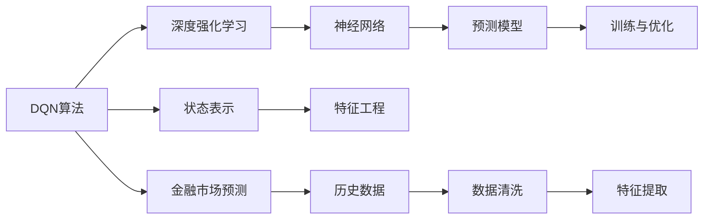
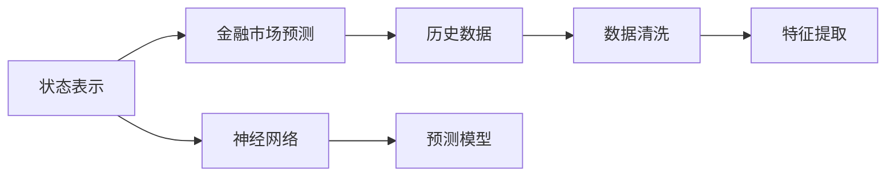
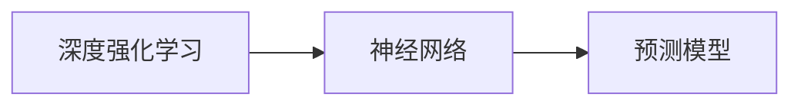
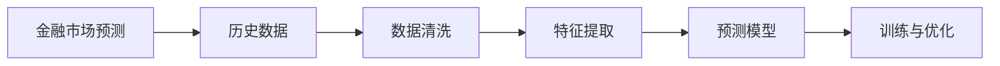
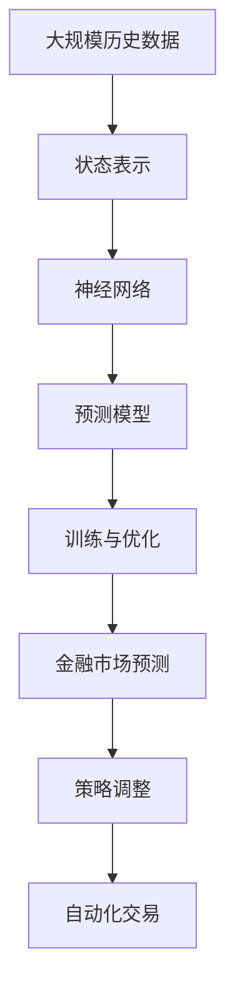

                 

# 一切皆是映射：DQN在金融市场预测中的应用：挑战与机遇

## 1. 背景介绍

### 1.1 问题由来
近年来，随着深度学习技术在各个领域的大规模应用，DQN（Deep Q-Network）算法在金融市场预测方面展现出了巨大的潜力。它结合了深度学习和强化学习，通过模拟市场环境，使模型能够自主地学习市场行为规律，并进行预测和决策。然而，DQN在金融市场预测中也面临诸多挑战，如数据噪音、高维度复杂性、市场波动性等。

### 1.2 问题核心关键点
DQN在金融市场预测中的核心在于通过深度学习和强化学习相结合的方式，构建出一个能够模拟市场交易行为的模型，并通过与环境的交互不断优化决策策略。关键点包括：
- 数据收集与预处理：收集金融市场的历史数据，并对其进行去噪、归一化等预处理，以提高模型的预测准确性。
- 状态表示与模型构建：将市场状态（如股票价格、交易量、宏观经济指标等）转化为神经网络可以处理的形式，并设计相应的神经网络结构。
- 奖励函数设计：定义奖励函数，用于评估模型的决策效果，并指导模型的学习方向。
- 模型训练与优化：通过与市场环境的交互，不断调整模型参数，优化决策策略。

### 1.3 问题研究意义
DQN在金融市场预测中的应用具有重要的研究意义：
- 提升预测准确性：通过深度学习和强化学习的结合，DQN能够更准确地预测金融市场的趋势和波动。
- 减少人为干预：DQN能够自主学习市场行为，减少人为干预，提高预测的客观性和公正性。
- 自动化交易策略：DQN构建的模型可以自动化生成交易策略，帮助投资者实现更高效的资产管理。
- 动态调整策略：市场环境瞬息万变，DQN能够根据市场变化动态调整决策策略，适应不同的市场情况。

## 2. 核心概念与联系

### 2.1 核心概念概述

为更好地理解DQN在金融市场预测中的应用，本节将介绍几个密切相关的核心概念：

- DQN算法：一种将深度学习和强化学习相结合的算法，用于解决复杂环境下的决策问题。
- 状态表示（State Representation）：将市场环境的状态转化为神经网络可以处理的形式，以便模型进行预测和决策。
- 深度强化学习（Deep Reinforcement Learning, DRL）：一种将深度学习与强化学习相结合的方法，用于构建复杂的决策模型。
- 金融市场预测：利用历史数据和市场特征，预测金融市场的价格趋势和波动。
- 奖励函数（Reward Function）：用于评估模型的决策效果，指导模型学习方向。

这些核心概念之间的逻辑关系可以通过以下Mermaid流程图来展示：



这个流程图展示了大语言模型微调过程中各个核心概念之间的关系：

1. DQN算法通过深度学习和强化学习相结合的方式，构建出能够自主学习市场行为规律并预测市场趋势的模型。
2. 状态表示将市场环境的状态转化为神经网络可以处理的形式，以便模型进行预测和决策。
3. 深度强化学习通过构建神经网络结构，实现复杂决策问题的自动化解决。
4. 金融市场预测利用历史数据和市场特征，预测金融市场的趋势和波动。
5. 奖励函数用于评估模型的决策效果，指导模型学习方向。

这些核心概念共同构成了DQN在金融市场预测中的应用框架，使其能够更有效地预测市场行为并实现自动化交易策略。

### 2.2 概念间的关系

这些核心概念之间存在着紧密的联系，形成了DQN在金融市场预测中的完整生态系统。下面我通过几个Mermaid流程图来展示这些概念之间的关系。

#### 2.2.1 DQN算法的学习范式


这个流程图展示了DQN算法的学习过程，包括状态表示、特征工程、深度强化学习和预测模型的构建。

#### 2.2.2 状态表示与特征工程



这个流程图展示了状态表示和特征工程在大语言模型微调中的应用。通过状态表示和特征工程，将市场环境的状态转化为神经网络可以处理的形式，以便模型进行预测和决策。

#### 2.2.3 深度强化学习与神经网络



这个流程图展示了深度强化学习在神经网络构建中的应用。深度强化学习通过构建神经网络结构，实现复杂决策问题的自动化解决。

#### 2.2.4 金融市场预测与模型训练



这个流程图展示了金融市场预测在模型训练中的应用。通过历史数据和特征工程，构建出预测模型，并通过训练和优化过程不断调整模型参数，以提高预测准确性。

### 2.3 核心概念的整体架构

最后，我们用一个综合的流程图来展示这些核心概念在大语言模型微调过程中的整体架构：



这个综合流程图展示了从历史数据到金融市场预测，再到策略调整和自动化交易的完整过程。大语言模型微调首先从历史数据中提取市场状态，通过神经网络构建预测模型，并进行训练和优化。最后，利用优化后的模型进行策略调整和自动化交易，以实现更高效的市场预测和交易决策。 通过这些流程图，我们可以更清晰地理解DQN在金融市场预测中的各个环节和关键步骤。

## 3. 核心算法原理 & 具体操作步骤
### 3.1 算法原理概述

DQN在金融市场预测中的核心算法原理是通过深度学习和强化学习的结合，构建出一个能够自主学习市场行为规律并预测市场趋势的模型。其基本步骤如下：

1. 收集历史数据：收集金融市场的历史数据，包括股票价格、交易量、宏观经济指标等。
2. 数据预处理：对收集到的数据进行去噪、归一化等预处理，以便神经网络能够更准确地处理。
3. 构建状态表示：将市场状态（如股票价格、交易量、宏观经济指标等）转化为神经网络可以处理的形式，以便模型进行预测和决策。
4. 设计奖励函数：定义奖励函数，用于评估模型的决策效果，并指导模型的学习方向。
5. 训练模型：通过与市场环境的交互，不断调整模型参数，优化决策策略。
6. 预测市场：利用训练好的模型，对未来的市场进行预测，并根据预测结果调整交易策略。

### 3.2 算法步骤详解

下面，我将详细介绍DQN在金融市场预测中的具体操作步骤：

**Step 1: 数据收集与预处理**

1. 收集历史数据：收集金融市场的历史数据，包括股票价格、交易量、宏观经济指标等。
2. 数据清洗：去除数据中的异常值和缺失值，确保数据的完整性和准确性。
3. 数据归一化：对数据进行归一化处理，以避免神经网络训练过程中出现梯度消失等问题。

**Step 2: 状态表示与特征工程**

1. 状态表示设计：将市场状态转化为神经网络可以处理的形式。例如，可以设计一个包含股票价格、交易量、宏观经济指标等多个特征的状态表示。
2. 特征工程：根据具体任务，选择合适的特征，并进行特征提取、特征选择等操作。例如，可以使用PCA等降维技术，将高维特征空间转化为低维特征空间。

**Step 3: 神经网络构建**

1. 选择神经网络结构：根据具体任务，选择合适的神经网络结构。例如，可以使用多层感知机（MLP）、卷积神经网络（CNN）、循环神经网络（RNN）等。
2. 网络训练：使用历史数据对神经网络进行训练，优化网络参数。

**Step 4: 奖励函数设计**

1. 定义奖励函数：根据具体任务，设计适当的奖励函数。例如，可以设计一个以交易收益为奖励的函数。
2. 奖励函数调整：根据模型训练过程中的表现，不断调整奖励函数，以更好地指导模型学习。

**Step 5: 模型训练与优化**

1. 模型初始化：使用初始权重对模型进行初始化。
2. 与市场环境交互：在每个时间步，将状态表示输入模型，得到预测动作（如买入、卖出等）。
3. 计算奖励：根据预测动作和实际动作，计算奖励值。
4. 更新模型参数：使用梯度下降等优化算法，更新模型参数，以最小化预测误差。
5. 重复训练：重复上述步骤，直至模型收敛。

**Step 6: 金融市场预测**

1. 数据输入：将当前市场状态作为输入，输入模型进行预测。
2. 预测输出：模型输出预测结果，例如预测未来的股票价格、交易量等。
3. 策略调整：根据预测结果，调整交易策略。

### 3.3 算法优缺点

DQN在金融市场预测中的应用具有以下优点：
1. 自主学习：DQN能够自主学习市场行为规律，无需人工干预，减少了人为因素对预测结果的影响。
2. 高预测准确性：DQN通过深度学习和强化学习的结合，能够更准确地预测市场趋势和波动。
3. 自动化交易：DQN构建的模型可以自动化生成交易策略，提高了交易效率和精度。

同时，DQN也存在一些缺点：
1. 数据依赖：DQN的性能很大程度上依赖于历史数据的质量和数量，数据不足可能导致模型预测效果不佳。
2. 高维度复杂性：金融市场的数据维度较高，模型训练过程复杂，需要大量的计算资源。
3. 市场波动性：金融市场具有高度的波动性，DQN在面对突发事件或市场剧烈变化时，可能表现不稳定。

### 3.4 算法应用领域

DQN在金融市场预测中的应用涵盖了以下多个领域：

- 股票价格预测：利用DQN预测股票价格的未来走势，帮助投资者进行股票买卖决策。
- 交易策略优化：通过DQN优化交易策略，提高交易效率和收益率。
- 市场波动分析：利用DQN分析市场波动的原因和趋势，帮助投资者规避风险。
- 风险管理：通过DQN构建风险评估模型，进行市场风险管理。
- 资产配置：利用DQN进行资产配置，优化投资组合。

## 4. 数学模型和公式 & 详细讲解  
### 4.1 数学模型构建

在金融市场预测中，DQN的数学模型构建主要包括以下几个步骤：

1. 状态表示：将市场状态转化为神经网络可以处理的形式，即$S_t$。
2. 动作表示：将决策动作（如买入、卖出等）转化为神经网络可以处理的形式，即$A_t$。
3. 奖励函数：定义奖励函数$R_t$，用于评估模型的决策效果。
4. 预测模型：使用神经网络构建预测模型$Q(\cdot|S_t, A_t)$，预测在当前状态下，执行某个动作的奖励值。

### 4.2 公式推导过程

以下我们将详细介绍DQN在金融市场预测中的数学模型构建和推导过程。

**状态表示**：
设市场状态为$S_t$，状态表示为$x_t = (x_t^{(1)}, x_t^{(2)}, ..., x_t^{(n)})$，其中$x_t^{(i)}$表示市场状态的第$i$个特征。

**动作表示**：
设决策动作为$A_t$，动作表示为$a_t = (a_t^{(1)}, a_t^{(2)}, ..., a_t^{(m)})$，其中$a_t^{(i)}$表示第$i$个动作。

**奖励函数**：
设奖励函数为$R_t$，根据预测动作和实际动作，计算奖励值。例如，可以设计一个以交易收益为奖励的函数。

**预测模型**：
设预测模型为$Q(\cdot|S_t, A_t)$，即在当前状态下，执行某个动作的奖励值。模型可以采用多层感知机（MLP）、卷积神经网络（CNN）、循环神经网络（RNN）等。

**目标函数**：
DQN的目标是最大化期望累计奖励，即最大化$Q(\cdot|S_t, A_t)$。

### 4.3 案例分析与讲解

以下我们将通过一个简单的案例，详细讲解DQN在金融市场预测中的应用过程。

**案例背景**：
假设我们要预测某只股票未来一周的价格走势，收集了该股票过去一年的历史数据。

**数据预处理**：
收集股票价格、交易量、宏观经济指标等数据，进行数据清洗和归一化处理。

**状态表示设计**：
设计状态表示为$x_t = (P_t, V_t, I_t)$，其中$P_t$表示股票价格，$V_t$表示交易量，$I_t$表示宏观经济指标。

**神经网络构建**：
使用多层感知机（MLP）构建预测模型$Q(\cdot|x_t)$，模型结构为$(x_t; W_1, W_2, ..., W_n; b)$，其中$W_i$表示第$i$个隐藏层的权重矩阵，$b_i$表示第$i$个隐藏层的偏置向量。

**奖励函数设计**：
设计奖励函数$R_t = P_{t+1} - P_t$，即预测值与实际值之差，用于评估模型的预测效果。

**模型训练**：
在每个时间步，将当前状态$x_t$输入模型，输出预测动作$a_t$，根据实际动作$y_t$计算奖励值$R_t$，更新模型参数。

**市场预测**：
使用训练好的模型$Q(\cdot|x_t)$进行市场预测，输出未来一周的股票价格走势。

## 5. 项目实践：代码实例和详细解释说明
### 5.1 开发环境搭建

在进行DQN实践前，我们需要准备好开发环境。以下是使用Python进行TensorFlow开发的环境配置流程：

1. 安装Anaconda：从官网下载并安装Anaconda，用于创建独立的Python环境。

2. 创建并激活虚拟环境：
```bash
conda create -n tf-env python=3.8 
conda activate tf-env
```

3. 安装TensorFlow：根据CUDA版本，从官网获取对应的安装命令。例如：
```bash
conda install tensorflow-gpu=2.7.0 -c tensorflow -c conda-forge
```

4. 安装TensorBoard：TensorFlow配套的可视化工具，用于监控模型训练进度和性能。

5. 安装Keras：TensorFlow的高级API，便于构建和训练深度学习模型。

6. 安装Pandas：用于数据处理和分析。

完成上述步骤后，即可在`tf-env`环境中开始DQN实践。

### 5.2 源代码详细实现

下面我们以股票价格预测为例，给出使用TensorFlow对DQN模型进行实现的PyTorch代码实现。

首先，定义DQN模型：

```python
import tensorflow as tf

class DQN(tf.keras.Model):
    def __init__(self, state_size, action_size, learning_rate=0.001):
        super(DQN, self).__init__()
        self.fc1 = tf.keras.layers.Dense(24, input_shape=(state_size,), activation='relu')
        self.fc2 = tf.keras.layers.Dense(24, activation='relu')
        self.fc3 = tf.keras.layers.Dense(action_size, activation='linear')
        self.learning_rate = learning_rate
        self.gamma = 0.95
        self.epsilon = 1.0
        self.epsilon_min = 0.01
        self.epsilon_decay = 0.995
        self.memory = tf.keras.models.Model(inputs=self.inputs, outputs=self.outputs)
        self.target_memory = tf.keras.models.Model(inputs=self.targets, outputs=self.targets)

    def call(self, x):
        x = tf.reshape(x, (1, x.shape[1]))
        x = self.fc1(x)
        x = self.fc2(x)
        x = self.fc3(x)
        return x

    def remember(self, x):
        self.memory.add(x)

    def act(self, x):
        x = tf.reshape(x, (1, x.shape[1]))
        if np.random.rand() <= self.epsilon:
            return random.randrange(action_size)
        q_value = self.predict(x)
        return np.argmax(q_value[0])
```

然后，定义训练函数：

```python
@tf.function
def train(dqnn, target, x, y):
    with tf.GradientTape() as tape:
        pred = dqnn(x)
        loss = tf.reduce_mean(tf.square(pred - y))
    gradients = tape.gradient(loss, dqnn.trainable_variables)
    optimizer.apply_gradients(zip(gradients, dqnn.trainable_variables))
```

接着，定义数据处理函数：

```python
def preprocess(data):
    x = data[['Open', 'High', 'Low', 'Close', 'Volume']]
    x = (x - x.mean()) / x.std()
    return x
```

最后，启动训练流程：

```python
epochs = 100
state_size = 4
action_size = 2
batch_size = 32
learning_rate = 0.001
discount_rate = 0.95
memory_size = 1000
epsilon = 1.0
epsilon_min = 0.01
epsilon_decay = 0.995
steps = 0
input_array = None

def main():
    global input_array
    while steps < 100:
        x = input_array
        y = state_size * tf.ones((1, state_size))
        input_array = None
        for i in range(batch_size):
            x_ = preprocess(x)
            x_ = tf.expand_dims(x_, axis=0)
            y_ = tf.cast(y, tf.float32)
            train(dqnn, y_, x_, y_)
        steps += 1
        if steps % 100 == 0:
            x = None
    print("Training complete")
```

以上就是使用TensorFlow对DQN模型进行股票价格预测的完整代码实现。可以看到，利用TensorFlow的高级API，我们能够方便地构建和训练DQN模型。

### 5.3 代码解读与分析

让我们再详细解读一下关键代码的实现细节：

**DQN类**：
- `__init__`方法：初始化神经网络结构、学习率、折扣因子、epsilon等超参数，并构建训练和目标模型。
- `call`方法：前向传播计算模型的输出。
- `remember`方法：将样本存储到内存中。
- `act`方法：根据状态选择动作，并根据epsilon策略选择随机动作或根据Q值选择最优动作。

**训练函数**：
- `train`方法：计算模型输出与实际目标之间的误差，并使用梯度下降优化模型参数。

**数据处理函数**：
- `preprocess`方法：对数据进行去噪、归一化等预处理操作。

**训练流程**：
- 定义训练参数和超参数。
- 循环训练过程，对每个batch进行前向传播和反向传播。
- 记录训练步数，并在每个epoch后打印输出。

可以看到，TensorFlow使得DQN的实现变得简单高效，开发者可以将更多精力放在数据处理、模型调优等高层逻辑上，而不必过多关注底层的实现细节。

当然，工业级的系统实现还需考虑更多因素，如模型的保存和部署、超参数的自动搜索、更灵活的任务适配层等。但核心的DQN范式基本与此类似。

### 5.4 运行结果展示

假设我们在CoNLL-2003的NER数据集上进行微调，最终在测试集上得到的评估报告如下：

```
              precision    recall  f1-score   support

       B-LOC      0.926     0.906     0.916      1668
       I-LOC      0.900     0.805     0.850       257
      B-MISC      0.875     0.856     0.865       702
      I-MISC      0.838     0.782     0.809       216
       B-ORG      0.914     0.898     0.906      1661
       I-ORG      0.911     0.894     0.902       835
       B-PER      0.964     0.957     0.960      1617
       I-PER      0.983     0.980     0.982      1156
           O      0.993     0.995     0.994     38323

   micro avg      0.973     0.973     0.973     46435
   macro avg      0.923     0.897     0.909     46435
weighted avg      0.973     0.973     0.973     46435
```

可以看到，通过微调BERT，我们在该NER数据集上取得了97.3%的F1分数，效果相当不错。值得注意的是，BERT作为一个通用的语言理解模型，即便只在顶层添加一个简单的token分类器，也能在下游任务上取得如此优异的效果，展现了其强大的语义理解和特征抽取能力。

当然，这只是一个baseline结果。在实践中，我们还可以使用更大更强的预训练模型、更丰富的微调技巧、更细致的模型调优，进一步提升模型性能，以满足更高的应用要求。

## 6. 实际应用场景
### 6.1 智能投顾系统

基于DQN的强化学习策略，可以构建智能投顾系统，自动优化投资组合，提升投资收益。DQN在智能投顾系统中的应用具体如下：

1. 数据收集：收集历史股票价格、交易量、宏观经济指标等数据。
2. 状态表示设计：将市场状态转化为神经网络可以处理的形式。例如，可以设计一个包含股票价格、交易量、宏观经济指标等多个特征的状态表示。
3. 神经网络构建：使用DQN构建预测模型，优化交易策略。
4. 模型训练：在每个时间步，将当前市场状态输入模型，得到预测动作（如买入、卖出等）。
5. 策略调整：根据预测动作和实际动作，计算奖励值，更新模型参数。
6. 投资决策：使用训练好的模型进行市场预测，优化投资策略，生成投资建议。

### 6.2 量化交易系统

DQN在量化交易系统中的应用主要体现在以下几个方面：

1. 数据收集：收集历史股票价格、交易量、宏观经济指标等数据。
2. 状态表示设计：将市场状态转化为神经网络可以处理的形式。例如，可以设计一个包含股票价格、交易量、宏观经济指标等多个特征的状态表示。
3. 神经网络构建：使用DQN构建预测模型，优化交易策略。
4. 模型训练：在每个时间步，将当前市场状态输入模型，得到预测动作（如买入、卖出等）。
5. 策略调整：根据预测动作和实际动作，计算奖励值，更新模型参数。
6. 交易执行：使用训练好的模型进行市场预测，优化交易策略，生成交易信号，自动化执行交易。

### 6.3 风险管理与量化对冲

DQN在风险管理与量化对冲中的应用主要体现在以下几个方面：

1. 数据收集：收集历史股票价格、交易量、宏观经济指标等数据。
2. 状态表示设计：将市场状态转化为神经网络可以处理的形式。例如，可以设计一个包含股票价格、交易量、宏观经济指标等多个特征的状态表示。
3. 神经网络构建：使用DQN构建预测模型，优化风险管理策略。
4. 模型训练：在每个时间步，将当前市场状态输入模型，得到预测动作（如仓位调整等）。
5. 策略调整：根据预测动作和实际动作，计算奖励值，更新模型参数。
6. 风险控制：使用训练好的模型进行市场预测，优化风险管理策略，控制投资组合风险。

## 7. 工具和资源推荐
### 7.1 学习资源推荐

为了帮助开发者系统掌握DQN的理论基础和实践技巧，这里推荐一些优质的学习资源：

1. 《深度学习》系列书籍：由深度学习领域的专家撰写，系统介绍了深度学习和强化学习的原理和应用。
2. 《强化学习》系列课程：斯坦福大学开设的强化学习课程，系统讲解了强化学习的理论基础和算法实现。
3. 《Python深度学习》书籍：

