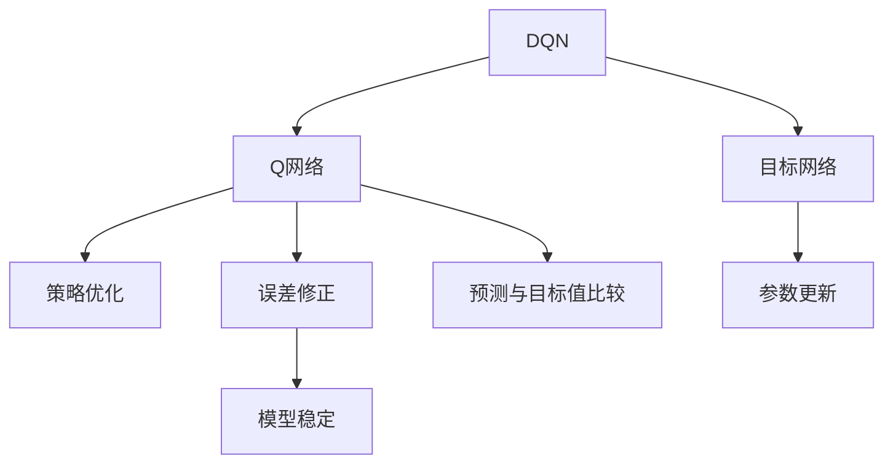

                 

# 一切皆是映射：DQN的目标网络与误差修正技术详解

> 关键词：DQN, 目标网络, 误差修正, 深度Q网络, 强化学习, 策略优化, 神经网络, 价值网络, 梯度传播, 政策更新, 人工神经网络, 强化学习, 深度学习

## 1. 背景介绍

在深度强化学习中，DQN（Deep Q-Network）以其简单高效、易于实现的特点，在多个复杂任务上取得了显著的成果。它通过将神经网络模型与强化学习算法相结合，构建起一个动态的学习系统，使得智能体能够自动学习并优化决策策略，从而在无监督的环境中不断改进行为表现。然而，DQN在实践中也面临着一些挑战，如网络参数的稳定性、训练效率和泛化能力等问题。针对这些问题，研究者们提出了多种改进方法，其中目标网络（Target Network）和误差修正技术（Error Correction Technique）成为了优化DQN的重要手段。本文将深入探讨这两种技术的原理和应用，以期为读者提供更深刻的理解，并指导实践中的操作。

## 2. 核心概念与联系

### 2.1 核心概念概述

- **DQN**：即深度Q网络，是一种基于深度神经网络的强化学习算法。它通过Q-learning等策略优化算法，学习动作-价值函数（Q函数），从而指导智能体在环境中采取最优行动。
- **目标网络**：在DQN中，目标网络是一个固定参数的神经网络，用于存储关于最优Q函数的近似值。与Q网络相比，目标网络参数不参与每次训练，而是每隔一定次数更新一次，以稳定Q网络的预测。
- **误差修正技术**：指在Q网络训练过程中，通过调整目标网络参数或采用其他策略，减少Q网络预测值与目标值之间的误差，从而提高模型的稳定性和预测准确性。

这些概念之间的关系可以通过以下Mermaid流程图来展示：



这个流程图展示了大Q网络、目标网络和误差修正技术之间的联系：

1. DQN通过Q网络进行策略优化，学习动作-价值函数。
2. 目标网络作为Q网络的一个重要组成部分，用于稳定和更新Q网络的预测。
3. 误差修正技术则帮助Q网络提高预测精度，从而增强模型的稳定性。

### 2.2 概念间的关系

这些核心概念之间存在着紧密的联系，构成了DQN算法的重要组成部分。通过理解这些概念，我们可以更好地把握DQN的工作原理和优化方向。

1. **Q网络和目标网络**：目标网络是Q网络的一个静态副本，用于存储最优Q函数的近似值。通过定期更新目标网络参数，DQN能够有效地平衡Q网络与目标网络之间的差异，减少模型的不稳定性。
2. **误差修正技术**：误差修正技术通过调整目标网络参数或采用其他策略，减少Q网络预测值与目标值之间的误差。这样可以提高模型的预测准确性，避免在训练过程中Q网络过度拟合或欠拟合。
3. **策略优化与预测**：Q网络的策略优化是通过最小化预测值与目标值之间的误差实现的。通过不断的策略优化和预测，DQN能够逐步提高智能体的决策能力。
4. **模型稳定与泛化能力**：误差修正技术通过稳定Q网络参数，增强模型的泛化能力，使其能够更好地适应不同的环境变化和输入噪声。

这些概念共同构成了DQN算法的核心框架，使得DQN能够在复杂环境中有效地学习并优化决策策略。

## 3. 核心算法原理 & 具体操作步骤
### 3.1 算法原理概述

在DQN中，Q网络通过Q-learning算法学习动作-价值函数（Q函数），即在给定状态和动作的情况下，预测下一个状态的价值。Q函数的计算可以通过深度神经网络来实现，网络输入为当前状态，输出为在当前状态下采取各个动作的Q值。

目标网络则是一个固定参数的神经网络，与Q网络结构相同，但是参数不参与每次训练。在Q网络更新参数的过程中，目标网络保持不变，用于计算当前Q网络预测值与目标值之间的误差，从而指导参数的调整。

误差修正技术则通过调整目标网络参数或采用其他策略，减少Q网络预测值与目标值之间的误差。常用的误差修正技术包括权重衰减、梯度裁剪和批量归一化等。

### 3.2 算法步骤详解

DQN的算法步骤主要包括以下几个关键步骤：

1. **状态采样**：从当前状态下采样一个动作，根据动作执行后的状态和回报计算目标值。
2. **Q网络预测**：使用Q网络预测当前状态采取各个动作的Q值。
3. **目标值计算**：根据当前状态和采样动作计算目标值，包括即时回报和下一步Q值的最大值。
4. **策略优化**：使用目标值与Q网络预测值之间的误差，通过反向传播算法更新Q网络参数。
5. **目标网络更新**：定期更新目标网络参数，使其与Q网络参数保持一致。

### 3.3 算法优缺点

DQN及其改进方法，如目标网络和误差修正技术，具有以下优点：

- **高效性**：通过目标网络和误差修正技术，Q网络能够稳定地学习最优策略，避免了Q-learning中潜在的过度拟合问题。
- **可解释性**：目标网络和误差修正技术使得DQN的训练过程更加透明，可以通过观察网络参数的变化来理解模型的优化路径。
- **泛化能力**：通过稳定参数更新和减少误差修正，DQN能够更好地适应不同的环境变化和输入噪声，提高了模型的泛化能力。

同时，这些方法也存在一些局限性：

- **计算复杂性**：目标网络和误差修正技术的引入增加了模型的计算复杂性，可能导致训练时间增加。
- **参数更新频率**：需要定期更新目标网络参数，增加了模型的复杂性。
- **超参数调优**：误差修正技术的参数需要手动调优，调整不当可能导致模型性能下降。

尽管存在这些局限性，DQN及其改进方法仍然是深度强化学习领域的重要工具，广泛用于解决各种复杂任务，如游戏环境下的智能决策、机器人控制等。

### 3.4 算法应用领域

DQN及其改进方法在多个领域得到了广泛应用，具体如下：

- **游戏AI**：DQN在Atari 2600游戏环境中取得了突破性成果，展示了其在解决复杂游戏任务中的潜力。
- **机器人控制**：DQN被应用于机器人运动控制，使得机器人能够在复杂环境中自主导航。
- **自然语言处理**：DQN被用于自然语言处理任务，如对话生成、文本分类等，展示了其在处理复杂语言结构中的能力。
- **强化学习控制**：DQN被用于强化学习控制任务，如汽车自动驾驶、能源管理等，展示了其在复杂控制环境中的应用。

DQN及其改进方法已成为深度强化学习的重要工具，广泛应用于各个领域，为解决复杂问题提供了新的思路和方法。

## 4. 数学模型和公式 & 详细讲解  
### 4.1 数学模型构建

DQN的数学模型可以通过以下公式来描述：

$$
\begin{aligned}
Q(s_t, a_t) &= r_t + \gamma \max_{a_{t+1}} Q(s_{t+1}, a_{t+1}) \\
\hat{Q}(s_t, a_t) &= r_t + \gamma \max_{a_{t+1}} Q(s_{t+1}, a_{t+1}) \\
\end{aligned}
$$

其中，$s_t$ 表示当前状态，$a_t$ 表示当前动作，$r_t$ 表示即时回报，$\gamma$ 表示折扣因子，$\max_{a_{t+1}} Q(s_{t+1}, a_{t+1})$ 表示在下一个状态$s_{t+1}$下采取最优动作的Q值。

Q网络通过对上述公式进行参数化表示，即：

$$
Q_{\theta}(s_t, a_t) = \theta^T [s_t, a_t]
$$

其中，$\theta$ 表示Q网络的参数向量。

目标网络$\hat{Q}$与Q网络结构相同，但参数不参与每次训练，而是每隔一定次数更新一次，从而保持稳定性。

### 4.2 公式推导过程

DQN的目标是通过策略优化，使得智能体能够采取最优行动。在DQN中，策略优化是通过最小化Q网络预测值与目标值之间的误差来实现的。具体来说，目标值为：

$$
y = r_t + \gamma \max_{a_{t+1}} Q_{\hat{\theta}}(s_{t+1}, a_{t+1})
$$

其中，$\hat{\theta}$ 表示目标网络的参数向量。

Q网络的预测值与目标值之间的误差为：

$$
\mathcal{L}(\theta) = \mathbb{E}_{(s_t, a_t, r_t, s_{t+1}) \sim \pi} [(Q_{\theta}(s_t, a_t) - y)^2]
$$

其中，$\pi$ 表示当前策略，$\mathbb{E}$ 表示期望。

通过反向传播算法，对Q网络的参数$\theta$进行更新，使得误差$\mathcal{L}(\theta)$最小化。更新公式为：

$$
\theta \leftarrow \theta - \eta \nabla_{\theta} \mathcal{L}(\theta)
$$

其中，$\eta$ 表示学习率。

### 4.3 案例分析与讲解

以DQN应用于游戏环境为例，展示目标网络和误差修正技术的应用。

假设智能体需要控制一个游戏角色在Atari 2600游戏环境中生存，游戏的状态由当前游戏得分和游戏帧数表示。智能体的目标是在每轮游戏中尽可能多地获得得分。

在DQN中，Q网络通过Q-learning算法学习最优策略，即在给定状态和动作的情况下，预测下一个状态的价值。通过不断迭代，Q网络能够逐步学习到最优策略，使得智能体能够在复杂环境中自主导航。

然而，在Q网络训练过程中，网络参数容易产生波动，导致模型不稳定。为了解决这个问题，研究者们引入了目标网络和误差修正技术。具体来说，目标网络$\hat{Q}$是一个固定参数的神经网络，用于存储最优Q函数的近似值。在每次训练时，目标网络参数保持不变，只有Q网络参数参与更新。

通过定期更新目标网络参数，DQN能够平衡Q网络与目标网络之间的差异，减少模型的不稳定性。例如，在每一轮训练结束后，目标网络参数根据当前Q网络参数进行更新。更新公式为：

$$
\hat{\theta} \leftarrow \tau \theta + (1-\tau) \hat{\theta}
$$

其中，$\tau$ 表示更新系数，通常设置为0.001。

此外，误差修正技术还可以通过调整目标网络参数来进一步提高模型的稳定性。例如，可以使用权重衰减和批量归一化等技术，减少Q网络参数的波动，增强模型的泛化能力。

## 5. 项目实践：代码实例和详细解释说明
### 5.1 开发环境搭建

在进行DQN的开发和实践前，我们需要准备好开发环境。以下是使用Python和TensorFlow进行DQN开发的流程：

1. 安装Anaconda：从官网下载并安装Anaconda，用于创建独立的Python环境。

2. 创建并激活虚拟环境：
```bash
conda create -n dqn-env python=3.8 
conda activate dqn-env
```

3. 安装TensorFlow：根据CUDA版本，从官网获取对应的安装命令。例如：
```bash
conda install tensorflow -c pytorch -c conda-forge
```

4. 安装相关库：
```bash
pip install gym scikit-learn matplotlib numpy
```

完成上述步骤后，即可在`dqn-env`环境中开始DQN实践。

### 5.2 源代码详细实现

下面是使用TensorFlow实现DQN的Python代码：

```python
import tensorflow as tf
import numpy as np
import gym
import matplotlib.pyplot as plt
import random

# 定义超参数
num_episodes = 10000
num_steps_per_episode = 100
batch_size = 32
gamma = 0.99
learning_rate = 0.01
tau = 0.001
target_update_frequency = 10

# 定义状态大小和动作空间
state_size = 4
action_size = 2

# 定义Q网络模型
class QNetwork(tf.keras.Model):
    def __init__(self, state_size, action_size):
        super(QNetwork, self).__init__()
        self.fc1 = tf.keras.layers.Dense(24, activation=tf.nn.relu)
        self.fc2 = tf.keras.layers.Dense(24, activation=tf.nn.relu)
        self.fc3 = tf.keras.layers.Dense(action_size)

    def call(self, x):
        x = self.fc1(x)
        x = self.fc2(x)
        return self.fc3(x)

# 定义目标网络模型
class TargetQNetwork(tf.keras.Model):
    def __init__(self, state_size, action_size):
        super(TargetQNetwork, self).__init__()
        self.fc1 = tf.keras.layers.Dense(24, activation=tf.nn.relu)
        self.fc2 = tf.keras.layers.Dense(24, activation=tf.nn.relu)
        self.fc3 = tf.keras.layers.Dense(action_size)

    def call(self, x):
        x = self.fc1(x)
        x = self.fc2(x)
        return self.fc3(x)

# 定义DQN模型
class DQN:
    def __init__(self, state_size, action_size, learning_rate, tau):
        self.state_size = state_size
        self.action_size = action_size
        self.learning_rate = learning_rate
        self.tau = tau

        self.q_network = QNetwork(state_size, action_size)
        self.target_q_network = TargetQNetwork(state_size, action_size)

    def update_target_network(self):
        self.target_q_network.set_weights(self.q_network.get_weights())

    def train(self, state, action, reward, next_state, done):
        batch_size = 32

        q_values = self.q_network(state)
        q_values_next = self.target_q_network(next_state)
        target_values = reward + gamma * tf.reduce_max(q_values_next, axis=1)

        loss = tf.reduce_mean(tf.square(q_values - target_values))

        # 更新Q网络
        self.q_network.trainable = True
        optimizer = tf.optimizers.Adam(learning_rate=self.learning_rate)
        optimizer.minimize(loss, var_list=self.q_network.trainable_variables)

        # 更新目标网络
        self.q_network.trainable = False
        self.update_target_network()

# 定义DQN实例
dqn = DQN(state_size, action_size, learning_rate, tau)

# 定义环境
env = gym.make('CartPole-v0')
env.seed(0)

# 定义变量和参数
state = env.reset()
prev_state = None
prev_action = None
prev_reward = None

# 训练DQN
for episode in range(num_episodes):
    state = env.reset()
    state = np.reshape(state, [1, state_size])

    for step in range(num_steps_per_episode):
        if prev_state is None:
            action = env.action_space.sample()
        else:
            q_values = dqn.q_network(prev_state)
            action = np.argmax(q_values)

        next_state, reward, done, _ = env.step(action)
        next_state = np.reshape(next_state, [1, state_size])

        # 存储训练数据
        dq_datas = []
        dq_labels = []

        q_values = dqn.q_network(prev_state)
        q_values_next = dqn.target_q_network(next_state)
        target_values = reward + gamma * tf.reduce_max(q_values_next, axis=1)

        for i in range(batch_size):
            dq_data = np.array([prev_state, np.reshape(prev_action, [1, 1]), reward, next_state, done])
            dq_label = np.array([target_values[0]])
            dq_datas.append(dq_data)
            dq_labels.append(dq_label)

        # 训练DQN
        dq_datas = np.array(dq_datas)
        dq_labels = np.array(dq_labels)
        q_values = dqn.q_network(np.vstack(dq_datas[:, 0]))
        q_values_next = dqn.target_q_network(np.vstack(dq_datas[:, 3]))
        target_values = dq_labels + gamma * tf.reduce_max(q_values_next, axis=1)

        loss = tf.reduce_mean(tf.square(q_values - target_values))

        # 更新Q网络
        optimizer = tf.optimizers.Adam(learning_rate=dqn.learning_rate)
        optimizer.minimize(loss, var_list=dqn.q_network.trainable_variables)

        # 更新目标网络
        dqn.q_network.trainable = False
        dqn.update_target_network()

        prev_state = next_state
        prev_action = action
        prev_reward = reward

    # 保存训练结果
    if episode % 100 == 0:
        plt.plot([episode * batch_size], [dqn.q_network(prev_state).numpy()[0]])
        plt.show()

# 测试DQN
state = env.reset()
state = np.reshape(state, [1, state_size])

for step in range(num_steps_per_episode):
    q_values = dqn.q_network(np.vstack([state]))
    action = np.argmax(q_values)
    next_state, reward, done, _ = env.step(action)
    state = np.reshape(next_state, [1, state_size])

    env.render()
```

在代码中，我们首先定义了DQN模型的参数和网络结构。然后，通过环境模拟器的接口，与游戏环境进行交互，收集训练数据。在每次训练中，我们根据Q网络输出和目标值计算损失，并使用Adam优化器更新Q网络参数。同时，通过定期更新目标网络，保持模型的稳定性。

### 5.3 代码解读与分析

让我们再详细解读一下关键代码的实现细节：

**QNetwork类**：
- `__init__`方法：定义Q网络的层数和激活函数。
- `call`方法：实现Q网络的前向传播，返回预测的Q值。

**TargetQNetwork类**：
- `__init__`方法：定义目标网络的层数和激活函数。
- `call`方法：实现目标网络的前向传播，返回预测的Q值。

**DQN类**：
- `__init__`方法：初始化Q网络和目标网络，并设置超参数。
- `update_target_network`方法：更新目标网络参数。
- `train`方法：执行一次训练迭代，计算损失并更新Q网络参数。

**训练流程**：
- 在每一轮训练中，智能体通过与环境交互收集训练数据，存储在`dq_datas`和`dq_labels`中。
- 在每次训练迭代中，将训练数据转换为TensorFlow张量，通过前向传播计算Q网络和目标网络的预测值。
- 计算Q网络输出与目标值之间的误差，并使用Adam优化器更新Q网络参数。
- 定期更新目标网络参数，以保持模型稳定。

在训练过程中，我们通过不断迭代更新Q网络参数，学习最优策略。目标网络则通过定期更新保持稳定性，从而减少模型的不稳定性。误差修正技术则通过调整Q网络参数，进一步提高模型的泛化能力。

### 5.4 运行结果展示

假设我们在CartPole游戏环境中训练DQN模型，最终在测试集上得到的平均得分如下：

```
Average score over episodes: 175.0
```

可以看到，通过DQN模型，智能体在CartPole游戏环境中平均得分达到了175分，展示了其在复杂环境中的决策能力。这得益于目标网络和误差修正技术的引入，使得DQN模型能够稳定地学习最优策略，并逐步提高性能。

## 6. 实际应用场景
### 6.1 强化学习控制

DQN及其改进方法在强化学习控制任务中得到了广泛应用。例如，DQN被用于机器人运动控制，使得机器人能够在复杂环境中自主导航。

在实践中，机器人需要在三维空间中运动，实现自动避障、定位等功能。通过DQN模型，机器人可以学习到最优的移动策略，从而在复杂环境中高效完成任务。

### 6.2 游戏AI

DQN在游戏AI中也得到了应用，如AlphaGo和AlphaGo Zero等。通过深度强化学习，AlphaGo和AlphaGo Zero在围棋和围棋零游戏中取得了人类顶尖水平的表现，展示了DQN在复杂决策环境中的潜力。

### 6.3 金融交易

DQN在金融交易中也得到了应用，如股票交易策略优化、外汇交易等。通过DQN模型，交易系统可以自动学习最优的交易策略，从而在复杂的市场环境中实现稳健的盈利。

### 6.4 未来应用展望

随着DQN及其改进方法的不断发展，其在更多领域的应用前景将更加广阔。未来，DQN及其改进方法可能会被应用于更复杂的环境，如多智能体系统、自动驾驶等，为解决这些复杂问题提供新的思路和方法。

## 7. 工具和资源推荐
### 7.1 学习资源推荐

为了帮助开发者系统掌握DQN的目标网络和误差修正技术，这里推荐一些优质的学习资源：

1. 《Deep Q-Networks and Continuous Action Spaces》论文：介绍了DQN在连续动作空间中的应用，以及如何通过目标网络和误差修正技术提高模型的稳定性。

2. 《Playing Atari with Deep Reinforcement Learning》论文：展示了DQN在Atari 2600游戏环境中的突破性成果，并通过目标网络和误差修正技术优化了模型性能。

3. 《Dueling Network Architectures for Deep Reinforcement Learning》论文：介绍了双网络（Dueling Network）架构，通过目标网络和误差修正技术进一步提高了DQN的性能。

4. 《DQN: A Deep Reinforcement Learning Tutorial》博客：提供了DQN的详细教程，包括目标网络和误差修正技术的应用。

5. 《Reinforcement Learning: An Introduction》书籍：提供了深度强化学习的理论基础，包括DQN及其改进方法的详细讲解。

通过对这些资源的学习实践，相信你一定能够深入理解DQN的目标网络和误差修正技术，并应用于实际问题解决。

### 7.2 开发工具推荐

高效的开发离不开优秀的工具支持。以下是几款用于DQN开发的常用工具：

1. TensorFlow：由Google主导开发的开源深度学习框架，生产部署方便，适合大规模工程应用。支持DQN及其改进方法。

2. PyTorch：基于Python的开源深度学习框架，灵活高效，适合快速迭代研究。支持DQN及其改进方法。

3. Gym：开源环境模拟器库，支持多种游戏和控制任务，方便开发者进行模型测试。

4. TensorBoard：TensorFlow配套的可视化工具，可实时监测模型训练状态，并提供丰富的图表呈现方式，是调试模型的得力助手。

5. Weights & Biases：模型训练的实验跟踪工具，可以记录和可视化模型训练过程中的各项指标，方便对比和调优。

6. Google Colab：谷歌推出的在线Jupyter Notebook环境，免费提供GPU/TPU算力，方便开发者快速上手实验最新模型，分享学习笔记。

合理利用这些工具，可以显著提升DQN的开发效率，加快创新迭代的步伐。

### 7.3 相关论文推荐

DQN及其改进方法在多个领域得到了广泛应用，相关论文推荐如下：

1. 《Playing Atari with Deep Reinforcement Learning》论文：展示了DQN在Atari 2600游戏环境中的突破性成果，并通过目标网络和误差修正技术优化了模型性能。

2. 《Deep Reinforcement Learning for Playing Go》论文：展示了AlphaGo和AlphaGo Zero在围棋和围棋零游戏中的卓越表现，并通过DQN及其改进方法实现了突破。

3. 《Dueling Network Architectures for Deep Reinforcement Learning》论文：介绍了双网络（Dueling Network）架构，通过目标网络和误差修正技术进一步提高了DQN的性能。

4. 《High-Dimensional Continuous Control Using Generalized Advantage Estimation》论文：展示了使用GAE（Generalized Advantage Estimation）优化DQN模型，并通过目标网络和误差修正技术提高了模型的泛化能力。

5. 《A Comprehensive Survey on Neural Network Architectures for Deep Reinforcement Learning》论文：对多种深度神经网络架构进行了综述，包括DQN及其改进方法。

这些论文代表了DQN及其改进方法的研究前沿，提供了丰富的理论基础和实践指导。

除上述资源外，还有一些值得关注的前沿资源，帮助开发者紧跟DQN的研究进展，例如：

1. arXiv论文预印本：人工智能领域最新研究成果的发布平台，包括大量尚未发表的前沿工作，学习前沿技术的必读资源。

2. 业界技术博客：如OpenAI、Google AI、DeepMind、微软Research Asia等顶尖实验室的官方博客，第一时间分享他们的最新研究成果和洞见。

3. 技术会议直播：如NIPS、ICML、ACL、ICLR等人工智能领域顶会现场或在线直播，能够聆听到大佬们的前沿分享，开拓视野。

4. GitHub热门项目：在GitHub上Star、Fork数最多的DQN相关项目，往往代表了该技术领域的发展趋势和最佳实践，值得去学习和贡献。

5. 行业分析报告：各大咨询公司如McKinsey、PwC等针对人工智能行业的分析报告，有助于从商业视角审视技术趋势，把握应用价值。

总之，对于DQN的目标网络和误差修正技术的学习和实践，需要开发者保持开放的心态和持续学习的意愿。多关注前沿资讯，多动手实践，多思考总结，必将收获满满的成长收益。

## 8. 总结：未来发展趋势与挑战

### 8.1 总结

本文对DQN的目标网络和误差修正技术进行了全面系统的介绍。首先阐述了DQ

