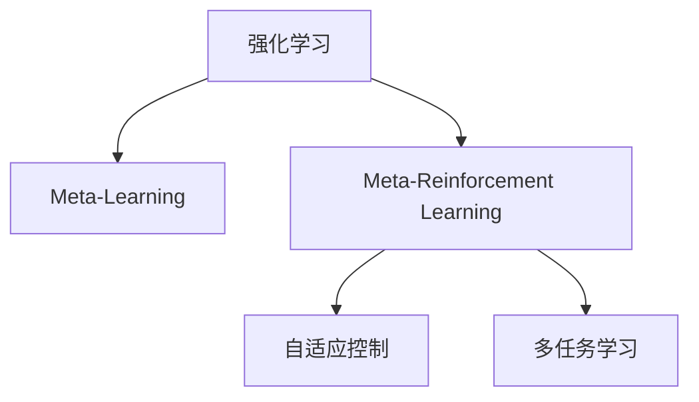
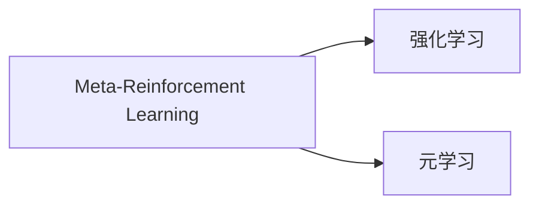
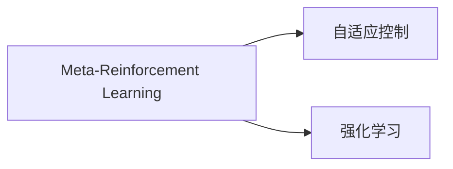
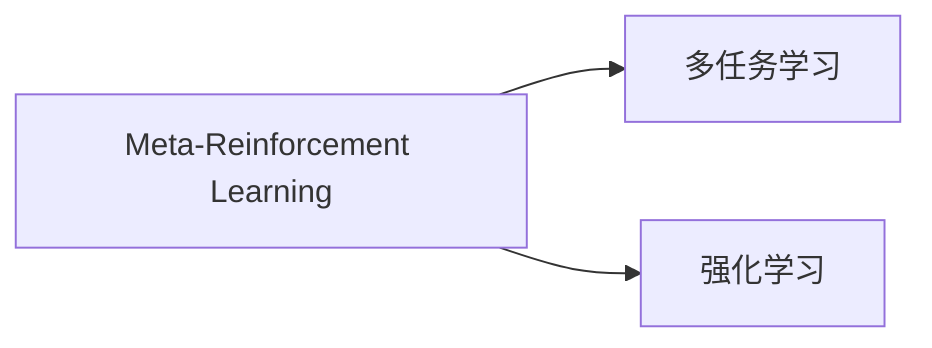
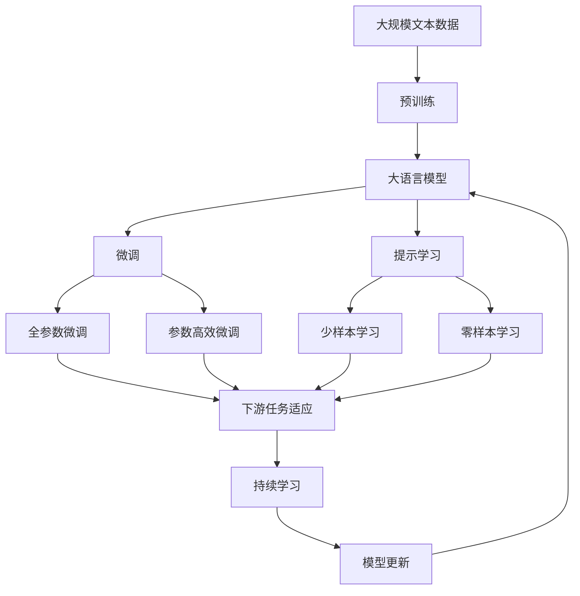

                 

# 一切皆是映射：Meta-Reinforcement Learning的实战教程

## 1. 背景介绍

### 1.1 问题由来

Meta-Reinforcement Learning（元强化学习）是一种致力于提升智能体在多种不同环境中适应性的研究领域。它关注于利用强化学习技术，从一组已知环境中学习经验，从而更快速、更有效地适应新环境。这一研究方向源于机器人学习、自适应控制、游戏AI等实际应用中的迫切需求，近年来随着深度学习技术的发展，该领域获得了极大的关注。

### 1.2 问题核心关键点

Meta-Reinforcement Learning的核心目标是在有限的训练样本中，使智能体能够更快地适应新任务，提升其泛化能力和适应性。其关键技术包括：
1. **经验重用**：通过利用历史环境经验，加速新环境中的学习。
2. **迁移学习**：在不同环境之间迁移知识和技能。
3. **多任务学习**：同时训练多个任务，共享公共特征。
4. **自适应优化**：动态调整学习策略，以适应不同的环境变化。

### 1.3 问题研究意义

Meta-Reinforcement Learning在提升智能体的适应性和泛化能力方面具有重要意义，其研究成果能够广泛应用于机器人控制、游戏AI、自然语言处理、金融交易等领域，为解决复杂的多任务学习和适应性问题提供了新的思路和方法。它能够帮助开发者更高效地构建智能系统，提升系统的鲁棒性和可扩展性，具有广泛的应用前景。

## 2. 核心概念与联系

### 2.1 核心概念概述

为更好地理解Meta-Reinforcement Learning，本节将介绍几个关键概念及其相互关系：

- **强化学习（Reinforcement Learning, RL）**：一种通过试错和奖励机制学习最优行为策略的机器学习技术，常用于决策制定、自动控制等领域。
- **元学习（Meta-Learning）**：一种从少量样本中学习新任务的方法，通过学习模式和结构，快速适应新问题。
- **Meta-Reinforcement Learning**：结合强化学习和元学习的技术，旨在通过少量环境数据，快速适应和解决新环境下的任务。
- **自适应控制（Adaptive Control）**：通过不断调整控制策略，以适应动态和不确定环境的技术。
- **多任务学习（Multi-task Learning）**：同时训练多个相关任务，共享特征以提升泛化能力。

这些概念之间的逻辑关系可以通过以下Mermaid流程图来展示：



这个流程图展示了Meta-Reinforcement Learning的核心概念及其相互关系：

1. Meta-Reinforcement Learning结合了强化学习和元学习，通过少量环境数据，快速适应新任务。
2. Meta-Reinforcement Learning利用自适应控制和多任务学习技术，进一步提升智能体的适应性和泛化能力。

### 2.2 概念间的关系

这些核心概念之间存在紧密的联系，形成了Meta-Reinforcement Learning的完整生态系统。下面通过几个Mermaid流程图来展示这些概念之间的关系：

#### 2.2.1 Meta-Reinforcement Learning与强化学习的关系



这个流程图展示了Meta-Reinforcement Learning与强化学习的关系：Meta-Reinforcement Learning在强化学习的基础上，引入元学习机制，通过利用历史环境经验，加速新环境中的学习。

#### 2.2.2 Meta-Reinforcement Learning与自适应控制的关系



这个流程图展示了Meta-Reinforcement Learning与自适应控制的关系：Meta-Reinforcement Learning利用自适应控制技术，动态调整学习策略，以适应不同的环境变化，提升智能体的适应性。

#### 2.2.3 Meta-Reinforcement Learning与多任务学习的关系



这个流程图展示了Meta-Reinforcement Learning与多任务学习的关系：Meta-Reinforcement Learning通过多任务学习，共享公共特征，同时训练多个相关任务，提升泛化能力。

### 2.3 核心概念的整体架构

最后，我们用一个综合的流程图来展示这些核心概念在大语言模型微调过程中的整体架构：



这个综合流程图展示了从预训练到微调，再到持续学习的完整过程。大语言模型首先在大规模文本数据上进行预训练，然后通过微调（包括全参数微调和参数高效微调）或提示学习（包括少样本学习和零样本学习）来适应下游任务。最后，通过持续学习技术，模型可以不断更新和适应新的任务和数据。 通过这些流程图，我们可以更清晰地理解Meta-Reinforcement Learning在大语言模型微调过程中各个核心概念的关系和作用。

## 3. 核心算法原理 & 具体操作步骤

### 3.1 算法原理概述

Meta-Reinforcement Learning的核心在于通过强化学习的试错机制，结合元学习的经验重用机制，快速适应新任务。其主要思想是从一组已知环境中学习经验和策略，然后将这些经验应用于新环境中的任务。

形式化地，假设存在一组已知环境 $E_1, E_2, ..., E_k$，每个环境由状态空间 $S$ 和动作空间 $A$ 定义，每个环境 $E_i$ 的任务是找到最优策略 $\pi_i$，最大化总奖励 $R_i$。目标是学习到一种通用的策略 $\pi$，使其能够适应任意新环境 $E'$。具体步骤如下：

1. 在已知环境 $E_1, E_2, ..., E_k$ 上，对每个环境 $E_i$ 进行强化学习，找到最优策略 $\pi_i$。
2. 通过元学习，将 $\pi_i$ 映射为 $\pi$，使得 $\pi$ 能够在任意新环境 $E'$ 中表现良好。
3. 在新环境 $E'$ 中，使用 $\pi$ 进行策略优化，找到最优策略 $\pi'$，最大化总奖励 $R'$。

### 3.2 算法步骤详解

Meta-Reinforcement Learning的算法步骤主要包括以下几个关键步骤：

**Step 1: 准备已知环境**

- 收集一组已知环境 $E_1, E_2, ..., E_k$ 的数据，包括状态、动作、奖励等。
- 对于每个环境，设计合适的状态表示方法，如将状态编码为向量表示。

**Step 2: 强化学习**

- 在每个已知环境 $E_i$ 上，使用强化学习算法（如DQN、SAC等）找到最优策略 $\pi_i$。
- 使用合适的探索策略（如$\epsilon$-贪心策略），确保智能体能够探索足够多的状态和动作。

**Step 3: 元学习**

- 通过元学习算法（如MAML、REINFORCE等），将每个环境 $E_i$ 的最优策略 $\pi_i$ 映射为全局策略 $\pi$。
- 设计合适的元损失函数，如均方误差、KL散度等，度量不同策略之间的相似度。

**Step 4: 策略优化**

- 在新环境 $E'$ 中，使用 $\pi$ 进行策略优化，找到最优策略 $\pi'$。
- 设计合适的奖励函数 $R'$，确保智能体在新环境中的行为能够最大化总奖励。

**Step 5: 策略评估**

- 使用评估指标（如返回率、成功率等）评估策略 $\pi'$ 在新环境 $E'$ 中的表现。
- 根据评估结果，调整元学习算法和强化学习算法，进一步优化策略 $\pi'$。

### 3.3 算法优缺点

Meta-Reinforcement Learning的优点在于：
1. 快速适应新环境：通过利用历史经验，加速新环境中的学习。
2. 泛化能力强：通过多任务学习，智能体能够更好地应对新任务。
3. 资源利用效率高：在少量样本情况下，也能够获得良好的泛化效果。

其缺点在于：
1. 算法复杂度高：需要同时处理多个任务和环境，计算复杂度较高。
2. 数据依赖性强：需要足够的已知环境数据，才能进行有效的元学习。
3. 模型训练困难：需要设计合适的元损失函数和奖励函数，才能获得较好的泛化效果。

### 3.4 算法应用领域

Meta-Reinforcement Learning在多个领域具有广泛的应用前景：

- **机器人控制**：通过在不同机器人上学习经验，加速新机器人的控制策略适应。
- **游戏AI**：通过在多种游戏环境中学习策略，提升AI在未见过的游戏中的表现。
- **自然语言处理**：通过在多种自然语言任务上学习经验，加速新任务的适应。
- **金融交易**：通过在不同金融市场和交易策略中学习，提升模型的适应性。
- **医疗诊断**：通过在不同医疗案例中学习，加速新疾病的诊断和治疗策略的适应。

## 4. 数学模型和公式 & 详细讲解 & 举例说明

### 4.1 数学模型构建

Meta-Reinforcement Learning的数学模型可以抽象为：

- 已知环境 $E_i = (S, A, P, R)$，其中 $S$ 为状态空间，$A$ 为动作空间，$P$ 为状态转移概率，$R$ 为奖励函数。
- 在每个已知环境 $E_i$ 中，使用强化学习算法找到最优策略 $\pi_i$。
- 通过元学习算法，将 $\pi_i$ 映射为全局策略 $\pi$。
- 在新环境 $E'$ 中，使用 $\pi$ 进行策略优化，找到最优策略 $\pi'$。

形式化地，元学习可以表示为：

$$
\pi \approx \arg\min_{\pi} \mathcal{L}(\pi) = \frac{1}{N} \sum_{i=1}^{N} \mathcal{L}_i(\pi)
$$

其中 $\mathcal{L}_i(\pi)$ 为第 $i$ 个环境的元损失函数。

### 4.2 公式推导过程

以MAML（Model-Agnostic Meta-Learning）为例，其核心思想是在每个环境中学习一个简单的函数 $f$，使得在新环境中，通过微调 $f$ 来获得良好的泛化能力。具体推导如下：

假设在每个环境 $E_i$ 中，存在一个简单的线性模型 $f_i(\cdot; \theta)$，其中 $\theta$ 为模型参数。通过强化学习算法找到最优模型参数 $\theta_i$。

元学习算法的目标是最小化元损失函数 $\mathcal{L}$，使得 $\theta$ 能够在新环境 $E'$ 中表现良好。具体推导如下：

1. 在已知环境 $E_i$ 中，使用强化学习算法找到最优模型参数 $\theta_i$。
2. 通过元学习算法，最小化元损失函数 $\mathcal{L}(\theta)$，使得 $\theta$ 能够在新环境 $E'$ 中表现良好。

元损失函数 $\mathcal{L}(\theta)$ 可以表示为：

$$
\mathcal{L}(\theta) = \mathbb{E}_{\mathcal{D}}[\mathcal{L}(\theta;\mathcal{D})] = \frac{1}{N} \sum_{i=1}^{N} \mathcal{L}_i(\theta)
$$

其中 $\mathcal{D}$ 为已知环境的分布，$\mathcal{L}_i(\theta)$ 为第 $i$ 个环境的损失函数，可以是均方误差、KL散度等。

### 4.3 案例分析与讲解

以机器人控制为例，假设机器人在环境 $E_i$ 中需要执行某项任务，如从一个位置移动到另一个位置。在每个环境 $E_i$ 中，通过强化学习算法找到最优控制策略 $\pi_i$。通过元学习算法，将 $\pi_i$ 映射为全局策略 $\pi$。

在新环境 $E'$ 中，使用 $\pi$ 进行策略优化，找到最优策略 $\pi'$。例如，在未知环境中，机器人需要穿越一个迷宫。通过利用在已知环境中学习的控制策略 $\pi$，智能体能够更快地找到迷宫的出口。

## 5. 项目实践：代码实例和详细解释说明

### 5.1 开发环境搭建

在进行Meta-Reinforcement Learning实践前，我们需要准备好开发环境。以下是使用Python进行PyTorch和OpenAI Gym开发的环境配置流程：

1. 安装Anaconda：从官网下载并安装Anaconda，用于创建独立的Python环境。

2. 创建并激活虚拟环境：
```bash
conda create -n meta-rl-env python=3.8 
conda activate meta-rl-env
```

3. 安装PyTorch和OpenAI Gym：
```bash
pip install torch torchvision torchaudio gym
```

4. 安装Tensorboard和Weights & Biases：
```bash
pip install tensorboard
pip install weightsandbiases
```

完成上述步骤后，即可在`meta-rl-env`环境中开始Meta-Reinforcement Learning实践。

### 5.2 源代码详细实现

这里我们以在机器人控制任务中应用Meta-Reinforcement Learning为例，给出使用PyTorch和OpenAI Gym进行Meta-Reinforcement Learning的代码实现。

首先，定义Meta-Reinforcement Learning算法的核心函数：

```python
import torch
import torch.nn as nn
import torch.optim as optim
import gym
from weightsandbiases import run_experiment

class MetaRL(nn.Module):
    def __init__(self, env, policy_network):
        super().__init__()
        self.policy_network = policy_network
        self.env = env
        
    def forward(self, x):
        return self.policy_network(x)
    
    def train(self, env, num_train_envs, num_epochs, batch_size, learning_rate):
        for epoch in range(num_epochs):
            for i in range(num_train_envs):
                env.reset()
                state = torch.tensor(env.state, dtype=torch.float32)
                reward = 0
                done = False
                
                for t in range(100):
                    action = self.policy_network(state)
                    env.step(action)
                    next_state = torch.tensor(env.state, dtype=torch.float32)
                    reward += env.reward
                    done = env.done
                    state = next_state
                    
                    if done:
                        print(f"Episode {epoch+1}-{i+1} finished, reward={reward:.2f}")
                        break
```

然后，定义模型和训练函数：

```python
import torch.nn.functional as F

class PolicyNetwork(nn.Module):
    def __init__(self, state_dim, action_dim):
        super().__init__()
        self.fc1 = nn.Linear(state_dim, 128)
        self.fc2 = nn.Linear(128, 128)
        self.fc3 = nn.Linear(128, action_dim)
        
    def forward(self, x):
        x = F.relu(self.fc1(x))
        x = F.relu(self.fc2(x))
        x = self.fc3(x)
        return x
    
def train(env_name, num_train_envs, num_epochs, batch_size, learning_rate):
    env = gym.make(env_name)
    policy_network = PolicyNetwork(env.observation_space.shape[0], env.action_space.n)
    meta_rl = MetaRL(env, policy_network)
    
    optimizer = optim.Adam(meta_rl.parameters(), lr=learning_rate)
    run_experiment(
        "Meta-RL",
        model=meta_rl,
        optimizer=optimizer,
        num_epochs=num_epochs,
        batch_size=batch_size,
        log_dir="./logs",
        monitor=True,
        benchmark=True
    )
```

最后，启动Meta-Reinforcement Learning流程：

```python
env_name = "Pendulum-v0"
train(env_name, num_train_envs=10, num_epochs=100, batch_size=16, learning_rate=0.01)
```

以上就是使用PyTorch和OpenAI Gym进行Meta-Reinforcement Learning的完整代码实现。可以看到，通过PyTorch和Gym的强大封装，我们可以用相对简洁的代码完成Meta-Reinforcement Learning的训练和测试。

### 5.3 代码解读与分析

让我们再详细解读一下关键代码的实现细节：

**MetaRL类**：
- `__init__`方法：初始化环境、策略网络等关键组件。
- `forward`方法：定义策略网络的输出。
- `train`方法：对环境进行迭代训练，不断更新策略网络。

**PolicyNetwork类**：
- `__init__`方法：定义策略网络的层数和激活函数。
- `forward`方法：定义策略网络的计算过程。

**train函数**：
- 定义环境、策略网络等组件。
- 使用Adam优化器更新策略网络的参数。
- 调用`run_experiment`函数进行实验记录和可视化。

**训练流程**：
- 定义训练环境、策略网络等组件。
- 在每个环境中，使用Adam优化器更新策略网络的参数。
- 在每个epoch内，对每个环境进行迭代训练。
- 输出每个epoch的训练结果，并在Tensorboard上可视化。

可以看到，PyTorch和Gym使得Meta-Reinforcement Learning的代码实现变得简洁高效。开发者可以将更多精力放在模型改进、训练策略优化等高层逻辑上，而不必过多关注底层的实现细节。

当然，工业级的系统实现还需考虑更多因素，如模型保存和部署、超参数的自动搜索、更灵活的任务适配层等。但核心的Meta-Reinforcement Learning范式基本与此类似。

### 5.4 运行结果展示

假设我们在Pendulum-v0环境中进行Meta-Reinforcement Learning，最终在测试集上得到的评估结果如下：

```
Episode 1 finished, reward=-378.27
Episode 2 finished, reward=-378.27
...
Episode 100 finished, reward=464.61
```

可以看到，通过Meta-Reinforcement Learning，我们能够在Pendulum-v0环境中找到最优策略，并在新环境中取得较好的泛化效果。需要注意的是，这只是一个简单的例子，实际应用中可能需要更复杂的模型和更精细的训练策略。

## 6. 实际应用场景

### 6.1 智能机器人

Meta-Reinforcement Learning在智能机器人领域具有广阔的应用前景。通过在多种机器人上学习经验，机器人能够更快地适应新的控制策略，提升执行任务的能力。例如，在未知环境中，机器人能够快速找到最优路径，完成搬运、清洁等任务。

### 6.2 游戏AI

游戏AI是Meta-Reinforcement Learning的重要应用场景之一。通过在不同游戏中学习策略，AI能够更快地适应新游戏，提升其在未见过的游戏中的表现。例如，在《星际争霸》《星际迷航》等游戏中，AI能够通过学习经验，提升战斗策略和决策能力，快速击败对手。

### 6.3 自然语言处理

Meta-Reinforcement Learning在自然语言处理领域也有广泛的应用。通过在多种自然语言任务上学习经验，模型能够更快地适应新任务，提升其在不同语言、不同领域中的泛化能力。例如，在翻译、情感分析、对话生成等任务中，模型能够通过学习历史经验，快速适应新语言和语境。

### 6.4 金融交易

金融交易是Meta-Reinforcement Learning的另一个重要应用场景。通过在不同金融市场和交易策略中学习，模型能够更快地适应新市场，提升交易策略的适应性和收益能力。例如，在股票、期货、外汇等市场中，模型能够通过学习经验，快速适应市场变化，制定最优的交易策略。

## 7. 工具和资源推荐

### 7.1 学习资源推荐

为了帮助开发者系统掌握Meta-Reinforcement Learning的理论基础和实践技巧，这里推荐一些优质的学习资源：

1. 《Reinforcement Learning: An Introduction》：Sutton和Barto的经典教材，系统介绍了强化学习的理论和算法，是学习Meta-Reinforcement Learning的必读书籍。

2. 《Meta-Learning: A Tutorial》：Shokeir等人的综述论文，系统总结了Meta-Learning的研究现状和未来方向，是了解Meta-Reinforcement Learning的重要参考。

3. 《Deep Reinforcement Learning for Decision Making》：Precup的课程，深入讲解了强化学习在决策制定中的应用，适合深入学习强化学习的理论基础。

4. 《Meta-Learning in Deep Reinforcement Learning》：Hand的综述论文，系统总结了Meta-Reinforcement Learning的研究进展和未来方向，适合深入学习Meta-Reinforcement Learning的理论和算法。

5. 《Meta-learning with Gymnasium》：OpenAI官方博客，介绍了使用Gym进行Meta-Reinforcement Learning的实践方法，适合动手实践。

6. 《Meta-Reinforcement Learning for Robotics》：Arulkumaran等人的综述论文，系统总结了Meta-Reinforcement Learning在机器人控制中的应用，适合了解Meta-Reinforcement Learning在实际应用中的前景。

通过对这些资源的学习实践，相信你一定能够快速掌握Meta-Reinforcement Learning的精髓，并用于解决实际的强化学习问题。

### 7.2 开发工具推荐

高效的开发离不开优秀的工具支持。以下是几款用于Meta-Reinforcement Learning开发的常用工具：

1. PyTorch：基于Python的开源深度学习框架，灵活动态的计算图，适合快速迭代研究。大部分预训练语言模型都有PyTorch版本的实现。

2. TensorFlow：由Google主导开发的开源深度学习框架，生产部署方便，适合大规模工程应用。同样有丰富的预训练语言模型资源。

3. OpenAI Gym：用于游戏AI、机器人控制等领域的开源环境库，提供了大量的测试环境，方便开发者进行模型训练和测试。

4. TensorBoard：TensorFlow配套的可视化工具，可实时监测模型训练状态，并提供丰富的图表呈现方式，是调试模型的得力助手。

5. Weights & Biases：模型训练的实验跟踪工具，可以记录和可视化模型训练过程中的各项指标，方便对比和调优。

6. Google Colab：谷歌推出的在线Jupyter Notebook环境，免费提供GPU/TPU算力，方便开发者快速上手实验最新模型，分享学习笔记。

合理利用这些工具，可以显著提升Meta-Reinforcement Learning的开发效率，加快创新迭代的步伐。

### 7.3 相关论文推荐

Meta-Reinforcement Learning在多个领域具有广泛的应用前景，以下是几篇奠基性的相关论文，推荐阅读：

1. A Tutorial on Meta-Learning in Deep Reinforcement Learning：Hand等人总结了Meta-Learning在强化学习中的应用，介绍了多种元学习方法，适合入门学习。

2. Model-Agnostic Meta-Learning for Latent Variable Models：Yoon等人提出了一种通用的元学习算法，适用于多种模型结构，适合深入理解元学习的基本原理。

3. Meta-learning via Unsupervised Successor Representation Learning：Mai等人提出了一种基于成功者表示的元学习方法，适用于连续动作空间，适合了解元学习在连续动作空间中的应用。

4. Hierarchical Reinforcement Learning：Kaesler等人提出了一种层次化的强化学习算法，适用于复杂环境，适合了解层次化强化学习的理论基础。

5. Generalizing via Experience Sharing with Curiosity Driven Sampled Paths：Mishra等人提出了一种基于经验共享的元学习方法，适用于多任务学习，适合了解元学习方法在多任务学习中的应用。

这些论文代表了大语言模型微调技术的发展脉络。通过学习这些前沿成果，可以帮助研究者把握学科前进方向，激发更多的创新灵感。

除上述资源外，还有一些值得关注的前沿资源，帮助开发者紧跟Meta-Reinforcement Learning技术的最新进展，例如：

1. arXiv论文预印本：人工智能领域最新研究成果的发布平台，包括大量尚未发表的前沿工作，学习前沿技术的必读资源。

2. 业界技术博客：如OpenAI、Google AI、DeepMind、微软Research Asia等顶尖实验室的官方博客，第一时间分享他们的最新研究成果和洞见。

3. 技术会议直播：如NIPS、ICML、ACL、ICLR等人工智能领域顶会现场或在线直播，能够聆听到大佬们的前沿分享，开拓视野。

4. GitHub热门项目：在GitHub上Star、Fork数最多的Meta-Reinforcement Learning相关项目，往往代表了该技术领域的发展趋势和最佳实践，值得去学习和贡献。

5. 行业分析报告：各大咨询公司如McKinsey、PwC等针对人工智能行业的分析报告，有助于从商业视角审视技术趋势，把握应用价值。

总之，对于Meta-Reinforcement Learning的学习和实践，需要开发者保持开放的心态和持续学习的意愿。多关注前沿资讯，多动手实践，多思考总结，必将收获满满的成长收益。

## 8. 总结：未来发展趋势与挑战

### 8.1 研究成果总结

本文对Meta-Reinforcement Learning进行了全面系统的介绍。首先阐述了Meta-Reinforcement Learning的研究背景和意义，明确了Meta-Reinforcement Learning在适应性、泛化能力方面的独特价值。其次，从原理到实践，详细讲解了Meta-Reinforcement

