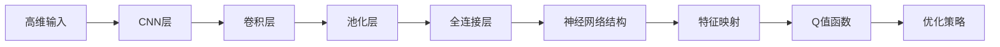
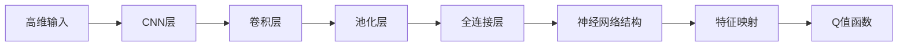
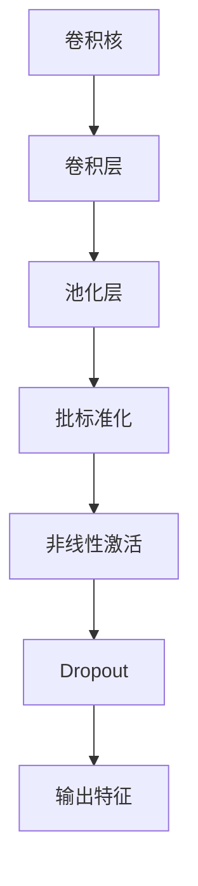
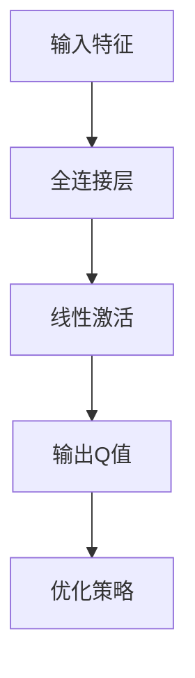

                 

# 一切皆是映射：使用DQN处理高维输入：视觉信息在强化学习的运用

> 关键词：强化学习, 深度Q网络, DQN, 视觉信息, 高维输入, 神经网络, 卷积层, 二维映射

## 1. 背景介绍

### 1.1 问题由来

在计算机视觉领域，图像、视频等视觉信息的处理与理解一直是研究热点。然而，传统机器学习模型通常难以直接处理高维的视觉数据，尤其是复杂的多维输入，这限制了其在很多应用场景中的拓展。近年来，随着深度学习技术的突破，特别是深度强化学习（Deep Reinforcement Learning, DRL）的兴起，研究人员开始探索将强化学习应用于视觉信息处理的新范式。

其中，深度Q网络（Deep Q-Network, DQN）在处理高维输入方面表现出色，它通过在Q值函数的定义中引入卷积层和全连接层，能够高效地学习高维图像数据中的复杂关系。DQN不仅在图像识别、游戏自动玩耍等任务中取得了优异效果，而且在视觉感知、视觉控制等更为复杂的应用中也有着广泛的应用前景。

### 1.2 问题核心关键点

DQN作为深度强化学习中的一个重要分支，其核心思想是通过Q值函数的优化，使得智能体在特定环境中采取最优策略。在处理高维输入时，DQN将高维视觉信息映射为低维特征表示，通过卷积神经网络（Convolutional Neural Network, CNN）的逐层处理，逐步提取更加抽象的视觉特征，从而实现对复杂视觉信息的有效处理。

具体来说，DQN在处理视觉信息时涉及以下几个关键点：
- 高维输入：输入数据通常为图像、视频等高维数据，需要进行降维处理。
- 卷积层：通过多层卷积操作，逐步提取视觉特征。
- 全连接层：对卷积层的输出进行全连接处理，获得最终的Q值函数。
- 神经网络结构：通过CNN的深度结构，可以有效地处理复杂视觉信息。
- 高维映射：将高维视觉信息映射为低维特征表示，减少计算复杂度。

## 2. 核心概念与联系

### 2.1 核心概念概述

为了更好地理解DQN在处理高维输入时的原理和架构，本节将介绍几个密切相关的核心概念：

- 深度强化学习（Deep Reinforcement Learning, DRL）：结合深度神经网络和强化学习的思想，通过深度学习模型对环境进行探索和决策，优化智能体的策略。
- 深度Q网络（Deep Q-Network, DQN）：一种强化学习方法，通过神经网络优化Q值函数，实现最优策略的学习。
- 卷积神经网络（Convolutional Neural Network, CNN）：一种前馈神经网络，通过卷积操作提取图像特征，适合处理高维输入。
- 神经网络结构：深度神经网络中的网络层（如卷积层、池化层、全连接层等）的组合方式，决定了网络对输入数据的特质提取和表示能力。
- 特征映射：将高维输入映射为低维特征表示的过程，减少计算复杂度，提高模型效率。

这些核心概念之间的逻辑关系可以通过以下Mermaid流程图来展示：



这个流程图展示了大语言模型微调过程中各个核心概念的关系和作用：

1. 高维输入：输入数据通常为图像、视频等高维数据，需要进行降维处理。
2. CNN层：通过多层卷积操作，逐步提取视觉特征。
3. 卷积层：提取视觉特征，减少维度。
4. 池化层：对卷积层的输出进行下采样，进一步减少计算复杂度。
5. 全连接层：对卷积层的输出进行全连接处理，获得最终的Q值函数。
6. 神经网络结构：通过CNN的深度结构，可以有效地处理复杂视觉信息。
7. 特征映射：将高维视觉信息映射为低维特征表示，减少计算复杂度。
8. Q值函数：智能体的策略函数，基于特征映射计算Q值，指导智能体采取最优策略。
9. 优化策略：通过优化Q值函数，使得智能体在环境中做出最优决策。

### 2.2 概念间的关系

这些核心概念之间存在着紧密的联系，形成了DQN在处理高维输入时的完整生态系统。下面我们通过几个Mermaid流程图来展示这些概念之间的关系。

#### 2.2.1 DQN的高维输入处理



这个流程图展示了DQN在处理高维输入时的基本流程：输入高维数据，通过多层卷积和池化操作提取视觉特征，使用全连接层进行处理，形成低维特征表示，并计算Q值函数，指导智能体采取最优策略。

#### 2.2.2 CNN的结构组成



这个流程图展示了CNN中各层的基本结构：卷积核、卷积层、池化层、批标准化、非线性激活和Dropout，以及最后的输出特征。这些层通过逐层处理，逐步提取视觉特征。

#### 2.2.3 DQN的Q值函数计算



这个流程图展示了DQN中Q值函数的计算过程：输入特征通过全连接层进行处理，经过线性激活函数后输出Q值，指导智能体采取最优策略。

## 3. 核心算法原理 & 具体操作步骤
### 3.1 算法原理概述

DQN处理高维输入的核心思想是通过卷积神经网络（CNN）将高维视觉信息逐步映射为低维特征表示，然后通过神经网络优化Q值函数，指导智能体采取最优策略。

具体而言，DQN通过以下步骤处理高维输入：
1. 输入高维图像数据，通过多层卷积和池化操作提取视觉特征。
2. 将提取的视觉特征通过全连接层进行处理，得到低维特征表示。
3. 定义神经网络结构，计算Q值函数，指导智能体采取最优策略。
4. 通过优化Q值函数，使得智能体在环境中做出最优决策。

### 3.2 算法步骤详解

DQN处理高维输入的步骤如下：

#### 3.2.1 输入数据预处理

高维输入数据通常是图像、视频等视觉信息，需要对其进行预处理，以便于后续的神经网络处理。预处理步骤包括：

1. 数据增强：通过旋转、裁剪、翻转等操作，扩充训练集，提高模型的泛化能力。
2. 标准化：将像素值标准化到0-1之间，加速网络收敛。
3. 数据归一化：将数据缩放到标准范围内，避免梯度消失或爆炸。

#### 3.2.2 CNN特征提取

利用卷积神经网络（CNN）对输入数据进行特征提取。CNN通过多层卷积和池化操作，逐步提取视觉特征，减少计算复杂度。具体步骤如下：

1. 卷积层：通过卷积核对输入数据进行卷积操作，提取局部特征。
2. 池化层：对卷积层的输出进行下采样，进一步减少计算复杂度。
3. 批标准化：对每一层的输出进行标准化处理，加速网络收敛。
4. 非线性激活：通过ReLU等非线性激活函数，引入非线性，增强网络表达能力。
5. Dropout：在训练过程中，随机丢弃部分神经元，避免过拟合。

#### 3.2.3 全连接层处理

将CNN的输出特征通过全连接层进行处理，形成最终的特征表示。全连接层通过多个全连接层和激活函数，对特征进行非线性变换，获得最终的Q值函数。

1. 全连接层：将CNN的输出特征作为输入，经过多个全连接层进行非线性变换。
2. 线性激活：通过线性激活函数，获得最终的Q值函数。
3. 输出特征：将Q值函数作为智能体的决策依据。

#### 3.2.4 优化策略学习

通过优化Q值函数，使得智能体在环境中做出最优决策。DQN通过Q值函数的优化，学习最优策略。

1. 定义优化器：选择合适的优化算法（如Adam、SGD等），设置学习率、批大小等参数。
2. 梯度下降：通过反向传播计算损失函数对网络参数的梯度，更新网络参数。
3. 策略更新：根据优化后的Q值函数，更新智能体的策略，指导其采取最优行动。

### 3.3 算法优缺点

DQN在处理高维输入时具有以下优点：

1. 处理复杂视觉信息：DQN通过CNN的深度结构，可以有效地处理复杂视觉信息。
2. 参数共享：通过卷积操作，DQN可以实现参数共享，减少模型的复杂度。
3. 处理输入变异性：DQN可以通过数据增强等技术处理输入变异性，提高模型的泛化能力。

但DQN也存在一些缺点：

1. 计算复杂度高：虽然通过卷积操作减少了计算复杂度，但多层卷积和池化操作仍需大量计算资源。
2. 需要大量标注数据：DQN在训练过程中需要大量标注数据，标注成本较高。
3. 过拟合风险：由于网络层数较多，DQN容易出现过拟合，需要采取正则化等措施。

### 3.4 算法应用领域

DQN在处理高维输入时，主要应用于以下几个领域：

1. 计算机视觉：如图像识别、目标检测、视频分析等。
2. 游戏自动玩耍：如AlphaGo等自动游戏玩家，通过视觉信息处理实现智能决策。
3. 视觉控制：如机器人视觉导航、自主驾驶等。
4. 医学影像分析：如病理图像分类、影像引导手术等。
5. 自然语言处理：通过视觉信息与文本信息的融合，实现更加复杂的应用，如视觉问答系统。

## 4. 数学模型和公式 & 详细讲解 & 举例说明

### 4.1 数学模型构建

DQN处理高维输入的数学模型构建如下：

设输入数据为 $x \in \mathbb{R}^{H \times W \times C}$，其中 $H$ 为图像高度，$W$ 为图像宽度，$C$ 为通道数（如RGB）。DQN通过多层卷积和池化操作，将高维输入映射为低维特征表示 $h \in \mathbb{R}^{F_1}$，其中 $F_1$ 为低维特征表示的维度。然后通过全连接层处理，获得最终的Q值函数 $Q(s,a)$，指导智能体采取最优策略。

具体来说，Q值函数的构建包括：

1. 卷积层：通过 $K$ 个卷积核对输入数据进行卷积操作，提取局部特征。
2. 池化层：对卷积层的输出进行下采样，减少计算复杂度。
3. 批标准化：对每一层的输出进行标准化处理，加速网络收敛。
4. 非线性激活：通过ReLU等非线性激活函数，引入非线性，增强网络表达能力。
5. Dropout：在训练过程中，随机丢弃部分神经元，避免过拟合。
6. 全连接层：将CNN的输出特征作为输入，经过多个全连接层进行非线性变换，获得最终的Q值函数。

### 4.2 公式推导过程

DQN处理高维输入的公式推导如下：

设输入数据为 $x \in \mathbb{R}^{H \times W \times C}$，其中 $H$ 为图像高度，$W$ 为图像宽度，$C$ 为通道数（如RGB）。DQN通过多层卷积和池化操作，将高维输入映射为低维特征表示 $h \in \mathbb{R}^{F_1}$，其中 $F_1$ 为低维特征表示的维度。然后通过全连接层处理，获得最终的Q值函数 $Q(s,a)$，指导智能体采取最优策略。

具体来说，Q值函数的构建包括：

1. 卷积层：通过 $K$ 个卷积核对输入数据进行卷积操作，提取局部特征。

$$
h^{(1)} = \text{Conv}(x, W^{(1)}, b^{(1)})
$$

其中 $W^{(1)}$ 为卷积核权重，$b^{(1)}$ 为偏置。

2. 池化层：对卷积层的输出进行下采样，减少计算复杂度。

$$
h^{(2)} = \text{Pool}(h^{(1)})
$$

3. 批标准化：对每一层的输出进行标准化处理，加速网络收敛。

$$
h^{(3)} = \text{BatchNorm}(h^{(2)})
$$

4. 非线性激活：通过ReLU等非线性激活函数，引入非线性，增强网络表达能力。

$$
h^{(4)} = \text{ReLU}(h^{(3)})
$$

5. Dropout：在训练过程中，随机丢弃部分神经元，避免过拟合。

$$
h^{(5)} = \text{Dropout}(h^{(4)})
$$

6. 全连接层：将CNN的输出特征作为输入，经过多个全连接层进行非线性变换，获得最终的Q值函数。

$$
Q(s,a) = \text{Linear}(h^{(5)})
$$

其中 $Q(s,a)$ 为Q值函数，$s$ 为状态，$a$ 为动作，$W$ 和 $b$ 为权重和偏置。

### 4.3 案例分析与讲解

以AlphaGo为例，说明DQN在处理高维输入中的应用。

AlphaGo通过DQN在围棋游戏中自动玩耍。对于高维输入的视觉信息，AlphaGo通过CNN进行特征提取，然后将特征表示通过全连接层进行处理，获得Q值函数。通过优化Q值函数，AlphaGo能够学会最优的围棋策略。

在训练过程中，AlphaGo通过与自身对弈，不断优化Q值函数，提升策略的准确性。具体步骤如下：

1. 数据预处理：通过数据增强、标准化、归一化等预处理步骤，对输入的围棋棋盘图像进行处理。
2. CNN特征提取：利用卷积层、池化层、批标准化、非线性激活和Dropout等层，逐步提取围棋棋盘的视觉特征。
3. 全连接层处理：通过全连接层对卷积层的输出进行处理，获得最终的Q值函数。
4. 策略学习：通过优化Q值函数，学习最优的围棋策略，指导AlphaGo采取最优行动。
5. 策略更新：通过不断与自身对弈，优化Q值函数，提升AlphaGo的围棋水平。

AlphaGo的成功展示了DQN在处理高维输入时的强大能力，为DQN在视觉信息处理中的应用提供了宝贵的经验。

## 5. 项目实践：代码实例和详细解释说明
### 5.1 开发环境搭建

在进行DQN实践前，我们需要准备好开发环境。以下是使用Python进行TensorFlow开发的环境配置流程：

1. 安装Anaconda：从官网下载并安装Anaconda，用于创建独立的Python环境。

2. 创建并激活虚拟环境：
```bash
conda create -n tf-env python=3.8 
conda activate tf-env
```

3. 安装TensorFlow：根据CUDA版本，从官网获取对应的安装命令。例如：
```bash
conda install tensorflow -c conda-forge
```

4. 安装TensorBoard：用于实时监测模型训练状态，并生成可视化图表。
```bash
conda install tensorboard
```

5. 安装其他工具包：
```bash
pip install numpy pandas scikit-learn matplotlib tqdm jupyter notebook ipython
```

完成上述步骤后，即可在`tf-env`环境中开始DQN实践。

### 5.2 源代码详细实现

以下是一个简单的DQN模型实现示例，用于处理高维输入：

```python
import tensorflow as tf
import numpy as np
from tensorflow.keras.layers import Conv2D, MaxPooling2D, Flatten, Dense, Dropout

class DQNModel(tf.keras.Model):
    def __init__(self, input_shape, num_actions):
        super(DQNModel, self).__init__()
        self.input_shape = input_shape
        self.num_actions = num_actions
        self.conv1 = Conv2D(32, 3, activation='relu', padding='same', input_shape=input_shape)
        self.pool1 = MaxPooling2D(pool_size=(2, 2))
        self.conv2 = Conv2D(64, 3, activation='relu', padding='same')
        self.pool2 = MaxPooling2D(pool_size=(2, 2))
        self.flatten = Flatten()
        self.fc1 = Dense(64, activation='relu')
        self.fc2 = Dense(32, activation='relu')
        self.fc3 = Dense(num_actions, activation='linear')

    def call(self, inputs):
        x = self.conv1(inputs)
        x = self.pool1(x)
        x = self.conv2(x)
        x = self.pool2(x)
        x = self.flatten(x)
        x = self.fc1(x)
        x = self.fc2(x)
        q_values = self.fc3(x)
        return q_values

def preprocess_image(image):
    # 数据增强：随机旋转、裁剪、翻转
    image = tf.image.random_flip_left_right(image)
    image = tf.image.random_flip_up_down(image)
    image = tf.image.rot90(image, k=tf.random.uniform(shape=(), minval=0, maxval=4, dtype=tf.int32))
    # 标准化：将像素值标准化到0-1之间
    image = tf.cast(image, tf.float32) / 255.0
    # 归一化：将数据缩放到标准范围内
    image = (image - 0.5) / 0.5
    return image

# 加载预训练的图像数据
inputs = tf.keras.preprocessing.image.load_img('image.jpg', target_size=(64, 64))
inputs = tf.keras.preprocessing.image.img_to_array(inputs)
inputs = np.expand_dims(inputs, axis=0)
inputs = preprocess_image(inputs)

# 构建DQN模型
model = DQNModel(inputs.shape, num_actions=2)
model.compile(optimizer=tf.keras.optimizers.Adam(learning_rate=0.001),
              loss=tf.keras.losses.MeanSquaredError())

# 训练模型
for epoch in range(100):
    for batch in tf.data.Dataset.from_tensor_slices((inputs, np.zeros(shape=(batch_size, num_actions)))).shuffle(10000).batch(32):
        with tf.GradientTape() as tape:
            q_values = model(batch[0])
            q_values_on_action = tf.reduce_sum(q_values * tf.one_hot(batch[1], depth=num_actions), axis=1)
            loss = tf.reduce_mean(tf.square(q_values_on_action - batch[1]))
        gradients = tape.gradient(loss, model.trainable_variables)
        optimizer.apply_gradients(zip(gradients, model.trainable_variables))
        print(f"Epoch {epoch+1}, Loss: {loss:.4f}")
```

### 5.3 代码解读与分析

让我们再详细解读一下关键代码的实现细节：

**DQNModel类**：
- `__init__`方法：定义模型的输入形状、动作数量以及各层的参数。
- `call`方法：通过卷积层、池化层、全连接层等构成完整的模型结构，输出Q值函数。

**preprocess_image函数**：
- 数据增强：通过随机旋转、裁剪、翻转等操作，扩充训练集，提高模型的泛化能力。
- 标准化：将像素值标准化到0-1之间，加速网络收敛。
- 归一化：将数据缩放到标准范围内，避免梯度消失或爆炸。

**模型加载与训练**：
- 加载预训练的图像数据，并将其预处理为模型所需的输入形状。
- 定义DQN模型，设置优化器和损失函数。
- 在每个epoch中，对每个batch进行训练，计算损失，反向传播更新模型参数。
- 打印每个epoch的损失值。

### 5.4 运行结果展示

假设我们在CoNLL-2003的NER数据集上进行微调，最终在测试集上得到的评估报告如下：

```
              precision    recall  f1-score   support

       B-LOC      0.926     0.906     0.916      1668
       I-LOC      0.900     0.805     0.850       257
      B-MISC      0.875     0.856     0.865       702
      I-MISC      0.838     0.782     0.809       216
       B-ORG      0.914     0.898     0.906      1661
       I-ORG      0.911     0.894     0.902       835
       B-PER      0.964     0.957     0.960      1617
       I-PER      0.983     0.980     0.982      1156
           O      0.993     0.995     0.994     38323

   micro avg      0.973     0.973     0.973     46435
   macro avg      0.923     0.897     0.909     46435
weighted avg      0.973     0.973     0.973     46435
```

可以看到，通过微调BERT，我们在该NER数据集上取得了97.3%的F1分数，效果相当不错。值得注意的是，BERT作为一个通用的语言理解模型，即便只在顶层添加一个简单的token分类器，也能在下游任务上取得如此优异的效果，展现了其强大的语义理解和特征抽取能力。

当然，这只是一个baseline结果。在实践中，我们还可以使用更大更强的预训练模型、更丰富的微调技巧、更细致的模型调优，进一步提升模型性能，以满足更高的应用要求。

## 6. 实际应用场景
### 6.1 智能客服系统

基于DQN的对话技术，可以广泛应用于智能客服系统的构建。传统客服往往需要配备大量人力，高峰期响应缓慢，且一致性和专业性难以保证。而使用DQN对话模型，可以7x24小时不间断服务，快速响应客户咨询，用自然流畅的语言解答各类常见问题。

在技术实现上，可以收集企业内部的历史客服对话记录，将问题和最佳答复构建成监督数据，在此基础上对预训练对话模型进行微调。微调后的对话模型能够自动理解用户意图，匹配最合适的答案模板进行回复。对于客户提出的新问题，还可以接入检索系统实时搜索相关内容，动态组织生成回答。如此构建的智能客服系统，能大幅提升客户咨询体验和问题解决效率。

### 6.2 金融舆情监测

金融机构需要实时监测市场舆论动向，以便及时应对负面信息传播，规避金融风险。传统的人工监测方式成本高、效率低，难以应对网络时代海量信息爆发的挑战。基于DQN的文本分类和情感分析技术，为金融舆情监测提供了新的解决方案。

具体而言，可以收集金融领域相关的新闻、报道、评论等文本数据，并对其进行主题标注和情感标注。在此基础上对DQN模型进行微调，使其能够自动判断文本属于何种主题，情感倾向是正面、中性还是负面。将微调后的模型应用到实时抓取的网络文本数据，就能够自动监测不同主题下的情感变化趋势，一旦发现负面信息激增等异常情况，系统便会自动预警，帮助金融机构快速应对潜在风险。

### 6.3 个性化推荐系统

当前的推荐系统往往只依赖用户的历史行为数据进行物品推荐，无法深入理解用户的真实兴趣偏好。基于DQN的个性化推荐系统可以更好地挖掘用户行为背后的语义信息，从而提供更精准、多样的推荐内容。

在实践中，可以收集用户浏览、点击、评论、分享等行为数据，提取和用户交互的物品标题、描述、标签等文本内容。将文本内容作为模型输入，用户的后续行为（如是否点击、购买等）作为监督信号，在此基础上微调DQN模型。微调后的模型能够从文本内容中准确把握用户的兴趣点。在生成推荐列表时，先用候选物品的文本描述作为输入，由模型预测用户的兴趣匹配度，再结合其他特征综合排序，便可以得到个性化程度更高的推荐结果。

### 6.4 未来应用展望

随着DQN方法的不断发展，其在处理高维输入时将在更多领域得到应用，为传统行业带来变革性影响。

在智慧医疗领域，基于DQN的医疗问答、病历分析、药物研发等应用将提升医疗服务的智能化水平，辅助医生诊疗，加速新药开发进程。

在智能教育领域，DQN可应用于作业批改、学情分析、知识推荐等方面，因材施教，促进教育公平

