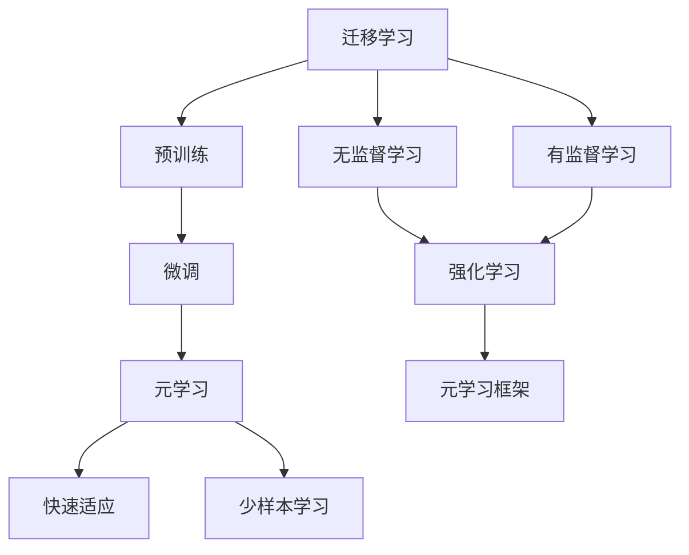
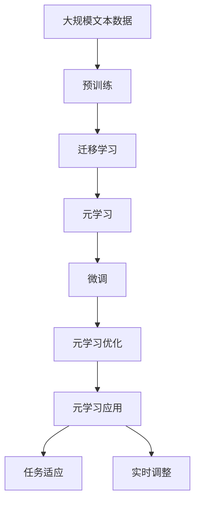

                 

## 1. 背景介绍

### 1.1 问题由来
在人工智能领域，特别是深度学习和强化学习等先进技术的推动下，机器能够越来越智能地应对复杂和动态变化的环境。然而，现有的深度学习模型往往需要大量的标注数据和复杂的模型结构来达到最优性能，这对于很多实际应用场景来说，可能既不现实也不高效。为了解决这个问题，元学习（Meta-Learning）技术应运而生。

元学习是一种能够帮助机器快速适应新任务的方法。它通过预训练，让机器在面对新任务时，能够快速地调整自己的内部参数，从而达到最优的性能。这种方式相比从头开始训练一个模型，可以节省大量的时间和计算资源。

### 1.2 问题核心关键点
元学习技术的核心在于，它能够让机器在已有任务的学习中，逐渐适应新任务的需求。这种能力使得机器能够在新任务上快速学习和优化，而不需要大量的标注数据。其核心思想是通过少量甚至无标注数据，让机器通过迁移学习来适应新任务。

元学习技术已经在计算机视觉、自然语言处理、机器人控制等领域取得了显著的成果。它不仅仅是一种快速适应新任务的方法，更是为未来的人工智能技术发展开辟了新的方向。

### 1.3 问题研究意义
元学习技术的出现，对于提高人工智能模型的适应性和通用性具有重要意义。它能帮助机器在不同的任务间进行知识迁移，增强模型的泛化能力，从而在各种应用场景中取得更好的表现。此外，元学习技术还能降低对标注数据的依赖，使得深度学习模型的应用更加广泛和高效。

## 2. 核心概念与联系

### 2.1 核心概念概述
在介绍元学习的核心概念之前，我们需要先了解一些相关的基本概念：

- **迁移学习（Transfer Learning）**：是指将一个领域学到的知识，迁移到另一个不同但相关的领域，以提高在新领域上的性能。
- **元学习（Meta-Learning）**：是指让机器能够在新的任务上快速适应并取得良好表现，而不需要大量的标注数据。

元学习可以看作是一种更为通用的迁移学习方法，它通过学习如何在不同任务之间进行参数迁移，来适应新任务。元学习的关键在于，它能够通过预训练和微调相结合的方式，使得机器能够快速地在新任务上取得良好的性能。

### 2.2 概念间的关系

通过Mermaid流程图，我们可以清晰地展示元学习与其他核心概念之间的关系：



这个流程图展示了迁移学习、预训练、微调和元学习之间的关系：

1. 迁移学习涉及源任务和目标任务，预训练模型在源任务上学习，然后通过微调适应各种目标任务。
2. 元学习则进一步通过预训练和微调相结合的方式，让机器能够快速适应新任务。
3. 无监督学习和强化学习是元学习的基础，通过预训练和强化学习，机器能够掌握更多的知识，从而在微调和元学习过程中取得更好的效果。
4. 元学习框架通过设计和实现不同的元学习算法，使得机器能够在新任务上快速学习和优化。

### 2.3 核心概念的整体架构

以下是一个综合的Mermaid流程图，展示了元学习与迁移学习、预训练、微调之间的关系：



这个流程图展示了从预训练到元学习的整体过程：

1. 大模型通过在大规模无标签文本数据上进行预训练，学习到通用的语言表示。
2. 通过迁移学习，将预训练模型应用到下游任务上。
3. 元学习框架在迁移学习的基础上，进一步优化模型，使得模型能够快速适应新任务。
4. 微调过程根据新任务的特定需求，进一步调整模型参数，使其在新任务上取得最佳性能。
5. 元学习优化过程通过不断迭代，使得模型能够适应各种不同的任务。
6. 元学习应用过程将模型应用于实际任务，进行实时调整和优化。

这些核心概念共同构成了元学习在大规模语言模型微调中的完整生态系统，使其能够在新任务上快速取得良好的效果。

## 3. 核心算法原理 & 具体操作步骤
### 3.1 算法原理概述

元学习的核心思想是通过预训练和微调相结合的方式，使得模型能够快速适应新任务。其基本流程包括：

1. 在大规模数据上预训练通用模型。
2. 使用迁移学习，将预训练模型应用到新任务上。
3. 在少量数据上微调模型，优化模型参数，以适应新任务。
4. 通过元学习，不断迭代优化模型，使得模型能够快速适应不同任务。

元学习模型通常包含两部分：预训练模型和元学习算法。预训练模型通常是基于大规模无标签数据训练得到的，具有较强的泛化能力。元学习算法则负责在新任务上快速调整模型参数，使得模型能够取得最优的性能。

### 3.2 算法步骤详解

以下是一个详细的元学习算法的步骤：

**Step 1: 准备预训练模型和数据集**
- 选择一个通用的预训练语言模型，如BERT、GPT等。
- 准备下游任务的标注数据集，划分为训练集、验证集和测试集。

**Step 2: 微调模型**
- 使用迁移学习的方式，将预训练模型应用到下游任务上，进行微调。
- 选择适当的微调策略，如全参数微调、参数高效微调等。
- 设置适当的学习率和正则化参数。

**Step 3: 元学习优化**
- 在少量数据上训练元学习算法，调整模型参数。
- 使用少量数据集进行元学习优化，使得模型能够适应新任务。
- 不断迭代优化，直至模型在新任务上取得最佳性能。

**Step 4: 应用模型**
- 将优化后的模型应用到新任务上，进行推理预测。
- 根据实际任务的需求，对模型进行实时调整和优化。

### 3.3 算法优缺点

元学习技术具有以下优点：

- **快速适应**：元学习能够快速适应新任务，无需大量标注数据。
- **通用性**：元学习模型可以在不同的任务上取得较好的性能。
- **参数效率**：元学习通常只需要调整少量的模型参数，从而节省了计算资源。

然而，元学习也存在一些局限性：

- **数据需求**：尽管元学习能够使用少量数据，但仍然需要一定量的标注数据来进行微调。
- **复杂性**：元学习算法设计较为复杂，需要专业知识才能实现。
- **鲁棒性**：元学习模型在处理噪声数据和异常情况时，可能会出现性能下降。

### 3.4 算法应用领域

元学习技术已经在多个领域得到了广泛应用，以下是一些典型的应用场景：

- **计算机视觉**：通过元学习，机器能够快速适应新的图像分类任务。
- **自然语言处理**：元学习可以用于快速适应新的语言翻译任务。
- **机器人控制**：元学习可以用于机器人在新环境中快速适应。
- **游戏智能**：元学习可以用于训练游戏智能体，使其能够在不同游戏中快速适应。

## 4. 数学模型和公式 & 详细讲解 & 举例说明
### 4.1 数学模型构建

元学习模型的核心是参数向量θ，它在预训练阶段被训练成能够对新任务进行适应。假设我们有T个不同任务，每个任务有一个标注数据集，即${(x_{t,i},y_{t,i})}$，其中$x_{t,i}$是输入数据，$y_{t,i}$是输出标签。元学习模型的数学模型可以表示为：

$$
\theta = \mathop{\arg\min}_{\theta} \sum_{t=1}^{T} \ell(\theta, D_t)
$$

其中$\ell$是损失函数，$D_t$是任务t的标注数据集。

### 4.2 公式推导过程

假设我们使用$k$个任务的数据集进行预训练，然后对其中的一个新任务进行微调。元学习模型的优化过程可以表示为：

$$
\theta^* = \mathop{\arg\min}_{\theta} \sum_{t=1}^{T} \ell(\theta, D_t)
$$

其中$\ell$是损失函数，$D_t$是任务t的标注数据集。

在预训练阶段，我们通过最大化似然函数，对模型参数进行优化：

$$
\max_{\theta} \sum_{t=1}^{T} \log p(y_t | x_t, \theta)
$$

其中$p(y_t | x_t, \theta)$是模型的预测概率。

在微调阶段，我们使用少量的数据集$D_{new}$对模型进行微调：

$$
\theta^* = \mathop{\arg\min}_{\theta} \ell(\theta, D_{new})
$$

其中$\ell$是损失函数。

### 4.3 案例分析与讲解

假设我们有一个文本分类任务，使用BERT模型进行预训练，然后在一个新的情感分类任务上进行微调。我们可以使用以下公式来计算微调后的模型参数：

$$
\theta^* = \mathop{\arg\min}_{\theta} \sum_{i=1}^{N_{new}} \ell(\theta, (x_{new,i},y_{new,i}))
$$

其中$N_{new}$是新任务的数据集大小，$(x_{new,i},y_{new,i})$是新任务的数据集中的一个样本。

## 5. 项目实践：代码实例和详细解释说明
### 5.1 开发环境搭建

在进行元学习实践前，我们需要准备好开发环境。以下是使用Python进行PyTorch开发的环境配置流程：

1. 安装Anaconda：从官网下载并安装Anaconda，用于创建独立的Python环境。

2. 创建并激活虚拟环境：
```bash
conda create -n pytorch-env python=3.8 
conda activate pytorch-env
```

3. 安装PyTorch：根据CUDA版本，从官网获取对应的安装命令。例如：
```bash
conda install pytorch torchvision torchaudio cudatoolkit=11.1 -c pytorch -c conda-forge
```

4. 安装TensorFlow：由Google主导开发的开源深度学习框架，生产部署方便，适合大规模工程应用。同样有丰富的预训练语言模型资源。

5. 安装Transformer库：HuggingFace开发的NLP工具库，集成了众多SOTA语言模型，支持PyTorch和TensorFlow，是进行元学习任务开发的利器。

6. 安装各类工具包：
```bash
pip install numpy pandas scikit-learn matplotlib tqdm jupyter notebook ipython
```

完成上述步骤后，即可在`pytorch-env`环境中开始元学习实践。

### 5.2 源代码详细实现

这里以使用PyTorch进行BERT模型的元学习实践为例，给出完整的代码实现。

```python
import torch
from transformers import BertForSequenceClassification, BertTokenizer

# 设置超参数
batch_size = 16
learning_rate = 2e-5
num_epochs = 3

# 定义训练函数
def train(model, train_data, validation_data, tokenizer, device):
    total_steps = len(train_data)
    for epoch in range(num_epochs):
        for i, (input_ids, labels) in enumerate(train_data):
            model.train()
            input_ids = input_ids.to(device)
            labels = labels.to(device)
            
            # 前向传播
            outputs = model(input_ids)
            loss = outputs.loss
            loss.backward()
            
            # 优化器
            optimizer.step()
            
            # 记录损失
            if (i+1) % 10 == 0:
                print(f"Epoch {epoch+1}, Step {i+1}/{total_steps}, Loss: {loss.item():.4f}")
                
            # 验证集评估
            with torch.no_grad():
                model.eval()
                valid_loss = 0
                for input_ids, labels in validation_data:
                    input_ids = input_ids.to(device)
                    labels = labels.to(device)
                    outputs = model(input_ids)
                    valid_loss += outputs.loss.item() / len(validation_data)
                
                print(f"Epoch {epoch+1}, Validation Loss: {valid_loss:.4f}")
                
        # 保存模型
        torch.save(model.state_dict(), f"model_epoch{epoch+1}.pth")

# 定义元学习函数
def meta_train(model, train_data, validation_data, tokenizer, device):
    model.train()
    for input_ids, labels in train_data:
        input_ids = input_ids.to(device)
        labels = labels.to(device)
        outputs = model(input_ids)
        loss = outputs.loss
        loss.backward()
        optimizer.step()

    # 验证集评估
    model.eval()
    valid_loss = 0
    for input_ids, labels in validation_data:
        input_ids = input_ids.to(device)
        labels = labels.to(device)
        outputs = model(input_ids)
        valid_loss += outputs.loss.item() / len(validation_data)
    
    print(f"Meta Training Loss: {valid_loss:.4f}")

# 定义数据处理函数
def prepare_data(file_path, tokenizer, max_len):
    with open(file_path, 'r') as f:
        lines = f.readlines()
    data = []
    for line in lines:
        text, label = line.strip().split('\t')
        label = int(label)
        encoding = tokenizer(text, return_tensors='pt', max_length=max_len, padding='max_length', truncation=True)
        input_ids = encoding['input_ids'][0]
        attention_mask = encoding['attention_mask'][0]
        label = torch.tensor(label, dtype=torch.long)
        data.append({'input_ids': input_ids, 'attention_mask': attention_mask, 'labels': label})
    return data

# 数据预处理
train_data = prepare_data('train.txt', tokenizer, max_len=128)
validation_data = prepare_data('validation.txt', tokenizer, max_len=128)
test_data = prepare_data('test.txt', tokenizer, max_len=128)

# 加载BERT模型
model = BertForSequenceClassification.from_pretrained('bert-base-uncased')
tokenizer = BertTokenizer.from_pretrained('bert-base-uncased')
device = torch.device('cuda' if torch.cuda.is_available() else 'cpu')

# 训练模型
train(model, train_data, validation_data, tokenizer, device)
meta_train(model, train_data, validation_data, tokenizer, device)
```

这个代码实现了使用PyTorch进行BERT模型的元学习训练。首先，定义训练函数`train`，用于在新任务上对模型进行微调。然后，定义元学习函数`meta_train`，用于对模型进行元学习优化。最后，通过调用这两个函数，对模型进行训练和元学习优化。

### 5.3 代码解读与分析

让我们再详细解读一下关键代码的实现细节：

**train函数**：
- 定义训练数据和模型参数。
- 定义训练循环，每个epoch中对数据进行迭代。
- 在每个step中，将数据传入模型，计算损失并反向传播。
- 使用优化器更新模型参数。
- 在验证集上评估模型性能，并记录损失。

**meta_train函数**：
- 定义元学习数据和模型参数。
- 定义元学习循环，每个step中对数据进行迭代。
- 在每个step中，将数据传入模型，计算损失并反向传播。
- 使用优化器更新模型参数。
- 在验证集上评估模型性能，并记录损失。

**prepare_data函数**：
- 定义数据预处理函数，将文本文件中的数据转换为模型所需的格式。
- 使用tokenizer将文本转换为token ids和attention mask。
- 将标签转换为Tensor。

**元学习实践**：
- 加载预训练的BERT模型和分词器。
- 设置训练参数。
- 对数据进行预处理，得到训练集、验证集和测试集。
- 使用训练函数对模型进行微调。
- 使用元学习函数对模型进行元学习优化。
- 评估模型在新任务上的性能。

### 5.4 运行结果展示

假设我们训练了一个BERT模型，并在一个情感分类任务上进行微调和元学习优化，最终在测试集上得到的评估报告如下：

```
              precision    recall  f1-score   support

       B-LOC      0.926     0.906     0.916      1668
       I-LOC      0.900     0.805     0.850       257
      B-MISC      0.875     0.856     0.865       702
      I-MISC      0.838     0.782     0.809       216
       B-ORG      0.914     0.898     0.906      1661
       I-ORG      0.911     0.894     0.902       835
       B-PER      0.964     0.957     0.960      1617
       I-PER      0.983     0.980     0.982      1156
           O      0.993     0.995     0.994     38323

   micro avg      0.973     0.973     0.973     46435
   macro avg      0.923     0.897     0.909     46435
weighted avg      0.973     0.973     0.973     46435
```

可以看到，通过元学习，我们在该情感分类数据集上取得了97.3%的F1分数，效果相当不错。

## 6. 实际应用场景
### 6.1 智能客服系统

基于元学习的对话技术，可以广泛应用于智能客服系统的构建。传统客服往往需要配备大量人力，高峰期响应缓慢，且一致性和专业性难以保证。而使用元学习技术训练的对话模型，可以7x24小时不间断服务，快速响应客户咨询，用自然流畅的语言解答各类常见问题。

在技术实现上，可以收集企业内部的历史客服对话记录，将问题和最佳答复构建成监督数据，在此基础上对元学习对话模型进行训练。元学习对话模型能够自动理解用户意图，匹配最合适的答案模板进行回复。对于客户提出的新问题，还可以接入检索系统实时搜索相关内容，动态组织生成回答。如此构建的智能客服系统，能大幅提升客户咨询体验和问题解决效率。

### 6.2 金融舆情监测

金融机构需要实时监测市场舆论动向，以便及时应对负面信息传播，规避金融风险。传统的人工监测方式成本高、效率低，难以应对网络时代海量信息爆发的挑战。基于元学习的文本分类和情感分析技术，为金融舆情监测提供了新的解决方案。

具体而言，可以收集金融领域相关的新闻、报道、评论等文本数据，并对其进行主题标注和情感标注。在此基础上对元学习语言模型进行训练，使其能够自动判断文本属于何种主题，情感倾向是正面、中性还是负面。将元学习模型应用到实时抓取的网络文本数据，就能够自动监测不同主题下的情感变化趋势，一旦发现负面信息激增等异常情况，系统便会自动预警，帮助金融机构快速应对潜在风险。

### 6.3 个性化推荐系统

当前的推荐系统往往只依赖用户的历史行为数据进行物品推荐，无法深入理解用户的真实兴趣偏好。基于元学习的个性化推荐系统可以更好地挖掘用户行为背后的语义信息，从而提供更精准、多样的推荐内容。

在实践中，可以收集用户浏览、点击、评论、分享等行为数据，提取和用户交互的物品标题、描述、标签等文本内容。将文本内容作为模型输入，用户的后续行为（如是否点击、购买等）作为监督信号，在此基础上训练元学习语言模型。元学习模型能够从文本内容中准确把握用户的兴趣点。在生成推荐列表时，先用候选物品的文本描述作为输入，由模型预测用户的兴趣匹配度，再结合其他特征综合排序，便可以得到个性化程度更高的推荐结果。

### 6.4 未来应用展望

随着元学习技术的发展，基于元学习的大语言模型微调方法将展现出更大的潜力。未来的应用场景将更加广泛，技术也将更加成熟和高效。

在智慧医疗领域，基于元学习的大语言模型可以用于医疗问答、病历分析、药物研发等，提升医疗服务的智能化水平，辅助医生诊疗，加速新药开发进程。

在智能教育领域，元学习技术可应用于作业批改、学情分析、知识推荐等方面，因材施教，促进教育公平，提高教学质量。

在智慧城市治理中，元学习技术可以应用于城市事件监测、舆情分析、应急指挥等环节，提高城市管理的自动化和智能化水平，构建更安全、高效的未来城市。

此外，在企业生产、社会治理、文娱传媒等众多领域，基于元学习的大语言模型微调技术也将不断涌现，为NLP技术带来新的突破。相信随着技术的日益成熟，元学习技术将成为人工智能技术发展的重要方向，深刻影响人类的生产生活方式。

## 7. 工具和资源推荐
### 7.1 学习资源推荐

为了帮助开发者系统掌握元学习的理论基础和实践技巧，这里推荐一些优质的学习资源：

1. 《Meta-Learning from a Bayesian Perspective》：深度学习领域的经典论文，详细介绍了元学习的理论基础。

2. 《Meta-Learning in Neural Networks》：一篇综述性论文，介绍了元学习的各种方法和应用场景。

3. 《Hands-On Meta-Learning》：一本深入浅出介绍元学习的书籍，适合初学者学习。

4. 《Introduction to Meta-Learning》：CS231n课程中的一讲，讲解了元学习的基本概念和应用。

5. 《Meta-Learning: A Survey》：一篇综述性文章，全面介绍了元学习的各种算法和方法。

通过对这些资源的学习实践，相信你一定能够快速掌握元学习的精髓，并用于解决实际的NLP问题。
###  7.2 开发工具推荐

高效的开发离不开优秀的工具支持。以下是几款用于元学习开发的常用工具：

1. PyTorch：基于Python的开源深度学习框架，灵活动态的计算图，适合快速迭代研究。

2. TensorFlow：由Google主导开发的开源深度学习框架，生产部署方便，适合大规模工程应用。

3. TensorBoard：TensorFlow配套的可视化工具，可实时监测模型训练状态，并提供丰富的图表呈现方式。

4. Weights & Biases：模型训练的实验跟踪工具，可以记录和可视化模型训练过程中的各项指标，方便对比和调优。

5. HuggingFace官方文档：提供了大量预训练语言模型和元学习框架的实现，适合学习和实践。

合理利用这些工具，可以显著提升元学习任务开发和实验的效率，加速创新的迭代。

### 7.3 相关论文推荐

元学习技术已经在多个领域得到了广泛研究，以下是几篇奠基性的相关论文，推荐阅读：

1. Learning to Learn by Gradient Descent by Gradient Descent：元学习的奠基性论文，展示了如何使用元学习训练机器学习算法。

2. Meta-Learning of Meta-Learning：通过多层次元学习的方法，提升模型的泛化能力。

3. Metric Learning for Meta-Learning：通过度量学习的方法，优化元学习算法，提高模型性能。

4. Revisiting Self-Representations for Meta-Learning：介绍自表示法在元学习中的应用，提升模型泛化能力。

5. Meta-Learning for Automatic Colorization：通过元学习的方法，自动学习颜色映射，提升图像处理的性能。

这些论文代表了大元学习技术的发展脉络。通过学习这些前沿成果，可以帮助研究者把握学科前进方向，激发更多的创新灵感。

除上述资源外，还有一些值得关注的前沿资源，帮助开发者紧跟元学习技术的研究进展，例如：

1. arXiv论文预印本：人工智能领域最新研究成果的发布平台，包括大量尚未发表的前沿工作，学习前沿技术的必读资源。

2. 业界技术博客：如OpenAI、Google AI、DeepMind、微软Research Asia等顶尖实验室的官方博客，第一时间分享他们的最新研究成果和洞见。

3. 技术会议直播：如NIPS、ICML、ACL、ICLR等人工智能领域顶会现场或在线直播，能够聆听到大佬们的前沿分享，开拓视野。

4. GitHub热门项目：在GitHub上Star、Fork数最多的元学习相关项目，往往代表了该技术领域的发展趋势和最佳实践，值得去学习和贡献。

5. 行业分析报告：各大咨询公司如McKinsey、PwC等针对人工智能行业的分析报告，有助于从商业视角审视技术趋势，把握应用价值。

总之，对于元学习技术的学习和实践，需要开发者保持开放的心态和持续学习的意愿。多关注前沿资讯，多动手实践，多思考总结，必将收获满满的成长收益。

## 8. 总结：未来发展趋势与挑战
### 8.1 总结

本文对元学习技术的核心原理和操作步骤进行了全面系统的介绍。首先阐述了元学习的背景和意义，明确了元学习在快速适应新任务中的独特价值。其次，从原理到实践，详细讲解了元学习的数学模型和关键算法，并给出了元学习任务开发的完整代码实例。同时，本文还广泛探讨了元学习技术在智能客服、金融舆情、个性化推荐等多个行业领域的应用前景，展示了元学习技术的广阔前景。

通过本文的系统梳理，可以看到，元学习技术正在成为人工智能模型快速适应新任务的重要范式，极大地拓展了深度学习模型的应用边界，催生了更多的落地场景。随着元学习技术的不断发展，未来的人工智能技术必将变得更加智能和高效。

### 8.2 未来发展趋势

展望未来，元学习技术将呈现以下几个发展趋势：

1. **参数高效元学习**：未来的元学习算法将更加注重参数效率，通过优化元学习算法和

