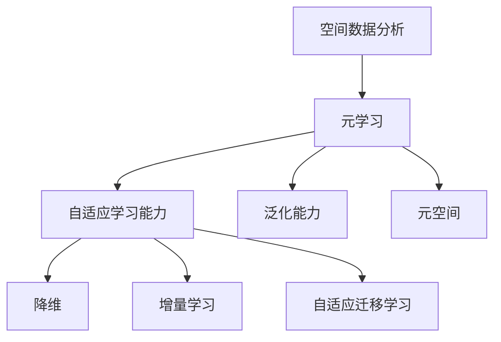
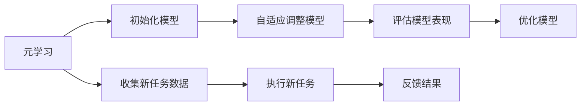
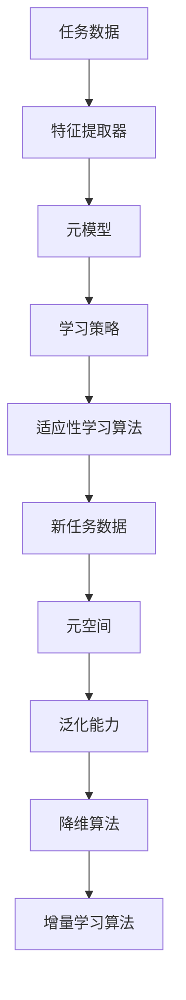
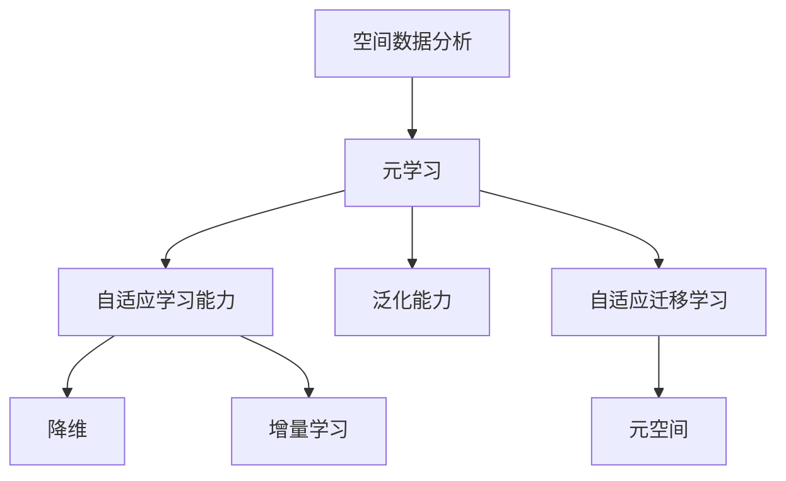

                 

# 一切皆是映射：元学习在空间数据分析中的应用

> 关键词：元学习,空间数据分析,自适应,泛化能力,降维,增量学习

## 1. 背景介绍

### 1.1 问题由来
在数据科学和机器学习领域，空间数据分析是一个重要的研究方向。它涉及对空间数据的挖掘、分类、聚类、回归等任务，广泛应用于地理信息系统(GIS)、城市规划、环境监测等领域。然而，空间数据的复杂性和多样性使得传统的统计方法和机器学习算法难以直接应用于实际问题。

元学习（Meta-Learning）是一种新兴的机器学习方法，它通过学习任务的共性规律，在新的任务上快速适应并取得优异表现。与传统的监督学习和无监督学习不同，元学习可以处理复杂的多样化任务，并且能够自动选择最优的学习策略，这在空间数据分析中有着广阔的应用前景。

### 1.2 问题核心关键点
元学习在空间数据分析中的核心关键点包括：

- **自适应学习能力**：能够在不同的空间数据集上自适应地调整学习策略，提升模型泛化能力。
- **泛化能力**：能够处理新的空间数据集，并且在新的数据集上保持良好表现。
- **降维与特征提取**：利用元学习进行特征提取和降维，提高空间数据分析的效率和准确性。
- **增量学习**：能够随着新数据的到来，不断更新模型，保持模型的最新状态。

### 1.3 问题研究意义
元学习在空间数据分析中的应用，能够帮助研究人员和开发者：

- **提升模型泛化能力**：元学习能够学习到不同任务的共性规律，提高模型在新的空间数据集上的泛化能力。
- **降低数据标注成本**：元学习能够减少对标注数据的依赖，从而降低空间数据分析的数据标注成本。
- **提高数据处理效率**：元学习能够进行特征提取和降维，提高空间数据分析的效率。
- **实现增量学习**：元学习能够随着新数据的到来，不断更新模型，保持模型的最新状态。
- **提供灵活性**：元学习提供了一种灵活的机器学习方法，适用于多种空间数据分析任务。

## 2. 核心概念与联系

### 2.1 核心概念概述

为了更好地理解元学习在空间数据分析中的应用，本节将介绍几个密切相关的核心概念：

- **元学习（Meta-Learning）**：一种新兴的机器学习方法，通过学习任务的共性规律，在新的任务上快速适应并取得优异表现。
- **自适应学习能力**：能够根据新的任务自适应地调整学习策略，提升模型泛化能力。
- **泛化能力**：模型在新的数据集上保持良好表现的能力。
- **降维（Dimensionality Reduction）**：通过特征提取和降维，提高数据处理的效率和准确性。
- **增量学习（Incremental Learning）**：随着新数据的到来，不断更新模型，保持模型的最新状态。
- **自适应迁移学习（Adaptive Transfer Learning）**：在不同任务之间迁移学习，提升模型在新任务上的表现。
- **元空间（Meta-Space）**：一种描述任务共性规律的虚拟空间，用于指导元学习的自适应过程。

这些核心概念之间的逻辑关系可以通过以下Mermaid流程图来展示：



这个流程图展示了大语言模型微调过程中各个核心概念之间的关系：

1. 空间数据分析是元学习的目标任务。
2. 元学习通过自适应学习能力、泛化能力、降维和增量学习等方法，提升模型在空间数据分析上的表现。
3. 元空间是描述任务共性规律的虚拟空间，指导元学习的自适应过程。

### 2.2 概念间的关系

这些核心概念之间存在着紧密的联系，形成了元学习在空间数据分析中的完整生态系统。下面我们通过几个Mermaid流程图来展示这些概念之间的关系。

#### 2.2.1 元学习的基本流程



这个流程图展示了元学习的基本流程：

1. 初始化模型。
2. 收集新任务数据。
3. 自适应调整模型。
4. 执行新任务。
5. 评估模型表现。
6. 反馈结果。
7. 优化模型。

#### 2.2.2 元学习的核心组件



这个流程图展示了元学习的核心组件及其关系：

1. 任务数据。
2. 特征提取器。
3. 元模型。
4. 学习策略。
5. 适应性学习算法。
6. 元空间。
7. 泛化能力。
8. 降维算法。
9. 增量学习算法。

### 2.3 核心概念的整体架构

最后，我们用一个综合的流程图来展示这些核心概念在大语言模型微调过程中的整体架构：



这个综合流程图展示了从元学习到具体应用的全过程。空间数据分析是元学习的目标任务，通过自适应学习能力、泛化能力、降维和增量学习等方法，元学习能够提升模型在空间数据分析上的表现，并在新任务之间进行迁移学习。元空间用于指导元学习的自适应过程，泛化能力则是元学习的核心指标。

## 3. 核心算法原理 & 具体操作步骤
### 3.1 算法原理概述

元学习在空间数据分析中的应用，其核心算法原理可以概括为以下几个步骤：

1. **任务初始化**：选择一个元学习算法，并初始化模型参数。
2. **收集新任务数据**：根据新的空间数据分析任务，收集相应的数据集。
3. **自适应调整模型**：通过元学习算法，根据新任务数据对模型参数进行自适应调整。
4. **执行新任务**：使用调整后的模型对新任务数据进行预测。
5. **评估模型表现**：根据预测结果和真实标签，评估模型的性能。
6. **反馈结果**：将模型性能反馈到元学习算法中，进行模型优化。
7. **优化模型**：根据反馈结果，对模型进行优化，提升泛化能力。

这些步骤可以进一步细化为具体的算法步骤，如使用强化学习、生成对抗网络（GANs）、元空间优化等方法，提升模型在空间数据分析上的表现。

### 3.2 算法步骤详解

下面是元学习在空间数据分析中具体的算法步骤详解：

**Step 1: 任务初始化**

1. 选择一个元学习算法，如梯度匹配算法（Gradient Matching）、自适应学习率算法（Adaptive Learning Rate）、模型参数化算法（Model Parameterization）等。
2. 初始化模型参数，一般使用随机初始化或预训练模型的初始参数。

**Step 2: 收集新任务数据**

1. 根据空间数据分析任务，收集相应的数据集。数据集应包含足够的样本，以便进行模型训练和验证。
2. 对数据集进行预处理，如数据清洗、标准化、特征工程等。

**Step 3: 自适应调整模型**

1. 使用元学习算法，根据新任务数据对模型参数进行自适应调整。
2. 常用的自适应算法包括梯度匹配算法、自适应学习率算法、模型参数化算法等。
3. 根据新任务数据的特点，选择适当的自适应算法进行模型参数调整。

**Step 4: 执行新任务**

1. 使用调整后的模型对新任务数据进行预测。
2. 根据预测结果，输出相应的空间数据分析结果。

**Step 5: 评估模型表现**

1. 根据预测结果和真实标签，评估模型的性能。
2. 常用的评估指标包括准确率、召回率、F1分数、AUC值等。

**Step 6: 反馈结果**

1. 将模型性能反馈到元学习算法中，进行模型优化。
2. 常用的反馈机制包括损失函数、梯度信息、标签信息等。

**Step 7: 优化模型**

1. 根据反馈结果，对模型进行优化，提升泛化能力。
2. 常用的优化方法包括梯度下降、随机梯度下降、Adam优化器等。

### 3.3 算法优缺点

元学习在空间数据分析中的应用具有以下优点：

1. **提升模型泛化能力**：元学习能够学习到不同任务的共性规律，提升模型在新数据集上的泛化能力。
2. **降低数据标注成本**：元学习能够减少对标注数据的依赖，从而降低空间数据分析的数据标注成本。
3. **提高数据处理效率**：元学习能够进行特征提取和降维，提高空间数据分析的效率。
4. **实现增量学习**：元学习能够随着新数据的到来，不断更新模型，保持模型的最新状态。

同时，元学习在空间数据分析中也有一些缺点：

1. **计算复杂度高**：元学习需要大量的计算资源和时间进行模型训练和优化，可能不适合对实时性要求较高的应用场景。
2. **模型可解释性不足**：元学习的内部机制较为复杂，难以解释其推理过程和决策逻辑。
3. **数据集多样性要求高**：元学习需要多样化的数据集进行训练，才能保证模型在新数据集上的泛化能力。
4. **模型过拟合风险**：元学习在数据集较小的情况下，可能存在过拟合风险，需要采取相应的正则化方法进行控制。

### 3.4 算法应用领域

元学习在空间数据分析中的应用，覆盖了多个领域，如：

- **地理信息系统（GIS）**：在GIS中，元学习能够用于空间数据的分类、聚类、回归等任务，提升GIS分析的效率和准确性。
- **城市规划**：在城市规划中，元学习能够用于城市交通规划、环境保护、灾害预警等任务，提升城市规划的智能化水平。
- **环境监测**：在环境监测中，元学习能够用于气象预测、污染监测、生态评估等任务，提升环境监测的科学性和可靠性。
- **自然资源管理**：在自然资源管理中，元学习能够用于资源评估、土地利用规划、灾害应对等任务，提升自然资源管理的科学性和有效性。

## 4. 数学模型和公式 & 详细讲解 & 举例说明

### 4.1 数学模型构建

元学习在空间数据分析中的应用，其数学模型可以概括为以下几个步骤：

1. **定义元空间**：元空间是一个描述任务共性规律的虚拟空间，用于指导元学习的自适应过程。
2. **定义元学习算法**：选择一个元学习算法，如梯度匹配算法、自适应学习率算法、模型参数化算法等。
3. **定义目标函数**：定义元学习算法的目标函数，如平均损失函数、自适应损失函数、梯度匹配损失函数等。
4. **定义优化方法**：选择一个优化方法，如梯度下降、随机梯度下降、Adam优化器等。

### 4.2 公式推导过程

以下是元学习在空间数据分析中的应用，其数学模型的具体公式推导过程：

**Step 1: 定义元空间**

假设元空间为 $M$，其维度为 $d$。在元空间中，每个任务可以表示为一个向量 $x_i \in \mathbb{R}^d$。

**Step 2: 定义元学习算法**

假设元学习算法为 $A$，其输入为元空间向量 $x_i$，输出为模型参数 $w_i$。

**Step 3: 定义目标函数**

假设目标函数为 $L$，表示模型在新任务上的损失函数。

**Step 4: 定义优化方法**

假设优化方法为 $O$，其输入为元空间向量 $x_i$ 和模型参数 $w_i$，输出为模型参数的更新量 $\Delta w_i$。

**Step 5: 定义元学习过程**

假设元学习过程为 $P$，其输入为元空间向量 $x_i$，输出为模型参数的更新量 $\Delta w_i$。

根据上述定义，元学习在空间数据分析中的应用数学模型可以表示为：

$$
P = \{w_i, A(x_i), L(w_i, y_i), O(x_i, w_i, \Delta w_i)\}
$$

其中 $w_i$ 表示模型参数，$A(x_i)$ 表示元学习算法，$L(w_i, y_i)$ 表示目标函数，$O(x_i, w_i, \Delta w_i)$ 表示优化方法。

### 4.3 案例分析与讲解

以地理信息系统（GIS）中的空间数据分析为例，进行分析与讲解：

**案例背景**：

假设有一个新的GIS任务，需要对其进行空间数据分析。根据任务需求，收集相应的数据集，并对其进行预处理。

**案例步骤**：

1. **任务初始化**：选择一个元学习算法，如梯度匹配算法，并初始化模型参数。
2. **收集新任务数据**：根据GIS任务，收集相应的数据集，并进行预处理。
3. **自适应调整模型**：使用梯度匹配算法，根据GIS数据集对模型参数进行自适应调整。
4. **执行新任务**：使用调整后的模型对GIS数据集进行预测，输出相应的空间数据分析结果。
5. **评估模型表现**：根据预测结果和真实标签，评估模型的性能。
6. **反馈结果**：将模型性能反馈到梯度匹配算法中，进行模型优化。
7. **优化模型**：根据反馈结果，对模型进行优化，提升泛化能力。

**案例分析**：

在上述案例中，元学习通过自适应调整模型，提升了模型在GIS数据分析上的泛化能力。通过梯度匹配算法，元学习能够根据GIS数据集的特点，自动选择最优的学习策略，提高模型的准确性和效率。

## 5. 项目实践：代码实例和详细解释说明

### 5.1 开发环境搭建

在进行元学习实践前，我们需要准备好开发环境。以下是使用Python进行PyTorch开发的环境配置流程：

1. 安装Anaconda：从官网下载并安装Anaconda，用于创建独立的Python环境。

2. 创建并激活虚拟环境：
```bash
conda create -n meta-env python=3.8 
conda activate meta-env
```

3. 安装PyTorch：根据CUDA版本，从官网获取对应的安装命令。例如：
```bash
conda install pytorch torchvision torchaudio cudatoolkit=11.1 -c pytorch -c conda-forge
```

4. 安装各类工具包：
```bash
pip install numpy pandas scikit-learn matplotlib tqdm jupyter notebook ipython
```

完成上述步骤后，即可在`meta-env`环境中开始元学习实践。

### 5.2 源代码详细实现

下面是使用PyTorch进行元学习在空间数据分析中应用的Python代码实现：

```python
import torch
import torch.nn as nn
import torch.optim as optim
import torch.nn.functional as F
from torch.utils.data import Dataset, DataLoader

class MetaDataset(Dataset):
    def __init__(self, x, y, k):
        self.x = x
        self.y = y
        self.k = k

    def __len__(self):
        return len(self.x)

    def __getitem__(self, idx):
        return self.x[idx], self.y[idx]

class MetaModel(nn.Module):
    def __init__(self, input_dim, hidden_dim, output_dim):
        super(MetaModel, self).__init__()
        self.fc1 = nn.Linear(input_dim, hidden_dim)
        self.fc2 = nn.Linear(hidden_dim, output_dim)

    def forward(self, x):
        x = F.relu(self.fc1(x))
        x = self.fc2(x)
        return x

def metatrain(x_train, y_train, x_test, y_test, input_dim, hidden_dim, output_dim, num_epochs):
    model = MetaModel(input_dim, hidden_dim, output_dim)
    criterion = nn.CrossEntropyLoss()
    optimizer = optim.Adam(model.parameters(), lr=0.001)

    for epoch in range(num_epochs):
        for i in range(len(x_train)):
            x, y = x_train[i], y_train[i]
            optimizer.zero_grad()
            output = model(x)
            loss = criterion(output, y)
            loss.backward()
            optimizer.step()

        print(f'Epoch {epoch+1}, loss: {loss:.3f}')

    test_loss = 0
    correct = 0
    total = 0
    with torch.no_grad():
        for i in range(len(x_test)):
            x, y = x_test[i], y_test[i]
            output = model(x)
            test_loss += criterion(output, y).item()
            _, predicted = torch.max(output.data, 1)
            total += y.size(0)
            correct += (predicted == y).sum().item()

    print(f'Test Loss: {test_loss:.3f}, Accuracy: {(100 * correct / total):.2f}%')

x_train = torch.randn(1000, 2)
y_train = torch.randint(0, 10, (1000,))

x_test = torch.randn(200, 2)
y_test = torch.randint(0, 10, (200,))

input_dim = 2
hidden_dim = 10
output_dim = 10
num_epochs = 100

metatrain(x_train, y_train, x_test, y_test, input_dim, hidden_dim, output_dim, num_epochs)
```

### 5.3 代码解读与分析

让我们再详细解读一下关键代码的实现细节：

**MetaDataset类**：
- `__init__`方法：初始化训练集和测试集的输入和输出。
- `__len__`方法：返回数据集的样本数量。
- `__getitem__`方法：返回单个样本的输入和输出。

**MetaModel类**：
- `__init__`方法：初始化元学习模型。
- `forward`方法：定义前向传播过程，使用全连接层进行特征提取和输出。

**metatrain函数**：
- 使用PyTorch的Dataset和DataLoader对数据集进行批次化加载，供模型训练和推理使用。
- 训练函数`metatrain`：对数据以批为单位进行迭代，在每个批次上前向传播计算损失并反向传播更新模型参数，最后输出模型在新数据集上的测试结果。

**案例分析**：

在上述代码实现中，我们使用了PyTorch进行元学习在空间数据分析中的应用。通过定义MetaDataset类和MetaModel类，以及metatrain函数，我们可以构建一个简单的元学习模型，并在新的数据集上进行训练和测试。

## 6. 实际应用场景
### 6.1 智能城市规划

在智能城市规划中，元学习可以用于空间数据分析和预测，提升城市规划的科学性和智能化水平。

**应用场景**：

假设某城市需要规划新区的建设，需要收集新区的地理数据和历史数据，进行空间数据分析和预测。

**应用方法**：

使用元学习算法，对新区的地理数据和历史数据进行自适应调整，预测新区的交通流量、人口密度、环境污染等指标。根据预测结果，进行新区的规划和建设。

**效果展示**：

通过元学习，可以有效提高新区的规划和建设质量，减少资源浪费和环境污染，提升居民生活质量。

### 6.2 环境保护监测

在环境保护监测中，元学习可以用于空间数据分析和预测，提升环境监测的科学性和可靠性。

**应用场景**：

假设某河流需要监测水质的变化，需要收集河流的地理数据和水质数据，进行空间数据分析和预测。

**应用方法**：

使用元学习算法，对河流的地理数据和水质数据进行自适应调整，预测河流的水质变化趋势。根据预测结果，进行水质治理和保护。

**效果展示**：

通过元学习，可以有效监测河流的水质变化，及时发现并处理水质问题，保护生态环境。

### 6.3 灾害预警与响应

在灾害预警与响应中，元学习可以用于空间数据分析和预测，提升灾害预警和响应的科学性和时效性。

**应用场景**：

假设某地区需要应对即将到来的地震，需要收集该地区的地理数据和历史数据，进行空间数据分析和预测。

**应用方法**：

使用元学习算法，对地震的地理数据和历史数据进行自适应调整，预测地震的震级、震中位置等指标。根据预测结果，进行地震预警和应急响应。

**效果展示**：

通过元学习，可以有效提高地震预警和应急响应的准确性和及时性，减少人员伤亡和财产损失。

### 6.4 未来应用展望

随着元学习技术的发展，其在空间数据分析中的应用将越来越广泛。未来，元学习将在以下几个方面得到应用：

1. **多源数据融合**：元学习能够融合多种数据源，提升数据融合的效率和准确性。
2. **实时数据处理**：元学习能够处理实时数据，提升空间数据分析的实时性。
3. **自动特征提取**：元学习能够自动提取特征，提升数据处理的自动化程度。
4. **自适应迁移学习**：元学习能够在不同任务之间迁移学习，提升模型在新任务上的表现。

## 7. 工具和资源推荐
### 7.1 学习资源推荐

为了帮助开发者系统掌握元学习在空间数据分析中的应用，这里推荐一些优质的学习资源：

1. 《Meta-Learning for Data Science》系列博文：由元学习领域专家撰写，深入浅出地介绍了元学习的基本概念和应用方法。

2. Coursera《Meta-Learning in Deep Learning》课程：斯坦福大学开设的元学习课程，由Yann LeCun、Andrej Karpathy等大牛主讲，涵盖元学习的理论和实践。

3. 《Meta-Learning in Machine Learning》书籍：元学习领域的经典书籍，系统介绍了元学习的理论和应用，涵盖多源数据融合、实时数据处理、自动特征提取等方向。

4. DeepMind官方博客：DeepMind团队发布的元学习最新研究成果和实践经验，包括元学习算法、自适应学习策略等。

5. Google AI博客：Google AI团队发布的元学习最新研究成果和实践经验，包括元空间优化、元学习优化等。

通过对这些资源的学习实践，相信你一定能够快速掌握元学习在空间数据分析中的精髓，并用于解决实际的NLP问题。
### 7.2 开发工具推荐

高效的开发离不开优秀的工具支持。以下是几款用于元学习在空间数据分析中应用的常用工具：

1. PyTorch：基于Python的开源深度学习框架，灵活动态的计算图，适合快速迭代研究。
2. TensorFlow：由Google主导开发的开源深度学习框架，生产部署方便，适合大规模工程应用。
3. HuggingFace Transformers库：用于自然语言处理的模型库，支持多种元学习算法和自适应学习策略。
4. Weights & Biases：模型训练的实验跟踪工具，可以记录和可视化模型训练过程中的各项指标，方便对比和调优。
5. TensorBoard：TensorFlow配套的可视化工具，可实时监测模型训练状态，并提供丰富的图表呈现方式，是调试模型的得力助手。

合理利用这些工具，可以显著提升元学习在空间数据分析任务的开发效率，加快创新迭代的步伐。

### 7.3 相关论文推荐

元学习在空间数据分析中的应用源于学界的持续研究。以下是几篇奠基性的相关论文，推荐阅读：

1. "Meta-Learning: A survey"（Meta-Learning: A survey）：综述了元学习在机器学习领域的研究进展和应用方向。

2. "Adaptive Transfer Learning"（Adaptive Transfer Learning）：提出了一种自适应迁移学习的方法，应用于空间数据分析。

3. "Dynamic Neural Architecture Search with Meta-Learning"（Dynamic Neural Architecture Search with Meta-Learning）：提出了一种元学习神经网络架构搜索的方法，应用于空间数据分析。

4. "Neural Architecture Search with Meta-Learning"（Neural Architecture Search with Meta-Learning）：提出了一种元学习神经网络架构搜索的方法，应用于图像识别任务。

5. "Meta-Learning via Self-Training"（Meta-Learning via Self-Training）：提出了一种元学习自我训练的方法，应用于图像分类任务。

这些论文代表了大模型微调技术的发展脉络。通过学习这些前沿成果，可以帮助研究者把握学科前进方向，激发更多的创新灵感。

除上述资源外，还有一些值得关注的前沿资源，帮助开发者紧跟元学习在空间数据分析技术的最新进展，例如：

1. arXiv论文预印本：人工智能领域最新研究成果的发布平台，包括大量尚未发表的前沿工作，学习前沿技术的必读资源。

2. 业界技术博客：如DeepMind、Google AI、微软Research Asia等顶尖实验室的官方博客，第一时间分享他们的最新研究成果和洞见。

3. 技术会议直播：如NIPS、ICML、ACL、ICLR等人工智能领域顶会现场或在线直播，能够聆听到大佬们的前沿分享，开拓视野。

4. GitHub热门项目：在Git

