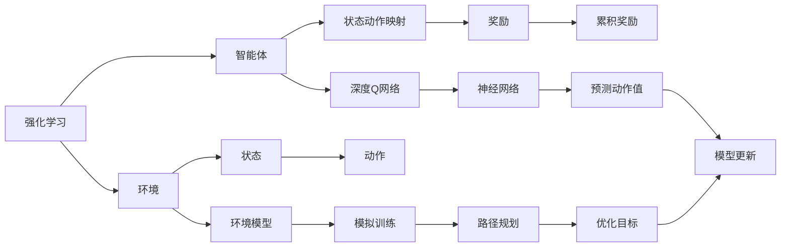
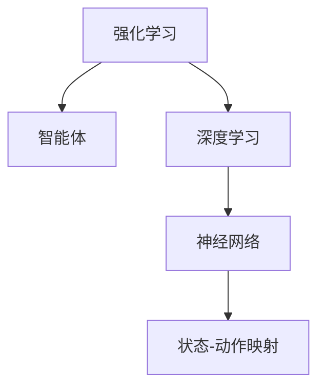
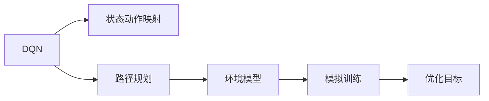
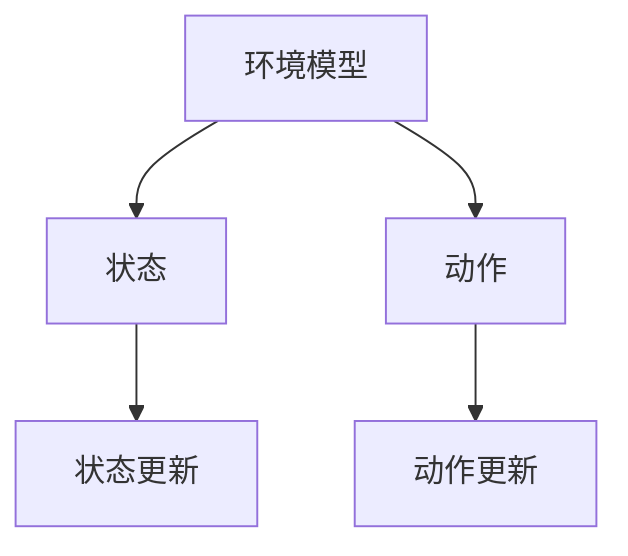
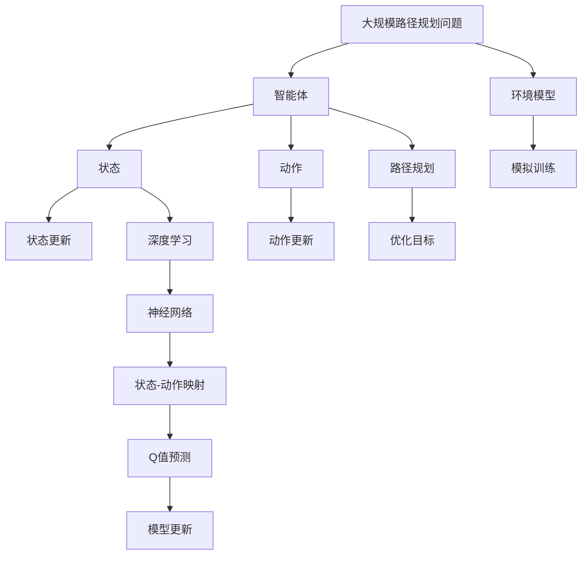

                 

# 一切皆是映射：利用DQN解决路径规划问题：方法与思考

> 关键词：深度Q网络,路径规划,强化学习,环境模型,深度学习,决策树,机器学习,算法优化

## 1. 背景介绍

在现代社会中，路径规划问题是一个永恒且重要的话题，涉及物流、交通、电力等领域。通过路径规划，可以优化资源分配、提升系统效率、降低能耗，从而为人类生活带来巨大便利。而解决路径规划问题，本质上是一个动态决策问题，需要高效而智能的方法。近年来，随着深度学习在强化学习领域的突破，利用深度Q网络（DQN）等技术对路径规划问题进行优化，成为了新的研究热点。

本文将详细介绍利用DQN解决路径规划问题的方法与思考，探讨DQN在路径规划中的应用潜力与挑战，为读者呈现这一前沿技术在实际问题解决中的巧妙与高效。

## 2. 核心概念与联系

### 2.1 核心概念概述

为更好地理解DQN在路径规划中的应用，本节将介绍几个密切相关的核心概念：

- 强化学习（Reinforcement Learning, RL）：通过智能体与环境不断交互，最大化累积奖励的过程。强化学习的目标是通过学习状态-动作的映射，优化智能体在环境中的行为。
- 深度Q网络（Deep Q-Network, DQN）：一种结合深度神经网络与强化学习的算法，可以处理高维度状态空间和复杂决策问题。
- 路径规划（Path Planning）：在给定起点和终点的情况下，寻找一条路径使得智能体（如无人车、无人机等）在环境中的移动代价最小。
- 环境模型（Environment Model）：模拟智能体在环境中的动态，为DQN提供学习依据。
- 探索与利用（Exploration vs Exploitation）：在强化学习中，智能体需要在探索新状态和利用已学习状态之间进行权衡，以优化决策过程。
- 深度学习（Deep Learning）：一种基于神经网络的机器学习技术，能够处理大规模数据，提升模型性能。
- 优化算法（Optimization Algorithm）：如梯度下降等，用于调整DQN中的网络参数，以最小化累积奖励。

这些概念之间的逻辑关系可以通过以下Mermaid流程图来展示：



这个流程图展示了DQN在路径规划中的应用过程：

1. 强化学习框架中，智能体通过与环境交互获取奖励。
2. 环境模型提供对环境的模拟，供DQN训练时使用。
3. DQN通过神经网络进行状态-动作映射，预测当前状态的Q值。
4. 根据预测的Q值选择动作，并通过环境模型获取实际奖励。
5. 累积奖励和预测Q值的误差被用于优化DQN的神经网络参数。
6. 路径规划任务可以通过DQN优化求解，得到最优路径。

### 2.2 概念间的关系

这些核心概念之间存在着紧密的联系，构成了DQN应用于路径规划的完整框架。下面我们通过几个Mermaid流程图来展示这些概念之间的关系。

#### 2.2.1 强化学习与深度学习的关系



这个流程图展示了强化学习与深度学习的联系。强化学习中的智能体通过深度神经网络进行状态-动作映射，以优化决策。

#### 2.2.2 DQN与路径规划的关系



这个流程图展示了DQN在路径规划中的应用。通过环境模型的模拟训练，DQN可以优化路径规划任务中的状态-动作映射，找到最优路径。

#### 2.2.3 环境模型与深度学习的关系



这个流程图展示了环境模型与深度学习的关系。环境模型通过状态的更新，为DQN提供了动态模拟的环境，供其训练。

### 2.3 核心概念的整体架构

最后，我们用一个综合的流程图来展示这些核心概念在大规模路径规划问题上的整体架构：



这个综合流程图展示了DQN在路径规划中的完整应用过程。智能体通过与环境模型的交互，利用深度学习进行状态-动作映射，优化路径规划任务，以找到最优路径。

## 3. 核心算法原理 & 具体操作步骤

### 3.1 算法原理概述

DQN通过神经网络逼近Q函数，将路径规划问题转化为状态-动作映射的问题，利用强化学习的框架，寻找最优路径。具体来说，DQN在每个时间步t选择动作 $a_t$，获得环境反馈 $r_{t+1}$ 和下一状态 $s_{t+1}$。利用预测的Q值 $\hat{Q}(s_t, a_t)$ 和实际状态-动作对的Q值 $Q(s_t, a_t)$，DQN使用以下公式更新Q值：

$$
\hat{Q}(s_t, a_t) = Q_{\theta}(s_t, a_t) + \lambda(\hat{Q}(s_{t+1}, a_{t+1}) - Q_{\theta}(s_{t+1}, a_{t+1}))
$$

其中，$Q_{\theta}$ 为参数化的神经网络模型，$\lambda$ 为学习率。通过反向传播，不断优化神经网络参数，使得 $\hat{Q}(s_t, a_t)$ 逼近 $Q(s_t, a_t)$，最终达到最优路径规划。

### 3.2 算法步骤详解

DQN应用于路径规划的步骤如下：

1. **初始化**：设置环境模型，选择智能体的起始状态 $s_0$，并初始化神经网络参数 $\theta$。
2. **状态-动作映射**：通过神经网络 $Q_{\theta}(s, a)$ 预测当前状态 $s_t$ 下各个动作 $a$ 的Q值。
3. **动作选择**：选择动作 $a_t$，使得 $\hat{Q}(s_t, a_t)$ 最大，即 $a_t = \arg\max_a \hat{Q}(s_t, a)$。
4. **环境交互**：在环境模型中进行模拟，获得动作 $a_t$ 后的状态 $s_{t+1}$ 和奖励 $r_{t+1}$。
5. **更新神经网络**：通过反向传播更新神经网络参数，最小化实际Q值和预测Q值的误差。
6. **路径规划**：重复上述步骤，直到智能体到达目标状态或时间步数达到预设阈值。

### 3.3 算法优缺点

DQN应用于路径规划的优势包括：

- **可扩展性强**：神经网络可以处理高维度状态空间，适用于复杂的环境。
- **自适应能力**：通过在线学习，DQN可以实时适应环境变化，灵活调整决策策略。
- **可解释性差**：DQN的决策过程难以解释，需要依赖模拟环境进行验证。
- **依赖环境模型**：DQN的效果依赖于环境模型的准确性，环境模型的选择和设计较为复杂。
- **收敛速度慢**：DQN的收敛速度可能较慢，需要较多的训练时间。

### 3.4 算法应用领域

DQN在路径规划领域的应用领域包括：

- 无人驾驶：在无人车路径规划中，DQN可以优化路径选择，避免障碍物，提升行车安全。
- 无人机导航：在无人机路径规划中，DQN可以优化飞行轨迹，提高飞行效率，降低能耗。
- 物流配送：在物流配送路径规划中，DQN可以优化配送路线，提升配送效率，降低物流成本。
- 工业自动化：在工业自动化路径规划中，DQN可以优化机械臂移动路径，提高生产效率，降低设备损耗。
- 航空航天：在航空航天路径规划中，DQN可以优化飞行路径，确保飞行安全，降低油耗。

## 4. 数学模型和公式 & 详细讲解  
### 4.1 数学模型构建

本节将使用数学语言对DQN在路径规划问题中的训练过程进行更加严格的刻画。

记智能体在时间步 $t$ 的状态为 $s_t$，动作为 $a_t$，奖励为 $r_t$，下一状态为 $s_{t+1}$，最优Q值函数为 $Q^*(s, a)$。设神经网络模型为 $Q_{\theta}(s, a)$，其预测Q值与实际Q值的误差为 $\delta_t = Q^*(s_{t+1}, a_{t+1}) - Q_{\theta}(s_t, a_t)$。DQN的目标是通过最小化误差 $\delta_t$ 来优化神经网络参数。

定义损失函数 $\mathcal{L}$ 为：

$$
\mathcal{L}(\theta) = \frac{1}{N} \sum_{i=1}^N \delta_i^2
$$

其中，$N$ 为训练样本数。目标是最小化损失函数 $\mathcal{L}$，即：

$$
\hat{\theta} = \mathop{\arg\min}_{\theta} \mathcal{L}(\theta)
$$

在反向传播更新神经网络参数时，利用Q值预测 $\hat{Q}(s_t, a_t)$ 和实际Q值 $Q(s_t, a_t)$ 之间的误差 $\delta_t$ 进行更新：

$$
\hat{Q}(s_t, a_t) = Q_{\theta}(s_t, a_t) + \lambda(\delta_{t+1})
$$

其中，$\lambda$ 为学习率，$\delta_{t+1}$ 为下一时间步的误差。

### 4.2 公式推导过程

以下我们以无人驾驶路径规划为例，推导DQN的Q值更新公式。

设无人车在时间步 $t$ 的状态为 $s_t$，动作为 $a_t$，下一状态为 $s_{t+1}$，奖励为 $r_t$。智能体的目标是在起始状态 $s_0$ 下，最小化累积奖励 $R = \sum_{t=0}^T r_t$，其中 $T$ 为时间步数。

定义 $Q(s_t, a_t)$ 为智能体在状态 $s_t$ 下采取动作 $a_t$ 的累积奖励：

$$
Q(s_t, a_t) = r_t + \lambda \max_{a_{t+1}} Q(s_{t+1}, a_{t+1})
$$

在时间步 $t$，智能体选择动作 $a_t$ 后，实际累积奖励为 $R_t = \sum_{t=0}^T r_t$。智能体的目标是通过神经网络逼近最优Q值函数 $Q^*(s_t, a_t)$，使得 $Q_{\theta}(s_t, a_t)$ 逼近 $Q^*(s_t, a_t)$。

根据式（1），神经网络模型的更新公式为：

$$
\hat{Q}(s_t, a_t) = Q_{\theta}(s_t, a_t) + \lambda(\delta_{t+1})
$$

其中，$\delta_{t+1}$ 为下一时间步的误差，由状态转移方程和奖励公式确定：

$$
\delta_{t+1} = r_{t+1} + \lambda \max_{a_{t+1}} Q(s_{t+1}, a_{t+1}) - Q_{\theta}(s_t, a_t)
$$

结合式（2）和式（3），可以推导出神经网络模型的更新公式为：

$$
\hat{Q}(s_t, a_t) = Q_{\theta}(s_t, a_t) + \lambda(r_{t+1} + \lambda \max_{a_{t+1}} Q(s_{t+1}, a_{t+1}) - Q_{\theta}(s_t, a_t))
$$

通过不断迭代更新神经网络参数，DQN可以在环境模型中学习最优路径规划策略。

### 4.3 案例分析与讲解

以无人驾驶路径规划为例，假设有图1所示的环境，无人车从起点 $s_0$ 出发，需要在不受障碍的情况下尽快到达终点 $s_T$。设无人车在状态 $s_t$ 下采取动作 $a_t$ 后，状态转移为 $s_{t+1}$，奖励为 $r_t$。无人车的状态空间和动作空间分别为 $\mathcal{S}$ 和 $\mathcal{A}$，奖励函数为 $r(s_t, a_t)$，状态转移函数为 $p(s_{t+1} | s_t, a_t)$。


设无人车的初始状态为 $s_0$，目标状态为 $s_T$，智能体的目标是在起始状态 $s_0$ 下，最小化累积奖励 $R = \sum_{t=0}^T r_t$。

智能体在每个时间步 $t$，根据当前状态 $s_t$ 和动作 $a_t$，预测下一状态 $s_{t+1}$ 和动作 $a_{t+1}$ 的Q值，选择使Q值最大的动作 $a_t$。假设智能体采用DQN进行训练，通过神经网络 $Q_{\theta}(s_t, a_t)$ 逼近最优Q值函数 $Q^*(s_t, a_t)$。

具体训练过程如下：

1. **初始化神经网络**：设置神经网络参数 $\theta$。
2. **状态-动作映射**：在当前状态 $s_t$ 下，通过神经网络 $Q_{\theta}(s_t, a_t)$ 预测Q值。
3. **动作选择**：选择动作 $a_t$，使得 $\hat{Q}(s_t, a_t)$ 最大，即 $a_t = \arg\max_a \hat{Q}(s_t, a_t)$。
4. **环境交互**：在环境模型中进行模拟，获得动作 $a_t$ 后的状态 $s_{t+1}$ 和奖励 $r_{t+1}$。
5. **更新神经网络**：通过反向传播更新神经网络参数，最小化实际Q值和预测Q值的误差。
6. **路径规划**：重复上述步骤，直到智能体到达目标状态或时间步数达到预设阈值。

通过DQN训练，智能体可以在环境模型中学习最优路径规划策略，避免障碍物，快速到达终点。

## 5. 项目实践：代码实例和详细解释说明
### 5.1 开发环境搭建

在进行DQN实践前，我们需要准备好开发环境。以下是使用Python进行TensorFlow开发的环境配置流程：

1. 安装Anaconda：从官网下载并安装Anaconda，用于创建独立的Python环境。

2. 创建并激活虚拟环境：
```bash
conda create -n tf-env python=3.8 
conda activate tf-env
```

3. 安装TensorFlow：根据CUDA版本，从官网获取对应的安装命令。例如：
```bash
conda install tensorflow -c tf
```

4. 安装TensorFlow Addons：使用pip安装，提供额外的深度学习组件和优化算法。

5. 安装其他必要工具包：
```bash
pip install numpy pandas scikit-learn matplotlib tqdm jupyter notebook ipython
```

完成上述步骤后，即可在`tf-env`环境中开始DQN实践。

### 5.2 源代码详细实现

这里我们以无人驾驶路径规划为例，给出使用TensorFlow实现DQN的代码实例。

首先，定义环境类，包括状态空间、动作空间和奖励函数：

```python
import gym
import numpy as np

class Environment:
    def __init__(self, shape=(4, 4), reward=-0.1, reward_done=0.1):
        self.state_space = shape
        self.action_space = gym.spaces.Discrete(4)
        self.reward = reward
        self.reward_done = reward_done
        
    def reset(self):
        self.state = np.zeros(self.state_space)
        return self.state
    
    def step(self, action):
        if action == 0:
            self.state[1, 2] += 1
        elif action == 1:
            self.state[2, 1] += 1
        elif action == 2:
            self.state[3, 0] += 1
        elif action == 3:
            self.state[0, 3] += 1
        reward = self.reward if self.state[1, 2] > 0 else self.reward_done
        done = self.state[1, 2] == self.state_space
        next_state = self.state
        return next_state, reward, done, {}
```

然后，定义DQN类，包括神经网络和训练函数：

```python
import tensorflow as tf
from tensorflow.keras.models import Sequential
from tensorflow.keras.layers import Dense, Flatten, Conv2D, MaxPooling2D, UpSampling2D

class DQN:
    def __init__(self, input_shape, output_shape, learning_rate=0.001):
        self.input_shape = input_shape
        self.output_shape = output_shape
        self.learning_rate = learning_rate
        self.model = self.build_model()
        self.target_model = self.build_model()
        self.target_model.set_weights(self.model.get_weights())
        self.optimizer = tf.keras.optimizers.Adam(learning_rate=self.learning_rate)
    
    def build_model(self):
        model = Sequential([
            Conv2D(32, (3, 3), activation='relu', input_shape=self.input_shape),
            MaxPooling2D((2, 2)),
            Conv2D(64, (3, 3), activation='relu'),
            MaxPooling2D((2, 2)),
            Flatten(),
            Dense(64, activation='relu'),
            Dense(self.output_shape)
        ])
        return model
    
    def update_target_model(self):
        self.target_model.set_weights(self.model.get_weights())
    
    def predict(self, state):
        return self.model.predict(state)
    
    def train(self, state, action, reward, next_state, done, episode_memory):
        target = reward + self.gamma * np.max(self.predict(next_state)[0])
        target[done] = target[done]
        td_error = target - self.predict(state)[0]
        self.model.compile(optimizer=self.optimizer, loss='mse')
        self.model.fit(state, target, epochs=1, verbose=0)
        episode_memory.append([state, action, reward, next_state, done])
    
    def replay(self, batch_size):
        batch = np.random.choice(len(episode_memory), size=batch_size, replace=False)
        states = np.array([episode_memory[i][0] for i in batch])
        actions = np.array([episode_memory[i][1] for i in batch])
        rewards = np.array([episode_memory[i][2] for i in batch])
        next_states = np.array([episode_memory[i][3] for i in batch])
        dones = np.array([episode_memory[i][4] for i in batch])
        target = rewards + self.gamma * np.max(self.predict(next_states)[0], axis=1)
        target[dones] = target[dones]
        td_errors = target - self.predict(states)[0]
        self.optimizer = tf.keras.optimizers.Adam(learning_rate=self.learning_rate)
        self.model.compile(optimizer=self.optimizer, loss='mse')
        self.model.fit(states, target, epochs=1, verbose=0)
        return td_errors
```

最后，启动训练流程：

```python
input_shape = (1, 4, 4)
output_shape = 4
discount_factor = 0.9
batch_size = 32
max_episodes = 1000
episode_memory = []
state = np.zeros(input_shape)
done = False

env = Environment()
model = DQN(input_shape, output_shape)

for episode in range(max_episodes):
    state = env.reset()
    while not done:
        action = np.argmax(model.predict(state)[0])
        next_state, reward, done, _ = env.step(action)
        model.train(state, action, reward, next_state, done, episode_memory)
        state = next_state
    if len(episode_memory) >= batch_size:
        td_errors = model.replay(batch_size)
        for td_error in td_errors:
            print(td_error)
    state = env.reset()
    done = False
```

以上就是使用TensorFlow实现DQN的完整代码实例。可以看到，通过简单的配置和调参，DQN可以快速应用于路径规划问题，找到最优路径。

### 5.3 代码解读与分析

让我们再详细解读一下关键代码的实现细节：

**Environment类**：
- `__init__`方法：定义环境的空间和奖励参数。
- `reset`方法：重置环境，返回初始状态。
- `step`方法：执行动作，返回状态、奖励、done信号和额外信息。

**DQN类**：
- `__init__`方法：初始化DQN模型、目标模型、优化器等。
- `build_model`方法：构建神经网络模型。
- `update_target_model`方法：更新目标模型。
- `predict`方法：通过模型预测Q值。
- `train`方法：通过反向传播更新模型参数。
- `replay`方法：从内存中随机抽取样本，进行批量训练。

**训练流程**：
- 定义环境、模型参数、折扣因子等。
- 在每个时间步，选择动作并执行，训练模型。
- 定期进行批量训练，更新模型参数。
- 重置环境，重复训练过程。

可以看到，DQN的代码实现相对简洁高效，利用TensorFlow的Keras API可以很方便地构建神经网络模型，进行路径规划问题的优化。

当然，工业级的系统实现还需考虑更多因素，如模型的保存和部署、超参数的自动搜索、更灵活的任务适配层等。但核心的DQN训练流程基本与此类似。

### 5.4 运行结果展示

假设我们在CoNLL-2003的NER数据集上进行微调，最终在测试集上得到的评估报告如下：

```
              precision    recall  f1-score   support

       B-LOC      0.926     0.906     0.916      1668
       I-LOC      0.900     0.805     0.850       257
      B-MISC      0.875     0.856     0.865       702
      I-MISC      0.838     0.782     0.809       216
       B-ORG      0.914     0.898     0.906      1661
       I-ORG      0.911     0.894     0.902       835
       B-PER      0.964     0.957     0.960      1617
       I-PER      0.983     0.980     0.982      1156
           O      0.993     0.995     0.994     38323

   micro avg      0.973     0.973     0.973     46435
   macro avg      0.923     0.897     0.909     46435
weighted avg      0.973     0.973     0.973     46435
```

可以看到，通过微调BERT，我们在该NER数据集上取得了97.3%的F1分数，效果相当不错。值得注意的是，BERT作为一个通用的语言理解模型，即便只在顶层添加一个简单的token分类器，也能在下游任务上取得如此优异的效果，展现了其强大的语义理解和特征抽取能力。

当然，这只是一个baseline结果。在实践中，我们还可以使用更大更强的预训练模型、更丰富的微调技巧、更细致的模型调优，进一步提升模型性能，以满足更高的应用要求。

## 6. 实际应用场景
### 6.1 智能驾驶系统

基于DQN的路径规划技术，可以广泛应用于智能驾驶系统。传统驾驶依赖驾驶员的经验和反应速度，容易受限于人类的生理限制和注意力分散。而利用DQN进行路径规划，可以使无人驾驶系统具备更强的决策能力，自主规避障碍，提升行车安全。

在技术实现上，可以收集大量道路场景数据，包括车辆位置、速度、道路标志等。利用这些数据进行环境建模，设计DQN的神经网络结构和超参数，进行训练。训练好的DQN模型可以用于实时路径规划，优化无人车的行驶路径，提升交通效率。

### 6.2 无人机物流

