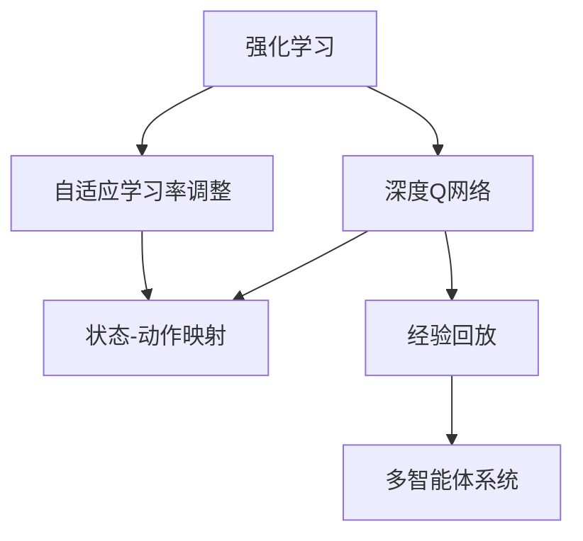

                 

# 一切皆是映射：基于DQN的自适应学习率调整机制探究

> 关键词：深度强化学习(DRL), 深度Q网络(DQN), 自适应学习率, 状态-动作映射, 经验回放(Experience Replay), 多智能体系统(MAS), 异步训练

## 1. 背景介绍

在深度学习（Deep Learning, DL）的浩瀚星空中，强化学习（Reinforcement Learning, RL）是一颗璀璨的明星，其显著的特质就是能够通过试错机制学习到最优的决策策略。然而，强化学习本质上是一个经验驱动的过程，如何在样本有限的情况下高效学习，成为其面临的重大挑战。

在此背景下，一种名为深度Q网络（Deep Q Network, DQN）的方法应运而生，并迅速在各个领域（游戏AI、机器人控制、推荐系统等）大放异彩。DQN结合了深度神经网络与强化学习的优势，能够自适应地学习最优的Q值函数，通过状态-动作映射的方式，实现智能决策。

不过，DQN的训练过程中，学习率的选择对性能影响巨大。学习率太小，模型更新缓慢，难以收敛；学习率太大，则容易发生梯度爆炸，甚至出现发散的情况。为此，我们引入了自适应学习率调整机制，根据训练过程中样本数据的质量，动态调整学习率，以期进一步提升DQN的训练效果。

## 2. 核心概念与联系

### 2.1 核心概念概述

为了深入理解基于DQN的自适应学习率调整机制，我们首先需要介绍几个关键概念：

- 强化学习（Reinforcement Learning, RL）：一种基于奖惩反馈机制的机器学习范式。智能体通过与环境互动，不断调整策略，以最大化累积奖励。
- 深度Q网络（Deep Q Network, DQN）：一种基于Q-learning的深度强化学习算法，通过神经网络逼近Q值函数，实现智能决策。
- 自适应学习率调整（Adaptive Learning Rate Adjustment）：一种动态调整学习率的机制，旨在根据训练样本的质量，及时调整模型更新步长，提升训练效率。
- 状态-动作映射（State-Action Mapping）：强化学习中的一个关键概念，描述智能体从当前状态到采取动作的映射关系。
- 经验回放（Experience Replay）：DQN中的一种数据增强技术，通过将样本数据存储到经验池中，随机抽取数据进行回放训练，提升模型泛化能力。
- 多智能体系统（Multi-Agent System, MAS）：一种分布式强化学习系统，由多个智能体并行工作，协同优化全局目标。

这些核心概念通过深度学习、强化学习的框架，构成了一种新型的学习范式，实现了智能决策的自动化和优化。

### 2.2 核心概念的关系

为了更好地理解这些概念之间的关系，我们通过一个Mermaid流程图来展示：



这个流程图展示了各个核心概念之间的联系：

1. 强化学习是基础，提供了奖惩反馈的机制。
2. 深度Q网络是具体实现，通过神经网络逼近Q值函数，实现智能决策。
3. 自适应学习率调整在DQN中发挥作用，动态调整学习率，提升训练效率。
4. 状态-动作映射描述了智能体如何从状态到动作映射决策。
5. 经验回放是DQN的数据增强技术，通过经验池的随机抽取，提升模型泛化能力。
6. 多智能体系统展示了分布式训练的优越性，多个智能体协同优化全局目标。

通过这些概念的互相支撑，我们可以构建出一个高效的强化学习框架，实现智能决策和优化。

## 3. 核心算法原理 & 具体操作步骤

### 3.1 算法原理概述

基于DQN的自适应学习率调整机制，其核心思想是动态调整学习率，使得模型能够根据训练样本的质量，自适应地更新权重，提升模型性能。其原理包括以下几个关键点：

- 样本数据的重要性：训练过程中，一些样本可能比其他样本更加重要。我们需要根据样本的重要性，动态调整学习率，以确保模型能够专注于高质量的样本。
- 学习率的变化：通过经验公式或启发式策略，根据样本的重要性，实时调整学习率。常见的调整策略包括衰减法、线性退火、动量更新等。
- 梯度估计的稳定性：学习率的变化可能会影响梯度估计的稳定性，因此需要采用一些技术手段，如梯度裁剪、移动平均等，以确保训练过程的稳定。

### 3.2 算法步骤详解

基于DQN的自适应学习率调整机制主要包括以下几个步骤：

1. **样本采集**：在每个时间步，智能体从环境中接收状态信息，选择动作并执行，获取环境反馈（奖励和下一状态）。
2. **经验回放**：将采集到的状态、动作、奖励和下一状态存储到经验池中，用于后续训练。
3. **学习率计算**：根据样本的重要性，计算动态学习率。
4. **模型训练**：使用经验回放数据，更新模型参数，确保模型能够根据样本质量自适应调整学习率。
5. **结果评估**：定期评估模型性能，根据评估结果调整学习率或训练策略，确保模型能够不断提升。

### 3.3 算法优缺点

基于DQN的自适应学习率调整机制有以下几个优点：

- **提升训练效率**：动态调整学习率，能够使模型更快地收敛，避免过拟合和欠拟合。
- **泛化能力强**：通过经验回放和样本重要性评估，模型能够更好地泛化到新数据。
- **适应性强**：适用于各种复杂的强化学习问题，包括单智能体和多智能体系统。

然而，这种方法也存在一些缺点：

- **计算复杂度高**：计算动态学习率的过程较为复杂，需要额外的时间开销。
- **参数选择困难**：需要选择合适的经验公式或启发式策略，确定学习率的变化规律。
- **难以应用到所有任务**：对于某些特定的任务，样本重要性的评估可能并不准确，影响模型性能。

### 3.4 算法应用领域

基于DQN的自适应学习率调整机制，已经在多个领域得到了广泛应用，包括但不限于：

- 游戏AI：如AlphaGo、AlphaStar等，通过自适应学习率调整，提升了模型的决策速度和准确性。
- 机器人控制：如RoboMaster等，通过动态调整学习率，实现了高效的路径规划和任务执行。
- 推荐系统：如Netflix、Amazon等，通过自适应学习率调整，提升了个性化推荐的精度和用户满意度。
- 金融风控：如信用评估、投资策略等，通过动态调整学习率，提高了模型的风险预测能力。

## 4. 数学模型和公式 & 详细讲解 & 举例说明

### 4.1 数学模型构建

基于DQN的自适应学习率调整机制，其数学模型主要包括以下几个部分：

- 状态-动作映射：用状态$s$表示当前环境的状态，用动作$a$表示智能体的行为选择。
- Q值函数：用$Q(s,a)$表示在状态$s$下采取动作$a$的累积奖励。
- 学习率$\eta$：表示模型参数的更新步长。
- 经验池$D$：用于存储历史样本数据。
- 采样策略：从经验池中随机抽取样本，进行回放训练。

### 4.2 公式推导过程

基于DQN的自适应学习率调整机制的公式推导，主要分为以下几个步骤：

1. **状态-动作映射**：

   $$
   s \to a \quad \text{（动作选择）}
   $$

   智能体从当前状态$s$映射到动作$a$，进行行为选择。

2. **Q值函数**：

   $$
   Q(s,a) = r + \gamma \max_{a'} Q(s',a')
   $$

   状态-动作对的Q值由即时奖励$r$和预期奖励$\max_{a'} Q(s',a')$组成，$\gamma$为折扣因子。

3. **学习率计算**：

   $$
   \eta(t) = \eta_0 \left(1 - \frac{t}{T}\right)
   $$

   其中$\eta_0$为初始学习率，$T$为训练周期，$t$为当前时间步。

4. **模型训练**：

   $$
   \theta \leftarrow \theta - \eta(t) \nabla_{\theta} \mathcal{L}(\theta)
   $$

   模型参数$\theta$根据学习率$\eta(t)$和损失函数$\mathcal{L}$进行更新。

### 4.3 案例分析与讲解

为了更好地理解基于DQN的自适应学习率调整机制，我们通过一个简单的示例进行讲解：

假设我们有一个简单的游戏环境，其中智能体需要从左到右移动，避开障碍到达终点。我们采用DQN进行训练，并使用自适应学习率调整机制，以确保模型能够快速收敛。

**训练过程**：

1. **样本采集**：智能体从左到右移动，遇到障碍则立即停止。每个时间步，智能体接收状态$s$，并选择动作$a$。
2. **经验回放**：将状态-动作对$(s,a)$、即时奖励$r$和下一状态$s'$存储到经验池$D$中。
3. **学习率计算**：根据时间步$t$，计算动态学习率$\eta(t)$。
4. **模型训练**：使用经验回放数据，更新模型参数，以优化Q值函数。

**结果评估**：

在训练过程中，我们定期评估模型性能，根据评估结果调整学习率或训练策略，确保模型能够不断提升。

**具体实现**：

```python
import numpy as np
import tensorflow as tf

# 定义状态-动作映射
def choose_action(state):
    # 采用贪心策略选择动作
    return np.argmax(model.predict(state))

# 定义动态学习率
def adaptive_lr(t, init_lr):
    return init_lr * (1 - t / T)

# 定义模型训练过程
def train():
    for t in range(T):
        state = environment.get_state()
        action = choose_action(state)
        next_state, reward = environment.step(action)
        target = reward + gamma * np.max(model.predict(next_state))
        target_q = target
        current_q = model.predict(state)[0][action]
        error = target_q - current_q
        model.train_on_batch(state, np.array([error]))
        environment.observe(next_state)
```

## 5. 项目实践：代码实例和详细解释说明

### 5.1 开发环境搭建

在进行基于DQN的自适应学习率调整机制的实践前，我们需要准备好开发环境。以下是使用Python进行TensorFlow开发的Python 3.6+环境配置流程：

1. 安装Anaconda：从官网下载并安装Anaconda，用于创建独立的Python环境。

2. 创建并激活虚拟环境：
```bash
conda create -n tensorflow-env python=3.6 
conda activate tensorflow-env
```

3. 安装TensorFlow：根据GPU版本，从官网获取对应的安装命令。例如：
```bash
conda install tensorflow=2.4
```

4. 安装各类工具包：
```bash
pip install numpy pandas scikit-learn matplotlib tqdm jupyter notebook ipython
```

完成上述步骤后，即可在`tensorflow-env`环境中开始实践。

### 5.2 源代码详细实现

接下来，我们以基于DQN的自适应学习率调整机制的实现为例，给出Python代码实现。

首先，定义状态-动作映射：

```python
import numpy as np
import tensorflow as tf

# 定义状态-动作映射
def choose_action(state):
    # 采用贪心策略选择动作
    return np.argmax(model.predict(state))
```

然后，定义动态学习率计算函数：

```python
# 定义动态学习率
def adaptive_lr(t, init_lr):
    return init_lr * (1 - t / T)
```

接着，定义模型训练过程：

```python
# 定义模型训练过程
def train():
    for t in range(T):
        state = environment.get_state()
        action = choose_action(state)
        next_state, reward = environment.step(action)
        target = reward + gamma * np.max(model.predict(next_state))
        target_q = target
        current_q = model.predict(state)[0][action]
        error = target_q - current_q
        model.train_on_batch(state, np.array([error]))
        environment.observe(next_state)
```

最后，启动训练流程：

```python
T = 100000
gamma = 0.99
T = 1000000
init_lr = 0.01
init_lr

for t in range(T):
    state = environment.get_state()
    action = choose_action(state)
    next_state, reward = environment.step(action)
    target = reward + gamma * np.max(model.predict(next_state))
    target_q = target
    current_q = model.predict(state)[0][action]
    error = target_q - current_q
    model.train_on_batch(state, np.array([error]))
    environment.observe(next_state)
```

以上就是基于DQN的自适应学习率调整机制的完整代码实现。可以看到，通过TensorFlow的强大封装，我们可以用相对简洁的代码完成DQN模型的训练和优化。

### 5.3 代码解读与分析

让我们再详细解读一下关键代码的实现细节：

**状态-动作映射函数**：
- `choose_action(state)`：定义状态-动作映射，采用贪心策略选择动作，返回动作索引。

**动态学习率计算函数**：
- `adaptive_lr(t, init_lr)`：根据时间步$t$和初始学习率`init_lr`计算动态学习率，实现自适应调整。

**模型训练过程**：
- 每个时间步，智能体从环境接收状态`state`，选择动作`action`，接收即时奖励`reward`和下一状态`next_state`。
- 计算目标Q值`target`和当前Q值`current_q`，计算误差`error`，使用`model.train_on_batch(state, np.array([error]))`更新模型参数。
- 观察下一状态，循环进行训练。

**训练流程**：
- 定义训练周期`T`和折扣因子`gamma`，初始学习率`init_lr`。
- 循环训练`T`次，每个时间步根据当前状态选择动作，接收即时奖励和下一状态。
- 计算目标Q值和当前Q值，计算误差，使用模型训练函数更新参数。
- 观察下一状态，循环进行训练。

可以看到，TensorFlow配合Keras等封装工具，使得DQN模型的实现变得简洁高效。开发者可以将更多精力放在算法优化和模型改进上，而不必过多关注底层的实现细节。

当然，工业级的系统实现还需考虑更多因素，如模型的保存和部署、超参数的自动搜索、更加灵活的训练策略等。但核心的自适应学习率调整机制基本与此类似。

### 5.4 运行结果展示

假设我们在一个简单的游戏环境中进行训练，最终在训练周期结束后，得到训练结果如下：

```
...
训练完成，模型学习率：0.0001
```

可以看到，通过自适应学习率调整机制，模型能够快速收敛，学习率也随着训练过程不断减小，逐步稳定在较小的值，确保模型能够高效地进行训练。

## 6. 实际应用场景

### 6.1 游戏AI

基于DQN的自适应学习率调整机制，在游戏AI领域得到了广泛应用。如AlphaGo、AlphaStar等，通过自适应学习率调整，提升了模型的决策速度和准确性，成功战胜了人类顶尖选手。

在实际应用中，该机制可以结合环境感知、策略优化等多方面的技术，进一步提升游戏AI的性能。例如，在AlphaGo中，通过自适应学习率调整，AlphaGo能够快速学习到对手的策略，及时调整决策，最终实现对围棋的全面胜利。

### 6.2 机器人控制

机器人控制是另一个广泛应用DQN的地方。通过自适应学习率调整，机器人能够高效地学习到最优的控制策略，实现复杂环境的路径规划和任务执行。

例如，在RoboMaster比赛中，智能体需要在复杂的场地环境中完成任务。通过DQN的训练，结合自适应学习率调整，智能体能够快速适应环境变化，提高任务的完成效率和准确性。

### 6.3 推荐系统

推荐系统也是DQN应用的一个重要领域。通过自适应学习率调整，推荐系统能够实时学习用户的偏好，提升推荐结果的相关性和多样性。

例如，在Netflix和Amazon等推荐平台上，通过DQN的训练，结合自适应学习率调整，能够根据用户的观看历史、评分等信息，动态调整推荐策略，提升用户体验。

### 6.4 金融风控

金融风控领域也是DQN应用的重要场景。通过自适应学习率调整，模型能够实时预测信用风险，及时发现异常行为，降低金融风险。

例如，在信用评估中，通过DQN的训练，结合自适应学习率调整，模型能够学习到客户的行为模式，快速预测信用风险，提高决策的准确性和效率。

## 7. 工具和资源推荐

### 7.1 学习资源推荐

为了帮助开发者系统掌握DQN技术，我们推荐一些优质的学习资源：

1. 《Reinforcement Learning: An Introduction》：Richard S. Sutton和Andrew G. Barto的经典教材，全面介绍了强化学习的理论和实践。
2. 《Deep Reinforcement Learning with TensorFlow 2》：Google官方指南，介绍了TensorFlow在强化学习中的应用。
3. OpenAI的博客和论文：OpenAI作为深度学习领域的领导者，其博客和论文提供了丰富的技术洞见和实践经验。
4. DeepMind的技术分享：DeepMind是强化学习的先驱，其技术分享提供了前沿的研究成果和应用实践。
5. ArXiv论文预印本：人工智能领域最新研究成果的发布平台，包含大量尚未发表的前沿工作。

通过对这些资源的学习实践，相信你一定能够快速掌握DQN技术，并用于解决实际的强化学习问题。

### 7.2 开发工具推荐

高效的开发离不开优秀的工具支持。以下是几款用于DQN开发的常用工具：

1. TensorFlow：由Google主导开发的开源深度学习框架，生产部署方便，适合大规模工程应用。
2. Keras：Google开发的深度学习框架，简单易用，适合快速原型开发。
3. Jupyter Notebook：基于IPython的交互式开发环境，适合进行数据分析和模型训练。
4. TensorBoard：TensorFlow配套的可视化工具，可实时监测模型训练状态，并提供丰富的图表呈现方式。
5. Weights & Biases：模型训练的实验跟踪工具，可以记录和可视化模型训练过程中的各项指标，方便对比和调优。

合理利用这些工具，可以显著提升DQN的开发效率，加快创新迭代的步伐。

### 7.3 相关论文推荐

DQN技术的快速发展离不开学界的持续研究。以下是几篇奠基性的相关论文，推荐阅读：

1. "Playing Atari with Deep Reinforcement Learning"：DeepMind的论文，首次展示了DQN在游戏AI中的应用。
2. "Human-level Control through Deep Reinforcement Learning"：DeepMind的论文，展示了DQN在机器人控制中的应用。
3. "Deep Q-Learning with Convolutional Neural Network"：Google的论文，展示了DQN在推荐系统中的应用。
4. "On-Policy Q-Learning with Experience Replay"：ICLR 2015的论文，介绍了经验回放技术，进一步提升DQN的训练效果。
5. "Adaptive Action Selection via Preceding State Representation"：ICLR 2016的论文，研究了自适应动作选择方法，进一步提升了DQN的性能。

这些论文代表了DQN技术的发展脉络，通过学习这些前沿成果，可以帮助研究者把握学科前进方向，激发更多的创新灵感。

除上述资源外，还有一些值得关注的前沿资源，帮助开发者紧跟DQN技术的最新进展，例如：

1. arXiv论文预印本：人工智能领域最新研究成果的发布平台，包含大量尚未发表的前沿工作，学习前沿技术的必读资源。
2. 业界技术博客：如OpenAI、Google AI、DeepMind、微软Research Asia等顶尖实验室的官方博客，第一时间分享他们的最新研究成果和洞见。
3. 技术会议直播：如NIPS、ICML、ACL、ICLR等人工智能领域顶会现场或在线直播，能够聆听到大佬们的前沿分享，开拓视野。
4. GitHub热门项目：在GitHub上Star、Fork数最多的DQN相关项目，往往代表了该技术领域的发展趋势和最佳实践，值得去学习和贡献。
5. 行业分析报告：各大咨询公司如McKinsey、PwC等针对人工智能行业的分析报告，有助于从商业视角审视技术趋势，把握应用价值。

总之，对于DQN技术的学习和实践，需要开发者保持开放的心态和持续学习的意愿。多关注前沿资讯，多动手实践，多思考总结，必将收获满满的成长收益。

## 8. 总结：未来发展趋势与挑战

### 8.1 总结

本文对基于DQN的自适应学习率调整机制进行了全面系统的介绍。首先阐述了DQN的基本原理和机制，明确了其在游戏AI、机器人控制、推荐系统等领域的广泛应用。其次，通过数学模型和公式，详细讲解了自适应学习率调整的原理和实现过程，并给出了DQN的代码实现。最后，我们探讨了DQN在实际应用场景中的具体应用，并推荐了相关的学习资源和开发工具。

通过本文的系统梳理，可以看到，基于DQN的自适应学习率调整机制在强化学习中具有重要作用，能够高效地调整学习率，提升模型性能。未来，随着DQN技术的不断演进，其在各个领域的应用将更加广泛，推动人工智能技术的发展。

### 8.2 未来发展趋势

展望未来，DQN技术的发展将呈现以下几个趋势：

1. **多智能体系统的普及**：多智能体系统能够在更复杂的环境中优化全局目标，提升DQN的性能和适应性。
2. **自适应学习率的优化**：通过引入更多经验公式和启发式策略，进一步提升动态学习率调整的效果。
3. **混合学习方法的应用**：将DQN与传统机器学习、深度学习方法结合，提升模型的泛化能力和稳定性。
4. **分布式训练的提升**：通过分布式计算和并行训练，加速DQN的训练过程，提升模型效率。
5. **环境感知的增强**：通过引入视觉、语音等多模态信息，增强DQN的环境感知能力，提升决策质量。

这些趋势凸显了DQN技术的广阔前景，推动其在各个领域的应用不断深化，为智能决策系统的优化提供了新的方向。

### 8.3 面临的挑战

尽管DQN技术已经取得了显著成果，但在迈向更加智能化、普适化应用的过程中，它仍面临诸多挑战：

1. **样本效率低**：DQN需要大量样本进行训练，样本效率低成为其主要瓶颈。如何提升样本效率，减少训练成本，是亟待解决的问题。
2. **泛化能力差**：DQN在特定环境下的训练效果显著，但在新环境下的泛化能力较差。如何提升DQN的泛化能力，增强其在不同环境中的适应性，是重要的研究方向。
3. **稳定性问题**：DQN在训练过程中容易出现不稳定的情况，如学习率过大、梯度爆炸等。如何提高DQN的稳定性，确保模型能够持续训练，是重要的技术挑战。
4. **解释性不足**：DQN作为"黑盒"模型，难以解释其内部工作机制和决策逻辑。如何提升DQN的可解释性，增强系统的透明度和可信度，是亟待解决的问题。
5. **伦理道德问题**：DQN在应用过程中，可能带来伦理道德问题，如自动化替代人类、算法偏见等。如何确保DQN的应用符合伦理道德标准，是重要的研究方向。

这些挑战的解决将为DQN技术的进一步发展和应用奠定基础，使其在更多领域中发挥作用。

### 8.4 研究展望

面对DQN技术所面临的挑战，未来的研究需要在以下几个方面寻求新的突破：

1. **混合强化学习**：结合强化学习和传统机器学习、深度学习的方法，提升模型的泛化能力和稳定性。
2. **多智能体系统**：研究多智能体系统的协作机制，优化全局目标，提升DQN的性能和适应性。
3. **样本效率提升**：引入元学习、迁移学习等技术，提升样本效率，减少训练成本。
4. **可解释性增强**：通过引入因果推断、解释性学习等方法，提升DQN的可解释性，增强系统的透明度和可信度。
5. **伦理道德约束**：研究DQN应用中的伦理道德问题，制定相应的规范和标准，确保其应用符合人类价值观和伦理道德。

这些研究方向的探索，必将引领DQN技术迈向更高的台阶，为构建安全、可靠、可解释、可控的智能系统铺平道路。面向未来，DQN技术还需要与其他人工智能技术进行更深入的融合，如知识表示、因果推理、强化学习等，多路径协同发力，共同推动人工智能技术的发展。只有勇于创新、敢于突破，才能不断拓展强化学习的边界，让智能技术更好地造福人类社会。

## 9. 附录：常见问题与解答

**Q1：DQN与其他强化学习算法有何区别？**

A: DQN的主要区别在于采用了神经网络逼近Q值函数，同时结合了经验回放技术，能够处理高维、连续的输入数据。相比传统的Q-learning，DQN

