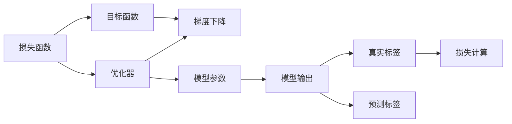

                 

## 1. 背景介绍

在深度学习中，损失函数（Loss Function）是衡量模型预测与真实值之间差异的关键组件，直接关系到模型的优化方向和收敛速度。一个好的损失函数不仅能够体现问题的本质，还能显著提升模型效果。本文将深入探讨损失函数的原理、种类和应用，旨在帮助读者更好地理解和设计损失函数，从而提升模型性能。

## 2. 核心概念与联系

### 2.1 核心概念概述

- **损失函数**：衡量模型预测输出与真实标签之间差异的函数。通过最小化损失函数，优化模型参数，使其更接近真实值。
- **目标函数**：通常包括损失函数和正则项，用于指导模型优化。目标函数优化是模型训练的核心。
- **优化器**：根据目标函数和当前模型参数，计算梯度并更新模型，常用的优化器包括SGD、Adam、Adagrad等。
- **梯度下降**：通过计算损失函数对模型参数的梯度，反向传播更新模型参数。
- **模型泛化能力**：模型在未知数据上的表现能力，与损失函数的设计密切相关。
- **模型复杂度**：模型参数数量、结构复杂度等，对损失函数设计有重要影响。

### 2.2 核心概念的联系

以下是几个核心概念之间的逻辑关系：

- **损失函数与优化器**：损失函数决定了模型优化的方向和目标，而优化器则具体执行参数更新，最小化损失函数。
- **损失函数与目标函数**：目标函数包括损失函数和正则项，用于指导模型优化和参数更新。
- **损失函数与模型泛化能力**：合适的损失函数可以更好地反映模型预测与真实标签的差异，从而提升模型泛化能力。
- **损失函数与模型复杂度**：复杂模型容易过拟合，需要更强的正则化和复杂的损失函数来缓解。

### 2.3 核心概念的整体架构

下图展示了核心概念之间的整体架构：



## 3. 核心算法原理 & 具体操作步骤
### 3.1 算法原理概述

损失函数的本质是对模型预测和真实标签之间的差异进行度量。常见的损失函数包括均方误差（Mean Squared Error, MSE）、交叉熵（Cross Entropy）、对数似然损失（Log-Likelihood Loss）、余弦相似度（Cosine Similarity）等。损失函数的选择和设计直接影响模型的性能和优化过程。

### 3.2 算法步骤详解

1. **定义损失函数**：根据任务性质选择合适的损失函数，如分类问题常用交叉熵，回归问题常用均方误差。
2. **计算梯度**：使用目标函数和当前模型参数，计算损失函数对每个参数的梯度。
3. **反向传播**：从输出层开始，反向计算每个参数的梯度。
4. **更新模型参数**：使用优化器根据梯度更新模型参数。
5. **重复迭代**：重复上述过程直至损失函数收敛。

### 3.3 算法优缺点

**优点**：
- 良好的损失函数能够显著提升模型性能。
- 多种损失函数可以应对不同任务类型，灵活性强。
- 梯度下降算法可高效优化参数更新。

**缺点**：
- 设计合适的损失函数需要经验，较难选择。
- 过拟合问题难以避免，特别是在复杂模型上。
- 损失函数的选择和参数优化需要大量时间和计算资源。

### 3.4 算法应用领域

损失函数在深度学习中具有广泛的应用，包括但不限于：
- 分类任务：交叉熵损失、对数似然损失。
- 回归任务：均方误差、平均绝对误差。
- 序列建模：序列交叉熵损失、对数似然损失。
- 生成任务：生成对抗网络（GAN）中的对抗损失、重构损失。

## 4. 数学模型和公式 & 详细讲解
### 4.1 数学模型构建

损失函数通常定义在模型输出和真实标签之间。以二分类任务为例，假设模型输出为 $\hat{y} \in [0, 1]$，真实标签为 $y \in \{0, 1\}$，交叉熵损失函数可表示为：

$$
\mathcal{L}(\theta) = -y \log(\hat{y}) - (1-y) \log(1-\hat{y})
$$

其中，$\theta$ 为模型参数。

### 4.2 公式推导过程

以二分类交叉熵损失函数为例，推导其梯度计算公式：

$$
\frac{\partial \mathcal{L}(\theta)}{\partial \theta} = -y \frac{1}{\hat{y}} + (1-y) \frac{1}{1-\hat{y}}
$$

将上式简化得：

$$
\frac{\partial \mathcal{L}(\theta)}{\partial \theta} = \frac{y - \hat{y}}{\hat{y}(1-\hat{y})}
$$

通过链式法则，可以进一步推导模型输出 $\hat{y}$ 对每个参数 $\theta$ 的梯度，从而指导模型参数更新。

### 4.3 案例分析与讲解

以图像分类为例，假设输入图像 $x$ 的模型输出为 $z$，目标为 $y$。多类别分类任务下，交叉熵损失函数为：

$$
\mathcal{L}(\theta) = -\frac{1}{N} \sum_{i=1}^N \sum_{j=1}^C y_{ij} \log \hat{y}_{ij}
$$

其中，$N$ 为样本数量，$C$ 为类别数，$y_{ij}$ 为样本 $i$ 是否属于类别 $j$，$\hat{y}_{ij}$ 为模型对样本 $i$ 属于类别 $j$ 的概率。

使用反向传播计算模型输出 $z$ 对每个参数 $\theta$ 的梯度，再结合优化器更新参数。这种做法能够保证模型在复杂任务上的性能。

## 5. 项目实践：代码实例和详细解释说明
### 5.1 开发环境搭建

为了进行损失函数的实践，首先需要搭建开发环境。这里以PyTorch为例：

1. 安装Anaconda：从官网下载并安装Anaconda，用于创建独立的Python环境。
2. 创建并激活虚拟环境：
```bash
conda create -n pytorch-env python=3.8 
conda activate pytorch-env
```
3. 安装PyTorch：根据CUDA版本，从官网获取对应的安装命令。例如：
```bash
conda install pytorch torchvision torchaudio cudatoolkit=11.1 -c pytorch -c conda-forge
```
4. 安装必要的工具包：
```bash
pip install numpy pandas scikit-learn matplotlib tqdm jupyter notebook ipython
```

### 5.2 源代码详细实现

以二分类任务为例，使用PyTorch实现交叉熵损失函数及其梯度计算：

```python
import torch
import torch.nn as nn

class BinaryCrossEntropyLoss(nn.Module):
    def __init__(self):
        super(BinaryCrossEntropyLoss, self).__init__()

    def forward(self, input, target):
        epsilon = 1e-7
        loss = -(target * torch.log(torch.clamp(input, min=epsilon)) + (1 - target) * torch.log(torch.clamp(1 - input, min=epsilon)))
        return loss.mean()

# 定义模型和损失函数
model = nn.Sigmoid()
criterion = BinaryCrossEntropyLoss()

# 假设输入和目标
x = torch.tensor([0.5, 0.9, 0.2, 0.6])
y = torch.tensor([1, 1, 0, 1])

# 计算损失
loss = criterion(model(x), y)
print(loss)

# 计算梯度
loss.backward()
print(model.weight.grad)
```

### 5.3 代码解读与分析

以上代码展示了如何使用PyTorch实现二分类交叉熵损失函数的计算。
- 首先定义了`BinaryCrossEntropyLoss`类，继承自`nn.Module`。
- 在`forward`方法中，计算交叉熵损失。
- 使用`torch.clamp`函数对输入进行下限剪枝，避免取对数时出现NaN。
- 在计算损失后，使用`loss.backward()`计算梯度，并打印模型参数的梯度。

## 6. 实际应用场景
### 6.1 图像分类

图像分类是深度学习中的经典任务，使用交叉熵损失函数可以显著提升模型效果。例如，使用ResNet模型进行图像分类：

```python
import torch.nn as nn
import torch.optim as optim
from torchvision import datasets, transforms

# 定义模型和损失函数
model = nn.Sequential(nn.Conv2d(3, 64, kernel_size=3, stride=1, padding=1), nn.ReLU(), nn.MaxPool2d(2), nn.Flatten(), nn.Linear(64*8*8, 10))
criterion = nn.CrossEntropyLoss()

# 加载CIFAR-10数据集
train_dataset = datasets.CIFAR10(root='./data', train=True, transform=transforms.ToTensor(), download=True)
test_dataset = datasets.CIFAR10(root='./data', train=False, transform=transforms.ToTensor(), download=True)

# 定义训练和测试数据加载器
train_loader = torch.utils.data.DataLoader(train_dataset, batch_size=64, shuffle=True)
test_loader = torch.utils.data.DataLoader(test_dataset, batch_size=64, shuffle=False)

# 定义优化器和超参数
optimizer = optim.SGD(model.parameters(), lr=0.01, momentum=0.9)
num_epochs = 10

# 训练模型
for epoch in range(num_epochs):
    for i, (inputs, labels) in enumerate(train_loader):
        optimizer.zero_grad()
        outputs = model(inputs)
        loss = criterion(outputs, labels)
        loss.backward()
        optimizer.step()

# 在测试集上评估模型
correct = 0
total = 0
with torch.no_grad():
    for inputs, labels in test_loader:
        outputs = model(inputs)
        _, predicted = torch.max(outputs.data, 1)
        total += labels.size(0)
        correct += (predicted == labels).sum().item()
print('Accuracy: {:.2f}%'.format(100 * correct / total))
```

### 6.2 文本分类

文本分类是自然语言处理中的常见任务，使用交叉熵损失函数同样有效。例如，使用BERT模型进行情感分类：

```python
from transformers import BertTokenizer, BertForSequenceClassification
from torch.utils.data import DataLoader
import torch.nn as nn

# 定义模型和损失函数
tokenizer = BertTokenizer.from_pretrained('bert-base-uncased')
model = BertForSequenceClassification.from_pretrained('bert-base-uncased', num_labels=2)
criterion = nn.CrossEntropyLoss()

# 加载IMDB数据集
train_dataset = datasets.IMDB(root='./data', train=True, transform=lambda x: (tokenizer.encode(x, add_special_tokens=True), torch.tensor(x.target)), download=True)
test_dataset = datasets.IMDB(root='./data', train=False, transform=lambda x: (tokenizer.encode(x, add_special_tokens=True), torch.tensor(x.target)), download=True)

# 定义训练和测试数据加载器
train_loader = DataLoader(train_dataset, batch_size=16, shuffle=True)
test_loader = DataLoader(test_dataset, batch_size=16, shuffle=False)

# 定义优化器和超参数
optimizer = optim.AdamW(model.parameters(), lr=1e-5)
num_epochs = 3

# 训练模型
for epoch in range(num_epochs):
    for i, (inputs, labels) in enumerate(train_loader):
        inputs = torch.stack(inputs)
        labels = torch.stack(labels)
        optimizer.zero_grad()
        outputs = model(inputs)
        loss = criterion(outputs, labels)
        loss.backward()
        optimizer.step()

# 在测试集上评估模型
correct = 0
total = 0
with torch.no_grad():
    for inputs, labels in test_loader:
        outputs = model(inputs)
        _, predicted = torch.max(outputs.data, 1)
        total += labels.size(0)
        correct += (predicted == labels).sum().item()
print('Accuracy: {:.2f}%'.format(100 * correct / total))
```

## 7. 工具和资源推荐
### 7.1 学习资源推荐

为了帮助读者系统掌握损失函数的理论基础和实践技巧，这里推荐一些优质的学习资源：

1. 《深度学习》教材（Ian Goodfellow、Yoshua Bengio、Aaron Courville著）：全面介绍深度学习的基本概念和数学原理，包括损失函数的设计和应用。
2. CS231n《卷积神经网络》课程：斯坦福大学开设的经典计算机视觉课程，深入讲解各种损失函数在图像分类、目标检测等任务中的应用。
3. 《动手学深度学习》（李沐、何恺明、宋健著）：国内领先的人工智能教材，详细介绍了深度学习中的损失函数及其优化方法。
4. arXiv预印本：人工智能领域最新研究成果的发布平台，涵盖损失函数设计的多样化和创新思路，值得深入研究。
5. GitHub开源项目：如TensorFlow、PyTorch等主流深度学习框架的官方代码库，包含大量损失函数实现和示例。

### 7.2 开发工具推荐

高效的开发离不开优秀的工具支持。以下是几款用于损失函数开发的常用工具：

1. PyTorch：基于Python的开源深度学习框架，灵活动态的计算图，适合快速迭代研究。
2. TensorFlow：由Google主导开发的开源深度学习框架，生产部署方便，适合大规模工程应用。
3. Weights & Biases：模型训练的实验跟踪工具，可以记录和可视化模型训练过程中的各项指标，方便对比和调优。
4. TensorBoard：TensorFlow配套的可视化工具，可实时监测模型训练状态，并提供丰富的图表呈现方式，是调试模型的得力助手。
5. Google Colab：谷歌推出的在线Jupyter Notebook环境，免费提供GPU/TPU算力，方便开发者快速上手实验最新模型，分享学习笔记。

### 7.3 相关论文推荐

深度学习中损失函数的研究仍在不断深入，以下是几篇奠基性的相关论文，推荐阅读：

1. MSE损失函数（Mean Squared Error）：是最基本的回归损失函数，适用于线性回归、神经网络回归等任务。
2. 交叉熵损失函数（Cross Entropy Loss）：广泛应用于分类任务，特别是在多分类和二分类问题中效果显著。
3. 对数似然损失函数（Log-Likelihood Loss）：适用于概率模型，如softmax回归、变分自编码器等。
4. 重构损失函数（Reconstruction Loss）：应用于生成对抗网络（GAN）中，用于指导模型生成与真实样本相似的伪造样本。
5. 梯度惩罚损失函数（Gradient Penalty Loss）：用于提高GAN模型的稳定性，减少模式崩溃现象。

这些论文代表了大规模语言模型微调技术的发展脉络。通过学习这些前沿成果，可以帮助研究者把握学科前进方向，激发更多的创新灵感。

## 8. 总结：未来发展趋势与挑战
### 8.1 总结

本文对损失函数在深度学习中的作用进行了全面系统的介绍。通过深入讲解损失函数的原理、种类和应用，帮助读者更好地理解和设计损失函数，从而提升模型性能。文章从损失函数的定义、计算、应用等方面进行系统阐述，并通过实际案例和代码实例进行详细讲解，使读者能够更好地应用于实际开发中。

通过本文的系统梳理，可以看到，损失函数在大规模语言模型微调中的重要性。合适的损失函数能够显著提升模型效果，确保模型训练的稳定性和收敛性。未来，损失函数的设计将更加灵活多样，能够更好地适应不同任务和模型，推动深度学习技术的不断进步。

### 8.2 未来发展趋势

展望未来，损失函数的设计和应用将呈现以下几个发展趋势：

1. 多任务损失函数：在多个任务之间共享损失函数，提升模型在不同任务上的泛化能力。
2. 自适应损失函数：根据数据分布动态调整损失函数，提升模型的灵活性和适应性。
3. 联合学习损失函数：在多个模型之间共享损失函数，提升模型整体性能。
4. 对抗生成损失函数：结合生成对抗网络（GAN）和损失函数设计，提升模型的生成能力。
5. 强化学习损失函数：结合强化学习和损失函数，提升模型的决策能力和泛化能力。

这些趋势凸显了损失函数在大规模语言模型微调中的重要性，推动深度学习技术的不断进步。通过不断探索和创新，损失函数将为深度学习模型带来更大的灵活性和泛化能力，提升其在实际应用中的表现。

### 8.3 面临的挑战

尽管损失函数在深度学习中具有广泛的应用，但在实际应用中仍面临诸多挑战：

1. 数据质量问题：低质量、噪声数据对损失函数的影响较大，可能导致模型性能下降。
2. 损失函数设计难度：设计合适的损失函数需要丰富的经验和深入的理论知识，较难选择。
3. 过拟合问题：复杂模型容易过拟合，需要选择更强的正则化和复杂的损失函数。
4. 计算复杂度：复杂的损失函数计算开销较大，可能导致训练速度变慢。

### 8.4 研究展望

为了应对损失函数面临的挑战，未来的研究需要在以下几个方面寻求新的突破：

1. 数据清洗与预处理：采用数据清洗和预处理技术，提升数据质量，减少噪声干扰。
2. 损失函数优化算法：研发更加高效、鲁棒的损失函数优化算法，提高模型训练速度。
3. 模型正则化：通过正则化技术，如Dropout、L2正则化等，缓解过拟合问题。
4. 损失函数组合：结合多种损失函数，综合不同任务的优化需求，提升模型整体性能。
5. 模型集成与融合：将多个模型的损失函数进行组合，提升模型的泛化能力和鲁棒性。

总之，损失函数在大规模语言模型微调中的应用仍然具有广阔的前景，需要不断探索和创新，以应对新的挑战，提升模型的性能和适应性。

## 9. 附录：常见问题与解答

**Q1：如何选择合适的损失函数？**

A: 选择损失函数需要考虑任务类型、数据分布、模型复杂度等因素。对于分类任务，交叉熵损失通常效果最佳；对于回归任务，均方误差损失更为适用；对于序列任务，序列交叉熵损失和序列重构损失更为常用。

**Q2：梯度下降算法有哪些类型？**

A: 常见的梯度下降算法包括：
- 批量梯度下降（Batch Gradient Descent）
- 随机梯度下降（Stochastic Gradient Descent）
- 小批量梯度下降（Mini-Batch Gradient Descent）
- 动量梯度下降（Momentum Gradient Descent）
- 自适应梯度下降（Adaptive Gradient Descent）
- 自适应矩估计算法（Adaptive Moment Estimation）

**Q3：如何在损失函数中引入正则化？**

A: 常见的正则化方法包括L1正则化、L2正则化、Dropout等。L1正则化通过惩罚参数绝对值之和，促使模型参数趋向于0，减少过拟合。L2正则化通过惩罚参数平方和，促使参数值分布更平滑。Dropout通过随机删除部分神经元，防止模型对某一部分的过度依赖。

**Q4：如何设计多任务损失函数？**

A: 多任务损失函数的设计通常采用多任务联合训练的方式，将多个任务的损失函数组合起来，共同优化模型参数。例如，对于图像分类和目标检测任务，可以将分类损失和检测损失结合起来，同时优化模型。

**Q5：如何设计自适应损失函数？**

A: 自适应损失函数的设计通常结合任务特点，动态调整损失函数。例如，对于生成对抗网络（GAN），可以在损失函数中引入梯度惩罚项，防止模式崩溃。在图像生成任务中，可以通过调整生成器损失和判别器损失的权重，提升模型性能。

总之，损失函数在大规模语言模型微调中具有重要地位，通过合理设计和应用，能够显著提升模型性能。本文从理论到实践，深入剖析了损失函数的原理和应用，希望能为读者提供有价值的参考和指导。

---

作者：禅与计算机程序设计艺术 / Zen and the Art of Computer Programming

