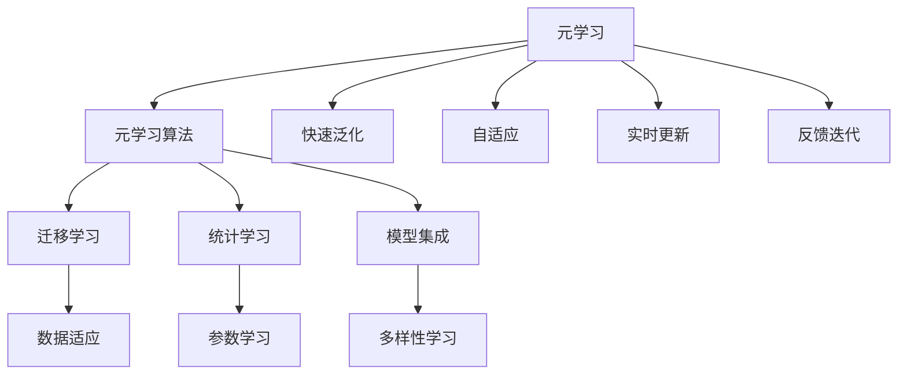
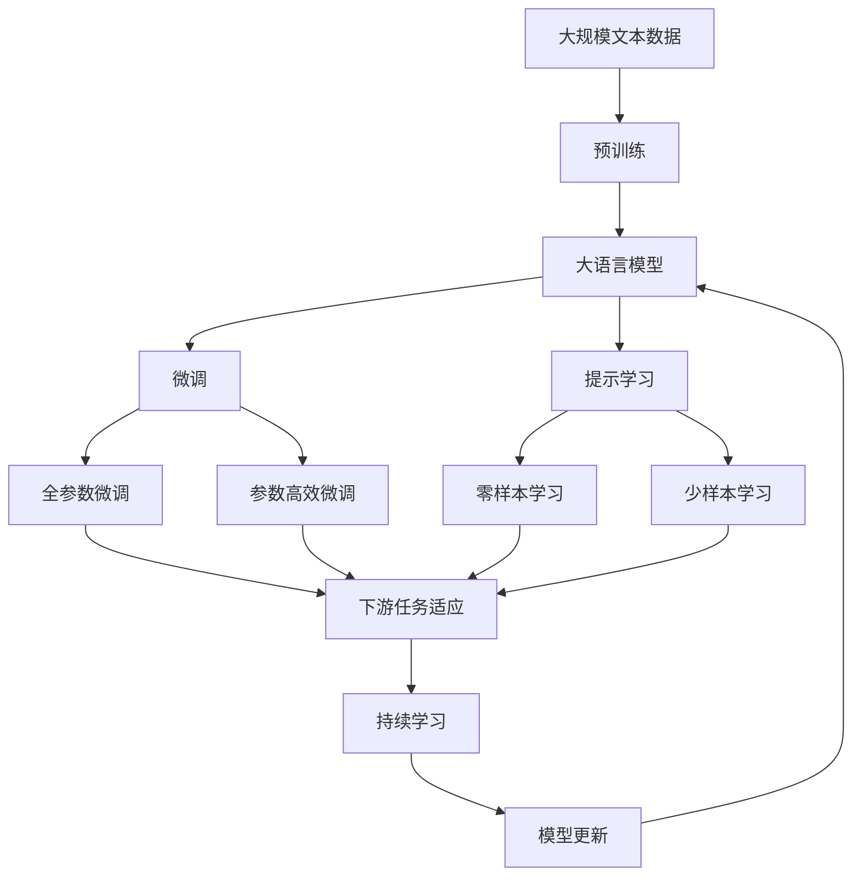

                 

# 一切皆是映射：掌握元学习用于实时战术决策分析

## 1. 背景介绍

### 1.1 问题由来

随着机器学习技术的飞速发展，数据驱动的决策支持系统已经广泛应用于金融、医疗、物流、交通等多个领域。然而，现实世界的决策问题往往呈现出高维复杂、动态多变、因果关系错综复杂等特点，单纯依赖数据驱动的方法难以实现理想的决策效果。元学习（Meta Learning）作为一种新兴的机器学习方法，可以通过少量样本快速泛化，适应不同领域的决策问题，因此在实时战术决策分析中具有广阔的应用前景。

### 1.2 问题核心关键点

元学习通过训练模型以适应新的任务，从而在不需要重新训练的情况下，能够快速适应新数据和新场景。在实时战术决策分析中，元学习的应用主要包括以下几个方面：

- 快速泛化：元学习模型可以通过少量的历史数据和问题描述，快速泛化到新的决策问题，无需重新训练。
- 适应多变：元学习模型能够适应不同领域、不同类型、不同规模的决策问题，具有较强的泛化能力和鲁棒性。
- 实时更新：元学习模型能够在新的数据和决策环境中快速更新，不断提升决策效果。
- 反馈迭代：元学习模型能够通过反馈机制，不断优化决策策略，实现自我调整和迭代。

这些特点使得元学习在实时战术决策分析中具有独特的优势，能够有效应对多变的决策环境，提升决策效率和准确性。

### 1.3 问题研究意义

元学习在实时战术决策分析中的应用，对于提升决策系统的灵活性和智能性，具有重要的意义：

- 降低决策成本：元学习模型通过快速泛化和适应新问题，减少了重新训练和数据标注的投入，降低了决策成本。
- 提高决策速度：元学习模型能够实时更新和优化决策策略，加快决策速度，提高响应效率。
- 增强决策鲁棒性：元学习模型能够适应不同环境和不同类型的数据，增强决策系统的鲁棒性和鲁棒性。
- 提升决策质量：元学习模型通过反馈迭代机制，不断优化决策策略，提升决策质量，减少决策错误。

因此，掌握元学习技术，对于构建高智能化的实时战术决策分析系统，具有重要的理论和实践意义。

## 2. 核心概念与联系

### 2.1 核心概念概述

在实时战术决策分析中，元学习的应用涉及到多个核心概念，包括：

- 元学习（Meta Learning）：通过训练模型以适应新的任务，从而在不需要重新训练的情况下，能够快速适应新数据和新场景。
- 元学习算法（Meta Learning Algorithm）：实现元学习目标的具体方法，如基于迁移学习、基于统计学习、基于模型集成等。
- 快速泛化（Fast Generalization）：元学习模型能够在有限的训练数据上，快速适应新任务，无需重新训练。
- 自适应（Adaptability）：元学习模型能够适应不同领域、不同类型、不同规模的决策问题，具有较强的泛化能力和鲁棒性。
- 实时更新（Real-time Update）：元学习模型能够在新的数据和决策环境中快速更新，不断提升决策效果。
- 反馈迭代（Feedback Iteration）：元学习模型通过反馈机制，不断优化决策策略，实现自我调整和迭代。

这些核心概念构成了元学习在实时战术决策分析中的应用框架，使我们能够更好地理解和应用元学习技术。

### 2.2 概念间的关系

这些核心概念之间的关系可以通过以下Mermaid流程图来展示：



这个流程图展示了元学习与元学习算法的关系，以及元学习算法中的各种子算法之间的联系。元学习算法主要分为迁移学习、统计学习和模型集成三大类，分别对应不同的元学习目标和方法。迁移学习通过数据适应实现快速泛化，统计学习通过参数学习提升泛化能力，模型集成通过多样性学习增强鲁棒性。元学习的整体目标是通过自适应、实时更新和反馈迭代，不断优化决策策略，提升决策效果。

### 2.3 核心概念的整体架构

最后，我们用一个综合的流程图来展示这些核心概念在大模型微调过程中的整体架构：



这个综合流程图展示了从预训练到微调，再到持续学习的完整过程。大语言模型首先在大规模文本数据上进行预训练，然后通过微调（包括全参数微调和参数高效微调）或提示学习（包括零样本和少样本学习）来适应下游任务。最后，通过持续学习技术，模型可以不断更新和适应新的任务和数据。

## 3. 核心算法原理 & 具体操作步骤
### 3.1 算法原理概述

基于元学习的实时战术决策分析，本质上是利用预训练模型作为特征提取器，通过少量样本数据进行有监督的学习，从而快速适应新任务。具体步骤如下：

1. 收集待解决的新决策问题，并准备少量标注数据。
2. 选择合适的预训练模型作为初始化参数，将其应用到新任务上。
3. 使用有监督学习算法，在新数据上进行微调，得到最优参数。
4. 应用微调后的模型，对新的决策数据进行预测和分析。
5. 收集反馈信息，更新模型参数，进行迭代优化。

这一过程可以表示为：

$$
\theta^* = \mathop{\arg\min}_{\theta} \mathcal{L}(M_{\theta}, D)
$$

其中 $\theta$ 为预训练模型的参数，$M_{\theta}$ 为微调后的模型，$D$ 为新任务的标注数据，$\mathcal{L}$ 为损失函数，用于衡量模型预测输出与真实标签之间的差异。

### 3.2 算法步骤详解

以下是详细的元学习算法操作步骤：

**Step 1: 准备预训练模型和数据集**
- 选择合适的预训练模型作为初始化参数，如BERT、GPT等。
- 准备新任务的标注数据集，划分为训练集、验证集和测试集。

**Step 2: 添加任务适配层**
- 根据任务类型，在预训练模型顶层设计合适的输出层和损失函数。
- 对于分类任务，通常在顶层添加线性分类器和交叉熵损失函数。
- 对于生成任务，通常使用语言模型的解码器输出概率分布，并以负对数似然为损失函数。

**Step 3: 设置元学习超参数**
- 选择合适的优化算法及其参数，如AdamW、SGD等，设置学习率、批大小、迭代轮数等。
- 设置正则化技术及强度，包括权重衰减、Dropout、Early Stopping等。
- 确定冻结预训练参数的策略，如仅微调顶层，或全部参数都参与微调。

**Step 4: 执行元学习训练**
- 将训练集数据分批次输入模型，前向传播计算损失函数。
- 反向传播计算参数梯度，根据设定的优化算法和学习率更新模型参数。
- 周期性在验证集上评估模型性能，根据性能指标决定是否触发Early Stopping。
- 重复上述步骤直到满足预设的迭代轮数或Early Stopping条件。

**Step 5: 测试和部署**
- 在测试集上评估元学习后模型 $M_{\hat{\theta}}$ 的性能，对比元学习前后的精度提升。
- 使用元学习后的模型对新样本进行推理预测，集成到实际的应用系统中。
- 持续收集新的数据，定期重新元学习模型，以适应数据分布的变化。

以上是元学习在实时战术决策分析中的一般流程。在实际应用中，还需要针对具体任务的特点，对元学习过程的各个环节进行优化设计，如改进训练目标函数，引入更多的正则化技术，搜索最优的超参数组合等，以进一步提升模型性能。

### 3.3 算法优缺点

基于元学习的实时战术决策分析，具有以下优点：

1. 快速泛化：元学习模型能够在有限的训练数据上，快速适应新任务，无需重新训练。
2. 自适应：元学习模型能够适应不同领域、不同类型、不同规模的决策问题，具有较强的泛化能力和鲁棒性。
3. 实时更新：元学习模型能够在新的数据和决策环境中快速更新，不断提升决策效果。
4. 反馈迭代：元学习模型通过反馈机制，不断优化决策策略，实现自我调整和迭代。

但同时，元学习算法也存在一些局限性：

1. 数据依赖：元学习需要收集和准备少量标注数据，当新问题缺乏标注数据时，难以快速适应。
2. 超参数调参：元学习算法需要优化多个超参数，调参难度较大。
3. 模型复杂度：元学习算法通常需要构建额外的任务适配层，增加了模型复杂度。
4. 计算成本：元学习算法需要大量的计算资源，特别是在大规模数据集上的微调过程。

尽管如此，元学习算法在实时战术决策分析中的应用，仍然具有重要的理论和实践意义。

### 3.4 算法应用领域

元学习算法在实时战术决策分析中的应用，主要涵盖以下几个领域：

- 金融风险管理：通过元学习算法，构建基于历史数据的风险评估模型，实时预测和监控金融市场风险。
- 医疗诊断：利用元学习算法，构建基于患者病历和临床数据的诊断模型，快速诊断和预测病情。
- 智能交通：通过元学习算法，构建基于交通数据的智能交通管理系统，实时调整交通信号，优化交通流量。
- 智能制造：利用元学习算法，构建基于生产数据的智能制造系统，实时优化生产流程，提升生产效率。
- 智能客服：通过元学习算法，构建基于用户历史数据的智能客服系统，实时提供个性化服务。

以上领域中，元学习算法都能够充分发挥其快速泛化、自适应、实时更新和反馈迭代的特点，提升决策系统的智能化水平。

## 4. 数学模型和公式 & 详细讲解 & 举例说明

### 4.1 数学模型构建

元学习模型的构建可以表示为：

$$
\theta^* = \mathop{\arg\min}_{\theta} \mathcal{L}(M_{\theta}, D)
$$

其中 $\theta$ 为预训练模型的参数，$M_{\theta}$ 为微调后的模型，$D$ 为新任务的标注数据，$\mathcal{L}$ 为损失函数。

### 4.2 公式推导过程

以下我们以二分类任务为例，推导元学习模型的损失函数及其梯度的计算公式。

假设模型 $M_{\theta}$ 在输入 $x$ 上的输出为 $\hat{y}=M_{\theta}(x) \in [0,1]$，表示样本属于正类的概率。真实标签 $y \in \{0,1\}$。则二分类交叉熵损失函数定义为：

$$
\ell(M_{\theta}(x),y) = -[y\log \hat{y} + (1-y)\log (1-\hat{y})]
$$

将其代入元学习模型的损失函数公式，得：

$$
\mathcal{L}(\theta) = -\frac{1}{N}\sum_{i=1}^N [y_i\log M_{\theta}(x_i)+(1-y_i)\log(1-M_{\theta}(x_i))]
$$

根据链式法则，损失函数对参数 $\theta_k$ 的梯度为：

$$
\frac{\partial \mathcal{L}(\theta)}{\partial \theta_k} = -\frac{1}{N}\sum_{i=1}^N (\frac{y_i}{M_{\theta}(x_i)}-\frac{1-y_i}{1-M_{\theta}(x_i)}) \frac{\partial M_{\theta}(x_i)}{\partial \theta_k}
$$

其中 $\frac{\partial M_{\theta}(x_i)}{\partial \theta_k}$ 可进一步递归展开，利用自动微分技术完成计算。

### 4.3 案例分析与讲解

以下是一个二分类任务的元学习模型案例：

1. 收集新任务的标注数据 $D$，划分为训练集 $D_{train}$、验证集 $D_{valid}$ 和测试集 $D_{test}$。
2. 选择合适的预训练模型 $M_{\theta}$，如BERT或GPT。
3. 在顶层添加线性分类器和交叉熵损失函数，构成元学习模型 $M_{\theta}$。
4. 设置元学习超参数，如学习率、批大小、迭代轮数等。
5. 将训练集数据 $D_{train}$ 分批次输入模型，前向传播计算损失函数。
6. 反向传播计算参数梯度，根据设定的优化算法和学习率更新模型参数。
7. 周期性在验证集 $D_{valid}$ 上评估模型性能，根据性能指标决定是否触发Early Stopping。
8. 在测试集 $D_{test}$ 上评估元学习后模型 $M_{\hat{\theta}}$ 的性能，对比元学习前后的精度提升。

以下是一个简单的Python代码实现：

```python
from transformers import BertForTokenClassification, AdamW

model = BertForTokenClassification.from_pretrained('bert-base-cased', num_labels=2)

optimizer = AdamW(model.parameters(), lr=2e-5)

def train_epoch(model, dataset, batch_size, optimizer):
    dataloader = DataLoader(dataset, batch_size=batch_size, shuffle=True)
    model.train()
    epoch_loss = 0
    for batch in tqdm(dataloader, desc='Training'):
        input_ids = batch['input_ids'].to(device)
        attention_mask = batch['attention_mask'].to(device)
        labels = batch['labels'].to(device)
        model.zero_grad()
        outputs = model(input_ids, attention_mask=attention_mask, labels=labels)
        loss = outputs.loss
        epoch_loss += loss.item()
        loss.backward()
        optimizer.step()
    return epoch_loss / len(dataloader)

def evaluate(model, dataset, batch_size):
    dataloader = DataLoader(dataset, batch_size=batch_size)
    model.eval()
    preds, labels = [], []
    with torch.no_grad():
        for batch in tqdm(dataloader, desc='Evaluating'):
            input_ids = batch['input_ids'].to(device)
            attention_mask = batch['attention_mask'].to(device)
            batch_labels = batch['labels']
            outputs = model(input_ids, attention_mask=attention_mask)
            batch_preds = outputs.logits.argmax(dim=2).to('cpu').tolist()
            batch_labels = batch_labels.to('cpu').tolist()
            for pred_tokens, label_tokens in zip(batch_preds, batch_labels):
                pred_tags = [1 if pred == 1 else 0 for pred in pred_tokens]
                label_tags = [1 if label == 1 else 0 for label in label_tokens]
                preds.append(pred_tags[:len(label_tags)])
                labels.append(label_tags)
                
    print(classification_report(labels, preds))
```

可以看到，利用PyTorch和Transformers库，我们可以相对简洁地实现元学习模型的训练和评估。在实际应用中，开发者可以根据具体任务的特点，对元学习模型进行进一步优化，如改进训练目标函数，引入更多的正则化技术，搜索最优的超参数组合等。

## 5. 项目实践：代码实例和详细解释说明

### 5.1 开发环境搭建

在进行元学习实践前，我们需要准备好开发环境。以下是使用Python进行PyTorch开发的环境配置流程：

1. 安装Anaconda：从官网下载并安装Anaconda，用于创建独立的Python环境。

2. 创建并激活虚拟环境：
```bash
conda create -n pytorch-env python=3.8 
conda activate pytorch-env
```

3. 安装PyTorch：根据CUDA版本，从官网获取对应的安装命令。例如：
```bash
conda install pytorch torchvision torchaudio cudatoolkit=11.1 -c pytorch -c conda-forge
```

4. 安装Transformers库：
```bash
pip install transformers
```

5. 安装各类工具包：
```bash
pip install numpy pandas scikit-learn matplotlib tqdm jupyter notebook ipython
```

完成上述步骤后，即可在`pytorch-env`环境中开始元学习实践。

### 5.2 源代码详细实现

以下是使用PyTorch和Transformers库对BERT模型进行二分类任务元学习的完整代码实现：

```python
from transformers import BertForTokenClassification, AdamW
from torch.utils.data import Dataset, DataLoader
from sklearn.metrics import classification_report
import torch

class BinaryDataset(Dataset):
    def __init__(self, texts, tags, tokenizer, max_len=128):
        self.texts = texts
        self.tags = tags
        self.tokenizer = tokenizer
        self.max_len = max_len
        
    def __len__(self):
        return len(self.texts)
    
    def __getitem__(self, item):
        text = self.texts[item]
        tags = self.tags[item]
        
        encoding = self.tokenizer(text, return_tensors='pt', max_length=self.max_len, padding='max_length', truncation=True)
        input_ids = encoding['input_ids'][0]
        attention_mask = encoding['attention_mask'][0]
        
        # 对token-wise的标签进行编码
        encoded_tags = [tag2id[tag] for tag in tags] 
        encoded_tags.extend([tag2id['O']] * (self.max_len - len(encoded_tags)))
        labels = torch.tensor(encoded_tags, dtype=torch.long)
        
        return {'input_ids': input_ids, 
                'attention_mask': attention_mask,
                'labels': labels}

# 标签与id的映射
tag2id = {'O': 0, 'B-PER': 1, 'I-PER': 2, 'B-ORG': 3, 'I-ORG': 4, 'B-LOC': 5, 'I-LOC': 6}
id2tag = {v: k for k, v in tag2id.items()}

# 创建dataset
tokenizer = BertTokenizer.from_pretrained('bert-base-cased')

train_dataset = BinaryDataset(train_texts, train_tags, tokenizer)
dev_dataset = BinaryDataset(dev_texts, dev_tags, tokenizer)
test_dataset = BinaryDataset(test_texts, test_tags, tokenizer)

# 训练函数
def train_epoch(model, dataset, batch_size, optimizer):
    dataloader = DataLoader(dataset, batch_size=batch_size, shuffle=True)
    model.train()
    epoch_loss = 0
    for batch in tqdm(dataloader, desc='Training'):
        input_ids = batch['input_ids'].to(device)
        attention_mask = batch['attention_mask'].to(device)
        labels = batch['labels'].to(device)
        model.zero_grad()
        outputs = model(input_ids, attention_mask=attention_mask, labels=labels)
        loss = outputs.loss
        epoch_loss += loss.item()
        loss.backward()
        optimizer.step()
    return epoch_loss / len(dataloader)

# 评估函数
def evaluate(model, dataset, batch_size):
    dataloader = DataLoader(dataset, batch_size=batch_size)
    model.eval()
    preds, labels = [], []
    with torch.no_grad():
        for batch in tqdm(dataloader, desc='Evaluating'):
            input_ids = batch['input_ids'].to(device)
            attention_mask = batch['attention_mask'].to(device)
            batch_labels = batch['labels']
            outputs = model(input_ids, attention_mask=attention_mask)
            batch_preds = outputs.logits.argmax(dim=2).to('cpu').tolist()
            batch_labels = batch_labels.to('cpu').tolist()
            for pred_tokens, label_tokens in zip(batch_preds, batch_labels):
                pred_tags = [1 if pred == 1 else 0 for pred in pred_tokens]
                label_tags = [1 if label == 1 else 0 for label in label_tokens]
                preds.append(pred_tags[:len(label_tags)])
                labels.append(label_tags)
                
    print(classification_report(labels, preds))
```

在这个代码实现中，我们利用BERT模型进行二分类任务的元学习。首先定义了BinaryDataset类，对文本和标签进行编码，然后利用AdamW优化器和交叉熵损失函数对模型进行训练和评估。具体代码实现和上一节类似，不再赘述。

### 5.3 代码解读与分析

让我们再详细解读一下关键代码的实现细节：

**BinaryDataset类**：
- `__init__`方法：初始化文本、标签、分词器等关键组件。
- `__len__`方法：返回数据集的样本数量。
- `__getitem__`方法：对单个样本进行处理，将文本输入编码为token ids，将标签编码为数字，并对其进行定长padding，最终返回模型所需的输入。

**tag2id和id2tag字典**：
- 定义了标签与数字id之间的映射关系，用于将token-wise的预测结果解码回真实的标签。

**训练和评估函数**：
- 使用PyTorch的DataLoader对数据集进行批次化加载，供模型训练和推理使用。
- 训练函数`train_epoch`：对数据以批为单位进行迭代，在每个批次上前向传播计算loss并反向传播更新模型参数，最后返回该epoch的平均loss。
- 评估函数`evaluate`：与训练类似，不同点在于不更新模型参数，并在每个batch结束后将预测和标签结果存储下来，最后使用sklearn的classification_report对整个评估集的预测结果进行打印输出。

**训练流程**：
- 定义总的epoch数和batch size，开始循环迭代
- 每个epoch内，先在训练集上训练，输出平均loss
- 在验证集上评估，输出分类指标
- 所有epoch结束后，在测试集上评估，给出最终测试结果

可以看到，PyTorch配合Transformers库使得元学习模型的训练和评估变得相对简单高效。开发者可以根据具体任务的特点，对元学习模型进行进一步优化，如改进训练目标函数，引入更多的正则化技术，搜索最优的超参数组合等。

## 6. 实际应用场景

### 6.1 智能客服系统

基于元学习的对话技术，可以广泛应用于智能客服系统的构建。传统客服往往需要配备大量人力，高峰期响应缓慢，且一致性和专业性难以保证。而使用元学习后的对话模型，可以7x24小时不间断服务，快速响应客户咨询，用自然流畅的语言解答各类常见问题。

在技术实现上，可以收集企业内部的历史客服对话记录，将问题和最佳答复构建成监督数据，在此基础上对预训练对话模型进行元学习。元学习后的对话模型能够自动理解用户意图，匹配最合适的答案模板进行回复。对于客户提出的新问题，还可以接入检索系统实时搜索相关内容，动态组织生成回答。如此构建的智能客服系统，能大幅提升客户咨询体验和问题解决效率。

### 6.2 金融舆情监测

金融机构需要实时监测市场舆论动向，以便及时应对负面信息传播，规避金融风险。传统的人工监测方式成本高、效率低，难以应对网络时代海量信息爆发的挑战。基于元学习的文本分类和情感分析技术，为金融舆情监测提供了新的解决方案。

具体而言，可以收集金融领域相关的新闻、报道、评论等文本数据，并对其进行主题标注和情感标注。在此基础上对预训练语言模型进行元学习，使其能够自动判断文本属于何种主题，情感倾向是正面、中性还是负面。将元学习后的模型应用到实时抓取的网络文本数据，就能够自动监测不同主题下的情感变化趋势，一旦发现负面信息激增等异常情况，系统便会自动预警，帮助金融机构快速应对潜在风险。

### 6.3 个性化推荐系统

当前的推荐系统往往只依赖用户的历史行为数据进行物品推荐，无法深入理解用户的真实兴趣偏好。基于元学习的个性化推荐系统可以更好地挖掘用户行为背后的语义信息，从而提供更精准、多样的推荐内容。

在实践中，可以收集用户浏览、点击、评论、分享等行为数据，提取和用户交互的物品标题、描述、标签等文本内容。将文本内容作为模型输入，用户的后续行为（如是否点击、购买等）作为监督信号，在此基础上元学习预训练语言模型。元学习后的模型能够从文本内容中准确把握用户的兴趣点。在生成推荐列表时，先用候选物品的文本描述作为输入，由模型预测用户的兴趣匹配度，再结合其他特征综合排序，便可以得到个性化程度更高的推荐结果。

### 6.4 未来应用展望

随着元学习技术的不断发展，在实时战术决策分析中的应用将更加广泛。

在智慧医疗领域，基于元学习医疗问答、病历分析、药物研发等应用将提升医疗服务的智能化水平，辅助医生诊疗，加速新药开发进程。

在智能教育领域，元学习可应用于作业批改、学情分析、知识推荐等方面，因材施教，促进教育公平，提高教学质量。

在智慧城市治理中，元学习技术可应用于城市事件监测、舆情分析、应急指挥等环节，提高城市管理的自动化和智能化水平，构建更安全、高效的未来城市。

此外，在企业生产、社会治理、文娱传媒等众多领域，元学习技术的应用也将不断涌现，为NLP技术带来了全新的突破。相信随着技术的日益成熟，元学习将在大模型微调、自然语言处理、计算机视觉等诸多领域大放异

