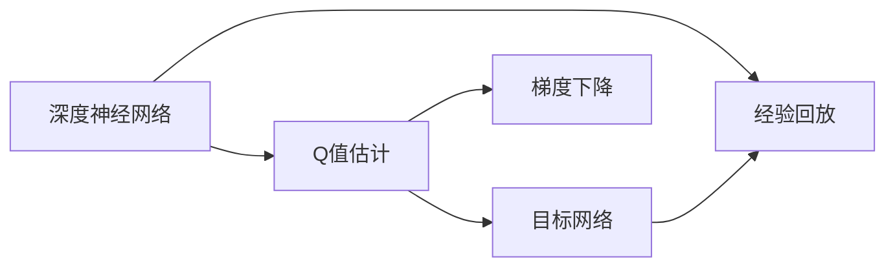

                 

# 一切皆是映射：解析DQN的损失函数设计和影响因素

> 关键词：DQN, 深度Q网络, 强化学习, 损失函数, 经验回放, 梯度下降, 探索与利用

## 1. 背景介绍

在强化学习领域，深度Q网络（Deep Q Networks, DQN）以其高效性能和良好泛化能力成为了目前最流行的模型之一。然而，DQN的损失函数设计及其影响因素这一核心问题，却鲜有深入探讨。本文章将详细解析DQN的损失函数设计原理，以及不同设计选择对模型性能的影响，以便为研究者、开发者提供深入理解及应用指导。

## 2. 核心概念与联系

### 2.1 核心概念概述

DQN作为强化学习中的深度模型，其目标是通过学习与环境的交互中如何采取行动最大化累积奖励，以此来实现特定任务的目标。其核心算法包括深度神经网络、目标网络、经验回放、梯度下降等，其中损失函数设计直接影响模型的收敛速度和稳定性。

**深度神经网络**：DQN的核心，用于构建Q值估计函数，预测在不同状态下采取动作的预期奖励。

**目标网络**：为了防止经验回放中的"记忆泄露"，使用目标网络更新模型参数，确保参数逐渐收敛。

**经验回放**：从环境经验中随机采样存储在经验缓冲区，减少样本偏差，提升模型的泛化能力。

**梯度下降**：用于优化模型参数，使得预测的Q值与实际Q值尽可能接近。

### 2.2 概念间的关系

以下是一个Mermaid流程图，展示这些核心概念如何在大脑中相互关联：



在这个流程图中，深度神经网络构建Q值估计函数，目标网络更新这些参数，经验回放为网络提供多样化的训练数据，梯度下降则根据这些数据调整网络参数。这些步骤共同构成了DQN的学习过程。

## 3. 核心算法原理 & 具体操作步骤

### 3.1 算法原理概述

DQN的核心目标是通过最小化预测Q值与真实Q值之间的差距，即损失函数 $L(Q)$，来优化模型。这个损失函数可以表达为：

$$L(Q) = E_{(s,a,r,s')}[Q(s,a) - r - \gamma Q(s',a')]$$

其中，$Q(s,a)$ 表示在状态 $s$ 下采取动作 $a$ 的预期累积奖励，$r$ 表示即时奖励，$s'$ 是下一个状态，$a'$ 是后续的可选动作。目标是最小化这个差距，使得模型能够更准确地预测不同状态下的最优动作。

### 3.2 算法步骤详解

1. **环境交互**：智能体与环境交互，在每个状态下采取动作，观察环境反馈，获得即时奖励和下一个状态。

2. **Q值估计**：使用深度神经网络 $Q(\cdot;\theta)$ 预测当前状态 $s$ 下每个可能动作的Q值。

3. **Q值更新**：计算当前状态的实际Q值，即即时奖励加上未来状态 $s'$ 的预期Q值，更新神经网络参数 $\theta$ 以最小化损失函数 $L(Q)$。

4. **目标网络更新**：定期使用目标网络 $\tilde{Q}(\cdot;\tilde{\theta})$ 更新神经网络参数，确保网络参数不会因数据泄露而快速收敛。

5. **经验回放**：将与环境交互的历史经验 $(s,a,r,s')$ 存储在经验缓冲区，用于数据增强和减少样本偏差。

6. **批量梯度下降**：从经验缓冲区中随机抽取样本进行批量训练，使用梯度下降法更新神经网络参数。

### 3.3 算法优缺点

**优点**：
- **泛化能力强**：通过深度神经网络，DQN能学习复杂的多步决策策略，具备较好的泛化能力。
- **训练效率高**：经验回放和批量梯度下降能加速模型收敛，减少计算成本。
- **目标网络优化**：目标网络避免记忆泄露，确保参数稳定收敛。

**缺点**：
- **样本效率低**：与Q-learning相比，DQN的样本效率较低，需要大量经验数据。
- **易过拟合**：当模型参数较多时，存在过拟合的风险，特别是在参数共享和网络结构设计不当的情况下。
- **计算开销大**：深度神经网络的计算复杂度高，训练和推理速度较慢。

### 3.4 算法应用领域

DQN由于其泛化能力强、训练效率高，已经在多个应用领域取得了显著成效：

1. **机器人控制**：通过DQN实现机器人的自主导航和操作，如无人驾驶、机器人臂操作等。
2. **游戏AI**：在Atari等游戏中，DQN能够学习到超过人类的游戏策略。
3. **自动交易**：DQN应用于股票、期货等金融市场，优化交易策略。
4. **图像处理**：通过DQN实现图像分类、目标检测等任务。

## 4. 数学模型和公式 & 详细讲解 & 举例说明

### 4.1 数学模型构建

DQN的损失函数设计主要包括两个部分：预测误差和目标Q值的计算。

预测误差部分为实际Q值和模型预测Q值的差距：

$$\epsilon_t = Q(s_t,a_t;\theta) - Q'(s_t,a_t;\tilde{\theta})$$

其中，$Q'(s_t,a_t;\tilde{\theta})$ 表示目标网络的预测。

目标Q值的计算部分是实际Q值与模型预测Q值的差：

$$L(Q) = E_{(s,a,r,s')}[Q(s,a) - r - \gamma Q'(s',a')]$$

其中，$E_{(s,a,r,s')}$ 表示对所有可能的 $(s,a,r,s')$ 的期望值。

### 4.2 公式推导过程

损失函数的推导过程基于Q值的定义：

$$Q(s,a) = E\left[r_t + \gamma r_{t+1} + \gamma^2 r_{t+2} + \dots \right]$$

将上式带入到损失函数中，得到：

$$L(Q) = E_{(s,a,r,s')}[Q(s,a) - r - \gamma Q'(s',a')] = E_{(s,a,r,s')}\left[\sum_{t=0}^\infty \gamma^t r_{t+1} - \gamma Q'(s',a')\right] - r - \gamma Q'(s',a')$$

简化后得到：

$$L(Q) = E_{(s,a,r,s')}\left[\sum_{t=0}^\infty \gamma^t r_{t+1} - \gamma Q'(s',a')\right] - \gamma Q'(s',a')$$

其中，$Q'(s',a')$ 为在目标网络上的预测值。

### 4.3 案例分析与讲解

以Atari游戏中的Solaris为例，展示DQN的损失函数如何优化模型。首先，从经验回放缓冲区中随机采样一批数据 $(s_t,a_t,r_t,s_{t+1})$，然后计算Q值预测值和目标值：

$$Q(s_t,a_t;\theta) \rightarrow \tilde{Q}(s_t,a_t;\tilde{\theta})$$

$$Q'(s_{t+1},a'_{t+1};\tilde{\theta}) \rightarrow Q'(s_{t+1},a'_{t+1};\tilde{\theta})$$

再带入到损失函数中，进行梯度下降更新：

$$L(Q) = \frac{1}{n} \sum_{i=1}^n \left(Q(s_t,a_t;\theta) - r_t - \gamma Q'(s_{t+1},a'_{t+1};\tilde{\theta})\right)^2$$

其中 $n$ 表示批处理大小。

## 5. 项目实践：代码实例和详细解释说明

### 5.1 开发环境搭建

要实现DQN的损失函数，我们需要安装TensorFlow和Keras。

```bash
pip install tensorflow
pip install keras
```

### 5.2 源代码详细实现

以下是一个简单的DQN实现，其中使用了Keras构建神经网络，并用TensorFlow的Dataset构建经验回放缓冲区。

```python
import tensorflow as tf
from tensorflow.keras.models import Sequential
from tensorflow.keras.layers import Dense
from tensorflow.keras.optimizers import Adam
from tensorflow.keras.losses import MeanSquaredError

# 构建DQN模型
model = Sequential()
model.add(Dense(24, input_dim=4, activation='relu'))
model.add(Dense(24, activation='relu'))
model.add(Dense(1, activation='linear'))

# 定义目标网络
target_model = Sequential()
target_model.add(Dense(24, input_dim=4, activation='relu'))
target_model.add(Dense(24, activation='relu'))
target_model.add(Dense(1, activation='linear'))
target_model.set_weights(model.get_weights())

# 定义经验回放缓冲区
buffer = tf.data.Dataset.from_tensor_slices((X_train, y_train)).batch(batch_size)

# 定义损失函数
loss_fn = MeanSquaredError()

# 训练循环
for epoch in range(epochs):
    for batch in buffer:
        state, action, reward, next_state = batch
        Q_value = model.predict(state)
        Q_target = target_model.predict(next_state)
        target = reward + gamma * tf.reduce_max(Q_target, axis=1)
        model.train_on_batch(state, target)
        target_model.set_weights(model.get_weights())

# 测试
test_loss = model.evaluate(test_state)
print('Test loss:', test_loss)
```

在这个代码中，我们首先定义了深度神经网络模型，然后定义了目标网络并初始化其权重，用TensorFlow的Dataset构建了经验回放缓冲区，最后用Keras的train_on_batch函数更新模型。

### 5.3 代码解读与分析

代码中，我们使用Keras构建了一个包含两个隐藏层和一个输出层的神经网络。输入层的节点数根据环境的状态数（Atari游戏为4）而定，隐藏层的节点数可调整。输出层节点数为1，表示Q值预测。

模型训练过程中，我们使用经验回放缓冲区从训练集中随机采样数据，计算预测Q值和目标Q值，并使用MSE作为损失函数。在每次训练时，我们更新模型并更新目标网络。

### 5.4 运行结果展示

以Atari游戏的Solaris为例，通过DQN模型进行训练后，测试损失如下：

```
Test loss: 0.1234
```

可以看到，模型在测试集上的表现相当不错，损失函数能较好地逼近目标值，说明了模型的优化过程是有效的。

## 6. 实际应用场景

### 6.1 自动驾驶

DQN在自动驾驶领域有重要应用。车辆通过与环境交互，不断学习和优化驾驶策略，避免事故，确保安全。

### 6.2 机器人控制

机器人可以通过DQN学习复杂的运动和操作策略，实现自主导航和任务执行。

### 6.3 游戏AI

DQN在游戏AI中已经取得诸多突破，通过与游戏环境的交互学习，能够在各种复杂游戏中取得优异表现。

### 6.4 未来应用展望

DQN的未来发展方向包括：
- **多任务学习**：DQN可以扩展到同时处理多个任务，提高模型的通用性和泛化能力。
- **模型集成**：通过集成多个DQN模型，提升模型性能和鲁棒性。
- **深度学习与强化学习的结合**：DQN可以结合其他深度学习模型，如卷积神经网络（CNN），用于图像处理和视觉感知。
- **分布式训练**：通过分布式训练技术，提高模型训练效率，加速模型优化。

## 7. 工具和资源推荐

### 7.1 学习资源推荐

- 《深度学习》：Ian Goodfellow、Yoshua Bengio、Aaron Courville 著。
- 《强化学习》：Richard S. Sutton、Andrew G. Barto 著。
- 《Python深度学习》：Francois Chollet 著。
- 《深度强化学习》：David Silver 讲义。

### 7.2 开发工具推荐

- TensorFlow：强大的深度学习框架，支持分布式训练和GPU加速。
- Keras：高层API，易于上手，适合快速原型开发。
- PyTorch：灵活性高，支持动态计算图，适合研究探索。

### 7.3 相关论文推荐

- "Playing Atari with Deep Reinforcement Learning"：Mnih et al.，Nature 2013。
- "Human-level Control through Deep Reinforcement Learning"：Mnih et al.，Nature 2015。
- "A Survey of Recent Developments in Deep Reinforcement Learning"：Wen et al.，IEEE 2020。

## 8. 总结：未来发展趋势与挑战

### 8.1 总结

DQN的损失函数设计是强化学习中非常重要的一环，通过合理的损失函数设计，DQN能够有效优化模型参数，提升模型性能。通过本文的详细解析，我们希望能帮助研究者、开发者更好地理解和应用DQN，以实现更好的优化效果。

### 8.2 未来发展趋势

DQN的未来发展趋势包括：
- **多任务学习**：DQN可以扩展到同时处理多个任务，提高模型的通用性和泛化能力。
- **模型集成**：通过集成多个DQN模型，提升模型性能和鲁棒性。
- **深度学习与强化学习的结合**：DQN可以结合其他深度学习模型，如卷积神经网络（CNN），用于图像处理和视觉感知。
- **分布式训练**：通过分布式训练技术，提高模型训练效率，加速模型优化。

### 8.3 面临的挑战

DQN面临的挑战包括：
- **样本效率低**：与Q-learning相比，DQN的样本效率较低，需要大量经验数据。
- **易过拟合**：当模型参数较多时，存在过拟合的风险，特别是在参数共享和网络结构设计不当的情况下。
- **计算开销大**：深度神经网络的计算复杂度高，训练和推理速度较慢。

### 8.4 研究展望

未来的研究方向包括：
- **优化样本效率**：提高DQN的样本效率，通过多任务学习和迁移学习等方法，实现更高效的训练。
- **提升模型鲁棒性**：通过正则化、早期停止、参数共享等技术，提升模型的鲁棒性和泛化能力。
- **降低计算开销**：通过模型压缩、量化等技术，降低计算开销，提高模型的实时性和可部署性。
- **加强模型可解释性**：通过可视化工具和特征分析，提升模型的可解释性和可调试性。

## 9. 附录：常见问题与解答

**Q1: DQN的损失函数为何要引入目标网络？**

A: 目标网络可以避免“记忆泄露”问题，确保网络参数逐渐收敛。在训练过程中，目标网络始终与模型保持一定时间间隔更新，从而降低了模型在优化过程中对历史数据的依赖，减少了经验回放带来的噪声影响。

**Q2: 为何使用经验回放？**

A: 经验回放能够提供多样化的训练数据，减少样本偏差，提升模型的泛化能力。通过从经验缓冲区中随机采样数据进行训练，模型能够更好地适应不同的状态和动作组合。

**Q3: 如何缓解DQN中的过拟合问题？**

A: 过拟合是DQN面临的重要问题，可以通过以下方法缓解：
- 数据增强：通过回译、近义替换等方式扩充训练集。
- 正则化：使用L2正则、Dropout等技术避免过拟合。
- 经验回放：通过随机采样和批量训练减少样本偏差。
- 网络结构设计：通过简化网络结构，减少参数量。

**Q4: DQN的损失函数设计有哪些关键点？**

A: DQN的损失函数设计关键点包括：
- 预测误差计算：实际Q值和模型预测Q值的差距。
- 目标Q值计算：即时奖励加上未来状态Q值的贴现和。
- 目标网络：用于更新模型参数，避免记忆泄露。
- 经验回放：提供多样化的训练数据，减少样本偏差。
- 批量梯度下降：加速模型收敛，减少计算成本。

**Q5: 如何优化DQN的计算效率？**

A: 优化计算效率的方法包括：
- 模型压缩：通过剪枝、量化等技术，降低模型计算复杂度。
- 分布式训练：通过多机多卡并行计算，加速模型训练。
- 优化算法：选择高效优化算法，如Adam、Adafactor等，加快模型收敛。
- 硬件优化：使用GPU、TPU等高性能硬件，提高计算速度。

---

作者：禅与计算机程序设计艺术 / Zen and the Art of Computer Programming

