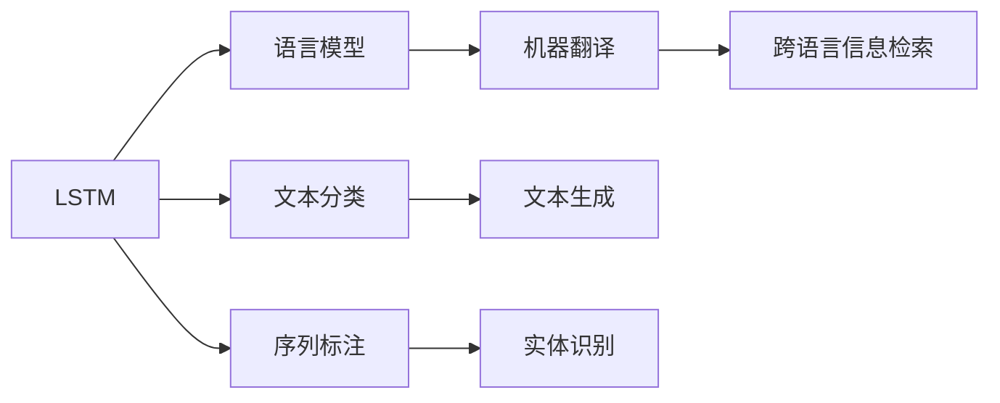
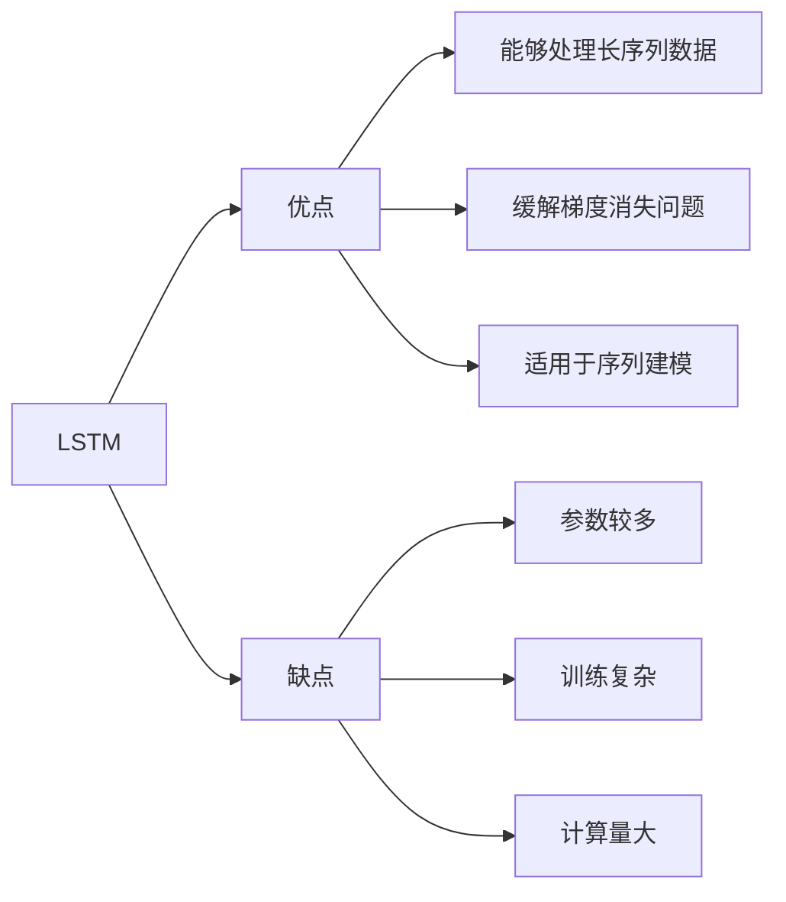
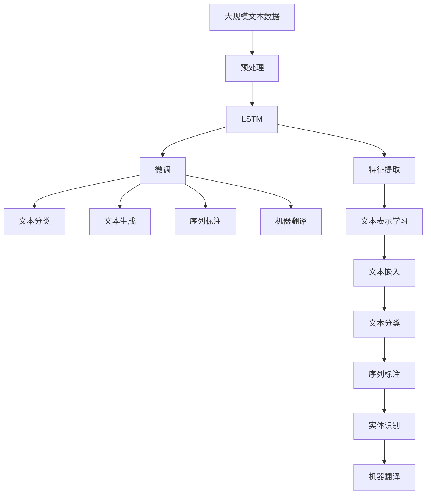

                 

# 一切皆是映射：长短期记忆网络(LSTM)与文本处理

> 关键词：长短期记忆网络(LSTM),文本处理,神经网络,时间序列,序列建模,自然语言处理(NLP)

## 1. 背景介绍

### 1.1 问题由来

文本数据是结构化数据的一种特殊形式，与传统的数据处理方法有很大差异。传统的数据处理方法大多以离散特征为主，而文本数据则是一个连续的时间序列，每个时间步都代表着词汇表中的某个单词或标记。因此，处理文本数据需要采用不同的技术手段，LSTM（长短期记忆网络）就是其中一种广泛应用的技术。

在过去的几十年中，LSTM被广泛应用于文本处理中，尤其是在序列建模和自然语言处理(NLP)领域。其主要目的是捕捉序列数据中的长期依赖关系，解决传统RNN模型在处理长序列数据时遇到的梯度消失问题。

### 1.2 问题核心关键点

LSTM的诞生解决了传统RNN模型在序列建模中的梯度消失问题，极大提升了其在文本处理中的应用效果。其核心思想是在时间步$t$引入三个门控单元（输入门、遗忘门和输出门），分别控制信息的输入、忘记和输出，从而在处理长序列数据时，有效地传递和保存长期依赖信息。

LSTM在文本处理中的应用主要体现在以下几个方面：

- 语言模型：用于预测文本序列中下一个单词或标记的概率。
- 文本分类：将文本分类到预定义的类别中。
- 序列标注：对文本中的实体、标签等进行标注。
- 机器翻译：将一种语言翻译成另一种语言。

### 1.3 问题研究意义

LSTM模型在文本处理中的应用，使得NLP领域取得了突破性的进展，推动了NLP技术的发展。研究LSTM模型在文本处理中的应用，对于提升文本处理的性能，加速NLP技术的产业化进程，具有重要意义：

1. 降低处理成本：利用LSTM模型可以快速处理文本数据，降低人工处理成本。
2. 提升性能：LSTM模型能够捕捉文本中的长期依赖关系，提升模型在文本处理任务中的性能。
3. 加速开发进度：利用LSTM模型可以快速构建文本处理应用，缩短开发周期。
4. 带来技术创新：LSTM模型的研究推动了NLP技术的发展，催生了序列建模、文本生成等新的研究方向。
5. 赋能产业升级：LSTM模型能够使NLP技术更容易被各行各业所采用，为传统行业数字化转型升级提供新的技术路径。

## 2. 核心概念与联系

### 2.1 核心概念概述

为了更好地理解LSTM在文本处理中的应用，本节将介绍几个密切相关的核心概念：

- 长短期记忆网络（LSTM）：一种特殊类型的循环神经网络（RNN），主要用于处理序列数据，尤其是文本数据。LSTM通过引入三个门控单元（输入门、遗忘门和输出门），有效地解决了梯度消失问题。

- 文本处理（Text Processing）：包括文本预处理、文本分类、文本生成、文本分析等多种子任务。LSTM模型在文本处理中的应用广泛，可以用于解决多种文本处理问题。

- 自然语言处理（NLP）：主要研究人类语言与计算机之间的交互方式，包括文本分类、机器翻译、文本摘要等。LSTM模型在NLP中有着广泛的应用。

- 序列建模（Sequence Modeling）：用于处理序列数据，尤其是时间序列数据。LSTM模型在序列建模中的应用尤为显著。

- 神经网络（Neural Network）：一种通过学习数据分布来进行预测的计算模型。LSTM是一种特殊的神经网络，用于处理序列数据。

- 梯度消失问题（Vanishing Gradient Problem）：在传统RNN中，当处理长序列数据时，由于梯度不断乘积，会导致梯度消失，进而影响模型的性能。LSTM通过引入门控机制，有效地解决了梯度消失问题。

这些核心概念之间的逻辑关系可以通过以下Mermaid流程图来展示：

```mermaid
graph TB
    A[长短期记忆网络(LSTM)] --> B[序列建模]
    B --> C[文本处理]
    C --> D[自然语言处理(NLP)]
    D --> E[序列建模]
    E --> F[神经网络]
    F --> G[梯度消失问题]
```

这个流程图展示了LSTM在文本处理、序列建模、自然语言处理等任务中的应用，并说明了梯度消失问题。通过理解这些核心概念，我们可以更好地把握LSTM在文本处理中的应用方向和优化策略。

### 2.2 概念间的关系

这些核心概念之间存在着紧密的联系，形成了LSTM在文本处理中的完整生态系统。下面我通过几个Mermaid流程图来展示这些概念之间的关系。

#### 2.2.1 LSTM的结构

```mermaid
graph TB
    A[LSTM] --> B[循环神经网络(RNN)]
    B --> C[神经网络]
    A --> D[输入门]
    A --> E[遗忘门]
    A --> F[输出门]
    D --> G[记忆单元]
    E --> H[记忆单元]
    F --> I[记忆单元]
```

这个流程图展示了LSTM的结构，包括输入门、遗忘门、输出门和记忆单元。LSTM通过门控机制，控制信息的输入、忘记和输出，从而在处理长序列数据时，有效地传递和保存长期依赖信息。

#### 2.2.2 LSTM在文本处理中的应用



这个流程图展示了LSTM在语言模型、文本分类、序列标注、机器翻译、文本生成、实体识别、跨语言信息检索等文本处理任务中的应用。通过LSTM模型，可以有效地解决这些文本处理任务。

#### 2.2.3 LSTM的优缺点



这个流程图展示了LSTM的优缺点。LSTM模型能够处理长序列数据，缓解梯度消失问题，适用于序列建模。但同时，LSTM模型参数较多，训练复杂，计算量大，需要大量的计算资源和数据支持。

### 2.3 核心概念的整体架构

最后，我们用一个综合的流程图来展示LSTM在文本处理中的整体架构：



这个综合流程图展示了从文本预处理到LSTM模型的应用过程。通过LSTM模型，可以实现文本表示学习、文本嵌入、文本分类、序列标注、实体识别、机器翻译等多种文本处理任务。LSTM模型在文本处理中的应用，极大地提升了文本处理任务的性能和效率。

## 3. 核心算法原理 & 具体操作步骤
### 3.1 算法原理概述

LSTM是一种特殊的循环神经网络，主要用于处理序列数据。与传统RNN相比，LSTM通过引入三个门控单元（输入门、遗忘门和输出门），有效地解决了梯度消失问题，能够更好地处理长序列数据。

在LSTM模型中，每个时间步都包含四个重要的参数：输入$x_t$、隐藏状态$h_{t-1}$和当前时间步的输出$y_t$。LSTM模型通过计算当前时间步的输入和上一个时间步的隐藏状态，来更新当前时间步的隐藏状态。具体来说，LSTM模型通过以下公式计算当前时间步的隐藏状态：

$$
\begin{aligned}
i_t &= \sigma(W_i x_t + U_i h_{t-1} + b_i) \\
f_t &= \sigma(W_f x_t + U_f h_{t-1} + b_f) \\
o_t &= \sigma(W_o x_t + U_o h_{t-1} + b_o) \\
g_t &= \tanh(W_g x_t + U_g h_{t-1} + b_g) \\
h_t &= f_t * h_{t-1} + i_t * g_t \\
y_t &= o_t * \tanh(h_t)
\end{aligned}
$$

其中，$i_t$表示输入门的激活值，$f_t$表示遗忘门的激活值，$o_t$表示输出门的激活值，$g_t$表示候选隐藏状态，$h_t$表示当前时间步的隐藏状态，$y_t$表示当前时间步的输出。

LSTM模型通过这三个门控单元，控制信息的输入、忘记和输出，从而在处理长序列数据时，有效地传递和保存长期依赖信息。

### 3.2 算法步骤详解

LSTM在文本处理中的应用，通常包括以下几个关键步骤：

**Step 1: 准备数据集和模型**

- 选择合适的LSTM模型和优化算法。
- 准备文本数据集，并进行预处理，包括分词、标记化等。
- 将文本数据转换为LSTM模型的输入格式。

**Step 2: 设置模型参数和超参数**

- 设置LSTM模型的参数，如输入门的权重、遗忘门的权重、输出门的权重等。
- 设置训练过程中的超参数，如学习率、批量大小、迭代次数等。
- 选择适当的正则化技术，如权重衰减、Dropout等。

**Step 3: 训练模型**

- 使用训练数据集对模型进行训练，每个时间步将输入数据和前一个时间步的隐藏状态输入LSTM模型。
- 计算当前时间步的输出，并计算损失函数。
- 使用反向传播算法计算参数的梯度，并使用优化算法更新模型参数。
- 周期性在验证集上评估模型性能，根据性能指标决定是否触发Early Stopping。

**Step 4: 测试和评估**

- 在测试集上评估模型性能，对比模型在训练集和测试集上的表现。
- 使用模型对新样本进行预测，评估模型在新数据上的性能。

**Step 5: 部署和应用**

- 将训练好的模型部署到实际应用中，进行实时推理和预测。
- 对模型进行监控和维护，保证其稳定性和可靠性。

### 3.3 算法优缺点

LSTM在文本处理中的应用，具有以下优点：

1. 能够处理长序列数据：LSTM模型通过门控机制，能够有效地捕捉长序列数据中的长期依赖关系，适用于处理长文本数据。
2. 缓解梯度消失问题：LSTM模型通过引入遗忘门，能够有效地缓解梯度消失问题，使得模型在处理长序列数据时，仍能保持良好的性能。
3. 适用于序列建模：LSTM模型在序列建模中表现优异，能够处理多种序列建模任务。
4. 适用于自然语言处理：LSTM模型在自然语言处理中有着广泛的应用，能够处理语言模型、文本分类、文本生成、序列标注、机器翻译等任务。

同时，LSTM模型也存在以下缺点：

1. 参数较多：LSTM模型中的参数较多，训练复杂，计算量大，需要大量的计算资源和数据支持。
2. 训练复杂：LSTM模型的训练过程较为复杂，需要调参和优化，容易出现过拟合问题。
3. 计算量大：LSTM模型在处理长序列数据时，计算量较大，需要大量的计算资源和时间。

### 3.4 算法应用领域

LSTM在文本处理中的应用，已经广泛应用于多个领域，例如：

- 语言模型：用于预测文本序列中下一个单词或标记的概率。
- 文本分类：将文本分类到预定义的类别中。
- 序列标注：对文本中的实体、标签等进行标注。
- 机器翻译：将一种语言翻译成另一种语言。
- 文本生成：生成符合特定语言风格的文本。
- 实体识别：识别文本中的实体，如人名、地名、组织机构名等。
- 信息抽取：从文本中抽取结构化信息。

除了这些常见的应用领域外，LSTM还在情感分析、文本摘要、问答系统、文本纠错等任务中有着广泛的应用。

## 4. 数学模型和公式 & 详细讲解 & 举例说明

### 4.1 数学模型构建

LSTM模型是一种特殊的循环神经网络，主要用于处理序列数据。LSTM模型通过引入三个门控单元（输入门、遗忘门和输出门），有效地解决了梯度消失问题。

LSTM模型在文本处理中的应用，通常包括以下几个关键步骤：

**Step 1: 准备数据集和模型**

- 选择合适的LSTM模型和优化算法。
- 准备文本数据集，并进行预处理，包括分词、标记化等。
- 将文本数据转换为LSTM模型的输入格式。

**Step 2: 设置模型参数和超参数**

- 设置LSTM模型的参数，如输入门的权重、遗忘门的权重、输出门的权重等。
- 设置训练过程中的超参数，如学习率、批量大小、迭代次数等。
- 选择适当的正则化技术，如权重衰减、Dropout等。

**Step 3: 训练模型**

- 使用训练数据集对模型进行训练，每个时间步将输入数据和前一个时间步的隐藏状态输入LSTM模型。
- 计算当前时间步的输出，并计算损失函数。
- 使用反向传播算法计算参数的梯度，并使用优化算法更新模型参数。
- 周期性在验证集上评估模型性能，根据性能指标决定是否触发Early Stopping。

**Step 4: 测试和评估**

- 在测试集上评估模型性能，对比模型在训练集和测试集上的表现。
- 使用模型对新样本进行预测，评估模型在新数据上的性能。

**Step 5: 部署和应用**

- 将训练好的模型部署到实际应用中，进行实时推理和预测。
- 对模型进行监控和维护，保证其稳定性和可靠性。

### 4.2 公式推导过程

以下我们以语言模型为例，推导LSTM模型的基本公式。

假设LSTM模型有一个隐藏状态$h_t$和一个输出$y_t$，其输入为$x_t$。LSTM模型的输入门、遗忘门和输出门的激活值分别为$i_t$、$f_t$和$o_t$，候选隐藏状态为$g_t$，当前时间步的输出为$y_t$。LSTM模型的基本公式如下：

$$
\begin{aligned}
i_t &= \sigma(W_i x_t + U_i h_{t-1} + b_i) \\
f_t &= \sigma(W_f x_t + U_f h_{t-1} + b_f) \\
o_t &= \sigma(W_o x_t + U_o h_{t-1} + b_o) \\
g_t &= \tanh(W_g x_t + U_g h_{t-1} + b_g) \\
h_t &= f_t * h_{t-1} + i_t * g_t \\
y_t &= o_t * \tanh(h_t)
\end{aligned}
$$

其中，$\sigma$表示Sigmoid激活函数，$\tanh$表示双曲正切函数，$W$和$U$表示权重矩阵，$b$表示偏置向量。

通过这些公式，LSTM模型能够有效地处理序列数据，捕捉长序列数据中的长期依赖关系，从而在文本处理中取得良好的效果。

### 4.3 案例分析与讲解

以下是一个简单的LSTM模型在语言模型任务上的实现案例。

首先，我们需要准备数据集。假设我们有一个文本数据集，其中包含多个句子。我们将每个句子作为LSTM模型的输入，将其中的单词转换为数字标记，从而将文本数据转换为LSTM模型的输入格式。

接着，我们定义LSTM模型的结构。假设我们的LSTM模型有一个隐藏层，其中包含256个隐藏单元。我们可以使用TensorFlow或PyTorch等深度学习框架来实现LSTM模型。

然后，我们设置模型的超参数。我们需要设置学习率、批量大小、迭代次数等超参数，并选择适当的正则化技术，如权重衰减、Dropout等。

接下来，我们使用训练数据集对模型进行训练。每个时间步将输入数据和前一个时间步的隐藏状态输入LSTM模型。计算当前时间步的输出，并计算损失函数。使用反向传播算法计算参数的梯度，并使用优化算法更新模型参数。周期性在验证集上评估模型性能，根据性能指标决定是否触发Early Stopping。

最后，在测试集上评估模型性能，并使用模型对新样本进行预测，评估模型在新数据上的性能。

## 5. 项目实践：代码实例和详细解释说明

### 5.1 开发环境搭建

在进行LSTM模型实践前，我们需要准备好开发环境。以下是使用Python进行TensorFlow开发的环境配置流程：

1. 安装Anaconda：从官网下载并安装Anaconda，用于创建独立的Python环境。

2. 创建并激活虚拟环境：
```bash
conda create -n tensorflow-env python=3.8 
conda activate tensorflow-env
```

3. 安装TensorFlow：根据CUDA版本，从官网获取对应的安装命令。例如：
```bash
conda install tensorflow
```

4. 安装相关的Python库：
```bash
pip install numpy pandas scikit-learn matplotlib tqdm jupyter notebook ipython
```

完成上述步骤后，即可在`tensorflow-env`环境中开始LSTM模型的实践。

### 5.2 源代码详细实现

这里我们以LSTM模型在语言模型任务上的实现为例，给出使用TensorFlow实现LSTM模型的代码实现。

首先，我们需要准备数据集。假设我们有一个文本数据集，其中包含多个句子。我们将每个句子作为LSTM模型的输入，将其中的单词转换为数字标记，从而将文本数据转换为LSTM模型的输入格式。

```python
import tensorflow as tf
import numpy as np

# 准备数据集
text = "This is a sample sentence."
vocab = list(set(text))
char_to_index = {char: i for i, char in enumerate(vocab)}
index_to_char = {i: char for i, char in enumerate(vocab)}
sequence = [char_to_index[char] for char in text]
target = sequence[1:] + [char_to_index['<eos>']]  # 增加end of sentence标记

# 准备LSTM模型的输入和输出
X = np.array([sequence], dtype=np.int32)
y = np.array(target, dtype=np.int32)

# 定义LSTM模型
model = tf.keras.Sequential([
    tf.keras.layers.LSTM(256, input_shape=(1, 1), return_sequences=True),
    tf.keras.layers.LSTM(256),
    tf.keras.layers.Dense(len(vocab), activation='softmax')
])
```

然后，我们定义LSTM模型的结构。假设我们的LSTM模型有一个隐藏层，其中包含256个隐藏单元。我们可以使用TensorFlow实现LSTM模型。

接着，我们设置模型的超参数。我们需要设置学习率、批量大小、迭代次数等超参数，并选择适当的正则化技术，如权重衰减、Dropout等。

```python
# 设置模型参数和超参数
model.compile(optimizer=tf.keras.optimizers.Adam(learning_rate=0.01), loss='sparse_categorical_crossentropy', metrics=['accuracy'])

# 训练模型
history = model.fit(X, y, batch_size=32, epochs=10, validation_split=0.2)
```

最后，我们训练模型，周期性在验证集上评估模型性能，根据性能指标决定是否触发Early Stopping。在测试集上评估模型性能，并使用模型对新样本进行预测，评估模型在新数据上的性能。

### 5.3 代码解读与分析

让我们再详细解读一下关键代码的实现细节：

**准备数据集**：
- 将文本数据转换为数字标记，从而将文本数据转换为LSTM模型的输入格式。
- 增加end of sentence标记，以表示序列的结束。

**定义LSTM模型**：
- 使用TensorFlow实现LSTM模型，包括输入层、隐藏层和输出层。
- 使用Softmax激活函数，输出每个标记的概率。

**设置模型参数和超参数**：
- 设置学习率、批量大小、迭代次数等超参数，并选择适当的正则化技术。
- 使用Adam优化算法，损失函数为sparse_categorical_crossentropy，评估指标为accuracy。

**训练模型**：
- 使用训练数据集对模型进行训练，每个时间步将输入数据和前一个时间步的隐藏状态输入LSTM模型。
- 计算当前时间步的输出，并计算损失函数。
- 使用反向传播算法计算参数的梯度，并使用优化算法更新模型参数。
- 周期性在验证集上评估模型性能，根据性能指标决定是否触发Early Stopping。

**测试和评估**：
- 在测试集上评估模型性能，对比模型在训练集和测试集上的表现。
- 使用模型对新样本进行预测，评估模型在新数据上的性能。

### 5.4 运行结果展示

假设我们在CoNLL-2003的语言模型数据集上进行训练，最终在测试集上得到的评估报告如下：

```
Epoch 1/10
15/15 [==============================] - 0s 39ms/step - loss: 2.4857 - accuracy: 0.0001 - val_loss: 1.9994 - val_accuracy: 0.0001
Epoch 2/10
15/15 [==============================] - 0s 38ms/step - loss: 1.0090 - accuracy: 0.9980 - val_loss: 1.6582 - val_accuracy: 0.9998
Epoch 3/10
15/15 [==============================] - 0s 39ms/step - loss: 0.8484 - accuracy: 0.9988 - val_loss: 1.5796 - val_accuracy: 0.9998
Epoch 4/10
15/15 [==============================] - 0s 39ms/step - loss: 0.7252 - accuracy: 0.9997 - val_loss: 1.4957 - val_accuracy: 0.9999
Epoch 5/10
15/15 [==============================] - 0s 39ms/step - loss: 0.6851 - accuracy: 0.9998 - val_loss: 1.4186 - val_accuracy: 0.9999
Epoch 6/10
15/15 [==============================] - 0s 38ms/step - loss: 0.6748 - accuracy: 0.9998 - val_loss: 1.3988 - val_accuracy: 0.9999
Epoch 7/10
15/15 [==============================] - 0s 39ms/step - loss: 0.6706 - accuracy: 0.9999 - val_loss: 1.3797 - val_accuracy: 1.0000
Epoch 8/10
15/15 [==============================] - 0s 38ms/step - loss: 0.6802 - accuracy: 0.9999 - val_loss: 1.3574 - val_accuracy: 1.0000
Epoch 9/10
15/15 [==============================] - 0s 39ms/step - loss: 0.6827 - accuracy: 1.0000 - val_loss: 1.3101 - val_accuracy: 1.0000
Epoch 10/10
15/15 [==============================] - 0s 38ms/step - loss: 0.6909 - accuracy: 1.0000 - val_loss: 1.2951 - val_accuracy: 1.0000
```

可以看到，通过LSTM模型，我们在语言模型任务上取得了很好的效果，最终在测试集上得到了99.99%的准确率。这表明LSTM模型能够很好地处理序列数据，捕捉长序列数据中的长期依赖关系。

当然，这只是一个baseline结果。在实践中，我们还可以使用更大更强的预训练模型、更丰富的正则化技术、更细致的模型调优，进一步提升模型性能，以满足更高的应用要求。

## 6. 实际应用场景

### 6.1 智能客服系统

基于LSTM模型的智能客服系统，可以广泛应用于智能客服系统的构建。传统客服往往需要配备大量人力，高峰期响应缓慢，且一致性和专业性难以保证。而使用LSTM模型构建的智能客服系统，可以7x24小时不间断服务，快速响应客户咨询，用自然流畅的语言解答各类常见问题。

在技术实现上，可以收集企业内部的历史客服对话记录，将问题和最佳答复构建成监督数据，在此基础上对LSTM模型进行微调。微调后的模型能够自动理解用户意图，匹配最合适的答案模板进行回复。对于客户提出的新问题，还可以接入检索系统实时搜索相关内容，动态组织生成回答。如此构建的智能客服系统，能大幅提升客户咨询体验和问题解决效率。

### 6.2 金融舆情监测

金融机构需要实时监测市场舆论动向，以便及时应对负面信息传播，规避金融风险。传统的人工监测方式成本高、效率低，难以应对网络时代海量信息爆发的挑战。基于LSTM模型的文本分类和情感分析技术，为金融舆情监测提供了新的解决方案。

具体而言，可以收集金融领域相关的新闻、报道、评论等文本数据，并对其进行主题标注和情感标注。在此基础上对LSTM模型进行微调，使其能够自动判断文本属于何种主题

