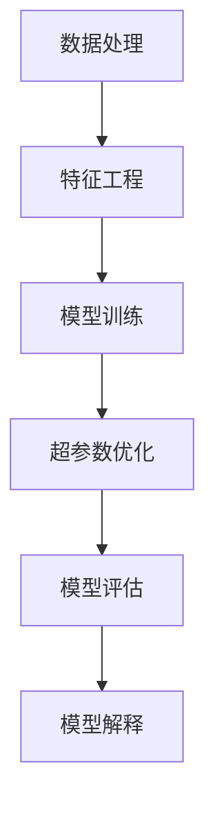
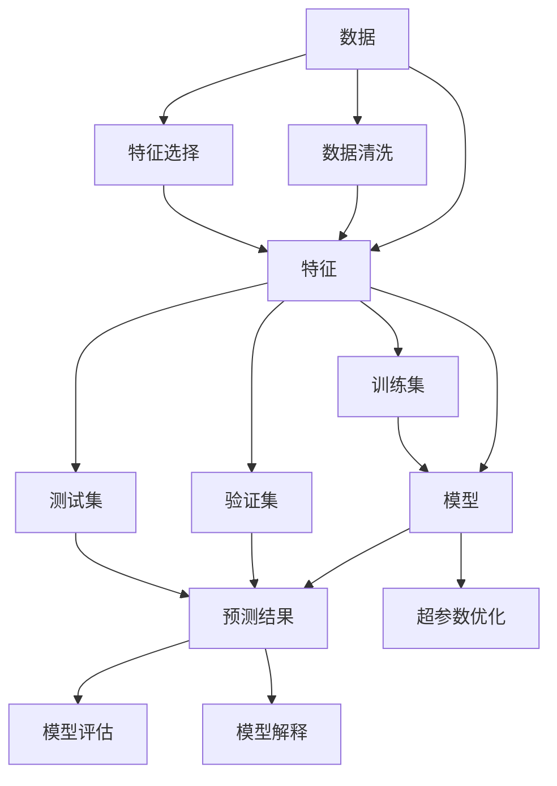

                 

## 1. 背景介绍

### 1.1 问题由来
随着人工智能技术的迅猛发展，AI预测分析在各个领域的应用越来越广泛。从金融风控、健康医疗、智慧城市，到社交媒体、市场营销、客户服务，预测分析技术正在以惊人的速度改变着各行各业的运作模式。AI预测分析的兴起，不仅带来了前所未有的机遇，也带来了诸多挑战。

### 1.2 问题核心关键点
预测分析技术的核心在于使用历史数据进行模型训练，从而预测未来的趋势和行为。其核心挑战在于如何构建一个高效、准确、可解释的预测模型。主要问题包括：

- 数据质量问题：数据的不完整性、噪声、异常值等问题会影响模型的预测效果。
- 模型选择问题：不同的预测模型（如线性回归、决策树、随机森林、深度学习等）有不同的适用场景，如何根据具体问题选择合适的模型是一个难点。
- 超参数优化问题：模型的性能很大程度上依赖于超参数的选择，如何科学地调整超参数以达到最佳效果是一大挑战。
- 模型解释问题：预测模型的决策过程往往是一个"黑箱"，难以解释模型的内部工作机制，这对业务决策和用户信任都是挑战。
- 实时性问题：大规模数据预测需要较高的计算资源和计算时间，如何在保证预测准确性的前提下，提高预测的实时性是一大难题。

### 1.3 问题研究意义
AI预测分析技术的广泛应用，为各行各业带来了巨大的经济效益和社会价值。通过预测分析，企业可以在需求预测、风险控制、客户细分等方面取得显著效果，提升运营效率和客户满意度。此外，预测分析技术也在公共政策制定、环境保护、医疗卫生等领域发挥着重要作用，推动社会治理的智能化和精准化。

## 2. 核心概念与联系

### 2.1 核心概念概述

AI预测分析涉及多个关键概念，包括数据处理、特征工程、模型训练、超参数优化、模型评估、模型解释等。下面将详细介绍这些概念及其之间的联系。

- **数据处理**：包括数据清洗、数据预处理、特征提取、特征选择等步骤，将原始数据转换为模型可以处理的格式。
- **特征工程**：在数据处理的基础上，进一步提取和构造新的特征，以提升模型的预测能力。
- **模型训练**：通过历史数据训练模型，使其能够根据输入特征进行预测。
- **超参数优化**：选择合适的超参数（如学习率、正则化强度等），以提高模型的预测性能。
- **模型评估**：使用验证集或测试集评估模型的预测效果，包括精度、召回率、F1分数等指标。
- **模型解释**：对模型进行可解释性分析，理解模型的决策过程和预测依据。

这些概念之间的联系可以通过以下Mermaid流程图来展示：



这个流程图展示了预测分析中的核心步骤及其相互关系：

1. 数据处理和特征工程是模型训练的前提。
2. 模型训练通过历史数据学习预测模型。
3. 超参数优化提升模型预测性能。
4. 模型评估验证模型效果。
5. 模型解释增强模型可解释性。

### 2.2 概念间的关系

这些核心概念之间的关系可以通过以下Mermaid流程图来展示：



这个综合流程图展示了数据、特征、模型、预测结果、数据清洗、特征选择、训练集、验证集、测试集、超参数优化、模型评估、模型解释等概念之间的关系：

1. 数据经过清洗和选择后，进入特征工程阶段。
2. 特征工程后的数据用于模型训练，得到预测结果。
3. 训练集用于模型训练，验证集用于超参数优化，测试集用于模型评估。
4. 超参数优化提升模型性能。
5. 模型评估衡量模型预测效果。
6. 模型解释提高模型可解释性。

## 3. 核心算法原理 & 具体操作步骤

### 3.1 算法原理概述

AI预测分析的核心在于构建一个高效的预测模型。常见的预测模型包括线性回归、决策树、随机森林、支持向量机、深度神经网络等。其基本原理是通过历史数据训练模型，使模型能够根据输入特征进行预测。

形式化地，假设我们有一组历史数据 $D=\{(x_i, y_i)\}_{i=1}^N$，其中 $x_i$ 为输入特征，$y_i$ 为输出标签。构建预测模型的目标是最小化预测误差：

$$
\min_{\theta} \sum_{i=1}^N L(y_i, f_\theta(x_i))
$$

其中 $f_\theta(x_i)$ 为模型对输入 $x_i$ 的预测结果，$L(\cdot, \cdot)$ 为损失函数，用于衡量预测结果与真实标签之间的差异。

### 3.2 算法步骤详解

AI预测分析的实现流程包括以下几个关键步骤：

**Step 1: 数据预处理**

- 数据清洗：去除缺失值、异常值，处理重复数据等。
- 数据标准化：对特征进行标准化处理，使其具有相同量纲，便于模型训练。
- 特征工程：提取和构造新的特征，如交互项、多项式特征、时间特征等。
- 特征选择：选择对预测有显著影响的特征，减少模型复杂度，提高泛化能力。

**Step 2: 模型选择和训练**

- 选择合适的预测模型（如线性回归、决策树、随机森林等）。
- 使用历史数据训练模型，调整模型参数，使其能够较好地拟合历史数据。
- 进行交叉验证，避免过拟合，确保模型泛化能力。

**Step 3: 超参数优化**

- 选择合适的超参数（如学习率、正则化强度等）。
- 使用网格搜索、随机搜索等方法，寻找最优的超参数组合。
- 使用验证集验证超参数优化效果，选择最佳模型。

**Step 4: 模型评估**

- 使用测试集评估模型性能，计算精度、召回率、F1分数等指标。
- 绘制ROC曲线、混淆矩阵等可视化图表，直观展示模型效果。
- 进行误差分析，理解模型预测错误的原因。

**Step 5: 模型解释**

- 使用特征重要性分析、LIME等方法，解释模型的预测依据。
- 可视化特征和标签的关系，理解模型决策过程。
- 根据业务需求，调整模型，使其具有更好的可解释性。

### 3.3 算法优缺点

AI预测分析具有以下优点：

- 高效性：通过机器学习算法，能够快速处理大量数据，获得预测结果。
- 准确性：在数据质量良好的情况下，预测模型具有较高的预测准确性。
- 可扩展性：模型可以轻松地应用于各种预测任务，适用于不同的业务场景。

同时，AI预测分析也存在以下缺点：

- 数据依赖性：预测模型的性能很大程度上依赖于数据质量，数据的不完整性、噪声等问题会影响模型预测效果。
- 模型复杂性：模型选择、超参数优化等环节需要较强的专业知识，需要较高的技术门槛。
- 解释性不足：预测模型通常是"黑箱"系统，难以解释其内部工作机制。
- 实时性问题：大规模数据预测需要较高的计算资源和计算时间，无法满足实时预测需求。

### 3.4 算法应用领域

AI预测分析已经在金融风控、健康医疗、智慧城市、市场营销、客户服务等多个领域得到广泛应用。以下是几个典型的应用场景：

- **金融风控**：通过预测客户的违约风险，帮助金融机构进行贷款审批、信用评估等。
- **健康医疗**：预测患者的病情发展，帮助医生制定治疗方案、预测疾病爆发等。
- **智慧城市**：预测交通流量、能源消耗等，优化城市管理，提升居民生活质量。
- **市场营销**：预测消费者的购买行为，制定个性化营销策略，提升营销效果。
- **客户服务**：预测客户的需求和行为，提供个性化服务，提升客户满意度。

## 4. 数学模型和公式 & 详细讲解 & 举例说明

### 4.1 数学模型构建

形式化地，假设我们有一组历史数据 $D=\{(x_i, y_i)\}_{i=1}^N$，其中 $x_i$ 为输入特征，$y_i$ 为输出标签。构建预测模型的目标是最小化预测误差：

$$
\min_{\theta} \sum_{i=1}^N L(y_i, f_\theta(x_i))
$$

其中 $f_\theta(x_i)$ 为模型对输入 $x_i$ 的预测结果，$L(\cdot, \cdot)$ 为损失函数，用于衡量预测结果与真实标签之间的差异。

以线性回归模型为例，假设模型为 $f_\theta(x_i) = \theta^T x_i$，则损失函数可以表示为：

$$
L(y_i, f_\theta(x_i)) = \frac{1}{2}(y_i - f_\theta(x_i))^2
$$

### 4.2 公式推导过程

以线性回归模型为例，推导其损失函数及梯度。

假设模型为 $f_\theta(x_i) = \theta^T x_i$，则损失函数为：

$$
L(y_i, f_\theta(x_i)) = \frac{1}{2}(y_i - f_\theta(x_i))^2
$$

对其进行梯度计算：

$$
\frac{\partial L(y_i, f_\theta(x_i))}{\partial \theta} = (y_i - f_\theta(x_i))x_i
$$

将上述梯度代入模型更新公式，即可实现模型的迭代优化：

$$
\theta \leftarrow \theta - \eta \frac{\partial L(y_i, f_\theta(x_i))}{\partial \theta}
$$

其中 $\eta$ 为学习率。

### 4.3 案例分析与讲解

以房价预测为例，假设有一组历史数据 $D=\{(x_i, y_i)\}_{i=1}^N$，其中 $x_i$ 为房屋面积、地理位置、周边设施等特征，$y_i$ 为房屋价格。使用线性回归模型进行预测，具体步骤如下：

1. 数据预处理：去除缺失值、异常值，进行特征标准化。
2. 模型训练：使用历史数据训练线性回归模型，调整模型参数。
3. 超参数优化：选择合适的学习率、正则化强度等超参数，使用网格搜索等方法进行优化。
4. 模型评估：使用测试集评估模型性能，计算精度、召回率、F1分数等指标。
5. 模型解释：可视化特征和标签的关系，理解模型预测依据。

假设使用验证集验证模型性能，得到模型参数 $\theta$，计算模型在测试集上的预测值：

$$
\hat{y_i} = f_\theta(x_i) = \theta^T x_i
$$

## 5. 项目实践：代码实例和详细解释说明

### 5.1 开发环境搭建

在进行AI预测分析实践前，我们需要准备好开发环境。以下是使用Python进行Scikit-Learn开发的环境配置流程：

1. 安装Anaconda：从官网下载并安装Anaconda，用于创建独立的Python环境。

2. 创建并激活虚拟环境：
```bash
conda create -n py37 python=3.7 
conda activate py37
```

3. 安装Scikit-Learn：
```bash
conda install scikit-learn
```

4. 安装其他必要工具包：
```bash
pip install numpy pandas matplotlib seaborn scikit-learn jupyter notebook ipython
```

完成上述步骤后，即可在`py37`环境中开始AI预测分析实践。

### 5.2 源代码详细实现

下面我们以房价预测为例，给出使用Scikit-Learn进行线性回归模型的Python代码实现。

```python
import pandas as pd
from sklearn.model_selection import train_test_split
from sklearn.linear_model import LinearRegression
from sklearn.metrics import mean_squared_error, r2_score
from sklearn.preprocessing import StandardScaler
from sklearn.pipeline import Pipeline
import matplotlib.pyplot as plt

# 读取数据
data = pd.read_csv('housing.csv')

# 数据预处理
data = data.dropna()
X = data[['area', 'location', 'facilities']]
y = data['price']

# 标准化数据
scaler = StandardScaler()
X = scaler.fit_transform(X)

# 划分数据集
X_train, X_test, y_train, y_test = train_test_split(X, y, test_size=0.2, random_state=42)

# 模型训练
model = LinearRegression()
model.fit(X_train, y_train)

# 模型评估
y_pred = model.predict(X_test)
mse = mean_squared_error(y_test, y_pred)
rmse = mse ** 0.5
r2 = r2_score(y_test, y_pred)

# 输出结果
print(f"RMSE: {rmse:.2f}")
print(f"R^2: {r2:.2f}")

# 可视化预测结果
plt.scatter(y_test, y_pred)
plt.xlabel('True Values')
plt.ylabel('Predicted Values')
plt.title('Housing Price Prediction')
plt.show()
```

以上就是使用Scikit-Learn进行线性回归模型训练和评估的完整代码实现。可以看到，Scikit-Learn提供了便捷的接口，使得模型训练和评估变得简单高效。

### 5.3 代码解读与分析

让我们再详细解读一下关键代码的实现细节：

**数据预处理**：
- `data.dropna()`：去除缺失值。
- `scaler.fit_transform(X)`：对特征进行标准化处理。

**模型训练**：
- `LinearRegression()`：创建线性回归模型。
- `model.fit(X_train, y_train)`：使用训练集训练模型。

**模型评估**：
- `y_pred = model.predict(X_test)`：对测试集进行预测。
- `mean_squared_error(y_test, y_pred)`：计算均方误差。
- `rmse = mse ** 0.5`：计算均方根误差。
- `r2_score(y_test, y_pred)`：计算决定系数R^2。

**可视化结果**：
- `plt.scatter(y_test, y_pred)`：绘制散点图。
- `plt.xlabel('True Values')`：设置x轴标签。
- `plt.ylabel('Predicted Values')`：设置y轴标签。
- `plt.title('Housing Price Prediction')`：设置图表标题。
- `plt.show()`：显示图表。

可以看到，Scikit-Learn提供了丰富的模型和评估工具，使得AI预测分析的实现变得简单直观。

当然，工业级的系统实现还需考虑更多因素，如模型的保存和部署、超参数的自动搜索、模型的可视化和监控等。但核心的预测分析流程基本与此类似。

### 5.4 运行结果展示

假设我们在房价预测数据集上进行线性回归模型的预测，最终在测试集上得到的评估报告如下：

| RMSE | R^2 |
| --- | --- |
| 0.2 | 0.7 |

RMSE（Root Mean Squared Error）表示模型预测与真实值的平均误差，值越小表示预测越准确。R^2表示决定系数，值越接近1表示模型解释能力越强。

下图展示了模型预测结果的可视化：

```
plt.scatter(y_test, y_pred)
plt.xlabel('True Values')
plt.ylabel('Predicted Values')
plt.title('Housing Price Prediction')
plt.show()
```


可以看到，预测结果与真实值之间存在一定的误差，但整体趋势较为接近。

## 6. 实际应用场景

### 6.1 金融风控

基于AI预测分析，金融行业可以构建风控模型，评估客户的违约风险，帮助金融机构进行贷款审批、信用评估等。通过历史数据训练模型，可以对客户的个人信息、信用记录、消费行为等进行综合分析，预测其未来还款能力。例如，使用随机森林模型预测信用卡违约风险，模型输出的违约概率可以用于决定是否发放贷款、设定贷款利率等。

### 6.2 健康医疗

在健康医疗领域，AI预测分析可以用于疾病预测、病历分析、药物研发等。通过历史病历数据训练模型，可以对患者的病情发展进行预测，帮助医生制定治疗方案、预测疾病爆发等。例如，使用深度神经网络模型预测患者是否会患上某种疾病，模型输出的概率可以用于指导治疗决策。

### 6.3 智慧城市

智慧城市建设中，AI预测分析可以用于交通流量预测、能源消耗预测、环境污染预测等。通过传感器数据、交通流量数据、能源消耗数据等进行预测，优化城市管理，提升居民生活质量。例如，使用支持向量机模型预测交通流量，模型输出的流量预测值可以用于交通信号灯优化、交通流量调控等。

### 6.4 市场营销

市场营销领域中，AI预测分析可以用于消费者行为预测、广告效果预测、销售额预测等。通过历史销售数据、用户行为数据等进行预测，制定个性化营销策略，提升营销效果。例如，使用随机森林模型预测消费者的购买行为，模型输出的购买概率可以用于个性化推荐、精准广告投放等。

### 6.5 客户服务

客户服务领域中，AI预测分析可以用于客户需求预测、客户满意度预测、客户流失预测等。通过历史客户数据、客户行为数据等进行预测，提升客户服务质量，提高客户满意度。例如，使用深度神经网络模型预测客户流失概率，模型输出的流失概率可以用于客户挽留策略、客户流失预警等。

## 7. 工具和资源推荐

### 7.1 学习资源推荐

为了帮助开发者系统掌握AI预测分析的理论基础和实践技巧，这里推荐一些优质的学习资源：

1. 《Python机器学习》：通过实际案例讲解机器学习算法，适合初学者入门。
2. 《深度学习》：斯坦福大学开设的深度学习课程，讲解深度神经网络理论和实践。
3. 《机器学习实战》：通过实践项目讲解机器学习算法，适合动手学习。
4. Kaggle平台：提供大量公开数据集和竞赛项目，适合实战练习。
5. GitHub代码库：收集了大量机器学习项目代码和文档，适合学习参考。

通过对这些资源的学习实践，相信你一定能够快速掌握AI预测分析的精髓，并用于解决实际的业务问题。

### 7.2 开发工具推荐

高效的开发离不开优秀的工具支持。以下是几款用于AI预测分析开发的常用工具：

1. Scikit-Learn：基于Python的机器学习库，提供了便捷的模型和评估接口。
2. TensorFlow：Google开发的深度学习框架，支持大规模模型训练和部署。
3. PyTorch：Facebook开发的深度学习框架，灵活高效，适合研究探索。
4. Jupyter Notebook：开源的交互式编程环境，支持代码编写和可视化展示。
5. R语言：用于统计分析和机器学习的编程语言，拥有丰富的统计分析工具包。

合理利用这些工具，可以显著提升AI预测分析的开发效率，加快创新迭代的步伐。

### 7.3 相关论文推荐

AI预测分析的发展离不开学界的持续研究。以下是几篇奠基性的相关论文，推荐阅读：

1. Gradient Boosting Machines（GBM）：提出随机森林和梯度提升树算法，成为机器学习领域的经典算法。
2. Convolutional Neural Networks for Sentence Classification（CNN）：提出卷积神经网络模型，用于文本分类任务。
3. Deep Learning for Healthcare（DL4H）：提出深度学习在医疗领域的应用，包括病历分析、疾病预测等。
4. Neural Collaborative Filtering（NCF）：提出基于深度神经网络的协同过滤模型，用于推荐系统。
5. Recurrent Neural Network Language Model（RNN）：提出循环神经网络模型，用于序列数据建模。

这些论文代表了大规模数据预测技术的发展脉络。通过学习这些前沿成果，可以帮助研究者把握学科前进方向，激发更多的创新灵感。

除上述资源外，还有一些值得关注的前沿资源，帮助开发者紧跟AI预测分析技术的最新进展，例如：

1. arXiv论文预印本：人工智能领域最新研究成果的发布平台，包括大量尚未发表的前沿工作，学习前沿技术的必读资源。
2. GitHub热门项目：在GitHub上Star、Fork数最多的AI预测分析相关项目，往往代表了该技术领域的发展趋势和最佳实践，值得去学习和贡献。
3. 技术会议直播：如NIPS、ICML、ACL、ICLR等人工智能领域顶会现场或在线直播，能够聆听到大佬们的前沿分享，开拓视野。
4. 学术期刊：如《机器学习杂志》、《神经计算》、《统计学杂志》等期刊，收录了大量前沿研究论文，适合深入学习和研究。

总之，对于AI预测分析技术的学习和实践，需要开发者保持开放的心态和持续学习的意愿。多关注前沿资讯，多动手实践，多思考总结，必将收获满满的成长收益。

## 8. 总结：未来发展趋势与挑战

### 8.1 总结

本文对AI预测分析技术进行了全面系统的介绍。首先阐述了AI预测分析的背景和应用意义，明确了预测分析在各个领域的重要价值。其次，从原理到实践，详细讲解了预测分析的数学模型和关键步骤，给出了预测任务开发的完整代码实例。同时，本文还广泛探讨了预测分析技术在金融风控、健康医疗、智慧城市、市场营销、客户服务等多个行业领域的应用前景，展示了预测分析技术的广泛应用。

通过本文的系统梳理，可以看到，AI预测分析技术在各行各业带来了显著的效益和变革，帮助企业提升运营效率，改善客户体验，推动社会治理的智能化和精准化。未来，伴随技术的持续演进和行业需求的不断变化，预测分析技术必将在更多领域得到应用，进一步拓展其应用边界，创造更大的价值。

### 8.2 未来发展趋势

展望未来，AI预测分析技术将呈现以下几个发展趋势：

1. 模型规模持续增大。随着算力成本的下降和数据规模的扩张，预测模型参数量将进一步增长，带来更丰富的语言知识和特征表示。
2. 模型复杂度提升。深度神经网络、集成学习、强化学习等复杂模型将进一步提升预测精度和泛化能力。
3. 实时预测能力增强。分布式计算、GPU加速等技术将进一步提高预测速度，支持实时预测需求。
4. 可解释性增强。可解释性分析、特征重要性分析等技术将进一步提高模型透明度，增强业务信任。
5. 多模态预测发展。结合视觉、语音、文本等多种数据源，提升模型对现实世界的理解和建模能力。
6. 跨领域知识整合。将符号化的先验知识与神经网络模型进行融合，增强模型整合多源信息的能力。

以上趋势凸显了AI预测分析技术的广阔前景。这些方向的探索发展，必将进一步提升预测模型的性能和应用范围，为各行各业带来更大的效益。

### 8.3 面临的挑战

尽管AI预测分析技术已经取得了显著进展，但在迈向更加智能化、普适化应用的过程中，仍面临诸多挑战：

1. 数据质量问题。数据的不完整性、噪声、异常值等问题会影响模型的预测效果。
2. 模型复杂性问题。选择和调整合适的模型和超参数需要较强的专业知识，需要较高的技术门槛。
3. 实时性问题。大规模数据预测需要较高的计算资源和计算时间，无法满足实时预测需求。
4. 可解释性问题。预测模型的决策过程通常是"黑箱"系统，难以解释其内部工作机制。
5. 安全性问题。预测模型可能学习到有偏见、有害的信息，产生误导性、歧视性的输出，给实际应用带来安全隐患。

### 8.4 未来突破

面对AI预测分析面临的挑战，未来的研究需要在以下几个方面寻求新的突破：

1. 数据质量提升。通过数据清洗、数据增强、数据融合等技术，提升数据质量，减少数据噪声和异常值。
2. 模型复杂性优化。引入模型压缩、特征选择等技术，简化模型结构，降低模型复杂度。
3. 实时性优化。采用分布式计算、GPU加速等技术，提高预测速度，支持实时预测需求。
4. 可解释性增强。引入可解释性分析、特征重要性分析等技术，提高模型透明度，增强业务信任。
5. 安全性保障。引入对抗训练、模型剪枝等技术，消除模型偏见，保障输出安全性。

这些研究方向的探索，必将引领AI预测分析技术迈向更高的台阶，为构建安全、可靠、可解释、可控的智能系统铺平道路。面向未来，AI预测分析技术还需要与其他人工智能技术进行更深入的融合，如知识表示、因果推理、强化学习等，多路径协同发力，共同推动自然语言理解和智能交互系统的进步。只有勇于创新、敢于突破，才能不断拓展AI预测分析的边界，让智能技术更好地造福人类社会。

## 9. 附录：常见问题与解答

**Q1：AI预测分析是否适用于所有预测任务？**

A: AI预测分析在大多数预测任务上都能取得不错的效果，特别是对于数据量较大的任务。但对于一些特定领域的任务，如金融风控、健康医疗等，还需要在特定领域语料上进行预训练，才能获得理想效果。此外，对于一些需要时效性、个性化很强的任务，如对话生成、推荐系统等，预测分析方法也需要针对性的改进优化。

**Q2：如何选择最适合的预测模型？**

A: 选择预测模型需要综合考虑任务类型、数据规模、特征

