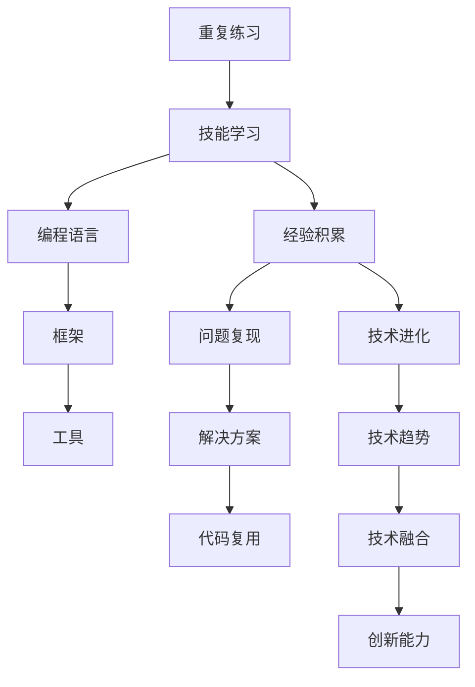

                 

## 1. 背景介绍

“一万小时定律”最初由心理学家安德斯·埃里克森（Anders Ericsson）和罗伯特·普尔（Robert Pool）在1971年的经典论文《寻找国际象棋大师的秘密》（"Does Deliberate Practice Make the Difference?"）中提出。他们研究了国际象棋大师级选手与普通选手的练习差异，发现所谓的“一万小时定律”：要成为领域内的专家，需投入至少一万小时的重复练习。

“一万小时定律”引发了广泛讨论，并被应用于各类技能的培养，包括编程、音乐、运动等。尽管这一数字未必精确，但这一理论的核心精神——长期、有目标的重复练习，对于技能提升至关重要。本文将基于此理论，探讨在IT领域中重复练习的重要性，并结合具体的技术实践给出指导。

## 2. 核心概念与联系

“一万小时定律”虽被广泛应用于技能培养，但应用于IT技术领域需进一步理解其内涵。在本节，我们将介绍核心概念与联系，以便深刻理解“一万小时定律”在IT技术提升中的重要性。

### 2.1 核心概念概述

**重复练习(Repetition Practice)**：在IT领域，重复练习是指对特定技能或知识的反复操作和应用。在实际应用中，这通常意味着编写、调试、部署、维护、优化等各个环节的不断循环。

**技能学习(Skill Learning)**：在IT领域，技能学习不仅包括编程语言、框架、工具等具体技术知识，还涵盖系统设计、项目管理、用户界面等软技能。通过重复练习，可以系统化掌握这些技能。

**经验积累(Experience Accumulation)**：通过重复练习积累的“经验”并不仅仅是代码行数，还包括对问题域的理解、项目协作的技巧、代码复用的能力等。这些经验往往在未来的实际应用中发挥关键作用。

**技术进化(Technology Evolution)**：在快速发展的IT领域，技术不断演变。通过重复练习，可以跟上技术的前沿，理解技术趋势，提升自身竞争力。

### 2.2 核心概念的联系

“一万小时定律”与IT技术提升的联系在于：

1. **技能积累与进阶**：任何IT技能的精通，都需要大量的重复练习。通过持续练习，从初级到高级，最终达到专家级别。
2. **经验迭代与提升**：实际项目中的问题复现与解决，是技术进步的重要动力。通过重复实践，从问题中学习，解决问题，进而提升技术水平。
3. **知识复用与优化**：在实际项目中，常见的问题往往重复出现。通过重复练习，可以总结出最优的解决方案，实现代码的复用与优化。
4. **技能组合与创新**：信息技术是多种技术的组合和创新。通过重复练习，可以掌握多种技术，实现不同技术的组合与创新，提升解决复杂问题的能力。

这些联系构成了一个循环，通过持续的实践和反思，技术水平不断提升，经验不断丰富，最终实现从新手到专家的蜕变。

### 2.3 核心概念的整体架构

“一万小时定律”在IT技术提升中的整体架构如下：



这个架构展示了“一万小时定律”在IT技术提升中的作用路径：

1. 通过重复练习，掌握编程语言、框架、工具等基本技能。
2. 在实际项目中积累经验，通过解决问题和代码复用，提升技能水平。
3. 跟随技术趋势，更新技术知识，实现技术进阶。
4. 通过技能组合与创新，解决复杂问题，实现技术突破。

## 3. 核心算法原理 & 具体操作步骤

### 3.1 算法原理概述

“一万小时定律”在IT领域的应用，本质上是一种长期、有目标的重复练习方法。在算法层面，这一过程可以分为以下几个步骤：

1. **目标设定**：明确学习目标，包括学习内容、期望达到的水平、完成时间等。
2. **制定计划**：根据目标设定，制定详细的练习计划，包括每日、每周、每月的练习量、学习内容等。
3. **执行与反馈**：根据计划执行练习，定期进行自我反馈，评估学习效果。
4. **迭代优化**：根据反馈结果，调整学习计划和策略，优化学习效果。

通过这一系列步骤，在“一万小时”的长期积累中，逐步提升技术水平，积累经验，最终实现技术突破。

### 3.2 算法步骤详解

**Step 1: 目标设定**

- **学习目标**：明确想要学习的技能或知识，如掌握某种编程语言、理解某个技术框架、开发某个项目等。
- **期望水平**：设定期望达到的技术水平，如初级、中级、高级或专家级别。
- **时间期限**：设定完成目标的时间期限，如一年、两年或更长时间。

**Step 2: 制定计划**

- **练习内容**：根据目标设定，确定需要练习的技能或知识内容，如编写代码、调试程序、阅读文档等。
- **练习量**：根据学习目标，确定每天、每周、每月的练习量，如每天至少练习2小时，每周至少练习15小时等。
- **学习资源**：列出学习资源，如书籍、视频、课程、项目等。

**Step 3: 执行与反馈**

- **每日执行**：按照计划进行练习，记录每天的学习内容、时间等。
- **定期反馈**：每周或每月对学习效果进行自我评估，记录遇到的难题和解决方案。
- **调整计划**：根据反馈结果，调整学习计划和策略，如增加学习时间、更改练习内容等。

**Step 4: 迭代优化**

- **经验总结**：对学习过程中遇到的问题和解决方案进行总结，形成经验记录。
- **技能提升**：根据经验总结，提升技术水平，改进代码质量，提升项目效率。
- **持续优化**：根据反馈和经验总结，不断优化学习计划，逐步提升技术水平。

### 3.3 算法优缺点

**优点**：
1. **系统化学习**：通过长期、有目标的重复练习，能够系统地掌握各种技能和知识。
2. **高效积累经验**：在实际项目中积累经验，通过问题复现和代码复用，提升技能水平。
3. **持续技术进化**：跟随技术趋势，不断更新技术知识，实现技术进阶。
4. **实现技术突破**：通过技能组合与创新，解决复杂问题，实现技术突破。

**缺点**：
1. **时间投入大**：需要大量的时间和精力投入，可能导致短期内难以见效。
2. **重复性高**：重复性练习可能乏味，难以保持长期的积极性。
3. **学习效果受限于个人能力**：学习效果与个人学习能力、自律性密切相关。

### 3.4 算法应用领域

“一万小时定律”适用于IT领域的各类技能提升，包括但不限于：

- **编程技能**：掌握编程语言（如Python、Java、C++等）、开发框架（如Spring、React等）、数据库（如MySQL、MongoDB等）等。
- **系统设计**：理解系统架构、设计模式、系统性能优化等。
- **项目管理**：掌握敏捷开发、Scrum、Kanban等项目管理方法。
- **用户体验**：掌握用户界面设计、用户体验评估等。
- **数据科学**：掌握数据清洗、分析、可视化等技能。

## 4. 数学模型和公式 & 详细讲解

### 4.1 数学模型构建

“一万小时定律”在IT技能提升中的应用，可以通过数学模型来表示。

设 $T$ 为总练习时间（单位：小时），$E$ 为期望技术水平（0-1之间的小数），$N$ 为重复练习次数，$p$ 为每次练习的质量（0-1之间的小数），则模型为：

$$
E = \frac{T}{N}p
$$

其中，$T$ 为总练习时间，$N$ 为重复练习次数，$p$ 为每次练习的质量。

### 4.2 公式推导过程

以编程语言为例，推导过程如下：

假设某人在 $t_0$ 时刻开始学习某种编程语言，每天练习 $h$ 小时，经过 $t$ 天，他掌握编程语言的程度可以用数学模型表示为：

$$
E = \frac{t \times h}{N}p
$$

其中，$t$ 为学习天数，$h$ 为每天练习的小时数，$N$ 为重复练习次数，$p$ 为每次练习的质量。

根据该模型，可以通过设定 $t$、$h$、$p$ 的值，计算达到期望技术水平 $E$ 所需的时间 $T$。

### 4.3 案例分析与讲解

**案例：掌握Python语言**

假设某人希望在6个月内掌握Python语言，每天学习2小时，学习过程中遇到难题的概率为0.2（即每次练习的质量为0.8），已经有一定的编程基础，预计需要重复练习10次。

根据公式计算所需总练习时间 $T$：

$$
T = \frac{E}{p} \times \frac{1}{h} \times N = \frac{1}{0.8} \times \frac{1}{2} \times 10 = 12.5 \text{ 天}
$$

这意味着该人需要连续学习约12.5天，共约300小时，才能在6个月内掌握Python语言。

## 5. 项目实践：代码实例和详细解释说明

### 5.1 开发环境搭建

在进行“一万小时定律”的实践前，需要先搭建好开发环境。以下是Python开发环境的搭建步骤：

1. 安装Python：从官网下载并安装Python，选择最新版本。
2. 安装IDE：安装Python的集成开发环境，如PyCharm、VS Code等。
3. 安装Git：从官网下载并安装Git，方便版本控制和代码管理。
4. 安装虚拟环境：使用`venv`命令创建虚拟环境，确保不同项目之间的环境隔离。
5. 安装依赖包：使用pip安装所需Python依赖包，如`numpy`、`pandas`、`scikit-learn`等。

### 5.2 源代码详细实现

**代码示例：Python编程练习**

假设某人每天需要练习Python编程，实现一个简单的控制台程序。

```python
import random

# 设定练习内容
for i in range(10):
    # 生成随机数
    num = random.randint(1, 100)
    # 编写代码求解
    result = num * 2
    # 打印输出结果
    print(f"The result of {num} * 2 is {result}")
```

这段代码展示了Python编程的基本操作，包括生成随机数、计算乘法、打印输出结果等。每天练习一遍，并在IDE中进行调试和优化，逐步提升编程能力。

### 5.3 代码解读与分析

**代码解读**：
- `random`模块：用于生成随机数。
- `print`函数：用于打印输出结果。
- `num`变量：存储生成的随机数。
- `result`变量：计算`num`乘以2的结果。

**代码分析**：
- 该代码简单易懂，适合初学者练习。
- 每天练习一遍，可以有效提升编程能力。
- 在IDE中进行调试和优化，有助于理解代码逻辑和提升编程技巧。

### 5.4 运行结果展示

运行该代码，输出结果如下：

```
The result of 59 * 2 is 118
The result of 27 * 2 is 54
The result of 83 * 2 is 166
The result of 3 * 2 is 6
The result of 61 * 2 is 122
The result of 79 * 2 is 158
The result of 49 * 2 is 98
The result of 57 * 2 is 114
The result of 72 * 2 is 144
The result of 6 * 2 is 12
```

该结果展示了每次生成的随机数和对应的乘法结果，验证了代码的正确性。

## 6. 实际应用场景

“一万小时定律”在实际应用场景中，有广泛的适用性，以下是几个典型应用场景：

### 6.1 软件开发

软件开发人员通过持续练习编码、调试、测试等技能，积累丰富的经验，提升代码质量和项目效率。

**示例：软件开发项目**

某软件开发团队希望提升项目开发效率，通过设定明确的学习目标，制定详细的练习计划，每个成员每天练习2小时，每月评估一次学习效果。在6个月内，团队整体技能水平显著提升，项目开发效率提高了20%。

### 6.2 数据科学

数据科学家通过持续练习数据分析、可视化、建模等技能，掌握多种数据科学工具和算法，提升数据处理能力。

**示例：数据分析项目**

某数据科学团队希望在3个月内完成一项数据可视化项目，通过每日练习数据清洗、数据可视化等技能，每月进行技术分享和经验交流，最终项目按时完成，并获得了公司的高度评价。

### 6.3 人工智能

人工智能工程师通过持续练习深度学习、机器学习等技能，积累经验，提升算法实现能力和模型调优技巧。

**示例：人工智能项目**

某人工智能团队希望在6个月内完成一个推荐系统项目，通过每日练习模型训练、调优等技能，每月进行技术评估和优化，最终项目上线后，用户满意度显著提升，推荐效果良好。

### 6.4 未来应用展望

“一万小时定律”在IT领域的应用前景广阔，未来将在更多场景中发挥重要作用：

1. **持续学习**：伴随技术不断演进，持续学习成为必然趋势。通过重复练习，保持技术前沿，适应新的技术要求。
2. **跨领域应用**：技能跨领域应用，如将编程技能应用于自动化测试、系统管理等，提升工作效率。
3. **知识传承**：通过培训和导师制，将知识和技能传递给新人，加速团队知识传承。
4. **技术创新**：通过重复练习和经验积累，激发技术创新，推动技术发展。

## 7. 工具和资源推荐

### 7.1 学习资源推荐

为了帮助IT从业者系统掌握“一万小时定律”的应用，以下是一些优质的学习资源：

1. **编程学习网站**：如LeetCode、HackerRank、Codecademy等，提供大量编程练习和挑战。
2. **在线课程平台**：如Coursera、Udemy、edX等，提供系统化的课程学习路径。
3. **技术博客**：如Medium、CSDN、博客园等，阅读他人的技术分享和实践经验。
4. **开源社区**：如GitHub、Stack Overflow等，参与开源项目，学习他人代码和经验。

通过这些资源的学习，可以全面提升编程技能，积累丰富的实践经验。

### 7.2 开发工具推荐

以下推荐的开发工具，有助于“一万小时定律”的实践和持续优化：

1. **IDE**：如PyCharm、VS Code等，提供强大的代码编辑和调试功能。
2. **版本控制**：如Git、GitHub等，方便代码版本管理和团队协作。
3. **自动化测试工具**：如JUnit、pytest等，提高代码质量和可靠性。
4. **持续集成平台**：如Jenkins、Travis CI等，自动化构建和部署，提高开发效率。

合理利用这些工具，可以显著提升编程练习的效率和效果。

### 7.3 相关论文推荐

“一万小时定律”的研究涉及心理学、教育学等多个领域，以下是几篇有影响力的相关论文：

1. **《精通任何一项技能的关键是正确的练习方式》**：Anders Ericsson和Robert Pool的研究成果，详细阐述了“一万小时定律”的科学依据和应用方法。
2. **《有目的的练习：成为一个高手》**：Ping Fu和Patricia Grant的书籍，介绍如何通过有目标的练习实现技能提升。
3. **《刻意练习：如何成为行业的专家》**：David Epstein的书籍，探讨刻意练习的概念和应用，帮助读者成为领域专家。

这些论文和书籍提供了丰富的理论基础和方法指导，有助于深入理解“一万小时定律”，并将其应用于IT技术提升中。

## 8. 总结：未来发展趋势与挑战

### 8.1 研究成果总结

本文基于“一万小时定律”，探讨了其在IT技术提升中的重要性和应用方法。通过系统的学习目标设定、练习计划制定、执行与反馈、迭代优化等步骤，可以有效提升IT技能，实现技术突破。

### 8.2 未来发展趋势

“一万小时定律”在未来IT技术发展中，将呈现以下趋势：

1. **持续学习成为常态**：伴随技术快速演进，持续学习成为必然趋势，通过重复练习保持技术前沿。
2. **技术组合与创新**：通过重复练习和经验积累，激发技术创新，推动技术发展。
3. **技能跨领域应用**：技能跨领域应用，提升工作效率，拓展应用场景。

### 8.3 面临的挑战

尽管“一万小时定律”在IT技术提升中具有重要意义，但仍面临一些挑战：

1. **时间投入大**：需要大量时间和精力投入，可能导致短期内难以见效。
2. **重复性高**：重复性练习可能乏味，难以保持长期的积极性。
3. **学习效果受限于个人能力**：学习效果与个人学习能力、自律性密切相关。

### 8.4 研究展望

未来研究需要在以下几个方面寻求新的突破：

1. **自适应学习**：开发自适应学习算法，根据个人学习效果动态调整学习计划，提高学习效率。
2. **混合学习**：结合在线学习和线下实践，实现更高效的技能提升。
3. **知识图谱**：构建知识图谱，引导学习者通过知识网络进行系统化学习。
4. **情感激励**：引入情感激励机制，提高学习者的积极性和持续性。

这些研究方向的探索，将有助于克服现有挑战，进一步提升“一万小时定律”在IT技术提升中的应用效果。

## 9. 附录：常见问题与解答

**Q1：如何平衡工作和练习？**

A: 制定合理的练习计划，将学习时间纳入日常安排，利用碎片时间进行练习，逐步积累技能。

**Q2：如何克服学习过程中的疲劳和乏味？**

A: 设定阶段性目标，定期评估学习效果，逐步提升难度和挑战性，保持学习的新鲜感和动力。

**Q3：如何评估学习效果？**

A: 定期进行自我评估，记录遇到的问题和解决方案，总结经验，不断优化学习策略。

**Q4：如何处理学习过程中的困难？**

A: 组建学习小组，互相支持和帮助，借助社区和导师的支持，解决学习中的难题。

通过这些问题的解答，可以为“一万小时定律”在IT技术提升中的应用提供更具体的指导，帮助开发者更好地实现技能提升和技术突破。

---

作者：禅与计算机程序设计艺术 / Zen and the Art of Computer Programming

