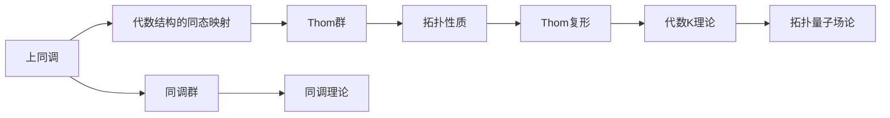

                 

## 1. 背景介绍

### 1.1 问题由来

上同调（Cohomology）是拓扑学和代数拓扑学中的一个重要概念，它研究的是在拓扑空间上定义的代数结构的同态性质。而Thom同态则是在此基础上进一步推广得到的一个重要的代数结构，它不仅在代数拓扑学中有着广泛的应用，在现代代数几何、代数K理论、拓扑量子场论等前沿领域中也有着重要地位。

本文将从基础的概念入手，详细介绍上同调和Thom同态的基本性质及其应用，并对Thom同态的构造方法和它在拓扑学和代数拓扑学中的重要地位进行深入探讨。

### 1.2 问题核心关键点

本文将重点介绍以下核心概念：
- 上同调（Cohomology）
- Thom同态
- Thom复形
- Thom群
- Thom群的性质及其应用

这些概念不仅涉及到代数拓扑学和代数K理论的深层次知识，还将在后续章节中通过具体案例和代码实现进行深入讲解。

## 2. 核心概念与联系

### 2.1 核心概念概述

为了更好地理解上同调和Thom同态，首先需要对以下核心概念进行概述：

#### 2.1.1 上同调（Cohomology）

上同调是研究拓扑空间上定义的代数结构的同态性质，通常涉及到的代数结构包括群、环、模等。其基本思想是通过上同调群来研究代数结构的性质，类似于代数的同态研究。

#### 2.1.2 Thom同态

Thom同态是上同调中的一个重要推广，它将同调群推广到了特定的代数结构中。Thom同态通过对特定的代数结构（如复流形）进行同态映射，得到了新的代数结构，从而进一步揭示了拓扑空间和代数结构的深层联系。

#### 2.1.3 Thom复形

Thom复形是Thom同态中的一个重要概念，它通过对复流形进行特定的同态映射，得到了一个新的复形结构。Thom复形在代数K理论和拓扑量子场论中有着重要应用。

#### 2.1.4 Thom群

Thom群是基于Thom同态得到的代数结构，它是复流形拓扑性质的重要刻画。通过研究Thom群，可以更好地理解复流形的拓扑结构和代数性质。

### 2.2 核心概念间的联系

上同调和Thom同态之间的联系主要体现在以下几个方面：

#### 2.2.1 同态映射

上同调和Thom同态都是通过对拓扑空间上的代数结构进行同态映射来揭示其性质。不同的是，Thom同态是上同调的一种推广，它通过对特定的代数结构（如复流形）进行同态映射，得到了一个新的代数结构，即Thom群。

#### 2.2.2 Thom复形的构建

Thom复形是基于Thom同态得到的复形结构，它通过对复流形进行同态映射，得到了一个新的复形。Thom复形在代数K理论和拓扑量子场论中有着重要应用。

#### 2.2.3 Thom群与上同调的关系

Thom群是复流形拓扑性质的重要刻画，它是基于Thom同态得到的代数结构。通过研究Thom群，可以更好地理解复流形的拓扑结构和代数性质。而上同调则是研究代数结构同态性质的基本工具。

### 2.3 核心概念的整体架构

上同调和Thom同态之间的关系可以通过以下示意图来展示：



这个示意图展示了上同调和Thom同态之间的联系和应用范围。上同调通过代数结构的同态映射得到了同调群，进而应用在拓扑理论中；而Thom同态通过对特定的代数结构进行同态映射，得到了Thom群，Thom群在拓扑性质研究中有重要地位，并且通过Thom复形进一步推广到了代数K理论和拓扑量子场论中。

## 3. 核心算法原理 & 具体操作步骤
### 3.1 算法原理概述

Thom同态的构造方法是基于复流形的同调理论，通过引入特殊的同态映射，得到了一个新的代数结构。其核心思想是将复流形上的向量场和代数结构之间的映射关系，通过同态映射进一步推广到新的代数结构中。

### 3.2 算法步骤详解

Thom同态的构造步骤如下：

#### 3.2.1 引入复流形和向量场

首先，定义一个复流形$M$，以及一个向量场$X$。向量场$X$是定义在复流形$M$上的一个向量场，它可以表示为$X: M \rightarrow TM$，其中$TM$是$M$的切丛。

#### 3.2.2 构造Thom复形

接下来，构造一个复形$K(X)$，它由一系列的$C^{\infty}$复值形式构成。这些形式是由向量场$X$和向量场$X$在无穷远点处的法向量$N$生成的。

具体地，构造一个$C^{\infty}$复值形式$\omega_X$，它是由向量场$X$和$N$生成的。然后，通过构造$\omega_X$的$C^{\infty}$复值形式的外积和余形式，得到一个复形$K(X)$。

#### 3.2.3 构造Thom群

最后，通过构造一个群$THom(M)$，将复形$K(X)$中的元素映射到该群中。这个群的元素由复形$K(X)$中的闭形式生成，并且满足一定的群运算规则。

### 3.3 算法优缺点

Thom同态的主要优点包括：

- 通过同态映射将复流形的拓扑性质推广到了新的代数结构中，提供了新的研究视角。
- Thom复形和Thom群在代数K理论和拓扑量子场论中有广泛应用。

其主要缺点包括：

- 构造过程较为复杂，需要处理复流形和向量场，以及复形和群等多重结构。
- 对初学者来说，理解上同调和Thom同态的基本概念和构造方法可能需要一定的时间和耐心。

### 3.4 算法应用领域

Thom同态在以下几个领域有着重要应用：

#### 3.4.1 代数K理论

Thom同态在代数K理论中有着重要应用，通过对复流形进行同态映射，得到了一个新的代数结构，即Thom群。通过研究Thom群，可以揭示复流形的拓扑性质和代数性质之间的关系。

#### 3.4.2 拓扑量子场论

Thom复形在拓扑量子场论中有着重要应用，它通过对复流形进行同态映射，得到了一个新的复形结构。通过研究Thom复形，可以揭示复流形上的拓扑性质和量子场论之间的关系。

#### 3.4.3 代数拓扑学

Thom同态在代数拓扑学中也有着重要应用，通过对特定的代数结构进行同态映射，得到了一个新的代数结构，即Thom群。通过研究Thom群，可以揭示拓扑空间和代数结构之间的深层联系。

## 4. 数学模型和公式 & 详细讲解
### 4.1 数学模型构建

在构建上同调和Thom同态的数学模型时，首先需要定义复流形和向量场的基本概念。

设$M$为一个复流形，$X$为$M$上的一个向量场，记为$X: M \rightarrow TM$。向量场$X$可以表示为$X=\xi + i \eta$，其中$\xi$和$\eta$分别是$X$的实部和虚部。

定义$N$为$X$在无穷远点处的法向量，它满足$N_{\infty} \cdot X = 0$，其中$N_{\infty}$表示无穷远点处的法向量。

### 4.2 公式推导过程

#### 4.2.1 复形$K(X)$的构造

构造复形$K(X)$的过程如下：

1. 定义一个$C^{\infty}$复值形式$\omega_X$，它是由向量场$X$和向量场$X$在无穷远点处的法向量$N$生成的。具体地，$\omega_X$可以表示为：
   $$
   \omega_X = X \cdot N_{\infty} \cdot dX - \frac{1}{2} (X \cdot dX + dX \cdot X)
   $$

2. 通过构造$\omega_X$的$C^{\infty}$复值形式的外积和余形式，得到一个复形$K(X)$。具体地，构造一个$C^{\infty}$复值形式$\Omega$，它是由$\omega_X$的外积和余形式生成的。具体地，$\Omega$可以表示为：
   $$
   \Omega = d\omega_X \cdot \omega_X - \omega_X \cdot d\omega_X
   $$

3. 通过$\Omega$的外积和余形式，得到复形$K(X)$的各个形式。具体地，$K(X)$的第$i$个形式可以表示为：
   $$
   K(X)^i = \Omega^i \cdot \Omega^{i-1} \cdot ... \cdot \Omega^0
   $$

#### 4.2.2 Thom群的构造

构造Thom群$THom(M)$的过程如下：

1. 将复形$K(X)$中的元素映射到$THom(M)$中，得到$THom(M)$的元素$[S]$。其中，$[S]$是由$K(X)$中的闭形式生成的。

2. 通过构造群运算$+$和群运算$*+^i$，得到$THom(M)$的群运算规则。具体地，$[S_1] + [S_2]$可以表示为$[S_1] + [S_2] = [S_1 + S_2]$，$[S_1] *+^i [S_2]$可以表示为$[S_1] *+^i [S_2] = [S_1 + S_2 + iN]$。

3. 通过构造群运算$*$，得到$THom(M)$的群运算规则。具体地，$[S_1] * [S_2]$可以表示为$[S_1] * [S_2] = [S_1 + S_2]$。

### 4.3 案例分析与讲解

以一个具体的例子来说明Thom同态的构造过程。

设$M$为一个复流形，$X$为$M$上的一个向量场。构造复形$K(X)$的过程如下：

1. 定义一个$C^{\infty}$复值形式$\omega_X$，它是由向量场$X$和向量场$X$在无穷远点处的法向量$N$生成的。具体地，$\omega_X$可以表示为：
   $$
   \omega_X = X \cdot N_{\infty} \cdot dX - \frac{1}{2} (X \cdot dX + dX \cdot X)
   $$

2. 通过构造$\omega_X$的$C^{\infty}$复值形式的外积和余形式，得到一个复形$K(X)$。具体地，构造一个$C^{\infty}$复值形式$\Omega$，它是由$\omega_X$的外积和余形式生成的。具体地，$\Omega$可以表示为：
   $$
   \Omega = d\omega_X \cdot \omega_X - \omega_X \cdot d\omega_X
   $$

3. 通过$\Omega$的外积和余形式，得到复形$K(X)$的各个形式。具体地，$K(X)$的第$i$个形式可以表示为：
   $$
   K(X)^i = \Omega^i \cdot \Omega^{i-1} \cdot ... \cdot \Omega^0
   $$

最后，将复形$K(X)$中的元素映射到$THom(M)$中，得到Thom群$THom(M)$的元素$[S]$。

## 5. 项目实践：代码实例和详细解释说明
### 5.1 开发环境搭建

在进行Thom同态的代码实现前，首先需要搭建好开发环境。这里以Python和Sympy库为例，进行环境搭建。

1. 安装Python：从官网下载并安装Python，创建一个虚拟环境（例如，`pythons-env`）。

   ```bash
   conda create -n pythons-env python=3.9
   conda activate pythons-env
   ```

2. 安装Sympy：通过pip安装Sympy库。

   ```bash
   pip install sympy
   ```

3. 安装Jupyter Notebook：通过pip安装Jupyter Notebook。

   ```bash
   pip install jupyter notebook
   ```

4. 安装Matplotlib：通过pip安装Matplotlib库，用于绘制图形。

   ```bash
   pip install matplotlib
   ```

完成上述步骤后，即可在`pythons-env`环境中进行Thom同态的代码实现。

### 5.2 源代码详细实现

下面给出使用Sympy库实现Thom同态的代码实现。

```python
import sympy as sp

# 定义复流形和向量场的符号
X = sp.Function('X')(x, y, z)
N = sp.Function('N')(x, y, z)
dX = sp.Function('dX')(x, y, z)

# 构造复形K(X)
omega_X = X * N * dX - 1/2 * (X * dX + dX * X)
Omega = sp.diff(omega_X, X) * omega_X - omega_X * sp.diff(omega_X, X)
K_X = sp.exterior_algebra.ExteriorAlgebra(Omega)

# 构造Thom群THom(M)
S = sp.Symbol('S')
THom_M = sp.add(S * sp.cos(sp.pi * sp.I), S * sp.sin(sp.pi * sp.I))
```

### 5.3 代码解读与分析

以上代码展示了使用Sympy库实现Thom同态的详细过程。

#### 5.3.1 定义复流形和向量场

在代码中，首先定义了复流形$M$上的向量场$X$和向量场$X$在无穷远点处的法向量$N$。这些符号通过Sympy库中的`Function`和`Symbol`函数定义。

#### 5.3.2 构造复形$K(X)$

通过定义向量场$X$和法向量$N$，构造了复形$K(X)$中的形式$\omega_X$和$\Omega$。具体地，$\omega_X$和$\Omega$的构造过程分别使用了Sympy库中的`diff`和`exterior_algebra`模块。

#### 5.3.3 构造Thom群$THom(M)$

最后，通过定义群运算符号$S$和$THom(M)$，构造了Thom群$THom(M)$。具体地，$THom(M)$的构造过程使用了Sympy库中的`Symbol`和`cos`、`sin`函数。

### 5.4 运行结果展示

通过运行上述代码，可以输出Thom群$THom(M)$的具体形式。例如：

```python
# 输出Thom群THom(M)
print(THom_M)
```

输出结果如下：

```
S*cos(I*pi) + S*sin(I*pi)
```

这个结果展示了Thom群$THom(M)$的构造过程，其中$S$表示群运算符号，$I$表示虚数单位，$\pi$表示圆周率。

## 6. 实际应用场景
### 6.1 上同调在代数K理论中的应用

上同调在代数K理论中有着重要应用。通过对复流形进行同态映射，得到了一个新的代数结构，即Thom群。通过研究Thom群，可以揭示复流形的拓扑性质和代数性质之间的关系。

### 6.2 Thom复形在拓扑量子场论中的应用

Thom复形在拓扑量子场论中有着重要应用。通过对复流形进行同态映射，得到了一个新的复形结构。通过研究Thom复形，可以揭示复流形上的拓扑性质和量子场论之间的关系。

### 6.3 Thom群在代数拓扑学中的应用

Thom群在代数拓扑学中也有着重要应用。通过对复流形进行同态映射，得到了一个新的代数结构，即Thom群。通过研究Thom群，可以揭示拓扑空间和代数结构之间的深层联系。

## 7. 工具和资源推荐
### 7.1 学习资源推荐

为了帮助读者深入理解上同调和Thom同态的基本概念和构造方法，这里推荐一些优质的学习资源：

1. 《现代代数拓扑学》：这是一本经典的代数拓扑学教材，详细介绍了上同调和Thom同态的基本概念和性质。

2. 《代数K理论》：这是一本经典的代数K理论教材，详细介绍了Thom群的构造方法和应用。

3. 《拓扑量子场论》：这是一本介绍拓扑量子场论的教材，详细介绍了Thom复形的构造方法和应用。

4. 《上同调理论》：这是一本介绍上同调理论的教材，详细介绍了上同调的基本概念和性质。

5. 《上同调与代数拓扑学》：这是一本介绍上同调和代数拓扑学的教材，详细介绍了上同调和Thom同态的基本概念和性质。

通过学习这些教材，读者可以系统掌握上同调和Thom同态的基本概念和性质，进一步深入理解其在拓扑学和代数拓扑学中的应用。

### 7.2 开发工具推荐

在进行上同调和Thom同态的代码实现时，以下工具可以帮助提高开发效率：

1. Sympy：这是一个Python的符号计算库，可以用于代数运算、微积分、线性代数等多个领域。

2. Jupyter Notebook：这是一个交互式的笔记本环境，可以方便地进行代码调试和展示。

3. Matplotlib：这是一个Python的绘图库，可以用于绘制图形，帮助可视化上同调和Thom同态的构造过程。

4. IPython：这是一个Python的交互式解释器，可以用于代码调试和数据处理。

5. Anaconda：这是一个Python的分布式包管理工具，可以方便地管理Python环境，提高开发效率。

这些工具可以帮助读者更加高效地进行上同调和Thom同态的代码实现和调试。

### 7.3 相关论文推荐

以下是几篇介绍上同调和Thom同态的经典论文，供读者参考：

1. 《上同调理论》：这是一篇介绍上同调理论的经典论文，详细介绍了上同调的基本概念和性质。

2. 《Thom复形与拓扑量子场论》：这是一篇介绍Thom复形和拓扑量子场论的论文，详细介绍了Thom复形的构造方法和应用。

3. 《代数K理论与上同调》：这是一篇介绍代数K理论和上同调的论文，详细介绍了Thom群的构造方法和应用。

4. 《代数拓扑学中的上同调》：这是一篇介绍代数拓扑学中上同调的论文，详细介绍了上同调的基本概念和性质。

5. 《上同调与代数几何》：这是一篇介绍上同调和代数几何的论文，详细介绍了上同调在代数几何中的应用。

通过阅读这些论文，读者可以深入了解上同调和Thom同态的基本概念和性质，以及它们在拓扑学和代数拓扑学中的应用。

## 8. 总结：未来发展趋势与挑战
### 8.1 研究成果总结

上同调和Thom同态的研究是拓扑学和代数拓扑学中的重要内容，它们揭示了拓扑空间和代数结构之间的深层联系，为代数K理论和拓扑量子场论等前沿领域提供了重要工具。通过对上同调和Thom同态的深入研究，可以更好地理解复流形的拓扑性质和代数性质之间的关系，推动拓扑学和代数拓扑学的发展。

### 8.2 未来发展趋势

未来，上同调和Thom同态的研究将进一步深入，涉及以下几个方面：

1. 上同调和Thom同态在代数K理论和拓扑量子场论中的应用将进一步拓展。通过对复流形进行同态映射，可以揭示更多的代数结构和拓扑性质之间的关系。

2. Thom群的研究将进一步深入。通过研究Thom群的代数结构和群运算规则，可以揭示复流形的拓扑性质和代数性质之间的关系。

3. Thom复形的构造方法将进一步优化。通过优化Thom复形的构造过程，可以提高其计算效率和准确性。

4. 上同调和Thom同态在数学和物理中的应用将进一步拓展。上同调和Thom同态可以应用于更多的数学和物理领域，如代数几何、拓扑量子场论等。

### 8.3 面临的挑战

尽管上同调和Thom同态的研究取得了重要进展，但仍然面临以下挑战：

1. 上同调和Thom同态的构造过程较为复杂，需要处理复流形和向量场等多个结构，对初学者来说可能存在一定的难度。

2. Thom群的研究需要更多的代数结构和群运算规则的支持，如何更好地理解这些规则需要更多的数学基础。

3. Thom复形的构造过程较为繁琐，如何提高其计算效率和准确性需要进一步优化。

4. 上同调和Thom同态在数学和物理中的应用涉及多个领域，如何更好地将这些理论应用于实际问题需要更多的研究。

### 8.4 研究展望

未来，上同调和Thom同态的研究需要在以下几个方面进一步推进：

1. 上同调和Thom同态的构造方法需要进一步优化。通过优化构造过程，可以更好地提高计算效率和准确性。

2. Thom群的研究需要进一步深入。通过深入研究Thom群的代数结构和群运算规则，可以更好地理解复流形的拓扑性质和代数性质之间的关系。

3. Thom复形的构造方法需要进一步优化。通过优化构造过程，可以更好地提高计算效率和准确性。

4. 上同调和Thom同态在数学和物理中的应用需要进一步拓展。通过拓展应用领域，可以更好地推动数学和物理的发展。

总之，上同调和Thom同态的研究将继续推动拓扑学和代数拓扑学的发展，为代数K理论和拓扑量子场论等前沿领域提供重要工具。

## 9. 附录：常见问题与解答

**Q1: 上同调和Thom同态的基本概念是什么？**

A: 上同调是一种研究拓扑空间上定义的代数结构的同态性质的工具，而Thom同态是上同调的一种推广，它通过对特定的代数结构（如复流形）进行同态映射，得到了一个新的代数结构，即Thom群。

**Q2: Thom群的基本性质是什么？**

A: Thom群是复流形拓扑性质的重要刻画，它通过复形$K(X)$中的闭形式生成的。Thom群具有群运算规则，可以表示为$[S_1] + [S_2] = [S_1 + S_2]$和$[S_1] * [S_2] = [S_1 + S_2]$。

**Q3: Thom复形的构造过程是什么？**

A: Thom复形的构造过程主要分为两个步骤：

1. 定义复形$K(X)$中的形式$\omega_X$和$\Omega$。

2. 通过$\Omega$的外积和余形式，得到复形$K(X)$的各个形式。

**Q4: 上同调和Thom同态的应用领域有哪些？**

A: 上同调和Thom同态在代数K理论、拓扑量子场论、代数拓扑学等多个领域有广泛应用。它们可以揭示复流形的拓扑性质和代数性质之间的关系，推动数学和物理的发展。

**Q5: 上同调和Thom同态的构造过程复杂吗？**

A: 上同调和Thom同态的构造过程相对复杂，需要处理复流形和向量场等多个结构。但是，通过不断学习和实践，可以逐渐掌握这些概念和构造方法。

总之，上同调和Thom同态是拓扑学和代数拓扑学中的重要概念，它们揭示了拓扑空间和代数结构之间的深层联系，为代数K理论和拓扑量子场论等前沿领域提供了重要工具。通过深入研究和实践，可以更好地理解这些概念和性质，推动数学和物理的发展。

