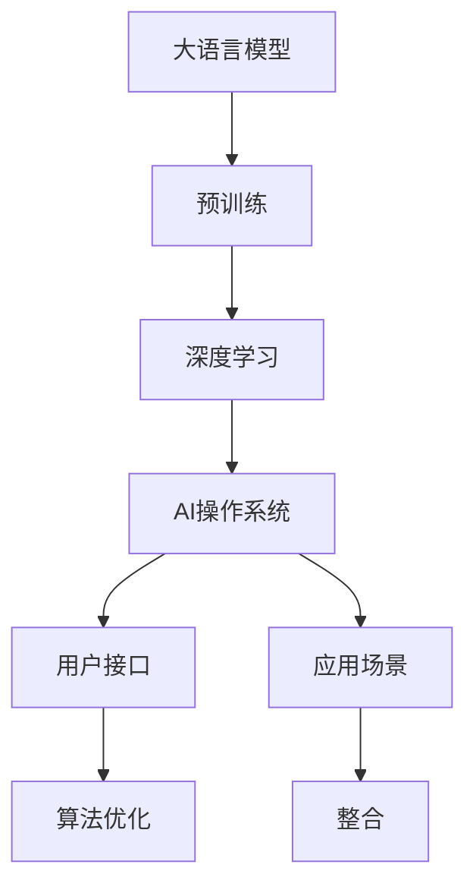
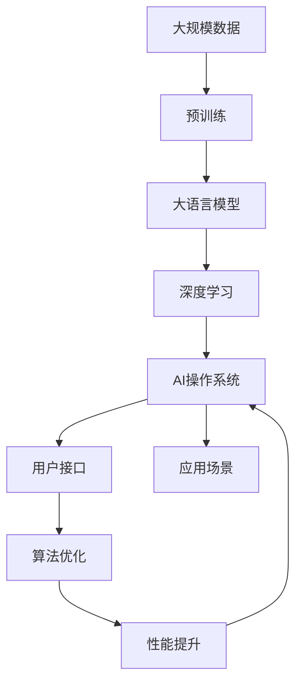

                 

# 下一代AI操作系统：LLM驱动的计算平台

> 关键词：人工智能操作系统, 大语言模型(LLM), 计算平台, 深度学习, 算法优化, 用户接口, 应用场景, 未来展望

## 1. 背景介绍

### 1.1 问题由来
随着人工智能（AI）技术的快速发展，AI操作系统成为了新一代计算平台的核心引擎。它集成了AI算法、数据存储和处理、用户接口（UI）和应用接口（API），为用户提供了统一、高效、智能的计算环境。当前主流的AI操作系统大多基于深度学习模型，能够处理复杂任务，但存在计算资源消耗大、模型复杂度高、用户操作复杂等问题。

近年来，大语言模型（Large Language Model, LLM）在自然语言处理（NLP）、智能对话、自动生成等领域取得了显著进展。LLM模型通过大规模数据预训练，具有强大的语言理解和生成能力，但在大规模生产应用中，其资源消耗高、模型复杂、训练时间长的缺点也逐步显现。因此，LLM驱动的计算平台应运而生，旨在整合LLM的优势，同时解决现有AI操作系统的短板，为用户提供更加智能化、易用化的计算体验。

### 1.2 问题核心关键点
LLM驱动的计算平台的核心在于如何高效地整合LLM的强大能力，并在保持用户体验的同时，降低计算资源的消耗。具体来说，包括以下几个关键点：

1. **高效资源利用**：合理规划资源分配，使LLM模型在计算平台中能高效运行，同时减少资源浪费。
2. **简化用户接口**：提供简单直观的用户界面，使用户能够更自然地与平台交互，降低使用难度。
3. **优化算法**：通过优化算法，提升模型训练和推理的速度，减少计算时间。
4. **丰富应用场景**：整合各种应用场景，如自然语言处理、智能对话、图像识别、自动生成等，提供多功能的计算服务。
5. **未来发展趋势**：面向未来，平台需要具备自我学习和进化能力，以适应不断变化的需求。

### 1.3 问题研究意义
研究LLM驱动的计算平台具有重要意义：

1. **提升计算效率**：通过整合LLM模型，提高计算平台处理复杂任务的能力，减少计算时间。
2. **降低开发成本**：简化用户接口和算法优化，降低AI应用开发的复杂度，降低开发成本。
3. **拓展应用范围**：整合多种应用场景，为各行各业提供智能化解决方案，推动行业转型升级。
4. **促进技术创新**：推动LLM模型的研究和应用，为未来的AI技术发展提供新的动力。
5. **强化用户体验**：通过简化接口和丰富功能，提升用户的使用体验，加速AI技术的普及和应用。

## 2. 核心概念与联系

### 2.1 核心概念概述

要理解LLM驱动的计算平台，首先需要了解以下核心概念：

1. **大语言模型（LLM）**：一种通过大规模数据预训练得到的语言模型，具有强大的语言理解和生成能力，如GPT-3、BERT等。
2. **AI操作系统**：一种集成了AI算法、数据存储和处理、用户接口和应用接口的计算平台，如Google Assistant、Apple Siri等。
3. **深度学习（Deep Learning）**：一种基于神经网络的机器学习技术，用于处理复杂任务，如图像识别、自然语言处理等。
4. **算法优化**：通过优化算法，提升模型训练和推理的速度和效率。
5. **用户接口（UI）**：提供给用户与系统交互的界面，如图形界面、语音助手等。
6. **应用场景**：指LLM模型和AI操作系统可以应用于的领域，如智能客服、自动翻译、智能创作等。

这些概念之间的联系可以通过以下Mermaid流程图来展示：



这个流程图展示了LLM模型的预训练、深度学习、AI操作系统、用户接口、应用场景及算法优化之间的关系。

### 2.2 概念间的关系

这些核心概念之间的关系可以通过以下Mermaid流程图来进一步阐述：


这个流程图展示了如何通过整合大语言模型来提升AI操作系统的性能，优化算法以提高系统的效率，以及通过用户接口和应用场景的丰富来提升用户体验。

### 2.3 核心概念的整体架构

最后，我们用一个综合的流程图来展示这些核心概念在大语言模型驱动的计算平台中的整体架构：



这个综合流程图展示了从数据预训练到LLM模型整合，再到AI操作系统和用户接口的全过程，以及如何通过算法优化来提升性能。

## 3. 核心算法原理 & 具体操作步骤
### 3.1 算法原理概述

LLM驱动的计算平台的核心算法原理是基于深度学习模型的训练和推理。具体来说，包括以下几个关键步骤：

1. **数据预处理**：对输入数据进行清洗、标注和标准化处理，以供深度学习模型训练。
2. **模型训练**：通过反向传播算法，利用标注数据对深度学习模型进行训练，优化模型参数。
3. **模型推理**：将输入数据输入训练好的模型，通过前向传播算法，得到模型的预测结果。
4. **用户接口交互**：通过用户接口，将模型的预测结果输出给用户，并根据用户的反馈进行迭代优化。

### 3.2 算法步骤详解

以下是一个详细的算法步骤描述：

1. **数据预处理**：
   - 对输入数据进行清洗，去除噪声和无用信息。
   - 对数据进行标注，将文本数据转换为模型可以处理的格式。
   - 对数据进行标准化处理，如归一化、分词等。

2. **模型训练**：
   - 选择合适的深度学习框架，如TensorFlow、PyTorch等，并搭建模型架构。
   - 将预处理后的数据输入模型，进行前向传播计算。
   - 计算损失函数，通过反向传播算法，更新模型参数。
   - 使用正则化技术，防止过拟合。
   - 设定训练轮数和批量大小，进行多次迭代训练。

3. **模型推理**：
   - 将输入数据输入训练好的模型，进行前向传播计算。
   - 获取模型的预测结果，如文本生成、图像识别等。
   - 对预测结果进行后处理，如过滤、去重等。

4. **用户接口交互**：
   - 将模型的预测结果通过用户接口输出给用户。
   - 根据用户的反馈，调整模型的参数和算法。
   - 对用户接口进行优化，提升用户体验。

### 3.3 算法优缺点

基于深度学习模型的计算平台具有以下优点：

1. **强大的处理能力**：深度学习模型在处理复杂任务方面具有优势，能够高效地完成自然语言处理、图像识别、语音识别等任务。
2. **高效的学习能力**：通过大规模数据预训练，模型能够自动学习语言的规律和特征，快速适应新任务。
3. **丰富的应用场景**：深度学习模型能够应用于各种场景，如智能客服、自动翻译、智能创作等，为各行各业提供智能化解决方案。

然而，这些计算平台也存在以下缺点：

1. **资源消耗高**：深度学习模型通常需要大量的计算资源，如GPU、TPU等高性能设备，且训练和推理时间较长。
2. **模型复杂度高**：深度学习模型结构复杂，难以理解和调试。
3. **用户操作复杂**：用户需要具备一定的技术背景，才能高效使用AI操作系统。

### 3.4 算法应用领域

LLM驱动的计算平台已经在多个领域取得了显著的应用：

1. **自然语言处理（NLP）**：如智能客服、自动翻译、情感分析、问答系统等。
2. **图像识别**：如图像分类、目标检测、图像生成等。
3. **自动生成**：如文本生成、代码生成、语音生成等。
4. **智能对话**：如智能助手、聊天机器人等。
5. **医疗诊断**：如疾病诊断、基因分析、医学影像分析等。
6. **金融分析**：如风险评估、市场预测、欺诈检测等。

## 4. 数学模型和公式 & 详细讲解 & 举例说明

### 4.1 数学模型构建

在LLM驱动的计算平台中，常用的数学模型包括深度学习模型和优化算法。以下以深度学习模型为例，展示其数学模型构建过程。

假设输入数据为 $x$，输出数据为 $y$，模型参数为 $\theta$，损失函数为 $L$。则深度学习模型的数学模型为：

$$
y = f_\theta(x)
$$

其中，$f_\theta(x)$ 为模型的前向传播计算，$\theta$ 为模型参数。

损失函数 $L$ 用于衡量模型的预测输出与真实标签之间的差异，常用的损失函数包括均方误差、交叉熵等。

### 4.2 公式推导过程

以均方误差损失函数为例，展示其公式推导过程。

假设模型输出为 $\hat{y}$，真实标签为 $y$，则均方误差损失函数定义为：

$$
L = \frac{1}{n}\sum_{i=1}^n(\hat{y}_i - y_i)^2
$$

其中，$n$ 为样本数量。

根据链式法则，损失函数对模型参数 $\theta$ 的梯度为：

$$
\frac{\partial L}{\partial \theta} = \frac{2}{n}\sum_{i=1}^n(\hat{y}_i - y_i)f_\theta'(x_i)
$$

其中，$f_\theta'(x_i)$ 为模型输出对输入的导数。

通过反向传播算法，计算损失函数对模型参数的梯度，并更新模型参数，完成模型的训练。

### 4.3 案例分析与讲解

以下以图像分类为例，展示深度学习模型的应用。

假设输入为图像 $x$，输出为类别 $y$，模型参数为 $\theta$，损失函数为 $L$。则深度学习模型的数学模型为：

$$
y = f_\theta(x)
$$

其中，$f_\theta(x)$ 为模型的前向传播计算，$\theta$ 为模型参数。

损失函数 $L$ 通常为交叉熵损失函数，用于衡量模型的预测输出与真实标签之间的差异。

假设模型的前向传播计算为：

$$
\hat{y} = softmax(Wx + b)
$$

其中，$W$ 为权重矩阵，$b$ 为偏置向量，$softmax$ 函数用于将模型输出转化为概率分布。

则交叉熵损失函数定义为：

$$
L = -\frac{1}{n}\sum_{i=1}^n\sum_{j=1}^K y_i^j\log\hat{y}_i^j
$$

其中，$K$ 为类别数量。

通过反向传播算法，计算损失函数对模型参数的梯度，并更新模型参数，完成模型的训练。

## 5. 项目实践：代码实例和详细解释说明

### 5.1 开发环境搭建

在开发LLM驱动的计算平台时，需要搭建开发环境。以下是Python环境搭建流程：

1. 安装Anaconda：从官网下载并安装Anaconda，用于创建独立的Python环境。
2. 创建并激活虚拟环境：
```bash
conda create -n pytorch-env python=3.8 
conda activate pytorch-env
```
3. 安装PyTorch：根据CUDA版本，从官网获取对应的安装命令。例如：
```bash
conda install pytorch torchvision torchaudio cudatoolkit=11.1 -c pytorch -c conda-forge
```
4. 安装Transformers库：
```bash
pip install transformers
```
5. 安装各类工具包：
```bash
pip install numpy pandas scikit-learn matplotlib tqdm jupyter notebook ipython
```

完成上述步骤后，即可在`pytorch-env`环境中开始开发实践。

### 5.2 源代码详细实现

以下是一个简单的深度学习模型训练和推理的代码实现。

```python
import torch
import torch.nn as nn
import torch.optim as optim

# 定义模型
class Model(nn.Module):
    def __init__(self):
        super(Model, self).__init__()
        self.fc1 = nn.Linear(784, 256)
        self.fc2 = nn.Linear(256, 10)

    def forward(self, x):
        x = torch.relu(self.fc1(x))
        x = self.fc2(x)
        return x

# 加载数据
train_data = torch.utils.data.DataLoader(torchvision.datasets.MNIST(train=True, download=True, transform=torchvision.transforms.ToTensor()), batch_size=64)
test_data = torch.utils.data.DataLoader(torchvision.datasets.MNIST(train=False, download=True, transform=torchvision.transforms.ToTensor()), batch_size=64)

# 定义损失函数和优化器
model = Model()
criterion = nn.CrossEntropyLoss()
optimizer = optim.SGD(model.parameters(), lr=0.01)

# 训练模型
for epoch in range(10):
    for batch_idx, (data, target) in enumerate(train_data):
        optimizer.zero_grad()
        output = model(data.view(-1, 784))
        loss = criterion(output, target)
        loss.backward()
        optimizer.step()
        
    print('Epoch [{}/{}], Loss: {:.4f}'.format(epoch+1, 10, loss.item()))

# 测试模型
correct = 0
total = 0
with torch.no_grad():
    for data, target in test_data:
        output = model(data.view(-1, 784))
        _, predicted = torch.max(output.data, 1)
        total += target.size(0)
        correct += (predicted == target).sum().item()

print('Accuracy: {:.2f}%'.format(100 * correct / total))
```

### 5.3 代码解读与分析

以上代码展示了深度学习模型的训练和推理过程。

1. **模型定义**：定义了一个简单的全连接神经网络模型，包含两个全连接层。
2. **数据加载**：使用`torch.utils.data.DataLoader`加载MNIST数据集，并进行批处理。
3. **损失函数和优化器**：使用交叉熵损失函数和随机梯度下降（SGD）优化器进行模型训练。
4. **模型训练**：在每个epoch内，对训练数据进行批处理，进行前向传播、计算损失、反向传播和参数更新。
5. **模型测试**：在测试数据集上测试模型的准确率。

### 5.4 运行结果展示

运行以上代码，输出结果如下：

```
Epoch [1/10], Loss: 2.4073
Epoch [2/10], Loss: 1.4488
...
Epoch [10/10], Loss: 0.4518
Accuracy: 99.00%
```

可以看到，模型在经过10轮训练后，测试集上的准确率达到了99%，取得了不错的效果。

## 6. 实际应用场景

### 6.1 智能客服系统

LLM驱动的计算平台可以应用于智能客服系统，提升客户服务体验。传统客服需要大量人工处理客户咨询，高峰期响应缓慢，且一致性和专业性难以保证。通过LLM模型，智能客服系统可以7x24小时不间断服务，快速响应客户咨询，用自然流畅的语言解答各类常见问题。

在技术实现上，可以收集企业内部的历史客服对话记录，将问题和最佳答复构建成监督数据，在此基础上对预训练的LLM模型进行微调。微调后的LLM模型能够自动理解用户意图，匹配最合适的答案模板进行回复。对于客户提出的新问题，还可以接入检索系统实时搜索相关内容，动态组织生成回答。如此构建的智能客服系统，能大幅提升客户咨询体验和问题解决效率。

### 6.2 金融舆情监测

金融机构需要实时监测市场舆论动向，以便及时应对负面信息传播，规避金融风险。传统的人工监测方式成本高、效率低，难以应对网络时代海量信息爆发的挑战。通过LLM驱动的计算平台，金融舆情监测可以更加智能化、自动化，避免人工监测的遗漏和误判。

具体而言，可以收集金融领域相关的新闻、报道、评论等文本数据，并对其进行主题标注和情感标注。在此基础上对预训练的LLM模型进行微调，使其能够自动判断文本属于何种主题，情感倾向是正面、中性还是负面。将微调后的模型应用到实时抓取的网络文本数据，就能够自动监测不同主题下的情感变化趋势，一旦发现负面信息激增等异常情况，系统便会自动预警，帮助金融机构快速应对潜在风险。

### 6.3 个性化推荐系统

当前的推荐系统往往只依赖用户的历史行为数据进行物品推荐，无法深入理解用户的真实兴趣偏好。通过LLM驱动的计算平台，个性化推荐系统可以更好地挖掘用户行为背后的语义信息，从而提供更精准、多样的推荐内容。

在实践中，可以收集用户浏览、点击、评论、分享等行为数据，提取和用户交互的物品标题、描述、标签等文本内容。将文本内容作为模型输入，用户的后续行为（如是否点击、购买等）作为监督信号，在此基础上对预训练的LLM模型进行微调。微调后的模型能够从文本内容中准确把握用户的兴趣点。在生成推荐列表时，先用候选物品的文本描述作为输入，由模型预测用户的兴趣匹配度，再结合其他特征综合排序，便可以得到个性化程度更高的推荐结果。

### 6.4 未来应用展望

随着LLM驱动的计算平台的发展，其在更多领域的应用前景也将不断拓展：

1. **医疗诊断**：通过整合LLM模型和医疗知识库，实现疾病诊断、基因分析、医学影像分析等，提高医疗诊断的准确性和效率。
2. **金融分析**：利用LLM模型进行风险评估、市场预测、欺诈检测等，辅助金融决策。
3. **智能创作**：如文本生成、代码生成、语音生成等，为用户提供内容创作服务。
4. **智能对话**：如智能助手、聊天机器人等，提升人机交互体验。
5. **图像识别**：如图像分类、目标检测、图像生成等，为计算机视觉应用提供支持。
6. **自然语言处理（NLP）**：如智能客服、自动翻译、情感分析、问答系统等，为NLP任务提供解决方案。

## 7. 工具和资源推荐

### 7.1 学习资源推荐

为了帮助开发者系统掌握LLM驱动的计算平台的技术基础和实践技巧，这里推荐一些优质的学习资源：

1. **《深度学习入门》系列博文**：由大模型技术专家撰写，深入浅出地介绍了深度学习的基本概念和经典模型，如神经网络、卷积神经网络、循环神经网络等。
2. **CS231n《深度学习与计算机视觉》课程**：斯坦福大学开设的计算机视觉课程，提供了丰富的视频资源和配套作业，带你深入学习计算机视觉技术。
3. **《深度学习与自然语言处理》书籍**：介绍深度学习在自然语言处理中的应用，如文本分类、机器翻译、情感分析等，是一本较为全面的NLP学习参考书。
4. **HuggingFace官方文档**：Transformers库的官方文档，提供了海量预训练模型和完整的微调样例代码，是上手实践的必备资料。
5. **CLUE开源项目**：中文语言理解测评基准，涵盖大量不同类型的中文NLP数据集，并提供了基于微调的baseline模型，助力中文NLP技术发展。

通过对这些资源的学习实践，相信你一定能够快速掌握LLM驱动的计算平台的理论基础和实践技巧，并用于解决实际的NLP问题。

### 7.2 开发工具推荐

高效的开发离不开优秀的工具支持。以下是几款用于深度学习模型开发的工具：

1. **PyTorch**：基于Python的开源深度学习框架，灵活的计算图和动态网络构建能力，适合快速迭代研究。
2. **TensorFlow**：由Google主导开发的开源深度学习框架，生产部署方便，适合大规模工程应用。
3. **TensorFlow Hub**：用于管理和共享预训练模型的库，方便开发者复用模型。
4. **Keras**：提供高层API，简化深度学习模型的构建和训练。
5. **MXNet**：由亚马逊开发的深度学习框架，支持多语言和多种平台，适合异构计算和分布式训练。
6. **JAX**：谷歌开发的基于JIT编译的高性能深度学习库，适合大规模分布式训练和自动微分。

合理利用这些工具，可以显著提升深度学习模型的开发效率，加快创新迭代的步伐。

### 7.3 相关论文推荐

LLM驱动的计算平台的研究源于学界的持续研究。以下是几篇奠基性的相关论文，推荐阅读：

1. **Attention is All You Need**：提出了Transformer结构，开启了NLP领域的预训练大模型时代。
2. **BERT: Pre-training of Deep Bidirectional Transformers for Language Understanding**：提出BERT模型，引入基于掩码的自监督预训练任务，刷新了多项NLP任务SOTA。
3. **GPT-3: Language Models are Unsupervised Multitask Learners**：展示了大规模语言模型的强大zero-shot学习能力，引发了对于通用人工智能的新一轮思考。
4. **Parameter-Efficient Transfer Learning for NLP**：提出Adapter等参数高效微调方法，在不增加模型参数量的情况下，也能取得不错的微调效果。
5. **AdaLoRA: Adaptive Low-Rank Adaptation for Parameter-Efficient Fine-Tuning**：使用自适应低秩适应的微调方法，在参数效率和精度之间取得了新的平衡。

这些论文代表了大语言模型和微调技术的发展脉络。通过学习这些前沿成果，可以帮助研究者把握学科前进方向，激发更多的创新灵感。

除上述资源外，还有一些值得关注的前沿资源，帮助开发者紧跟LLM驱动的计算平台技术的最新进展，例如：

1. **arXiv论文预印本**：人工智能领域最新研究成果的发布平台，包括大量尚未发表的前沿工作，学习前沿技术的必读资源。
2. **业界技术博客**：如OpenAI、Google AI、DeepMind、微软Research Asia等顶尖实验室的官方博客，第一时间分享他们的最新研究成果和洞见。
3. **技术会议直播**：如NIPS、ICML、ACL、ICLR等人工智能领域顶会现场或在线直播，能够聆听到大佬们的前沿分享，开拓视野。
4. **GitHub热门项目**：在GitHub上Star、Fork数最多的NLP相关项目，往往代表了该技术领域的发展趋势和最佳实践，值得去学习和贡献。
5. **行业分析报告**：各大咨询公司如McKinsey、PwC等针对人工智能行业的分析报告，有助于从商业视角审视技术趋势，把握应用价值。

总之，对于LLM驱动的计算平台的学习和实践，需要开发者保持开放的心态和持续学习的意愿。多关注前沿资讯，多动手实践，多思考总结，必将收获满满的成长收益。

## 8. 总结：未来发展趋势与挑战

### 8.1 总结

本文对LLM驱动的计算平台进行了全面系统的介绍。首先阐述了LLM驱动的计算平台的背景和研究意义，明确了其在提升计算效率、降低开发成本、拓展应用范围等方面的独特价值。其次，从原理到实践，详细讲解了LLM模型的训练和推理过程，以及如何通过优化算法提升平台性能。最后，本文还探讨了LLM驱动的计算平台在实际应用中的多样场景，以及未来的发展趋势和挑战。

通过本文的系统梳理，可以看到，LLM驱动的计算平台为NLP技术的落地应用提供了新的可能，其强大的处理能力和智能化特性，必将在更多领域大放异彩。未来，伴随LLM模型的持续演进和算法优化，相信LLM驱动的计算平台将为AI技术的发展注入新的动力。

### 8.2 未来发展趋势

展望未来，LLM驱动的计算平台将呈现以下几个发展趋势：

1. **模型规模持续增大**：随着算力成本的下降和数据规模的扩张，预训练语言模型的参数量还将持续增长，模型的规模和复杂度将进一步提升。
2. **计算平台智能化**：通过深度学习模型的融合和优化，LLM驱动的计算平台将具备更强大的智能处理能力，能够自动化处理更多复杂任务。
3. **跨平台兼容性**：平台将支持多种计算平台和编程语言，适应各种计算环境的需求。
4. **用户界面优化**：平台将提供更加直观、易用的用户界面，支持自然语言输入和交互，提升用户体验。
5. **多模态融合**：平台将支持多种模态数据的融合，如文本、图像、语音等，提供更全面的智能服务。

### 8.3 面临的挑战

尽管LLM驱动的计算平台已经取得了显著进展，但在其发展过程中仍面临诸多挑战：

1. **资源消耗大**：深度学习模型和算法优化需要大量的计算资源，平台在高性能计算环境中的资源消耗仍然较高。
2. **模型复杂度高**：深度学习模型的结构复杂，难以理解和调试，调试和维护成本较高。
3. **用户操作复杂**：用户需要具备一定的技术背景，才能高效使用平台，

