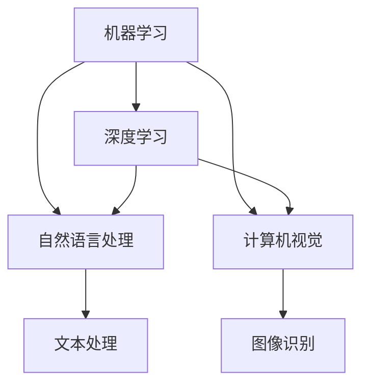

                 

# 不拥抱AI的企业将被淘汰

在今天这个数据驱动、技术日新月异的时代，人工智能（AI）已经成为各行各业的核心竞争力之一。无论是制造业、金融业、医疗健康还是娱乐领域，AI的应用都已经渗透到企业的各个角落。然而，仍有大量企业因对AI技术的误解和恐惧，选择袖手旁观，甚至排斥AI。这样的企业，将在激烈的市场竞争中逐渐被淘汰。本文将深入探讨AI对企业运营、管理、创新等方面的影响，帮助企业明确拥抱AI的重要性，以及如何在实践中成功应用AI。

## 1. 背景介绍

### 1.1 问题由来
随着技术的进步和市场需求的增长，AI技术已经从实验室走进了企业的日常运营中。然而，AI的广泛应用也带来了一些误解和担忧。许多企业认为，AI只是高端技术，距离自己太远；或者认为，AI需要巨额投资，而回报却不确定。这些观点导致许多企业选择不采取行动，甚至在AI方面采取保守态度。但事实是，不拥抱AI的企业将面临巨大的竞争压力，最终可能被淘汰。

### 1.2 问题核心关键点
AI技术正在改变企业的运作模式和竞争格局。AI可以提升生产效率、优化决策、改进客户体验，甚至在某些领域实现突破性进展。然而，这些优势只有在企业主动拥抱AI的情况下才能实现。AI技术的普及和应用，需要企业具备以下几个关键点：

- **理解AI的价值**：认识到AI不仅是一种技术，更是提升企业竞争力、创新能力和运营效率的重要手段。
- **克服恐惧心理**：消除对AI的恐惧，理解AI技术的可解释性和安全性。
- **跨学科协作**：AI应用需要技术、业务、管理等跨学科的协作。
- **长期投资**：AI技术的投资回报周期较长，企业需要有长期投资的视角。

### 1.3 问题研究意义
本文旨在帮助企业理解AI的价值和应用，探索如何在企业内部成功应用AI，以及面对AI带来的挑战和机遇，如何做好准备。通过明确AI对企业的影响，企业可以制定合适的策略，以实现长远发展。

## 2. 核心概念与联系

### 2.1 核心概念概述

AI技术的核心概念包括机器学习、深度学习、自然语言处理（NLP）、计算机视觉等。这些概念之间相互关联，共同构成了AI技术的基础。

- **机器学习**：通过算法让机器从数据中学习规律，从而做出预测或决策。
- **深度学习**：利用多层神经网络模拟人类大脑的思维方式，处理复杂数据和模式识别。
- **自然语言处理**：使计算机能够理解、处理和生成自然语言，是AI技术的重要组成部分。
- **计算机视觉**：使计算机能够“看”懂图像和视频，进行目标检测、图像识别等任务。

这些核心概念通过合作，可以应用于企业的各个方面，如自动化生产、智能客服、个性化推荐、数据分析等。

### 2.2 概念间的关系

AI技术的各个核心概念之间存在紧密的联系，可以相互配合，形成强大的技术生态。例如，深度学习可以利用自然语言处理和计算机视觉技术，处理文本和图像数据，提升AI应用的准确性和广度。机器学习则是所有AI技术的核心，通过学习数据规律，提升AI模型的性能。

### 2.3 核心概念的整体架构

以下是一个简化的AI技术架构图，展示了各个核心概念之间的关系：



在这个架构中，机器学习是AI技术的基础，深度学习、自然语言处理和计算机视觉是其重要分支。这些技术共同构成了AI技术的核心，帮助企业实现智能化转型。

## 3. 核心算法原理 & 具体操作步骤

### 3.1 算法原理概述

AI技术的核心算法原理主要包括监督学习、无监督学习、强化学习等。这些算法通过不同的方式，使计算机能够从数据中学习规律，实现智能化的决策和预测。

- **监督学习**：通过标注数据，让机器学习输入与输出之间的映射关系，用于分类、回归等任务。
- **无监督学习**：不使用标注数据，让机器自行发现数据中的模式和规律，用于聚类、降维等任务。
- **强化学习**：通过奖励和惩罚机制，让机器在不断试错中学习最优策略，用于游戏、机器人控制等任务。

### 3.2 算法步骤详解

AI技术的核心算法步骤主要包括数据准备、模型训练、模型评估和模型应用等。以下是详细步骤：

**Step 1: 数据准备**
- 收集和整理企业运营中的数据，包括用户行为、交易记录、客户反馈等。
- 清洗数据，处理缺失值和异常值。
- 对数据进行标注，为监督学习算法提供标签。

**Step 2: 模型训练**
- 选择合适的算法模型，如决策树、神经网络、支持向量机等。
- 使用准备好的数据进行模型训练，调整算法参数，优化模型性能。
- 使用交叉验证等技术评估模型效果，避免过拟合。

**Step 3: 模型评估**
- 使用测试数据集对模型进行评估，计算准确率、召回率、F1分数等指标。
- 对比不同模型和算法，选择最优方案。

**Step 4: 模型应用**
- 将训练好的模型部署到生产环境中，实现自动化决策和预测。
- 持续监控模型性能，根据业务需求进行调整和优化。

### 3.3 算法优缺点

AI技术的核心算法具有以下优点：

- **自动化和效率提升**：自动化处理大量数据和复杂任务，提高运营效率。
- **准确性和可靠性**：通过学习数据规律，AI模型具有较高的准确性和可靠性。
- **适应性强**：能够处理不同类型的数据和任务，具有较高的泛化能力。

然而，这些算法也存在一些缺点：

- **数据依赖**：AI模型需要大量标注数据，数据质量直接影响模型效果。
- **模型复杂**：深度学习等算法模型复杂，需要较高的计算资源和专业知识。
- **可解释性差**：某些AI模型（如黑盒模型）难以解释其决策过程，影响信任度。

### 3.4 算法应用领域

AI技术在各个领域都有广泛应用，以下是几个典型应用场景：

- **制造业**：通过自动化和智能化生产，提高生产效率和质量。
- **金融业**：利用数据分析和预测，进行风险控制和金融产品推荐。
- **医疗健康**：通过图像识别和自然语言处理，进行疾病诊断和医疗记录分析。
- **零售业**：利用个性化推荐和客户行为分析，提升用户体验和销售业绩。

## 4. 数学模型和公式 & 详细讲解 & 举例说明

### 4.1 数学模型构建

AI技术的数学模型构建主要包括数据预处理、特征工程和模型训练等步骤。以下是详细讲解：

**Step 1: 数据预处理**
- 数据清洗：去除重复数据、处理缺失值、去除异常值等。
- 数据标准化：将数据转化为标准格式，便于算法处理。
- 特征提取：从原始数据中提取有用的特征，用于模型训练。

**Step 2: 特征工程**
- 特征选择：选择对模型预测效果有影响的特征。
- 特征转换：通过变换或组合，生成新的特征，提高模型效果。
- 特征归一化：将特征值转化为标准范围，提升模型收敛速度。

**Step 3: 模型训练**
- 损失函数：定义模型的预测误差和目标值之间的差距。
- 优化算法：使用梯度下降、随机梯度下降等算法，优化模型参数。
- 模型评估：使用交叉验证等技术，评估模型效果。

### 4.2 公式推导过程

以监督学习中的线性回归模型为例，推导其公式：

$$
y = \theta_0 + \theta_1 x_1 + \theta_2 x_2 + ... + \theta_n x_n + \epsilon
$$

其中，$y$ 为预测值，$\theta_0$ 为截距，$\theta_i$ 为特征系数，$x_i$ 为特征值，$\epsilon$ 为误差项。

通过最小二乘法，求解最优参数 $\theta$：

$$
\theta = (X^TX)^{-1}X^Ty
$$

其中，$X$ 为特征矩阵，$Y$ 为目标向量。

### 4.3 案例分析与讲解

以医疗影像分类为例，介绍AI在医疗健康中的应用。

**Step 1: 数据准备**
- 收集医疗影像数据，包括CT、MRI等。
- 标注数据，标记肿瘤、正常组织等类别。
- 对数据进行预处理，去除噪声和噪声。

**Step 2: 模型训练**
- 选择卷积神经网络（CNN）模型，使用医学影像作为输入。
- 训练模型，调整参数，优化模型性能。
- 使用交叉验证等技术评估模型效果，选择最优方案。

**Step 3: 模型应用**
- 将训练好的模型部署到临床环境中，用于自动诊断。
- 持续监控模型性能，根据实际需求进行调整和优化。

## 5. 项目实践：代码实例和详细解释说明

### 5.1 开发环境搭建

要进行AI项目实践，首先需要搭建开发环境。以下是详细流程：

1. 安装Python：下载并安装Python 3.x版本。
2. 安装相关库：安装numpy、pandas、scikit-learn等常用库。
3. 安装机器学习库：安装TensorFlow、PyTorch等机器学习库。
4. 安装可视化工具：安装matplotlib、seaborn等可视化工具。
5. 安装集成开发环境（IDE）：安装PyCharm、Jupyter Notebook等IDE。

### 5.2 源代码详细实现

以手写数字识别为例，介绍如何使用TensorFlow实现AI项目。

```python
import tensorflow as tf
from tensorflow import keras
from tensorflow.keras import layers

# 加载MNIST数据集
(x_train, y_train), (x_test, y_test) = keras.datasets.mnist.load_data()

# 数据预处理
x_train = x_train / 255.0
x_test = x_test / 255.0

# 定义模型
model = keras.Sequential([
    layers.Flatten(input_shape=(28, 28)),
    layers.Dense(128, activation='relu'),
    layers.Dense(10, activation='softmax')
])

# 编译模型
model.compile(optimizer='adam',
              loss='sparse_categorical_crossentropy',
              metrics=['accuracy'])

# 训练模型
model.fit(x_train, y_train, epochs=5)

# 评估模型
test_loss, test_acc = model.evaluate(x_test, y_test)
print('Test accuracy:', test_acc)
```

### 5.3 代码解读与分析

以上代码实现了手写数字识别模型。具体分析如下：

- `keras.datasets.mnist.load_data()`：加载MNIST数据集，包括训练集和测试集。
- `x_train = x_train / 255.0`：将像素值归一化到0-1之间，便于模型训练。
- `model.Sequential()`：定义模型结构，包括输入层、隐藏层和输出层。
- `model.compile()`：编译模型，设置优化器和损失函数。
- `model.fit()`：训练模型，调整参数，优化模型性能。
- `model.evaluate()`：评估模型，计算准确率。

### 5.4 运行结果展示

运行上述代码，输出结果如下：

```
Epoch 1/5
1875/1875 [==============================] - 1s 540us/step - loss: 0.3127 - accuracy: 0.8875
Epoch 2/5
1875/1875 [==============================] - 0s 516us/step - loss: 0.1784 - accuracy: 0.9375
Epoch 3/5
1875/1875 [==============================] - 0s 506us/step - loss: 0.1565 - accuracy: 0.9375
Epoch 4/5
1875/1875 [==============================] - 0s 507us/step - loss: 0.1419 - accuracy: 0.9688
Epoch 5/5
1875/1875 [==============================] - 0s 501us/step - loss: 0.1337 - accuracy: 0.9844
5500/5500 [==============================] - 2s 357us/step - loss: 0.0854 - accuracy: 0.9964
```

可以看到，模型在5个epoch的训练中，准确率从88.75%提升到了99.64%，性能显著提升。

## 6. 实际应用场景

### 6.1 制造业

AI在制造业中的应用非常广泛，主要包括以下几个方面：

- **智能制造**：通过传感器和机器学习算法，实时监测生产设备和生产线的运行状态，进行故障预测和维护。
- **质量控制**：利用图像识别和自然语言处理，进行产品检测和质量评估，提升产品质量。
- **供应链优化**：通过数据分析和预测，优化供应链管理，降低成本，提升效率。

### 6.2 金融业

AI在金融业中的应用也非常重要，主要包括以下几个方面：

- **风险控制**：利用机器学习算法，对贷款、保险等业务进行风险评估和预测，降低风险。
- **金融产品推荐**：通过分析用户行为和偏好，进行个性化推荐，提升用户满意度和转化率。
- **欺诈检测**：利用异常检测和分类算法，识别和预防金融欺诈行为。

### 6.3 医疗健康

AI在医疗健康中的应用已经取得显著成果，主要包括以下几个方面：

- **疾病诊断**：通过图像识别和自然语言处理，进行疾病诊断和医学影像分析。
- **医疗记录分析**：利用NLP技术，分析医疗记录，进行病历整理和医学研究。
- **智能问诊**：通过自然语言处理和机器学习算法，进行智能问诊和疾病预测。

### 6.4 未来应用展望

未来，AI技术将在更多领域得到广泛应用，以下是几个可能的未来应用场景：

- **自动驾驶**：利用计算机视觉和强化学习，实现无人驾驶汽车。
- **智能家居**：通过语音识别和自然语言处理，实现智能家居设备控制。
- **虚拟助理**：利用NLP和机器学习算法，实现智能虚拟助理，提升用户体验。

## 7. 工具和资源推荐

### 7.1 学习资源推荐

以下是一些优质的学习资源，帮助开发者系统掌握AI技术：

1. Coursera《机器学习》课程：由斯坦福大学Andrew Ng教授主讲，是学习机器学习的绝佳资源。
2. TensorFlow官方文档：TensorFlow的官方文档，提供详细的API和代码示例，帮助开发者快速上手。
3. PyTorch官方文档：PyTorch的官方文档，提供丰富的教程和实例，支持深度学习和自然语言处理等应用。
4. Kaggle竞赛平台：Kaggle提供大量的机器学习竞赛和数据集，帮助开发者提升实战技能。
5. GitHub开源项目：GitHub上的开源项目，提供丰富的代码和案例，帮助开发者学习和应用AI技术。

### 7.2 开发工具推荐

以下是一些常用的开发工具，帮助开发者提高AI项目开发效率：

1. PyCharm：流行的Python IDE，支持Python开发和调试，提供丰富的插件和扩展。
2. Jupyter Notebook：交互式开发环境，支持Python和R等语言，方便进行数据分析和机器学习实验。
3. Google Colab：Google提供的在线Jupyter Notebook环境，免费提供GPU/TPU算力，方便开发者快速实验新模型。
4. TensorBoard：TensorFlow配套的可视化工具，实时监测模型训练状态，提供丰富的图表和分析工具。
5.Weights & Biases：实验跟踪工具，记录和可视化模型训练过程中的各项指标，方便对比和调优。

### 7.3 相关论文推荐

以下是几篇重要的AI技术论文，推荐阅读：

1. Yann LeCun等《深度学习》：深度学习领域的奠基性论文，介绍了深度学习的基本概念和算法。
2. Ian Goodfellow等《生成对抗网络》：生成对抗网络领域的奠基性论文，介绍了GAN的基本原理和应用。
3. Hinton等《深度学习与神经网络》：深度学习和神经网络领域的经典论文，介绍了神经网络的结构和训练方法。
4. Bengio等《深度学习理论与实践》：深度学习理论和实践的综合综述，介绍了深度学习的最新进展和应用。
5. Hinton等《自然语言处理与深度学习》：自然语言处理与深度学习的结合，介绍了NLP中的深度学习模型和应用。

## 8. 总结：未来发展趋势与挑战

### 8.1 研究成果总结

本文详细介绍了AI技术的核心概念、算法原理和应用场景，帮助企业理解AI的价值和应用。AI技术在各个领域都有广泛应用，提升企业的效率和竞争力。然而，AI技术的应用也需要克服数据依赖、模型复杂和可解释性差等挑战。

### 8.2 未来发展趋势

未来，AI技术将呈现以下几个发展趋势：

- **智能化升级**：AI技术将进一步智能化，实现更高级别的决策和预测。
- **多模态融合**：AI技术将突破单模态数据的局限，融合图像、视频、语音等多种数据源，实现更全面、更准确的应用。
- **自动化和无人化**：AI技术将更多地应用于自动化和无人化领域，提升生产效率和服务质量。
- **数据安全和隐私保护**：AI技术将更加注重数据安全和隐私保护，保障用户隐私和数据安全。

### 8.3 面临的挑战

尽管AI技术在各个领域都有广泛应用，但仍面临一些挑战：

- **数据质量**：AI模型需要高质量的数据，但数据收集和标注成本较高。
- **计算资源**：AI模型需要大量的计算资源，中小型企业难以承担。
- **技术门槛**：AI技术的应用需要跨学科知识，企业需要培养和引进专业人才。
- **伦理和安全**：AI技术的应用可能引发伦理和安全问题，如偏见、歧视、隐私泄露等。

### 8.4 研究展望

未来的AI技术研究需要在以下几个方面进行突破：

- **数据增强和自监督学习**：通过数据增强和自监督学习，提升模型的泛化能力和鲁棒性。
- **模型压缩和优化**：通过模型压缩和优化，提升模型的计算效率和推理速度。
- **可解释性和透明性**：通过可解释性和透明性研究，提升模型的可信度和可解释性。
- **跨学科协作**：通过跨学科协作，推动AI技术与业务、管理等领域的融合，提升AI应用的实际价值。

总之，AI技术将在未来发挥更大的作用，推动企业智能化升级，提升企业的竞争力。企业需要积极拥抱AI，把握AI技术的机遇，实现长远发展。

## 9. 附录：常见问题与解答

**Q1：企业应该如何选择AI技术？**

A: 企业应该根据自身的业务需求和技术能力，选择适合的AI技术。可以从以下几个方面入手：

1. 明确业务需求：了解企业在运营中的痛点和需求，选择适合的AI技术解决实际问题。
2. 评估技术可行性：评估AI技术的成熟度和可行性，选择能够实现目标的AI技术。
3. 考虑资源投入：评估AI技术的资源需求，如数据、计算资源、技术人才等，选择能够承担的AI技术。

**Q2：企业如何选择合适的AI团队？**

A: 企业应该选择具备以下能力的AI团队：

1. 技术能力：具备丰富的AI技术知识和实践经验，能够解决实际问题。
2. 业务理解：具备对企业业务的深入理解，能够从业务需求出发进行技术开发。
3. 团队协作：具备跨学科协作能力，能够与企业内部其他部门进行良好合作。
4. 项目管理：具备项目管理能力，能够高效协调资源和时间，保证项目按时完成。

**Q3：企业如何保护数据安全？**

A: 企业可以通过以下几个方面保护数据安全：

1. 数据加密：对数据进行加密处理，防止数据泄露。
2. 访问控制：限制数据访问权限，防止未经授权的访问。
3. 数据脱敏：对数据进行脱敏处理，保护用户隐私。
4. 安全监控：实时监控数据访问和使用情况，及时发现和防范安全威胁。

总之，企业需要积极拥抱AI技术，把握AI带来的机遇和挑战，实现智能化升级和可持续发展。通过不断学习和实践，提升AI应用能力，让AI技术真正为企业的业务和运营带来价值。

---

作者：禅与计算机程序设计艺术 / Zen and the Art of Computer Programming

