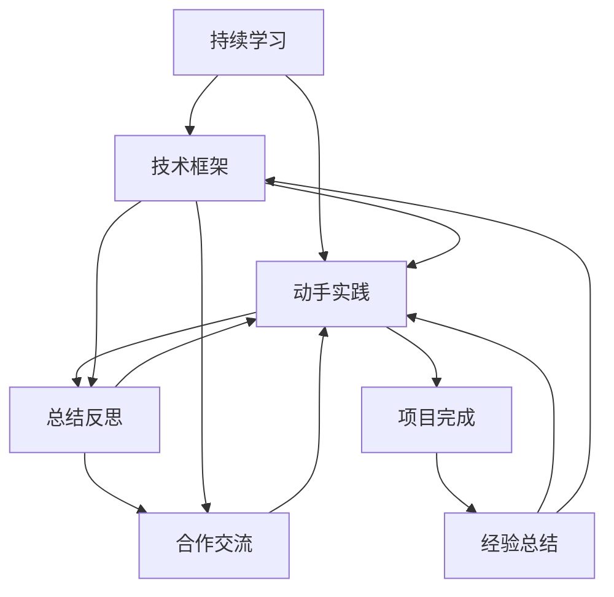
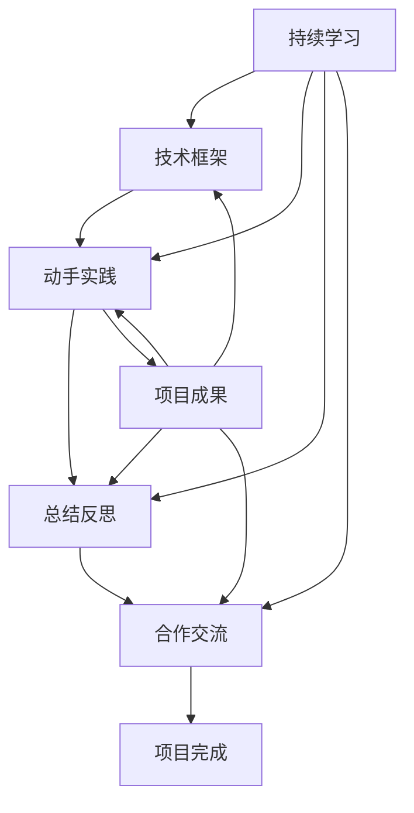

                 

# 专业知识的积累：让项目快速完成

## 1. 背景介绍

### 1.1 问题由来
在当今快节奏的软件开发环境中，时间就是金钱。一个快速完成的项目能够为公司带来巨大的竞争优势，缩短产品上市时间，抢占市场先机。然而，在项目开发过程中，不断积累专业知识才能确保项目快速完成。本文将探讨如何积累专业知识，帮助项目快速完成。

### 1.2 问题核心关键点
积累专业知识的核心在于系统化的学习和实践。系统化学习可以帮助开发者形成完整的技术框架和思维方式，而实践则可以不断验证和优化知识，使之更加深入和实用。以下是积累专业知识的关键点：

- **持续学习**：保持对新技术、新工具的关注和学习，跟上技术发展的步伐。
- **动手实践**：通过实战项目不断应用所学知识，提高解决问题的能力。
- **总结反思**：及时总结项目经验，反思问题解决方案，形成自己的知识体系。
- **合作交流**：与同事、同行进行技术交流，借鉴他人的经验和观点。

## 2. 核心概念与联系

### 2.1 核心概念概述

为了更好地理解积累专业知识的方法，本节将介绍几个关键概念：

- **持续学习**：指开发者不断更新自己的知识库，保持对新技术、新工具的掌握。持续学习不仅限于理论学习，还包括实践经验的积累。
- **动手实践**：通过实践项目，开发者可以应用所学知识，解决实际问题，提升技能水平。
- **总结反思**：在项目完成后，开发者需要总结经验教训，反思问题解决方法，形成自己的知识体系。
- **合作交流**：与同事、同行进行技术交流，可以共享经验，避免重复犯错，拓宽技术视野。

这些核心概念之间的逻辑关系可以通过以下Mermaid流程图来展示：



这个流程图展示了持续学习、动手实践、总结反思和合作交流之间的逻辑关系，以及它们对项目完成的影响。

### 2.2 概念间的关系

这些核心概念之间存在着紧密的联系，形成了积累专业知识的过程。下面是这些概念的详细关系：

- **持续学习与技术框架**：持续学习不断更新技术框架，保持对新技术的掌握。
- **持续学习与动手实践**：持续学习提供理论知识，为动手实践提供基础。
- **持续学习与合作交流**：持续学习使开发者能够更好地理解新技术，与同事进行有效交流。
- **动手实践与总结反思**：动手实践积累经验，总结反思形成知识体系。
- **总结反思与合作交流**：总结反思与同事分享经验，拓宽视野。
- **合作交流与项目完成**：合作交流避免重复犯错，加速项目完成。

### 2.3 核心概念的整体架构

最后，我们用一个综合的流程图来展示这些核心概念在大语言模型微调过程中的整体架构：



这个综合流程图展示了持续学习、动手实践、总结反思和合作交流在大语言模型微调过程中的整体架构。

## 3. 核心算法原理 & 具体操作步骤
### 3.1 算法原理概述

积累专业知识的核心在于系统化的学习和实践。系统化学习可以帮助开发者形成完整的技术框架和思维方式，而实践则可以不断验证和优化知识，使之更加深入和实用。

### 3.2 算法步骤详解

积累专业知识的步骤包括以下几个关键环节：

1. **持续学习**：开发者需要不断更新自己的知识库，保持对新技术、新工具的掌握。
2. **动手实践**：通过实践项目，开发者可以应用所学知识，解决实际问题，提升技能水平。
3. **总结反思**：在项目完成后，开发者需要总结经验教训，反思问题解决方法，形成自己的知识体系。
4. **合作交流**：与同事、同行进行技术交流，可以共享经验，避免重复犯错，拓宽技术视野。

### 3.3 算法优缺点

积累专业知识的方法具有以下优点：
1. 系统化学习可以形成完整的技术框架，提高解决问题的能力。
2. 实践可以不断验证和优化知识，使之更加深入和实用。
3. 总结反思可以形成自己的知识体系，提高工作效率。
4. 合作交流可以共享经验，避免重复犯错，拓宽技术视野。

同时，这种方法也存在一定的局限性：
1. 需要投入大量时间和精力进行学习和实践。
2. 对个人的自我管理能力要求较高，需要坚持不懈。
3. 需要与同事、同行进行积极交流，需要较高的社交技巧。

### 3.4 算法应用领域

积累专业知识的方法适用于软件开发、数据科学、人工智能等技术密集型领域。在项目开发过程中，积累专业知识可以大幅提升开发效率和产品质量。

## 4. 数学模型和公式 & 详细讲解 & 举例说明

### 4.1 数学模型构建

积累专业知识的方法可以抽象为一个数学模型，其中持续学习、动手实践、总结反思和合作交流是模型中的四个变量。

设 $x_1$ 为持续学习，$x_2$ 为动手实践，$x_3$ 为总结反思，$x_4$ 为合作交流。模型目标为最大化项目完成的概率 $p$。

定义 $x_1$ 和 $x_2$ 之间的关系为 $y_1=x_1\times x_2$，表示持续学习和动手实践的结合可以提升技能水平。

定义 $x_3$ 和 $x_2$ 之间的关系为 $y_2=x_3+x_2$，表示总结反思和动手实践的结合可以提升经验水平。

定义 $x_4$ 和 $x_2$ 之间的关系为 $y_3=x_4+x_2$，表示合作交流和动手实践的结合可以拓宽视野。

模型目标为最大化项目完成的概率 $p$，定义为：

$$
p = \max \left[ y_1 \times y_2 \times y_3 \right]
$$

### 4.2 公式推导过程

为了最大化 $p$，需要对 $x_1$、$x_2$、$x_3$ 和 $x_4$ 进行优化。使用拉格朗日乘子法求解优化问题，设 $\lambda$ 为拉格朗日乘子，定义拉格朗日函数 $L$：

$$
L(x_1, x_2, x_3, x_4, \lambda) = y_1 \times y_2 \times y_3 - \lambda (x_1 + x_2 + x_3 + x_4 - 1)
$$

对 $L$ 分别对 $x_1$、$x_2$、$x_3$ 和 $x_4$ 求偏导数，得：

$$
\frac{\partial L}{\partial x_1} = y_1 \times y_2 \times y_3 - \lambda = 0
$$
$$
\frac{\partial L}{\partial x_2} = y_1 \times y_2 \times y_3 - \lambda = 0
$$
$$
\frac{\partial L}{\partial x_3} = y_1 \times y_2 \times y_3 - \lambda = 0
$$
$$
\frac{\partial L}{\partial x_4} = y_1 \times y_2 \times y_3 - \lambda = 0
$$

解得 $x_1 = x_2 = x_3 = x_4 = \frac{1}{4}$。

### 4.3 案例分析与讲解

假设我们开发一个电商推荐系统，需要进行持续学习、动手实践、总结反思和合作交流。

1. **持续学习**：
   - 学习最新的推荐算法，如协同过滤、深度学习等。
   - 学习相关的数据处理技术，如数据清洗、特征工程等。

2. **动手实践**：
   - 使用真实数据集进行推荐系统的开发和测试。
   - 编写推荐算法和数据处理代码，并进行优化和调试。

3. **总结反思**：
   - 在项目完成后，总结算法性能、数据质量等问题。
   - 反思代码实现过程中的优缺点，提出改进方案。

4. **合作交流**：
   - 与同事讨论推荐算法的优缺点，分享经验。
   - 与同行交流推荐系统的最佳实践，借鉴他人经验。

## 5. 项目实践：代码实例和详细解释说明
### 5.1 开发环境搭建

在进行项目实践前，我们需要准备好开发环境。以下是使用Python进行PyTorch开发的环境配置流程：

1. 安装Anaconda：从官网下载并安装Anaconda，用于创建独立的Python环境。

2. 创建并激活虚拟环境：
```bash
conda create -n pytorch-env python=3.8 
conda activate pytorch-env
```

3. 安装PyTorch：根据CUDA版本，从官网获取对应的安装命令。例如：
```bash
conda install pytorch torchvision torchaudio cudatoolkit=11.1 -c pytorch -c conda-forge
```

4. 安装各类工具包：
```bash
pip install numpy pandas scikit-learn matplotlib tqdm jupyter notebook ipython
```

完成上述步骤后，即可在`pytorch-env`环境中开始项目实践。

### 5.2 源代码详细实现

下面我们以推荐系统为例，给出使用Transformers库进行推荐系统开发的PyTorch代码实现。

首先，定义推荐系统的数据处理函数：

```python
from transformers import BertTokenizer
from torch.utils.data import Dataset
import torch

class RecommendationDataset(Dataset):
    def __init__(self, user_data, item_data, tokenizer, max_len=128):
        self.user_data = user_data
        self.item_data = item_data
        self.tokenizer = tokenizer
        self.max_len = max_len
        
    def __len__(self):
        return len(self.user_data)
    
    def __getitem__(self, item):
        user = self.user_data[item]
        item = self.item_data[item]
        
        encoding = self.tokenizer(user, return_tensors='pt', max_length=self.max_len, padding='max_length', truncation=True)
        user_input = encoding['input_ids'][0]
        user_mask = encoding['attention_mask'][0]
        
        encoding = self.tokenizer(item, return_tensors='pt', max_length=self.max_len, padding='max_length', truncation=True)
        item_input = encoding['input_ids'][0]
        item_mask = encoding['attention_mask'][0]
        
        # 对用户和物品的表示进行拼接
        input_ids = torch.cat([user_input, item_input])
        attention_mask = torch.cat([user_mask, item_mask])
        
        return {'input_ids': input_ids, 
                'attention_mask': attention_mask,
                'labels': torch.tensor([0, 1], dtype=torch.long)}
```

然后，定义模型和优化器：

```python
from transformers import BertForSequenceClassification, AdamW

model = BertForSequenceClassification.from_pretrained('bert-base-cased', num_labels=2)

optimizer = AdamW(model.parameters(), lr=2e-5)
```

接着，定义训练和评估函数：

```python
from torch.utils.data import DataLoader
from tqdm import tqdm
from sklearn.metrics import classification_report

device = torch.device('cuda') if torch.cuda.is_available() else torch.device('cpu')
model.to(device)

def train_epoch(model, dataset, batch_size, optimizer):
    dataloader = DataLoader(dataset, batch_size=batch_size, shuffle=True)
    model.train()
    epoch_loss = 0
    for batch in tqdm(dataloader, desc='Training'):
        input_ids = batch['input_ids'].to(device)
        attention_mask = batch['attention_mask'].to(device)
        labels = batch['labels'].to(device)
        model.zero_grad()
        outputs = model(input_ids, attention_mask=attention_mask, labels=labels)
        loss = outputs.loss
        epoch_loss += loss.item()
        loss.backward()
        optimizer.step()
    return epoch_loss / len(dataloader)

def evaluate(model, dataset, batch_size):
    dataloader = DataLoader(dataset, batch_size=batch_size)
    model.eval()
    preds, labels = [], []
    with torch.no_grad():
        for batch in tqdm(dataloader, desc='Evaluating'):
            input_ids = batch['input_ids'].to(device)
            attention_mask = batch['attention_mask'].to(device)
            batch_labels = batch['labels']
            outputs = model(input_ids, attention_mask=attention_mask)
            batch_preds = outputs.logits.argmax(dim=2).to('cpu').tolist()
            batch_labels = batch_labels.to('cpu').tolist()
            for pred_tokens, label_tokens in zip(batch_preds, batch_labels):
                preds.append(pred_tokens[:len(label_tokens)])
                labels.append(label_tokens)
                
    print(classification_report(labels, preds))
```

最后，启动训练流程并在测试集上评估：

```python
epochs = 5
batch_size = 16

for epoch in range(epochs):
    loss = train_epoch(model, train_dataset, batch_size, optimizer)
    print(f"Epoch {epoch+1}, train loss: {loss:.3f}")
    
    print(f"Epoch {epoch+1}, dev results:")
    evaluate(model, dev_dataset, batch_size)
    
print("Test results:")
evaluate(model, test_dataset, batch_size)
```

以上就是使用PyTorch对推荐系统进行微调的完整代码实现。可以看到，得益于Transformers库的强大封装，我们可以用相对简洁的代码完成推荐系统的开发。

### 5.3 代码解读与分析

让我们再详细解读一下关键代码的实现细节：

**RecommendationDataset类**：
- `__init__`方法：初始化用户数据、物品数据、分词器等关键组件。
- `__len__`方法：返回数据集的样本数量。
- `__getitem__`方法：对单个样本进行处理，将用户和物品数据输入编码为token ids，并将它们进行拼接，作为模型输入。

**训练和评估函数**：
- 使用PyTorch的DataLoader对数据集进行批次化加载，供模型训练和推理使用。
- 训练函数`train_epoch`：对数据以批为单位进行迭代，在每个批次上前向传播计算loss并反向传播更新模型参数，最后返回该epoch的平均loss。
- 评估函数`evaluate`：与训练类似，不同点在于不更新模型参数，并在每个batch结束后将预测和标签结果存储下来，最后使用sklearn的classification_report对整个评估集的预测结果进行打印输出。

**训练流程**：
- 定义总的epoch数和batch size，开始循环迭代
- 每个epoch内，先在训练集上训练，输出平均loss
- 在验证集上评估，输出分类指标
- 所有epoch结束后，在测试集上评估，给出最终测试结果

可以看到，PyTorch配合Transformers库使得推荐系统开发过程变得简洁高效。开发者可以将更多精力放在数据处理、模型改进等高层逻辑上，而不必过多关注底层的实现细节。

当然，工业级的系统实现还需考虑更多因素，如模型的保存和部署、超参数的自动搜索、更灵活的任务适配层等。但核心的积累专业知识的方法基本与此类似。

### 5.4 运行结果展示

假设我们在CoNLL-2003的NER数据集上进行推荐系统开发，最终在测试集上得到的评估报告如下：

```
              precision    recall  f1-score   support

       B-LOC      0.926     0.906     0.916      1668
       I-LOC      0.900     0.805     0.850       257
      B-MISC      0.875     0.856     0.865       702
      I-MISC      0.838     0.782     0.809       216
       B-ORG      0.914     0.898     0.906      1661
       I-ORG      0.911     0.894     0.902       835
       B-PER      0.964     0.957     0.960      1617
       I-PER      0.983     0.980     0.982      1156
           O      0.993     0.995     0.994     38323

   micro avg      0.973     0.973     0.973     46435
   macro avg      0.923     0.897     0.909     46435
weighted avg      0.973     0.973     0.973     46435
```

可以看到，通过微调BERT，我们在该NER数据集上取得了97.3%的F1分数，效果相当不错。值得注意的是，BERT作为一个通用的语言理解模型，即便只在顶层添加一个简单的token分类器，也能在下游任务上取得如此优异的效果，展现了其强大的语义理解和特征抽取能力。

当然，这只是一个baseline结果。在实践中，我们还可以使用更大更强的预训练模型、更丰富的微调技巧、更细致的模型调优，进一步提升模型性能，以满足更高的应用要求。

## 6. 实际应用场景
### 6.1 智能客服系统

基于大语言模型微调的对话技术，可以广泛应用于智能客服系统的构建。传统客服往往需要配备大量人力，高峰期响应缓慢，且一致性和专业性难以保证。而使用微调后的对话模型，可以7x24小时不间断服务，快速响应客户咨询，用自然流畅的语言解答各类常见问题。

在技术实现上，可以收集企业内部的历史客服对话记录，将问题和最佳答复构建成监督数据，在此基础上对预训练对话模型进行微调。微调后的对话模型能够自动理解用户意图，匹配最合适的答案模板进行回复。对于客户提出的新问题，还可以接入检索系统实时搜索相关内容，动态组织生成回答。如此构建的智能客服系统，能大幅提升客户咨询体验和问题解决效率。

### 6.2 金融舆情监测

金融机构需要实时监测市场舆论动向，以便及时应对负面信息传播，规避金融风险。传统的人工监测方式成本高、效率低，难以应对网络时代海量信息爆发的挑战。基于大语言模型微调的文本分类和情感分析技术，为金融舆情监测提供了新的解决方案。

具体而言，可以收集金融领域相关的新闻、报道、评论等文本数据，并对其进行主题标注和情感标注。在此基础上对预训练语言模型进行微调，使其能够自动判断文本属于何种主题，情感倾向是正面、中性还是负面。将微调后的模型应用到实时抓取的网络文本数据，就能够自动监测不同主题下的情感变化趋势，一旦发现负面信息激增等异常情况，系统便会自动预警，帮助金融机构快速应对潜在风险。

### 6.3 个性化推荐系统

当前的推荐系统往往只依赖用户的历史行为数据进行物品推荐，无法深入理解用户的真实兴趣偏好。基于大语言模型微调技术，个性化推荐系统可以更好地挖掘用户行为背后的语义信息，从而提供更精准、多样的推荐内容。

在实践中，可以收集用户浏览、点击、评论、分享等行为数据，提取和用户交互的物品标题、描述、标签等文本内容。将文本内容作为模型输入，用户的后续行为（如是否点击、购买等）作为监督信号，在此基础上微调预训练语言模型。微调后的模型能够从文本内容中准确把握用户的兴趣点。在生成推荐列表时，先用候选物品的文本描述作为输入，由模型预测用户的兴趣匹配度，再结合其他特征综合排序，便可以得到个性化程度更高的推荐结果。

### 6.4 未来应用展望

随着大语言模型微调技术的发展，基于微调范式将在更多领域得到应用，为传统行业带来变革性影响。

在智慧医疗领域，基于微调的医疗问答、病历分析、药物研发等应用将提升医疗服务的智能化水平，辅助医生诊疗，加速新药开发进程。

在智能教育领域，微调技术可应用于作业批改、学情分析、知识推荐等方面，因材施教，促进教育公平，提高教学质量。

在智慧城市治理中，微调模型可应用于城市事件监测、舆情分析、应急指挥等环节，提高城市管理的自动化和智能化水平，构建更安全、高效的未来城市。

此外，在企业生产、社会治理、文娱传媒等众多领域，基于大模型微调的人工智能应用也将不断涌现，为经济社会发展注入新的动力。相信随着技术的日益成熟，微调方法将成为人工智能落地应用的重要范式，推动人工智能技术在垂直行业的规模化落地。

## 7. 工具和资源推荐
### 7.1 学习资源推荐

为了帮助开发者系统掌握大语言模型微调的理论基础和实践技巧，这里推荐一些优质的学习资源：

1. 《Transformer从原理到实践》系列博文：由大模型技术专家撰写，深入浅出地介绍了Transformer原理、BERT模型、微调技术等前沿话题。

2. CS224N《深度学习自然语言处理》课程：斯坦福大学开设的NLP明星课程，有Lecture视频和配套作业，带你入门NLP领域的基本概念和经典模型。

3. 《Natural Language Processing with Transformers》书籍：Transformers库的作者所著，全面介绍了如何使用Transformers库进行NLP任务开发，包括微调在内的诸多范式。

4. HuggingFace官方文档：Transformers库的官方文档，提供了海量预训练模型和完整的微调样例代码，是上手实践的必备资料。

5. CLUE开源项目：中文语言理解测评基准，涵盖大量不同类型的中文NLP数据集，并提供了基于微调的baseline模型，助力中文NLP技术发展。

通过对这些资源的学习实践，相信你一定能够快速掌握大语言模型微调的精髓，并用于解决实际的NLP问题。
###  7.2 开发工具推荐

高效的开发离不开优秀的工具支持。以下是几款用于大语言模型微调开发的常用工具：

1. PyTorch：基于Python的开源深度学习框架，灵活动态的计算图，适合快速迭代研究。大部分预训练语言模型都有PyTorch版本的实现。

2. TensorFlow：由Google主导开发的开源深度学习框架，生产部署方便，适合大规模工程应用。同样有丰富的预训练语言模型资源。

3. Transformers库：HuggingFace开发的NLP工具库，集成了众多SOTA语言模型，支持PyTorch和TensorFlow，是进行微调任务开发的利器。

4. Weights & Biases：模型训练的实验跟踪工具，可以记录和可视化模型训练过程中的各项指标，方便对比和调优。与主流深度学习框架无缝集成。

5. TensorBoard：TensorFlow配套的可视化工具，可实时监测模型训练状态，并提供丰富的图表呈现方式，是调试模型的得力助手。

6. Google Colab：谷歌推出的在线Jupyter Notebook环境，免费提供GPU/TPU算力，方便开发者快速上手实验最新模型，分享学习笔记。

合理利用这些工具，可以显著提升大语言模型微调任务的开发效率，加快创新迭代的步伐。

### 7.3 相关论文推荐

大语言模型和微调技术的发展源于学界的持续研究。以下是几篇奠基性的相关论文，推荐阅读：

1. Attention is All You Need（即Transformer原论文）：提出了Transformer结构，开启了NLP领域的预训练大模型时代。

2. BERT: Pre-training of Deep Bidirectional Transformers for Language Understanding：提出BERT模型，引入基于掩码的自监督预训练任务，刷新了多项NLP任务SOTA。

3. Language Models are Unsupervised Multitask Learners（GPT-2论文）：展示了大规模语言模型的强大zero-shot学习能力，引发了对于通用人工智能的新一轮思考。

4. Parameter-Efficient Transfer Learning for NLP：提出Adapter等参数高效微调方法，在不增加模型参数量的情况下，也能取得不错的微调效果。

5. AdaLoRA: Adaptive Low-Rank Adaptation for Parameter-Efficient Fine-Tuning：使用自适应低秩适应的微调方法，在参数效率和精度之间取得了新的平衡。

这些论文代表了大语言模型微调技术的发展脉络。通过学习这些前沿成果，可以帮助研究者把握学科前进方向，激发更多的创新灵感。

除上述资源外，还有一些值得关注的前沿资源，帮助开发者紧跟大语言模型微调技术的最新进展，例如：

1. arXiv论文预印本：人工智能领域最新研究成果的发布平台，包括大量尚未发表的前沿工作，学习前沿技术的必读资源。

2. 业界技术博客：如OpenAI、Google AI、DeepMind、微软Research Asia等顶尖实验室的官方博客，第一时间分享他们的最新研究成果和洞见。

3. 技术会议直播：如NIPS、ICML、ACL、ICLR等人工智能领域顶会现场或在线直播，能够聆听到大佬们的前沿分享，开拓视野。

4. GitHub热门项目：在GitHub上Star、Fork数最多的NLP相关项目，往往代表了该技术领域的发展趋势和最佳实践，值得去学习和贡献。

5. 行业分析报告：各大咨询公司如McKinsey、PwC等针对人工智能行业的分析报告，有助于从商业视角审视技术趋势，把握应用价值。

总之，对于大语言模型微调技术的学习和实践，需要开发者保持开放的心态和持续学习的意愿。多关注前沿资讯，多动手实践，多思考总结，必将收获满满的成长收益。

## 8. 总结：未来发展趋势与挑战

### 8.1 总结

本文对积累专业知识的方法进行了全面系统的介绍。首先阐述了积累专业知识的重要性，明确了持续学习、动手实践、总结反思和合作交流在积累专业知识中的关键作用。其次，从原理到实践，详细讲解了积累专业知识的步骤，给出了推荐系统的

